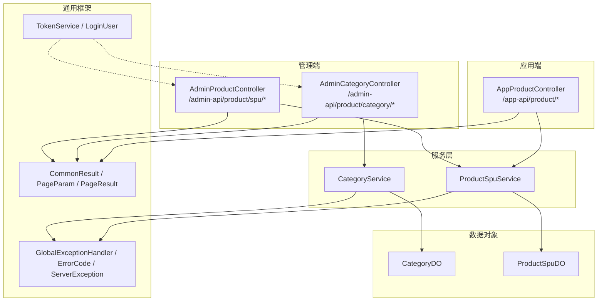
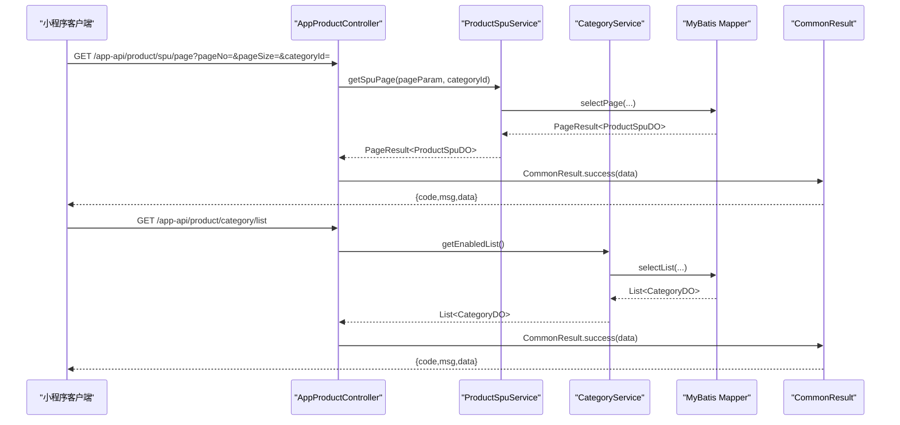
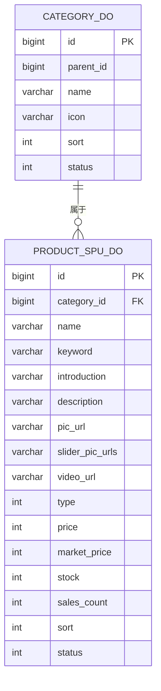
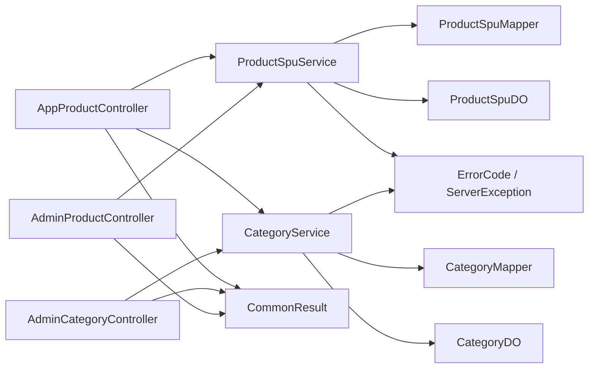

# API接口文档

<cite>
**本文档引用的文件**
- [AppProductController.java](file://shop-backend/shop-module-product/src/main/java/com/shop/module/product/controller/app/AppProductController.java)
- [AdminCategoryController.java](file://shop-backend/shop-module-product/src/main/java/com/shop/module/product/controller/admin/AdminCategoryController.java)
- [AdminProductController.java](file://shop-backend/shop-module-product/src/main/java/com/shop/module/product/controller/admin/AdminProductController.java)
- [CommonResult.java](file://shop-backend/shop-framework/shop-common/src/main/java/com/shop/common/pojo/CommonResult.java)
- [PageParam.java](file://shop-backend/shop-framework/shop-common/src/main/java/com/shop/common/pojo/PageParam.java)
- [PageResult.java](file://shop-backend/shop-framework/shop-common/src/main/java/com/shop/common/pojo/PageResult.java)
- [GlobalExceptionHandler.java](file://shop-backend/shop-framework/shop-common/src/main/java/com/shop/common/exception/GlobalExceptionHandler.java)
- [ErrorCode.java](file://shop-backend/shop-framework/shop-common/src/main/java/com/shop/common/exception/ErrorCode.java)
- [ServerException.java](file://shop-backend/shop-framework/shop-common/src/main/java/com/shop/common/exception/ServerException.java)
- [CategoryDO.java](file://shop-backend/shop-module-product/src/main/java/com/shop/module/product/dal/dataobject/CategoryDO.java)
- [ProductSpuDO.java](file://shop-backend/shop-module-product/src/main/java/com/shop/module/product/dal/dataobject/ProductSpuDO.java)
- [CategoryService.java](file://shop-backend/shop-module-product/src/main/java/com/shop/module/product/service/CategoryService.java)
- [ProductSpuService.java](file://shop-backend/shop-module-product/src/main/java/com/shop/module/product/service/ProductSpuService.java)
- [TokenService.java](file://shop-backend/shop-framework/shop-starter-security/src/main/java/com/shop/framework/security/TokenService.java)
- [LoginUser.java](file://shop-backend/shop-framework/shop-starter-security/src/main/java/com/shop/framework/security/LoginUser.java)
</cite>

## 目录
1. [简介](#简介)
2. [项目结构](#项目结构)
3. [核心组件](#核心组件)
4. [架构总览](#架构总览)
5. [详细组件分析](#详细组件分析)
6. [依赖分析](#依赖分析)
7. [性能考虑](#性能考虑)
8. [故障排除指南](#故障排除指南)
9. [结论](#结论)
10. [附录](#附录)

## 简介
本文件为“药食同源”微信小程序商城的API接口文档，覆盖应用端与管理端的核心接口，包括商品分类、商品列表、商品详情以及管理端的商品与分类管理接口。文档提供每个接口的HTTP方法、URL模式、请求参数、响应格式、状态码说明与错误处理策略，并给出认证方法、权限控制、安全考虑、版本管理、速率限制与性能优化建议。

## 项目结构
后端采用模块化设计，产品模块包含应用端控制器与管理端控制器，公共框架提供统一响应包装、分页模型、全局异常处理与安全能力（令牌服务）。前端小程序通过独立的API目录发起请求。

图表来源
- [AppProductController.java:15-38](file://shop-backend/shop-module-product/src/main/java/com/shop/module/product/controller/app/AppProductController.java#L15-L38)
- [AdminCategoryController.java:11-40](file://shop-backend/shop-module-product/src/main/java/com/shop/module/product/controller/admin/AdminCategoryController.java#L11-L40)
- [AdminProductController.java:11-40](file://shop-backend/shop-module-product/src/main/java/com/shop/module/product/controller/admin/AdminProductController.java#L11-L40)
- [CategoryService.java:11-39](file://shop-backend/shop-module-product/src/main/java/com/shop/module/product/service/CategoryService.java#L11-L39)
- [ProductSpuService.java:13-52](file://shop-backend/shop-module-product/src/main/java/com/shop/module/product/service/ProductSpuService.java#L13-L52)
- [CommonResult.java:8-33](file://shop-backend/shop-framework/shop-common/src/main/java/com/shop/common/pojo/CommonResult.java#L8-L33)
- [PageParam.java:7-11](file://shop-backend/shop-framework/shop-common/src/main/java/com/shop/common/pojo/PageParam.java#L7-L11)
- [PageResult.java:8-17](file://shop-backend/shop-framework/shop-common/src/main/java/com/shop/common/pojo/PageResult.java#L8-L17)
- [GlobalExceptionHandler.java:8-23](file://shop-backend/shop-framework/shop-common/src/main/java/com/shop/common/exception/GlobalExceptionHandler.java#L8-L23)
- [ErrorCode.java:8-25](file://shop-backend/shop-framework/shop-common/src/main/java/com/shop/common/exception/ErrorCode.java#L8-L25)
- [TokenService.java:10-46](file://shop-backend/shop-framework/shop-starter-security/src/main/java/com/shop/framework/security/TokenService.java#L10-L46)

章节来源
- [AppProductController.java:15-38](file://shop-backend/shop-module-product/src/main/java/com/shop/module/product/controller/app/AppProductController.java#L15-L38)
- [AdminCategoryController.java:11-40](file://shop-backend/shop-module-product/src/main/java/com/shop/module/product/controller/admin/AdminCategoryController.java#L11-L40)
- [AdminProductController.java:11-40](file://shop-backend/shop-module-product/src/main/java/com/shop/module/product/controller/admin/AdminProductController.java#L11-L40)

## 核心组件
- 统一响应包装：所有接口返回统一结构，包含状态码、消息与数据体。
- 分页模型：提供默认页码与页大小，支持后台分页查询。
- 全局异常处理：将业务异常映射为标准错误码，系统异常返回内部错误。
- 安全框架：基于Redis的Token服务，提供登录态校验与注销。

章节来源
- [CommonResult.java:8-33](file://shop-backend/shop-framework/shop-common/src/main/java/com/shop/common/pojo/CommonResult.java#L8-L33)
- [PageParam.java:7-11](file://shop-backend/shop-framework/shop-common/src/main/java/com/shop/common/pojo/PageParam.java#L7-L11)
- [PageResult.java:8-17](file://shop-backend/shop-framework/shop-common/src/main/java/com/shop/common/pojo/PageResult.java#L8-L17)
- [GlobalExceptionHandler.java:8-23](file://shop-backend/shop-framework/shop-common/src/main/java/com/shop/common/exception/GlobalExceptionHandler.java#L8-L23)
- [ErrorCode.java:8-25](file://shop-backend/shop-framework/shop-common/src/main/java/com/shop/common/exception/ErrorCode.java#L8-L25)
- [TokenService.java:10-46](file://shop-backend/shop-framework/shop-starter-security/src/main/java/com/shop/framework/security/TokenService.java#L10-L46)

## 架构总览
应用端与管理端通过REST控制器暴露接口，服务层负责业务逻辑与数据访问，统一响应包装与异常处理贯穿始终；管理端接口依赖安全框架进行登录态校验。

图表来源
- [AppProductController.java:23-37](file://shop-backend/shop-module-product/src/main/java/com/shop/module/product/controller/app/AppProductController.java#L23-L37)
- [ProductSpuService.java:19-25](file://shop-backend/shop-module-product/src/main/java/com/shop/module/product/service/ProductSpuService.java#L19-L25)
- [CategoryService.java:17-21](file://shop-backend/shop-module-product/src/main/java/com/shop/module/product/service/CategoryService.java#L17-L21)
- [CommonResult.java:15-21](file://shop-backend/shop-framework/shop-common/src/main/java/com/shop/common/pojo/CommonResult.java#L15-L21)

## 详细组件分析

### 应用端接口

#### 商品分类列表（GET /app-api/product/category/list）
- 功能描述：获取启用状态的商品分类列表，按排序字段降序排列。
- 请求方式：GET
- URL：/app-api/product/category/list
- 请求参数：无
- 响应数据：列表类型，元素为分类对象
- 状态码：200 成功；其他由全局异常处理器映射
- 错误处理：业务异常映射到标准错误码，系统异常返回内部错误
- 调用示例：GET /app-api/product/category/list

章节来源
- [AppProductController.java:23-26](file://shop-backend/shop-module-product/src/main/java/com/shop/module/product/controller/app/AppProductController.java#L23-L26)
- [CategoryService.java:17-21](file://shop-backend/shop-module-product/src/main/java/com/shop/module/product/service/CategoryService.java#L17-L21)

#### 商品分页列表（GET /app-api/product/spu/page）
- 功能描述：分页获取上架商品，可按分类筛选，按排序字段降序排列。
- 请求方式：GET
- URL：/app-api/product/spu/page
- 查询参数：
  - pageNo：页码，默认1
  - pageSize：每页条数，默认10
  - categoryId：可选，分类ID
- 响应数据：分页结果，包含列表与总数
- 状态码：200 成功；其他由全局异常处理器映射
- 错误处理：业务异常映射到标准错误码，系统异常返回内部错误
- 调用示例：GET /app-api/product/spu/page?pageNo=1&pageSize=10&categoryId=1

章节来源
- [AppProductController.java:28-32](file://shop-backend/shop-module-product/src/main/java/com/shop/module/product/controller/app/AppProductController.java#L28-L32)
- [ProductSpuService.java:19-25](file://shop-backend/shop-module-product/src/main/java/com/shop/module/product/service/ProductSpuService.java#L19-L25)
- [PageParam.java:7-11](file://shop-backend/shop-framework/shop-common/src/main/java/com/shop/common/pojo/PageParam.java#L7-L11)
- [PageResult.java:8-17](file://shop-backend/shop-framework/shop-common/src/main/java/com/shop/common/pojo/PageResult.java#L8-L17)

#### 商品详情（GET /app-api/product/spu/detail）
- 功能描述：根据ID获取商品详情，不存在时抛出业务异常。
- 请求方式：GET
- URL：/app-api/product/spu/detail
- 查询参数：
  - id：商品ID（必填）
- 响应数据：商品SPU对象
- 状态码：200 成功；404 商品不存在；其他由全局异常处理器映射
- 错误处理：业务异常映射到标准错误码，系统异常返回内部错误
- 调用示例：GET /app-api/product/spu/detail?id=1

章节来源
- [AppProductController.java:34-37](file://shop-backend/shop-module-product/src/main/java/com/shop/module/product/controller/app/AppProductController.java#L34-L37)
- [ProductSpuService.java:27-33](file://shop-backend/shop-module-product/src/main/java/com/shop/module/product/service/ProductSpuService.java#L27-L33)

### 管理端接口

#### 分类管理接口
- 列表（GET /admin-api/product/category/list）
  - 请求参数：无
  - 响应数据：全部分类列表
  - 状态码：200 成功；其他由全局异常处理器映射
  - 调用示例：GET /admin-api/product/category/list

- 新增（POST /admin-api/product/category/create）
  - 请求体：分类对象（JSON）
  - 响应数据：布尔值（true）
  - 状态码：200 成功；其他由全局异常处理器映射
  - 调用示例：POST /admin-api/product/category/create

- 修改（PUT /admin-api/product/category/update）
  - 请求体：分类对象（JSON）
  - 响应数据：布尔值（true）
  - 状态码：200 成功；其他由全局异常处理器映射
  - 调用示例：PUT /admin-api/product/category/update

- 删除（DELETE /admin-api/product/category/delete）
  - 查询参数：id（Long）
  - 响应数据：布尔值（true）
  - 状态码：200 成功；其他由全局异常处理器映射
  - 调用示例：DELETE /admin-api/product/category/delete?id=1

章节来源
- [AdminCategoryController.java:18-39](file://shop-backend/shop-module-product/src/main/java/com/shop/module/product/controller/admin/AdminCategoryController.java#L18-L39)
- [CategoryService.java:28-38](file://shop-backend/shop-module-product/src/main/java/com/shop/module/product/service/CategoryService.java#L28-L38)

#### 商品管理接口
- 分页（GET /admin-api/product/spu/page）
  - 查询参数：pageNo、pageSize
  - 响应数据：分页结果（按创建时间倒序）
  - 状态码：200 成功；其他由全局异常处理器映射
  - 调用示例：GET /admin-api/product/spu/page?pageNo=1&pageSize=10

- 新增（POST /admin-api/product/spu/create）
  - 请求体：SPU对象（JSON）
  - 响应数据：布尔值（true）
  - 状态码：200 成功；其他由全局异常处理器映射
  - 调用示例：POST /admin-api/product/spu/create

- 修改（PUT /admin-api/product/spu/update）
  - 请求体：SPU对象（JSON）
  - 响应数据：布尔值（true）
  - 状态码：200 成功；其他由全局异常处理器映射
  - 调用示例：PUT /admin-api/product/spu/update

- 删除（DELETE /admin-api/product/spu/delete）
  - 查询参数：id（Long）
  - 响应数据：布尔值（true）
  - 状态码：200 成功；其他由全局异常处理器映射
  - 调用示例：DELETE /admin-api/product/spu/delete?id=1

章节来源
- [AdminProductController.java:18-39](file://shop-backend/shop-module-product/src/main/java/com/shop/module/product/controller/admin/AdminProductController.java#L18-L39)
- [ProductSpuService.java:35-51](file://shop-backend/shop-module-product/src/main/java/com/shop/module/product/service/ProductSpuService.java#L35-L51)
- [PageParam.java:7-11](file://shop-backend/shop-framework/shop-common/src/main/java/com/shop/common/pojo/PageParam.java#L7-L11)

### 数据模型

图表来源
- [CategoryDO.java:10-22](file://shop-backend/shop-module-product/src/main/java/com/shop/module/product/dal/dataobject/CategoryDO.java#L10-L22)
- [ProductSpuDO.java:10-32](file://shop-backend/shop-module-product/src/main/java/com/shop/module/product/dal/dataobject/ProductSpuDO.java#L10-L32)

章节来源
- [CategoryDO.java:10-22](file://shop-backend/shop-module-product/src/main/java/com/shop/module/product/dal/dataobject/CategoryDO.java#L10-L22)
- [ProductSpuDO.java:10-32](file://shop-backend/shop-module-product/src/main/java/com/shop/module/product/dal/dataobject/ProductSpuDO.java#L10-L32)

## 依赖分析
- 控制器依赖服务层，服务层依赖Mapper与数据对象。
- 统一响应包装与异常处理在框架层提供，所有控制器均使用。
- 管理端接口依赖安全框架进行登录态校验（具体过滤器配置未在当前上下文展示，但TokenService提供令牌生成、读取与删除能力）。

图表来源
- [AppProductController.java:15-38](file://shop-backend/shop-module-product/src/main/java/com/shop/module/product/controller/app/AppProductController.java#L15-L38)
- [AdminCategoryController.java:11-40](file://shop-backend/shop-module-product/src/main/java/com/shop/module/product/controller/admin/AdminCategoryController.java#L11-L40)
- [AdminProductController.java:11-40](file://shop-backend/shop-module-product/src/main/java/com/shop/module/product/controller/admin/AdminProductController.java#L11-L40)
- [CategoryService.java:11-39](file://shop-backend/shop-module-product/src/main/java/com/shop/module/product/service/CategoryService.java#L11-L39)
- [ProductSpuService.java:13-52](file://shop-backend/shop-module-product/src/main/java/com/shop/module/product/service/ProductSpuService.java#L13-L52)
- [CommonResult.java:8-33](file://shop-backend/shop-framework/shop-common/src/main/java/com/shop/common/pojo/CommonResult.java#L8-L33)
- [ErrorCode.java:8-25](file://shop-backend/shop-framework/shop-common/src/main/java/com/shop/common/exception/ErrorCode.java#L8-L25)

章节来源
- [CategoryService.java:11-39](file://shop-backend/shop-module-product/src/main/java/com/shop/module/product/service/CategoryService.java#L11-L39)
- [ProductSpuService.java:13-52](file://shop-backend/shop-module-product/src/main/java/com/shop/module/product/service/ProductSpuService.java#L13-L52)

## 性能考虑
- 分页查询：应用端与管理端均使用分页参数，避免一次性加载大量数据。
- 排序策略：按sort或创建时间倒序，减少前端二次排序开销。
- 缓存建议：对分类列表与热门商品详情可引入Redis缓存，降低数据库压力。
- 并发控制：热点接口增加限流与熔断，防止突发流量击穿系统。
- 数据传输：统一响应包装便于前端统一处理，减少重复判断逻辑。

## 故障排除指南
- 常见错误码
  - 0：成功
  - 400：请求参数错误
  - 401：未登录
  - 403：无权限
  - 404：资源不存在
  - 500：系统异常
  - 业务错误（示例）：1001 用户不存在；1002 Token已过期；1101 商品不存在；1102 商品已下架
- 异常处理流程
  - 业务异常：捕获ServerException，返回对应错误码与消息
  - 系统异常：捕获Exception，返回内部错误
- 排查步骤
  - 检查请求参数是否符合分页模型与必填项
  - 确认商品状态与分类状态
  - 核对管理端登录态与权限

章节来源
- [ErrorCode.java:8-25](file://shop-backend/shop-framework/shop-common/src/main/java/com/shop/common/exception/ErrorCode.java#L8-L25)
- [GlobalExceptionHandler.java:12-22](file://shop-backend/shop-framework/shop-common/src/main/java/com/shop/common/exception/GlobalExceptionHandler.java#L12-L22)
- [ServerException.java:6-19](file://shop-backend/shop-framework/shop-common/src/main/java/com/shop/common/exception/ServerException.java#L6-L19)

## 结论
本API文档覆盖了应用端与管理端的核心接口，明确了请求方式、参数、响应格式与错误处理策略。结合统一响应与异常处理机制，能够为小程序前端与管理后台提供稳定可靠的接口支持。建议在生产环境中配合安全过滤器、限流与缓存策略进一步提升安全性与性能。

## 附录

### 认证与权限
- 管理端接口依赖登录态校验（令牌机制），通过TokenService生成与解析令牌。
- 登录成功后，前端需在后续请求中携带令牌以访问受保护接口。
- 建议在网关或过滤器层实现统一鉴权与权限拦截。

章节来源
- [TokenService.java:19-45](file://shop-backend/shop-framework/shop-starter-security/src/main/java/com/shop/framework/security/TokenService.java#L19-L45)
- [LoginUser.java:6-9](file://shop-backend/shop-framework/shop-starter-security/src/main/java/com/shop/framework/security/LoginUser.java#L6-L9)

### 版本管理
- 建议在URL中加入版本前缀（如/v1），便于未来演进与向后兼容。
- 当前接口路径已采用/app-api与/admin-api区分环境，可在此基础上扩展版本号。

### 速率限制与安全
- 速率限制：对应用端高频接口（如商品列表、详情）设置QPS限制，超限返回429或重试策略。
- 安全考虑：管理端接口必须鉴权；敏感操作（新增/修改/删除）建议开启二次确认与审计日志。
- 传输安全：建议启用HTTPS，令牌存储与传输加密，避免明文泄露。