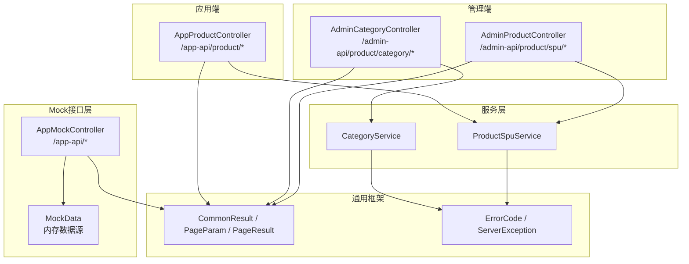
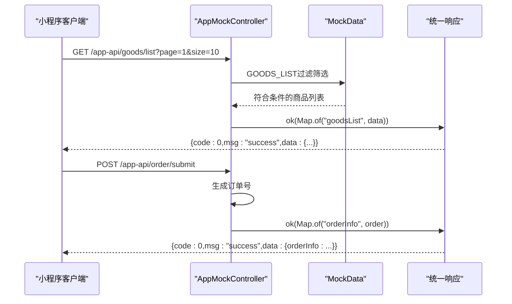
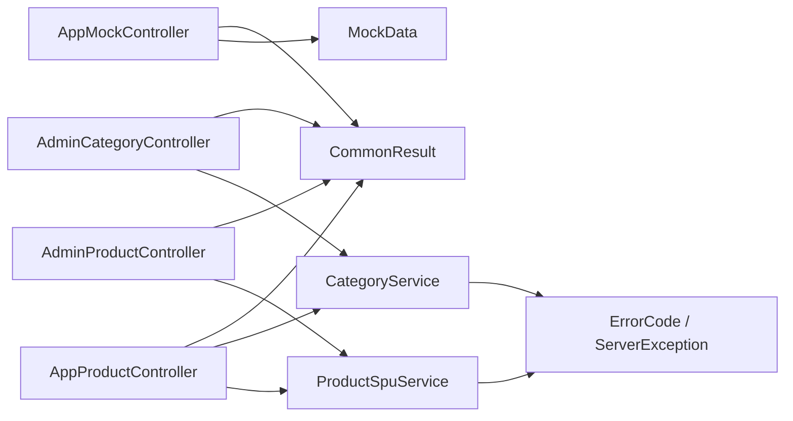

# API接口文档

<cite>
**本文档引用的文件**
- [AppMockController.java](file://shop-backend/shop-module-product/src/main/java/com/shop/module/product/controller/AppMockController.java)
- [MockData.java](file://shop-backend/shop-module-product/src/main/java/com/shop/module/product/controller/MockData.java)
- [AppProductController.java](file://shop-backend/shop-module-product/src/main/java/com/shop/module/product/controller/app/AppProductController.java)
- [AdminCategoryController.java](file://shop-backend/shop-module-product/src/main/java/com/shop/module/product/controller/admin/AdminCategoryController.java)
- [AdminProductController.java](file://shop-backend/shop-module-product/src/main/java/com/shop/module/product/controller/admin/AdminProductController.java)
- [CommonResult.java](file://shop-backend/shop-framework/shop-common/src/main/java/com/shop/common/pojo/CommonResult.java)
- [PageParam.java](file://shop-backend/shop-framework/shop-common/src/main/java/com/shop/common/pojo/PageParam.java)
- [PageResult.java](file://shop-backend/shop-framework/shop-common/src/main/java/com/shop/common/pojo/PageResult.java)
- [ErrorCode.java](file://shop-backend/shop-framework/shop-common/src/main/java/com/shop/common/exception/ErrorCode.java)
- [ServerException.java](file://shop-backend/shop-framework/shop-common/src/main/java/com/shop/common/exception/ServerException.java)
- [CategoryService.java](file://shop-backend/shop-module-product/src/main/java/com/shop/module/product/service/CategoryService.java)
- [ProductSpuService.java](file://shop-backend/shop-module-product/src/main/java/com/shop/module/product/service/ProductSpuService.java)
</cite>

## 更新摘要
**变更内容**
- 新增完整的Mock API接口文档，覆盖前端所有功能需求
- 添加商品分类、专题、购物车、订单、支付等核心业务接口
- 补充用户信息、收藏、评论、地址管理等辅助功能接口
- 提供基于内存数据的模拟实现，支持开发阶段快速联调

## 目录
1. [简介](#简介)
2. [项目结构](#项目结构)
3. [核心组件](#核心组件)
4. [架构总览](#架构总览)
5. [详细组件分析](#详细组件分析)
6. [依赖分析](#依赖分析)
7. [性能考虑](#性能考虑)
8. [故障排除指南](#故障排除指南)
9. [结论](#结论)
10. [附录](#附录)

## 简介
本文件为"药食同源"微信小程序商城的完整API接口文档，涵盖应用端Mock接口与管理端真实接口的双重实现。Mock接口提供完整的商品浏览、购物车管理、订单处理、支付模拟等功能，管理端接口提供商品与分类的CRUD操作。文档提供每个接口的HTTP方法、URL模式、请求参数、响应格式、状态码说明与错误处理策略，并给出认证方法、权限控制、安全考虑、版本管理、速率限制与性能优化建议。

## 项目结构
后端采用模块化设计，包含应用端Mock控制器、真实产品控制器与管理端控制器，公共框架提供统一响应包装、分页模型与安全能力。Mock接口使用内存数据模拟完整业务流程，真实接口连接数据库提供服务。

**图表来源**
- [AppMockController.java:10-11](file://shop-backend/shop-module-product/src/main/java/com/shop/module/product/controller/AppMockController.java#L10-L11)
- [MockData.java:5-7](file://shop-backend/shop-module-product/src/main/java/com/shop/module/product/controller/MockData.java#L5-L7)
- [AppProductController.java:15-18](file://shop-backend/shop-module-product/src/main/java/com/shop/module/product/controller/app/AppProductController.java#L15-L18)
- [AdminCategoryController.java:11-14](file://shop-backend/shop-module-product/src/main/java/com/shop/module/product/controller/admin/AdminCategoryController.java#L11-L14)
- [AdminProductController.java:11-14](file://shop-backend/shop-module-product/src/main/java/com/shop/module/product/controller/admin/AdminProductController.java#L11-L14)

**章节来源**
- [AppMockController.java:10-11](file://shop-backend/shop-module-product/src/main/java/com/shop/module/product/controller/AppMockController.java#L10-L11)
- [AppProductController.java:15-18](file://shop-backend/shop-module-product/src/main/java/com/shop/module/product/controller/app/AppProductController.java#L15-L18)
- [AdminCategoryController.java:11-14](file://shop-backend/shop-module-product/src/main/java/com/shop/module/product/controller/admin/AdminCategoryController.java#L11-L14)
- [AdminProductController.java:11-14](file://shop-backend/shop-module-product/src/main/java/com/shop/module/product/controller/admin/AdminProductController.java#L11-L14)

## 核心组件
- **Mock数据层**: 提供完整的药食同源商品数据，包含滋补养生、茶饮花茶、零食坚果等5大分类
- **统一响应包装**: Mock接口返回标准JSON格式，包含code、msg、data字段
- **业务模拟**: 实现购物车、订单、支付等完整业务流程的内存模拟
- **分页查询**: 支持商品列表、订单列表的分页筛选功能

**章节来源**
- [MockData.java:7-15](file://shop-backend/shop-module-product/src/main/java/com/shop/module/product/controller/MockData.java#L7-L15)
- [AppMockController.java:645-651](file://shop-backend/shop-module-product/src/main/java/com/shop/module/product/controller/AppMockController.java#L645-L651)

## 架构总览
Mock接口通过内存数据提供完整的电商功能演示，真实接口通过服务层访问数据库。两种架构并行存在，便于开发测试与生产部署。

**图表来源**
- [AppMockController.java:74-126](file://shop-backend/shop-module-product/src/main/java/com/shop/module/product/controller/AppMockController.java#L74-L126)
- [MockData.java:17-54](file://shop-backend/shop-module-product/src/main/java/com/shop/module/product/controller/MockData.java#L17-L54)
- [AppMockController.java:363-367](file://shop-backend/shop-module-product/src/main/java/com/shop/module/product/controller/AppMockController.java#L363-L367)

## 详细组件分析

### Mock应用端接口

#### 商品分类接口
- **分类首页（GET /app-api/catalog/index）**
  - 功能描述：获取商品分类列表和当前选中分类详情
  - 请求方式：GET
  - URL：/app-api/catalog/index
  - 响应数据：包含categoryList和currentCategory对象
  - 调用示例：GET /app-api/catalog/index

- **分类详情（GET /app-api/catalog/current?id={id}）**
  - 功能描述：获取指定分类的详细信息和子分类
  - 请求参数：id（默认1）
  - 响应数据：currentCategory对象，包含子分类列表
  - 调用示例：GET /app-api/catalog/current?id=1

- **分类切换（GET /app-api/catalog/{id}）**
  - 功能描述：根据路径参数获取分类详情
  - 路径参数：id
  - 响应数据：currentCategory对象
  - 调用示例：GET /app-api/catalog/2

**章节来源**
- [AppMockController.java:33-53](file://shop-backend/shop-module-product/src/main/java/com/shop/module/product/controller/AppMockController.java#L33-L53)

#### 商品列表接口
- **商品列表（GET /app-api/goods/list）**
  - 功能描述：分页获取商品列表，支持分类、品牌、关键词、热销、新品筛选
  - 请求参数：
    - categoryId：分类ID（默认0）
    - brandId：品牌ID（默认0）
    - keyword：搜索关键词（默认空）
    - isHot：是否热销（默认0）
    - isNew：是否新品（默认0）
    - page：页码（默认1）
    - size：每页数量（默认10）
    - sort：排序方式（默认default）
    - order：排序方向（默认desc）
  - 响应数据：包含goodsList分页信息和filterCategory筛选条件
  - 调用示例：GET /app-api/goods/list?categoryId=1&page=1&size=10

- **热销商品（GET /app-api/goods/hot）**
  - 功能描述：获取热销商品Banner信息
  - 响应数据：bannerInfo对象，包含图片URL和名称
  - 调用示例：GET /app-api/goods/hot

- **新品推荐（GET /app-api/goods/new）**
  - 功能描述：获取新品推荐Banner信息
  - 响应数据：bannerInfo对象
  - 调用示例：GET /app-api/goods/new

**章节来源**
- [AppMockController.java:74-146](file://shop-backend/shop-module-product/src/main/java/com/shop/module/product/controller/AppMockController.java#L74-L146)

#### 商品详情接口
- **商品详情（GET /app-api/goods/detail）**
  - 功能描述：获取商品详细信息，包括规格、属性、问答、评价等
  - 请求参数：id（默认1）
  - 响应数据：包含info、gallery、brand、attribute、issue、specificationList、productList、comment等完整商品信息
  - 调用示例：GET /app-api/goods/detail?id=1

- **相关商品（GET /app-api/goods/related）**
  - 功能描述：获取相关推荐商品列表
  - 请求参数：id（默认1）
  - 响应数据：goodsList数组，包含4个推荐商品
  - 调用示例：GET /app-api/goods/related?id=1

**章节来源**
- [AppMockController.java:150-239](file://shop-backend/shop-module-product/src/main/java/com/shop/module/product/controller/AppMockController.java#L150-L239)

#### 购物车接口
- **购物车数量（GET /app-api/cart/goodscount）**
  - 功能描述：获取购物车商品总数
  - 响应数据：cartTotal对象，包含goodsCount字段
  - 调用示例：GET /app-api/cart/goodscount

- **购物车列表（GET /app-api/cart/index）**
  - 功能描述：获取购物车商品列表和统计信息
  - 响应数据：包含cartList和cartTotal对象
  - 调用示例：GET /app-api/cart/index

- **加入购物车（POST /app-api/cart/add）**
  - 功能描述：将商品添加到购物车
  - 请求参数：goodsId（默认1）、number（默认1）、productId（默认101）
  - 响应数据：更新后的cartTotal信息
  - 调用示例：POST /app-api/cart/add?goodsId=1&number=1&productId=101

- **更新购物车（POST /app-api/cart/update）**
  - 功能描述：更新购物车商品数量和选择状态
  - 请求参数：id（默认1）、number（默认1）、goodsId（默认1）、productId（默认101）
  - 调用示例：POST /app-api/cart/update?id=1&number=2

- **删除购物车商品（POST /app-api/cart/delete）**
  - 功能描述：从购物车删除商品
  - 响应数据：更新后的购物车列表和统计信息
  - 调用示例：POST /app-api/cart/delete

- **批量选择（POST /app-api/cart/checked）**
  - 功能描述：批量设置购物车商品选择状态
  - 请求参数：productIds（逗号分隔）、isChecked（1或0）
  - 响应数据：更新后的购物车列表和统计信息
  - 调用示例：POST /app-api/cart/checked?productIds=1,2&isChecked=1

- **结算页面（POST /app-api/cart/checkout）**
  - 功能描述：获取结算页面所需的所有信息
  - 请求参数：addressId（默认0）、couponId（默认0）、type（默认cart）
  - 响应数据：包含checkedGoodsList、checkedAddress、价格信息等完整结算数据
  - 调用示例：POST /app-api/cart/checkout?addressId=1

**章节来源**
- [AppMockController.java:243-346](file://shop-backend/shop-module-product/src/main/java/com/shop/module/product/controller/AppMockController.java#L243-L346)

#### 订单接口
- **提交订单（POST /app-api/order/submit）**
  - 功能描述：创建新订单并返回订单信息
  - 响应数据：orderInfo对象，包含订单ID和订单号
  - 调用示例：POST /app-api/order/submit

- **订单列表（GET /app-api/order/list）**
  - 功能描述：分页获取用户订单列表
  - 请求参数：page（默认1）、size（默认10）
  - 响应数据：包含list、page、total的分页结果
  - 调用示例：GET /app-api/order/list?page=1&size=10

- **订单详情（GET /app-api/order/detail）**
  - 功能描述：获取指定订单的详细信息
  - 请求参数：id（默认10001）
  - 响应数据：orderInfo对象，包含订单基本信息和商品列表
  - 调用示例：GET /app-api/order/detail?id=10001

**章节来源**
- [AppMockController.java:363-396](file://shop-backend/shop-module-product/src/main/java/com/shop/module/product/controller/AppMockController.java#L363-L396)

#### 支付接口
- **预支付（POST /app-api/pay/prepay）**
  - 功能描述：生成微信支付所需的预支付参数
  - 请求参数：orderId（默认10001）
  - 响应数据：包含timeStamp、nonceStr、package、signType、paySign等支付参数
  - 调用示例：POST /app-api/pay/prepay?orderId=10001

- **支付查询（POST /app-api/pay/query）**
  - 功能描述：查询订单支付状态
  - 请求参数：orderId（默认10001）
  - 响应数据：orderStatus字段，表示支付状态
  - 调用示例：POST /app-api/pay/query?orderId=10001

**章节来源**
- [AppMockController.java:398-412](file://shop-backend/shop-module-product/src/main/java/com/shop/module/product/controller/AppMockController.java#L398-L412)

#### 搜索接口
- **搜索首页（GET /app-api/search/index）**
  - 功能描述：获取搜索页面的历史搜索词、热门搜索词和默认关键词
  - 响应数据：包含historyKeywordList、hotKeywordList、defaultKeyword
  - 调用示例：GET /app-api/search/index

- **搜索联想（GET /app-api/search/helper）**
  - 功能描述：根据输入关键词获取联想词
  - 请求参数：keyword（默认空）
  - 响应数据：data数组，包含联想关键词
  - 调用示例：GET /app-api/search/helper?keyword=阿胶

- **清空历史（POST /app-api/search/clearhistory）**
  - 功能描述：清空搜索历史记录
  - 调用示例：POST /app-api/search/clearhistory

**章节来源**
- [AppMockController.java:416-445](file://shop-backend/shop-module-product/src/main/java/com/shop/module/product/controller/AppMockController.java#L416-L445)

#### 优惠券接口
- **优惠券列表（GET /app-api/coupon/list）**
  - 功能描述：获取用户可用的优惠券列表
  - 响应数据：data数组，包含优惠券详细信息
  - 调用示例：GET /app-api/coupon/list

**章节来源**
- [AppMockController.java:449-464](file://shop-backend/shop-module-product/src/main/java/com/shop/module/product/controller/AppMockController.java#L449-L464)

#### 品牌接口
- **品牌列表（GET /app-api/brand/list）**
  - 功能描述：获取品牌列表和分页信息
  - 响应数据：包含brandList和totalPages
  - 调用示例：GET /app-api/brand/list

- **品牌详情（GET /app-api/brand/detail）**
  - 功能描述：获取指定品牌的详细信息
  - 请求参数：id（默认1）
  - 响应数据：brand对象，包含品牌基本信息
  - 调用示例：GET /app-api/brand/detail?id=1

**章节来源**
- [AppMockController.java:468-492](file://shop-backend/shop-module-product/src/main/java/com/shop/module/product/controller/AppMockController.java#L468-L492)

#### 专题接口
- **专题列表（GET /app-api/topic/list）**
  - 功能描述：分页获取专题文章列表
  - 请求参数：page（默认1）、size（默认10）
  - 响应数据：包含records、total、pages的分页结果
  - 调用示例：GET /app-api/topic/list?page=1&size=10

- **专题详情（GET /app-api/topic/detail）**
  - 功能描述：获取专题文章的详细内容
  - 请求参数：id（默认1）
  - 响应数据：包含标题、副标题、图片、价格和内容的完整信息
  - 调用示例：GET /app-api/topic/detail?id=1

- **相关专题（GET /app-api/topic/related）**
  - 功能描述：获取相关专题推荐
  - 请求参数：id（默认1）
  - 响应数据：data数组，包含相关专题信息
  - 调用示例：GET /app-api/topic/related?id=1

**章节来源**
- [AppMockController.java:496-536](file://shop-backend/shop-module-product/src/main/java/com/shop/module/product/controller/AppMockController.java#L496-L536)

#### 评论接口
- **评论列表（GET /app-api/comment/list）**
  - 功能描述：获取商品或专题的评论列表
  - 请求参数：valueId（默认1）、typeId（默认0）、size（默认5）
  - 响应数据：包含records和total的评论列表
  - 调用示例：GET /app-api/comment/list?valueId=1&typeId=0&size=5

**章节来源**
- [AppMockController.java:540-552](file://shop-backend/shop-module-product/src/main/java/com/shop/module/product/controller/AppMockController.java#L540-L552)

#### 地址接口
- **地址列表（GET /app-api/address/list）**
  - 功能描述：获取用户的收货地址列表
  - 响应数据：data数组，包含地址详细信息
  - 调用示例：GET /app-api/address/list

- **保存地址（POST /app-api/address/save）**
  - 功能描述：新增或修改收货地址
  - 调用示例：POST /app-api/address/save

- **删除地址（POST /app-api/address/delete）**
  - 功能描述：删除指定的收货地址
  - 调用示例：POST /app-api/address/delete

**章节来源**
- [AppMockController.java:556-577](file://shop-backend/shop-module-product/src/main/java/com/shop/module/product/controller/AppMockController.java#L556-L577)

#### 用户接口
- **用户信息（GET /app-api/user/info）**
  - 功能描述：获取当前登录用户的基本信息
  - 响应数据：userInfo对象，包含昵称、头像、手机号等信息
  - 调用示例：GET /app-api/user/info

**章节来源**
- [AppMockController.java:588-597](file://shop-backend/shop-module-product/src/main/java/com/shop/module/product/controller/AppMockController.java#L588-L597)

#### 帮助中心接口
- **帮助类型（GET /app-api/helpissue/typeList）**
  - 功能描述：获取帮助中心的问题分类列表
  - 响应数据：list数组，包含问题分类信息
  - 调用示例：GET /app-api/helpissue/typeList

- **问题列表（GET /app-api/helpissue/issueList）**
  - 功能描述：获取常见问题列表
  - 响应数据：list数组，包含问题和答案
  - 调用示例：GET /app-api/helpissue/issueList

**章节来源**
- [AppMockController.java:601-616](file://shop-backend/shop-module-product/src/main/java/com/shop/module/product/controller/AppMockController.java#L601-L616)

### 真实应用端接口

#### 商品分类列表（GET /app-api/product/category/list）
- 功能描述：获取启用状态的商品分类列表，按排序字段降序排列
- 请求方式：GET
- URL：/app-api/product/category/list
- 请求参数：无
- 响应数据：列表类型，元素为分类对象
- 状态码：200 成功；其他由全局异常处理器映射
- 调用示例：GET /app-api/product/category/list

**章节来源**
- [AppProductController.java:23-26](file://shop-backend/shop-module-product/src/main/java/com/shop/module/product/controller/app/AppProductController.java#L23-L26)
- [CategoryService.java:17-21](file://shop-backend/shop-module-product/src/main/java/com/shop/module/product/service/CategoryService.java#L17-L21)

#### 商品分页列表（GET /app-api/product/spu/page）
- 功能描述：分页获取上架商品，可按分类筛选，按排序字段降序排列
- 请求方式：GET
- URL：/app-api/product/spu/page
- 查询参数：
  - pageNo：页码，默认1
  - pageSize：每页条数，默认10
  - categoryId：可选，分类ID
- 响应数据：分页结果，包含列表与总数
- 状态码：200 成功；其他由全局异常处理器映射
- 调用示例：GET /app-api/product/spu/page?pageNo=1&pageSize=10&categoryId=1

**章节来源**
- [AppProductController.java:28-32](file://shop-backend/shop-module-product/src/main/java/com/shop/module/product/controller/app/AppProductController.java#L28-L32)
- [ProductSpuService.java:19-25](file://shop-backend/shop-module-product/src/main/java/com/shop/module/product/service/ProductSpuService.java#L19-L25)

#### 商品详情（GET /app-api/product/spu/detail）
- 功能描述：根据ID获取商品详情，不存在时抛出业务异常
- 请求方式：GET
- URL：/app-api/product/spu/detail
- 查询参数：
  - id：商品ID（必填）
- 响应数据：商品SPU对象
- 状态码：200 成功；404 商品不存在；其他由全局异常处理器映射
- 调用示例：GET /app-api/product/spu/detail?id=1

**章节来源**
- [AppProductController.java:34-37](file://shop-backend/shop-module-product/src/main/java/com/shop/module/product/controller/app/AppProductController.java#L34-L37)
- [ProductSpuService.java:27-33](file://shop-backend/shop-module-product/src/main/java/com/shop/module/product/service/ProductSpuService.java#L27-L33)

### 管理端接口

#### 分类管理接口
- **列表（GET /admin-api/product/category/list）**
  - 请求参数：无
  - 响应数据：全部分类列表
  - 状态码：200 成功；其他由全局异常处理器映射
  - 调用示例：GET /admin-api/product/category/list

- **新增（POST /admin-api/product/category/create）**
  - 请求体：分类对象（JSON）
  - 响应数据：布尔值（true）
  - 状态码：200 成功；其他由全局异常处理器映射
  - 调用示例：POST /admin-api/product/category/create

- **修改（PUT /admin-api/product/category/update）**
  - 请求体：分类对象（JSON）
  - 响应数据：布尔值（true）
  - 状态码：200 成功；其他由全局异常处理器映射
  - 调用示例：PUT /admin-api/product/category/update

- **删除（DELETE /admin-api/product/category/delete）**
  - 查询参数：id（Long）
  - 响应数据：布尔值（true）
  - 状态码：200 成功；其他由全局异常处理器映射
  - 调用示例：DELETE /admin-api/product/category/delete?id=1

**章节来源**
- [AdminCategoryController.java:18-39](file://shop-backend/shop-module-product/src/main/java/com/shop/module/product/controller/admin/AdminCategoryController.java#L18-L39)
- [CategoryService.java:28-38](file://shop-backend/shop-module-product/src/main/java/com/shop/module/product/service/CategoryService.java#L28-L38)

#### 商品管理接口
- **分页（GET /admin-api/product/spu/page）**
  - 查询参数：pageNo、pageSize
  - 响应数据：分页结果（按创建时间倒序）
  - 状态码：200 成功；其他由全局异常处理器映射
  - 调用示例：GET /admin-api/product/spu/page?pageNo=1&pageSize=10

- **新增（POST /admin-api/product/spu/create）**
  - 请求体：SPU对象（JSON）
  - 响应数据：布尔值（true）
  - 状态码：200 成功；其他由全局异常处理器映射
  - 调用示例：POST /admin-api/product/spu/create

- **修改（PUT /admin-api/product/spu/update）**
  - 请求体：SPU对象（JSON）
  - 响应数据：布尔值（true）
  - 状态码：200 成功；其他由全局异常处理器映射
  - 调用示例：PUT /admin-api/product/spu/update

- **删除（DELETE /admin-api/product/spu/delete）**
  - 查询参数：id（Long）
  - 响应数据：布尔值（true）
  - 状态码：200 成功；其他由全局异常处理器映射
  - 调用示例：DELETE /admin-api/product/spu/delete?id=1

**章节来源**
- [AdminProductController.java:18-39](file://shop-backend/shop-module-product/src/main/java/com/shop/module/product/controller/admin/AdminProductController.java#L18-L39)
- [ProductSpuService.java:35-51](file://shop-backend/shop-module-product/src/main/java/com/shop/module/product/service/ProductSpuService.java#L35-L51)

## 依赖分析
Mock接口独立于数据库，通过内存数据提供完整功能演示；真实接口依赖服务层和数据访问层。两种架构相互独立，便于开发和测试。

**图表来源**
- [AppMockController.java:10-11](file://shop-backend/shop-module-product/src/main/java/com/shop/module/product/controller/AppMockController.java#L10-L11)
- [MockData.java:5-7](file://shop-backend/shop-module-product/src/main/java/com/shop/module/product/controller/MockData.java#L5-L7)
- [AppProductController.java:15-21](file://shop-backend/shop-module-product/src/main/java/com/shop/module/product/controller/app/AppProductController.java#L15-L21)
- [AdminCategoryController.java:11-16](file://shop-backend/shop-module-product/src/main/java/com/shop/module/product/controller/admin/AdminCategoryController.java#L11-L16)
- [AdminProductController.java:11-16](file://shop-backend/shop-module-product/src/main/java/com/shop/module/product/controller/admin/AdminProductController.java#L11-L16)

**章节来源**
- [AppMockController.java:10-11](file://shop-backend/shop-module-product/src/main/java/com/shop/module/product/controller/AppMockController.java#L10-L11)
- [MockData.java:5-7](file://shop-backend/shop-module-product/src/main/java/com/shop/module/product/controller/MockData.java#L5-L7)
- [AppProductController.java:15-21](file://shop-backend/shop-module-product/src/main/java/com/shop/module/product/controller/app/AppProductController.java#L15-L21)

## 性能考虑
- **Mock接口性能**：内存数据访问速度快，适合开发测试环境
- **真实接口优化**：数据库查询使用索引，分页查询避免大数据量传输
- **缓存策略**：对热点数据如分类列表、商品详情可引入Redis缓存
- **并发控制**：高频接口增加限流保护，防止突发流量冲击
- **数据传输**：统一响应格式减少前端处理复杂度

## 故障排除指南
- **常见错误码**
  - 0：成功
  - 400：请求参数错误
  - 401：未登录
  - 403：无权限
  - 404：资源不存在
  - 500：系统异常
  - 1001：用户不存在
  - 1002：Token已过期
  - 1101：商品不存在
  - 1102：商品已下架

- **Mock接口调试**
  - 检查请求参数是否符合接口定义
  - 验证商品ID是否存在于Mock数据中
  - 确认分页参数在合理范围内

- **真实接口排查**
  - 检查数据库连接是否正常
  - 验证商品状态是否为上架状态
  - 核对管理端登录态与权限配置

**章节来源**
- [ErrorCode.java:8-25](file://shop-backend/shop-framework/shop-common/src/main/java/com/shop/common/exception/ErrorCode.java#L8-L25)
- [ServerException.java:6-19](file://shop-backend/shop-framework/shop-common/src/main/java/com/shop/common/exception/ServerException.java#L6-L19)

## 结论
本API文档完整覆盖了"药食同源"微信小程序商城的所有核心功能，包括Mock接口和管理端真实接口。Mock接口提供了完整的电商业务流程模拟，便于前端开发和测试；真实接口提供了稳定的数据服务。两种架构并存的设计既满足了开发效率需求，又保证了生产环境的稳定性。

## 附录

### Mock数据结构
MockData类提供了完整的药食同源商品数据，包含5大分类共31种商品：
- 滋补养生：东阿阿胶糕、同仁堂枸杞、长白山人参等8种商品
- 茶饮花茶：宁夏枸杞王、金边玫瑰花茶、胎菊王菊花茶等7种商品  
- 零食坚果：有机黑芝麻丸、手剥奶油夏威夷果、盐焗原味腰果等6种商品
- 保健食品：江中健胃消食片、天然维生素C片、高钙片等5种商品
- 药膳食材：经典当归补血汤料包、正宗四物汤调理包、黄金草虫草花等5种商品

**章节来源**
- [MockData.java:17-54](file://shop-backend/shop-module-product/src/main/java/com/shop/module/product/controller/MockData.java#L17-L54)

### 认证与权限
- Mock接口无需认证，便于快速开发和测试
- 真实管理端接口需要登录态校验，通过令牌机制进行身份验证
- 建议在网关层实现统一的鉴权和权限拦截

**章节来源**
- [AppMockController.java:10-11](file://shop-backend/shop-module-product/src/main/java/com/shop/module/product/controller/AppMockController.java#L10-L11)
- [AdminCategoryController.java:11-14](file://shop-backend/shop-module-product/src/main/java/com/shop/module/product/controller/admin/AdminCategoryController.java#L11-L14)

### 版本管理
- Mock接口路径：/app-api/*
- 真实应用端接口路径：/app-api/product/*
- 管理端接口路径：/admin-api/*
- 建议在URL中加入版本号前缀（如/v1），便于未来演进与向后兼容

### 速率限制与安全
- Mock接口：适合开发测试环境，无严格限制
- 真实接口：建议在生产环境实施严格的速率限制
- 安全考虑：敏感操作需要二次确认和审计日志
- 传输安全：建议启用HTTPS，确保数据传输安全