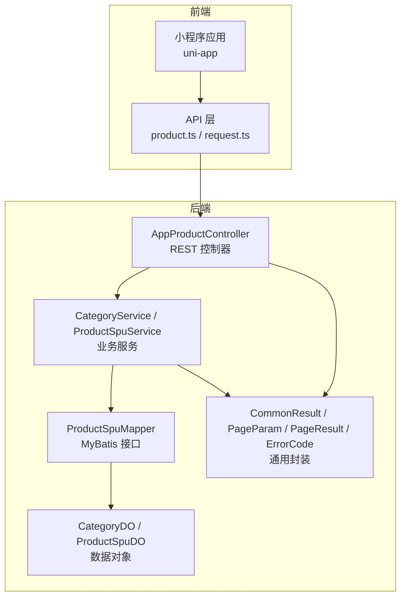
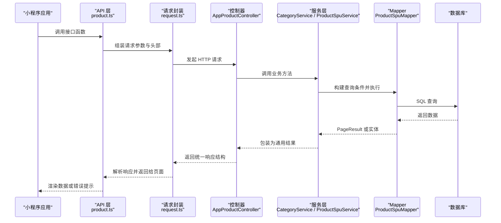
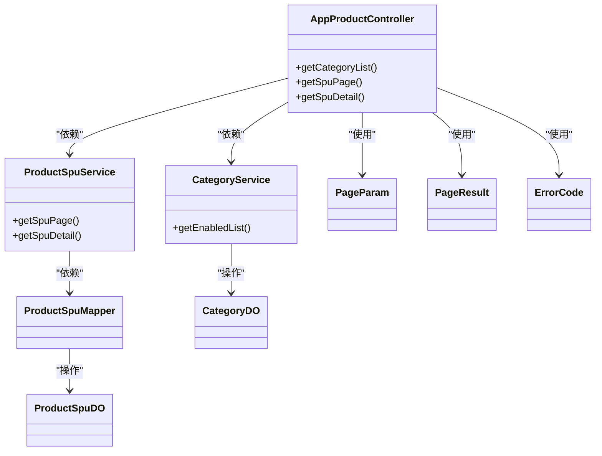

# 应用端API接口

<cite>
**本文引用的文件**
- [AppProductController.java](file://shop-backend/shop-module-product/src/main/java/com/shop/module/product/controller/app/AppProductController.java)
- [CategoryService.java](file://shop-backend/shop-module-product/src/main/java/com/shop/module/product/service/CategoryService.java)
- [ProductSpuService.java](file://shop-backend/shop-module-product/src/main/java/com/shop/module/product/service/ProductSpuService.java)
- [ProductSpuMapper.java](file://shop-backend/shop-module-product/src/main/java/com/shop/module/product/dal/mysql/ProductSpuMapper.java)
- [CategoryDO.java](file://shop-backend/shop-module-product/src/main/java/com/shop/module/product/dal/dataobject/CategoryDO.java)
- [ProductSpuDO.java](file://shop-backend/shop-module-product/src/main/java/com/shop/module/product/dal/dataobject/ProductSpuDO.java)
- [PageParam.java](file://shop-backend/shop-framework/shop-common/src/main/java/com/shop/common/pojo/PageParam.java)
- [PageResult.java](file://shop-backend/shop-framework/shop-common/src/main/java/com/shop/common/pojo/PageResult.java)
- [ErrorCode.java](file://shop-backend/shop-framework/shop-common/src/main/java/com/shop/common/exception/ErrorCode.java)
- [product.ts](file://shop-miniapp/src/api/product.ts)
- [request.ts](file://shop-miniapp/src/api/request.ts)
</cite>

## 目录
1. [简介](#简介)
2. [项目结构](#项目结构)
3. [核心组件](#核心组件)
4. [架构总览](#架构总览)
5. [详细组件分析](#详细组件分析)
6. [依赖分析](#依赖分析)
7. [性能考虑](#性能考虑)
8. [故障排查指南](#故障排查指南)
9. [结论](#结论)
10. [附录](#附录)

## 简介
本文件为“药食同源”微信小程序应用端的商品相关API接口文档，覆盖以下三个接口：
- 商品分类列表接口：GET /app-api/product/category/list
- 商品分页查询接口：GET /app-api/product/spu/page
- 商品详情接口：GET /app-api/product/spu/detail

文档从接口设计、数据模型、错误码与状态码、调用流程、参数校验、分页实践与性能优化等方面进行系统化说明，并提供可视化图示帮助理解。

## 项目结构
后端采用模块化分层架构，前端使用 uni-app + TypeScript 调用后端接口。关键目录与职责如下：
- 后端
  - shop-module-product：商品模块，包含控制器、服务、数据对象与持久层
  - shop-framework/shop-common：通用结果封装、分页参数与异常码
- 前端
  - shop-miniapp/src/api：封装请求与接口方法

图表来源
- [AppProductController.java:1-39](file://shop-backend/shop-module-product/src/main/java/com/shop/module/product/controller/app/AppProductController.java#L1-L39)
- [CategoryService.java:1-40](file://shop-backend/shop-module-product/src/main/java/com/shop/module/product/service/CategoryService.java#L1-L40)
- [ProductSpuService.java:1-53](file://shop-backend/shop-module-product/src/main/java/com/shop/module/product/service/ProductSpuService.java#L1-L53)
- [ProductSpuMapper.java:1-10](file://shop-backend/shop-module-product/src/main/java/com/shop/module/product/dal/mysql/ProductSpuMapper.java#L1-L10)
- [CategoryDO.java:1-23](file://shop-backend/shop-module-product/src/main/java/com/shop/module/product/dal/dataobject/CategoryDO.java#L1-L23)
- [ProductSpuDO.java:1-33](file://shop-backend/shop-module-product/src/main/java/com/shop/module/product/dal/dataobject/ProductSpuDO.java#L1-L33)
- [PageParam.java:1-12](file://shop-backend/shop-framework/shop-common/src/main/java/com/shop/common/pojo/PageParam.java#L1-L12)
- [PageResult.java:1-18](file://shop-backend/shop-framework/shop-common/src/main/java/com/shop/common/pojo/PageResult.java#L1-L18)
- [ErrorCode.java:1-26](file://shop-backend/shop-framework/shop-common/src/main/java/com/shop/common/exception/ErrorCode.java#L1-L26)
- [product.ts:1-42](file://shop-miniapp/src/api/product.ts#L1-L42)
- [request.ts:1-48](file://shop-miniapp/src/api/request.ts#L1-L48)

章节来源
- [AppProductController.java:1-39](file://shop-backend/shop-module-product/src/main/java/com/shop/module/product/controller/app/AppProductController.java#L1-L39)
- [product.ts:1-42](file://shop-miniapp/src/api/product.ts#L1-L42)
- [request.ts:1-48](file://shop-miniapp/src/api/request.ts#L1-L48)

## 核心组件
- 接口控制器：AppProductController 提供三类接口，分别对应分类列表、SPU 分页与详情
- 业务服务：
  - CategoryService：按启用状态获取分类列表
  - ProductSpuService：按分页与可选分类筛选查询 SPU 列表；按 ID 查询 SPU 详情
- 数据访问：
  - ProductSpuMapper：基于 MyBatis 的基础 Mapper 扩展
- 数据对象：
  - CategoryDO：商品分类实体
  - ProductSpuDO：SPU 实体（含价格单位、状态、排序等）
- 通用封装：
  - PageParam：分页参数（默认页码与每页大小）
  - PageResult：分页结果（列表与总数）
  - ErrorCode：统一错误码枚举（包含商品相关业务错误）

章节来源
- [AppProductController.java:1-39](file://shop-backend/shop-module-product/src/main/java/com/shop/module/product/controller/app/AppProductController.java#L1-L39)
- [CategoryService.java:1-40](file://shop-backend/shop-module-product/src/main/java/com/shop/module/product/service/CategoryService.java#L1-L40)
- [ProductSpuService.java:1-53](file://shop-backend/shop-module-product/src/main/java/com/shop/module/product/service/ProductSpuService.java#L1-L53)
- [ProductSpuMapper.java:1-10](file://shop-backend/shop-module-product/src/main/java/com/shop/module/product/dal/mysql/ProductSpuMapper.java#L1-L10)
- [CategoryDO.java:1-23](file://shop-backend/shop-module-product/src/main/java/com/shop/module/product/dal/dataobject/CategoryDO.java#L1-L23)
- [ProductSpuDO.java:1-33](file://shop-backend/shop-module-product/src/main/java/com/shop/module/product/dal/dataobject/ProductSpuDO.java#L1-L33)
- [PageParam.java:1-12](file://shop-backend/shop-framework/shop-common/src/main/java/com/shop/common/pojo/PageParam.java#L1-L12)
- [PageResult.java:1-18](file://shop-backend/shop-framework/shop-common/src/main/java/com/shop/common/pojo/PageResult.java#L1-L18)
- [ErrorCode.java:1-26](file://shop-backend/shop-framework/shop-common/src/main/java/com/shop/common/exception/ErrorCode.java#L1-L26)

## 架构总览
下面以序列图展示从前端到后端的关键调用链路与数据流转。

图表来源
- [product.ts:1-42](file://shop-miniapp/src/api/product.ts#L1-L42)
- [request.ts:1-48](file://shop-miniapp/src/api/request.ts#L1-L48)
- [AppProductController.java:1-39](file://shop-backend/shop-module-product/src/main/java/com/shop/module/product/controller/app/AppProductController.java#L1-L39)
- [CategoryService.java:1-40](file://shop-backend/shop-module-product/src/main/java/com/shop/module/product/service/CategoryService.java#L1-L40)
- [ProductSpuService.java:1-53](file://shop-backend/shop-module-product/src/main/java/com/shop/module/product/service/ProductSpuService.java#L1-L53)
- [ProductSpuMapper.java:1-10](file://shop-backend/shop-module-product/src/main/java/com/shop/module/product/dal/mysql/ProductSpuMapper.java#L1-L10)

## 详细组件分析

### 商品分类列表接口
- 接口描述：获取启用状态的商品分类列表，按 sort 字段降序排列
- HTTP 方法与路径：GET /app-api/product/category/list
- 请求参数：无
- 响应数据结构：通用结果包装，data 为 CategoryDO 数组
- 关键字段说明（CategoryDO）
  - id：分类主键
  - parentId：父级分类
  - name：分类名称
  - icon：图标链接
  - sort：排序权重
  - status：状态（1=启用）
- 状态码与错误处理
  - 成功：code=0
  - 失败：根据 ErrorCode 枚举返回相应 code 与 msg
- 参数验证规则
  - 无需参数，直接调用
- 性能优化建议
  - 建议在前端缓存分类列表，减少重复请求
  - 后端已按 sort 降序预排，避免前端二次排序
- 调用示例（路径参考）
  - [getCategoryList():28-30](file://shop-miniapp/src/api/product.ts#L28-L30)
  - [getEnabledList():17-21](file://shop-backend/shop-module-product/src/main/java/com/shop/module/product/service/CategoryService.java#L17-L21)

章节来源
- [AppProductController.java:23-26](file://shop-backend/shop-module-product/src/main/java/com/shop/module/product/controller/app/AppProductController.java#L23-L26)
- [CategoryService.java:17-21](file://shop-backend/shop-module-product/src/main/java/com/shop/module/product/service/CategoryService.java#L17-L21)
- [CategoryDO.java:1-23](file://shop-backend/shop-module-product/src/main/java/com/shop/module/product/dal/dataobject/CategoryDO.java#L1-L23)
- [ErrorCode.java:1-26](file://shop-backend/shop-framework/shop-common/src/main/java/com/shop/common/exception/ErrorCode.java#L1-L26)
- [product.ts:28-30](file://shop-miniapp/src/api/product.ts#L28-L30)

### 商品分页查询接口
- 接口描述：分页查询 SPU 列表，支持按 categoryId 过滤；仅返回状态为上架的商品
- HTTP 方法与路径：GET /app-api/product/spu/page
- 请求参数
  - pageNo：页码，默认 1
  - pageSize：每页数量，默认 10
  - categoryId：可选，分类 ID
- 响应数据结构：通用结果包装，data 为 PageResult<ProductSpuDO>
  - list：当前页商品列表
  - total：总数
- 关键字段说明（ProductSpuDO）
  - id：SPU 主键
  - categoryId：分类 ID
  - name：商品名称
  - introduction：简介
  - picUrl：封面图
  - price：单价（单位：分）
  - marketPrice：市场价（分）
  - salesCount：销量
  - status：状态（1=上架）
  - sort：排序权重
- 状态码与错误处理
  - 成功：code=0
  - 其他：根据 ErrorCode 枚举返回
- 参数验证规则
  - pageNo、pageSize 遵循 PageParam 默认值
  - categoryId 为可选 Long 类型
- 分页查询最佳实践
  - 使用 PageParam 的默认值作为安全边界
  - 前端滚动加载时递增 pageNo
  - 对 categoryId 传入空值时忽略过滤
- 性能优化建议
  - 后端已按 sort 降序排序，避免额外排序开销
  - 建议对 categoryId 与 status 建立索引
- 调用示例（路径参考）
  - [getProductPage():32-37](file://shop-miniapp/src/api/product.ts#L32-L37)
  - [getSpuPage():19-25](file://shop-backend/shop-module-product/src/main/java/com/shop/module/product/service/ProductSpuService.java#L19-L25)
  - [PageParam:8-11](file://shop-backend/shop-framework/shop-common/src/main/java/com/shop/common/pojo/PageParam.java#L8-L11)
  - [PageResult:9-17](file://shop-backend/shop-framework/shop-common/src/main/java/com/shop/common/pojo/PageResult.java#L9-L17)

章节来源
- [AppProductController.java:28-32](file://shop-backend/shop-module-product/src/main/java/com/shop/module/product/controller/app/AppProductController.java#L28-L32)
- [ProductSpuService.java:19-25](file://shop-backend/shop-module-product/src/main/java/com/shop/module/product/service/ProductSpuService.java#L19-L25)
- [ProductSpuDO.java:1-33](file://shop-backend/shop-module-product/src/main/java/com/shop/module/product/dal/dataobject/ProductSpuDO.java#L1-L33)
- [PageParam.java:8-11](file://shop-backend/shop-framework/shop-common/src/main/java/com/shop/common/pojo/PageParam.java#L8-L11)
- [PageResult.java:9-17](file://shop-backend/shop-framework/shop-common/src/main/java/com/shop/common/pojo/PageResult.java#L9-L17)
- [product.ts:32-37](file://shop-miniapp/src/api/product.ts#L32-L37)

### 商品详情接口
- 接口描述：根据 SPU ID 获取详情
- HTTP 方法与路径：GET /app-api/product/spu/detail
- 请求参数
  - id：Long，SPU 主键
- 响应数据结构：通用结果包装，data 为 ProductSpuDO
- 错误处理
  - 若商品不存在，抛出业务异常，返回对应错误码
- 参数验证规则
  - id 必填且为 Long 类型
- 性能优化建议
  - 建议在前端缓存热门商品详情，减少重复请求
  - 后端按主键查询，命中数据库索引
- 调用示例（路径参考）
  - [getProductDetail():39-41](file://shop-miniapp/src/api/product.ts#L39-L41)
  - [getSpuDetail():27-33](file://shop-backend/shop-module-product/src/main/java/com/shop/module/product/service/ProductSpuService.java#L27-L33)
  - [ErrorCode.PRODUCT_NOT_EXISTS](file://shop-backend/shop-framework/shop-common/src/main/java/com/shop/common/exception/ErrorCode.java#L20)

章节来源
- [AppProductController.java:34-37](file://shop-backend/shop-module-product/src/main/java/com/shop/module/product/controller/app/AppProductController.java#L34-L37)
- [ProductSpuService.java:27-33](file://shop-backend/shop-module-product/src/main/java/com/shop/module/product/service/ProductSpuService.java#L27-L33)
- [ProductSpuDO.java:1-33](file://shop-backend/shop-module-product/src/main/java/com/shop/module/product/dal/dataobject/ProductSpuDO.java#L1-L33)
- [ErrorCode.java:1-26](file://shop-backend/shop-framework/shop-common/src/main/java/com/shop/common/exception/ErrorCode.java#L1-L26)
- [product.ts:39-41](file://shop-miniapp/src/api/product.ts#L39-L41)

## 依赖分析
- 控制器依赖服务层，服务层依赖 Mapper，Mapper 操作 DO 实体
- 通用封装（CommonResult、PageParam、PageResult、ErrorCode）贯穿前后端
- 前端通过 request.ts 统一发起请求并处理鉴权头与错误提示

图表来源
- [AppProductController.java:1-39](file://shop-backend/shop-module-product/src/main/java/com/shop/module/product/controller/app/AppProductController.java#L1-L39)
- [CategoryService.java:1-40](file://shop-backend/shop-module-product/src/main/java/com/shop/module/product/service/CategoryService.java#L1-L40)
- [ProductSpuService.java:1-53](file://shop-backend/shop-module-product/src/main/java/com/shop/module/product/service/ProductSpuService.java#L1-L53)
- [ProductSpuMapper.java:1-10](file://shop-backend/shop-module-product/src/main/java/com/shop/module/product/dal/mysql/ProductSpuMapper.java#L1-L10)
- [CategoryDO.java:1-23](file://shop-backend/shop-module-product/src/main/java/com/shop/module/product/dal/dataobject/CategoryDO.java#L1-L23)
- [ProductSpuDO.java:1-33](file://shop-backend/shop-module-product/src/main/java/com/shop/module/product/dal/dataobject/ProductSpuDO.java#L1-L33)
- [PageParam.java:1-12](file://shop-backend/shop-framework/shop-common/src/main/java/com/shop/common/pojo/PageParam.java#L1-L12)
- [PageResult.java:1-18](file://shop-backend/shop-framework/shop-common/src/main/java/com/shop/common/pojo/PageResult.java#L1-L18)
- [ErrorCode.java:1-26](file://shop-backend/shop-framework/shop-common/src/main/java/com/shop/common/exception/ErrorCode.java#L1-L26)

## 性能考虑
- 查询优化
  - SPU 列表按 sort 降序，减少前端二次排序成本
  - 支持按 categoryId 过滤，建议在数据库建立复合索引
- 缓存策略
  - 分类列表与热门商品详情建议前端缓存
  - 可结合本地存储与失效时间控制
- 分页实践
  - 使用 PageParam 默认值作为边界，避免过大页码与页大小
  - 滚动加载时增量请求，避免一次性拉取过多数据
- 网络与鉴权
  - request.ts 自动注入 Authorization 头，减少重复逻辑
  - 401 时自动清除本地 token 并提示登录

## 故障排查指南
- 常见错误码
  - 0：成功
  - 400：请求参数错误
  - 401：未登录/鉴权失败
  - 404：资源不存在
  - 500：系统异常
  - 1101：商品不存在（详情接口）
- 前端处理
  - request.ts 对 code=0 成功态直接透传 data
  - code=401 自动清理 token 并提示登录
  - 其他错误码统一 toast 提示
- 后端定位
  - 通过 ErrorCode 定位具体业务异常
  - 检查 ProductSpuService 中的查询条件与空值判断

章节来源
- [ErrorCode.java:1-26](file://shop-backend/shop-framework/shop-common/src/main/java/com/shop/common/exception/ErrorCode.java#L1-L26)
- [request.ts:16-47](file://shop-miniapp/src/api/request.ts#L16-L47)
- [ProductSpuService.java:27-33](file://shop-backend/shop-module-product/src/main/java/com/shop/module/product/service/ProductSpuService.java#L27-L33)

## 结论
本文档梳理了“药食同源”小程序应用端的商品相关接口，明确了接口规范、数据模型、错误处理与调优建议。建议在实际开发中遵循分页参数默认值、合理使用缓存与索引、统一错误码处理，以提升用户体验与系统稳定性。

## 附录
- 统一响应结构
  - code：整数，0 表示成功，其他为错误码
  - msg：字符串，错误描述
  - data：任意，成功时返回业务数据
- 价格单位约定
  - 后端以“分”为最小单位，前端需按需转换为元
- 排序与状态
  - 分类与 SPU 均按 sort 降序展示
  - SPU 仅返回 status=1（上架）的商品