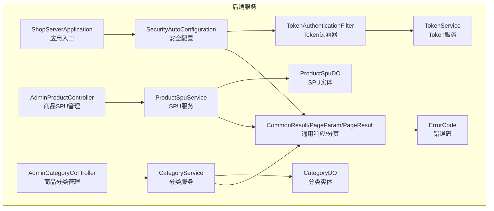
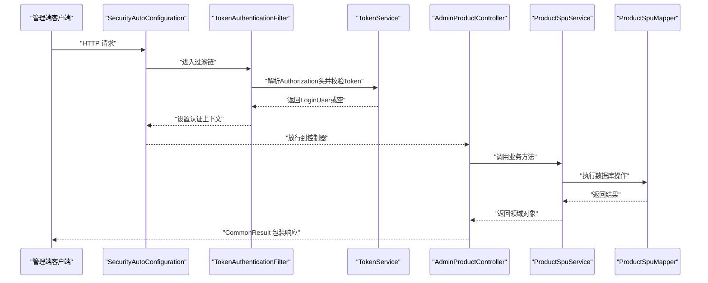
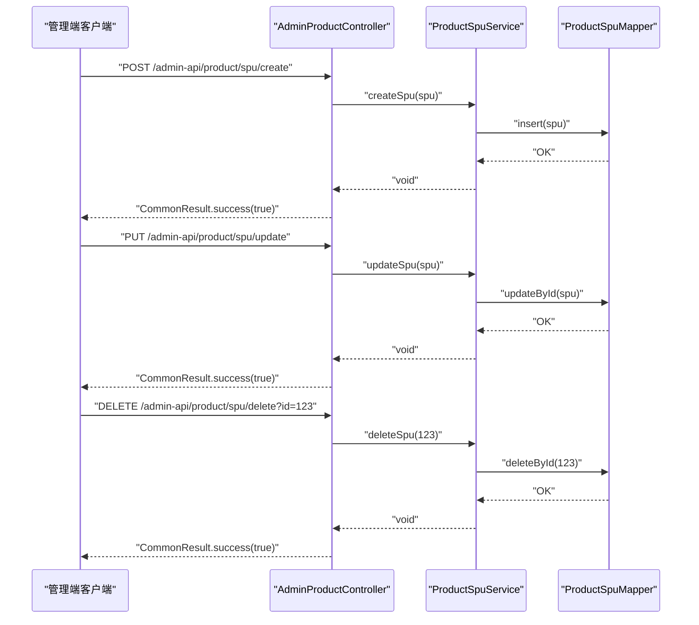
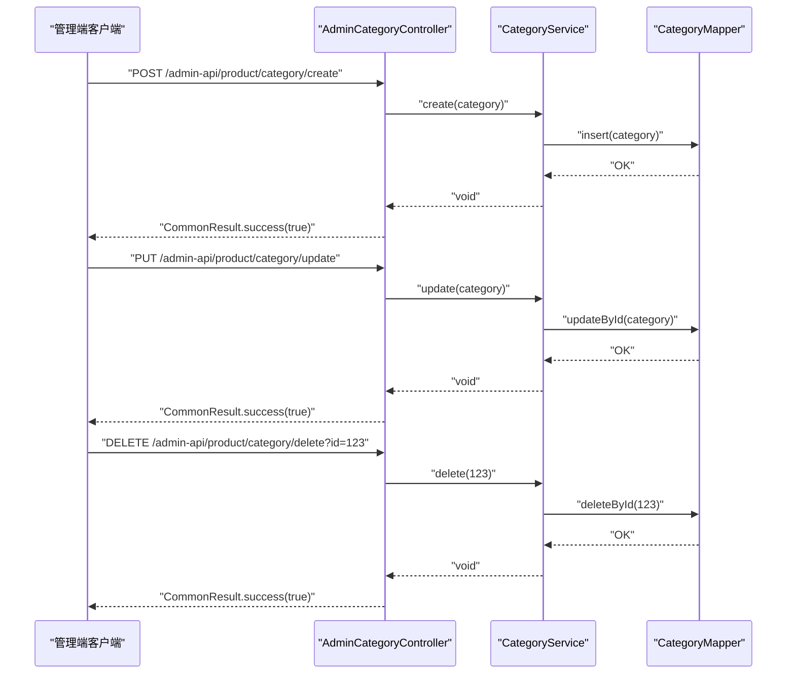
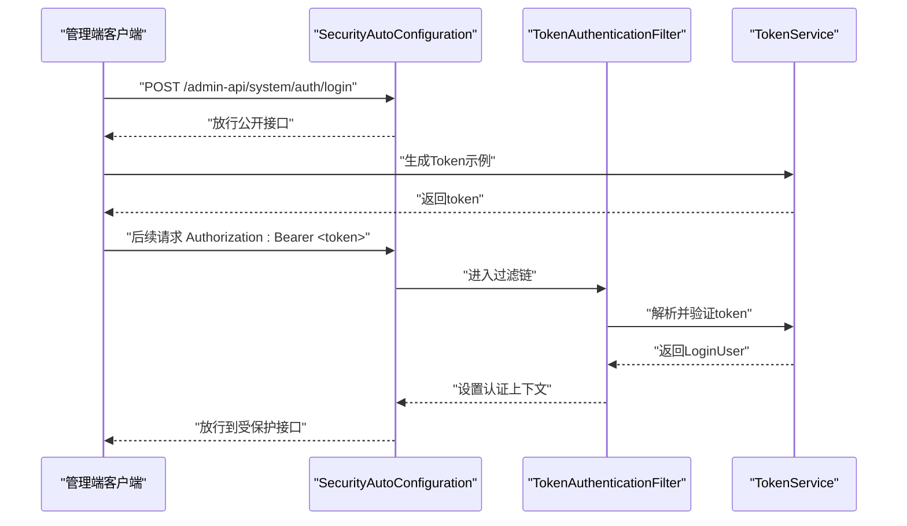
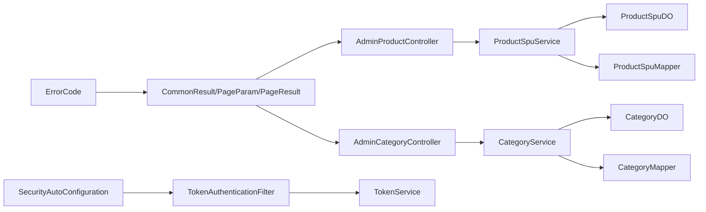

# 管理端API接口

<cite>
**本文引用的文件**
- [AdminProductController.java](file://shop-backend/shop-module-product/src/main/java/com/shop/module/product/controller/admin/AdminProductController.java)
- [AdminCategoryController.java](file://shop-backend/shop-module-product/src/main/java/com/shop/module/product/controller/admin/AdminCategoryController.java)
- [ProductSpuService.java](file://shop-backend/shop-module-product/src/main/java/com/shop/module/product/service/ProductSpuService.java)
- [CategoryService.java](file://shop-backend/shop-module-product/src/main/java/com/shop/module/product/service/CategoryService.java)
- [ProductSpuDO.java](file://shop-backend/shop-module-product/src/main/java/com/shop/module/product/dal/dataobject/ProductSpuDO.java)
- [CategoryDO.java](file://shop-backend/shop-module-product/src/main/java/com/shop/module/product/dal/dataobject/CategoryDO.java)
- [CommonResult.java](file://shop-backend/shop-framework/shop-common/src/main/java/com/shop/common/pojo/CommonResult.java)
- [PageParam.java](file://shop-backend/shop-framework/shop-common/src/main/java/com/shop/common/pojo/PageParam.java)
- [PageResult.java](file://shop-backend/shop-framework/shop-common/src/main/java/com/shop/common/pojo/PageResult.java)
- [ErrorCode.java](file://shop-backend/shop-framework/shop-common/src/main/java/com/shop/common/exception/ErrorCode.java)
- [TokenAuthenticationFilter.java](file://shop-backend/shop-framework/shop-starter-security/src/main/java/com/shop/framework/security/TokenAuthenticationFilter.java)
- [TokenService.java](file://shop-backend/shop-framework/shop-starter-security/src/main/java/com/shop/framework/security/TokenService.java)
- [SecurityAutoConfiguration.java](file://shop-backend/shop-framework/shop-starter-security/src/main/java/com/shop/framework/security/SecurityAutoConfiguration.java)
- [LoginUser.java](file://shop-backend/shop-framework/shop-starter-security/src/main/java/com/shop/framework/security/LoginUser.java)
- [application.yml](file://shop-backend/shop-server/src/main/resources/application.yml)
</cite>

## 目录
1. [简介](#简介)
2. [项目结构](#项目结构)
3. [核心组件](#核心组件)
4. [架构总览](#架构总览)
5. [详细组件分析](#详细组件分析)
6. [依赖分析](#依赖分析)
7. [性能考虑](#性能考虑)
8. [故障排查指南](#故障排查指南)
9. [结论](#结论)
10. [附录](#附录)

## 简介
本文件为“药食同源”微信小程序管理端的API接口文档，覆盖以下三类接口：
- 商品管理接口：商品SPU的分页查询、创建、更新、删除与详情查询
- 商品分类管理接口：分类列表查询、创建、更新、删除
- 管理员认证接口：登录与Token发放（基于后端现有安全框架）

文档提供每个接口的HTTP方法、URL模式、请求体格式、响应结构、鉴权要求与权限控制说明，并给出调用示例、参数校验规则、业务逻辑约束与错误码定义。

## 项目结构
管理端API位于后端工程的模块化结构中，采用按功能域划分的组织方式：
- 控制器层：负责REST接口定义与路由映射
- 服务层：封装业务逻辑与数据访问协调
- 数据对象层：持久化实体模型
- 公共框架层：统一响应包装、分页参数与异常码
- 安全框架层：基于Spring Security与Token的鉴权过滤

图表来源
- [SecurityAutoConfiguration.java:16-46](file://shop-backend/shop-framework/shop-starter-security/src/main/java/com/shop/framework/security/SecurityAutoConfiguration.java#L16-L46)
- [TokenAuthenticationFilter.java:1-43](file://shop-backend/shop-framework/shop-starter-security/src/main/java/com/shop/framework/security/TokenAuthenticationFilter.java#L1-L43)
- [TokenService.java:1-47](file://shop-backend/shop-framework/shop-starter-security/src/main/java/com/shop/framework/security/TokenService.java#L1-L47)
- [AdminProductController.java:1-41](file://shop-backend/shop-module-product/src/main/java/com/shop/module/product/controller/admin/AdminProductController.java#L1-L41)
- [AdminCategoryController.java:1-41](file://shop-backend/shop-module-product/src/main/java/com/shop/module/product/controller/admin/AdminCategoryController.java#L1-L41)
- [ProductSpuService.java:1-53](file://shop-backend/shop-module-product/src/main/java/com/shop/module/product/service/ProductSpuService.java#L1-L53)
- [CategoryService.java:1-40](file://shop-backend/shop-module-product/src/main/java/com/shop/module/product/service/CategoryService.java#L1-L40)
- [ProductSpuDO.java:1-33](file://shop-backend/shop-module-product/src/main/java/com/shop/module/product/dal/dataobject/ProductSpuDO.java#L1-L33)
- [CategoryDO.java:1-23](file://shop-backend/shop-module-product/src/main/java/com/shop/module/product/dal/dataobject/CategoryDO.java#L1-L23)
- [CommonResult.java:1-34](file://shop-backend/shop-framework/shop-common/src/main/java/com/shop/common/pojo/CommonResult.java#L1-L34)
- [PageParam.java:1-12](file://shop-backend/shop-framework/shop-common/src/main/java/com/shop/common/pojo/PageParam.java#L1-L12)
- [PageResult.java:1-18](file://shop-backend/shop-framework/shop-common/src/main/java/com/shop/common/pojo/PageResult.java#L1-L18)
- [ErrorCode.java:1-26](file://shop-backend/shop-framework/shop-common/src/main/java/com/shop/common/exception/ErrorCode.java#L1-L26)

章节来源
- [application.yml:1-7](file://shop-backend/shop-server/src/main/resources/application.yml#L1-L7)

## 核心组件
- 控制器层
  - 商品SPU控制器：提供分页查询、创建、更新、删除等接口
  - 商品分类控制器：提供列表查询、创建、更新、删除等接口
- 服务层
  - SPU服务：封装分页查询、详情查询、创建、更新、删除
  - 分类服务：封装启用/全部列表查询、创建、更新、删除
- 数据对象层
  - SPU实体：包含商品基础信息、价格、库存、状态等字段
  - 分类实体：包含父级、名称、图标、排序、状态等字段
- 框架层
  - 统一响应包装：所有接口返回统一结构
  - 分页参数/结果：标准化分页入参与出参
  - 错误码：标准化错误码与消息

章节来源
- [AdminProductController.java:11-40](file://shop-backend/shop-module-product/src/main/java/com/shop/module/product/controller/admin/AdminProductController.java#L11-L40)
- [AdminCategoryController.java:11-40](file://shop-backend/shop-module-product/src/main/java/com/shop/module/product/controller/admin/AdminCategoryController.java#L11-L40)
- [ProductSpuService.java:13-52](file://shop-backend/shop-module-product/src/main/java/com/shop/module/product/service/ProductSpuService.java#L13-L52)
- [CategoryService.java:11-39](file://shop-backend/shop-module-product/src/main/java/com/shop/module/product/service/CategoryService.java#L11-L39)
- [ProductSpuDO.java:10-32](file://shop-backend/shop-module-product/src/main/java/com/shop/module/product/dal/dataobject/ProductSpuDO.java#L10-L32)
- [CategoryDO.java:10-22](file://shop-backend/shop-module-product/src/main/java/com/shop/module/product/dal/dataobject/CategoryDO.java#L10-L22)
- [CommonResult.java:8-33](file://shop-backend/shop-framework/shop-common/src/main/java/com/shop/common/pojo/CommonResult.java#L8-L33)
- [PageParam.java:7-11](file://shop-backend/shop-framework/shop-common/src/main/java/com/shop/common/pojo/PageParam.java#L7-L11)
- [PageResult.java:8-17](file://shop-backend/shop-framework/shop-common/src/main/java/com/shop/common/pojo/PageResult.java#L8-L17)
- [ErrorCode.java:6-25](file://shop-backend/shop-framework/shop-common/src/main/java/com/shop/common/exception/ErrorCode.java#L6-L25)

## 架构总览
管理端API遵循“控制器-服务-数据对象”的分层设计，配合统一响应与安全过滤链实现鉴权与跨域处理。

图表来源
- [SecurityAutoConfiguration.java:20-43](file://shop-backend/shop-framework/shop-starter-security/src/main/java/com/shop/framework/security/SecurityAutoConfiguration.java#L20-L43)
- [TokenAuthenticationFilter.java:20-33](file://shop-backend/shop-framework/shop-starter-security/src/main/java/com/shop/framework/security/TokenAuthenticationFilter.java#L20-L33)
- [TokenService.java:19-45](file://shop-backend/shop-framework/shop-starter-security/src/main/java/com/shop/framework/security/TokenService.java#L19-L45)
- [AdminProductController.java:18-21](file://shop-backend/shop-module-product/src/main/java/com/shop/module/product/controller/admin/AdminProductController.java#L18-L21)
- [ProductSpuService.java:35-39](file://shop-backend/shop-module-product/src/main/java/com/shop/module/product/service/ProductSpuService.java#L35-L39)

## 详细组件分析

### 商品SPU管理接口
- 接口列表
  - GET /admin-api/product/spu/page
    - 功能：分页查询商品SPU（按创建时间倒序）
    - 鉴权：需要登录态
    - 请求参数：分页参数（pageNo、pageSize）
    - 响应：分页结果（list、total）
  - POST /admin-api/product/spu/create
    - 功能：创建商品SPU
    - 鉴权：需要登录态
    - 请求体：SPU实体（除主键外）
    - 响应：布尔成功标志
  - PUT /admin-api/product/spu/update
    - 功能：更新商品SPU
    - 鉴权：需要登录态
    - 请求体：SPU实体（需包含主键id）
    - 响应：布尔成功标志
  - DELETE /admin-api/product/spu/delete?id={id}
    - 功能：删除商品SPU
    - 鉴权：需要登录态
    - 查询参数：id（Long）
    - 响应：布尔成功标志

- 请求体与响应结构
  - SPU实体字段（部分）：categoryId、name、keyword、introduction、description、picUrl、sliderPicUrls、videoUrl、type、price、marketPrice、stock、salesCount、sort、status
  - 统一响应：code、msg、data
  - 分页参数：pageNo、pageSize
  - 分页结果：list、total

- 参数校验与业务约束
  - 更新时必须包含主键id
  - 删除时id必须存在
  - 详情查询若不存在抛出业务异常

- 调用示例
  - 获取分页列表
    - 方法：GET
    - 地址：/admin-api/product/spu/page
    - 头部：Authorization: Bearer <token>
    - 查询参数：pageNo=1&pageSize=10
  - 创建SPU
    - 方法：POST
    - 地址：/admin-api/product/spu/create
    - 头部：Authorization: Bearer <token>
    - 请求体：SPU实体JSON
  - 更新SPU
    - 方法：PUT
    - 地址：/admin-api/product/spu/update
    - 头部：Authorization: Bearer <token>
    - 请求体：包含id的SPU实体JSON
  - 删除SPU
    - 方法：DELETE
    - 地址：/admin-api/product/spu/delete
    - 头部：Authorization: Bearer <token>
    - 查询参数：id=123

- 错误码
  - 通用错误：请求参数错误、未登录、无权限、资源不存在、系统异常
  - 业务错误：商品不存在

图表来源
- [AdminProductController.java:23-39](file://shop-backend/shop-module-product/src/main/java/com/shop/module/product/controller/admin/AdminProductController.java#L23-L39)
- [ProductSpuService.java:41-51](file://shop-backend/shop-module-product/src/main/java/com/shop/module/product/service/ProductSpuService.java#L41-L51)

章节来源
- [AdminProductController.java:18-39](file://shop-backend/shop-module-product/src/main/java/com/shop/module/product/controller/admin/AdminProductController.java#L18-L39)
- [ProductSpuService.java:19-51](file://shop-backend/shop-module-product/src/main/java/com/shop/module/product/service/ProductSpuService.java#L19-L51)
- [ProductSpuDO.java:13-32](file://shop-backend/shop-module-product/src/main/java/com/shop/module/product/dal/dataobject/ProductSpuDO.java#L13-L32)
- [CommonResult.java:15-32](file://shop-backend/shop-framework/shop-common/src/main/java/com/shop/common/pojo/CommonResult.java#L15-L32)
- [PageParam.java:8-11](file://shop-backend/shop-framework/shop-common/src/main/java/com/shop/common/pojo/PageParam.java#L8-L11)
- [PageResult.java:13-16](file://shop-backend/shop-framework/shop-common/src/main/java/com/shop/common/pojo/PageResult.java#L13-L16)
- [ErrorCode.java:8-21](file://shop-backend/shop-framework/shop-common/src/main/java/com/shop/common/exception/ErrorCode.java#L8-L21)

### 商品分类管理接口
- 接口列表
  - GET /admin-api/product/category/list
    - 功能：获取分类列表（默认按sort倒序）
    - 鉴权：需要登录态
    - 请求参数：无
    - 响应：分类列表
  - POST /admin-api/product/category/create
    - 功能：创建分类
    - 鉴权：需要登录态
    - 请求体：分类实体（除主键外）
    - 响应：布尔成功标志
  - PUT /admin-api/product/category/update
    - 功能：更新分类
    - 鉴权：需要登录态
    - 请求体：分类实体（需包含主键id）
    - 响应：布尔成功标志
  - DELETE /admin-api/product/category/delete?id={id}
    - 功能：删除分类
    - 鉴权：需要登录态
    - 查询参数：id（Long）
    - 响应：布尔成功标志

- 请求体与响应结构
  - 分类实体字段（部分）：parentId、name、icon、sort、status
  - 统一响应：code、msg、data

- 参数校验与业务约束
  - 更新时必须包含主键id
  - 删除时id必须存在

- 调用示例
  - 获取分类列表
    - 方法：GET
    - 地址：/admin-api/product/category/list
    - 头部：Authorization: Bearer <token>
  - 创建分类
    - 方法：POST
    - 地址：/admin-api/product/category/create
    - 头部：Authorization: Bearer <token>
    - 请求体：分类实体JSON
  - 更新分类
    - 方法：PUT
    - 地址：/admin-api/product/category/update
    - 头部：Authorization: Bearer <token>
    - 请求体：包含id的分类实体JSON
  - 删除分类
    - 方法：DELETE
    - 地址：/admin-api/product/category/delete
    - 头部：Authorization: Bearer <token>
    - 查询参数：id=123

- 错误码
  - 通用错误：请求参数错误、未登录、无权限、资源不存在、系统异常

图表来源
- [AdminCategoryController.java:23-39](file://shop-backend/shop-module-product/src/main/java/com/shop/module/product/controller/admin/AdminCategoryController.java#L23-L39)
- [CategoryService.java:28-38](file://shop-backend/shop-module-product/src/main/java/com/shop/module/product/service/CategoryService.java#L28-L38)

章节来源
- [AdminCategoryController.java:18-39](file://shop-backend/shop-module-product/src/main/java/com/shop/module/product/controller/admin/AdminCategoryController.java#L18-L39)
- [CategoryService.java:17-38](file://shop-backend/shop-module-product/src/main/java/com/shop/module/product/service/CategoryService.java#L17-L38)
- [CategoryDO.java:13-22](file://shop-backend/shop-module-product/src/main/java/com/shop/module/product/dal/dataobject/CategoryDO.java#L13-L22)
- [CommonResult.java:15-32](file://shop-backend/shop-framework/shop-common/src/main/java/com/shop/common/pojo/CommonResult.java#L15-L32)
- [ErrorCode.java:8-21](file://shop-backend/shop-framework/shop-common/src/main/java/com/shop/common/exception/ErrorCode.java#L8-L21)

### 管理员认证接口
- 当前实现
  - 认证接口路径：/admin-api/system/auth/**
  - 放行策略：公开访问（无需登录）
  - 返回格式：统一响应包装
- 使用说明
  - 登录流程：前端调用认证接口获取Token，后续请求在Authorization头中携带Bearer Token
  - Token有效期：由TokenService配置（默认7天）
  - 过滤链：TokenAuthenticationFilter从Authorization头解析并注入认证上下文

- 调用示例
  - 登录获取Token
    - 方法：POST
    - 地址：/admin-api/system/auth/login
    - 头部：无（当前放行）
    - 请求体：用户名/密码等凭据（具体字段以实际实现为准）
    - 响应：CommonResult，data中包含token

图表来源
- [SecurityAutoConfiguration.java:26-32](file://shop-backend/shop-framework/shop-starter-security/src/main/java/com/shop/framework/security/SecurityAutoConfiguration.java#L26-L32)
- [TokenAuthenticationFilter.java:20-33](file://shop-backend/shop-framework/shop-starter-security/src/main/java/com/shop/framework/security/TokenAuthenticationFilter.java#L20-L33)
- [TokenService.java:19-45](file://shop-backend/shop-framework/shop-starter-security/src/main/java/com/shop/framework/security/TokenService.java#L19-L45)

章节来源
- [SecurityAutoConfiguration.java:26-32](file://shop-backend/shop-framework/shop-starter-security/src/main/java/com/shop/framework/security/SecurityAutoConfiguration.java#L26-L32)
- [TokenAuthenticationFilter.java:35-41](file://shop-backend/shop-framework/shop-starter-security/src/main/java/com/shop/framework/security/TokenAuthenticationFilter.java#L35-L41)
- [TokenService.java:14-15](file://shop-backend/shop-framework/shop-starter-security/src/main/java/com/shop/framework/security/TokenService.java#L14-L15)
- [LoginUser.java:6-9](file://shop-backend/shop-framework/shop-starter-security/src/main/java/com/shop/framework/security/LoginUser.java#L6-L9)

## 依赖分析
- 控制器依赖服务，服务依赖Mapper与DO
- 统一响应与错误码贯穿各层
- 安全过滤链在控制器之前生效

图表来源
- [AdminProductController.java:14-16](file://shop-backend/shop-module-product/src/main/java/com/shop/module/product/controller/admin/AdminProductController.java#L14-L16)
- [AdminCategoryController.java:16-16](file://shop-backend/shop-module-product/src/main/java/com/shop/module/product/controller/admin/AdminCategoryController.java#L16-L16)
- [ProductSpuService.java:17-17](file://shop-backend/shop-module-product/src/main/java/com/shop/module/product/service/ProductSpuService.java#L17-L17)
- [CategoryService.java:15-15](file://shop-backend/shop-module-product/src/main/java/com/shop/module/product/service/CategoryService.java#L15-L15)
- [SecurityAutoConfiguration.java:42-43](file://shop-backend/shop-framework/shop-starter-security/src/main/java/com/shop/framework/security/SecurityAutoConfiguration.java#L42-L43)
- [TokenAuthenticationFilter.java:18-18](file://shop-backend/shop-framework/shop-starter-security/src/main/java/com/shop/framework/security/TokenAuthenticationFilter.java#L18-L18)
- [TokenService.java:17-17](file://shop-backend/shop-framework/shop-starter-security/src/main/java/com/shop/framework/security/TokenService.java#L17-17)
- [CommonResult.java:8-13](file://shop-backend/shop-framework/shop-common/src/main/java/com/shop/common/pojo/CommonResult.java#L8-L13)
- [ErrorCode.java:6-25](file://shop-backend/shop-framework/shop-common/src/main/java/com/shop/common/exception/ErrorCode.java#L6-L25)

## 性能考虑
- 分页查询使用MyBatis Plus分页器，建议合理设置pageNo与pageSize，避免超大页码与过大每页数量
- 列表查询默认按sort倒序，注意索引优化
- Token存储于Redis，建议关注Redis连接池与过期策略
- 控制器层仅做参数透传与结果包装，避免在控制器内进行复杂计算

## 故障排查指南
- 未登录/无权限
  - 现象：返回统一错误码401或403
  - 排查：确认Authorization头是否正确、Token是否过期
- 资源不存在
  - 现象：返回404或业务错误
  - 排查：确认id是否存在，SPU详情查询时若不存在会抛业务异常
- 请求参数错误
  - 现象：返回400
  - 排查：检查请求体字段类型与必填项

章节来源
- [SecurityAutoConfiguration.java:33-40](file://shop-backend/shop-framework/shop-starter-security/src/main/java/com/shop/framework/security/SecurityAutoConfiguration.java#L33-L40)
- [ProductSpuService.java:27-32](file://shop-backend/shop-module-product/src/main/java/com/shop/module/product/service/ProductSpuService.java#L27-L32)
- [ErrorCode.java:10-21](file://shop-backend/shop-framework/shop-common/src/main/java/com/shop/common/exception/ErrorCode.java#L10-L21)

## 结论
本管理端API围绕商品SPU与分类两大核心域构建，采用统一响应与安全过滤链，具备清晰的鉴权与错误处理机制。建议在后续迭代中补充：
- 管理员角色与权限细分（当前安全配置对公开接口放行）
- 批量操作接口（如批量删除）
- 更严格的参数校验与业务规则（如价格单位、库存范围等）
- 操作审计与日志记录（可结合Spring Security事件与AOP）

## 附录

### 统一响应结构
- 成功：code=0，msg="success"，data为具体数据
- 失败：code与msg由错误码枚举决定

章节来源
- [CommonResult.java:15-32](file://shop-backend/shop-framework/shop-common/src/main/java/com/shop/common/pojo/CommonResult.java#L15-L32)
- [ErrorCode.java:8-25](file://shop-backend/shop-framework/shop-common/src/main/java/com/shop/common/exception/ErrorCode.java#L8-L25)