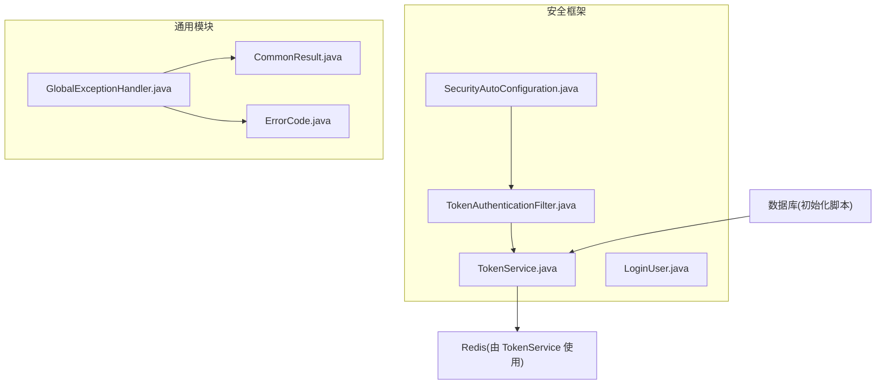
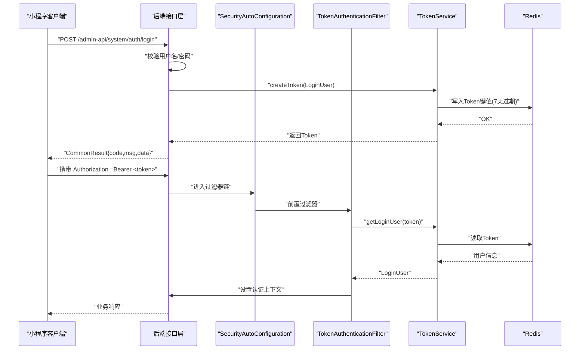
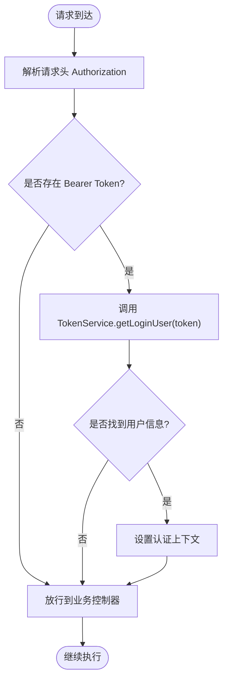
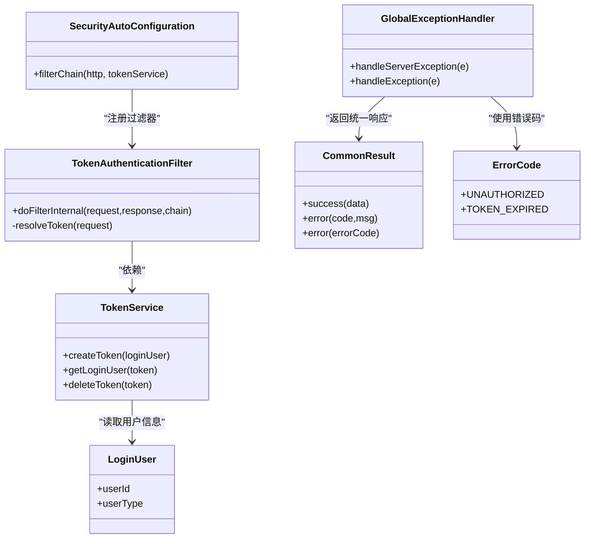

# 认证与授权接口

<cite>
**本文引用的文件**
- [TokenAuthenticationFilter.java](file://shop-backend/shop-framework/shop-starter-security/src/main/java/com/shop/framework/security/TokenAuthenticationFilter.java)
- [TokenService.java](file://shop-backend/shop-framework/shop-starter-security/src/main/java/com/shop/framework/security/TokenService.java)
- [LoginUser.java](file://shop-backend/shop-framework/shop-starter-security/src/main/java/com/shop/framework/security/LoginUser.java)
- [SecurityAutoConfiguration.java](file://shop-backend/shop-framework/shop-starter-security/src/main/java/com/shop/framework/security/SecurityAutoConfiguration.java)
- [CommonResult.java](file://shop-backend/shop-framework/shop-common/src/main/java/com/shop/common/pojo/CommonResult.java)
- [ErrorCode.java](file://shop-backend/shop-framework/shop-common/src/main/java/com/shop/common/exception/ErrorCode.java)
- [GlobalExceptionHandler.java](file://shop-backend/shop-framework/shop-common/src/main/java/com/shop/common/exception/GlobalExceptionHandler.java)
- [init.sql](file://sql/init.sql)
</cite>

## 目录
1. [简介](#简介)
2. [项目结构](#项目结构)
3. [核心组件](#核心组件)
4. [架构总览](#架构总览)
5. [详细组件分析](#详细组件分析)
6. [依赖关系分析](#依赖关系分析)
7. [性能考虑](#性能考虑)
8. [故障排查指南](#故障排查指南)
9. [结论](#结论)
10. [附录](#附录)

## 简介
本文件面向“药食同源”微信小程序后端的认证与授权接口，聚焦管理员认证与基于 JWT 的无状态鉴权机制。重点覆盖以下内容：
- 管理员登录接口：POST /admin-api/system/auth/login 的请求格式、用户名密码校验流程、Token 生成与过期策略
- Token 验证与刷新：拦截器自动处理、请求头传递方式、验证流程与刷新策略
- 接口规范：请求参数、响应格式、状态码与错误处理
- 安全与运维：Token 存储建议、跨域处理、防暴力破解、认证中间件原理、权限注解与异常处理
- 前端最佳实践：Token 管理与安全开发指南

## 项目结构
围绕认证与授权的关键模块与文件如下：
- 安全框架模块（shop-starter-security）：包含 TokenService、TokenAuthenticationFilter、SecurityAutoConfiguration、LoginUser
- 通用模块（shop-common）：统一响应体 CommonResult、全局异常处理 GlobalExceptionHandler、错误码 ErrorCode
- 初始化脚本（sql/init.sql）：包含管理员用户表与默认管理员数据

图示来源
- [TokenService.java:1-47](file://shop-backend/shop-framework/shop-starter-security/src/main/java/com/shop/framework/security/TokenService.java#L1-L47)
- [TokenAuthenticationFilter.java:1-43](file://shop-backend/shop-framework/shop-starter-security/src/main/java/com/shop/framework/security/TokenAuthenticationFilter.java#L1-L43)
- [SecurityAutoConfiguration.java:1-47](file://shop-backend/shop-framework/shop-starter-security/src/main/java/com/shop/framework/security/SecurityAutoConfiguration.java#L1-L47)
- [CommonResult.java:1-34](file://shop-backend/shop-framework/shop-common/src/main/java/com/shop/common/pojo/CommonResult.java#L1-L34)
- [ErrorCode.java:1-26](file://shop-backend/shop-framework/shop-common/src/main/java/com/shop/common/exception/ErrorCode.java#L1-L26)
- [GlobalExceptionHandler.java:1-24](file://shop-backend/shop-framework/shop-common/src/main/java/com/shop/common/exception/GlobalExceptionHandler.java#L1-L24)
- [init.sql:83-109](file://sql/init.sql#L83-L109)

章节来源
- [TokenService.java:1-47](file://shop-backend/shop-framework/shop-starter-security/src/main/java/com/shop/framework/security/TokenService.java#L1-L47)
- [TokenAuthenticationFilter.java:1-43](file://shop-backend/shop-framework/shop-starter-security/src/main/java/com/shop/framework/security/TokenAuthenticationFilter.java#L1-L43)
- [SecurityAutoConfiguration.java:1-47](file://shop-backend/shop-framework/shop-starter-security/src/main/java/com/shop/framework/security/SecurityAutoConfiguration.java#L1-L47)
- [CommonResult.java:1-34](file://shop-backend/shop-framework/shop-common/src/main/java/com/shop/common/pojo/CommonResult.java#L1-L34)
- [ErrorCode.java:1-26](file://shop-backend/shop-framework/shop-common/src/main/java/com/shop/common/exception/ErrorCode.java#L1-L26)
- [GlobalExceptionHandler.java:1-24](file://shop-backend/shop-framework/shop-common/src/main/java/com/shop/common/exception/GlobalExceptionHandler.java#L1-L24)
- [init.sql:83-109](file://sql/init.sql#L83-L109)

## 核心组件
- TokenService：负责 Token 的生成、校验与删除，采用 Redis 持久化存储，Token 过期时间为 7 天
- TokenAuthenticationFilter：从请求头解析 Authorization Bearer Token，并将认证信息写入 Spring Security 上下文
- SecurityAutoConfiguration：配置无状态会话、公开端点、认证入口点与过滤器链
- LoginUser：封装当前登录用户的标识与类型（管理员/会员）
- 统一响应与异常：CommonResult、ErrorCode、GlobalExceptionHandler 提供一致的返回与错误处理

章节来源
- [TokenService.java:1-47](file://shop-backend/shop-framework/shop-starter-security/src/main/java/com/shop/framework/security/TokenService.java#L1-L47)
- [TokenAuthenticationFilter.java:1-43](file://shop-backend/shop-framework/shop-starter-security/src/main/java/com/shop/framework/security/TokenAuthenticationFilter.java#L1-L43)
- [SecurityAutoConfiguration.java:1-47](file://shop-backend/shop-framework/shop-starter-security/src/main/java/com/shop/framework/security/SecurityAutoConfiguration.java#L1-L47)
- [LoginUser.java:1-10](file://shop-backend/shop-framework/shop-starter-security/src/main/java/com/shop/framework/security/LoginUser.java#L1-L10)
- [CommonResult.java:1-34](file://shop-backend/shop-framework/shop-common/src/main/java/com/shop/common/pojo/CommonResult.java#L1-L34)
- [ErrorCode.java:1-26](file://shop-backend/shop-framework/shop-common/src/main/java/com/shop/common/exception/ErrorCode.java#L1-L26)
- [GlobalExceptionHandler.java:1-24](file://shop-backend/shop-framework/shop-common/src/main/java/com/shop/common/exception/GlobalExceptionHandler.java#L1-L24)

## 架构总览
认证与授权的整体流程如下：
- 登录阶段：客户端向 /admin-api/system/auth/login 发送用户名与密码，服务端校验成功后生成 Token 并返回
- 请求阶段：后续请求在请求头携带 Authorization: Bearer <token>，过滤器解析并校验 Token，通过后进入业务控制器
- 异常阶段：未登录或鉴权失败时，统一返回 401 未登录错误

图示来源
- [SecurityAutoConfiguration.java:20-45](file://shop-backend/shop-framework/shop-starter-security/src/main/java/com/shop/framework/security/SecurityAutoConfiguration.java#L20-L45)
- [TokenAuthenticationFilter.java:20-33](file://shop-backend/shop-framework/shop-starter-security/src/main/java/com/shop/framework/security/TokenAuthenticationFilter.java#L20-L33)
- [TokenService.java:19-45](file://shop-backend/shop-framework/shop-starter-security/src/main/java/com/shop/framework/security/TokenService.java#L19-L45)
- [CommonResult.java:15-32](file://shop-backend/shop-framework/shop-common/src/main/java/com/shop/common/pojo/CommonResult.java#L15-L32)

## 详细组件分析

### 管理员登录接口：POST /admin-api/system/auth/login
- 接口路径：/admin-api/system/auth/login
- 方法：POST
- 功能：接收管理员用户名与密码，校验通过后返回 Token
- 请求参数（JSON）：
  - username：字符串，必填
  - password：字符串，必填
- 响应格式（CommonResult）：
  - code：整数，0 表示成功
  - msg：字符串，描述信息
  - data：对象，包含 token 字段
- 状态码：
  - 200：登录成功
  - 400：请求参数错误
  - 401：未登录/用户名或密码错误
  - 500：系统异常
- 错误处理：
  - 参数校验失败返回 400
  - 用户名或密码错误返回 401
  - 其他异常通过全局异常处理器返回 500

注意：当前仓库中未发现该控制器的具体实现代码，请参考系统模块的公共路径匹配规则进行扩展。

章节来源
- [SecurityAutoConfiguration.java:27-28](file://shop-backend/shop-framework/shop-starter-security/src/main/java/com/shop/framework/security/SecurityAutoConfiguration.java#L27-L28)
- [CommonResult.java:15-32](file://shop-backend/shop-framework/shop-common/src/main/java/com/shop/common/pojo/CommonResult.java#L15-L32)
- [ErrorCode.java:10-21](file://shop-backend/shop-framework/shop-common/src/main/java/com/shop/common/exception/ErrorCode.java#L10-L21)
- [GlobalExceptionHandler.java:12-22](file://shop-backend/shop-framework/shop-common/src/main/java/com/shop/common/exception/GlobalExceptionHandler.java#L12-L22)

### Token 验证与刷新
- 请求头传递方式：
  - Authorization: Bearer <token>
  - 过滤器从请求头解析并移除前缀
- 验证流程：
  - 过滤器调用 TokenService.getLoginUser(token)
  - 若存在则构造认证对象并写入 SecurityContext
- 刷新策略：
  - 当前实现未提供自动刷新逻辑；建议前端在接近过期时主动重新登录获取新 Token
  - 后端可扩展：在 getLoginUser 命中后，若剩余有效期低于阈值，则在响应头返回新 Token 或提示刷新

图示来源
- [TokenAuthenticationFilter.java:20-33](file://shop-backend/shop-framework/shop-starter-security/src/main/java/com/shop/framework/security/TokenAuthenticationFilter.java#L20-L33)
- [TokenService.java:27-41](file://shop-backend/shop-framework/shop-starter-security/src/main/java/com/shop/framework/security/TokenService.java#L27-L41)

章节来源
- [TokenAuthenticationFilter.java:1-43](file://shop-backend/shop-framework/shop-starter-security/src/main/java/com/shop/framework/security/TokenAuthenticationFilter.java#L1-L43)
- [TokenService.java:1-47](file://shop-backend/shop-framework/shop-starter-security/src/main/java/com/shop/framework/security/TokenService.java#L1-L47)

### Token 存储与过期
- 存储介质：Redis
- 存储键：shop:token:{token}
- 存储值：userId:userType
- 过期时间：7 天（168 小时）

章节来源
- [TokenService.java:14-25](file://shop-backend/shop-framework/shop-starter-security/src/main/java/com/shop/framework/security/TokenService.java#L14-L25)
- [TokenService.java:31-41](file://shop-backend/shop-framework/shop-starter-security/src/main/java/com/shop/framework/security/TokenService.java#L31-L41)

### 认证中间件与权限控制
- 中间件：TokenAuthenticationFilter 在 UsernamePasswordAuthenticationFilter 之前执行
- 无状态会话：SessionCreationPolicy.STATELESS
- 公开端点：/app-api/member/auth/**、/admin-api/system/auth/**、/app-api/product/**
- 其他端点均需认证

章节来源
- [SecurityAutoConfiguration.java:20-45](file://shop-backend/shop-framework/shop-starter-security/src/main/java/com/shop/framework/security/SecurityAutoConfiguration.java#L20-L45)

### 异常处理与统一响应
- 未登录统一返回 401 未登录错误
- 全局异常处理器捕获业务异常与系统异常，返回 CommonResult

章节来源
- [SecurityAutoConfiguration.java:33-40](file://shop-backend/shop-framework/shop-starter-security/src/main/java/com/shop/framework/security/SecurityAutoConfiguration.java#L33-L40)
- [CommonResult.java:15-32](file://shop-backend/shop-framework/shop-common/src/main/java/com/shop/common/pojo/CommonResult.java#L15-L32)
- [ErrorCode.java:10-21](file://shop-backend/shop-framework/shop-common/src/main/java/com/shop/common/exception/ErrorCode.java#L10-L21)
- [GlobalExceptionHandler.java:12-22](file://shop-backend/shop-framework/shop-common/src/main/java/com/shop/common/exception/GlobalExceptionHandler.java#L12-L22)

## 依赖关系分析
- TokenAuthenticationFilter 依赖 TokenService
- SecurityAutoConfiguration 注册过滤器并配置安全策略
- 统一响应与异常处理由 shop-common 提供
- TokenService 依赖 RedisTemplate

图示来源
- [TokenAuthenticationFilter.java:16-41](file://shop-backend/shop-framework/shop-starter-security/src/main/java/com/shop/framework/security/TokenAuthenticationFilter.java#L16-L41)
- [TokenService.java:12-46](file://shop-backend/shop-framework/shop-starter-security/src/main/java/com/shop/framework/security/TokenService.java#L12-L46)
- [SecurityAutoConfiguration.java:20-45](file://shop-backend/shop-framework/shop-starter-security/src/main/java/com/shop/framework/security/SecurityAutoConfiguration.java#L20-L45)
- [CommonResult.java:9-33](file://shop-backend/shop-framework/shop-common/src/main/java/com/shop/common/pojo/CommonResult.java#L9-L33)
- [ErrorCode.java:8-25](file://shop-backend/shop-framework/shop-common/src/main/java/com/shop/common/exception/ErrorCode.java#L8-L25)
- [GlobalExceptionHandler.java:10-23](file://shop-backend/shop-framework/shop-common/src/main/java/com/shop/common/exception/GlobalExceptionHandler.java#L10-L23)
- [LoginUser.java:6-9](file://shop-backend/shop-framework/shop-starter-security/src/main/java/com/shop/framework/security/LoginUser.java#L6-L9)

## 性能考虑
- Token 存储于 Redis，具备高并发读写能力；建议开启持久化与合理内存配置
- 过期时间 7 天较长，建议结合前端刷新策略减少无效重登
- 过滤器每次请求都会访问 Redis，建议监控 Redis 延迟与命中率

## 故障排查指南
- 401 未登录：
  - 检查请求头是否正确携带 Authorization: Bearer <token>
  - 检查 Token 是否过期或被删除
  - 检查 Redis 中是否存在对应键
- 403 无权限：
  - 当前实现未启用基于角色的权限注解，如需请扩展
- 500 系统异常：
  - 查看全局异常日志，确认异常是否被捕获并返回统一响应

章节来源
- [TokenAuthenticationFilter.java:35-41](file://shop-backend/shop-framework/shop-starter-security/src/main/java/com/shop/framework/security/TokenAuthenticationFilter.java#L35-L41)
- [TokenService.java:27-45](file://shop-backend/shop-framework/shop-starter-security/src/main/java/com/shop/framework/security/TokenService.java#L27-L45)
- [GlobalExceptionHandler.java:18-22](file://shop-backend/shop-framework/shop-common/src/main/java/com/shop/common/exception/GlobalExceptionHandler.java#L18-L22)

## 结论
本项目采用无状态 JWT 鉴权模式，通过 Redis 存储 Token 实现高效验证。管理员登录接口遵循统一响应与错误码规范，拦截器自动完成 Token 解析与认证上下文注入。建议在前端实现 Token 刷新策略与安全存储，并根据需要扩展权限注解与跨域配置。

## 附录

### 接口清单与规范

- 登录接口
  - 路径：POST /admin-api/system/auth/login
  - 请求体：JSON，字段 username、password
  - 成功响应：CommonResult，data 包含 token
  - 失败响应：CommonResult，code 对应错误码
  - 状态码：200/400/401/500

- 业务接口（受保护）
  - 路径：/admin-api/product/**
  - 鉴权：需携带有效 Token
  - 返回：CommonResult

章节来源
- [SecurityAutoConfiguration.java:27-31](file://shop-backend/shop-framework/shop-starter-security/src/main/java/com/shop/framework/security/SecurityAutoConfiguration.java#L27-L31)
- [CommonResult.java:15-32](file://shop-backend/shop-framework/shop-common/src/main/java/com/shop/common/pojo/CommonResult.java#L15-L32)
- [ErrorCode.java:10-21](file://shop-backend/shop-framework/shop-common/src/main/java/com/shop/common/exception/ErrorCode.java#L10-L21)

### Token 安全存储建议
- 建议前端使用安全存储（如加密存储或应用内安全容器），避免明文落盘
- 控制台与日志不输出 Token
- 建议实现 Token 刷新阈值与静默续签

### 跨域处理方案
- 可在 SecurityAutoConfiguration 中添加 CORS 配置，允许小程序域名与必要头
- 建议仅开放必要端点与方法

### 防暴力破解措施
- 登录接口增加限流与黑名单机制（如基于 IP 或用户名）
- 密码策略：BCrypt 存储，复杂度要求
- 管理员账户：默认密码应在首次登录后强制修改

章节来源
- [init.sql:85-100](file://sql/init.sql#L85-L100)

### 前端 Token 管理最佳实践
- 请求拦截器统一注入 Authorization: Bearer <token>
- Token 过期或 401 时，引导用户重新登录
- 多设备登录场景：服务端可引入单点登录或设备维度 Token 管理