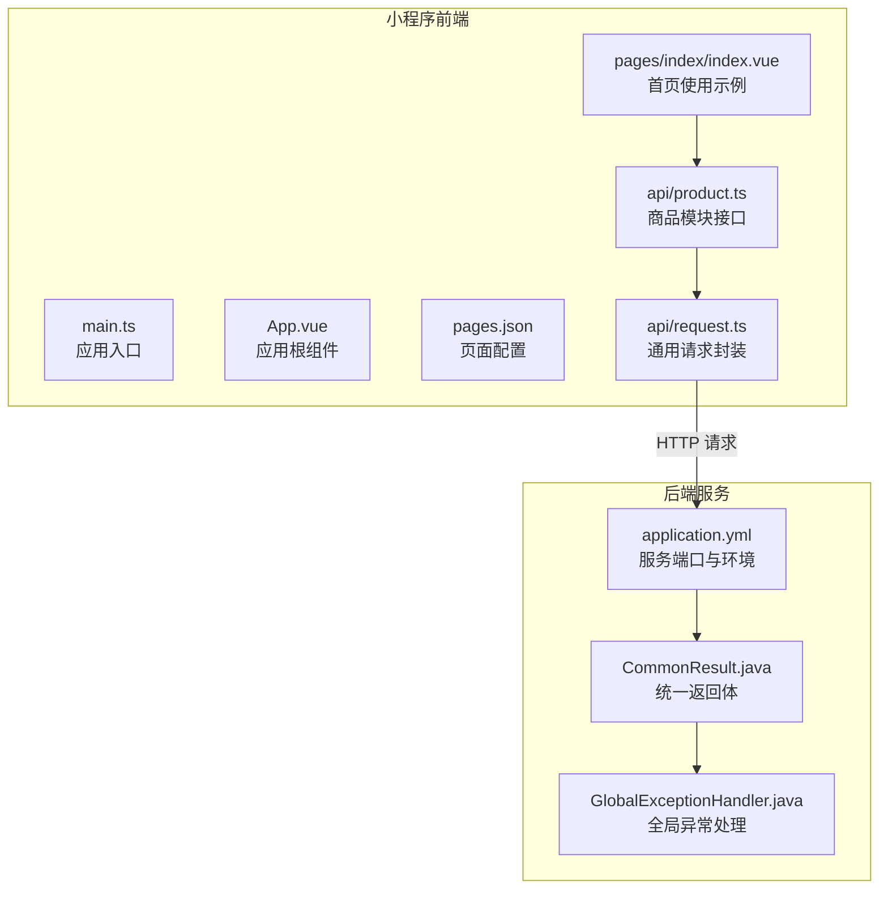
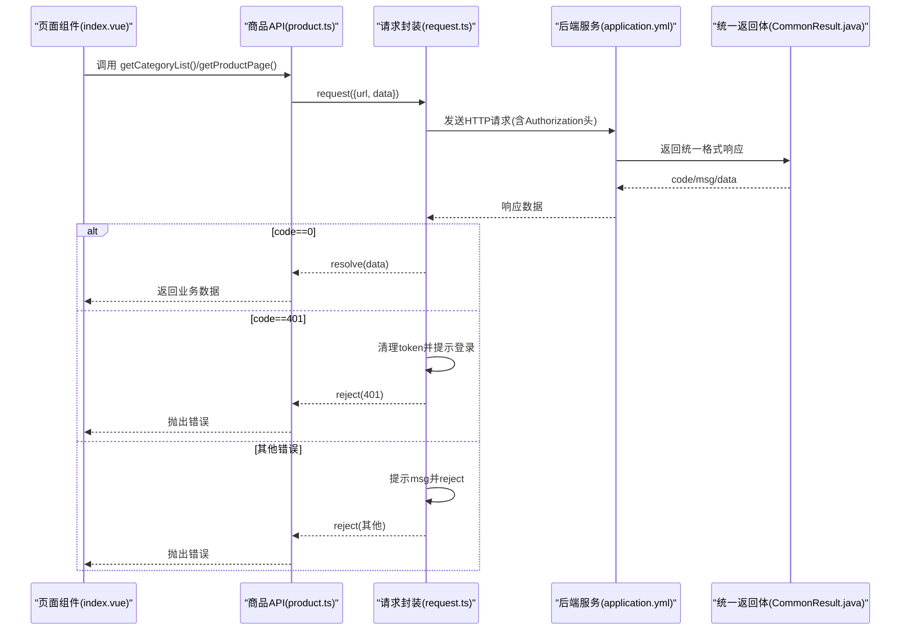
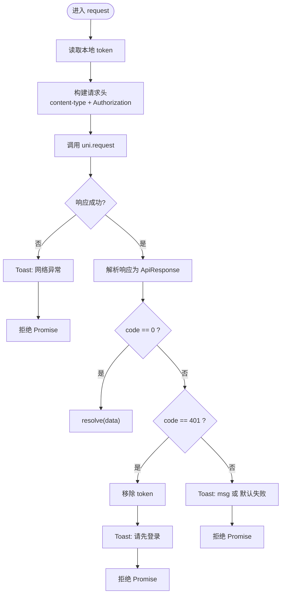
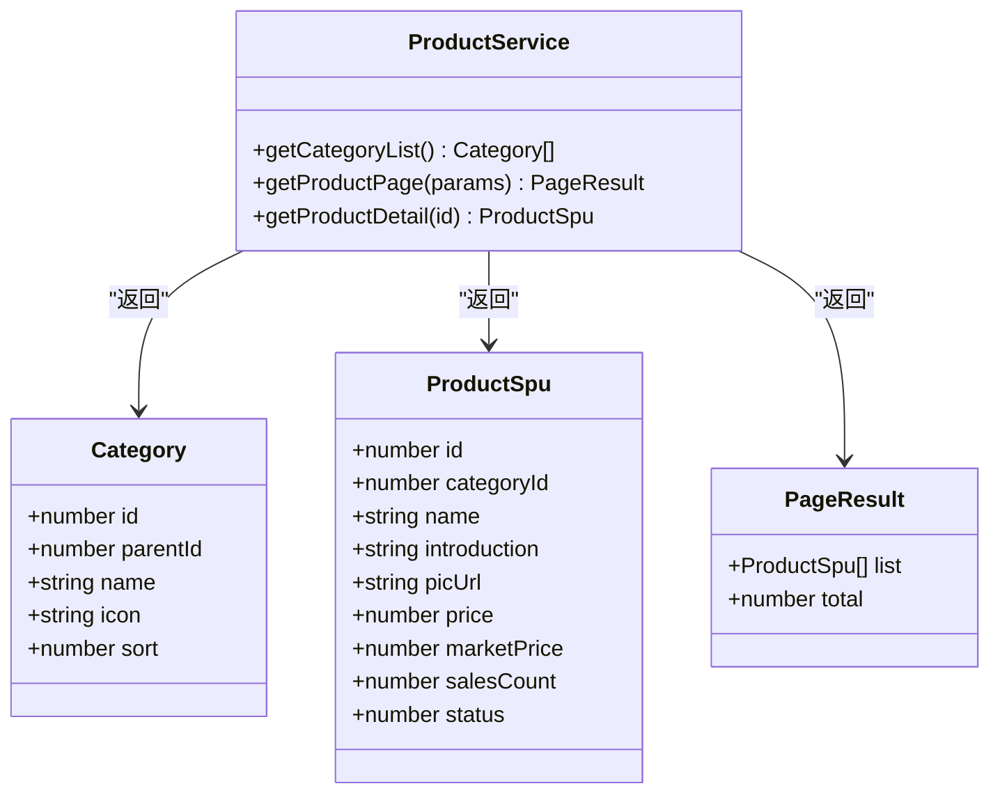
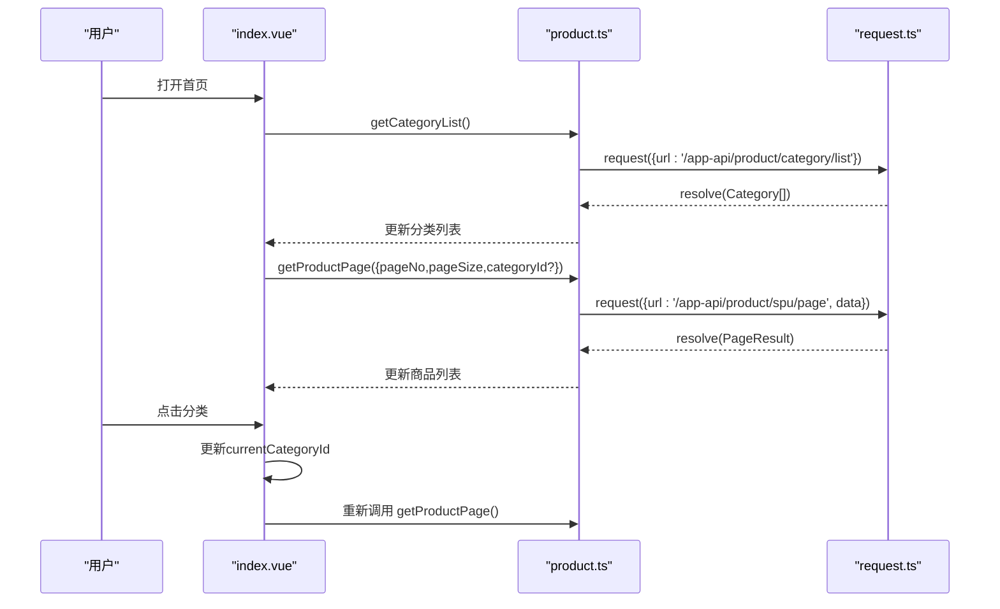
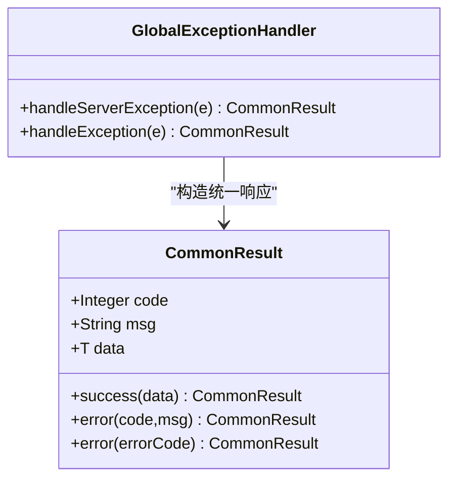
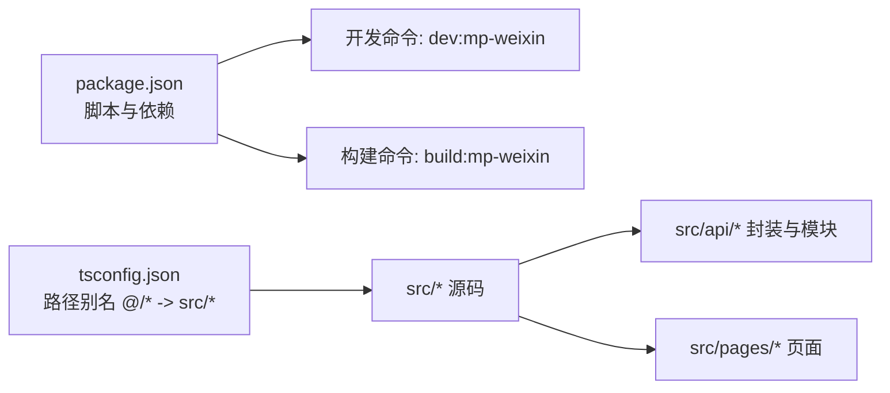

# API接口封装

<cite>
**本文引用的文件**
- [request.ts](file://shop-miniapp/src/api/request.ts)
- [product.ts](file://shop-miniapp/src/api/product.ts)
- [index.vue](file://shop-miniapp/src/pages/index/index.vue)
- [main.ts](file://shop-miniapp/src/main.ts)
- [App.vue](file://shop-miniapp/src/App.vue)
- [pages.json](file://shop-miniapp/src/pages.json)
- [package.json](file://shop-miniapp/package.json)
- [tsconfig.json](file://shop-miniapp/tsconfig.json)
- [CommonResult.java](file://shop-backend/shop-framework/shop-common/src/main/java/com/shop/common/pojo/CommonResult.java)
- [GlobalExceptionHandler.java](file://shop-backend/shop-framework/shop-common/src/main/java/com/shop/common/exception/GlobalExceptionHandler.java)
- [application.yml](file://shop-backend/shop-server/src/main/resources/application.yml)
</cite>

## 目录
1. [简介](#简介)
2. [项目结构](#项目结构)
3. [核心组件](#核心组件)
4. [架构总览](#架构总览)
5. [详细组件分析](#详细组件分析)
6. [依赖分析](#依赖分析)
7. [性能考虑](#性能考虑)
8. [故障排查指南](#故障排查指南)
9. [结论](#结论)
10. [附录](#附录)

## 简介
本文件面向“药食同源”微信小程序的前端API接口封装，系统性梳理HTTP请求封装策略、接口调用规范与数据传输协议；重点说明请求拦截器配置、响应数据处理与错误统一处理机制；阐述API接口分类管理与模块化组织方式、接口参数标准化；并给出网络请求优化、重试机制设计与超时处理策略建议，以及接口调用示例、错误处理最佳实践与性能监控方案，帮助开发者快速上手并稳定维护。

## 项目结构
前端采用基于Vue 3 + TypeScript + UniApp的跨端框架，API封装位于src/api目录，页面逻辑位于src/pages与src/store等目录。后端采用Spring Boot，统一返回体与全局异常处理位于shop-backend中。

**图表来源**
- [main.ts:1-11](file://shop-miniapp/src/main.ts#L1-L11)
- [App.vue:1-15](file://shop-miniapp/src/App.vue#L1-L15)
- [pages.json:1-17](file://shop-miniapp/src/pages.json#L1-L17)
- [request.ts:1-48](file://shop-miniapp/src/api/request.ts#L1-L48)
- [product.ts:1-42](file://shop-miniapp/src/api/product.ts#L1-L42)
- [index.vue:1-122](file://shop-miniapp/src/pages/index/index.vue#L1-L122)
- [application.yml:1-7](file://shop-backend/shop-server/src/main/resources/application.yml#L1-L7)
- [CommonResult.java:1-34](file://shop-backend/shop-framework/shop-common/src/main/java/com/shop/common/pojo/CommonResult.java#L1-L34)
- [GlobalExceptionHandler.java:1-24](file://shop-backend/shop-framework/shop-common/src/main/java/com/shop/common/exception/GlobalExceptionHandler.java#L1-L24)

**章节来源**
- [main.ts:1-11](file://shop-miniapp/src/main.ts#L1-L11)
- [App.vue:1-15](file://shop-miniapp/src/App.vue#L1-L15)
- [pages.json:1-17](file://shop-miniapp/src/pages.json#L1-L17)
- [package.json:1-27](file://shop-miniapp/package.json#L1-L27)
- [tsconfig.json:1-20](file://shop-miniapp/tsconfig.json#L1-L20)

## 核心组件
- 通用请求封装：提供统一的HTTP请求方法，内置认证头注入、响应状态码判断、错误提示与Token失效处理。
- 模块化接口：以功能域划分API模块（如商品模块），每个模块导出类型化函数，便于复用与测试。
- 页面使用示例：首页组件演示如何调用分类列表与分页商品接口，展示数据绑定与交互流程。

**章节来源**
- [request.ts:1-48](file://shop-miniapp/src/api/request.ts#L1-L48)
- [product.ts:1-42](file://shop-miniapp/src/api/product.ts#L1-L42)
- [index.vue:33-63](file://shop-miniapp/src/pages/index/index.vue#L33-L63)

## 架构总览
前后端通过HTTP协议通信，后端统一返回体包含code/msg/data三段式结构；前端根据code进行分支处理，成功时透传data，失败时弹窗提示并拒绝Promise；当code=401时主动清理本地Token并提示登录。

**图表来源**
- [index.vue:41-62](file://shop-miniapp/src/pages/index/index.vue#L41-L62)
- [product.ts:28-41](file://shop-miniapp/src/api/product.ts#L28-L41)
- [request.ts:16-47](file://shop-miniapp/src/api/request.ts#L16-L47)
- [application.yml:5-7](file://shop-backend/shop-server/src/main/resources/application.yml#L5-L7)
- [CommonResult.java:8-34](file://shop-backend/shop-framework/shop-common/src/main/java/com/shop/common/pojo/CommonResult.java#L8-L34)

## 详细组件分析

### 通用请求封装（request.ts）
- 功能职责
  - 统一发起HTTP请求，支持GET/POST/PUT/DELETE，默认GET。
  - 自动从本地存储读取Token并注入到Authorization头。
  - 统一处理响应：code=0视为成功，透传data；code=401自动清理Token并提示登录；其他错误弹窗提示并拒绝。
  - 失败回调统一弹窗提示“网络异常”，并拒绝Promise。
- 数据模型
  - 请求选项：url/method/data/header。
  - 响应模型：code/msg/data，泛型T承载业务数据。
- 错误处理
  - 401：移除本地Token，Toast提示“请先登录”，拒绝Promise。
  - 非401：Toast提示msg或默认“请求失败”，拒绝Promise。
  - 网络异常：Toast提示“网络异常”，拒绝Promise。
- 可扩展点
  - 支持在header中传入自定义字段，实现多租户、追踪ID等场景。
  - 可增加超时控制、重试策略与日志上报。

**图表来源**
- [request.ts:16-47](file://shop-miniapp/src/api/request.ts#L16-L47)

**章节来源**
- [request.ts:1-48](file://shop-miniapp/src/api/request.ts#L1-L48)

### 商品模块API（product.ts）
- 接口职责
  - 获取分类列表：返回Category数组。
  - 分页查询商品：接收pageNo/pageSize/可选categoryId，返回PageResult<ProductSpu>。
  - 查询商品详情：按id查询单个ProductSpu。
- 类型定义
  - Category：分类实体。
  - ProductSpu：商品SPU实体。
  - PageResult：分页结果，包含list与total。
- 使用方式
  - 在页面中导入对应函数，await调用并更新视图数据。
  - 参数标准化：分页参数统一为pageNo/pageSize，categoryId可选。

**图表来源**
- [product.ts:3-26](file://shop-miniapp/src/api/product.ts#L3-L26)

**章节来源**
- [product.ts:1-42](file://shop-miniapp/src/api/product.ts#L1-L42)

### 页面使用示例（index.vue）
- 生命周期加载
  - onMounted时分别加载分类与商品列表。
- 交互逻辑
  - 切换分类时更新当前categoryId并重新加载商品。
- 数据绑定
  - 分类滚动条横向展示，商品网格布局显示图片与价格。
- 错误处理
  - 当接口返回非0或401时，Toast提示用户；页面可结合loading与空态进行体验优化。

**图表来源**
- [index.vue:33-62](file://shop-miniapp/src/pages/index/index.vue#L33-L62)
- [product.ts:28-41](file://shop-miniapp/src/api/product.ts#L28-L41)
- [request.ts:16-47](file://shop-miniapp/src/api/request.ts#L16-L47)

**章节来源**
- [index.vue:1-122](file://shop-miniapp/src/pages/index/index.vue#L1-L122)

### 后端统一返回与异常处理
- 统一返回体
  - 字段：code、msg、data；提供success/error静态工厂方法。
- 全局异常处理
  - 捕获业务异常与系统异常，统一包装为CommonResult格式返回。
- 前后端约定
  - 前端依据code判断业务状态；后端保证所有接口返回一致的数据结构。

**图表来源**
- [CommonResult.java:8-34](file://shop-backend/shop-framework/shop-common/src/main/java/com/shop/common/pojo/CommonResult.java#L8-L34)
- [GlobalExceptionHandler.java:10-23](file://shop-backend/shop-framework/shop-common/src/main/java/com/shop/common/exception/GlobalExceptionHandler.java#L10-L23)

**章节来源**
- [CommonResult.java:1-34](file://shop-backend/shop-framework/shop-common/src/main/java/com/shop/common/pojo/CommonResult.java#L1-L34)
- [GlobalExceptionHandler.java:1-24](file://shop-backend/shop-framework/shop-common/src/main/java/com/shop/common/exception/GlobalExceptionHandler.java#L1-L24)
- [application.yml:5-7](file://shop-backend/shop-server/src/main/resources/application.yml#L5-L7)

## 依赖分析
- 前端依赖
  - Vue 3、Pinia、UniApp跨端框架，TypeScript编译与路径别名配置。
- 运行与构建
  - 开发命令：dev:mp-weixin；构建命令：build:mp-weixin。
- 路径别名
  - @/* 指向src/*，便于模块导入与维护。

**图表来源**
- [package.json:4-7](file://shop-miniapp/package.json#L4-L7)
- [tsconfig.json:14-16](file://shop-miniapp/tsconfig.json#L14-L16)

**章节来源**
- [package.json:1-27](file://shop-miniapp/package.json#L1-L27)
- [tsconfig.json:1-20](file://shop-miniapp/tsconfig.json#L1-L20)

## 性能考虑
- 请求合并与去抖
  - 对频繁触发的筛选/搜索操作，可在调用层引入防抖/节流，减少无效请求。
- 缓存策略
  - 对不常变动的分类列表与商品分页结果，可加入内存缓存与本地持久化缓存，设置合理过期时间。
- 分页与懒加载
  - 结合页面滚动事件做懒加载，提升首屏渲染速度与用户体验。
- 图片优化
  - 使用合适的尺寸与格式，开启压缩与CDN加速。
- 网络优化
  - 合理设置超时阈值，对弱网环境提供降级策略（如仅加载缩略图）。
- 监控与埋点
  - 记录请求耗时、成功率、错误类型与Top N慢接口，辅助定位问题与容量规划。

## 故障排查指南
- 常见问题
  - 登录态失效：出现401时，前端已自动清理Token并提示登录；检查后端Token有效期与刷新策略。
  - 网络异常：Toast提示“网络异常”，检查设备网络、域名白名单与HTTPS配置。
  - 参数错误：确认分页参数pageNo/pageSize与后端期望一致；categoryId可选。
- 调试技巧
  - 在request.ts中增加日志打印与错误堆栈记录，便于定位问题。
  - 使用浏览器/开发者工具Network面板观察请求头与响应体，核对code/msg/data。
  - 在页面中增加loading与空态提示，改善用户感知。
- 最佳实践
  - 统一错误提示文案，避免泄露后端内部错误细节。
  - 对关键接口增加重试与退避策略，提升稳定性。
  - 对高频接口进行缓存与预加载，降低后端压力。

**章节来源**
- [request.ts:32-43](file://shop-miniapp/src/api/request.ts#L32-L43)
- [index.vue:27-29](file://shop-miniapp/src/pages/index/index.vue#L27-L29)

## 结论
该API封装以“类型安全+统一返回体+集中错误处理”为核心，实现了清晰的模块化组织与良好的可维护性。建议在此基础上进一步完善超时与重试、缓存与监控体系，以满足生产环境的稳定性与可观测性需求。

## 附录
- 接口调用示例（步骤说明）
  - 加载分类：调用getCategoryList()，将返回的Category[]赋值给页面变量。
  - 加载商品：调用getProductPage({pageNo,pageSize,categoryId?})，将返回的list赋值给商品列表。
  - 查看详情：调用getProductDetail(id)，展示商品详情。
- 参数标准化清单
  - 分页：pageNo（起始1）、pageSize（建议10/20/40）、categoryId（可选）。
  - 通用：method（默认GET）、data（JSON对象）、header（可选扩展头）。
- 安全与合规
  - 生产环境需替换BASE_URL为HTTPS域名；确保Token安全存储与传输；遵守微信小程序网络请求域名白名单要求。