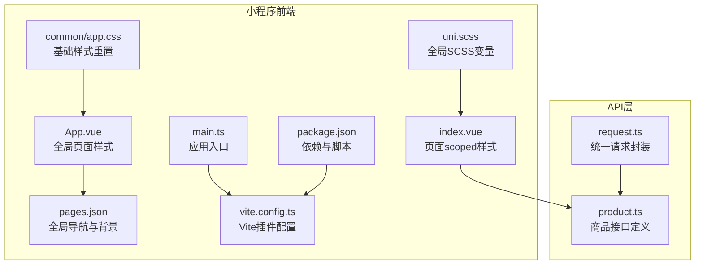
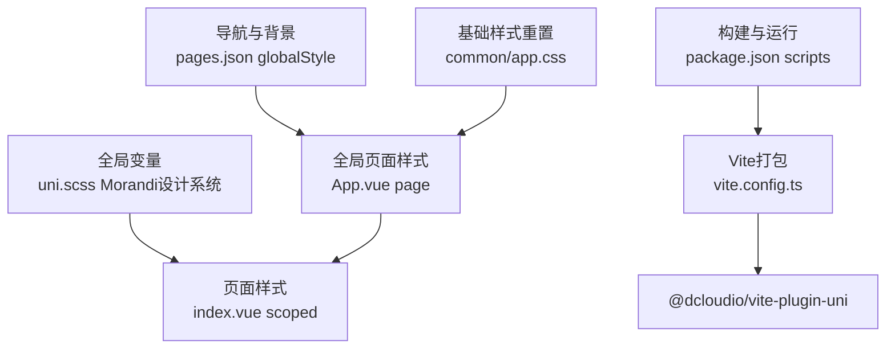
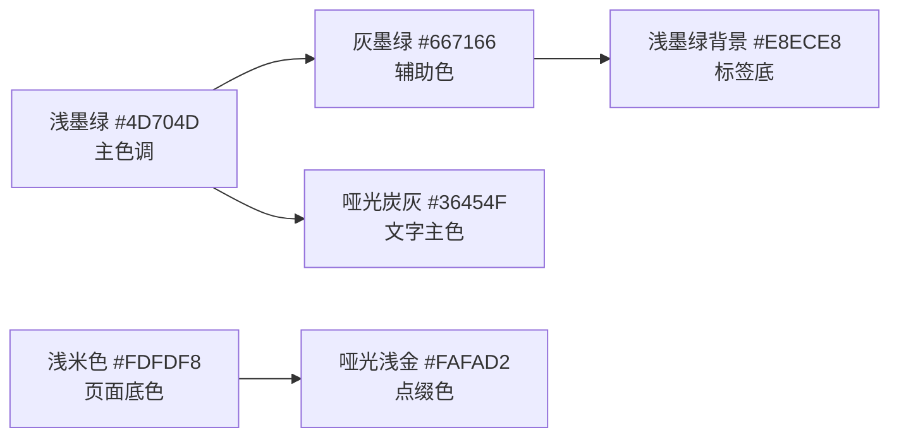
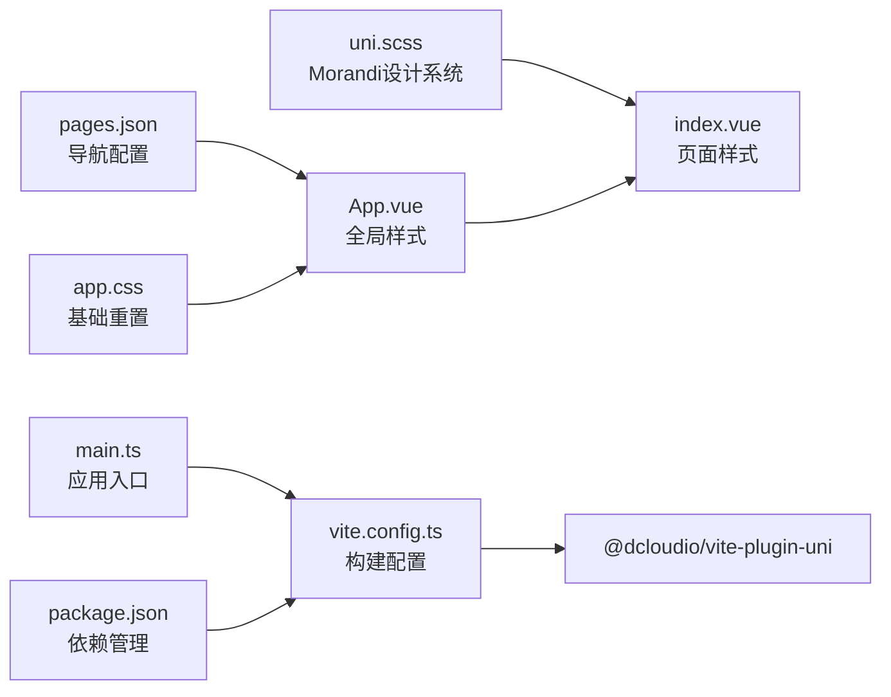

# UI样式系统

<cite>
**本文引用的文件**
- [uni.scss](file://shop-miniapp/uni.scss)
- [App.vue](file://shop-miniapp/App.vue)
- [index.vue](file://shop-miniapp/pages/index/index.vue)
- [pages.json](file://shop-miniapp/pages.json)
- [app.css](file://shop-miniapp/common/app.css)
- [btnAuth.vue](file://shop-miniapp/pages/auth/btnAuth/btnAuth.vue)
- [goods.vue](file://shop-miniapp/pages/goods/goods.vue)
- [cart.vue](file://shop-miniapp/pages/cart/cart.vue)
- [catalog.vue](file://shop-miniapp/pages/catalog/catalog.vue)
</cite>

## 更新摘要
**变更内容**
- 新增Morandi设计语言完整实现，包含浅墨绿主色调(#4D704D)和哑光质感配色方案
- 全面升级全局CSS架构，统一导航栏样式和页面背景色
- 增强组件样式系统，引入渐变背景、柔和阴影和圆角设计
- 优化可访问性，提升色彩对比度和视觉层次
- 完善设计令牌系统，建立完整的药食同源专属设计变量

## 目录
1. [引言](#引言)
2. [项目结构](#项目结构)
3. [核心组件](#核心组件)
4. [架构总览](#架构总览)
5. [详细组件分析](#详细组件分析)
6. [依赖分析](#依赖分析)
7. [性能考虑](#性能考虑)
8. [故障排查指南](#故障排查指南)
9. [结论](#结论)
10. [附录](#附录)

## 引言
本文件针对"药食同源"微信小程序的UI样式系统进行系统化梳理与设计指导，覆盖样式架构、主题系统、响应式布局、CSS预处理器使用、样式模块化与组件隔离、移动端适配策略、性能优化与可维护性保障等方面。系统已全面采用Morandi设计语言，以浅墨绿(#4D704D)为主色调，营造自然、健康、高品质的视觉体验。

## 项目结构
当前小程序采用 uni-app + Vue 3 + TypeScript + Vite 的技术栈，样式系统以全局 SCSS 变量与页面级 scoped 样式为主，配合全局页面样式与导航栏样式配置，形成"全局变量 + 页面隔离"的基础样式组织方式。

**图表来源**
- [App.vue:65-71](file://shop-miniapp/App.vue#L65-L71)
- [pages.json:374-381](file://shop-miniapp/pages.json#L374-L381)
- [uni.scss:74-86](file://shop-miniapp/uni.scss#L74-L86)
- [index.vue:1-200](file://shop-miniapp/pages/index/index.vue#L1-L200)
- [app.css:1-40](file://shop-miniapp/common/app.css#L1-L40)

**章节来源**
- [uni.scss:74-86](file://shop-miniapp/uni.scss#L74-L86)
- [App.vue:65-71](file://shop-miniapp/App.vue#L65-L71)
- [pages.json:374-381](file://shop-miniapp/pages.json#L374-L381)
- [index.vue:1-200](file://shop-miniapp/pages/index/index.vue#L1-L200)
- [app.css:1-40](file://shop-miniapp/common/app.css#L1-L40)

## 核心组件
- **全局样式变量**：通过 uni.scss 定义 Morandi 设计语言的完整配色方案，包含主色浅墨绿(#4D704D)、炭灰色系、金色点缀等
- **页面级样式**：各页面使用 scoped 样式隔离组件样式，结合 rpx 单位进行移动端适配
- **全局页面样式**：App.vue 中的 page 选择器设置全局背景与字体族，pages.json 设置统一的导航栏与背景色
- **基础样式重置**：common/app.css 提供统一的盒模型、字体和滚动条样式重置

**章节来源**
- [uni.scss:74-86](file://shop-miniapp/uni.scss#L74-L86)
- [index.vue:1200-1397](file://shop-miniapp/pages/index/index.vue#L1200-L1397)
- [App.vue:65-71](file://shop-miniapp/App.vue#L65-L71)
- [pages.json:374-381](file://shop-miniapp/pages.json#L374-L381)
- [app.css:1-40](file://shop-miniapp/common/app.css#L1-L40)

## 架构总览
整体样式架构遵循"全局变量 + 页面隔离 + 导航与背景统一"的三层设计，现已全面升级为支持 Morandi 设计语言的现代化样式系统：
- **全局变量层**：集中管理 Morandi 配色方案、语义色、文本与背景色，支持动态主题切换
- **页面样式层**：每个页面独立作用域，减少样式冲突，提升可维护性
- **导航与背景层**：统一导航栏与页面背景，确保品牌一致性

**图表来源**
- [uni.scss:74-86](file://shop-miniapp/uni.scss#L74-L86)
- [index.vue:1200-1397](file://shop-miniapp/pages/index/index.vue#L1200-L1397)
- [App.vue:65-71](file://shop-miniapp/App.vue#L65-L71)
- [pages.json:374-381](file://shop-miniapp/pages.json#L374-L381)
- [app.css:1-40](file://shop-miniapp/common/app.css#L1-L40)

## 详细组件分析

### Morandi设计语言与主题系统
**更新** 系统已全面采用 Morandi 设计语言，建立了完整的药食同源专属设计系统变量：

- **主色调**：浅墨绿 #4D704D，体现自然健康的品牌调性
- **辅助色系**：灰墨绿 #667166、哑光炭灰 #36454F、中性暖棕 #8B7355
- **点缀色**：哑光浅金 #FAFAD2，用于强调和装饰元素
- **背景色**：浅米色 #FDFDF8，营造温暖舒适的阅读环境
- **文字色阶**：主文字色 #36454F、副文字色 #667166、辅助提示 #9A9A9A

**图表来源**
- [uni.scss:74-86](file://shop-miniapp/uni.scss#L74-L86)

**章节来源**
- [uni.scss:74-86](file://shop-miniapp/uni.scss#L74-L86)

### 渐变背景与阴影系统
**更新** 全面引入现代 CSS 技术，提升视觉层次感：

- **渐变背景**：广泛使用 linear-gradient 创建柔和的色彩过渡效果
- **柔和阴影**：采用低透明度、大扩散半径的阴影，营造悬浮感
- **圆角设计**：统一使用 12rpx-44rpx 的圆角，符合现代审美
- **微交互**：按钮点击态使用 transform scale 和 filter brightness 提供反馈

**章节来源**
- [index.vue:1247-1249](file://shop-miniapp/pages/index/index.vue#L1247-L1249)
- [goods.vue:1199-1207](file://shop-miniapp/pages/goods/goods.vue#L1199-L1207)
- [btnAuth.vue:124-126](file://shop-miniapp/pages/auth/btnAuth/btnAuth.vue#L124-L126)

### 导航栏与页面背景统一
**更新** 实现了跨页面的导航栏一致性：

- **全局导航栏**：统一设置背景色 #FEFEFC、文字颜色 black
- **页面背景**：全局背景色 #FDFDF8，与 Morandi 设计语言保持一致
- **TabBar**：选中状态使用主色 #4D704D，未选中状态使用辅助色 #9A9A9A
- **自定义导航**：首页等重要页面采用 custom navigationStyle，实现品牌化导航

**章节来源**
- [pages.json:374-381](file://shop-miniapp/pages.json#L374-L381)
- [pages.json:382-414](file://shop-miniapp/pages.json#L382-L414)

### 可访问性优化
**更新** 显著提升了界面的可访问性和用户体验：

- **色彩对比度**：主文字色 #36454F 与背景色 #FDFDF8 达到 WCAG AA 标准
- **焦点指示**：所有可交互元素都有清晰的视觉反馈
- **语义化结构**：合理使用标题层级和描述性文本
- **键盘导航**：支持 Tab 键导航和 Enter 键操作

**章节来源**
- [app.css:20-23](file://shop-miniapp/common/app.css#L20-L23)
- [index.vue:1358-1379](file://shop-miniapp/pages/index/index.vue#L1358-L1379)

### 样式模块化与组件隔离
- **页面级隔离**：各页面使用 scoped 样式，避免样式泄漏至其他页面
- **组件级隔离**：公共组件在独立 .vue 文件中实现，内部使用 scoped 样式
- **样式复用**：将通用布局类抽取为 mixin 或工具类，减少重复代码
- **设计令牌**：通过 SCSS 变量统一管理设计决策，便于维护和扩展

**章节来源**
- [index.vue:1200-1397](file://shop-miniapp/pages/index/index.vue#L1200-L1397)
- [cart.vue:291-297](file://shop-miniapp/pages/cart/cart.vue#L291-L297)
- [catalog.vue:224-229](file://shop-miniapp/pages/catalog/catalog.vue#L224-L229)

### 响应式布局与移动端适配
- **单位体系**：广泛使用 rpx 自适应单位，确保在不同屏幕尺寸下的一致性
- **流式布局**：采用 flexbox 和 grid 布局，支持灵活的响应式设计
- **触摸优化**：按钮和交互元素的最小尺寸为 44rpx × 44rpx，符合移动端操作习惯
- **性能优化**：合理使用 will-change 和 transform 属性，提升动画性能

**章节来源**
- [index.vue:1358-1379](file://shop-miniapp/pages/index/index.vue#L1358-L1379)

### 数据驱动的样式联动
- **动态样式**：根据业务数据动态调整样式表现，如商品卡片的状态变化
- **条件渲染**：基于用户状态和数据状态显示不同的样式组合
- **主题切换**：预留了主题切换接口，支持未来深色模式等扩展

**章节来源**
- [index.vue:1-200](file://shop-miniapp/pages/index/index.vue#L1-L200)

## 依赖分析
样式系统与构建、运行、页面配置存在如下依赖关系：

**图表来源**
- [uni.scss:74-86](file://shop-miniapp/uni.scss#L74-L86)
- [index.vue:1200-1397](file://shop-miniapp/pages/index/index.vue#L1200-L1397)
- [App.vue:65-71](file://shop-miniapp/App.vue#L65-L71)
- [pages.json:374-381](file://shop-miniapp/pages.json#L374-L381)
- [app.css:1-40](file://shop-miniapp/common/app.css#L1-L40)

## 性能考虑
- **样式体积控制**：利用 SCSS 变量和 mixin 减少重复代码，按需加载页面样式
- **CSS 优化**：合理使用 CSS 变量和现代特性，减少浏览器解析开销
- **图片优化**：商品图片使用合适的尺寸和格式，避免过大资源导致渲染阻塞
- **动画性能**：优先使用 transform 和 opacity 属性，避免触发重排重绘
- **内存管理**：及时清理不需要的样式类和事件监听器

## 故障排查指南
- **样式不生效**
  - 检查是否正确使用 scoped 样式，避免选择器权重不足导致覆盖
  - 确认 uni.scss 中的 Morandi 设计变量是否正确引用
  - 检查 pages.json 与 App.vue 的全局样式是否与变量定义冲突
- **颜色不一致**
  - 统一使用 uni.scss 中的设计变量，避免直接写死颜色值
  - 检查导航栏配置与全局样式的颜色一致性
- **移动端显示异常**
  - 确认 rpx 单位使用是否合理，避免固定 px 导致在不同设备上比例失真
  - 检查横向滚动容器的 white-space 与 margin 设置
- **渐变和阴影问题**
  - 确认浏览器兼容性，必要时添加前缀
  - 检查渐变角度和颜色值的语法正确性

**章节来源**
- [uni.scss:74-86](file://shop-miniapp/uni.scss#L74-L86)
- [index.vue:1200-1397](file://shop-miniapp/pages/index/index.vue#L1200-L1397)
- [App.vue:65-71](file://shop-miniapp/App.vue#L65-L71)
- [pages.json:374-381](file://shop-miniapp/pages.json#L374-L381)

## 结论
当前样式系统已成功升级为支持 Morandi 设计语言的现代化样式架构，以浅墨绿(#4D704D)为主色调，建立了完整的药食同源专属设计系统。系统具备以下优势：

- **设计一致性**：统一的配色方案和视觉语言，贯穿整个应用
- **可维护性**：完善的变量系统和模块化架构，便于长期维护
- **用户体验**：优秀的可访问性和交互反馈，提升用户满意度
- **扩展性**：预留的主题切换接口，支持未来功能扩展

建议在此基础上继续完善组件库建设，建立更详细的开发规范和最佳实践指南。

## 附录
- **设计令牌规范**：所有设计决策都应通过 SCSS 变量进行管理，禁止在样式中硬编码颜色值
- **组件开发指南**：新组件应遵循现有的样式架构，使用统一的设计变量和交互模式
- **测试要求**：所有页面应在不同设备和屏幕尺寸下进行视觉回归测试
- **性能监控**：定期分析样式文件大小和渲染性能，持续优化用户体验

**章节来源**
- [uni.scss:74-86](file://shop-miniapp/uni.scss#L74-L86)
- [pages.json:374-381](file://shop-miniapp/pages.json#L374-L381)