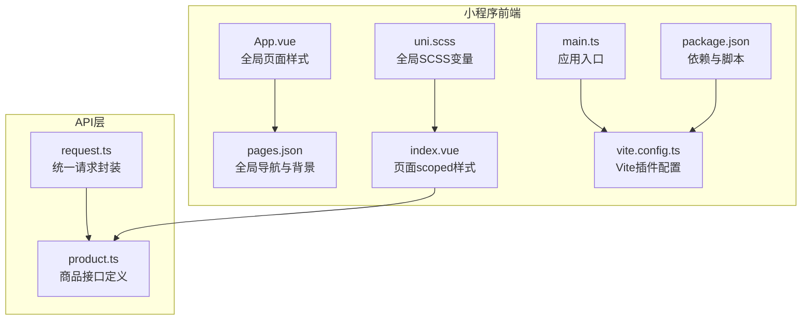
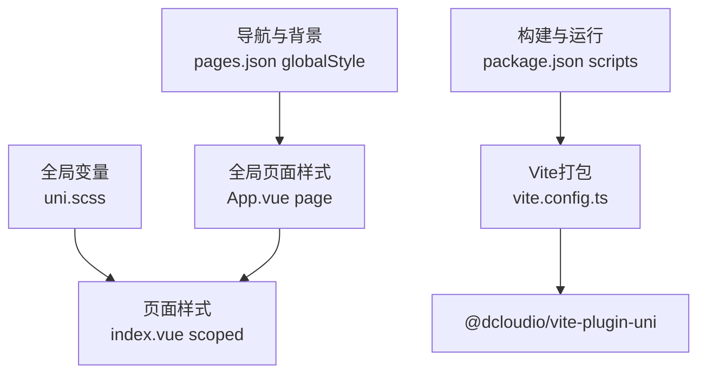
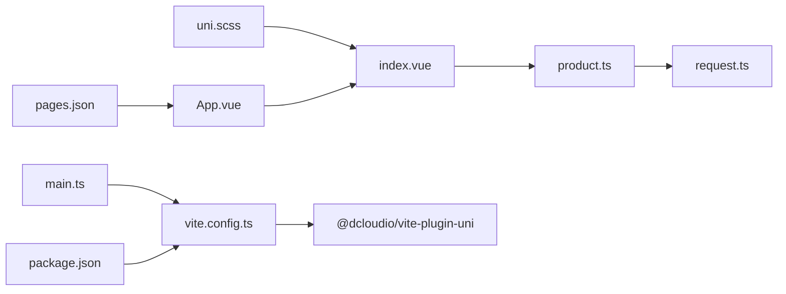

# UI样式系统

<cite>
**本文引用的文件**
- [uni.scss](file://shop-miniapp/src/uni.scss)
- [App.vue](file://shop-miniapp/src/App.vue)
- [index.vue](file://shop-miniapp/src/pages/index/index.vue)
- [pages.json](file://shop-miniapp/src/pages.json)
- [main.ts](file://shop-miniapp/src/main.ts)
- [package.json](file://shop-miniapp/package.json)
- [vite.config.ts](file://shop-miniapp/vite.config.ts)
- [product.ts](file://shop-miniapp/src/api/product.ts)
- [request.ts](file://shop-miniapp/src/api/request.ts)
- [2026-06-22-shop-miniprogram-design.md](file://docs/superpowers/specs/2026-06-22-shop-miniprogram-design.md)
- [2026-06-22-plan1-demo-foundation.md](file://docs/superpowers/plans/2026-06-22-plan1-demo-foundation.md)
</cite>

## 目录
1. [引言](#引言)
2. [项目结构](#项目结构)
3. [核心组件](#核心组件)
4. [架构总览](#架构总览)
5. [详细组件分析](#详细组件分析)
6. [依赖分析](#依赖分析)
7. [性能考虑](#性能考虑)
8. [故障排查指南](#故障排查指南)
9. [结论](#结论)
10. [附录](#附录)

## 引言
本文件针对“药食同源”微信小程序的UI样式系统进行系统化梳理与设计指导，覆盖样式架构、主题系统、响应式布局、CSS预处理器使用、样式模块化与组件隔离、移动端适配策略、性能优化与可维护性保障等方面。目标是帮助开发者在现有基础上快速建立一致、可扩展且高性能的样式体系。

## 项目结构
当前小程序采用 uni-app + Vue 3 + TypeScript + Vite 的技术栈，样式系统以全局 SCSS 变量与页面级 scoped 样式为主，配合全局页面样式与导航栏样式配置，形成“全局变量 + 页面隔离”的基础样式组织方式。

图表来源
- [App.vue:1-15](file://shop-miniapp/src/App.vue#L1-L15)
- [pages.json:1-17](file://shop-miniapp/src/pages.json#L1-L17)
- [uni.scss:1-6](file://shop-miniapp/src/uni.scss#L1-L6)
- [index.vue:65-122](file://shop-miniapp/src/pages/index/index.vue#L65-L122)
- [main.ts:1-11](file://shop-miniapp/src/main.ts#L1-L11)
- [vite.config.ts:1-7](file://shop-miniapp/vite.config.ts#L1-L7)
- [package.json:1-27](file://shop-miniapp/package.json#L1-L27)
- [request.ts:1-48](file://shop-miniapp/src/api/request.ts#L1-L48)
- [product.ts:1-42](file://shop-miniapp/src/api/product.ts#L1-L42)

章节来源
- [uni.scss:1-6](file://shop-miniapp/src/uni.scss#L1-L6)
- [App.vue:1-15](file://shop-miniapp/src/App.vue#L1-L15)
- [pages.json:1-17](file://shop-miniapp/src/pages.json#L1-L17)
- [index.vue:65-122](file://shop-miniapp/src/pages/index/index.vue#L65-L122)
- [main.ts:1-11](file://shop-miniapp/src/main.ts#L1-L11)
- [package.json:1-27](file://shop-miniapp/package.json#L1-L27)
- [vite.config.ts:1-7](file://shop-miniapp/vite.config.ts#L1-L7)
- [request.ts:1-48](file://shop-miniapp/src/api/request.ts#L1-L48)
- [product.ts:1-42](file://shop-miniapp/src/api/product.ts#L1-L42)

## 核心组件
- 全局样式变量：通过 uni.scss 定义主色、价格色、文本色、背景色等基础变量，供页面样式引用。
- 页面级样式：index.vue 使用 scoped 样式隔离组件样式，避免全局污染；同时使用 rpx 单位进行移动端适配。
- 全局页面样式：App.vue 中的 page 选择器设置全局背景与字体族，pages.json 设置导航栏与背景色，形成一致的视觉基线。
- 样式加载与打包：Vite 通过 @dcloudio/vite-plugin-uni 插件处理 uni-app 样式与资源，package.json 中定义构建与运行脚本。

章节来源
- [uni.scss:1-6](file://shop-miniapp/src/uni.scss#L1-L6)
- [index.vue:65-122](file://shop-miniapp/src/pages/index/index.vue#L65-L122)
- [App.vue:9-14](file://shop-miniapp/src/App.vue#L9-L14)
- [pages.json:10-15](file://shop-miniapp/src/pages.json#L10-L15)
- [vite.config.ts:1-7](file://shop-miniapp/vite.config.ts#L1-L7)
- [package.json:4-7](file://shop-miniapp/package.json#L4-L7)

## 架构总览
整体样式架构遵循“全局变量 + 页面隔离 + 导航与背景统一”的三层设计：
- 全局变量层：集中管理主题色、语义色、文本与背景色，便于统一风格与动态切换。
- 页面样式层：每个页面独立作用域，减少样式冲突，提升可维护性。
- 导航与背景层：统一导航栏与页面背景，确保品牌一致性。

图表来源
- [uni.scss:1-6](file://shop-miniapp/src/uni.scss#L1-L6)
- [index.vue:65-122](file://shop-miniapp/src/pages/index/index.vue#L65-L122)
- [App.vue:9-14](file://shop-miniapp/src/App.vue#L9-L14)
- [pages.json:10-15](file://shop-miniapp/src/pages.json#L10-L15)
- [package.json:4-7](file://shop-miniapp/package.json#L4-L7)
- [vite.config.ts:1-7](file://shop-miniapp/vite.config.ts#L1-L7)

## 详细组件分析

### 主题系统与变量管理
- 当前主题变量集中在 uni.scss，包含主色、价格色、文本色、次要文本色与背景色。
- 建议将变量进一步细分为“语义变量”和“层级变量”，例如：
  - 语义变量：主色、强调色（价格）、危险/成功/警告等。
  - 层级变量：文本层级（标题/正文/辅助/占位）、间距层级（XS/SM/MD/LG/XL）、圆角层级、阴影层级。
- 在页面中统一通过变量引用，避免硬编码颜色与尺寸，便于主题切换与品牌更新。

章节来源
- [uni.scss:1-6](file://shop-miniapp/src/uni.scss#L1-L6)

### 颜色体系与字体规范
- 颜色体系：基于 uni.scss 中的主色、价格色、文本色与背景色，建议补充“状态色”“边框色”“遮罩色”等，形成完整的语义色谱。
- 字体规范：App.vue 中已设置系统字体族，建议在 uni.scss 中增加字号变量（如标题/副标题/正文/说明），并在页面中统一引用，确保跨设备一致性。

章节来源
- [App.vue:10-13](file://shop-miniapp/src/App.vue#L10-L13)
- [uni.scss:1-6](file://shop-miniapp/src/uni.scss#L1-L6)

### 样式模块化与组件隔离
- 页面级隔离：index.vue 使用 scoped 样式，避免样式泄漏至其他页面。
- 组件级隔离：建议将公共组件（如按钮、标签、输入框等）拆分为独立 .vue 文件，并在组件内部使用 scoped 样式，必要时通过 CSS Modules 或命名空间前缀增强隔离性。
- 样式复用：将通用布局类（如宫格、卡片、列表项）抽取为 mixin 或工具类，减少重复代码。

章节来源
- [index.vue:65-122](file://shop-miniapp/src/pages/index/index.vue#L65-L122)

### 响应式布局与移动端适配
- 单位体系：当前页面广泛使用 rpx，这是小程序推荐的自适应单位，能根据屏幕宽度自动换算。
- 流式布局：index.vue 中商品网格采用 flex + gap 实现流式排列，结合 calc(50% - 8rpx) 控制列宽与间距，适合双列展示。
- 交互态：分类栏使用横向滚动与激活态高亮，提升可发现性与操作反馈。

章节来源
- [index.vue:85-95](file://shop-miniapp/src/pages/index/index.vue#L85-L95)
- [index.vue:110-115](file://shop-miniapp/src/pages/index/index.vue#L110-L115)

### 导航栏与页面背景
- 导航栏：pages.json 中统一设置导航栏文字颜色、标题与背景色，确保品牌一致性。
- 页面背景：pages.json 与 App.vue 的 page 选择器共同决定页面背景色，建议保持一致，避免视觉割裂。

章节来源
- [pages.json:10-15](file://shop-miniapp/src/pages.json#L10-L15)
- [App.vue:10-13](file://shop-miniapp/src/App.vue#L10-L13)

### 样式加载与构建
- Vite 插件：vite.config.ts 通过 @dcloudio/vite-plugin-uni 处理 uni-app 的样式与资源。
- 脚本命令：package.json 中提供开发与构建脚本，分别用于小程序平台的调试与打包。

章节来源
- [vite.config.ts:1-7](file://shop-miniapp/vite.config.ts#L1-L7)
- [package.json:4-7](file://shop-miniapp/package.json#L4-L7)

### API与数据驱动的样式联动
- 商品列表：index.vue 通过 API 获取商品数据，渲染图片、名称与价格，样式围绕数据结构进行布局与排版。
- 错误与空态：当商品列表为空时显示提示文案，建议在 uni.scss 中增加“空态色”变量，统一提示文案的配色与字号。

章节来源
- [index.vue:17-30](file://shop-miniapp/src/pages/index/index.vue#L17-L30)
- [product.ts:28-42](file://shop-miniapp/src/api/product.ts#L28-L42)
- [request.ts:14-48](file://shop-miniapp/src/api/request.ts#L14-L48)

## 依赖分析
样式系统与构建、运行、页面配置存在如下依赖关系：

图表来源
- [uni.scss:1-6](file://shop-miniapp/src/uni.scss#L1-L6)
- [index.vue:65-122](file://shop-miniapp/src/pages/index/index.vue#L65-L122)
- [App.vue:1-15](file://shop-miniapp/src/App.vue#L1-L15)
- [pages.json:1-17](file://shop-miniapp/src/pages.json#L1-17)
- [main.ts:1-11](file://shop-miniapp/src/main.ts#L1-L11)
- [vite.config.ts:1-7](file://shop-miniapp/vite.config.ts#L1-L7)
- [package.json:1-27](file://shop-miniapp/package.json#L1-L27)
- [product.ts:1-42](file://shop-miniapp/src/api/product.ts#L1-L42)
- [request.ts:1-48](file://shop-miniapp/src/api/request.ts#L1-L48)

章节来源
- [uni.scss:1-6](file://shop-miniapp/src/uni.scss#L1-L6)
- [index.vue:65-122](file://shop-miniapp/src/pages/index/index.vue#L65-L122)
- [App.vue:1-15](file://shop-miniapp/src/App.vue#L1-L15)
- [pages.json:1-17](file://shop-miniapp/src/pages.json#L1-L17)
- [main.ts:1-11](file://shop-miniapp/src/main.ts#L1-L11)
- [vite.config.ts:1-7](file://shop-miniapp/vite.config.ts#L1-L7)
- [package.json:1-27](file://shop-miniapp/package.json#L1-L27)
- [product.ts:1-42](file://shop-miniapp/src/api/product.ts#L1-L42)
- [request.ts:1-48](file://shop-miniapp/src/api/request.ts#L1-L48)

## 性能考虑
- 样式体积控制：尽量复用变量与通用类，避免在页面中重复声明相似样式；拆分页面样式为多个小文件，利用 uni-app 的按需加载能力。
- rpx 适配：保持统一的 rpx 基准，减少复杂计算，降低运行时样式解析开销。
- 图片与背景：商品图片使用合适的尺寸与格式，避免过大资源导致渲染阻塞。
- 动画与过渡：谨慎使用复杂动画，优先使用 transform 与 opacity，减少重绘与回流。

## 故障排查指南
- 样式不生效
  - 检查是否正确使用 scoped 样式，避免选择器权重不足导致覆盖。
  - 确认 uni.scss 是否被页面引用，或是否在 App.vue 的 page 选择器中被覆盖。
- 颜色不一致
  - 统一使用 uni.scss 中的变量，避免直接写死颜色值。
  - 检查 pages.json 与 App.vue 的全局样式是否与变量定义冲突。
- 移动端显示异常
  - 确认 rpx 单位使用是否合理，避免固定 px 导致在不同设备上比例失真。
  - 检查横向滚动容器的 white-space 与 margin 设置，确保滚动区域正确。
- 构建报错
  - 确认 @dcloudio/vite-plugin-uni 插件已安装并正确配置。
  - 检查 package.json 中的脚本命令是否指向正确的平台（如 mp-weixin）。

章节来源
- [uni.scss:1-6](file://shop-miniapp/src/uni.scss#L1-L6)
- [index.vue:65-122](file://shop-miniapp/src/pages/index/index.vue#L65-L122)
- [App.vue:9-14](file://shop-miniapp/src/App.vue#L9-L14)
- [pages.json:10-15](file://shop-miniapp/src/pages.json#L10-L15)
- [vite.config.ts:1-7](file://shop-miniapp/vite.config.ts#L1-L7)
- [package.json:4-7](file://shop-miniapp/package.json#L4-L7)

## 结论
当前样式系统以全局变量与页面 scoped 样式为基础，配合统一的导航与背景配置，已具备良好的可维护性与一致性。建议在此基础上完善主题变量体系、细化颜色与字体规范、加强组件级样式隔离，并持续优化构建与性能，以支撑业务的长期演进。

## 附录
- 设计文档中明确指出前端技术栈包含 uni-app + uView Plus，可在后续引入 UI 组件库的样式规范与主题能力，进一步提升开发效率与一致性。
- 基础规划文档展示了项目文件结构与模块划分，便于在样式系统扩展时进行模块化组织与职责边界划分。

章节来源
- [2026-06-22-shop-miniprogram-design.md:20-33](file://docs/superpowers/specs/2026-06-22-shop-miniprogram-design.md#L20-L33)
- [2026-06-22-plan1-demo-foundation.md:13-125](file://docs/superpowers/plans/2026-06-22-plan1-demo-foundation.md#L13-L125)