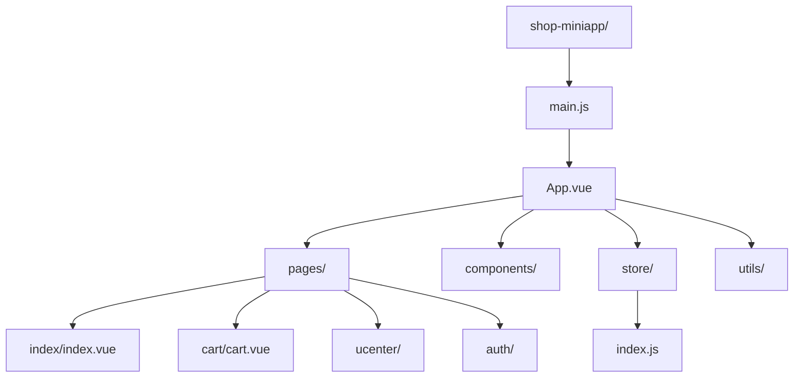
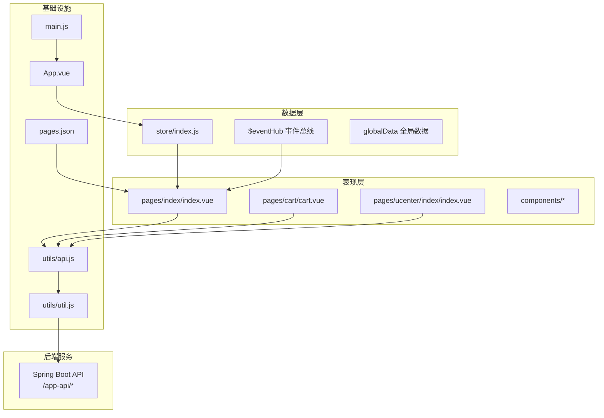
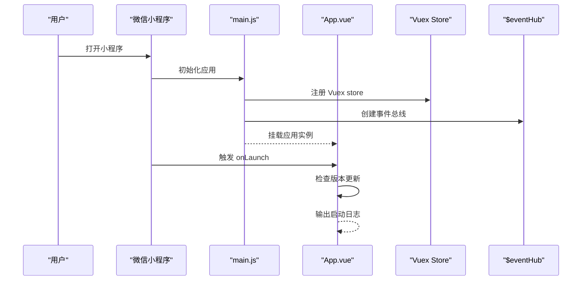
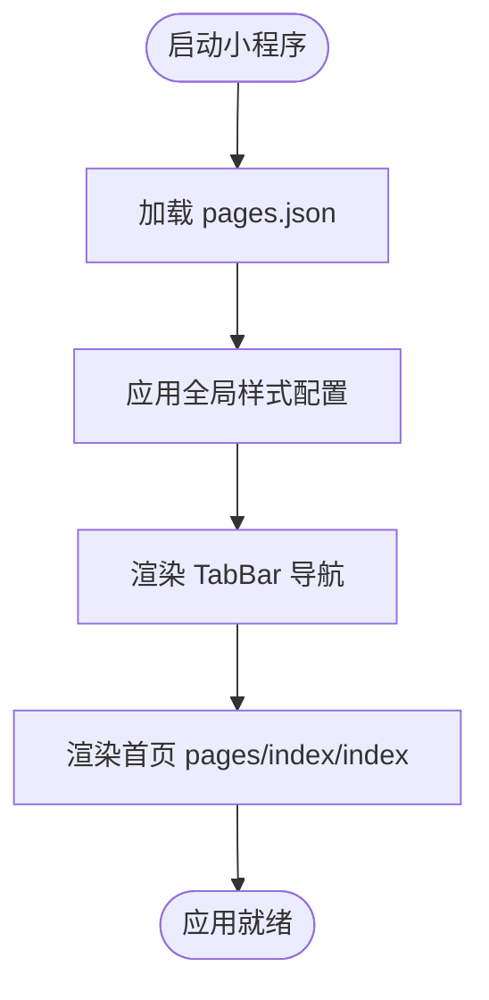
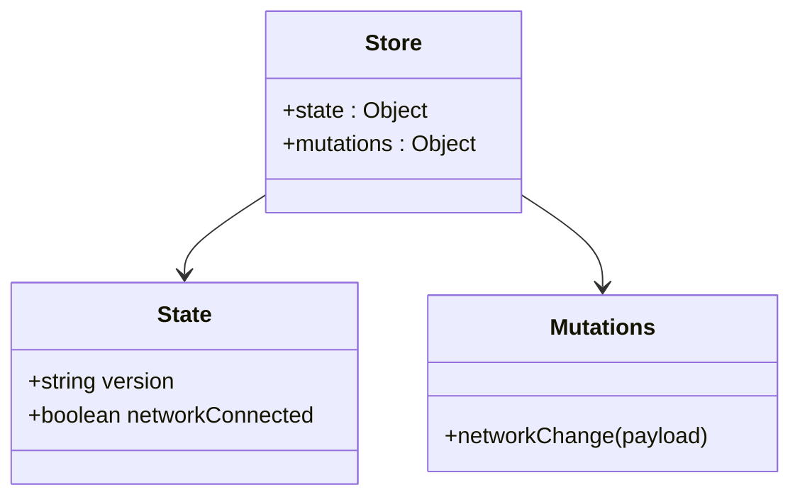
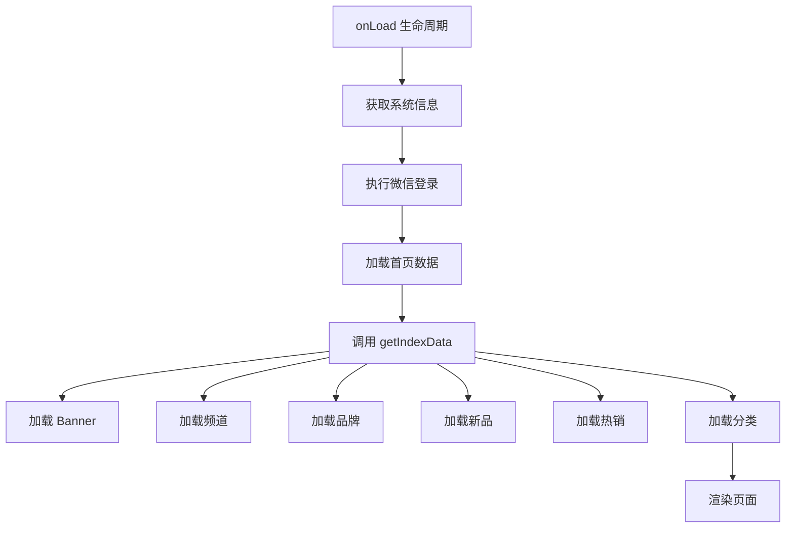
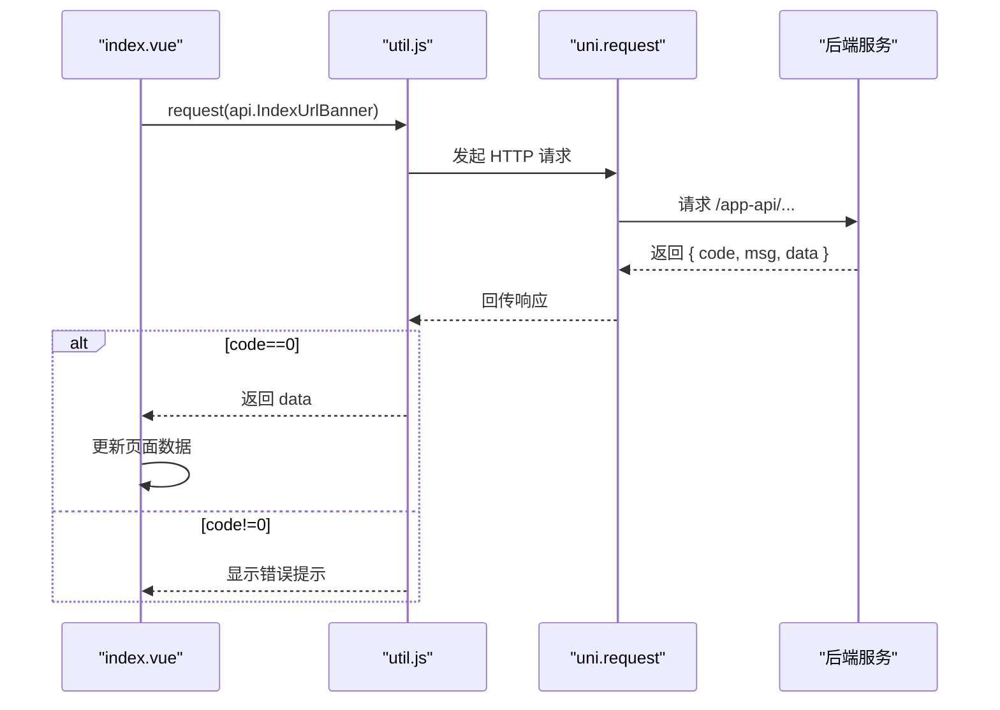
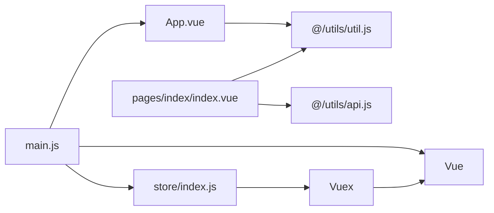

# 前端架构设计

<cite>
**本文引用的文件**
- [main.js](file://shop-miniapp/main.js)
- [App.vue](file://shop-miniapp/App.vue)
- [pages.json](file://shop-miniapp/pages.json)
- [index.vue](file://shop-miniapp/pages/index/index.vue)
- [store/index.js](file://shop-miniapp/store/index.js)
- [manifest.json](file://shop-miniapp/manifest.json)
</cite>

## 更新摘要
**所做更改**
- 将技术栈从 Vue3/TypeScript/Pinia 迁移到 Vue2/Vuex/uni-app
- 重构应用入口和状态管理模式
- 更新页面路由配置以支持完整的电商功能
- 重新设计API请求封装和数据管理策略
- 添加完整的用户中心、购物车、认证等电商模块

## 目录
1. [引言](#引言)
2. [项目结构](#项目结构)
3. [核心组件](#核心组件)
4. [架构总览](#架构总览)
5. [详细组件分析](#详细组件分析)
6. [依赖分析](#依赖分析)
7. [性能考虑](#性能考虑)
8. [故障排查指南](#故障排查指南)
9. [结论](#结论)
10. [附录](#附录)

## 引言
本设计文档面向"药食同源"微信小程序前端，基于 uni-app + Vue2 + Vuex 的跨平台小程序开发架构，系统性阐述项目结构设计原则、组件化开发模式、页面路由配置、API 接口封装策略、状态管理模式（Vuex）、小程序与后端服务的通信协议与错误处理机制，以及样式管理、响应式布局、开发工具链与构建优化、性能调优与最佳实践。

该小程序采用完整的电商实现，包括购物车、用户中心、认证系统和模拟数据系统，遵循模块化开发流程，确保前后端一致的接口契约与统一的错误/响应格式。

## 项目结构
- 前端工程位于 shop-miniapp，采用 uni-app 的多端统一开发范式，目标平台为微信小程序（mp-weixin）。
- 项目采用 Vue2 + Vuex 进行状态管理，通过 main.js 作为应用入口，App.vue 作为根组件。
- 页面路由通过 pages.json 配置，支持完整的电商功能模块。
- 状态管理使用 Vuex，提供全局状态管理和网络状态监听。

图表来源
- [main.js:1-29](file://shop-miniapp/main.js#L1-L29)
- [App.vue:1-72](file://shop-miniapp/App.vue#L1-L72)
- [pages.json:1-414](file://shop-miniapp/pages.json#L1-L414)
- [store/index.js:1-21](file://shop-miniapp/store/index.js#L1-L21)

章节来源
- [main.js:1-29](file://shop-miniapp/main.js#L1-L29)
- [App.vue:1-72](file://shop-miniapp/App.vue#L1-L72)
- [pages.json:1-414](file://shop-miniapp/pages.json#L1-L414)
- [store/index.js:1-21](file://shop-miniapp/store/index.js#L1-L21)

## 核心组件
- 应用入口与初始化
  - main.js 作为应用入口，创建 Vue 实例并挂载 Vuex store；App.vue 作为根组件，负责应用生命周期钩子和全局更新机制。
  - 应用启动时自动检查版本更新，支持热更新和降级提示。
- 状态管理
  - 使用 Vuex 进行全局状态管理，包含应用版本和网络连接状态。
  - 提供网络状态监听，实时更新网络连接状态。
- 页面与路由
  - 路由配置集中在 pages.json，定义完整的电商页面结构和 TabBar 导航。
  - 支持首页、分类、购物车、用户中心等核心电商页面。
- API 与数据层
  - 通过 utils/api.js 统一管理 API 接口地址。
  - 使用 utils/util.js 中的 request 方法封装网络请求。
- 页面示例
  - index.vue 展示完整首页：自定义导航栏、搜索栏、分类Tab、轮播Banner、金刚区、公告栏、限时特惠、商品瀑布流等。

章节来源
- [main.js:1-29](file://shop-miniapp/main.js#L1-L29)
- [App.vue:1-72](file://shop-miniapp/App.vue#L1-L72)
- [pages.json:1-414](file://shop-miniapp/pages.json#L1-L414)
- [index.vue:1-1294](file://shop-miniapp/pages/index/index.vue#L1-L1294)
- [store/index.js:1-21](file://shop-miniapp/store/index.js#L1-L21)

## 架构总览
整体架构分为三层：表现层（页面与组件）、数据层（API 封装与状态管理）、基础设施（路由、构建、样式）。小程序通过 uni.request 与后端服务通信，遵循统一响应格式与鉴权头规范。

图表来源
- [index.vue:1-1294](file://shop-miniapp/pages/index/index.vue#L1-L1294)
- [store/index.js:1-21](file://shop-miniapp/store/index.js#L1-L21)
- [main.js:1-29](file://shop-miniapp/main.js#L1-L29)
- [App.vue:1-72](file://shop-miniapp/App.vue#L1-L72)
- [pages.json:1-414](file://shop-miniapp/pages.json#L1-L414)

## 详细组件分析

### 应用入口与状态管理（main.js、App.vue）
- 入口职责
  - main.js 创建 Vue 实例，安装 Vuex store，注入 $eventHub 事件总线，设置 App.mpType = 'app'。
  - 集成网络状态监听，实时更新网络连接状态到 Vuex store。
- App.vue
  - globalData 管理全局用户信息和 token。
  - onLaunch 钩子实现小程序版本更新机制，支持热更新和兼容性处理。
  - onError 钩子实现全局错误监听和上报。

图表来源
- [main.js:1-29](file://shop-miniapp/main.js#L1-L29)
- [App.vue:1-72](file://shop-miniapp/App.vue#L1-L72)
- [store/index.js:1-21](file://shop-miniapp/store/index.js#L1-L21)

章节来源
- [main.js:1-29](file://shop-miniapp/main.js#L1-L29)
- [App.vue:1-72](file://shop-miniapp/App.vue#L1-L72)
- [store/index.js:1-21](file://shop-miniapp/store/index.js#L1-L21)

### 页面路由与全局配置（pages.json）
- 路由配置
  - pages.json 定义完整的电商页面结构，包括首页、分类、购物车、用户中心等核心页面。
  - 配置 TabBar 底部导航，包含首页、分类、购物车、我的四个主要入口。
  - 每个页面都有详细的样式配置，包括导航栏标题、背景色、下拉刷新等。
- 全局样式
  - globalStyle 设置全局导航栏标题、背景色、文本样式等。
  - easycom 配置自动扫描组件，简化组件引用。

图表来源
- [pages.json:1-414](file://shop-miniapp/pages.json#L1-L414)

章节来源
- [pages.json:1-414](file://shop-miniapp/pages.json#L1-L414)

### 状态管理（store/index.js）
- Vuex 状态管理
  - state 定义全局状态：应用版本号和网络连接状态。
  - mutations 提供状态修改方法：networkChange 用于更新网络连接状态。
- 网络状态监听
  - main.js 中集成网络状态监听，实时检测网络连接变化。
  - 通过网络状态变化更新 Vuex store 中的 networkConnected 状态。

图表来源
- [store/index.js:1-21](file://shop-miniapp/store/index.js#L1-L21)
- [main.js:10-17](file://shop-miniapp/main.js#L10-L17)

章节来源
- [store/index.js:1-21](file://shop-miniapp/store/index.js#L1-L21)
- [main.js:10-17](file://shop-miniapp/main.js#L10-L17)

### 首页组件（index.vue）
- 结构与交互
  - 自定义顶部导航栏，显示品牌Logo和标语。
  - 搜索栏支持商品和品牌搜索跳转。
  - 横向滚动分类Tab，支持精选、滋补养生、茶饮花茶等多个品类。
  - 轮播Banner展示促销活动。
  - 金刚区快捷入口：新人礼、会员、优惠券、分销、全部分类。
  - 公告栏轮播展示重要通知。
  - 限时特惠和新品推荐双栏布局。
  - 商品瀑布流展示，支持快速加入购物车动画效果。
  - 新人礼包、会员年卡、分销赚钱等营销弹窗。
- 数据绑定与生命周期
  - 使用 data() 管理页面状态：banner、brands、newGoods、hotGoods、goodsList 等。
  - computed 计算属性：displayGoods、leftGoods、rightGoods 实现商品筛选和分页。
  - methods 方法：getIndexData、switchTab、loadTabGoods、quickAddToCart 等核心业务逻辑。
  - onLoad 生命周期：获取系统信息、执行微信登录、加载首页数据。

图表来源
- [index.vue:522-538](file://shop-miniapp/pages/index/index.vue#L522-L538)
- [index.vue:342-367](file://shop-miniapp/pages/index/index.vue#L342-L367)

章节来源
- [index.vue:1-1294](file://shop-miniapp/pages/index/index.vue#L1-L1294)

### API 接口与数据管理
- API 接口管理
  - 通过 require('@/utils/api.js') 引入统一的 API 接口地址配置。
  - 支持首页相关接口：IndexUrlBanner、IndexUrlChannel、IndexUrlBrand、IndexUrlNewGoods、IndexUrlHotGoods、IndexUrlCategory。
  - 支持商品相关接口：GoodsList、GoodsDetail、CartAdd 等。
- 网络请求封装
  - 使用 require('@/utils/util.js') 中的 request 方法进行网络请求。
  - 支持 GET/POST 等多种请求方式，自动处理 JSON 数据格式。
  - 统一的错误处理和成功响应解析。
- 用户认证
  - 在 onLoad 生命周期中执行 uni.login 获取用户登录态。
  - 成功后存储 userInfo、token、userId 到本地存储。

图表来源
- [index.vue:342-367](file://shop-miniapp/pages/index/index.vue#L342-L367)
- [index.vue:526-536](file://shop-miniapp/pages/index/index.vue#L526-L536)

章节来源
- [index.vue:342-367](file://shop-miniapp/pages/index/index.vue#L342-L367)
- [index.vue:526-536](file://shop-miniapp/pages/index/index.vue#L526-L536)

## 依赖分析
- 依赖关系
  - main.js 依赖 Vue、App、store；App.vue 依赖 @/utils/util.js。
  - index.vue 依赖 @/utils/api.js 和 @/utils/util.js。
  - store/index.js 依赖 Vue 和 Vuex。
  - pages.json 控制所有页面路由和全局配置。
- 核心依赖
  - Vue 2.x：前端框架核心。
  - Vuex：状态管理库。
  - uni-app：跨平台小程序开发框架。
  - uParse：富文本解析组件。

图表来源
- [main.js:1-29](file://shop-miniapp/main.js#L1-L29)
- [store/index.js:1-21](file://shop-miniapp/store/index.js#L1-L21)
- [index.vue:276-277](file://shop-miniapp/pages/index/index.vue#L276-L277)

章节来源
- [main.js:1-29](file://shop-miniapp/main.js#L1-L29)
- [store/index.js:1-21](file://shop-miniapp/store/index.js#L1-L21)
- [index.vue:276-277](file://shop-miniapp/pages/index/index.vue#L276-L277)

## 性能考虑
- 应用启动优化
  - 使用懒加载策略，仅在需要时加载页面资源。
  - 图片资源使用远程URL，建议结合CDN加速。
  - 小程序版本更新机制，支持热更新减少用户等待时间。
- 网络请求优化
  - 统一的请求封装，避免重复代码。
  - 合理的缓存策略，对不常变化的数据进行本地缓存。
  - 错误重试机制，提高网络请求成功率。
- 页面渲染优化
  - 使用虚拟列表或分页加载，避免一次性渲染大量数据。
  - 合理使用 v-if 和 v-show，优化条件渲染性能。
  - 图片懒加载，减少首屏加载压力。
- 状态管理优化
  - Vuex 状态按需更新，避免不必要的重渲染。
  - 合理使用 computed 计算属性，利用缓存机制提升性能。

## 故障排查指南
- 常见问题与定位
  - 应用无法启动：检查 main.js 中的 Vue 实例创建和 store 注册是否正确。
  - 页面空白或样式异常：检查 pages.json 中的页面配置和样式引用路径。
  - 网络请求失败：确认 API 接口地址配置和网络权限设置。
  - 状态管理异常：检查 Vuex store 的 state 和 mutations 定义。
  - 版本更新问题：查看 App.vue 中的更新机制实现。
- 调试建议
  - 使用微信开发者工具的调试面板查看控制台日志。
  - 在关键方法中添加 console.log 输出调试信息。
  - 使用 Vue DevTools 调试组件状态和事件。

章节来源
- [main.js:1-29](file://shop-miniapp/main.js#L1-L29)
- [App.vue:12-46](file://shop-miniapp/App.vue#L12-L46)
- [pages.json:1-414](file://shop-miniapp/pages.json#L1-L414)
- [store/index.js:1-21](file://shop-miniapp/store/index.js#L1-L21)

## 结论
本架构以 uni-app + Vue2 + Vuex 为核心，结合完整的电商功能实现，实现了从路由、状态管理到页面组件的清晰分层。通过 pages.json 管理页面路由，Vuex 管理全局状态，util.js 封装网络请求，构建了稳定可靠的电商小程序前端架构。后续可在现有基础上扩展更多电商功能，如订单管理、支付集成、消息推送等，逐步完善至完整的药食同源电商平台。

## 附录
- 开发与测试流程
  - 使用微信开发者工具导入 shop-miniapp 目录进行开发和调试。
  - 支持多端编译，可编译为微信小程序、H5、App等多端应用。
- 规范与协作
  - 采用模块化开发，按功能划分目录结构。
  - 统一的代码规范和注释标准，便于团队协作维护。
  - 完善的错误处理和用户反馈机制，提升用户体验。

章节来源
- [manifest.json:1-1](file://shop-miniapp/manifest.json#L1-L1)
- [pages.json:382-413](file://shop-miniapp/pages.json#L382-L413)