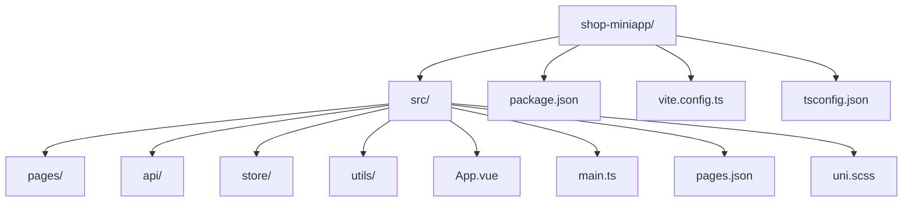
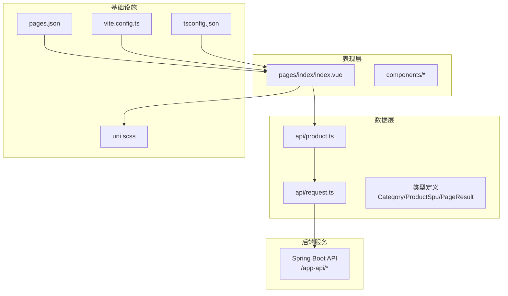
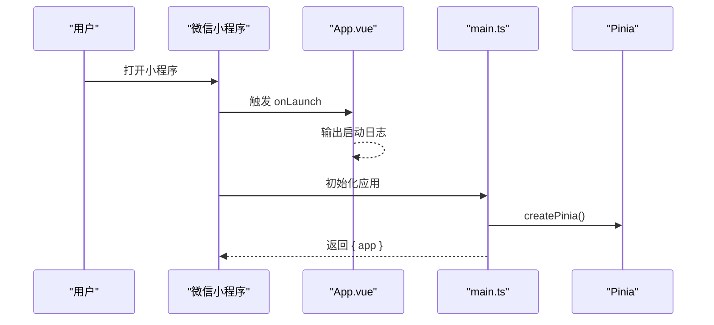
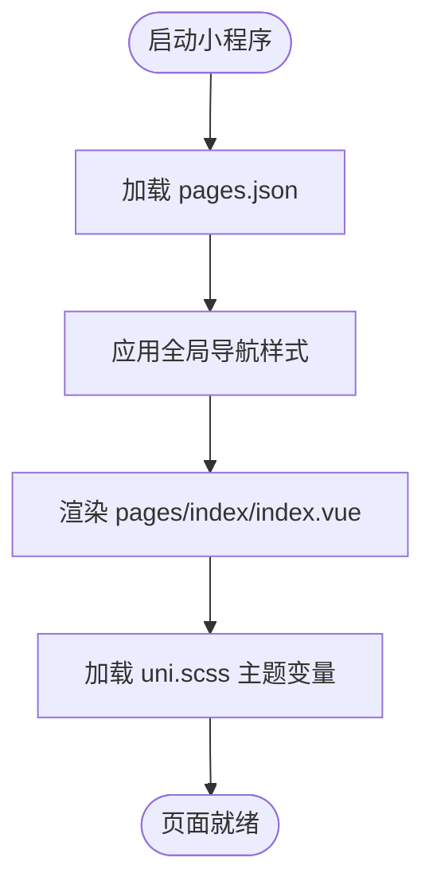
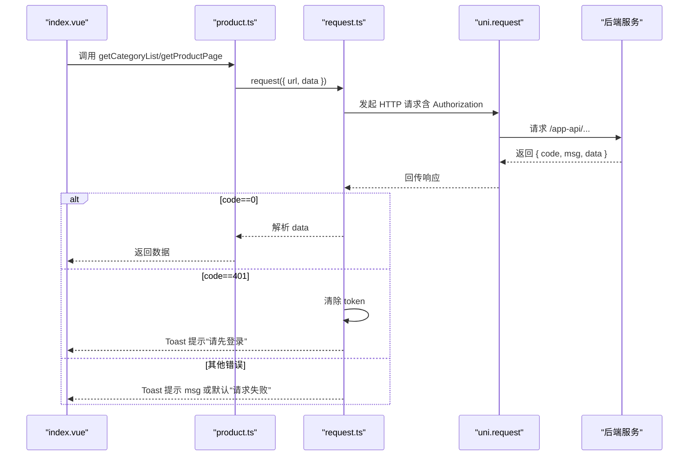
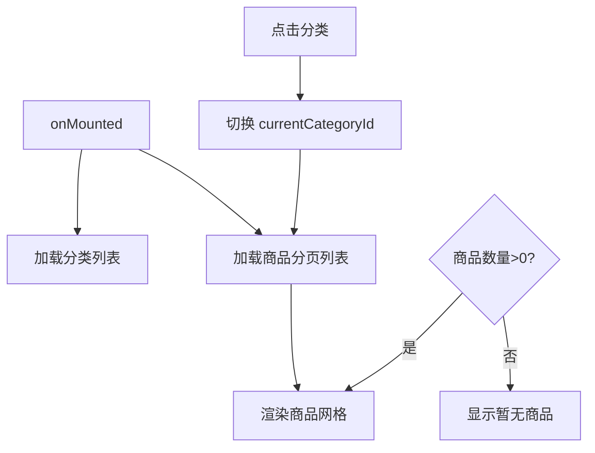
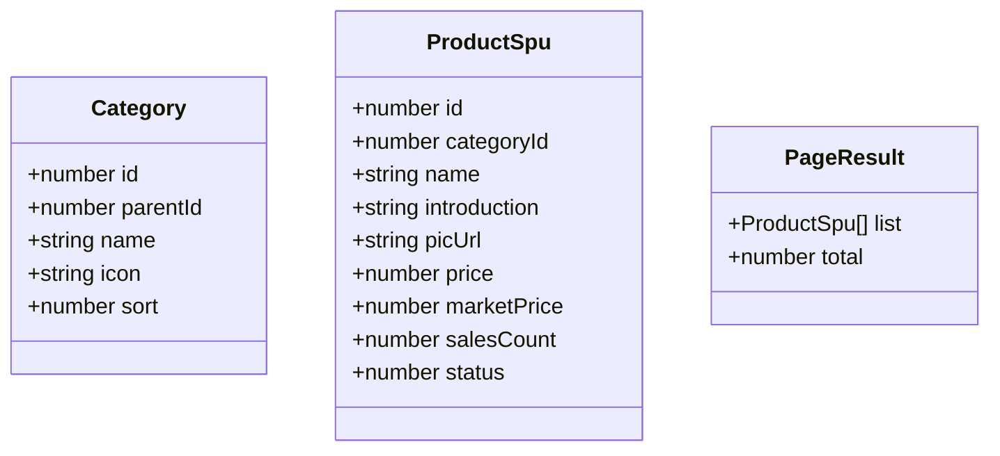
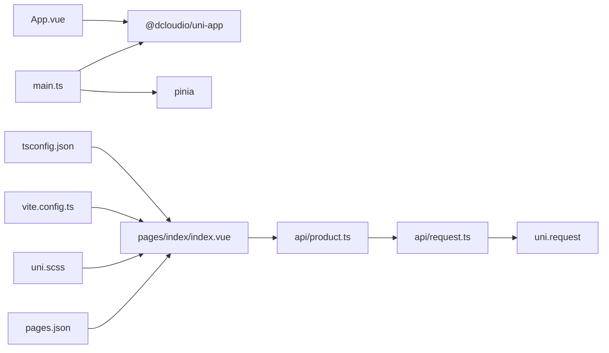

# 前端架构设计

<cite>
**本文引用的文件**
- [main.ts](file://shop-miniapp/src/main.ts)
- [App.vue](file://shop-miniapp/src/App.vue)
- [pages.json](file://shop-miniapp/src/pages.json)
- [package.json](file://shop-miniapp/package.json)
- [vite.config.ts](file://shop-miniapp/vite.config.ts)
- [tsconfig.json](file://shop-miniapp/tsconfig.json)
- [request.ts](file://shop-miniapp/src/api/request.ts)
- [product.ts](file://shop-miniapp/src/api/product.ts)
- [index.vue](file://shop-miniapp/src/pages/index/index.vue)
- [uni.scss](file://shop-miniapp/src/uni.scss)
- [README.md](file://README.md)
- [2026-06-22-shop-miniprogram-design.md](file://docs/superpowers/specs/2026-06-22-shop-miniprogram-design.md)
- [status.md](file://docs/superpowers/status.md)
- [conventions.md](file://docs/conventions.md)
- [copilot-instructions.md](file://.github/copilot-instructions.md)
</cite>

## 目录
1. [引言](#引言)
2. [项目结构](#项目结构)
3. [核心组件](#核心组件)
4. [架构总览](#架构总览)
5. [详细组件分析](#详细组件分析)
6. [依赖分析](#依赖分析)
7. [性能考虑](#性能考虑)
8. [故障排查指南](#故障排查指南)
9. [结论](#结论)
10. [附录](#附录)

## 引言
本设计文档面向“药食同源”微信小程序前端，基于 uni-app 3.0 + Vue3 + TypeScript + Pinia 的跨平台小程序开发架构，系统性阐述项目结构设计原则、组件化开发模式、页面路由配置、API 接口封装策略、状态管理模式（Pinia）、小程序与后端服务的通信协议与错误处理机制，以及样式管理、响应式布局、开发工具链与构建优化、性能调优与最佳实践。

该小程序以“首页 + 商品分类 + 商品列表”的最小可用原型为基础，逐步扩展至完整的电商与课程学习场景，遵循 Spec-Driven 开发流程，确保前后端一致的接口契约与统一的错误/响应格式。

## 项目结构
- 前端工程位于 shop-miniapp，采用 uni-app 3.0 的多端统一开发范式，目标平台为微信小程序（mp-weixin）。
- 项目采用 TypeScript + Vite 构建，使用 Pinia 进行状态管理，API 层通过统一请求封装与后端交互。
- 页面路由通过 pages.json 配置，全局样式通过 uni.scss 管理主题变量。
- 开发工具链通过 package.json 的 scripts 脚本进行一键启动与构建。

图表来源
- [package.json:1-27](file://shop-miniapp/package.json#L1-L27)
- [vite.config.ts:1-7](file://shop-miniapp/vite.config.ts#L1-L7)
- [tsconfig.json:1-20](file://shop-miniapp/tsconfig.json#L1-L20)

章节来源
- [package.json:1-27](file://shop-miniapp/package.json#L1-L27)
- [vite.config.ts:1-7](file://shop-miniapp/vite.config.ts#L1-L7)
- [tsconfig.json:1-20](file://shop-miniapp/tsconfig.json#L1-L20)
- [README.md:12-41](file://README.md#L12-L41)

## 核心组件
- 应用入口与状态管理
  - 应用入口在 main.ts 中创建 SSR App 并挂载 Pinia；App.vue 作为根组件，负责应用生命周期钩子。
  - 状态管理采用 Pinia，通过 createPinia() 初始化并注入应用实例。
- 页面与路由
  - 路由配置集中在 pages.json，定义首页路径与全局导航样式。
- API 与数据层
  - request.ts 提供统一请求封装，内置统一响应格式解析、鉴权头注入、401 自动登出与 Toast 错误提示。
  - product.ts 定义商品相关的接口方法（分类列表、分页列表、详情）与数据模型类型。
- 页面示例
  - index.vue 展示首页布局：横向分类滚动 + 商品网格展示，结合 API 方法加载数据。
- 样式与主题
  - uni.scss 定义全局 Sass 变量（主色、价格色、文本色、背景色），页面样式通过 scoped 方式隔离。

章节来源
- [main.ts:1-11](file://shop-miniapp/src/main.ts#L1-L11)
- [App.vue:1-15](file://shop-miniapp/src/App.vue#L1-L15)
- [pages.json:1-17](file://shop-miniapp/src/pages.json#L1-L17)
- [request.ts:1-48](file://shop-miniapp/src/api/request.ts#L1-L48)
- [product.ts:1-42](file://shop-miniapp/src/api/product.ts#L1-L42)
- [index.vue:1-122](file://shop-miniapp/src/pages/index/index.vue#L1-L122)
- [uni.scss:1-6](file://shop-miniapp/src/uni.scss#L1-L6)

## 架构总览
整体架构分为三层：表现层（页面与组件）、数据层（API 封装与类型）、基础设施（路由、构建、样式）。小程序通过 uni.request 与后端服务通信，遵循统一响应格式与鉴权头规范。

图表来源
- [index.vue:1-122](file://shop-miniapp/src/pages/index/index.vue#L1-L122)
- [product.ts:1-42](file://shop-miniapp/src/api/product.ts#L1-L42)
- [request.ts:1-48](file://shop-miniapp/src/api/request.ts#L1-L48)
- [pages.json:1-17](file://shop-miniapp/src/pages.json#L1-L17)
- [vite.config.ts:1-7](file://shop-miniapp/vite.config.ts#L1-L7)
- [tsconfig.json:1-20](file://shop-miniapp/tsconfig.json#L1-L20)
- [uni.scss:1-6](file://shop-miniapp/src/uni.scss#L1-L6)

## 详细组件分析

### 应用入口与状态管理（main.ts、App.vue）
- 入口职责
  - 创建 SSR 应用实例，安装 Pinia 插件，导出 { app } 供 uni-app 生命周期使用。
- App.vue
  - 在 onLaunch 钩子中输出日志，页面样式通过全局样式定义字体与背景色。

图表来源
- [main.ts:1-11](file://shop-miniapp/src/main.ts#L1-L11)
- [App.vue:1-15](file://shop-miniapp/src/App.vue#L1-L15)

章节来源
- [main.ts:1-11](file://shop-miniapp/src/main.ts#L1-L11)
- [App.vue:1-15](file://shop-miniapp/src/App.vue#L1-L15)

### 页面路由与全局样式（pages.json、uni.scss）
- 路由配置
  - pages.json 定义首页路径与导航栏标题、背景色等全局样式。
- 样式管理
  - uni.scss 定义主题变量，页面通过 scoped 样式隔离，使用 rpx 单位适配多端。

图表来源
- [pages.json:1-17](file://shop-miniapp/src/pages.json#L1-L17)
- [uni.scss:1-6](file://shop-miniapp/src/uni.scss#L1-L6)

章节来源
- [pages.json:1-17](file://shop-miniapp/src/pages.json#L1-L17)
- [uni.scss:1-6](file://shop-miniapp/src/uni.scss#L1-L6)

### API 接口封装（request.ts、product.ts）
- 统一请求封装
  - request(options)：支持 GET/POST/PUT/DELETE，默认 JSON Content-Type，自动注入 Authorization 头（来自本地存储 token）。
  - 统一响应格式解析：code=0 成功返回 data；code=401 自动清除 token 并 Toast 提示“请先登录”；其他错误统一 Toast 提示。
  - 网络失败兜底：Toast 提示“网络异常”，reject 返回错误对象。
- 商品模块 API
  - getCategoryList：获取分类列表
  - getProductPage：分页获取商品列表（支持 categoryId、pageNo、pageSize）
  - getProductDetail：根据 id 获取商品详情
  - 类型定义：Category、ProductSpu、PageResult

图表来源
- [index.vue:33-62](file://shop-miniapp/src/pages/index/index.vue#L33-L62)
- [product.ts:1-42](file://shop-miniapp/src/api/product.ts#L1-L42)
- [request.ts:1-48](file://shop-miniapp/src/api/request.ts#L1-L48)

章节来源
- [request.ts:1-48](file://shop-miniapp/src/api/request.ts#L1-L48)
- [product.ts:1-42](file://shop-miniapp/src/api/product.ts#L1-L42)
- [index.vue:33-62](file://shop-miniapp/src/pages/index/index.vue#L33-L62)

### 页面组件（index.vue）
- 结构与交互
  - 顶部横向滚动分类栏，点击切换当前分类，触发商品列表刷新。
  - 商品网格展示，图片 + 标题 + 价格，价格以元显示（后端以分存储）。
  - 无数据时显示“暂无商品”提示。
- 数据绑定与生命周期
  - 使用 ref 管理 categories、products、currentCategoryId。
  - onMounted 生命周期中加载分类与商品列表。

图表来源
- [index.vue:33-62](file://shop-miniapp/src/pages/index/index.vue#L33-L62)

章节来源
- [index.vue:1-122](file://shop-miniapp/src/pages/index/index.vue#L1-L122)

### 类型与数据模型
- 类型定义
  - Category：分类模型（id、parentId、name、icon、sort）
  - ProductSpu：商品模型（id、categoryId、name、introduction、picUrl、price、marketPrice、salesCount、status）
  - PageResult：分页结果（list、total）

图表来源
- [product.ts:3-26](file://shop-miniapp/src/api/product.ts#L3-L26)

章节来源
- [product.ts:1-42](file://shop-miniapp/src/api/product.ts#L1-L42)

## 依赖分析
- 依赖关系
  - main.ts 依赖 @dcloudio/uni-app 与 pinia；App.vue 依赖 @dcloudio/uni-app 生命周期钩子。
  - index.vue 依赖 product.ts；product.ts 依赖 request.ts；request.ts 依赖 uni.request。
  - pages.json 控制页面路由；uni.scss 提供样式变量；vite.config.ts 配置 uni 插件；tsconfig.json 提供 TypeScript 编译选项与路径别名。
- 开发与构建
  - package.json 提供 dev:mp-weixin 与 build:mp-weixin 脚本，用于本地开发与构建微信小程序产物。

图表来源
- [main.ts:1-11](file://shop-miniapp/src/main.ts#L1-L11)
- [App.vue:1-15](file://shop-miniapp/src/App.vue#L1-L15)
- [index.vue:33-35](file://shop-miniapp/src/pages/index/index.vue#L33-L35)
- [product.ts](file://shop-miniapp/src/api/product.ts#L1)
- [request.ts:16-47](file://shop-miniapp/src/api/request.ts#L16-L47)
- [pages.json:1-17](file://shop-miniapp/src/pages.json#L1-L17)
- [vite.config.ts:1-7](file://shop-miniapp/vite.config.ts#L1-L7)
- [tsconfig.json:1-20](file://shop-miniapp/tsconfig.json#L1-L20)

章节来源
- [package.json:1-27](file://shop-miniapp/package.json#L1-L27)

## 性能考虑
- 构建与打包
  - 使用 Vite 作为构建工具，启用 @dcloudio/vite-plugin-uni 插件，提升开发体验与构建效率。
  - TypeScript 启用 Bundler 模式与路径别名，减少模块解析开销。
- 网络请求
  - 统一请求封装中仅在存在 token 时注入 Authorization 头，避免无效请求头导致的额外开销。
  - 对 401 错误进行快速登出与提示，减少无效重试。
- 页面渲染
  - 商品列表采用网格布局与 rpx 单位，保证在不同设备上的一致性与性能。
  - 使用 scoped 样式减少样式冲突与回流。
- 资源与缓存
  - 图片资源使用远程 URL，建议结合 CDN 与懒加载策略（可在后续扩展中引入）。
- 优化建议
  - 首屏加载：将首页关键数据拆分加载，优先渲染首屏内容。
  - 分页加载：在商品列表增加上拉加载更多，降低一次性渲染压力。
  - 缓存策略：对分类与热门商品列表增加本地缓存，减少重复请求。

## 故障排查指南
- 常见问题与定位
  - 无法登录或频繁 401：检查本地 token 是否存在，确认后端 JWT 配置与过期策略；查看 request.ts 中 401 分支逻辑。
  - 网络异常：确认 BASE_URL 与后端服务连通性，查看 request.ts 中 fail 分支的 Toast 提示。
  - 页面空白或样式异常：检查 pages.json 导航栏配置与 uni.scss 变量是否正确加载。
  - 构建失败：确认 package.json 脚本与依赖版本，检查 vite.config.ts 与 tsconfig.json 配置。
- 调试建议
  - 在 index.vue 的 onMounted 中添加关键日志，确认分类与商品数据加载顺序。
  - 使用微信开发者工具的“真机调试”与“性能面板”定位渲染与网络瓶颈。

章节来源
- [request.ts:14-47](file://shop-miniapp/src/api/request.ts#L14-L47)
- [index.vue:59-62](file://shop-miniapp/src/pages/index/index.vue#L59-L62)
- [pages.json:10-16](file://shop-miniapp/src/pages.json#L10-L16)
- [uni.scss:1-6](file://shop-miniapp/src/uni.scss#L1-L6)
- [package.json:4-6](file://shop-miniapp/package.json#L4-L6)

## 结论
本架构以 uni-app 3.0 + Vue3 + TypeScript + Pinia 为核心，结合统一的 API 请求封装与类型定义，实现了从路由、样式到数据层的清晰分层。通过 pages.json 与 uni.scss 管理页面与主题，借助 Vite 与 TypeScript 提升开发效率与可维护性。后续可在现有基础上扩展 Pinia 状态管理、组件库、分包策略与性能优化，逐步完善至完整的电商与课程学习场景。

## 附录
- 开发与测试流程
  - 后端启动与接口验证：参考 README 的本地测试流程与验证接口。
  - 小程序本地预览：在 shop-miniapp 目录下执行 npm run dev:mp-weixin，使用微信开发者工具导入 dist/dev/mp-weixin。
- 规范与协作
  - 项目采用 Spec-Driven 开发，所有功能需先写 spec 再写 plan，AI 协作时读取/更新 specs 与 status.md。
  - 前端目录结构与命名规范详见 conevntions.md。

章节来源
- [README.md:50-116](file://README.md#L50-L116)
- [status.md:52-58](file://docs/superpowers/status.md#L52-L58)
- [conventions.md:107-131](file://docs/conventions.md#L107-L131)
- [copilot-instructions.md:1-13](file://.github/copilot-instructions.md#L1-L13)