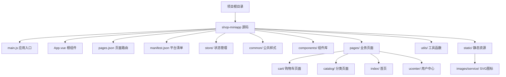
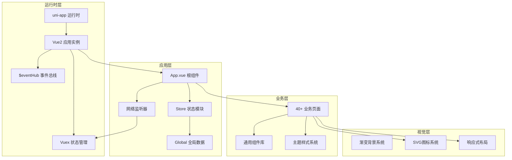
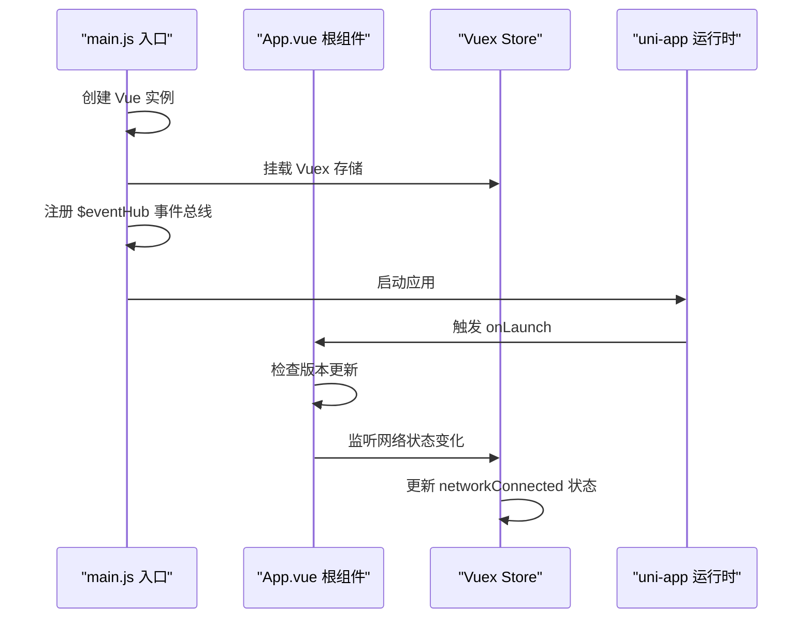
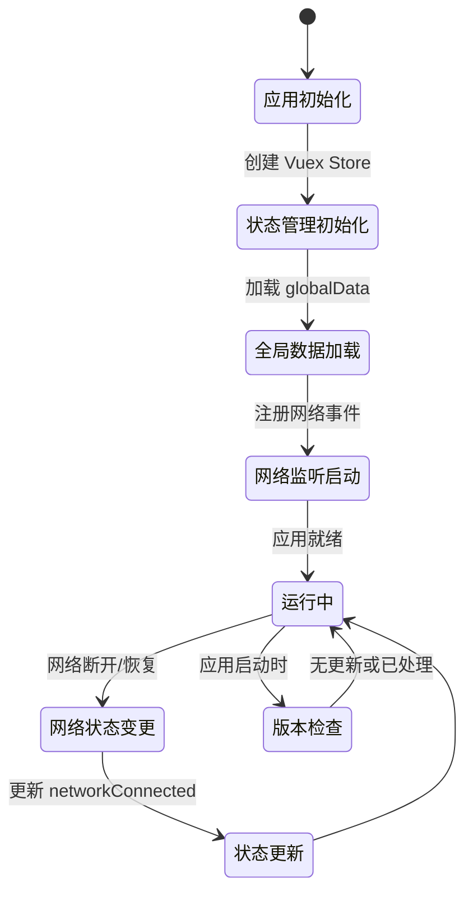
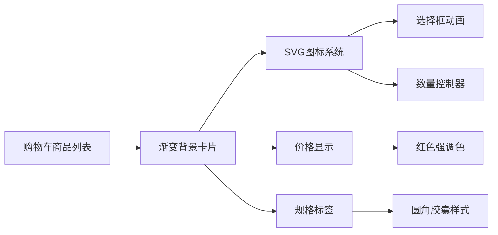
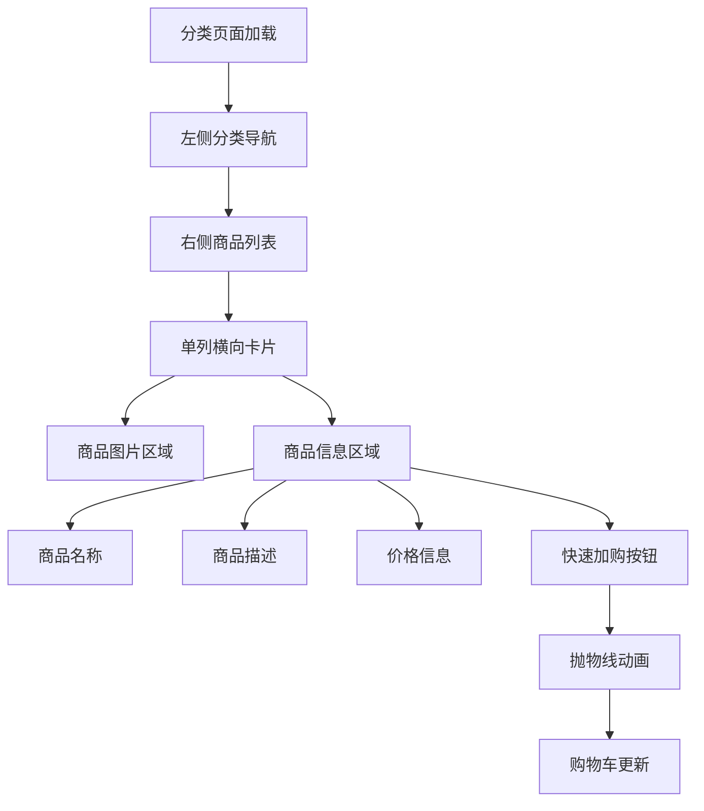
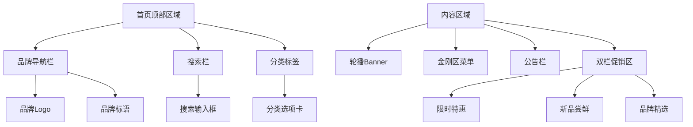
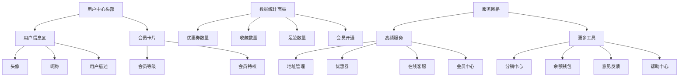
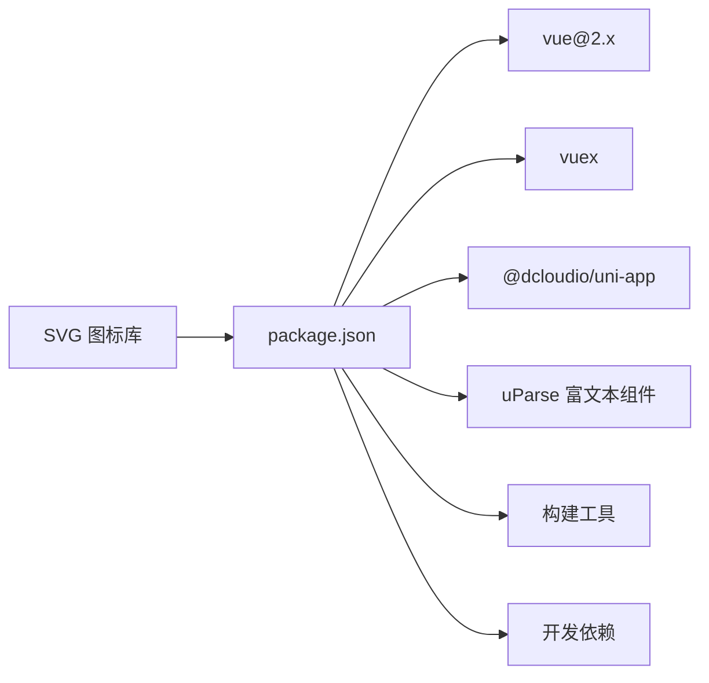

# 小程序整体架构

<cite>
**本文档引用的文件**
- [main.js](file://shop-miniapp/main.js)
- [App.vue](file://shop-miniapp/App.vue)
- [pages.json](file://shop-miniapp/pages.json)
- [manifest.json](file://shop-miniapp/manifest.json)
- [store/index.js](file://shop-miniapp/store/index.js)
- [common/app.css](file://shop-miniapp/common/app.css)
- [cart/cart.vue](file://shop-miniapp/pages/cart/cart.vue)
- [catalog/catalog.vue](file://shop-miniapp/pages/catalog/catalog.vue)
- [index/index.vue](file://shop-miniapp/pages/index/index.vue)
- [ucenter/index/index.vue](file://shop-miniapp/pages/ucenter/index/index.vue)
</cite>

## 更新摘要
**所做更改**
- 更新了技术栈说明，确认使用 Vue2 + Vuex 架构
- 新增了四大核心页面的重大视觉重构分析
- 详细说明了购物车页面的渐变背景增强和SVG图标系统
- 分析了分类页面从网格到单列横向卡片的布局重构
- 阐述了首页复杂渐变背景的视觉设计实现
- 描述了用户中心的完整重构和会员卡展示优化
- 补充了现代CSS渐变技术和响应式设计模式

## 目录
1. [简介](#简介)
2. [项目结构](#项目结构)
3. [核心组件](#核心组件)
4. [架构总览](#架构总览)
5. [详细组件分析](#详细组件分析)
6. [页面视觉重构分析](#页面视觉重构分析)
7. [依赖关系分析](#依赖关系分析)
8. [性能考虑](#性能考虑)
9. [故障排查指南](#故障排查指南)
10. [结论](#结论)
11. [附录](#附录)

## 简介
本项目为"药食同源"微信小程序，采用 uni-app + Vue2 + Vuex 的跨平台小程序开发架构。通过统一的前端框架与多端编译能力，实现一套代码适配微信小程序、H5 等平台；同时结合 Vuex 进行全局状态管理，配合完善的页面路由系统和全局样式管理。经过最新的视觉重构，项目采用了现代化的渐变背景设计、自定义SVG图标系统和响应式布局方案，为用户提供了更加精致和流畅的购物体验。本文档从架构设计、启动流程、路由与清单配置、跨平台兼容性、模块化组织、生命周期与状态初始化、插件系统集成等方面进行系统化梳理，并重点分析了近期重大页面重构的技术实现。

## 项目结构
项目采用"功能域+平台化"的目录组织方式，核心位于 shop-miniapp 目录下，包含应用入口、页面、状态管理、样式与构建配置等。整体结构遵循 uni-app 推荐规范，便于多端统一管理与扩展。

**图表来源**
- [main.js:1-29](file://shop-miniapp/main.js#L1-L29)
- [App.vue:1-72](file://shop-miniapp/App.vue#L1-L72)
- [pages.json:1-414](file://shop-miniapp/pages.json#L1-L414)
- [manifest.json:1-231](file://shop-miniapp/manifest.json#L1-L231)
- [store/index.js:1-21](file://shop-miniapp/store/index.js#L1-L21)

## 核心组件
- **应用入口与实例创建**：在 main.js 中创建 Vue 实例，集成 Vuex 状态管理，并设置全局事件总线。
- **根组件与应用生命周期**：定义应用启动、显示、隐藏等生命周期钩子，实现版本更新检测和错误监控。
- **全局状态管理**：基于 Vuex 实现应用级状态管理，包括网络连接状态、用户信息等全局数据。
- **页面路由系统**：集中声明 40+ 个页面路径与导航栏样式，支持自定义导航栏和下拉刷新。
- **平台清单配置**：针对微信小程序、H5、APP 等多端进行差异化配置。
- **现代化视觉系统**：实现了复杂的渐变背景、SVG图标系统和响应式布局。

**章节来源**
- [main.js:1-29](file://shop-miniapp/main.js#L1-L29)
- [App.vue:1-72](file://shop-miniapp/App.vue#L1-L72)
- [store/index.js:1-21](file://shop-miniapp/store/index.js#L1-L21)
- [pages.json:1-414](file://shop-miniapp/pages.json#L1-L414)
- [manifest.json:1-231](file://shop-miniapp/manifest.json#L1-231)

## 架构总览
整体架构围绕"Vue2 实例 + Vuex 状态管理 + uni-app 多端编译"的模式展开。Vue2 提供响应式数据绑定，Vuex 负责全局状态管理，uni-app 提供多端运行时与生命周期桥接，实现跨平台兼容。最新的视觉重构引入了现代化的CSS渐变技术、SVG图标系统和响应式设计模式。

**图表来源**
- [main.js:1-29](file://shop-miniapp/main.js#L1-L29)
- [App.vue:1-72](file://shop-miniapp/App.vue#L1-L72)
- [store/index.js:1-21](file://shop-miniapp/store/index.js#L1-L21)

## 详细组件分析

### 应用启动与生命周期
- **启动流程**：应用通过 main.js 创建 Vue 实例，挂载 Vuex 存储，注册全局事件总线，然后启动 uni-app 运行时。
- **版本更新管理**：在 App.vue 的 onLaunch 生命周期中实现小程序自动更新检测，支持新版本提示和应用重启。
- **网络状态监听**：应用启动时监听网络状态变化，实时更新全局网络状态到 Vuex store。
- **错误监控**：全局错误捕获机制，支持 APP 平台的错误信息收集。

**图表来源**
- [main.js:1-29](file://shop-miniapp/main.js#L1-L29)
- [App.vue:12-61](file://shop-miniapp/App.vue#L12-L61)
- [store/index.js:1-21](file://shop-miniapp/store/index.js#L1-L21)

**章节来源**
- [main.js:1-29](file://shop-miniapp/main.js#L1-L29)
- [App.vue:12-61](file://shop-miniapp/App.vue#L12-L61)
- [store/index.js:1-21](file://shop-miniapp/store/index.js#L1-L21)

### 页面路由系统
- **路由配置**：在 pages.json 中集中声明 40+ 个页面路径，涵盖首页、分类、购物车、个人中心等完整电商功能。
- **TabBar 导航**：配置底部导航栏，包含首页、分类、购物车、我的四个主要入口，使用草绿色主题色 (#5B8C5A)。
- **页面样式定制**：支持自定义导航栏、下拉刷新、触底加载等交互效果。
- **easycom 组件自动注册**：启用组件自动扫描，简化组件引用。

**图表来源**
- [pages.json:1-414](file://shop-miniapp/pages.json#L1-L414)

**章节来源**
- [pages.json:1-414](file://shop-miniapp/pages.json#L1-L414)

### 状态管理与全局初始化
- **Vuex 状态管理**：基于 Vuex 实现应用级状态管理，当前包含版本号和网络连接状态。
- **全局数据共享**：通过 App.vue 的 globalData 实现跨页面数据共享，如用户信息、登录令牌等。
- **事件总线机制**：通过 Vue.prototype.$eventHub 实现组件间通信，支持松耦合的事件驱动架构。
- **网络状态同步**：实时监听网络变化，自动更新全局网络状态，支持离线提示。

**图表来源**
- [store/index.js:1-21](file://shop-miniapp/store/index.js#L1-L21)
- [App.vue:4-11](file://shop-miniapp/App.vue#L4-L11)
- [main.js:10-17](file://shop-miniapp/main.js#L10-L17)

**章节来源**
- [store/index.js:1-21](file://shop-miniapp/store/index.js#L1-L21)
- [App.vue:4-11](file://shop-miniapp/App.vue#L4-L11)
- [main.js:10-17](file://shop-miniapp/main.js#L10-L17)

### 样式系统与主题设计
- **草绿色设计系统**：采用 #4D704D 作为主色调，搭配 #FDFDF8 背景色，营造自然健康的视觉风格。
- **全局样式管理**：通过 common/app.css 统一管理全局样式，支持条件编译适配不同平台。
- **组件样式隔离**：每个页面和组件拥有独立的样式文件，避免样式冲突。
- **响应式设计**：支持不同屏幕尺寸的自适应布局。
- **现代渐变技术**：广泛应用 CSS3 渐变背景，提升视觉层次感。

**章节来源**
- [pages.json:374-381](file://shop-miniapp/pages.json#L374-L381)
- [App.vue:65-71](file://shop-miniapp/App.vue#L65-L71)

### 清单与跨平台兼容性
- **多端配置**：在 manifest.json 中为微信小程序、H5、APP 等不同平台进行差异化配置。
- **权限管理**：配置各平台所需的系统权限，如相机、定位、网络访问等。
- **第三方服务**：集成地图、支付、分享、推送等第三方 SDK 配置。
- **条件编译**：使用 uni-app 的条件编译语法实现平台特定逻辑。

**章节来源**
- [manifest.json:1-231](file://shop-miniapp/manifest.json#L1-L231)

## 页面视觉重构分析

### 购物车页面增强设计
购物车页面经历了重大的视觉升级，主要体现在以下几个方面：

#### 渐变背景系统
- **多层渐变叠加**：采用 `linear-gradient(180deg, #FEFEFC 0%, #FBFBF7 100%)` 创建柔和的背景过渡效果
- **阴影层次优化**：使用 `box-shadow: 0 12rpx 24rpx rgba(77,112,77,0.06)` 增强卡片立体感
- **毛玻璃效果**：底部结算栏采用 `backdrop-filter: blur(18rpx)` 实现现代感的模糊背景

#### 自定义SVG图标系统
- **服务保障图标**：使用 ✓ 符号配合渐变色背景，传达信任感
- **选择框设计**：圆形选择框采用 `border-radius: 50%` 和渐变边框，选中状态有平滑过渡动画
- **数量步进器**：圆角矩形按钮组，带有微妙的渐变背景和阴影效果

#### 包邮进度条可视化
- **动态进度指示**：实时计算购买金额与包邮门槛的差距
- **渐变填充效果**：进度条使用 `linear-gradient(90deg, #B9CDBA 0%, #4D704D 100%)` 渐变填充
- **圆角设计**：进度条采用 `border-radius: 999rpx` 实现胶囊形状

**图表来源**
- [cart/cart.vue:312-430](file://shop-miniapp/pages/cart/cart.vue#L312-L430)
- [cart/cart.vue:432-562](file://shop-miniapp/pages/cart/cart.vue#L432-L562)

**章节来源**
- [cart/cart.vue:1-737](file://shop-miniapp/pages/cart/cart.vue#L1-L737)

### 分类页面布局重构
分类页面从传统的网格布局重构为现代化的单列横向卡片设计：

#### 单列横向卡片布局
- **卡片式设计**：每个商品以横向卡片形式展示，左侧图片右侧信息
- **图片固定尺寸**：商品图片采用 `width: 188rpx; height: 188rpx` 固定比例
- **弹性布局**：使用 `display: flex` 实现左右分栏的信息展示

#### 渐进式加载体验
- **无限滚动**：支持下拉加载更多商品，提升浏览体验
- **骨架屏优化**：加载过程中显示友好的提示信息
- **空状态处理**：当分类下无商品时显示清晰的空状态界面

#### 快速加购交互
- **抛物线动画**：点击加购按钮后，商品以抛物线轨迹飞向购物车
- **触觉反馈**：按钮点击时有缩放动画效果
- **成功提示**：加购成功后显示 Toast 提示

**图表来源**
- [catalog/catalog.vue:369-483](file://shop-miniapp/pages/catalog/catalog.vue#L369-L483)

**章节来源**
- [catalog/catalog.vue:1-501](file://shop-miniapp/pages/catalog/catalog.vue#L1-L501)

### 首页视觉精细化
首页进行了全面的视觉升级，采用了更加精致的渐变背景和布局设计：

#### 复杂渐变背景系统
- **多层渐变叠加**：顶部导航区使用 `repeating-linear-gradient` 创建纹理效果
- **径向渐变装饰**：使用 `radial-gradient` 添加光晕效果
- **动态光影**：通过伪元素 `::before` 和 `::after` 创建动态光影效果

#### 品牌化头部设计
- **品牌标识**：Logo 配合品牌名称和标语，建立品牌认知
- **搜索栏集成**：搜索框采用半透明背景，与整体设计风格统一
- **分类标签**：横向滚动的分类标签，支持滑动查看更多

#### 双栏促销区域
- **限时特惠**：左侧大卡片展示热门商品，突出价格优势
- **新品尝鲜**：右侧小卡片展示最新产品，引导用户探索
- **品牌精选**：第三个卡片展示合作品牌，增强信任感

**图表来源**
- [index/index.vue:568-733](file://shop-miniapp/pages/index/index.vue#L568-L733)

**章节来源**
- [index/index.vue:1-800](file://shop-miniapp/pages/index/index.vue#L1-L800)

### 用户中心完全重构
用户中心页面经历了彻底的重构，重新设计了信息架构和视觉呈现：

#### 现代化用户信息展示
- **渐变背景头部**：采用 `linear-gradient(145deg, #97AC96 0%, #879F8C 58%, #78907C 100%)` 创建丰富的色彩层次
- **头像展示优化**：圆形头像配合白色边框和阴影，提升视觉质感
- **会员卡片设计**：右侧金色渐变卡片，突出会员身份和价值

#### 数据统计面板
- **悬浮卡片布局**：统计数据卡片向上浮动，覆盖头部区域，创造层次感
- **数字强调显示**：重要数据使用大号字体和强调色
- **快捷入口**：每个统计项都可点击跳转对应页面

#### 服务网格系统
- **分组设计**：将服务分为"高频服务"和"更多工具"两个分组
- **图标渐变背景**：每个服务图标都有独特的渐变背景色
- **响应式网格**：4x2 的网格布局，适配不同屏幕尺寸

#### 品牌收尾区域
- **品牌信息展示**：底部展示品牌理念和口号
- **分隔线设计**：使用渐变分隔线，保持视觉连贯性
- **退出登录按钮**：独立的操作按钮，清晰的功能分区

**图表来源**
- [ucenter/index/index.vue:262-356](file://shop-miniapp/pages/ucenter/index/index.vue#L262-L356)
- [ucenter/index/index.vue:358-567](file://shop-miniapp/pages/ucenter/index/index.vue#L358-L567)

**章节来源**
- [ucenter/index/index.vue:1-617](file://shop-miniapp/pages/ucenter/index/index.vue#L1-L617)

## 依赖关系分析
- **运行时依赖**：vue@2.x 提供响应式数据绑定和组件化开发；vuex 提供全局状态管理。
- **uni-app 生态**：@dcloudio/uni-app 提供跨平台编译能力和原生 API 封装。
- **开发工具链**：webpack 或 vite 作为构建工具，支持热重载和生产优化。
- **第三方组件**：uParse 富文本解析组件，支持 HTML 内容渲染。
- **SVG 图标系统**：自定义 SVG 图标库，提供高质量的矢量图形资源。

**图表来源**
- [manifest.json:8](file://shop-miniapp/manifest.json#L8)
- [main.js:1-3](file://shop-miniapp/main.js#L1-L3)
- [store/index.js:1-2](file://shop-miniapp/store/index.js#L1-L2)

**章节来源**
- [manifest.json:8](file://shop-miniapp/manifest.json#L8)
- [main.js:1-3](file://shop-miniapp/main.js#L1-L3)
- [store/index.js:1-2](file://shop-miniapp/store/index.js#L1-L2)

## 性能考虑
- **懒加载优化**：利用 uni-app 的按需加载特性，减少首屏包体积。
- **图片资源优化**：建议使用 WebP 格式和适当的图片尺寸，启用 CDN 加速。
- **状态管理优化**：合理使用 Vuex 模块化和计算属性，避免不必要的重渲染。
- **网络请求优化**：实现请求缓存、去重和错误重试机制。
- **组件复用**：通过 easycom 自动注册和组件拆分，提升代码复用率。
- **CSS 性能优化**：合理使用 CSS3 渐变和动画，避免过度使用复杂的视觉效果。
- **SVG 图标优化**：使用内联 SVG 替代图片资源，减少 HTTP 请求。

## 故障排查指南
- **网络异常处理**：通过 Vuex 中的 networkConnected 状态判断网络连接，提供友好的离线提示。
- **版本更新问题**：检查 onCheckForUpdate 回调逻辑，确保新版本检测正常执行。
- **状态同步问题**：通过 Vue DevTools 调试 Vuex 状态变化，确认 mutations 正确触发。
- **跨页面通信**：使用 $eventHub 事件总线进行组件间通信，注意事件命名空间管理。
- **平台兼容性问题**：使用条件编译语法区分不同平台的特定逻辑。
- **渐变背景兼容性**：检查浏览器对 CSS3 渐变的支持情况，必要时提供降级方案。
- **SVG 图标显示问题**：确认 SVG 文件路径正确，检查浏览器对 SVG 的支持程度。

**章节来源**
- [store/index.js:14-16](file://shop-miniapp/store/index.js#L14-L16)
- [App.vue:12-46](file://shop-miniapp/App.vue#L12-L46)
- [main.js:20](file://shop-miniapp/main.js#L20)

## 结论
本项目以 uni-app + Vue2 为核心，结合 Vuex 状态管理和完善的页面路由系统，实现了功能完整的药食同源电商平台小程序。经过最新的视觉重构，项目采用了现代化的渐变背景设计、自定义SVG图标系统和响应式布局方案，显著提升了用户体验和视觉品质。四大核心页面（购物车、分类、首页、用户中心）的重构不仅改善了视觉效果，还优化了交互流程和性能表现。建议在后续迭代中继续完善API接口层、引入更丰富的状态管理模块，并持续优化用户体验和性能表现。

## 附录
- **快速开始**
  - 安装依赖：使用 npm 或 yarn 安装项目依赖
  - 本地开发：使用微信开发者工具打开项目目录
  - 多端预览：支持微信小程序、H5、APP 等多端预览
- **目录约定**
  - pages：存放所有业务页面组件
  - components：通用组件库
  - store：Vuex 状态管理模块
  - common：公共样式和工具函数
  - static：静态资源文件
  - images/service：SVG图标资源
- **技术选型说明**
  - uni-app：统一多端开发体验与生态
  - Vue2：成熟的组件化开发框架
  - Vuex：官方推荐的状态管理方案
  - 草绿色主题：符合药食同源品牌调性
  - CSS3渐变：现代Web标准，提升视觉层次
  - SVG图标：矢量图形，高清显示且体积小