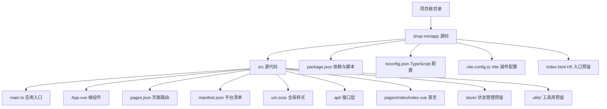
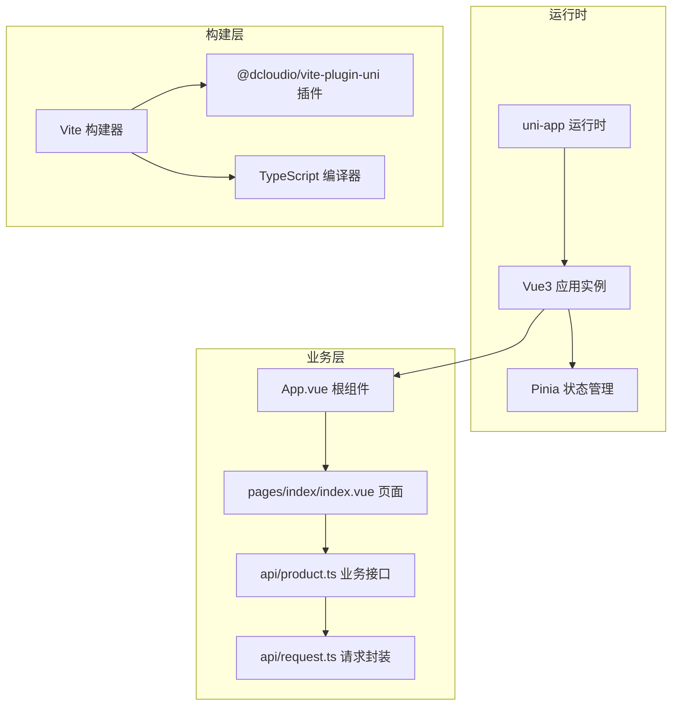
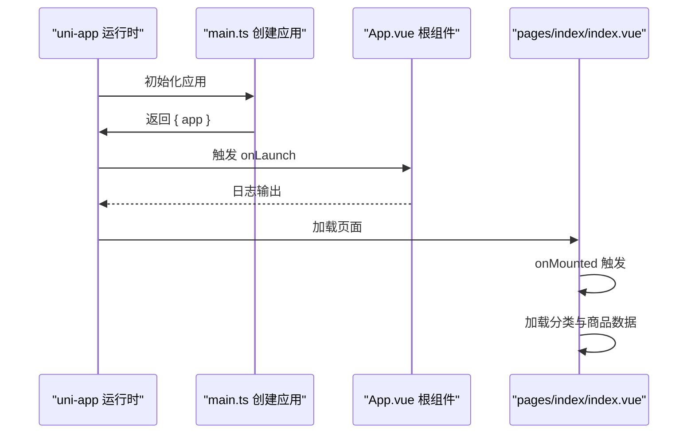
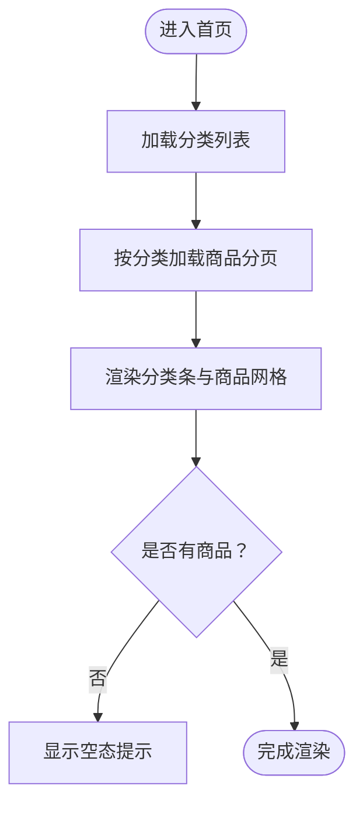
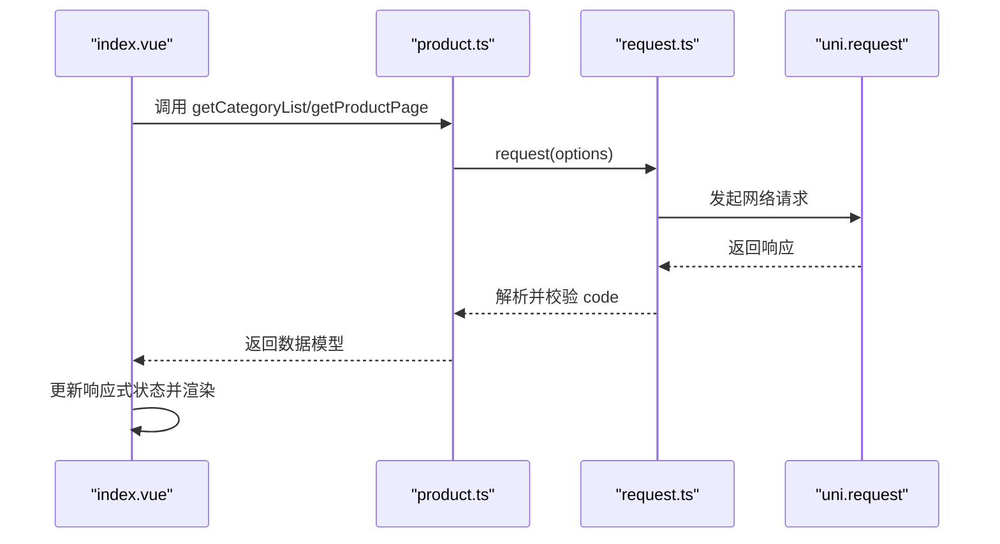
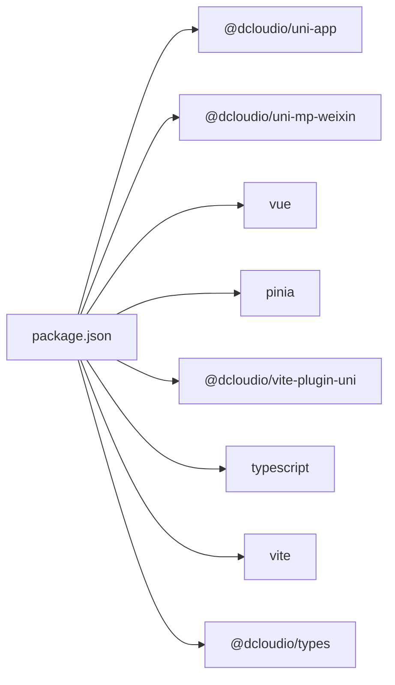

# 小程序整体架构

<cite>
**本文档引用的文件**
- [main.ts](file://shop-miniapp/src/main.ts)
- [App.vue](file://shop-miniapp/src/App.vue)
- [pages.json](file://shop-miniapp/src/pages.json)
- [manifest.json](file://shop-miniapp/src/manifest.json)
- [package.json](file://shop-miniapp/package.json)
- [tsconfig.json](file://shop-miniapp/tsconfig.json)
- [vite.config.ts](file://shop-miniapp/vite.config.ts)
- [request.ts](file://shop-miniapp/src/api/request.ts)
- [product.ts](file://shop-miniapp/src/api/product.ts)
- [index.vue](file://shop-miniapp/src/pages/index/index.vue)
</cite>

## 目录
1. [简介](#简介)
2. [项目结构](#项目结构)
3. [核心组件](#核心组件)
4. [架构总览](#架构总览)
5. [详细组件分析](#详细组件分析)
6. [依赖关系分析](#依赖关系分析)
7. [性能考虑](#性能考虑)
8. [故障排查指南](#故障排查指南)
9. [结论](#结论)
10. [附录](#附录)

## 简介
本项目为“药食同源”微信小程序，采用 uni-app 3.0 + Vue3 + TypeScript 的跨平台小程序开发架构。通过统一的前端框架与多端编译能力，实现一套代码适配微信小程序、H5 等平台；同时结合 Pinia 进行全局状态管理，使用 Vite 构建工具链，配合 TypeScript 提升开发效率与可维护性。本文档从架构设计、启动流程、路由与清单配置、跨平台兼容性、模块化组织、生命周期与状态初始化、插件系统集成等方面进行系统化梳理，并给出性能优化建议与排障指引。

## 项目结构
项目采用“功能域+平台化”的目录组织方式，核心位于 shop-miniapp 目录下，包含应用入口、页面、API 层、样式与构建配置等。整体结构遵循 uni-app 推荐规范，便于多端统一管理与扩展。

图表来源
- [main.ts:1-11](file://shop-miniapp/src/main.ts#L1-L11)
- [pages.json:1-17](file://shop-miniapp/src/pages.json#L1-L17)
- [manifest.json:1-15](file://shop-miniapp/src/manifest.json#L1-L15)
- [package.json:1-27](file://shop-miniapp/package.json#L1-L27)
- [tsconfig.json:1-20](file://shop-miniapp/tsconfig.json#L1-L20)
- [vite.config.ts:1-7](file://shop-miniapp/vite.config.ts#L1-L7)

章节来源
- [package.json:1-27](file://shop-miniapp/package.json#L1-L27)
- [tsconfig.json:1-20](file://shop-miniapp/tsconfig.json#L1-L20)
- [vite.config.ts:1-7](file://shop-miniapp/vite.config.ts#L1-L7)

## 核心组件
- 应用入口与根实例：在应用入口中创建 Vue 实例与 Pinia，并导出工厂函数以供多端运行时调用。
- 根组件：定义应用生命周期钩子与全局样式，作为页面树的根节点。
- 页面路由：集中声明页面路径与导航栏样式，支持全局样式统一配置。
- 平台清单：针对微信小程序进行 appid、安全校验与组件化开关等配置。
- 构建与类型：通过 Vite 插件与 TypeScript 编译器选项，确保开发体验与产物质量。

章节来源
- [main.ts:1-11](file://shop-miniapp/src/main.ts#L1-L11)
- [App.vue:1-15](file://shop-miniapp/src/App.vue#L1-L15)
- [pages.json:1-17](file://shop-miniapp/src/pages.json#L1-L17)
- [manifest.json:1-15](file://shop-miniapp/src/manifest.json#L1-L15)
- [vite.config.ts:1-7](file://shop-miniapp/vite.config.ts#L1-L7)
- [tsconfig.json:1-20](file://shop-miniapp/tsconfig.json#L1-L20)

## 架构总览
整体架构围绕“统一入口 + 多端编译 + 统一逻辑 + 分层接口”的模式展开。Vue3 提供响应式与组合式 API，Pinia 负责状态管理，uni-app 提供多端运行时与生命周期桥接，Vite 负责开发与构建，TypeScript 提供类型安全保障。

图表来源
- [main.ts:1-11](file://shop-miniapp/src/main.ts#L1-L11)
- [App.vue:1-15](file://shop-miniapp/src/App.vue#L1-L15)
- [index.vue:1-122](file://shop-miniapp/src/pages/index/index.vue#L1-L122)
- [product.ts:1-42](file://shop-miniapp/src/api/product.ts#L1-L42)
- [request.ts:1-48](file://shop-miniapp/src/api/request.ts#L1-L48)
- [vite.config.ts:1-7](file://shop-miniapp/vite.config.ts#L1-L7)

## 详细组件分析

### 应用启动与生命周期
- 启动流程：应用通过工厂函数创建 Vue 实例，挂载 Pinia；随后由 uni-app 运行时触发生命周期钩子。
- 生命周期钩子：根组件中注册应用启动事件，用于初始化日志或全局行为。
- 页面生命周期：页面组件通过组合式 API 在挂载阶段发起数据加载。

图表来源
- [main.ts:1-11](file://shop-miniapp/src/main.ts#L1-L11)
- [App.vue:1-15](file://shop-miniapp/src/App.vue#L1-L15)
- [index.vue:33-63](file://shop-miniapp/src/pages/index/index.vue#L33-L63)

章节来源
- [main.ts:1-11](file://shop-miniapp/src/main.ts#L1-L11)
- [App.vue:1-15](file://shop-miniapp/src/App.vue#L1-L15)
- [index.vue:33-63](file://shop-miniapp/src/pages/index/index.vue#L33-L63)

### 页面路由系统
- 页面声明：在 pages.json 中集中声明页面路径与导航样式，支持全局样式统一配置。
- 导航栏配置：统一设置标题文本、文字颜色与背景色，保证视觉一致性。
- 页面结构：首页采用横向滚动分类与网格商品列表布局，结合空态提示。

图表来源
- [pages.json:1-17](file://shop-miniapp/src/pages.json#L1-L17)
- [index.vue:1-122](file://shop-miniapp/src/pages/index/index.vue#L1-L122)

章节来源
- [pages.json:1-17](file://shop-miniapp/src/pages.json#L1-L17)
- [index.vue:1-122](file://shop-miniapp/src/pages/index/index.vue#L1-L122)

### API 与数据流
- 请求封装：统一的请求方法负责拼接基础地址、注入令牌、处理成功与失败分支，并对错误码进行统一处理。
- 业务接口：提供分类列表、商品分页与详情等接口，返回类型安全的数据模型。
- 数据绑定：页面通过响应式 ref 管理状态，在挂载时发起异步请求并更新视图。

图表来源
- [index.vue:33-63](file://shop-miniapp/src/pages/index/index.vue#L33-L63)
- [product.ts:1-42](file://shop-miniapp/src/api/product.ts#L1-L42)
- [request.ts:1-48](file://shop-miniapp/src/api/request.ts#L1-L48)

章节来源
- [request.ts:1-48](file://shop-miniapp/src/api/request.ts#L1-L48)
- [product.ts:1-42](file://shop-miniapp/src/api/product.ts#L1-L42)
- [index.vue:33-63](file://shop-miniapp/src/pages/index/index.vue#L33-L63)

### 状态管理与全局初始化
- 状态初始化：在应用入口创建并安装 Pinia，为后续页面与模块提供统一的状态容器。
- 使用建议：当前示例页面直接通过 API 获取数据，可在后续迭代中引入 Pinia Store 管理用户、购物车等跨页面共享状态。

章节来源
- [main.ts:1-11](file://shop-miniapp/src/main.ts#L1-L11)

### 构建与开发工具链
- Vite 插件：通过 uni 插件接入 uni-app 的多端编译能力，支持热更新与生产构建。
- TypeScript：启用严格模式、路径别名与类型声明，提升开发体验与可维护性。
- 脚本命令：提供微信小程序开发与构建脚本，便于本地调试与 CI 集成。

章节来源
- [vite.config.ts:1-7](file://shop-miniapp/vite.config.ts#L1-L7)
- [tsconfig.json:1-20](file://shop-miniapp/tsconfig.json#L1-L20)
- [package.json:1-27](file://shop-miniapp/package.json#L1-L27)

### 清单与跨平台兼容性
- 平台清单：在 manifest.json 中为微信小程序配置 appid、安全校验与组件化开关，满足平台要求。
- 跨平台特性：通过 uni-app 的条件编译与运行时桥接，实现一套代码适配多端差异。

章节来源
- [manifest.json:1-15](file://shop-miniapp/src/manifest.json#L1-L15)

## 依赖关系分析
- 运行时依赖：@dcloudio/uni-app、@dcloudio/uni-mp-weixin 等提供多端运行时与微信小程序适配。
- 前端框架：vue 3.x 提供响应式与组合式 API；pinia 提供轻量级状态管理。
- 开发工具：typescript、vite、@dcloudio/vite-plugin-uni 构成现代化开发与构建体系。
- 类型支持：@dcloudio/types 提供 uni-app 生态的类型声明。

图表来源
- [package.json:1-27](file://shop-miniapp/package.json#L1-L27)

章节来源
- [package.json:1-27](file://shop-miniapp/package.json#L1-L27)

## 性能考虑
- 网络请求优化：在请求封装中统一处理鉴权头与错误提示，避免重复逻辑；建议后续引入请求缓存与去重策略，减少不必要的网络开销。
- 视图渲染优化：首页采用虚拟列表与懒加载策略，降低首屏渲染压力；图片资源建议使用合适的尺寸与格式，减少带宽占用。
- 构建优化：利用 Vite 的按需打包与 Tree Shaking，剔除未使用模块；合理拆分页面与组件，提升增量构建效率。
- 状态管理：对于高频更新的状态，建议采用细粒度 Store 模块与计算属性，避免全量重渲染。

## 故障排查指南
- 登录态失效：当后端返回特定错误码时，自动清除本地 token 并提示用户登录，随后中断请求流程。
- 网络异常：捕获请求失败回调，统一弹窗提示“网络异常”，便于用户感知与反馈。
- 开发调试：通过 Vite 插件提供的热更新能力快速定位问题；结合 TypeScript 的类型检查尽早发现潜在错误。

章节来源
- [request.ts:1-48](file://shop-miniapp/src/api/request.ts#L1-L48)

## 结论
本项目以 uni-app 3.0 为核心，结合 Vue3 + TypeScript + Vite 的现代前端技术栈，实现了跨平台小程序的高内聚低耦合架构。通过统一的应用入口、清晰的页面路由与 API 分层、完善的构建与类型配置，既满足了当前业务需求，也为后续的功能扩展与性能优化奠定了坚实基础。建议在后续迭代中完善状态管理模块、引入缓存与监控机制，并持续优化网络与渲染性能。

## 附录
- 快速开始
  - 安装依赖：使用包管理器安装项目依赖。
  - 本地开发：执行开发脚本启动微信小程序预览。
  - 生产构建：执行构建脚本生成多端产物。
- 目录约定
  - src：存放所有源代码与资源。
  - api：封装网络请求与业务接口。
  - pages：页面组件与路由配置。
  - store/utils：状态管理与工具库预留位置。
- 技术选型说明
  - uni-app：统一多端开发体验与生态。
  - Vue3 + TypeScript：提供更好的类型安全与开发体验。
  - Vite：更快的冷启与热更新。
  - Pinia：更直观的状态管理方案。