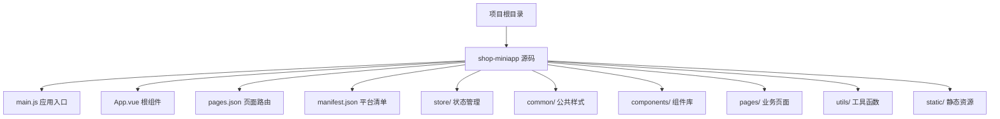
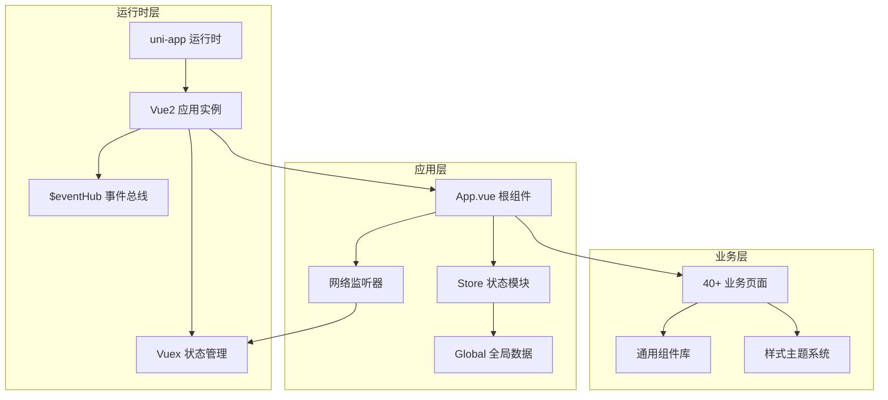
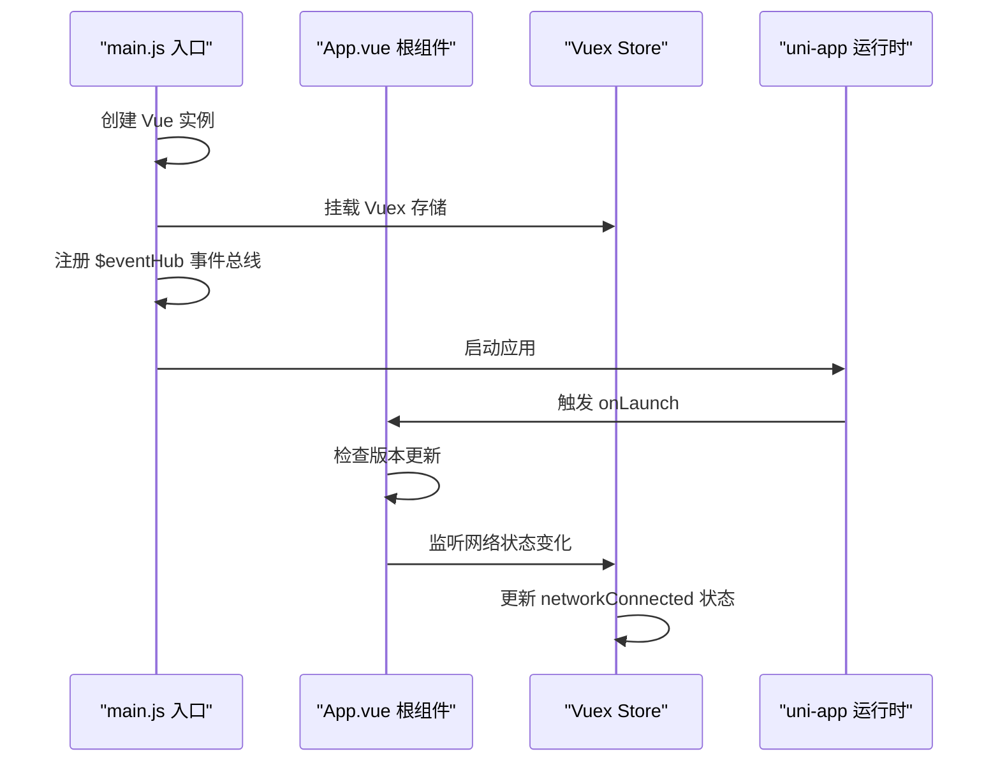
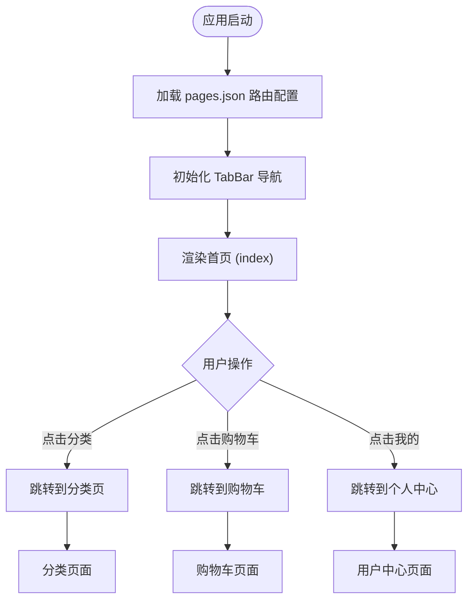
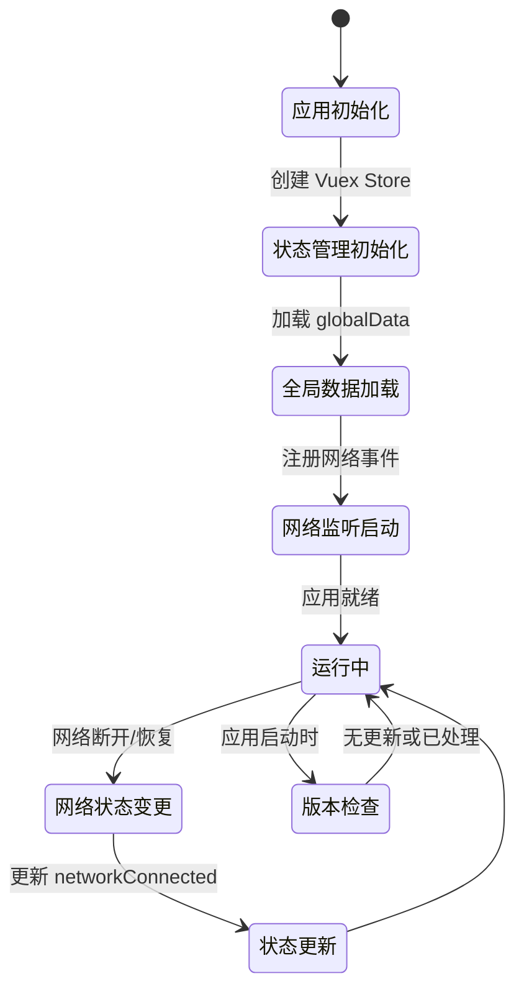
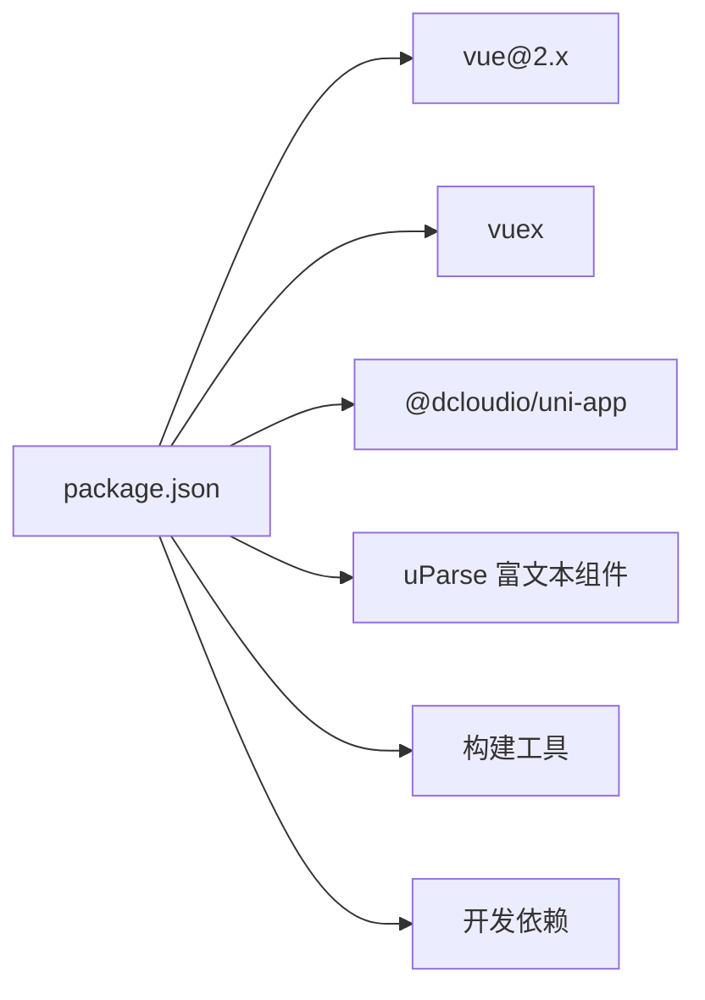

# 小程序整体架构

<cite>
**本文档引用的文件**
- [main.js](file://shop-miniapp/main.js)
- [App.vue](file://shop-miniapp/App.vue)
- [pages.json](file://shop-miniapp/pages.json)
- [manifest.json](file://shop-miniapp/manifest.json)
- [store/index.js](file://shop-miniapp/store/index.js)
- [common/app.css](file://shop-miniapp/common/app.css)
</cite>

## 更新摘要
**所做更改**
- 将技术栈从 Vue3 + TypeScript 更新为 Vue2 + Vuex
- 补充完整的页面路由系统（40+ 页面）和 TabBar 配置
- 添加全局状态管理和网络监听机制
- 完善应用启动流程和版本更新管理
- 更新设计系统和样式架构说明

## 目录
1. [简介](#简介)
2. [项目结构](#项目结构)
3. [核心组件](#核心组件)
4. [架构总览](#架构总览)
5. [详细组件分析](#详细组件分析)
6. [依赖关系分析](#依赖关系分析)
7. [性能考虑](#性能考虑)
8. [故障排查指南](#故障排查指南)
9. [结论](#结论)
10. [附录](#附录)

## 简介
本项目为"药食同源"微信小程序，采用 uni-app + Vue2 + Vuex 的跨平台小程序开发架构。通过统一的前端框架与多端编译能力，实现一套代码适配微信小程序、H5 等平台；同时结合 Vuex 进行全局状态管理，配合完善的页面路由系统和全局样式管理。本文档从架构设计、启动流程、路由与清单配置、跨平台兼容性、模块化组织、生命周期与状态初始化、插件系统集成等方面进行系统化梳理，并给出性能优化建议与排障指引。

## 项目结构
项目采用"功能域+平台化"的目录组织方式，核心位于 shop-miniapp 目录下，包含应用入口、页面、状态管理、样式与构建配置等。整体结构遵循 uni-app 推荐规范，便于多端统一管理与扩展。

**图表来源**
- [main.js:1-29](file://shop-miniapp/main.js#L1-L29)
- [App.vue:1-72](file://shop-miniapp/App.vue#L1-L72)
- [pages.json:1-414](file://shop-miniapp/pages.json#L1-L414)
- [manifest.json:1-231](file://shop-miniapp/manifest.json#L1-L231)
- [store/index.js:1-21](file://shop-miniapp/store/index.js#L1-L21)

## 核心组件
- **应用入口与实例创建**：在 main.js 中创建 Vue 实例，集成 Vuex 状态管理，并设置全局事件总线。
- **根组件与应用生命周期**：定义应用启动、显示、隐藏等生命周期钩子，实现版本更新检测和错误监控。
- **全局状态管理**：基于 Vuex 实现应用级状态管理，包括网络连接状态、用户信息等全局数据。
- **页面路由系统**：集中声明 40+ 个页面路径与导航栏样式，支持自定义导航栏和下拉刷新。
- **平台清单配置**：针对微信小程序、H5、APP 等多端进行差异化配置。

**章节来源**
- [main.js:1-29](file://shop-miniapp/main.js#L1-L29)
- [App.vue:1-72](file://shop-miniapp/App.vue#L1-L72)
- [store/index.js:1-21](file://shop-miniapp/store/index.js#L1-L21)
- [pages.json:1-414](file://shop-miniapp/pages.json#L1-L414)
- [manifest.json:1-231](file://shop-miniapp/manifest.json#L1-231)

## 架构总览
整体架构围绕"Vue2 实例 + Vuex 状态管理 + uni-app 多端编译"的模式展开。Vue2 提供响应式数据绑定，Vuex 负责全局状态管理，uni-app 提供多端运行时与生命周期桥接，实现跨平台兼容。

**图表来源**
- [main.js:1-29](file://shop-miniapp/main.js#L1-L29)
- [App.vue:1-72](file://shop-miniapp/App.vue#L1-L72)
- [store/index.js:1-21](file://shop-miniapp/store/index.js#L1-L21)

## 详细组件分析

### 应用启动与生命周期
- **启动流程**：应用通过 main.js 创建 Vue 实例，挂载 Vuex 存储，注册全局事件总线，然后启动 uni-app 运行时。
- **版本更新管理**：在 App.vue 的 onLaunch 生命周期中实现小程序自动更新检测，支持新版本提示和应用重启。
- **网络状态监听**：应用启动时监听网络状态变化，实时更新全局网络状态到 Vuex store。
- **错误监控**：全局错误捕获机制，支持 APP 平台的错误信息收集。

**图表来源**
- [main.js:1-29](file://shop-miniapp/main.js#L1-L29)
- [App.vue:12-61](file://shop-miniapp/App.vue#L12-L61)
- [store/index.js:1-21](file://shop-miniapp/store/index.js#L1-L21)

**章节来源**
- [main.js:1-29](file://shop-miniapp/main.js#L1-L29)
- [App.vue:12-61](file://shop-miniapp/App.vue#L12-L61)
- [store/index.js:1-21](file://shop-miniapp/store/index.js#L1-L21)

### 页面路由系统
- **路由配置**：在 pages.json 中集中声明 40+ 个页面路径，涵盖首页、分类、购物车、个人中心、商品详情等完整电商功能。
- **TabBar 导航**：配置底部导航栏，包含首页、分类、购物车、我的四个主要入口，使用草绿色主题色 (#5B8C5A)。
- **页面样式定制**：支持自定义导航栏、下拉刷新、触底加载等交互效果。
- **easycom 组件自动注册**：启用组件自动扫描，简化组件引用。

**图表来源**
- [pages.json:1-414](file://shop-miniapp/pages.json#L1-L414)

**章节来源**
- [pages.json:1-414](file://shop-miniapp/pages.json#L1-L414)

### 状态管理与全局初始化
- **Vuex 状态管理**：基于 Vuex 实现应用级状态管理，当前包含版本号和网络连接状态。
- **全局数据共享**：通过 App.vue 的 globalData 实现跨页面数据共享，如用户信息、登录令牌等。
- **事件总线机制**：通过 Vue.prototype.$eventHub 实现组件间通信，支持松耦合的事件驱动架构。
- **网络状态同步**：实时监听网络变化，自动更新全局网络状态，支持离线提示。

**图表来源**
- [store/index.js:1-21](file://shop-miniapp/store/index.js#L1-L21)
- [App.vue:4-11](file://shop-miniapp/App.vue#L4-L11)
- [main.js:10-17](file://shop-miniapp/main.js#L10-L17)

**章节来源**
- [store/index.js:1-21](file://shop-miniapp/store/index.js#L1-L21)
- [App.vue:4-11](file://shop-miniapp/App.vue#L4-L11)
- [main.js:10-17](file://shop-miniapp/main.js#L10-L17)

### 样式系统与主题设计
- **草绿色设计系统**：采用 #5B8C5A 作为主色调，搭配 #F6F7F4 背景色，营造自然健康的视觉风格。
- **全局样式管理**：通过 common/app.css 统一管理全局样式，支持条件编译适配不同平台。
- **组件样式隔离**：每个页面和组件拥有独立的样式文件，避免样式冲突。
- **响应式设计**：支持不同屏幕尺寸的自适应布局。

**章节来源**
- [pages.json:374-381](file://shop-miniapp/pages.json#L374-L381)
- [App.vue:65-71](file://shop-miniapp/App.vue#L65-L71)

### 清单与跨平台兼容性
- **多端配置**：在 manifest.json 中为微信小程序、H5、APP 等不同平台进行差异化配置。
- **权限管理**：配置各平台所需的系统权限，如相机、定位、网络访问等。
- **第三方服务**：集成地图、支付、分享、推送等第三方 SDK 配置。
- **条件编译**：使用 uni-app 的条件编译语法实现平台特定逻辑。

**章节来源**
- [manifest.json:1-231](file://shop-miniapp/manifest.json#L1-L231)

## 依赖关系分析
- **运行时依赖**：vue@2.x 提供响应式数据绑定和组件化开发；vuex 提供全局状态管理。
- **uni-app 生态**：@dcloudio/uni-app 提供跨平台编译能力和原生 API 封装。
- **开发工具链**：webpack 或 vite 作为构建工具，支持热重载和生产优化。
- **第三方组件**：uParse 富文本解析组件，支持 HTML 内容渲染。

**图表来源**
- [manifest.json:8](file://shop-miniapp/manifest.json#L8)
- [main.js:1-3](file://shop-miniapp/main.js#L1-L3)
- [store/index.js:1-2](file://shop-miniapp/store/index.js#L1-L2)

**章节来源**
- [manifest.json:8](file://shop-miniapp/manifest.json#L8)
- [main.js:1-3](file://shop-miniapp/main.js#L1-L3)
- [store/index.js:1-2](file://shop-miniapp/store/index.js#L1-L2)

## 性能考虑
- **懒加载优化**：利用 uni-app 的按需加载特性，减少首屏包体积。
- **图片资源优化**：建议使用 WebP 格式和适当的图片尺寸，启用 CDN 加速。
- **状态管理优化**：合理使用 Vuex 模块化和计算属性，避免不必要的重渲染。
- **网络请求优化**：实现请求缓存、去重和错误重试机制。
- **组件复用**：通过 easycom 自动注册和组件拆分，提升代码复用率。

## 故障排查指南
- **网络异常处理**：通过 Vuex 中的 networkConnected 状态判断网络连接，提供友好的离线提示。
- **版本更新问题**：检查 onCheckForUpdate 回调逻辑，确保新版本检测正常执行。
- **状态同步问题**：通过 Vue DevTools 调试 Vuex 状态变化，确认 mutations 正确触发。
- **跨页面通信**：使用 $eventHub 事件总线进行组件间通信，注意事件命名空间管理。
- **平台兼容性问题**：使用条件编译语法区分不同平台的特定逻辑。

**章节来源**
- [store/index.js:14-16](file://shop-miniapp/store/index.js#L14-L16)
- [App.vue:12-46](file://shop-miniapp/App.vue#L12-L46)
- [main.js:20](file://shop-miniapp/main.js#L20)

## 结论
本项目以 uni-app + Vue2 为核心，结合 Vuex 状态管理和完善的页面路由系统，实现了功能完整的药食同源电商平台小程序。通过统一的架构设计和草绿色主题系统，既满足了业务需求，也为后续的功能扩展奠定了坚实基础。建议在后续迭代中完善 API 接口层、引入更丰富的状态管理模块，并持续优化用户体验和性能表现。

## 附录
- **快速开始**
  - 安装依赖：使用 npm 或 yarn 安装项目依赖
  - 本地开发：使用微信开发者工具打开项目目录
  - 多端预览：支持微信小程序、H5、APP 等多端预览
- **目录约定**
  - pages：存放所有业务页面组件
  - components：通用组件库
  - store：Vuex 状态管理模块
  - common：公共样式和工具函数
  - static：静态资源文件
- **技术选型说明**
  - uni-app：统一多端开发体验与生态
  - Vue2：成熟的组件化开发框架
  - Vuex：官方推荐的状态管理方案
  - 草绿色主题：符合药食同源品牌调性