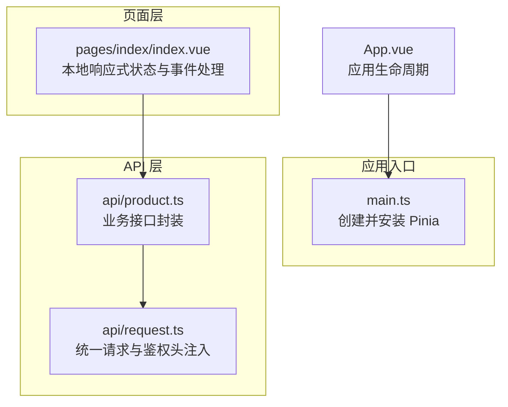
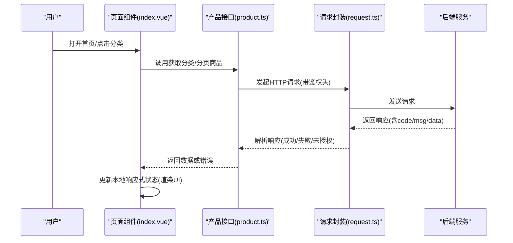
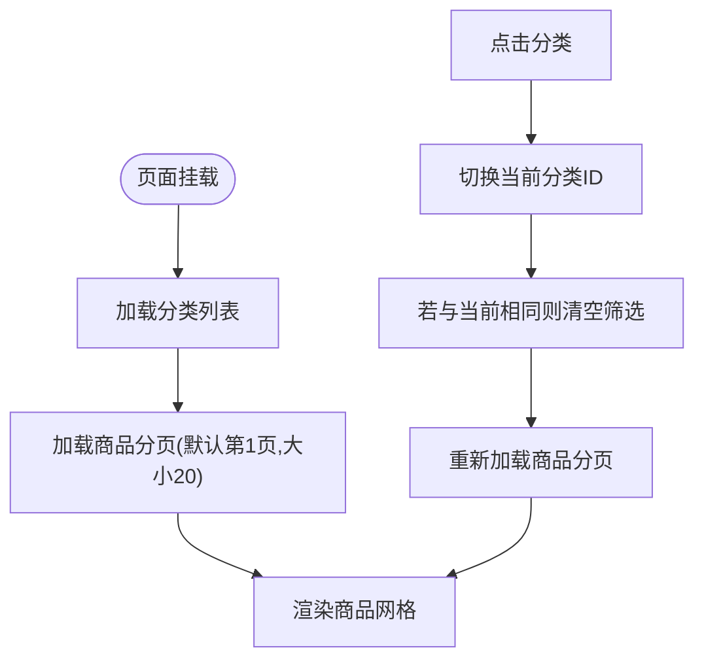
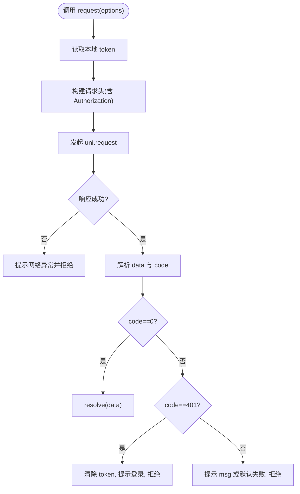
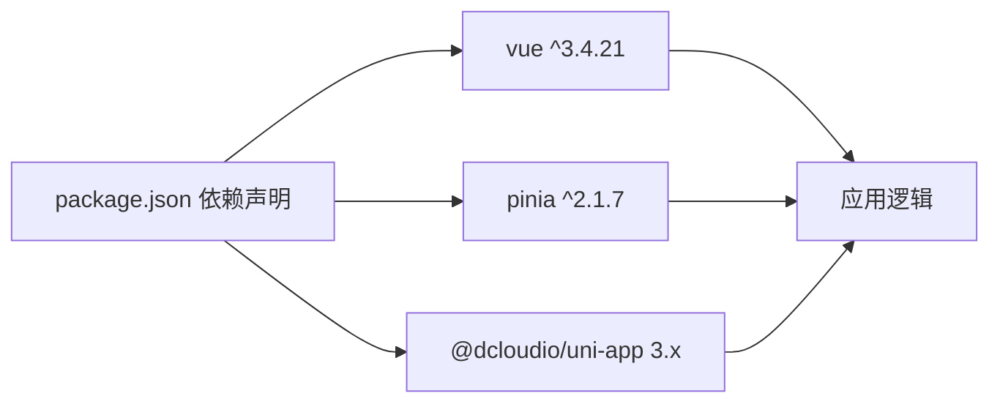

# 状态管理

<cite>
**本文引用的文件**
- [main.ts](file://shop-miniapp/src/main.ts)
- [package.json](file://shop-miniapp/package.json)
- [index.vue](file://shop-miniapp/src/pages/index/index.vue)
- [product.ts](file://shop-miniapp/src/api/product.ts)
- [request.ts](file://shop-miniapp/src/api/request.ts)
- [App.vue](file://shop-miniapp/src/App.vue)
</cite>

## 目录
1. [简介](#简介)
2. [项目结构](#项目结构)
3. [核心组件](#核心组件)
4. [架构总览](#架构总览)
5. [详细组件分析](#详细组件分析)
6. [依赖分析](#依赖分析)
7. [性能考虑](#性能考虑)
8. [故障排查指南](#故障排查指南)
9. [结论](#结论)
10. [附录](#附录)

## 简介
本文件面向“药食同源”微信小程序的前端状态管理，围绕基于 Pinia 的状态架构进行系统性说明。当前仓库中已集成 Pinia 并在应用入口完成安装；页面层通过本地响应式数据与 API 层交互实现数据流控制。本文将从架构设计、模块化组织、数据持久化策略、状态变更与异步处理、订阅模式、最佳实践、性能优化与调试工具等方面，提供可操作的指南与图示。

## 项目结构
- 应用入口：在应用启动时安装并挂载 Pinia，作为全局状态容器。
- 页面组件：使用组合式 API（script setup）定义本地响应式状态，发起 API 请求并更新视图。
- API 层：封装统一请求与响应处理，负责与后端交互。
- 数据模型：在 API 文件中定义分类与商品等数据接口类型。

**图表来源**
- [main.ts:1-11](file://shop-miniapp/src/main.ts#L1-L11)
- [index.vue:1-122](file://shop-miniapp/src/pages/index/index/index.vue#L1-L122)
- [product.ts:1-42](file://shop-miniapp/src/api/product.ts#L1-L42)
- [request.ts:1-48](file://shop-miniapp/src/api/request.ts#L1-L48)
- [App.vue:1-15](file://shop-miniapp/src/App.vue#L1-L15)

**章节来源**
- [main.ts:1-11](file://shop-miniapp/src/main.ts#L1-L11)
- [package.json:1-27](file://shop-miniapp/package.json#L1-L27)
- [index.vue:1-122](file://shop-miniapp/src/pages/index/index.vue#L1-L122)
- [product.ts:1-42](file://shop-miniapp/src/api/product.ts#L1-L42)
- [request.ts:1-48](file://shop-miniapp/src/api/request.ts#L1-L48)
- [App.vue:1-15](file://shop-miniapp/src/App.vue#L1-L15)

## 核心组件
- 应用入口与 Pinia 安装
  - 在应用启动时创建并安装 Pinia，使全局可访问 Store 实例。
  - 可扩展引入持久化插件以实现状态持久化。
- 页面组件与本地状态
  - 使用 ref 定义本地响应式状态（如分类列表、商品列表、当前选中分类 ID）。
  - 生命周期钩子中触发数据加载，事件处理器中更新状态并触发二次加载。
- API 层与请求封装
  - 统一请求方法，自动注入鉴权头，按服务端返回码处理成功/失败/未授权场景。
  - 业务接口对通用请求方法进行语义化封装。

**章节来源**
- [main.ts:1-11](file://shop-miniapp/src/main.ts#L1-L11)
- [index.vue:33-62](file://shop-miniapp/src/pages/index/index.vue#L33-L62)
- [product.ts:28-42](file://shop-miniapp/src/api/product.ts#L28-L42)
- [request.ts:14-47](file://shop-miniapp/src/api/request.ts#L14-L47)

## 架构总览
下图展示从页面到 API 再到后端的整体调用链路，以及当前状态存储位置（页面本地响应式数据）：

**图表来源**
- [index.vue:33-62](file://shop-miniapp/src/pages/index/index.vue#L33-L62)
- [product.ts:28-42](file://shop-miniapp/src/api/product.ts#L28-L42)
- [request.ts:14-47](file://shop-miniapp/src/api/request.ts#L14-L47)

## 详细组件分析

### 页面组件：状态读写与事件驱动
- 状态定义
  - 分类列表、商品列表、当前选中分类 ID 均为本地响应式状态。
- 加载流程
  - 首次进入页面时分别加载分类与商品列表。
  - 切换分类时重置筛选条件并重新加载商品列表。
- 异步处理
  - 通过异步函数发起请求，直接更新本地状态，驱动视图刷新。

**图表来源**
- [index.vue:33-62](file://shop-miniapp/src/pages/index/index.vue#L33-L62)

**章节来源**
- [index.vue:33-62](file://shop-miniapp/src/pages/index/index.vue#L33-L62)

### API 层：请求封装与鉴权
- 统一请求
  - 支持 GET/POST/PUT/DELETE 方法，自动拼接基础路径。
  - 自动从本地缓存读取令牌并注入 Authorization 头。
- 错误处理
  - 成功码：解析 data 字段返回。
  - 未授权码：清理本地令牌并提示登录。
  - 其他错误码：弹出消息提示并拒绝 Promise。
  - 网络失败：提示网络异常并拒绝 Promise。

**图表来源**
- [request.ts:14-47](file://shop-miniapp/src/api/request.ts#L14-L47)

**章节来源**
- [request.ts:14-47](file://shop-miniapp/src/api/request.ts#L14-L47)

### 数据模型：分类与商品
- 分类接口：包含标识、父级、名称、图标、排序等字段。
- 商品实体：包含标识、分类、名称、介绍、图片、价格、销量、状态等字段。
- 分页结果：包含列表与总数。

**章节来源**
- [product.ts:3-26](file://shop-miniapp/src/api/product.ts#L3-L26)

### 应用入口：Pinia 安装与扩展点
- 当前实现：创建并安装 Pinia，为后续模块化 Store 奠定基础。
- 推荐扩展：引入持久化插件，结合页面本地状态形成“混合持久化”策略。

**章节来源**
- [main.ts:5-10](file://shop-miniapp/src/main.ts#L5-L10)
- [package.json:8-16](file://shop-miniapp/package.json#L8-L16)

## 依赖分析
- 运行时依赖
  - Vue 3 与 Pinia：提供响应式与状态容器能力。
  - uni-app：跨平台运行时与 API（如 uni.request、uni.showToast、uni.getStorageSync）。
- 开发依赖
  - 类型与构建工具链，支撑 TypeScript 与 Vite。

**图表来源**
- [package.json:8-25](file://shop-miniapp/package.json#L8-L25)

**章节来源**
- [package.json:1-27](file://shop-miniapp/package.json#L1-L27)

## 性能考虑
- 本地状态与懒加载
  - 页面首次仅加载必要数据，避免一次性拉取过多内容。
- 请求去抖与节流
  - 对频繁切换分类的场景，可在事件回调中加入防抖，减少重复请求。
- 图片与布局优化
  - 商品卡片采用固定宽高比与弹性布局，减少重排。
- 缓存策略
  - 对不常变动的数据（如分类列表）可结合 Pinia Store 与本地缓存实现二级缓存。
- 网络层优化
  - 合理设置超时与重试，避免阻塞 UI。

## 故障排查指南
- 登录态失效
  - 现象：出现未授权提示且本地令牌被清除。
  - 处理：引导用户重新登录，确保后续请求头携带有效令牌。
- 网络异常
  - 现象：网络失败提示。
  - 处理：检查设备网络、域名白名单与 HTTPS 配置。
- 数据为空
  - 现象：商品列表为空。
  - 处理：确认筛选条件是否导致无结果，尝试清除筛选重试。
- 鉴权头缺失
  - 现象：后端返回未授权。
  - 处理：确认本地存储键名一致，确保请求前已写入令牌。

**章节来源**
- [request.ts:32-39](file://shop-miniapp/src/api/request.ts#L32-L39)
- [request.ts:41-44](file://shop-miniapp/src/api/request.ts#L41-L44)
- [index.vue:54-57](file://shop-miniapp/src/pages/index/index.vue#L54-L57)

## 结论
当前项目已具备 Pinia 的基础设施与页面级数据流能力。建议在保持页面本地状态用于快速开发的同时，逐步引入模块化 Store 与持久化策略，以提升状态复用性与用户体验。配合合理的异步处理与性能优化手段，可进一步增强系统的稳定性与可维护性。

## 附录
- 状态持久化建议
  - 对登录信息、用户偏好等轻量数据，优先使用本地存储与 Pinia Store 双通道。
  - 对大体量或频繁更新的数据，采用 Pinia Store + 本地缓存的混合方案。
- 调试工具
  - 使用浏览器/IDE 调试器观察响应式状态变化。
  - 在请求封装处增加日志输出，定位网络与鉴权问题。
- 最佳实践清单
  - 明确页面本地状态与全局状态边界。
  - 将通用请求与业务接口分离，便于测试与复用。
  - 对高频交互加入防抖/节流，降低请求压力。
  - 统一错误处理与提示，保证一致性体验。