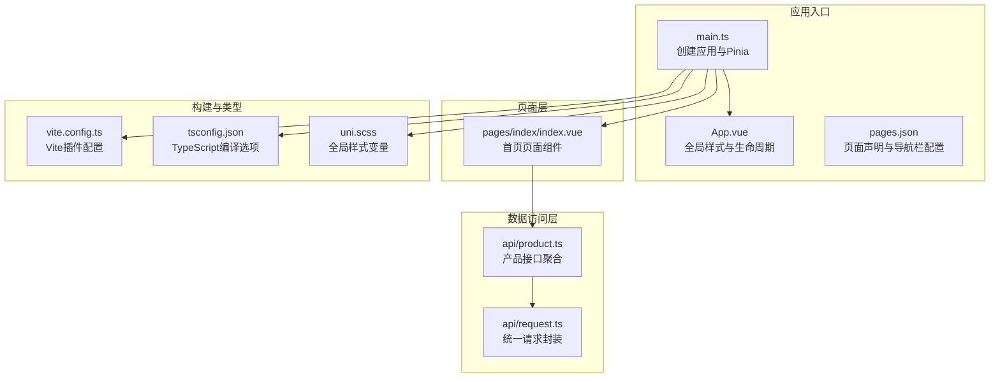
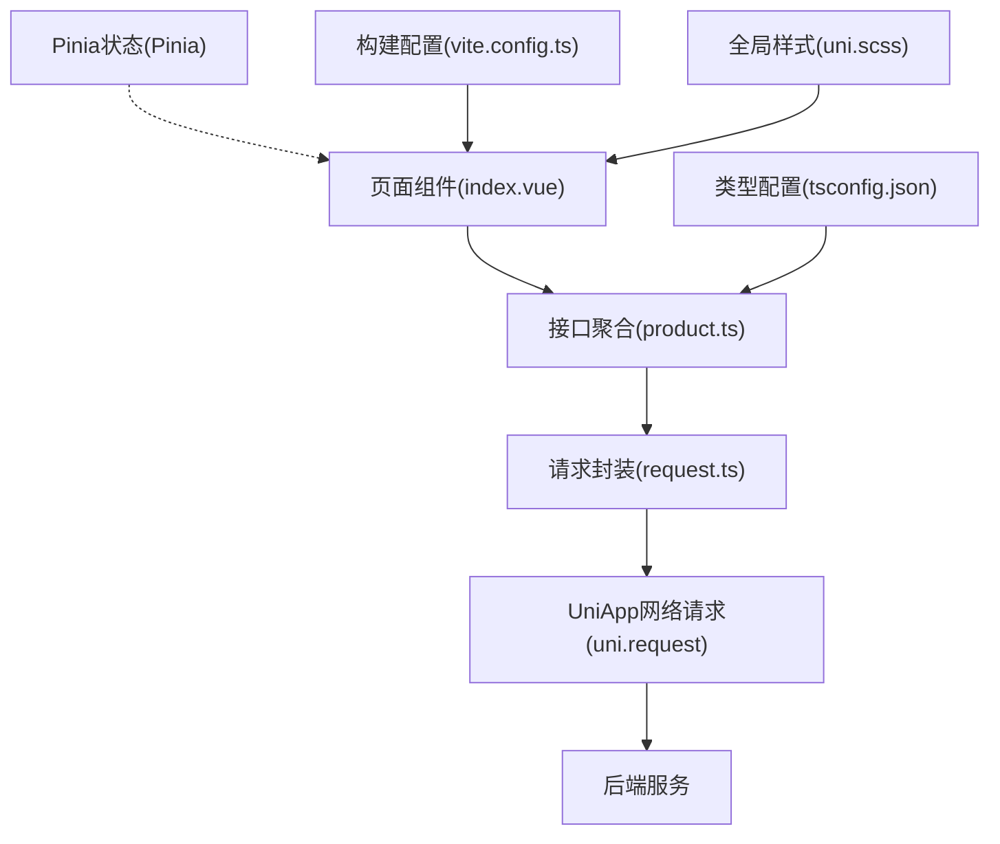
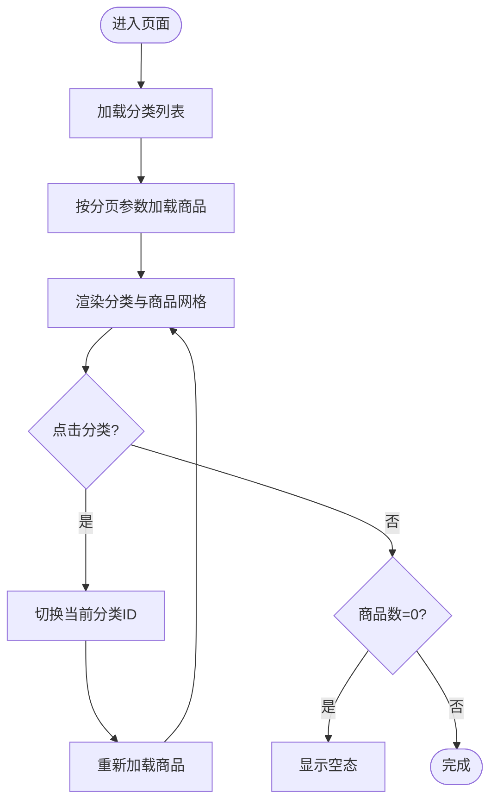
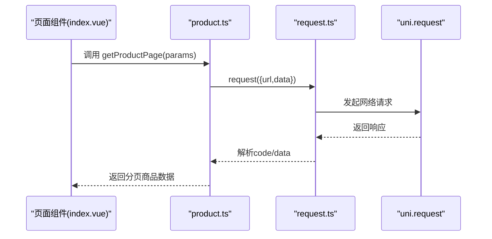
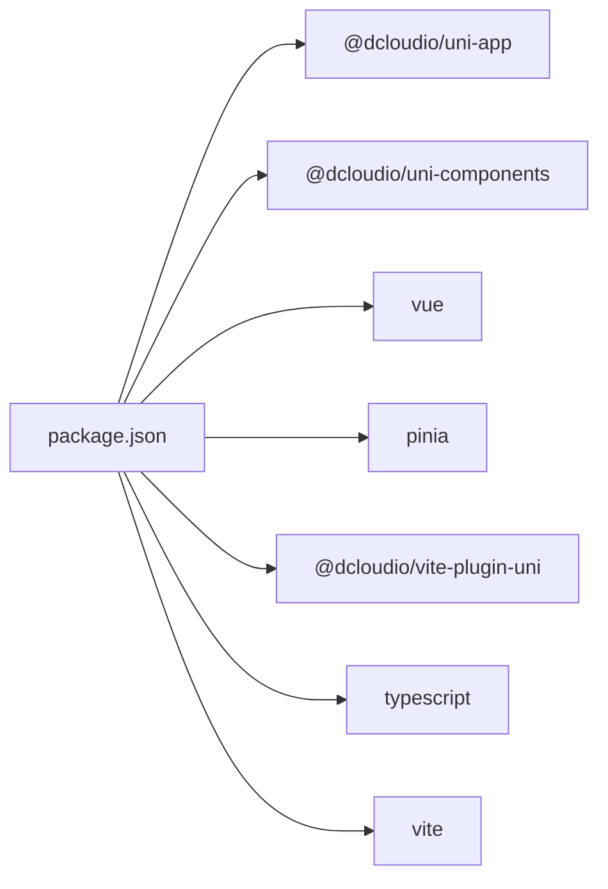

# 组件架构设计

<cite>
**本文引用的文件**
- [App.vue](file://shop-miniapp/src/App.vue)
- [main.ts](file://shop-miniapp/src/main.ts)
- [pages.json](file://shop-miniapp/src/pages.json)
- [index.vue](file://shop-miniapp/src/pages/index/index.vue)
- [request.ts](file://shop-miniapp/src/api/request.ts)
- [product.ts](file://shop-miniapp/src/api/product.ts)
- [package.json](file://shop-miniapp/package.json)
- [vite.config.ts](file://shop-miniapp/vite.config.ts)
- [tsconfig.json](file://shop-miniapp/tsconfig.json)
- [uni.scss](file://shop-miniapp/src/uni.scss)
</cite>

## 目录
1. [引言](#引言)
2. [项目结构](#项目结构)
3. [核心组件](#核心组件)
4. [架构总览](#架构总览)
5. [组件详细分析](#组件详细分析)
6. [依赖关系分析](#依赖关系分析)
7. [性能考量](#性能考量)
8. [故障排查指南](#故障排查指南)
9. [结论](#结论)
10. [附录](#附录)

## 引言
本设计文档面向“药食同源”微信小程序的前端组件架构，围绕基于 Vue3 Composition API 的组件化开发范式，系统阐述页面组件结构、业务组件封装、通用组件库设计、组件间通信与事件传递、props 设计规范、生命周期管理、状态共享策略、样式隔离方案，并给出组件开发最佳实践、性能优化技巧与可维护性保障措施。目标是帮助开发者在统一规范下高效构建高质量、可扩展的小程序前端。

## 项目结构
项目采用 UniApp + Vue3 + TypeScript 技术栈，结合 Vite 构建工具与 Pinia 状态管理，页面通过 pages.json 声明式注册，API 层以模块化方式组织，整体结构清晰、职责分离明确。

图表来源
- [main.ts:1-11](file://shop-miniapp/src/main.ts#L1-L11)
- [App.vue:1-15](file://shop-miniapp/src/App.vue#L1-L15)
- [pages.json:1-17](file://shop-miniapp/src/pages.json#L1-L17)
- [index.vue:1-122](file://shop-miniapp/src/pages/index/index.vue#L1-L122)
- [request.ts:1-48](file://shop-miniapp/src/api/request.ts#L1-L48)
- [product.ts:1-42](file://shop-miniapp/src/api/product.ts#L1-L42)
- [vite.config.ts:1-7](file://shop-miniapp/vite.config.ts#L1-L7)
- [tsconfig.json:1-20](file://shop-miniapp/tsconfig.json#L1-L20)
- [uni.scss:1-6](file://shop-miniapp/src/uni.scss#L1-L6)

章节来源
- [main.ts:1-11](file://shop-miniapp/src/main.ts#L1-L11)
- [App.vue:1-15](file://shop-miniapp/src/App.vue#L1-L15)
- [pages.json:1-17](file://shop-miniapp/src/pages.json#L1-L17)
- [vite.config.ts:1-7](file://shop-miniapp/vite.config.ts#L1-L7)
- [tsconfig.json:1-20](file://shop-miniapp/tsconfig.json#L1-L20)
- [uni.scss:1-6](file://shop-miniapp/src/uni.scss#L1-L6)

## 核心组件
- 页面组件：首页 index.vue 负责分类筛选与商品列表展示，使用 Composition API 管理响应式状态与生命周期，调用产品 API 获取数据。
- 请求封装：request.ts 提供统一的请求方法，内置鉴权头注入、错误码处理与 Toast 反馈，屏蔽底层差异。
- 接口聚合：product.ts 定义 Category、ProductSpu、PageResult 等类型与接口方法，集中暴露产品相关 API。
- 应用入口：main.ts 创建应用实例与 Pinia；App.vue 提供全局样式与应用生命周期钩子；pages.json 声明页面与导航栏样式。

章节来源
- [index.vue:33-62](file://shop-miniapp/src/pages/index/index.vue#L33-L62)
- [request.ts:14-47](file://shop-miniapp/src/api/request.ts#L14-L47)
- [product.ts:28-41](file://shop-miniapp/src/api/product.ts#L28-L41)
- [main.ts:5-10](file://shop-miniapp/src/main.ts#L5-L10)
- [App.vue:4-6](file://shop-miniapp/src/App.vue#L4-L6)
- [pages.json:2-16](file://shop-miniapp/src/pages.json#L2-L16)

## 架构总览
整体采用“页面组件 + 数据访问层 + 应用入口”的分层架构。页面组件通过 API 模块发起请求，请求封装统一处理鉴权与错误，返回标准化数据模型供页面渲染。

图表来源
- [index.vue:35](file://shop-miniapp/src/pages/index/index.vue#L35)
- [product.ts:1-42](file://shop-miniapp/src/api/product.ts#L1-L42)
- [request.ts:16-47](file://shop-miniapp/src/api/request.ts#L16-L47)
- [main.ts:7-9](file://shop-miniapp/src/main.ts#L7-L9)
- [vite.config.ts:4-6](file://shop-miniapp/vite.config.ts#L4-L6)
- [tsconfig.json:2-16](file://shop-miniapp/tsconfig.json#L2-L16)
- [uni.scss:1-6](file://shop-miniapp/src/uni.scss#L1-L6)

## 组件详细分析

### 页面组件：首页 index.vue
- 结构与职责
  - 分类滚动条：横向滚动展示分类项，支持点击切换当前分类。
  - 商品网格：两列等宽卡片布局，展示图片、名称与价格。
  - 空态提示：当商品列表为空时显示提示文案。
- 响应式与生命周期
  - 使用 ref 管理 categories、products、currentCategoryId。
  - 在 mounted 生命周期中加载分类与商品数据。
- 交互逻辑
  - 选择分类：切换 currentCategoryId 并重新加载商品列表。
  - 列表为空：条件渲染空态视图。
- 样式隔离
  - 使用 scoped 样式限定作用域，避免样式污染。

图表来源
- [index.vue:37-62](file://shop-miniapp/src/pages/index/index.vue#L37-L62)

章节来源
- [index.vue:1-122](file://shop-miniapp/src/pages/index/index.vue#L1-L122)

### 数据访问层：API 封装与接口聚合
- 统一请求封装 request.ts
  - 支持 GET/POST/PUT/DELETE 方法，自动注入 Authorization 头（从本地存储读取）。
  - 成功响应：当 code 为 0 时返回 data。
  - 鉴权异常：code 为 401 时清除 token 并提示登录。
  - 其他错误：Toast 提示错误信息。
  - 网络异常：Toast 提示网络异常。
- 接口聚合 product.ts
  - 定义 Category、ProductSpu、PageResult 类型。
  - 暴露 getCategoryList、getProductPage、getProductDetail 等方法，内部调用 request。

图表来源
- [index.vue:46-51](file://shop-miniapp/src/pages/index/index.vue#L46-L51)
- [product.ts:32-37](file://shop-miniapp/src/api/product.ts#L32-L37)
- [request.ts:16-47](file://shop-miniapp/src/api/request.ts#L16-L47)

章节来源
- [request.ts:1-48](file://shop-miniapp/src/api/request.ts#L1-L48)
- [product.ts:1-42](file://shop-miniapp/src/api/product.ts#L1-L42)

### 应用入口与全局配置
- 应用入口 main.ts
  - 创建 SSR 应用实例，安装 Pinia，导出 { app }。
- 应用根组件 App.vue
  - 注册应用生命周期 onLaunch，输出日志。
  - 全局样式设置 page 字体与背景色。
- 页面声明 pages.json
  - 声明首页路径与导航栏标题。
  - 全局导航栏样式配置。
- 构建与类型配置
  - vite.config.ts 使用 @dcloudio/vite-plugin-uni 插件。
  - tsconfig.json 启用严格模式、路径别名 @/* 指向 src/*。
- 全局样式变量 uni.scss
  - 定义主色、价格色、文本色、背景色等变量，供组件引用。

章节来源
- [main.ts:1-11](file://shop-miniapp/src/main.ts#L1-L11)
- [App.vue:1-15](file://shop-miniapp/src/App.vue#L1-L15)
- [pages.json:1-17](file://shop-miniapp/src/pages.json#L1-L17)
- [vite.config.ts:1-7](file://shop-miniapp/vite.config.ts#L1-L7)
- [tsconfig.json:1-20](file://shop-miniapp/tsconfig.json#L1-L20)
- [uni.scss:1-6](file://shop-miniapp/src/uni.scss#L1-L6)

## 依赖关系分析
- 运行时依赖
  - @dcloudio/uni-app、@dcloudio/uni-app-plus、@dcloudio/uni-components、@dcloudio/uni-mp-weixin、vue、pinia。
- 开发依赖
  - @dcloudio/types、@dcloudio/vite-plugin-uni、typescript、vite。
- 项目脚本
  - dev:mp-weixin、build:mp-weixin 用于开发与构建微信小程序。

图表来源
- [package.json:8-26](file://shop-miniapp/package.json#L8-L26)

章节来源
- [package.json:1-27](file://shop-miniapp/package.json#L1-L27)

## 性能考量
- 列表渲染优化
  - 使用 v-for 渲染商品卡片，确保提供稳定 key，减少重排。
  - 商品网格采用两列布局，合理控制 gap 与容器宽度，避免过度换行。
- 网络请求优化
  - 统一请求封装中仅在成功且 code=0 时 resolve，避免无效渲染。
  - 对于频繁切换分类的场景，可在页面层增加防抖或节流策略，降低重复请求。
- 样式与资源
  - 图片使用 aspectFill 模式，保持视觉一致性；建议在后端或 CDN 提供合适尺寸，减少带宽与内存占用。
  - 全局样式变量集中管理，便于主题切换与样式复用。
- 构建与打包
  - 使用 Vite 快速冷启动与热更新，提升开发体验。
  - TypeScript 编译开启严格模式，提前发现潜在问题。

## 故障排查指南
- 登录态失效
  - 当接口返回 401 时，请求封装会清除本地 token 并提示登录。页面需引导用户重新登录。
- 网络异常
  - request.ts 在 fail 回调中统一提示“网络异常”，页面可根据需要补充重试或离线提示。
- 数据为空
  - 页面对空列表进行条件渲染，避免渲染异常节点。
- 导航栏与页面标题
  - 若页面标题未生效，检查 pages.json 中对应页面的 style 配置是否正确。

章节来源
- [request.ts:32-44](file://shop-miniapp/src/api/request.ts#L32-L44)
- [index.vue:27-29](file://shop-miniapp/src/pages/index/index.vue#L27-L29)
- [pages.json:2-16](file://shop-miniapp/src/pages.json#L2-L16)

## 结论
本项目以 Vue3 Composition API 为核心，结合 UniApp 生态与 Pinia 状态管理，形成了清晰的页面组件与数据访问层分离的架构。通过统一请求封装与类型定义，提升了可维护性与可测试性。建议在后续迭代中引入更细粒度的业务组件与通用组件库，完善事件总线与 props 规范，并持续优化网络与渲染性能，以支撑更大规模的功能扩展。

## 附录

### 组件设计原则与复用策略
- 单一职责：每个组件聚焦一个功能点，如分类标签、商品卡片、加载骨架等。
- 可组合性：通过插槽与具名插槽增强可定制性，减少硬编码。
- 可测试性：将副作用（网络请求）集中在外部，组件内部保持纯函数式行为。
- 可复用性：抽象通用 UI 片段为独立组件，统一 props 与事件命名规范。

### 页面组件结构与业务组件封装
- 页面组件负责数据拉取与状态管理，业务组件负责具体 UI 行为与交互。
- 将“分类选择”、“商品列表”拆分为可复用的业务组件，提高代码复用率。

### 通用组件库设计建议
- 基础组件：按钮、输入框、弹窗、加载指示器等。
- 业务组件：商品卡片、分类标签、评分、优惠券等。
- 设计规范：统一尺寸、颜色、阴影、动效，使用全局变量与主题系统。

### 组件间通信机制与事件传递模式
- 父子通信：Props 向下传递数据，Emits 向上反馈事件。
- 兄弟/跨级通信：通过全局状态（Pinia）或事件总线（EventBus）解耦。
- 事件命名：采用语义化前缀，如 onCategorySelect、onProductClick。

### Props 设计规范
- 明确必填与可选字段，提供默认值与类型约束。
- 使用只读属性与受控组件模式，避免组件内直接修改父传值。
- 对复杂对象使用浅拷贝或不可变数据结构，防止意外修改。

### 生命周期管理
- 在 onMounted 中发起首次数据请求，在 onUnmounted 中清理定时器与订阅。
- 对高频操作（如滚动、输入）使用防抖/节流，避免性能抖动。

### 状态共享策略
- 全局状态：用户信息、购物车、主题偏好等使用 Pinia 管理。
- 组件内状态：仅与当前组件强相关的状态保留在组件内部。
- 状态持久化：对必要的状态使用本地存储，注意敏感信息不落盘。

### 样式隔离方案
- 使用 scoped 样式限定作用域，避免全局污染。
- 全局样式变量集中管理，组件内部通过变量引用，便于主题切换。
- 避免深度选择器与 !important，减少样式冲突。

### 开发最佳实践
- 使用 TypeScript 提升类型安全，接口定义与 API 模块一一对应。
- 统一错误处理与 Toast 提示，保持用户体验一致。
- 代码风格遵循团队规范，注释与文档同步更新。