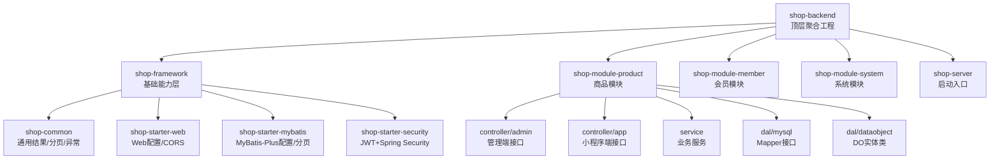
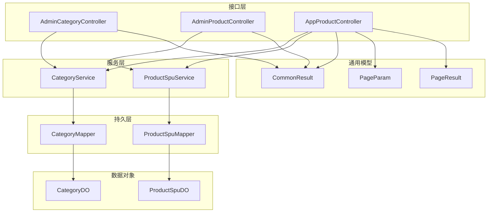
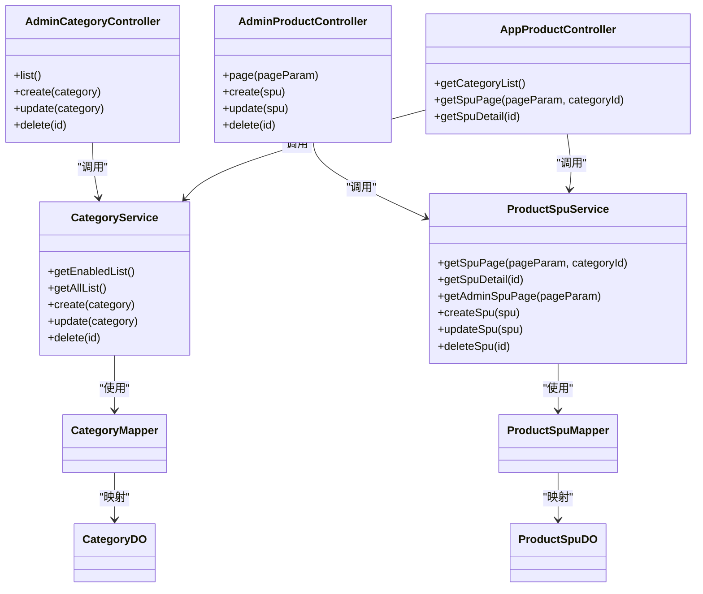
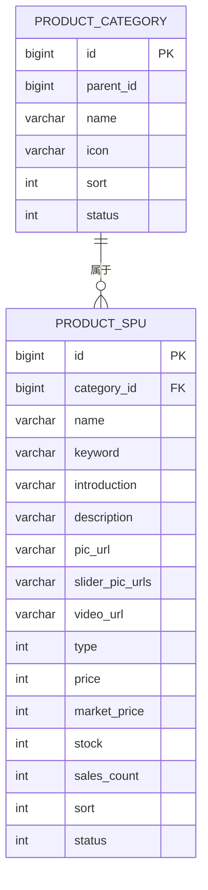
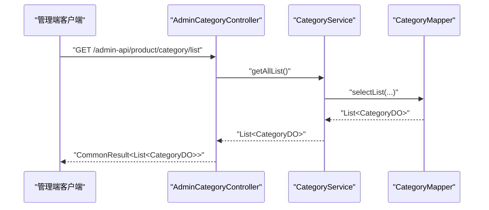
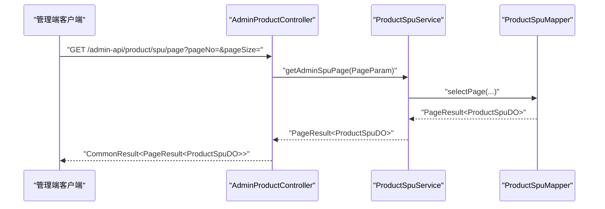
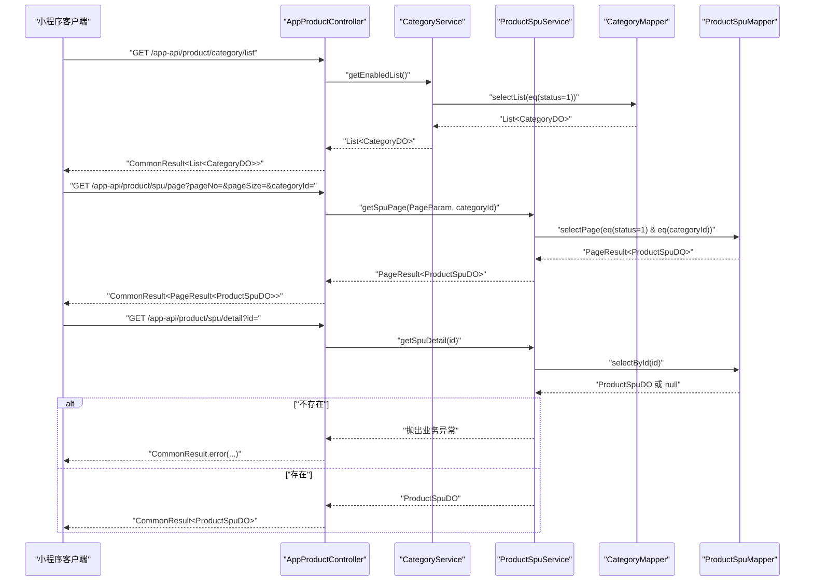
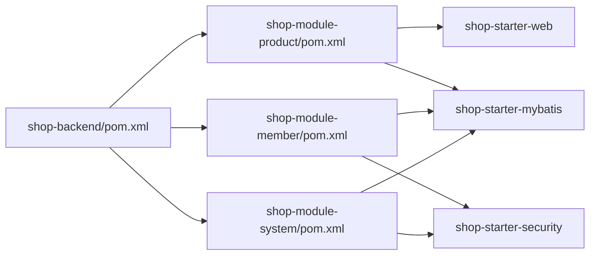

# 业务模块设计

<cite>
**本文引用的文件**
- [README.md](file://README.md)
- [shop-backend/pom.xml](file://shop-backend/pom.xml)
- [shop-backend/shop-server/src/main/java/com/shop/server/ShopServerApplication.java](file://shop-backend/shop-server/src/main/java/com/shop/server/ShopServerApplication.java)
- [shop-backend/shop-module-product/pom.xml](file://shop-backend/shop-module-product/pom.xml)
- [shop-backend/shop-module-member/pom.xml](file://shop-backend/shop-module-member/pom.xml)
- [shop-backend/shop-module-system/pom.xml](file://shop-backend/shop-module-system/pom.xml)
- [shop-backend/shop-module-product/src/main/java/com/shop/module/product/controller/admin/AdminCategoryController.java](file://shop-backend/shop-module-product/src/main/java/com/shop/module/product/controller/admin/AdminCategoryController.java)
- [shop-backend/shop-module-product/src/main/java/com/shop/module/product/controller/admin/AdminProductController.java](file://shop-backend/shop-module-product/src/main/java/com/shop/module/product/controller/admin/AdminProductController.java)
- [shop-backend/shop-module-product/src/main/java/com/shop/module/product/controller/app/AppProductController.java](file://shop-backend/shop-module-product/src/main/java/com/shop/module/product/controller/app/AppProductController.java)
- [shop-backend/shop-module-product/src/main/java/com/shop/module/product/dal/dataobject/CategoryDO.java](file://shop-backend/shop-module-product/src/main/java/com/shop/module/product/dal/dataobject/CategoryDO.java)
- [shop-backend/shop-module-product/src/main/java/com/shop/module/product/dal/dataobject/ProductSpuDO.java](file://shop-backend/shop-module-product/src/main/java/com/shop/module/product/dal/dataobject/ProductSpuDO.java)
- [shop-backend/shop-module-product/src/main/java/com/shop/module/product/service/CategoryService.java](file://shop-backend/shop-module-product/src/main/java/com/shop/module/product/service/CategoryService.java)
- [shop-backend/shop-module-product/src/main/java/com/shop/module/product/service/ProductSpuService.java](file://shop-backend/shop-module-product/src/main/java/com/shop/module/product/service/ProductSpuService.java)
- [shop-backend/shop-module-product/src/main/java/com/shop/module/product/dal/mysql/CategoryMapper.java](file://shop-backend/shop-module-product/src/main/java/com/shop/module/product/dal/mysql/CategoryMapper.java)
- [shop-backend/shop-module-product/src/main/java/com/shop/module/product/dal/mysql/ProductSpuMapper.java](file://shop-backend/shop-module-product/src/main/java/com/shop/module/product/dal/mysql/ProductSpuMapper.java)
- [shop-backend/shop-framework/shop-common/src/main/java/com/shop/common/pojo/CommonResult.java](file://shop-backend/shop-framework/shop-common/src/main/java/com/shop/common/pojo/CommonResult.java)
- [shop-backend/shop-framework/shop-common/src/main/java/com/shop/common/pojo/PageParam.java](file://shop-backend/shop-framework/shop-common/src/main/java/com/shop/common/pojo/PageParam.java)
- [shop-backend/shop-framework/shop-common/src/main/java/com/shop/common/pojo/PageResult.java](file://shop-backend/shop-framework/shop-common/src/main/java/com/shop/common/pojo/PageResult.java)
</cite>

## 目录
1. [引言](#引言)
2. [项目结构](#项目结构)
3. [核心组件](#核心组件)
4. [架构总览](#架构总览)
5. [详细组件分析](#详细组件分析)
6. [依赖关系分析](#依赖关系分析)
7. [性能考虑](#性能考虑)
8. [故障排查指南](#故障排查指南)
9. [结论](#结论)
10. [附录](#附录)

## 引言
本设计文档面向“药食同源”微信小程序商城的业务模块，围绕基于 Maven 的多模块后端架构，系统性阐述 shop-module-product 商品模块（商品分类管理、SPU 商品管理）、shop-module-member 会员模块（用户注册登录、个人信息管理）、shop-module-system 系统模块（管理员登录、系统配置管理）的功能定位、分层架构（Controller-Service-Mapper-Entity）、数据模型设计与业务流程，并明确模块间接口契约、数据传递方式与事务管理策略。文档同时提供业务逻辑详解、代码实现路径指引与扩展建议，帮助业务开发者快速上手与二次开发。

## 项目结构
后端采用 Maven 多模块组织，顶层聚合工程统一管理版本与依赖，模块化拆分如下：
- shop-framework：基础能力层，包含通用工具、MyBatis-Plus 启动器、安全认证启动器与 Web 配置启动器
- shop-module-product：商品模块，提供商品分类与 SPU 的前后台接口
- shop-module-member：会员模块，提供会员相关接口（当前目录存在但未展开具体实现）
- shop-module-system：系统模块，提供系统管理相关接口（当前目录存在但未展开具体实现）
- shop-server：应用启动入口，负责组件扫描与 Mapper 扫描

图表来源
- [shop-backend/pom.xml:14-20](file://shop-backend/pom.xml#L14-L20)
- [shop-backend/shop-server/src/main/java/com/shop/server/ShopServerApplication.java:8-11](file://shop-backend/shop-server/src/main/java/com/shop/server/ShopServerApplication.java#L8-L11)

章节来源
- [README.md:12-41](file://README.md#L12-L41)
- [shop-backend/pom.xml:14-20](file://shop-backend/pom.xml#L14-L20)
- [shop-backend/shop-server/src/main/java/com/shop/server/ShopServerApplication.java:8-11](file://shop-backend/shop-server/src/main/java/com/shop/server/ShopServerApplication.java#L8-L11)

## 核心组件
本节聚焦商品模块的核心组件与职责边界，涵盖接口层、服务层、持久层与数据对象层。

- 接口层（Controller）
  - 管理端接口：AdminCategoryController、AdminProductController
  - 小程序端接口：AppProductController
- 服务层（Service）
  - CategoryService：商品分类的查询与维护
  - ProductSpuService：SPU 商品的分页、详情、维护
- 持久层（Mapper）
  - CategoryMapper、ProductSpuMapper：基于 MyBatis-Plus 的通用 Mapper
- 数据对象（DO）
  - CategoryDO：商品分类实体
  - ProductSpuDO：SPU 商品实体

章节来源
- [shop-backend/shop-module-product/src/main/java/com/shop/module/product/controller/admin/AdminCategoryController.java:11-40](file://shop-backend/shop-module-product/src/main/java/com/shop/module/product/controller/admin/AdminCategoryController.java#L11-L40)
- [shop-backend/shop-module-product/src/main/java/com/shop/module/product/controller/admin/AdminProductController.java:11-40](file://shop-backend/shop-module-product/src/main/java/com/shop/module/product/controller/admin/AdminProductController.java#L11-L40)
- [shop-backend/shop-module-product/src/main/java/com/shop/module/product/controller/app/AppProductController.java:15-38](file://shop-backend/shop-module-product/src/main/java/com/shop/module/product/controller/app/AppProductController.java#L15-L38)
- [shop-backend/shop-module-product/src/main/java/com/shop/module/product/service/CategoryService.java:11-39](file://shop-backend/shop-module-product/src/main/java/com/shop/module/product/service/CategoryService.java#L11-L39)
- [shop-backend/shop-module-product/src/main/java/com/shop/module/product/service/ProductSpuService.java:13-52](file://shop-backend/shop-module-product/src/main/java/com/shop/module/product/service/ProductSpuService.java#L13-L52)
- [shop-backend/shop-module-product/src/main/java/com/shop/module/product/dal/mysql/CategoryMapper.java:7-9](file://shop-backend/shop-module-product/src/main/java/com/shop/module/product/dal/mysql/CategoryMapper.java#L7-L9)
- [shop-backend/shop-module-product/src/main/java/com/shop/module/product/dal/mysql/ProductSpuMapper.java:7-9](file://shop-backend/shop-module-product/src/main/java/com/shop/module/product/dal/mysql/ProductSpuMapper.java#L7-L9)
- [shop-backend/shop-module-product/src/main/java/com/shop/module/product/dal/dataobject/CategoryDO.java:10-22](file://shop-backend/shop-module-product/src/main/java/com/shop/module/product/dal/dataobject/CategoryDO.java#L10-L22)
- [shop-backend/shop-module-product/src/main/java/com/shop/module/product/dal/dataobject/ProductSpuDO.java:10-32](file://shop-backend/shop-module-product/src/main/java/com/shop/module/product/dal/dataobject/ProductSpuDO.java#L10-L32)

## 架构总览
整体采用分层架构：Controller 负责请求接入与参数封装；Service 负责业务编排与校验；Mapper 负责数据访问；DO 作为数据载体。所有接口返回统一包装格式，分页参数与结果也统一规范。

图表来源
- [shop-backend/shop-module-product/src/main/java/com/shop/module/product/controller/admin/AdminCategoryController.java:11-40](file://shop-backend/shop-module-product/src/main/java/com/shop/module/product/controller/admin/AdminCategoryController.java#L11-L40)
- [shop-backend/shop-module-product/src/main/java/com/shop/module/product/controller/admin/AdminProductController.java:11-40](file://shop-backend/shop-module-product/src/main/java/com/shop/module/product/controller/admin/AdminProductController.java#L11-L40)
- [shop-backend/shop-module-product/src/main/java/com/shop/module/product/controller/app/AppProductController.java:15-38](file://shop-backend/shop-module-product/src/main/java/com/shop/module/product/controller/app/AppProductController.java#L15-L38)
- [shop-backend/shop-module-product/src/main/java/com/shop/module/product/service/CategoryService.java:11-39](file://shop-backend/shop-module-product/src/main/java/com/shop/module/product/service/CategoryService.java#L11-L39)
- [shop-backend/shop-module-product/src/main/java/com/shop/module/product/service/ProductSpuService.java:13-52](file://shop-backend/shop-module-product/src/main/java/com/shop/module/product/service/ProductSpuService.java#L13-L52)
- [shop-backend/shop-framework/shop-common/src/main/java/com/shop/common/pojo/CommonResult.java:8-33](file://shop-backend/shop-framework/shop-common/src/main/java/com/shop/common/pojo/CommonResult.java#L8-L33)
- [shop-backend/shop-framework/shop-common/src/main/java/com/shop/common/pojo/PageParam.java:7-11](file://shop-backend/shop-framework/shop-common/src/main/java/com/shop/common/pojo/PageParam.java#L7-L11)
- [shop-backend/shop-framework/shop-common/src/main/java/com/shop/common/pojo/PageResult.java:8-17](file://shop-backend/shop-framework/shop-common/src/main/java/com/shop/common/pojo/PageResult.java#L8-L17)

## 详细组件分析

### 商品模块（shop-module-product）

#### 分层架构与职责
- Controller 层：AdminCategoryController、AdminProductController、AppProductController 提供 REST 接口，分别面向管理端与小程序端
- Service 层：CategoryService、ProductSpuService 负责业务规则与数据访问协调
- Mapper 层：CategoryMapper、ProductSpuMapper 继承通用基类，提供标准 CRUD 能力
- DO 层：CategoryDO、ProductSpuDO 描述表结构与字段语义

图表来源
- [shop-backend/shop-module-product/src/main/java/com/shop/module/product/controller/admin/AdminCategoryController.java:11-40](file://shop-backend/shop-module-product/src/main/java/com/shop/module/product/controller/admin/AdminCategoryController.java#L11-L40)
- [shop-backend/shop-module-product/src/main/java/com/shop/module/product/controller/admin/AdminProductController.java:11-40](file://shop-backend/shop-module-product/src/main/java/com/shop/module/product/controller/admin/AdminProductController.java#L11-L40)
- [shop-backend/shop-module-product/src/main/java/com/shop/module/product/controller/app/AppProductController.java:15-38](file://shop-backend/shop-module-product/src/main/java/com/shop/module/product/controller/app/AppProductController.java#L15-L38)
- [shop-backend/shop-module-product/src/main/java/com/shop/module/product/service/CategoryService.java:11-39](file://shop-backend/shop-module-product/src/main/java/com/shop/module/product/service/CategoryService.java#L11-L39)
- [shop-backend/shop-module-product/src/main/java/com/shop/module/product/service/ProductSpuService.java:13-52](file://shop-backend/shop-module-product/src/main/java/com/shop/module/product/service/ProductSpuService.java#L13-L52)
- [shop-backend/shop-module-product/src/main/java/com/shop/module/product/dal/mysql/CategoryMapper.java:7-9](file://shop-backend/shop-module-product/src/main/java/com/shop/module/product/dal/mysql/CategoryMapper.java#L7-L9)
- [shop-backend/shop-module-product/src/main/java/com/shop/module/product/dal/mysql/ProductSpuMapper.java:7-9](file://shop-backend/shop-module-product/src/main/java/com/shop/module/product/dal/mysql/ProductSpuMapper.java#L7-L9)
- [shop-backend/shop-module-product/src/main/java/com/shop/module/product/dal/dataobject/CategoryDO.java:10-22](file://shop-backend/shop-module-product/src/main/java/com/shop/module/product/dal/dataobject/CategoryDO.java#L10-L22)
- [shop-backend/shop-module-product/src/main/java/com/shop/module/product/dal/dataobject/ProductSpuDO.java:10-32](file://shop-backend/shop-module-product/src/main/java/com/shop/module/product/dal/dataobject/ProductSpuDO.java#L10-L32)

#### 数据模型设计
- 商品分类 CategoryDO
  - 字段要点：主键、父级分类、名称、图标、排序、状态等
  - 关系：树形父子结构，支持启用状态与排序展示
- SPU 商品 ProductSpuDO
  - 字段要点：所属分类、标题、关键词、简介、描述、图片、轮播图、视频、类型（实物/虚拟）、价格（分）、市场价、库存、销量、排序、状态（上下架）
  - 业务含义：承载商品主体信息，用于小程序端展示与筛选

图表来源
- [shop-backend/shop-module-product/src/main/java/com/shop/module/product/dal/dataobject/CategoryDO.java:10-22](file://shop-backend/shop-module-product/src/main/java/com/shop/module/product/dal/dataobject/CategoryDO.java#L10-L22)
- [shop-backend/shop-module-product/src/main/java/com/shop/module/product/dal/dataobject/ProductSpuDO.java:10-32](file://shop-backend/shop-module-product/src/main/java/com/shop/module/product/dal/dataobject/ProductSpuDO.java#L10-L32)

#### 业务流程与接口契约

##### 商品分类管理（管理端）
- 列表查询：按启用状态与排序返回分类列表
- 新增/修改/删除：直接委托给 Service 层进行持久化

图表来源
- [shop-backend/shop-module-product/src/main/java/com/shop/module/product/controller/admin/AdminCategoryController.java:18-21](file://shop-backend/shop-module-product/src/main/java/com/shop/module/product/controller/admin/AdminCategoryController.java#L18-L21)
- [shop-backend/shop-module-product/src/main/java/com/shop/module/product/service/CategoryService.java:17-26](file://shop-backend/shop-module-product/src/main/java/com/shop/module/product/service/CategoryService.java#L17-L26)
- [shop-backend/shop-module-product/src/main/java/com/shop/module/product/dal/mysql/CategoryMapper.java:7-9](file://shop-backend/shop-module-product/src/main/java/com/shop/module/product/dal/mysql/CategoryMapper.java#L7-L9)

##### SPU 商品管理（管理端）
- 分页查询：按创建时间倒序返回商品列表
- 新增/修改/删除：直接委托给 Service 层进行持久化

图表来源
- [shop-backend/shop-module-product/src/main/java/com/shop/module/product/controller/admin/AdminProductController.java:18-21](file://shop-backend/shop-module-product/src/main/java/com/shop/module/product/controller/admin/AdminProductController.java#L18-L21)
- [shop-backend/shop-module-product/src/main/java/com/shop/module/product/service/ProductSpuService.java:35-39](file://shop-backend/shop-module-product/src/main/java/com/shop/module/product/service/ProductSpuService.java#L35-L39)
- [shop-backend/shop-module-product/src/main/java/com/shop/module/product/dal/mysql/ProductSpuMapper.java:7-9](file://shop-backend/shop-module-product/src/main/java/com/shop/module/product/dal/mysql/ProductSpuMapper.java#L7-L9)

##### 小程序端商品浏览
- 分类列表：返回启用状态的分类
- 商品分页：支持按分类筛选，仅返回上架商品
- 商品详情：根据 ID 查询，不存在则抛出业务异常

图表来源
- [shop-backend/shop-module-product/src/main/java/com/shop/module/product/controller/app/AppProductController.java:23-37](file://shop-backend/shop-module-product/src/main/java/com/shop/module/product/controller/app/AppProductController.java#L23-L37)
- [shop-backend/shop-module-product/src/main/java/com/shop/module/product/service/CategoryService.java:17-21](file://shop-backend/shop-module-product/src/main/java/com/shop/module/product/service/CategoryService.java#L17-L21)
- [shop-backend/shop-module-product/src/main/java/com/shop/module/product/service/ProductSpuService.java:19-33](file://shop-backend/shop-module-product/src/main/java/com/shop/module/product/service/ProductSpuService.java#L19-L33)
- [shop-backend/shop-module-product/src/main/java/com/shop/module/product/dal/mysql/CategoryMapper.java:7-9](file://shop-backend/shop-module-product/src/main/java/com/shop/module/product/dal/mysql/CategoryMapper.java#L7-L9)
- [shop-backend/shop-module-product/src/main/java/com/shop/module/product/dal/mysql/ProductSpuMapper.java:7-9](file://shop-backend/shop-module-product/src/main/java/com/shop/module/product/dal/mysql/ProductSpuMapper.java#L7-L9)

#### 处理逻辑与复杂度分析
- 分类查询：按状态与排序条件查询，复杂度近似 O(n)，n 为分类数量
- SPU 分页：带条件过滤与排序，复杂度近似 O(k log n)，k 为分页条数
- 详情查询：单条主键查询，复杂度 O(1)

章节来源
- [shop-backend/shop-module-product/src/main/java/com/shop/module/product/service/CategoryService.java:17-38](file://shop-backend/shop-module-product/src/main/java/com/shop/module/product/service/CategoryService.java#L17-L38)
- [shop-backend/shop-module-product/src/main/java/com/shop/module/product/service/ProductSpuService.java:19-51](file://shop-backend/shop-module-product/src/main/java/com/shop/module/product/service/ProductSpuService.java#L19-L51)

#### 错误处理与异常
- 详情查询不存在时，抛出业务异常，由全局异常处理器统一包装为 CommonResult.error(...) 返回
- 全局异常与错误码定义位于 shop-common 模块，统一返回格式

章节来源
- [shop-backend/shop-module-product/src/main/java/com/shop/module/product/service/ProductSpuService.java:28-32](file://shop-backend/shop-module-product/src/main/java/com/shop/module/product/service/ProductSpuService.java#L28-L32)
- [shop-backend/shop-framework/shop-common/src/main/java/com/shop/common/pojo/CommonResult.java:8-33](file://shop-backend/shop-framework/shop-common/src/main/java/com/shop/common/pojo/CommonResult.java#L8-L33)

#### 事务管理策略
- 当前模块未显式声明事务，采用默认传播行为；若后续引入跨表写入或一致性需求，可在 Service 方法上添加事务注解以确保原子性

[本小节为通用策略说明，不直接分析具体文件，故无“章节来源”]

### 会员模块（shop-module-member）
- 功能定位：用户注册登录、个人信息管理
- 当前状态：模块已创建，具体实现尚未在仓库中展开
- 建议：复用 shop-starter-security 与 shop-starter-mybatis，遵循现有分层与统一返回格式

[本小节为概念性说明，不直接分析具体文件，故无“章节来源”]

### 系统模块（shop-module-system）
- 功能定位：管理员登录、系统配置管理
- 当前状态：模块已创建，具体实现尚未在仓库中展开
- 建议：复用 shop-starter-security 与 shop-starter-mybatis，结合权限控制与配置表设计

[本小节为概念性说明，不直接分析具体文件，故无“章节来源”]

## 依赖关系分析
- 模块依赖
  - shop-module-product 依赖 shop-starter-web 与 shop-starter-mybatis
  - shop-module-member 依赖 shop-starter-security 与 shop-starter-mybatis
  - shop-module-system 依赖 shop-starter-security 与 shop-starter-mybatis
- 顶层依赖管理统一版本，避免冲突
- 启动类通过组件扫描与 Mapper 扫描覆盖 com.shop.* 包

图表来源
- [shop-backend/pom.xml:33-88](file://shop-backend/pom.xml#L33-L88)
- [shop-backend/shop-module-product/pom.xml:14-23](file://shop-backend/shop-module-product/pom.xml#L14-L23)
- [shop-backend/shop-module-member/pom.xml:14-23](file://shop-backend/shop-module-member/pom.xml#L14-L23)
- [shop-backend/shop-module-system/pom.xml:14-27](file://shop-backend/shop-module-system/pom.xml#L14-L27)

章节来源
- [shop-backend/pom.xml:33-88](file://shop-backend/pom.xml#L33-L88)
- [shop-backend/shop-server/src/main/java/com/shop/server/ShopServerApplication.java:8-11](file://shop-backend/shop-server/src/main/java/com/shop/server/ShopServerApplication.java#L8-L11)

## 性能考虑
- 分页查询：合理设置分页大小与排序字段，避免全表扫描
- 查询优化：对高频查询字段建立索引（如分类状态、商品状态、创建时间）
- 缓存策略：对分类与热门商品详情可引入缓存，降低数据库压力
- 并发控制：在高并发场景下，对库存与下单流程增加乐观锁或分布式锁

[本节提供通用建议，不直接分析具体文件，故无“章节来源”]

## 故障排查指南
- 接口返回格式
  - 使用统一包装类 CommonResult，便于前端与调试
- 分页参数
  - PageParam 默认值为第一页与每页条数，注意边界与最大值限制
- 业务异常
  - 详情不存在等业务异常会转换为 CommonResult.error(...)，需检查错误码与消息
- 启动与扫描
  - 确认启动类组件扫描范围覆盖模块包路径，Mapper 扫描路径正确

章节来源
- [shop-backend/shop-framework/shop-common/src/main/java/com/shop/common/pojo/CommonResult.java:8-33](file://shop-backend/shop-framework/shop-common/src/main/java/com/shop/common/pojo/CommonResult.java#L8-L33)
- [shop-backend/shop-framework/shop-common/src/main/java/com/shop/common/pojo/PageParam.java:7-11](file://shop-backend/shop-framework/shop-common/src/main/java/com/shop/common/pojo/PageParam.java#L7-L11)
- [shop-backend/shop-server/src/main/java/com/shop/server/ShopServerApplication.java:8-11](file://shop-backend/shop-server/src/main/java/com/shop/server/ShopServerApplication.java#L8-L11)

## 结论
本设计文档基于现有代码与项目结构，完整梳理了商品模块的分层架构、数据模型与业务流程，并明确了模块间接口契约与统一返回格式。会员与系统模块处于准备阶段，建议沿用现有启动器与分层约定，快速落地。后续可在保证一致性的前提下，逐步完善事务管理、缓存与安全策略，提升系统稳定性与性能。

## 附录
- 快速验证
  - 获取分类列表、创建商品、分页查询商品、查看商品详情
- 开发建议
  - 严格遵守分层与统一返回格式
  - 对外接口命名与路径保持一致风格
  - 在 Service 层集中处理业务规则与异常

章节来源
- [README.md:87-100](file://README.md#L87-L100)