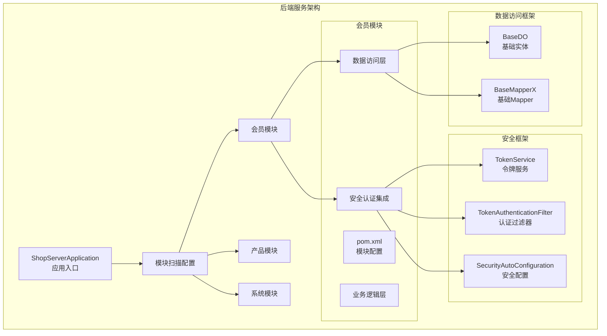
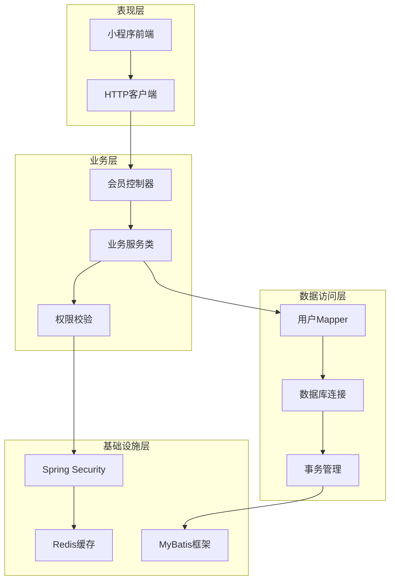
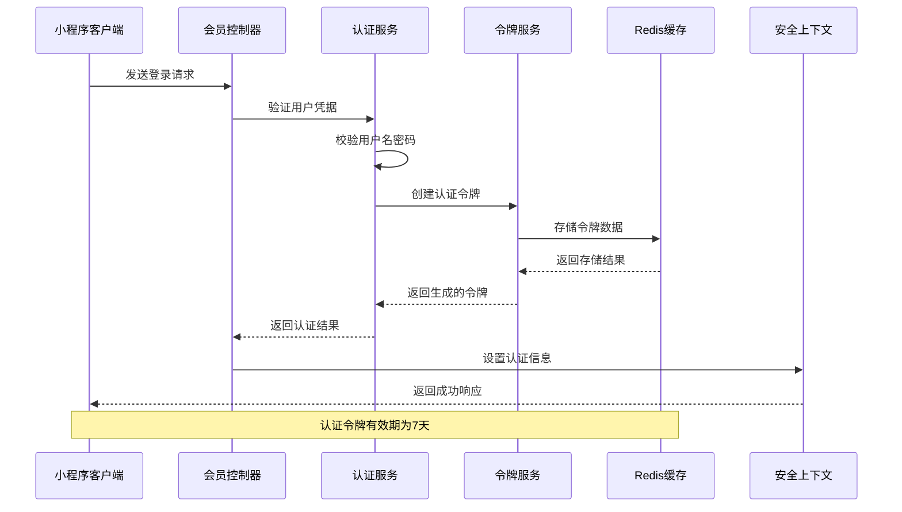
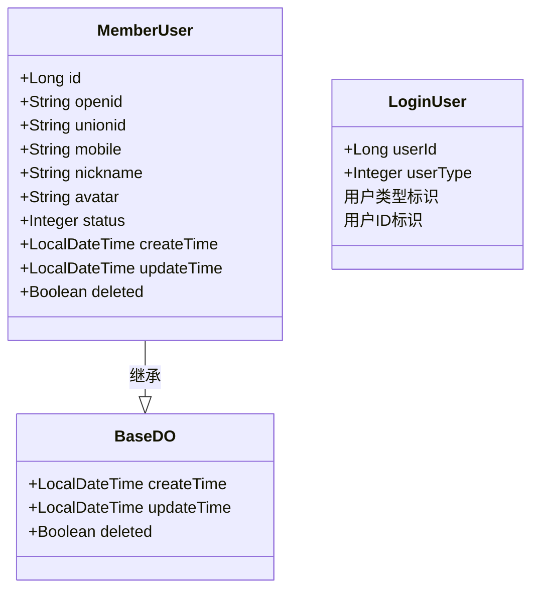
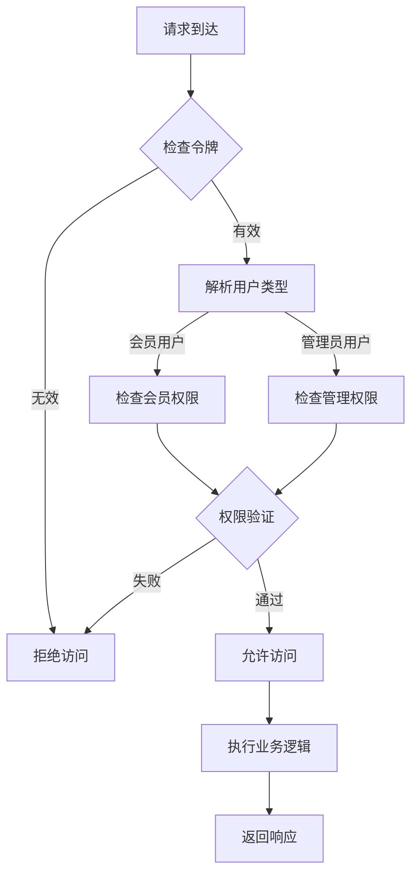
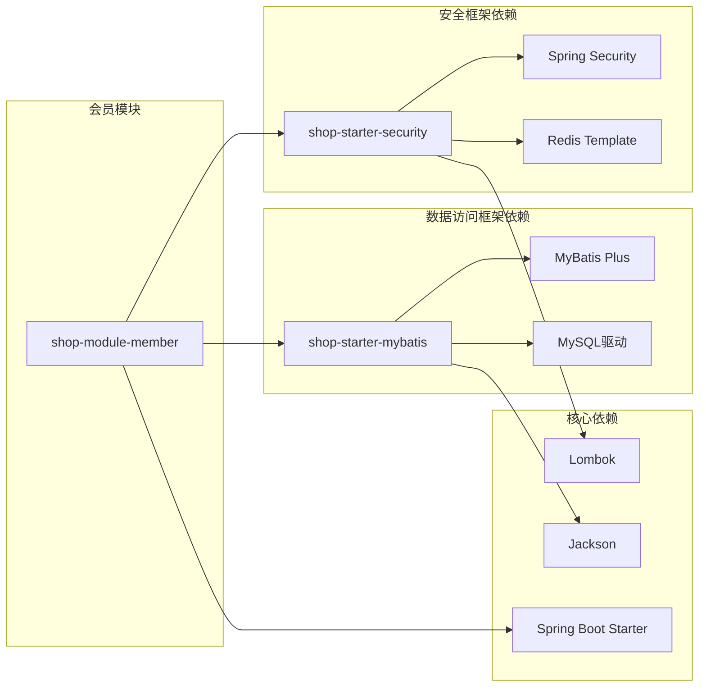

# 会员模块 (shop-module-member)

<cite>
**本文档引用的文件**
- [shop-module-member/pom.xml](file://shop-backend/shop-module-member/pom.xml)
- [LoginUser.java](file://shop-backend/shop-framework/shop-starter-security/src/main/java/com/shop/framework/security/LoginUser.java)
- [TokenService.java](file://shop-backend/shop-framework/shop-starter-security/src/main/java/com/shop/framework/security/TokenService.java)
- [TokenAuthenticationFilter.java](file://shop-backend/shop-framework/shop-starter-security/src/main/java/com/shop/framework/security/TokenAuthenticationFilter.java)
- [SecurityAutoConfiguration.java](file://shop-backend/shop-framework/shop-starter-security/src/main/java/com/shop/framework/security/SecurityAutoConfiguration.java)
- [BaseDO.java](file://shop-backend/shop-framework/shop-starter-mybatis/src/main/java/com/shop/framework/mybatis/core/BaseDO.java)
- [BaseMapperX.java](file://shop-backend/shop-framework/shop-starter-mybatis/src/main/java/com/shop/framework/mybatis/core/BaseMapperX.java)
- [ShopServerApplication.java](file://shop-backend/shop-server/src/main/java/com/shop/server/ShopServerApplication.java)
- [application.yml](file://shop-backend/shop-server/src/main/resources/application.yml)
- [init.sql](file://sql/init.sql)
- [2026-06-22-shop-miniprogram-design.md](file://docs/superpowers/specs/2026-06-22-shop-miniprogram-design.md)
- [2026-06-22-plan1-demo-foundation.md](file://docs/superpowers/plans/2026-06-22-plan1-demo-foundation.md)
</cite>

## 目录
1. [引言](#引言)
2. [项目结构](#项目结构)
3. [核心组件](#核心组件)
4. [架构概览](#架构概览)
5. [详细组件分析](#详细组件分析)
6. [依赖关系分析](#依赖关系分析)
7. [性能考虑](#性能考虑)
8. [故障排除指南](#故障排除指南)
9. [结论](#结论)
10. [附录](#附录)

## 引言

会员模块是药食同源微信小程序商城的核心功能模块之一，负责管理用户注册、登录认证、个人信息管理等关键业务功能。该模块基于Spring Boot微服务架构构建，采用前后端分离的设计模式，通过RESTful API为小程序前端提供标准化的服务接口。

在整体系统架构中，会员模块承担着用户身份管理、权限控制、数据存储等重要职责。它与安全认证模块紧密集成，确保系统的安全性与可靠性。同时，会员模块还为后续的功能扩展奠定了坚实的基础，如会员等级体系、积分系统、订阅服务等业务功能都可以在此基础上进行扩展开发。

## 项目结构

会员模块采用标准的Maven多模块项目结构，位于`shop-backend/shop-module-member`目录下。该模块作为独立的服务单元，通过依赖注入的方式集成安全认证框架和MyBatis持久层框架。

**图表来源**
- [ShopServerApplication.java:1-17](file://shop-backend/shop-server/src/main/java/com/shop/server/ShopServerApplication.java#L1-L17)
- [shop-module-member/pom.xml:1-24](file://shop-backend/shop-module-member/pom.xml#L1-L24)

**章节来源**
- [shop-module-member/pom.xml:1-24](file://shop-backend/shop-module-member/pom.xml#L1-L24)
- [ShopServerApplication.java:1-17](file://shop-backend/shop-server/src/main/java/com/shop/server/ShopServerApplication.java#L1-L17)

## 核心组件

会员模块的核心组件围绕用户身份管理和数据持久化展开，主要包括以下关键组件：

### 安全认证组件

安全认证组件是会员模块的基础设施，提供了完整的用户身份验证和授权机制。该组件基于Spring Security实现，支持JWT令牌的生成、验证和管理。

### 数据访问组件

数据访问组件基于MyBatis框架构建，提供了统一的数据访问抽象层。通过继承基础实体类和Mapper接口，实现了标准化的数据操作模式。

### 业务服务组件

业务服务组件负责处理具体的业务逻辑，包括用户信息管理、登录认证、权限验证等功能。这些组件通过依赖注入的方式相互协作，形成完整的业务处理流程。

**章节来源**
- [LoginUser.java:1-10](file://shop-backend/shop-framework/shop-starter-security/src/main/java/com/shop/framework/security/LoginUser.java#L1-L10)
- [BaseDO.java:1-23](file://shop-backend/shop-framework/shop-starter-mybatis/src/main/java/com/shop/framework/mybatis/core/BaseDO.java#L1-L23)
- [BaseMapperX.java:1-16](file://shop-backend/shop-framework/shop-starter-mybatis/src/main/java/com/shop/framework/mybatis/core/BaseMapperX.java#L1-L16)

## 架构概览

会员模块采用分层架构设计，从上到下分为表现层、业务层、数据访问层和基础设施层。这种分层设计确保了各层之间的职责清晰，便于维护和扩展。

**图表来源**
- [SecurityAutoConfiguration.java:1-47](file://shop-backend/shop-framework/shop-starter-security/src/main/java/com/shop/framework/security/SecurityAutoConfiguration.java#L1-L47)
- [TokenAuthenticationFilter.java:1-43](file://shop-backend/shop-framework/shop-starter-security/src/main/java/com/shop/framework/security/TokenAuthenticationFilter.java#L1-L43)
- [TokenService.java:1-47](file://shop-backend/shop-framework/shop-starter-security/src/main/java/com/shop/framework/security/TokenService.java#L1-L47)

## 详细组件分析

### 登录认证流程

会员模块的登录认证流程是一个典型的JWT令牌认证过程，涉及多个组件的协同工作。整个流程从用户发起登录请求开始，经过身份验证、令牌生成、权限设置等步骤，最终返回认证结果。

**图表来源**
- [TokenAuthenticationFilter.java:20-33](file://shop-backend/shop-framework/shop-starter-security/src/main/java/com/shop/framework/security/TokenAuthenticationFilter.java#L20-L33)
- [TokenService.java:19-25](file://shop-backend/shop-framework/shop-starter-security/src/main/java/com/shop/framework/security/TokenService.java#L19-L25)

### 用户数据模型

会员模块的用户数据模型设计遵循最小可用原则，重点关注微信小程序的核心需求。用户表包含了微信openid、unionid、手机号、昵称、头像等关键字段，为后续的功能扩展预留了空间。

**图表来源**
- [init.sql:10-24](file://sql/init.sql#L10-L24)
- [BaseDO.java:11-23](file://shop-backend/shop-framework/shop-starter-mybatis/src/main/java/com/shop/framework/mybatis/core/BaseDO.java#L11-L23)
- [LoginUser.java:6-9](file://shop-backend/shop-framework/shop-starter-security/src/main/java/com/shop/framework/security/LoginUser.java#L6-L9)

**章节来源**
- [init.sql:10-24](file://sql/init.sql#L10-L24)
- [LoginUser.java:1-10](file://shop-backend/shop-framework/shop-starter-security/src/main/java/com/shop/framework/security/LoginUser.java#L1-L10)
- [BaseDO.java:1-23](file://shop-backend/shop-framework/shop-starter-mybatis/src/main/java/com/shop/framework/mybatis/core/BaseDO.java#L1-L23)

### 权限管理系统

会员模块的权限管理基于用户类型进行区分，支持会员用户和管理员用户的权限隔离。通过userType字段标识用户类型，系统可以针对不同类型的用户执行相应的权限控制。

**图表来源**
- [SecurityAutoConfiguration.java:25-31](file://shop-backend/shop-framework/shop-starter-security/src/main/java/com/shop/framework/security/SecurityAutoConfiguration.java#L25-L31)
- [LoginUser.java:7-8](file://shop-backend/shop-framework/shop-starter-security/src/main/java/com/shop/framework/security/LoginUser.java#L7-L8)

**章节来源**
- [SecurityAutoConfiguration.java:1-47](file://shop-backend/shop-framework/shop-starter-security/src/main/java/com/shop/framework/security/SecurityAutoConfiguration.java#L1-L47)
- [LoginUser.java:1-10](file://shop-backend/shop-framework/shop-starter-security/src/main/java/com/shop/framework/security/LoginUser.java#L1-L10)

## 依赖关系分析

会员模块的依赖关系体现了清晰的分层架构和模块化设计原则。通过合理的依赖管理，确保了模块间的松耦合和高内聚。

**图表来源**
- [shop-module-member/pom.xml:14-23](file://shop-backend/shop-module-member/pom.xml#L14-L23)

**章节来源**
- [shop-module-member/pom.xml:1-24](file://shop-backend/shop-module-member/pom.xml#L1-L24)

## 性能考虑

会员模块在设计时充分考虑了性能优化和可扩展性要求。通过合理的架构设计和技术选型，确保系统能够满足高并发场景下的性能需求。

### 缓存策略

系统采用Redis作为缓存层，用于存储用户认证令牌和热点数据。令牌的有效期设置为7天，既保证了用户体验，又避免了缓存数据的长期占用。

### 数据库优化

用户表建立了合适的索引策略，包括openid唯一索引和手机号索引，优化了用户查询性能。同时，使用逻辑删除字段实现软删除，避免了物理删除带来的性能问题。

### 并发控制

通过无状态的JWT令牌机制，系统避免了会话状态的维护，提高了系统的水平扩展能力。每个请求都包含完整的认证信息，减少了服务器端的状态存储开销。

## 故障排除指南

在会员模块的开发和运维过程中，可能会遇到各种技术问题。本节提供了常见问题的诊断方法和解决方案。

### 认证失败排查

当用户遇到登录失败的问题时，可以从以下几个方面进行排查：

1. **令牌验证失败**：检查Authorization头部格式是否正确，确认令牌格式为"Bearer "前缀加UUID格式
2. **Redis连接异常**：验证Redis服务的连通性和配置参数
3. **用户状态异常**：确认用户账户状态为正常，没有被禁用或删除

### 数据访问问题

如果出现数据访问异常，需要检查：

1. **数据库连接**：验证数据库连接字符串和凭证配置
2. **SQL语句**：检查Mapper文件中的SQL语法和参数绑定
3. **事务配置**：确认事务传播行为和回滚规则设置正确

**章节来源**
- [TokenAuthenticationFilter.java:35-41](file://shop-backend/shop-framework/shop-starter-security/src/main/java/com/shop/framework/security/TokenAuthenticationFilter.java#L35-L41)
- [TokenService.java:27-41](file://shop-backend/shop-framework/shop-starter-security/src/main/java/com/shop/framework/security/TokenService.java#L27-L41)

## 结论

会员模块作为药食同源微信小程序商城的核心功能模块，通过精心设计的架构和完善的组件体系，为用户提供了可靠的注册、登录和信息管理服务。模块采用的标准的分层架构设计，确保了系统的可维护性和可扩展性。

在安全方面，模块集成了完整的认证授权机制，通过JWT令牌和Redis缓存实现了高效的用户身份管理。在数据层面，基于MyBatis的标准化数据访问层提供了良好的性能和扩展性。

未来，会员模块可以在此基础上进一步扩展，支持更丰富的业务功能，如会员等级体系、积分系统、订阅服务等，为小程序商城的发展提供强有力的技术支撑。

## 附录

### 开发环境配置

系统使用Spring Boot作为应用框架，支持多环境配置。默认配置文件位于`application.yml`中，可以通过profile切换不同的运行环境。

### 扩展开发指南

会员模块为后续的功能扩展预留了充足的空间。开发者可以在现有架构基础上添加新的业务功能，同时保持系统的稳定性和一致性。

**章节来源**
- [application.yml:1-7](file://shop-backend/shop-server/src/main/resources/application.yml#L1-L7)
- [2026-06-22-plan1-demo-foundation.md:2339-2345](file://docs/superpowers/plans/2026-06-22-plan1-demo-foundation.md#L2339-L2345)