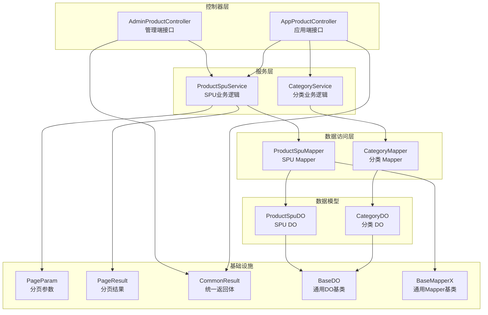
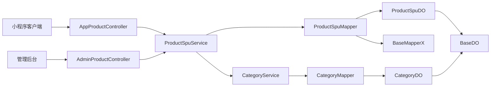
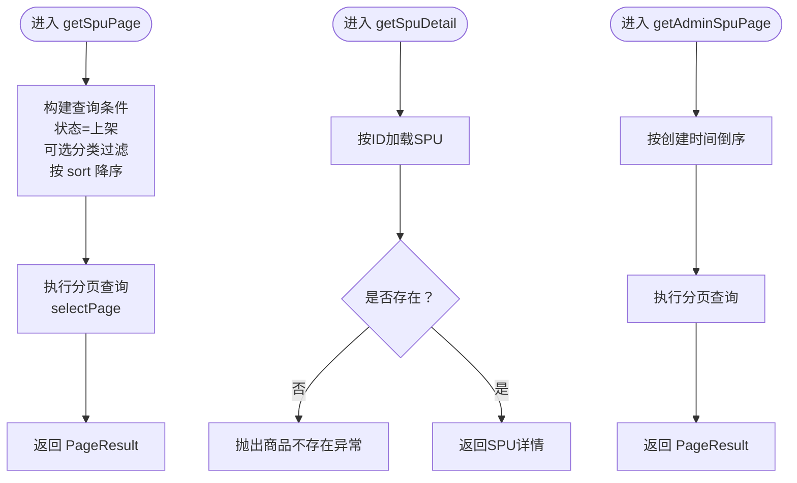
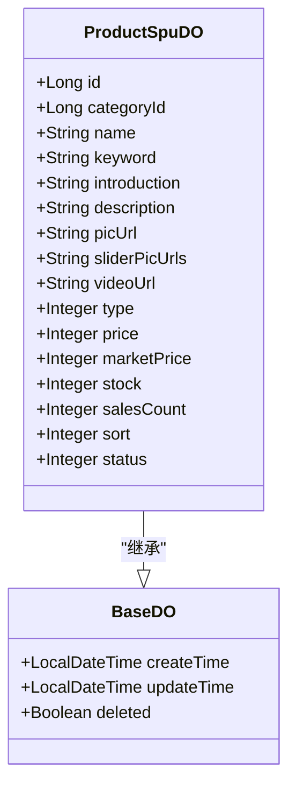
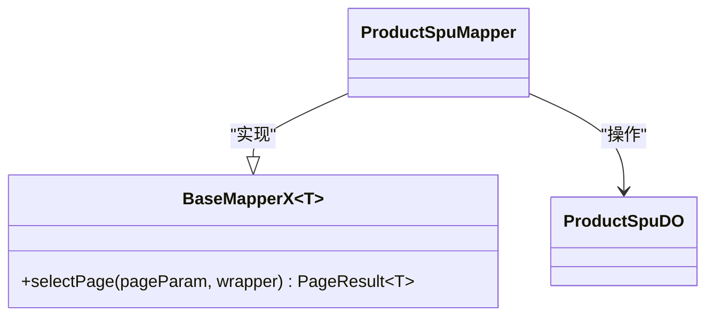
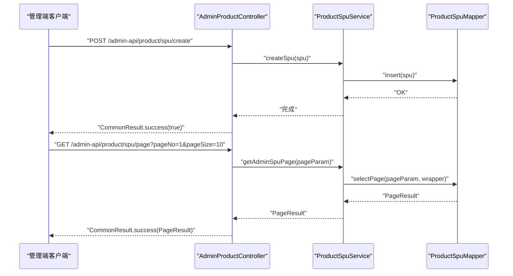
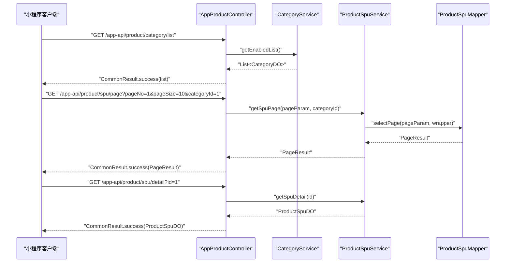
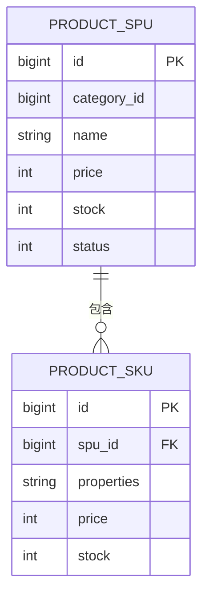
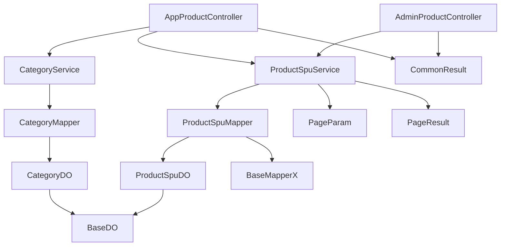

# SPU商品管理

<cite>
**本文引用的文件**
- [ProductSpuService.java](file://shop-backend/shop-module-product/src/main/java/com/shop/module/product/service/ProductSpuService.java)
- [ProductSpuDO.java](file://shop-backend/shop-module-product/src/main/java/com/shop/module/product/dal/dataobject/ProductSpuDO.java)
- [ProductSpuMapper.java](file://shop-backend/shop-module-product/src/main/java/com/shop/module/product/dal/mysql/ProductSpuMapper.java)
- [AdminProductController.java](file://shop-backend/shop-module-product/src/main/java/com/shop/module/product/controller/admin/AdminProductController.java)
- [AppProductController.java](file://shop-backend/shop-module-product/src/main/java/com/shop/module/product/controller/app/AppProductController.java)
- [BaseDO.java](file://shop-backend/shop-framework/shop-starter-mybatis/src/main/java/com/shop/framework/mybatis/core/BaseDO.java)
- [BaseMapperX.java](file://shop-backend/shop-framework/shop-starter-mybatis/src/main/java/com/shop/framework/mybatis/core/BaseMapperX.java)
- [CategoryDO.java](file://shop-backend/shop-module-product/src/main/java/com/shop/module/product/dal/dataobject/CategoryDO.java)
- [CategoryService.java](file://shop-backend/shop-module-product/src/main/java/com/shop/module/product/service/CategoryService.java)
- [ErrorCode.java](file://shop-backend/shop-framework/shop-common/src/main/java/com/shop/common/exception/ErrorCode.java)
- [CommonResult.java](file://shop-backend/shop-framework/shop-common/src/main/java/com/shop/common/pojo/CommonResult.java)
- [PageParam.java](file://shop-backend/shop-framework/shop-common/src/main/java/com/shop/common/pojo/PageParam.java)
- [PageResult.java](file://shop-backend/shop-framework/shop-common/src/main/java/com/shop/common/pojo/PageResult.java)
- [init.sql](file://sql/init.sql)
</cite>

## 目录
1. [引言](#引言)
2. [项目结构](#项目结构)
3. [核心组件](#核心组件)
4. [架构总览](#架构总览)
5. [详细组件分析](#详细组件分析)
6. [依赖分析](#依赖分析)
7. [性能考虑](#性能考虑)
8. [故障排查指南](#故障排查指南)
9. [结论](#结论)
10. [附录](#附录)

## 引言
本技术文档围绕微信小程序商城的SPU（Standard Product Unit）商品管理能力展开，聚焦服务层、数据对象、数据访问层与控制器层的实现与协作关系，并结合数据库表结构说明SPU与SKU的关系及在小程序端的应用场景。通过对ProductSpuService服务层的创建、更新、删除、查询等核心业务逻辑进行深入解析，帮助开发者快速理解并扩展该模块。

## 项目结构
后端采用模块化分层架构：
- 控制器层：分别提供管理端与应用端的REST接口
- 服务层：封装业务规则与流程编排
- 数据访问层：基于MyBatis-Plus的Mapper接口与通用基类
- 基础设施：统一的分页参数、返回体、异常码与DO基类
- 数据库：包含商品SPU/SKU、分类等核心表

**图表来源**
- [AdminProductController.java:1-41](file://shop-backend/shop-module-product/src/main/java/com/shop/module/product/controller/admin/AdminProductController.java#L1-L41)
- [AppProductController.java:1-39](file://shop-backend/shop-module-product/src/main/java/com/shop/module/product/controller/app/AppProductController.java#L1-L39)
- [ProductSpuService.java:1-53](file://shop-backend/shop-module-product/src/main/java/com/shop/module/product/service/ProductSpuService.java#L1-L53)
- [CategoryService.java:1-40](file://shop-backend/shop-module-product/src/main/java/com/shop/module/product/service/CategoryService.java#L1-L40)
- [ProductSpuMapper.java:1-10](file://shop-backend/shop-module-product/src/main/java/com/shop/module/product/dal/mysql/ProductSpuMapper.java#L1-L10)
- [CategoryDO.java:1-23](file://shop-backend/shop-module-product/src/main/java/com/shop/module/product/dal/dataobject/CategoryDO.java#L1-L23)
- [ProductSpuDO.java:1-33](file://shop-backend/shop-module-product/src/main/java/com/shop/module/product/dal/dataobject/ProductSpuDO.java#L1-L33)
- [BaseDO.java:1-23](file://shop-backend/shop-framework/shop-starter-mybatis/src/main/java/com/shop/framework/mybatis/core/BaseDO.java#L1-L23)
- [BaseMapperX.java:1-16](file://shop-backend/shop-framework/shop-starter-mybatis/src/main/java/com/shop/framework/mybatis/core/BaseMapperX.java#L1-L16)
- [CommonResult.java:1-34](file://shop-backend/shop-framework/shop-common/src/main/java/com/shop/common/pojo/CommonResult.java#L1-L34)
- [PageParam.java:1-12](file://shop-backend/shop-framework/shop-common/src/main/java/com/shop/common/pojo/PageParam.java#L1-L12)
- [PageResult.java:1-18](file://shop-backend/shop-framework/shop-common/src/main/java/com/shop/common/pojo/PageResult.java#L1-L18)

**章节来源**
- [AdminProductController.java:1-41](file://shop-backend/shop-module-product/src/main/java/com/shop/module/product/controller/admin/AdminProductController.java#L1-L41)
- [AppProductController.java:1-39](file://shop-backend/shop-module-product/src/main/java/com/shop/module/product/controller/app/AppProductController.java#L1-L39)
- [ProductSpuService.java:1-53](file://shop-backend/shop-module-product/src/main/java/com/shop/module/product/service/ProductSpuService.java#L1-L53)
- [ProductSpuMapper.java:1-10](file://shop-backend/shop-module-product/src/main/java/com/shop/module/product/dal/mysql/ProductSpuMapper.java#L1-L10)
- [ProductSpuDO.java:1-33](file://shop-backend/shop-module-product/src/main/java/com/shop/module/product/dal/dataobject/ProductSpuDO.java#L1-L33)
- [CategoryDO.java:1-23](file://shop-backend/shop-module-product/src/main/java/com/shop/module/product/dal/dataobject/CategoryDO.java#L1-L23)
- [CategoryService.java:1-40](file://shop-backend/shop-module-product/src/main/java/com/shop/module/product/service/CategoryService.java#L1-L40)
- [BaseDO.java:1-23](file://shop-backend/shop-framework/shop-starter-mybatis/src/main/java/com/shop/framework/mybatis/core/BaseDO.java#L1-L23)
- [BaseMapperX.java:1-16](file://shop-backend/shop-framework/shop-starter-mybatis/src/main/java/com/shop/framework/mybatis/core/BaseMapperX.java#L1-L16)
- [CommonResult.java:1-34](file://shop-backend/shop-framework/shop-common/src/main/java/com/shop/common/pojo/CommonResult.java#L1-L34)
- [PageParam.java:1-12](file://shop-backend/shop-framework/shop-common/src/main/java/com/shop/common/pojo/PageParam.java#L1-L12)
- [PageResult.java:1-18](file://shop-backend/shop-framework/shop-common/src/main/java/com/shop/common/pojo/PageResult.java#L1-L18)

## 核心组件
- ProductSpuService：负责SPU的分页查询、详情查询、创建、更新、删除等核心业务；对查询条件进行拼装，如按状态过滤、按分类筛选、按排序字段排序等；对不存在的商品抛出业务异常。
- ProductSpuDO：SPU实体对象，映射product_spu表，包含基础信息、价格体系、库存、销售统计、排序与状态等字段。
- ProductSpuMapper：继承通用Mapper基类，提供标准的增删改查能力；通过LambdaQueryWrapper构建复杂查询条件。
- AdminProductController：管理端接口，提供SPU列表分页、创建、更新、删除等管理能力。
- AppProductController：应用端接口，提供分类列表、SPU分页、SPU详情等面向小程序端的能力。
- CategoryService/CategoryDO：配套的分类模块，用于应用端展示可用分类列表。
- 基础设施：统一的分页参数、分页结果、统一返回体、通用DO基类与通用Mapper基类，保证代码一致性与可维护性。

**章节来源**
- [ProductSpuService.java:1-53](file://shop-backend/shop-module-product/src/main/java/com/shop/module/product/service/ProductSpuService.java#L1-L53)
- [ProductSpuDO.java:1-33](file://shop-backend/shop-module-product/src/main/java/com/shop/module/product/dal/dataobject/ProductSpuDO.java#L1-L33)
- [ProductSpuMapper.java:1-10](file://shop-backend/shop-module-product/src/main/java/com/shop/module/product/dal/mysql/ProductSpuMapper.java#L1-L10)
- [AdminProductController.java:1-41](file://shop-backend/shop-module-product/src/main/java/com/shop/module/product/controller/admin/AdminProductController.java#L1-L41)
- [AppProductController.java:1-39](file://shop-backend/shop-module-product/src/main/java/com/shop/module/product/controller/app/AppProductController.java#L1-L39)
- [CategoryService.java:1-40](file://shop-backend/shop-module-product/src/main/java/com/shop/module/product/service/CategoryService.java#L1-L40)
- [CategoryDO.java:1-23](file://shop-backend/shop-module-product/src/main/java/com/shop/module/product/dal/dataobject/CategoryDO.java#L1-L23)
- [BaseDO.java:1-23](file://shop-backend/shop-framework/shop-starter-mybatis/src/main/java/com/shop/framework/mybatis/core/BaseDO.java#L1-L23)
- [BaseMapperX.java:1-16](file://shop-backend/shop-framework/shop-starter-mybatis/src/main/java/com/shop/framework/mybatis/core/BaseMapperX.java#L1-L16)
- [CommonResult.java:1-34](file://shop-backend/shop-framework/shop-common/src/main/java/com/shop/common/pojo/CommonResult.java#L1-L34)
- [PageParam.java:1-12](file://shop-backend/shop-framework/shop-common/src/main/java/com/shop/common/pojo/PageParam.java#L1-L12)
- [PageResult.java:1-18](file://shop-backend/shop-framework/shop-common/src/main/java/com/shop/common/pojo/PageResult.java#L1-L18)

## 架构总览
SPU模块遵循经典的三层架构：控制器层负责HTTP请求接入与响应包装；服务层承载业务规则；数据访问层负责持久化；基础设施提供统一的分页、返回体与DO/Mapper基类。管理端与应用端控制器分别调用服务层，实现不同的业务目标与接口规范。

**图表来源**
- [AppProductController.java:1-39](file://shop-backend/shop-module-product/src/main/java/com/shop/module/product/controller/app/AppProductController.java#L1-L39)
- [AdminProductController.java:1-41](file://shop-backend/shop-module-product/src/main/java/com/shop/module/product/controller/admin/AdminProductController.java#L1-L41)
- [ProductSpuService.java:1-53](file://shop-backend/shop-module-product/src/main/java/com/shop/module/product/service/ProductSpuService.java#L1-L53)
- [ProductSpuMapper.java:1-10](file://shop-backend/shop-module-product/src/main/java/com/shop/module/product/dal/mysql/ProductSpuMapper.java#L1-L10)
- [CategoryService.java:1-40](file://shop-backend/shop-module-product/src/main/java/com/shop/module/product/service/CategoryService.java#L1-L40)
- [ProductSpuDO.java:1-33](file://shop-backend/shop-module-product/src/main/java/com/shop/module/product/dal/dataobject/ProductSpuDO.java#L1-L33)
- [CategoryDO.java:1-23](file://shop-backend/shop-module-product/src/main/java/com/shop/module/product/dal/dataobject/CategoryDO.java#L1-L23)
- [BaseDO.java:1-23](file://shop-backend/shop-framework/shop-starter-mybatis/src/main/java/com/shop/framework/mybatis/core/BaseDO.java#L1-L23)
- [BaseMapperX.java:1-16](file://shop-backend/shop-framework/shop-starter-mybatis/src/main/java/com/shop/framework/mybatis/core/BaseMapperX.java#L1-L16)

## 详细组件分析

### ProductSpuService 服务层
- 分页查询（应用端）：按状态上架过滤、可选分类过滤、按sort降序排列，使用通用分页封装返回PageResult。
- 详情查询：根据ID查询SPU，若不存在则抛出“商品不存在”的业务异常。
- 管理端分页：按创建时间倒序列出所有SPU。
- 创建/更新/删除：直接委托给Mapper执行插入、更新、删除。

**图表来源**
- [ProductSpuService.java:19-39](file://shop-backend/shop-module-product/src/main/java/com/shop/module/product/service/ProductSpuService.java#L19-L39)
- [ErrorCode.java:1-26](file://shop-backend/shop-framework/shop-common/src/main/java/com/shop/common/exception/ErrorCode.java#L1-L26)
- [PageResult.java:1-18](file://shop-backend/shop-framework/shop-common/src/main/java/com/shop/common/pojo/PageResult.java#L1-L18)

**章节来源**
- [ProductSpuService.java:1-53](file://shop-backend/shop-module-product/src/main/java/com/shop/module/product/service/ProductSpuService.java#L1-L53)
- [ErrorCode.java:1-26](file://shop-backend/shop-framework/shop-common/src/main/java/com/shop/common/exception/ErrorCode.java#L1-L26)
- [PageParam.java:1-12](file://shop-backend/shop-framework/shop-common/src/main/java/com/shop/common/pojo/PageParam.java#L1-L12)
- [PageResult.java:1-18](file://shop-backend/shop-framework/shop-common/src/main/java/com/shop/common/pojo/PageResult.java#L1-L18)

### ProductSpuDO 数据对象
- 继承BaseDO，自动具备创建时间、更新时间与逻辑删除字段。
- 字段覆盖SPU核心信息：分类、名称、关键词、简介、描述、主图、轮播图、视频、类型（实物/虚拟）、价格（单位分）、市场价、总库存、销量、排序、状态（上下架）。
- 设计要点：
  - 金额以“分”为最小单位，避免浮点误差。
  - 库存与销量分离，便于统计与风控。
  - 状态字段支持上下架控制，配合查询条件实现“仅展示上架商品”。

**图表来源**
- [ProductSpuDO.java:1-33](file://shop-backend/shop-module-product/src/main/java/com/shop/module/product/dal/dataobject/ProductSpuDO.java#L1-L33)
- [BaseDO.java:1-23](file://shop-backend/shop-framework/shop-starter-mybatis/src/main/java/com/shop/framework/mybatis/core/BaseDO.java#L1-L23)

**章节来源**
- [ProductSpuDO.java:1-33](file://shop-backend/shop-module-product/src/main/java/com/shop/module/product/dal/dataobject/ProductSpuDO.java#L1-L33)
- [BaseDO.java:1-23](file://shop-backend/shop-framework/shop-starter-mybatis/src/main/java/com/shop/framework/mybatis/core/BaseDO.java#L1-L23)

### ProductSpuMapper 数据访问层
- 继承通用BaseMapperX，获得标准的CRUD与selectPage能力。
- 查询条件由Service层通过LambdaQueryWrapper传入，Mapper负责执行SQL并返回PageResult。

**图表来源**
- [ProductSpuMapper.java:1-10](file://shop-backend/shop-module-product/src/main/java/com/shop/module/product/dal/mysql/ProductSpuMapper.java#L1-L10)
- [BaseMapperX.java:1-16](file://shop-backend/shop-framework/shop-starter-mybatis/src/main/java/com/shop/framework/mybatis/core/BaseMapperX.java#L1-L16)
- [ProductSpuDO.java:1-33](file://shop-backend/shop-module-product/src/main/java/com/shop/module/product/dal/dataobject/ProductSpuDO.java#L1-L33)

**章节来源**
- [ProductSpuMapper.java:1-10](file://shop-backend/shop-module-product/src/main/java/com/shop/module/product/dal/mysql/ProductSpuMapper.java#L1-L10)
- [BaseMapperX.java:1-16](file://shop-backend/shop-framework/shop-starter-mybatis/src/main/java/com/shop/framework/mybatis/core/BaseMapperX.java#L1-L16)

### 控制器层：AdminProductController（管理端）
- 接口规范：
  - GET /admin-api/product/spu/page：分页查询SPU列表（按创建时间倒序）
  - POST /admin-api/product/spu/create：创建SPU
  - PUT /admin-api/product/spu/update：更新SPU
  - DELETE /admin-api/product/spu/delete：删除SPU
- 返回体：统一使用CommonResult包装，成功时code=0，msg="success"

**图表来源**
- [AdminProductController.java:1-41](file://shop-backend/shop-module-product/src/main/java/com/shop/module/product/controller/admin/AdminProductController.java#L1-L41)
- [ProductSpuService.java:35-39](file://shop-backend/shop-module-product/src/main/java/com/shop/module/product/service/ProductSpuService.java#L35-L39)
- [ProductSpuMapper.java:1-10](file://shop-backend/shop-module-product/src/main/java/com/shop/module/product/dal/mysql/ProductSpuMapper.java#L1-L10)
- [CommonResult.java:1-34](file://shop-backend/shop-framework/shop-common/src/main/java/com/shop/common/pojo/CommonResult.java#L1-L34)

**章节来源**
- [AdminProductController.java:1-41](file://shop-backend/shop-module-product/src/main/java/com/shop/module/product/controller/admin/AdminProductController.java#L1-L41)
- [CommonResult.java:1-34](file://shop-backend/shop-framework/shop-common/src/main/java/com/shop/common/pojo/CommonResult.java#L1-L34)

### 控制器层：AppProductController（应用端）
- 接口规范：
  - GET /app-api/product/category/list：获取启用的分类列表
  - GET /app-api/product/spu/page：分页查询SPU（可选categoryId过滤，仅上架商品）
  - GET /app-api/product/spu/detail：获取SPU详情
- 返回体：统一使用CommonResult包装

**图表来源**
- [AppProductController.java:1-39](file://shop-backend/shop-module-product/src/main/java/com/shop/module/product/controller/app/AppProductController.java#L1-L39)
- [CategoryService.java:17-21](file://shop-backend/shop-module-product/src/main/java/com/shop/module/product/service/CategoryService.java#L17-L21)
- [ProductSpuService.java:19-33](file://shop-backend/shop-module-product/src/main/java/com/shop/module/product/service/ProductSpuService.java#L19-L33)
- [ProductSpuMapper.java:1-10](file://shop-backend/shop-module-product/src/main/java/com/shop/module/product/dal/mysql/ProductSpuMapper.java#L1-L10)
- [CommonResult.java:1-34](file://shop-backend/shop-framework/shop-common/src/main/java/com/shop/common/pojo/CommonResult.java#L1-L34)

**章节来源**
- [AppProductController.java:1-39](file://shop-backend/shop-module-product/src/main/java/com/shop/module/product/controller/app/AppProductController.java#L1-L39)
- [CategoryService.java:1-40](file://shop-backend/shop-module-product/src/main/java/com/shop/module/product/service/CategoryService.java#L1-L40)
- [ProductSpuService.java:1-53](file://shop-backend/shop-module-product/src/main/java/com/shop/module/product/service/ProductSpuService.java#L1-L53)

### SPU与SKU关系的业务逻辑
- SPU（标准商品单元）：抽象层面的商品主体，包含名称、主图、描述、基础价格区间等。
- SKU（库存量单位）：具体可购买的规格组合，如颜色、尺寸、版本等，每个SKU有独立的价格、库存与图片。
- 在本仓库中，SPU与SKU通过外键关联（SPU.id → SKU.spu_id），SKU表包含属性集合、价格、库存等字段。
- 小程序端通常先展示SPU列表与详情，再根据SKU生成购买选项与价格选择。

**图表来源**
- [init.sql:41-81](file://sql/init.sql#L41-L81)

**章节来源**
- [init.sql:41-81](file://sql/init.sql#L41-L81)

## 依赖分析
- 控制器依赖服务：AdminProductController与AppProductController均注入ProductSpuService与CategoryService。
- 服务依赖Mapper：ProductSpuService依赖ProductSpuMapper；CategoryService依赖CategoryMapper。
- 实体依赖基类：ProductSpuDO与CategoryDO均继承BaseDO；Mapper接口继承BaseMapperX。
- 统一返回与分页：控制器与服务层统一使用CommonResult、PageParam、PageResult。

**图表来源**
- [AdminProductController.java:1-41](file://shop-backend/shop-module-product/src/main/java/com/shop/module/product/controller/admin/AdminProductController.java#L1-L41)
- [AppProductController.java:1-39](file://shop-backend/shop-module-product/src/main/java/com/shop/module/product/controller/app/AppProductController.java#L1-L39)
- [ProductSpuService.java:1-53](file://shop-backend/shop-module-product/src/main/java/com/shop/module/product/service/ProductSpuService.java#L1-L53)
- [ProductSpuMapper.java:1-10](file://shop-backend/shop-module-product/src/main/java/com/shop/module/product/dal/mysql/ProductSpuMapper.java#L1-L10)
- [CategoryService.java:1-40](file://shop-backend/shop-module-product/src/main/java/com/shop/module/product/service/CategoryService.java#L1-L40)
- [ProductSpuDO.java:1-33](file://shop-backend/shop-module-product/src/main/java/com/shop/module/product/dal/dataobject/ProductSpuDO.java#L1-L33)
- [CategoryDO.java:1-23](file://shop-backend/shop-module-product/src/main/java/com/shop/module/product/dal/dataobject/CategoryDO.java#L1-L23)
- [BaseDO.java:1-23](file://shop-backend/shop-framework/shop-starter-mybatis/src/main/java/com/shop/framework/mybatis/core/BaseDO.java#L1-L23)
- [BaseMapperX.java:1-16](file://shop-backend/shop-framework/shop-starter-mybatis/src/main/java/com/shop/framework/mybatis/core/BaseMapperX.java#L1-L16)
- [CommonResult.java:1-34](file://shop-backend/shop-framework/shop-common/src/main/java/com/shop/common/pojo/CommonResult.java#L1-L34)
- [PageParam.java:1-12](file://shop-backend/shop-framework/shop-common/src/main/java/com/shop/common/pojo/PageParam.java#L1-L12)
- [PageResult.java:1-18](file://shop-backend/shop-framework/shop-common/src/main/java/com/shop/common/pojo/PageResult.java#L1-L18)

**章节来源**
- [AdminProductController.java:1-41](file://shop-backend/shop-module-product/src/main/java/com/shop/module/product/controller/admin/AdminProductController.java#L1-L41)
- [AppProductController.java:1-39](file://shop-backend/shop-module-product/src/main/java/com/shop/module/product/controller/app/AppProductController.java#L1-L39)
- [ProductSpuService.java:1-53](file://shop-backend/shop-module-product/src/main/java/com/shop/module/product/service/ProductSpuService.java#L1-L53)
- [ProductSpuMapper.java:1-10](file://shop-backend/shop-module-product/src/main/java/com/shop/module/product/dal/mysql/ProductSpuMapper.java#L1-L10)
- [CategoryService.java:1-40](file://shop-backend/shop-module-product/src/main/java/com/shop/module/product/service/CategoryService.java#L1-L40)
- [ProductSpuDO.java:1-33](file://shop-backend/shop-module-product/src/main/java/com/shop/module/product/dal/dataobject/ProductSpuDO.java#L1-L33)
- [CategoryDO.java:1-23](file://shop-backend/shop-module-product/src/main/java/com/shop/module/product/dal/dataobject/CategoryDO.java#L1-L23)
- [BaseDO.java:1-23](file://shop-backend/shop-framework/shop-starter-mybatis/src/main/java/com/shop/framework/mybatis/core/BaseDO.java#L1-L23)
- [BaseMapperX.java:1-16](file://shop-backend/shop-framework/shop-starter-mybatis/src/main/java/com/shop/framework/mybatis/core/BaseMapperX.java#L1-L16)
- [CommonResult.java:1-34](file://shop-backend/shop-framework/shop-common/src/main/java/com/shop/common/pojo/CommonResult.java#L1-L34)
- [PageParam.java:1-12](file://shop-backend/shop-framework/shop-common/src/main/java/com/shop/common/pojo/PageParam.java#L1-L12)
- [PageResult.java:1-18](file://shop-backend/shop-framework/shop-common/src/main/java/com/shop/common/pojo/PageResult.java#L1-L18)

## 性能考虑
- 索引设计：SPU表对category_id与status建立索引，有利于按分类与状态过滤的分页查询。
- 查询条件：服务层优先使用精确条件（状态=上架、可选分类），减少扫描范围。
- 分页策略：统一使用PageParam与PageResult，避免一次性加载全量数据。
- 金额存储：以“分”为单位，避免小数精度问题带来的比较与计算开销。
- 逻辑删除：DO基类集成逻辑删除字段，减少物理删除带来的风险与成本。

**章节来源**
- [init.sql:41-64](file://sql/init.sql#L41-L64)
- [ProductSpuService.java:19-25](file://shop-backend/shop-module-product/src/main/java/com/shop/module/product/service/ProductSpuService.java#L19-L25)
- [BaseDO.java:1-23](file://shop-backend/shop-framework/shop-starter-mybatis/src/main/java/com/shop/framework/mybatis/core/BaseDO.java#L1-L23)

## 故障排查指南
- “商品不存在”异常：当SPU详情查询返回空时，服务层抛出对应业务异常码，需检查ID是否正确或商品是否被删除。
- 统一返回体：所有接口返回CommonResult，前端可根据code与msg判断请求结果。
- 分页参数：确保pageNo与pageSize合理设置，避免过大页码或超大页尺寸导致内存压力。

**章节来源**
- [ProductSpuService.java:27-33](file://shop-backend/shop-module-product/src/main/java/com/shop/module/product/service/ProductSpuService.java#L27-L33)
- [ErrorCode.java:1-26](file://shop-backend/shop-framework/shop-common/src/main/java/com/shop/common/exception/ErrorCode.java#L1-L26)
- [CommonResult.java:1-34](file://shop-backend/shop-framework/shop-common/src/main/java/com/shop/common/pojo/CommonResult.java#L1-L34)
- [PageParam.java:1-12](file://shop-backend/shop-framework/shop-common/src/main/java/com/shop/common/pojo/PageParam.java#L1-L12)

## 结论
SPU商品管理模块通过清晰的分层设计与统一的基础设施，实现了管理端与应用端的差异化接口能力。服务层对查询条件与异常处理进行了集中管理，数据访问层基于通用Mapper简化了CRUD实现，DO基类提供了统一的时间与逻辑删除能力。结合SKU表，可进一步完善规格与价格体系，满足小程序商城的多样化商品展示与购买需求。

## 附录
- 数据库初始化脚本包含SPU/SKU/分类等核心表结构与索引，建议在开发环境初始化时执行。
- 小程序端可通过应用端接口获取分类列表与SPU分页数据，结合SKU实现更丰富的购买体验。

**章节来源**
- [init.sql:41-81](file://sql/init.sql#L41-L81)