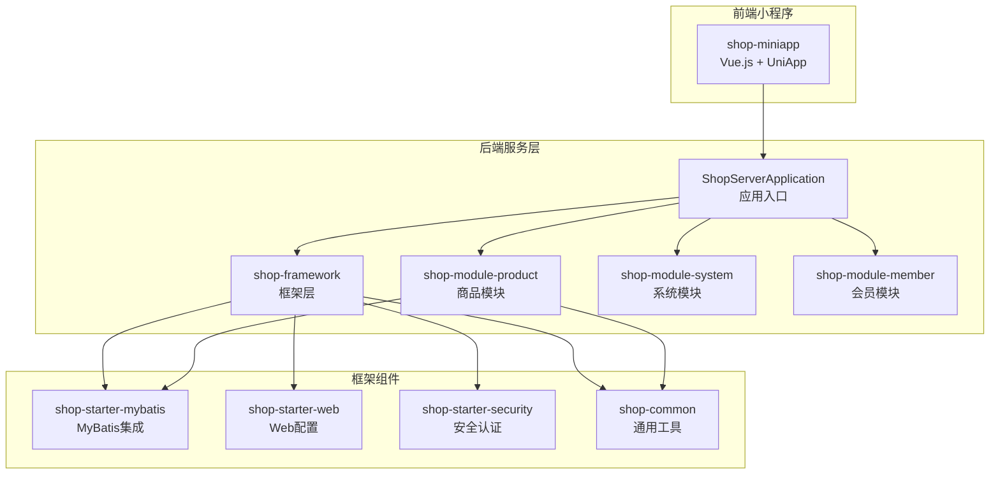
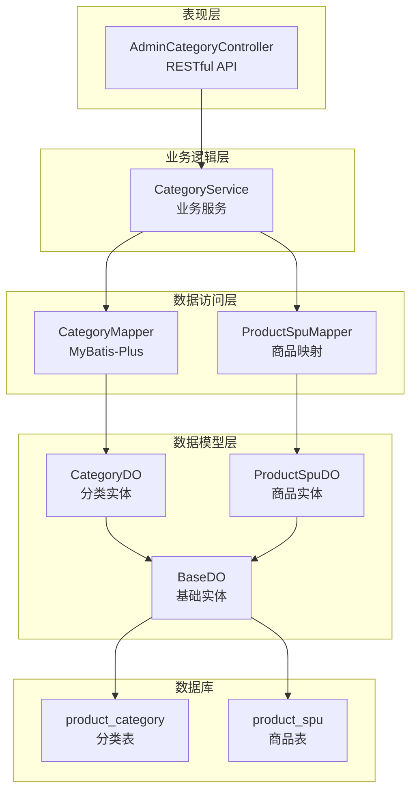
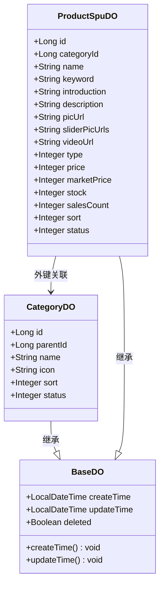
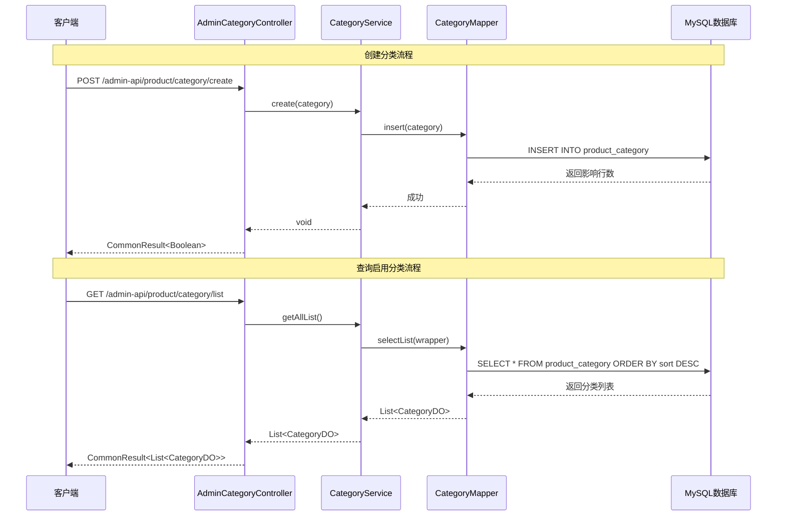
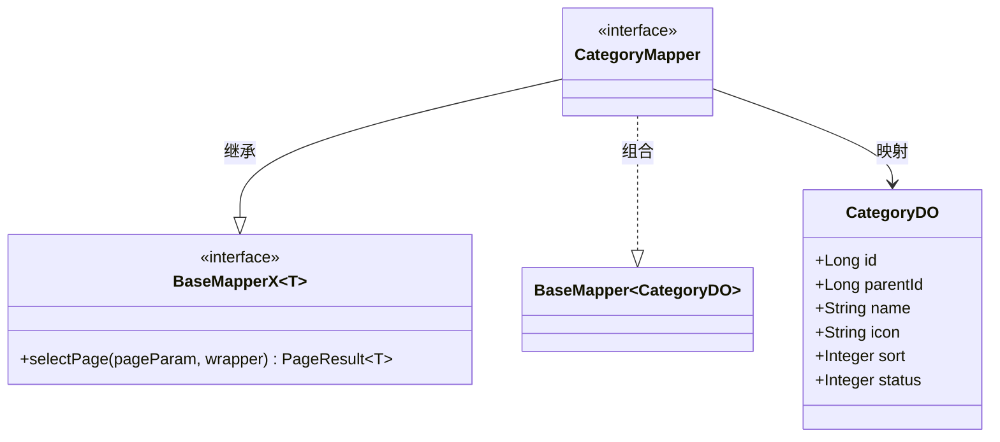
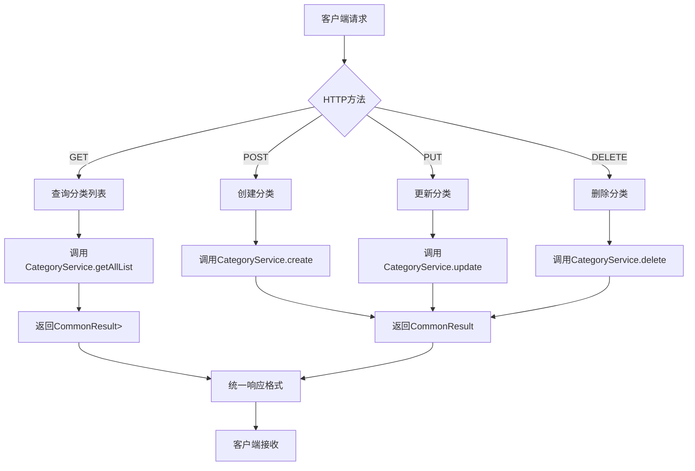
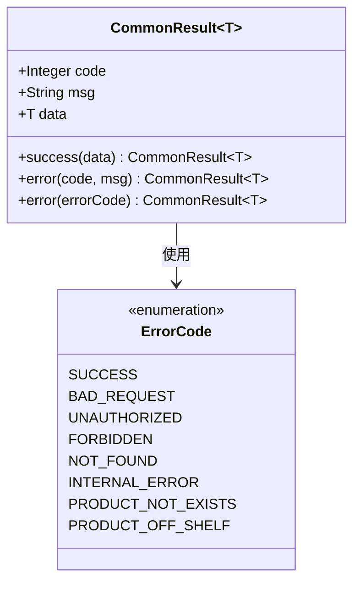
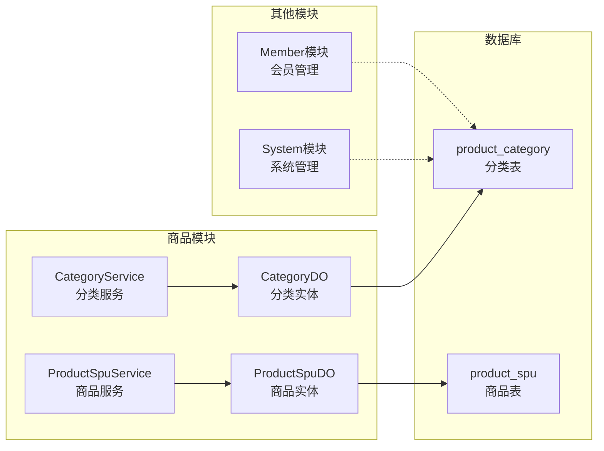
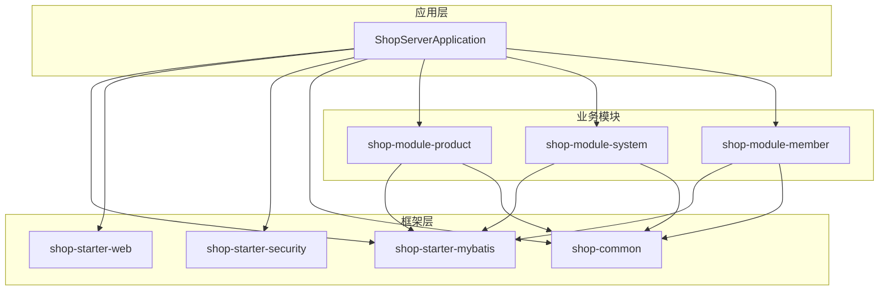

# 商品分类管理

<cite>
**本文档引用的文件**
- [CategoryService.java](file://shop-backend/shop-module-product/src/main/java/com/shop/module/product/service/CategoryService.java)
- [CategoryDO.java](file://shop-backend/shop-module-product/src/main/java/com/shop/module/product/dal/dataobject/CategoryDO.java)
- [CategoryMapper.java](file://shop-backend/shop-module-product/src/main/java/com/shop/module/product/dal/mysql/CategoryMapper.java)
- [AdminCategoryController.java](file://shop-backend/shop-module-product/src/main/java/com/shop/module/product/controller/admin/AdminCategoryController.java)
- [BaseDO.java](file://shop-backend/shop-framework/shop-starter-mybatis/src/main/java/com/shop/framework/mybatis/core/BaseDO.java)
- [BaseMapperX.java](file://shop-backend/shop-framework/shop-starter-mybatis/src/main/java/com/shop/framework/mybatis/core/BaseMapperX.java)
- [CommonResult.java](file://shop-backend/shop-framework/shop-common/src/main/java/com/shop/common/pojo/CommonResult.java)
- [ErrorCode.java](file://shop-backend/shop-framework/shop-common/src/main/java/com/shop/common/exception/ErrorCode.java)
- [init.sql](file://sql/init.sql)
- [ProductSpuService.java](file://shop-backend/shop-module-product/src/main/java/com/shop/module/product/service/ProductSpuService.java)
- [ProductSpuDO.java](file://shop-backend/shop-module-product/src/main/java/com/shop/module/product/dal/dataobject/ProductSpuDO.java)
</cite>

## 目录
1. [引言](#引言)
2. [项目结构](#项目结构)
3. [核心组件](#核心组件)
4. [架构概览](#架构概览)
5. [详细组件分析](#详细组件分析)
6. [依赖分析](#依赖分析)
7. [性能考虑](#性能考虑)
8. [故障排除指南](#故障排除指南)
9. [结论](#结论)

## 引言

本项目是一个基于Spring Boot的微信小程序商城系统，采用多模块架构设计。本文档专注于商品分类管理功能的技术实现，深入分析了从数据模型到控制层的完整技术栈，包括启用状态的商品分类查询、全部分类列表获取、分类的创建、更新和删除操作。

该系统采用了现代化的企业级开发模式，通过MyBatis-Plus简化数据访问层开发，结合Lombok提升代码可读性，通过统一的响应封装提供标准化的API输出格式。

## 项目结构

项目采用模块化架构，主要包含以下核心模块：

**图表来源**
- [ShopServerApplication.java](file://shop-backend/shop-server/src/main/java/com/shop/server/ShopServerApplication.java)
- [shop-framework](file://shop-backend/shop-framework/)
- [shop-module-product](file://shop-backend/shop-module-product/)

**章节来源**
- [ShopServerApplication.java](file://shop-backend/shop-server/src/main/java/com/shop/server/ShopServerApplication.java)
- [shop-framework](file://shop-backend/shop-framework/)

## 核心组件

### 数据模型层

商品分类管理功能的核心数据模型是`CategoryDO`，它继承自框架提供的基础实体类，具备通用的时间戳和逻辑删除字段。

### 服务层

`CategoryService`提供了完整的分类管理业务逻辑，包括：
- 启用状态分类查询
- 全部分类列表获取
- 分类的增删改查操作

### 数据访问层

`CategoryMapper`基于MyBatis-Plus的`BaseMapperX`接口，提供了标准的数据访问方法。

### 控制器层

`AdminCategoryController`实现了RESTful API接口，为后台管理系统提供分类管理功能。

**章节来源**
- [CategoryService.java:1-40](file://shop-backend/shop-module-product/src/main/java/com/shop/module/product/service/CategoryService.java#L1-40)
- [CategoryDO.java:1-23](file://shop-backend/shop-module-product/src/main/java/com/shop/module/product/dal/dataobject/CategoryDO.java#L1-23)
- [CategoryMapper.java:1-10](file://shop-backend/shop-module-product/src/main/java/com/shop/module/product/dal/mysql/CategoryMapper.java#L1-10)

## 架构概览

系统采用经典的三层架构设计，各层职责清晰分离：

**图表来源**
- [AdminCategoryController.java:1-41](file://shop-backend/shop-module-product/src/main/java/com/shop/module/product/controller/admin/AdminCategoryController.java#L1-41)
- [CategoryService.java:1-40](file://shop-backend/shop-module-product/src/main/java/com/shop/module/product/service/CategoryService.java#L1-40)
- [CategoryMapper.java:1-10](file://shop-backend/shop-module-product/src/main/java/com/shop/module/product/dal/mysql/CategoryMapper.java#L1-10)
- [CategoryDO.java:1-23](file://shop-backend/shop-module-product/src/main/java/com/shop/module/product/dal/dataobject/CategoryDO.java#L1-23)

## 详细组件分析

### CategoryDO 数据对象设计

`CategoryDO`是商品分类的核心数据模型，采用继承机制复用框架提供的通用功能：

**图表来源**
- [CategoryDO.java:1-23](file://shop-backend/shop-module-product/src/main/java/com/shop/module/product/dal/dataobject/CategoryDO.java#L1-23)
- [BaseDO.java:1-23](file://shop-backend/shop-framework/shop-starter-mybatis/src/main/java/com/shop/framework/mybatis/core/BaseDO.java#L1-23)
- [ProductSpuDO.java:1-33](file://shop-backend/shop-module-product/src/main/java/com/shop/module/product/dal/dataobject/ProductSpuDO.java#L1-33)

#### 字段定义与业务含义

| 字段名 | 类型 | 约束 | 业务含义 | 默认值 |
|--------|------|------|----------|--------|
| id | Long | 主键, 自增 | 分类唯一标识 | - |
| parentId | Long | 非空, 默认0 | 父分类ID, 0表示一级分类 | 0 |
| name | String | 非空, 最大64字符 | 分类名称 | - |
| icon | String | 最大512字符 | 分类图标URL | 空字符串 |
| sort | Integer | 非空, 默认0 | 排序权重, 数值越大越靠前 | 0 |
| status | Integer | 非空, 默认1 | 分类状态, 1=启用 0=禁用 | 1 |

#### 数据约束与验证

- **逻辑删除**: 通过继承`BaseDO`获得`deleted`字段，支持软删除
- **时间戳**: 自动维护创建和更新时间
- **索引策略**: 
  - 主键索引: `PRIMARY KEY (id)`
  - 索引: `parent_id`用于树形结构查询优化

**章节来源**
- [CategoryDO.java:14-22](file://shop-backend/shop-module-product/src/main/java/com/shop/module/product/dal/dataobject/CategoryDO.java#L14-L22)
- [BaseDO.java:12-22](file://shop-backend/shop-framework/shop-starter-mybatis/src/main/java/com/shop/framework/mybatis/core/BaseDO.java#L12-L22)
- [init.sql:28-39](file://sql/init.sql#L28-L39)

### CategoryService 服务层实现

`CategoryService`提供了完整的分类管理业务逻辑，采用简洁的实现方式：

**图表来源**
- [AdminCategoryController.java:18-21](file://shop-backend/shop-module-product/src/main/java/com/shop/module/product/controller/admin/AdminCategoryController.java#L18-L21)
- [CategoryService.java:17-26](file://shop-backend/shop-module-product/src/main/java/com/shop/module/product/service/CategoryService.java#L17-L26)
- [CategoryMapper.java](file://shop-backend/shop-module-product/src/main/java/com/shop/module/product/dal/mysql/CategoryMapper.java#L8)

#### 核心业务方法分析

**启用状态分类查询** (`getEnabledList`)
- 功能: 获取所有状态为启用的分类
- 实现: 使用LambdaQueryWrapper过滤`status = 1`
- 排序: 按`sort`字段降序排列

**全部分类列表获取** (`getAllList`)
- 功能: 获取所有分类（包含禁用状态）
- 实现: 直接按`sort`字段降序排列
- 应用场景: 后台管理界面显示所有分类

**分类创建** (`create`)
- 功能: 新增分类记录
- 实现: 直接调用`insert`方法
- 特点: 由框架自动填充时间戳和逻辑删除字段

**分类更新** (`update`)
- 功能: 更新现有分类信息
- 实现: 使用`updateById`方法
- 特点: 支持部分字段更新

**分类删除** (`delete`)
- 功能: 删除指定ID的分类
- 实现: 使用`deleteById`方法
- 特点: 支持软删除（通过逻辑删除字段）

**章节来源**
- [CategoryService.java:17-38](file://shop-backend/shop-module-product/src/main/java/com/shop/module/product/service/CategoryService.java#L17-L38)

### CategoryMapper 数据访问层

`CategoryMapper`基于MyBatis-Plus的`BaseMapperX`接口，提供了标准的数据访问能力：

**图表来源**
- [BaseMapperX.java:9-15](file://shop-backend/shop-framework/shop-starter-mybatis/src/main/java/com/shop/framework/mybatis/core/BaseMapperX.java#L9-L15)
- [CategoryMapper.java](file://shop-backend/shop-module-product/src/main/java/com/shop/module/product/dal/mysql/CategoryMapper.java#L8)

#### MyBatis-Plus 实现特点

- **泛型支持**: 通过泛型参数确保类型安全
- **分页支持**: 继承`BaseMapperX`获得分页查询能力
- **简化配置**: 减少XML配置文件，提高开发效率

**章节来源**
- [CategoryMapper.java:1-10](file://shop-backend/shop-module-product/src/main/java/com/shop/module/product/dal/mysql/CategoryMapper.java#L1-L10)
- [BaseMapperX.java:1-16](file://shop-backend/shop-framework/shop-starter-mybatis/src/main/java/com/shop/framework/mybatis/core/BaseMapperX.java#L1-L16)

### AdminCategoryController 控制器层

`AdminCategoryController`实现了RESTful API规范，提供完整的分类管理接口：

**图表来源**
- [AdminCategoryController.java:18-39](file://shop-backend/shop-module-product/src/main/java/com/shop/module/product/controller/admin/AdminCategoryController.java#L18-L39)

#### API 接口规范

| 方法 | 路径 | 请求体 | 响应体 | 描述 |
|------|------|--------|--------|------|
| GET | `/admin-api/product/category/list` | 无 | `CommonResult<List<CategoryDO>>` | 获取全部分类列表 |
| POST | `/admin-api/product/category/create` | `CategoryDO` | `CommonResult<Boolean>` | 创建新分类 |
| PUT | `/admin-api/product/category/update` | `CategoryDO` | `CommonResult<Boolean>` | 更新分类信息 |
| DELETE | `/admin-api/product/category/delete` | `id: Long` | `CommonResult<Boolean>` | 删除分类 |

#### 统一响应封装

系统采用`CommonResult`统一包装所有API响应：

**图表来源**
- [CommonResult.java:8-33](file://shop-backend/shop-framework/shop-common/src/main/java/com/shop/common/pojo/CommonResult.java#L8-L33)
- [ErrorCode.java:8-25](file://shop-backend/shop-framework/shop-common/src/main/java/com/shop/common/exception/ErrorCode.java#L8-L25)

**章节来源**
- [AdminCategoryController.java:1-41](file://shop-backend/shop-module-product/src/main/java/com/shop/module/product/controller/admin/AdminCategoryController.java#L1-L41)
- [CommonResult.java:1-34](file://shop-backend/shop-framework/shop-common/src/main/java/com/shop/common/pojo/CommonResult.java#L1-L34)
- [ErrorCode.java:1-26](file://shop-backend/shop-framework/shop-common/src/main/java/com/shop/common/exception/ErrorCode.java#L1-L26)

### 与其他模块的交互关系

商品分类管理功能与商品模块存在紧密的关联关系：

**图表来源**
- [ProductSpuService.java:19-25](file://shop-backend/shop-module-product/src/main/java/com/shop/module/product/service/ProductSpuService.java#L19-L25)
- [ProductSpuDO.java](file://shop-backend/shop-module-product/src/main/java/com/shop/module/product/dal/dataobject/ProductSpuDO.java#L17)

#### 分类与商品的关联

- **外键关系**: `ProductSpuDO.categoryId` 引用 `CategoryDO.id`
- **查询优化**: 在商品查询时可按分类ID进行过滤
- **业务一致性**: 删除分类前需要处理关联的商品数据

**章节来源**
- [ProductSpuService.java:19-25](file://shop-backend/shop-module-product/src/main/java/com/shop/module/product/service/ProductSpuService.java#L19-L25)
- [ProductSpuDO.java](file://shop-backend/shop-module-product/src/main/java/com/shop/module/product/dal/dataobject/ProductSpuDO.java#L17)

## 依赖分析

系统采用模块化设计，各模块间依赖关系清晰：

**图表来源**
- [ShopServerApplication.java](file://shop-backend/shop-server/src/main/java/com/shop/server/ShopServerApplication.java)
- [shop-framework](file://shop-backend/shop-framework/)

### 关键依赖关系

1. **框架依赖**: 所有业务模块都依赖框架层提供的基础设施
2. **模块内聚**: 商品模块内部功能高度内聚，职责明确
3. **解耦设计**: 通过接口抽象实现模块间的松耦合

**章节来源**
- [shop-framework](file://shop-backend/shop-framework/)
- [shop-module-product](file://shop-backend/shop-module-product/)

## 性能考虑

### 数据库优化策略

1. **索引设计**
   - 分类表主键索引优化查询性能
   - 排序字段索引支持高效排序
   - 状态字段索引支持快速筛选

2. **查询优化**
   - 使用Lambda表达式避免硬编码字符串
   - 合理使用排序规则减少内存排序开销
   - 分页查询避免一次性加载大量数据

3. **缓存策略**
   - 分类数据相对稳定，适合缓存
   - 变更时及时失效缓存
   - 考虑使用Redis等分布式缓存

### 代码性能优化

1. **批量操作**: 对于大量数据操作考虑批量处理
2. **连接池配置**: 合理配置数据库连接池参数
3. **事务管理**: 合理使用事务边界，避免长时间持有锁

## 故障排除指南

### 常见问题及解决方案

**1. 分类查询结果为空**
- 检查数据库中是否存在有效分类数据
- 验证`status`字段是否正确设置
- 确认排序字段是否有合理值

**2. 分类创建失败**
- 检查必填字段是否完整
- 验证数据库连接配置
- 查看日志中的具体错误信息

**3. API响应格式异常**
- 确认`CommonResult`封装逻辑正确
- 检查异常处理器配置
- 验证序列化配置

**章节来源**
- [ErrorCode.java:8-25](file://shop-backend/shop-framework/shop-common/src/main/java/com/shop/common/exception/ErrorCode.java#L8-L25)
- [CommonResult.java:15-32](file://shop-backend/shop-framework/shop-common/src/main/java/com/shop/common/pojo/CommonResult.java#L15-L32)

## 结论

商品分类管理功能展现了现代Java企业级应用的良好实践：

1. **架构清晰**: 采用分层架构，职责分明，易于维护
2. **代码简洁**: 使用Lombok和MyBatis-Plus简化开发
3. **扩展性强**: 模块化设计便于功能扩展
4. **性能优化**: 合理的数据库设计和查询策略

该实现为后续的功能扩展奠定了良好的基础，包括分类树形展示、权限控制、缓存优化等功能都可以在此基础上进行增强。