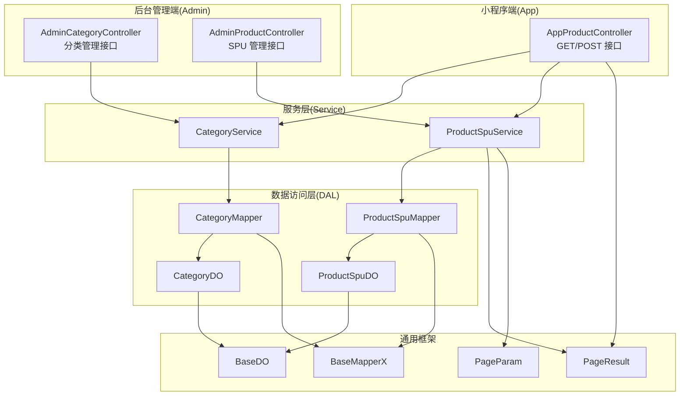
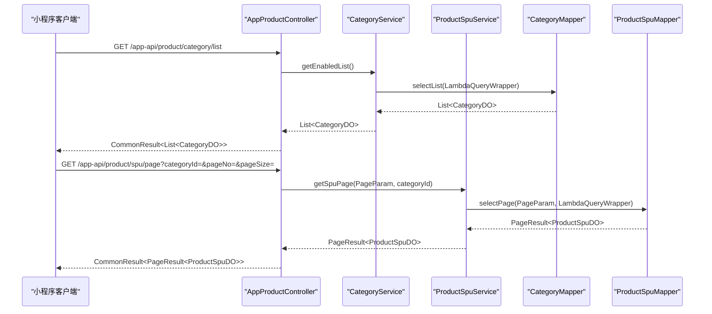
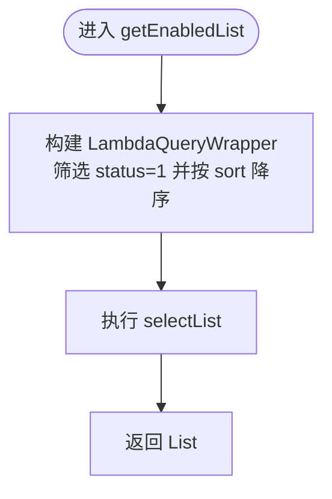
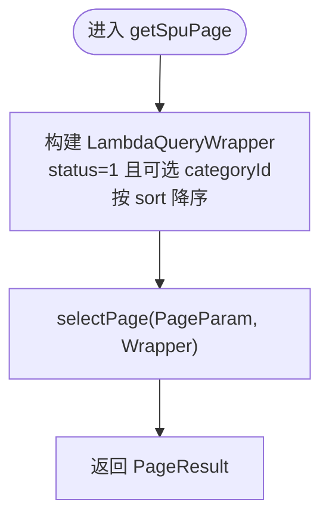
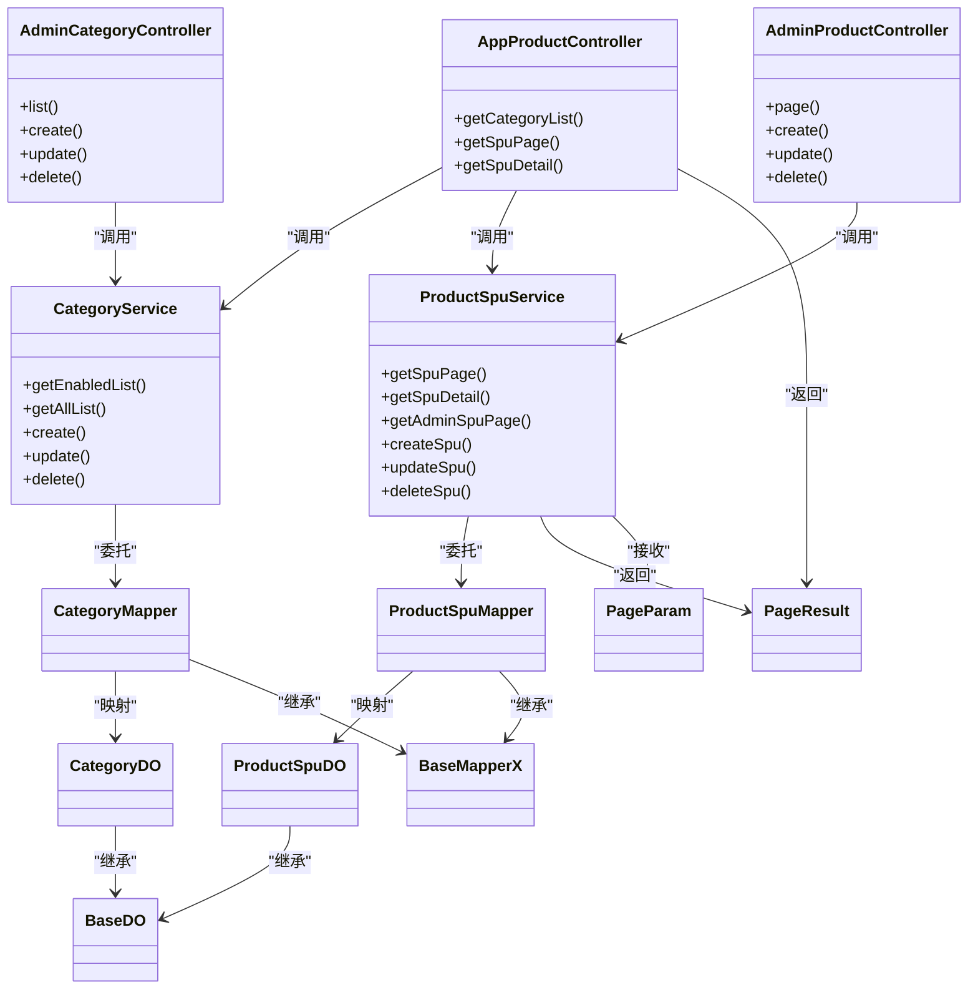
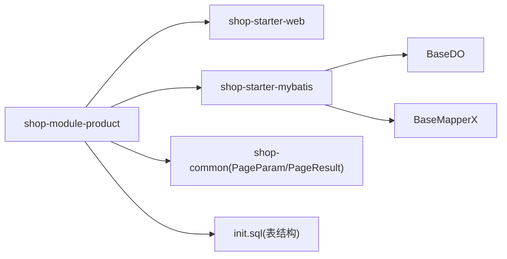

# 商品模块 (shop-module-product)

<cite>
**本文引用的文件**
- [CategoryService.java](file://shop-backend/shop-module-product/src/main/java/com/shop/module/product/service/CategoryService.java)
- [ProductSpuService.java](file://shop-backend/shop-module-product/src/main/java/com/shop/module/product/service/ProductSpuService.java)
- [CategoryDO.java](file://shop-backend/shop-module-product/src/main/java/com/shop/module/product/dal/dataobject/CategoryDO.java)
- [ProductSpuDO.java](file://shop-backend/shop-module-product/src/main/java/com/shop/module/product/dal/dataobject/ProductSpuDO.java)
- [CategoryMapper.java](file://shop-backend/shop-module-product/src/main/java/com/shop/module/product/dal/mysql/CategoryMapper.java)
- [ProductSpuMapper.java](file://shop-backend/shop-module-product/src/main/java/com/shop/module/product/dal/mysql/ProductSpuMapper.java)
- [AdminCategoryController.java](file://shop-backend/shop-module-product/src/main/java/com/shop/module/product/controller/admin/AdminCategoryController.java)
- [AdminProductController.java](file://shop-backend/shop-module-product/src/main/java/com/shop/module/product/controller/admin/AdminProductController.java)
- [AppProductController.java](file://shop-backend/shop-module-product/src/main/java/com/shop/module/product/controller/app/AppProductController.java)
- [BaseDO.java](file://shop-backend/shop-framework/shop-starter-mybatis/src/main/java/com/shop/framework/mybatis/core/BaseDO.java)
- [BaseMapperX.java](file://shop-backend/shop-framework/shop-starter-mybatis/src/main/java/com/shop/framework/mybatis/core/BaseMapperX.java)
- [PageParam.java](file://shop-backend/shop-framework/shop-common/src/main/java/com/shop/common/pojo/PageParam.java)
- [PageResult.java](file://shop-backend/shop-framework/shop-common/src/main/java/com/shop/common/pojo/PageResult.java)
- [init.sql](file://sql/init.sql)
- [pom.xml](file://shop-backend/shop-module-product/pom.xml)
</cite>

## 目录
1. [引言](#引言)
2. [项目结构](#项目结构)
3. [核心组件](#核心组件)
4. [架构总览](#架构总览)
5. [详细组件分析](#详细组件分析)
6. [依赖分析](#依赖分析)
7. [性能考虑](#性能考虑)
8. [故障排查指南](#故障排查指南)
9. [结论](#结论)
10. [附录](#附录)

## 引言
本设计文档聚焦于商品模块（shop-module-product），系统性阐述其分层架构与核心业务逻辑，重点覆盖以下方面：
- 商品分类管理：通过 CategoryService 提供分类的启用列表查询、全量列表查询、新增、修改与删除能力。
- SPU 商品管理：通过 ProductSpuService 提供分页查询、详情查询、后台管理分页、新增、修改与删除能力，并内置基础业务规则（如上架状态过滤、排序等）。
- 分层架构：从 Controller 到 Service 再到 Mapper 的清晰数据流；基于 MyBatis-Plus 的通用 Mapper 封装，统一分页返回格式。
- 数据模型：CategoryDO 与 ProductSpuDO 的字段设计与业务含义，以及与数据库表结构的映射关系。
- 交互场景：面向小程序前端的 App 接口与面向后台管理的 Admin 接口，以及与公共框架模块的集成。

## 项目结构
商品模块采用标准的三层分层组织：
- controller 层：对外暴露 REST 接口，分别面向小程序端（app）与后台管理端（admin）
- service 层：封装业务规则与流程控制，协调数据访问
- dal 层：包含数据对象（DO）与数据访问接口（Mapper），继承自通用基类
- 依赖框架：shop-starter-web、shop-starter-mybatis、shop-common

**图表来源**
- [AppProductController.java:1-39](file://shop-backend/shop-module-product/src/main/java/com/shop/module/product/controller/app/AppProductController.java#L1-L39)
- [AdminCategoryController.java:1-41](file://shop-backend/shop-module-product/src/main/java/com/shop/module/product/controller/admin/AdminCategoryController.java#L1-L41)
- [AdminProductController.java:1-41](file://shop-backend/shop-module-product/src/main/java/com/shop/module/product/controller/admin/AdminProductController.java#L1-L41)
- [CategoryService.java:1-40](file://shop-backend/shop-module-product/src/main/java/com/shop/module/product/service/CategoryService.java#L1-L40)
- [ProductSpuService.java:1-53](file://shop-backend/shop-module-product/src/main/java/com/shop/module/product/service/ProductSpuService.java#L1-L53)
- [CategoryMapper.java:1-10](file://shop-backend/shop-module-product/src/main/java/com/shop/module/product/dal/mysql/CategoryMapper.java#L1-L10)
- [ProductSpuMapper.java:1-10](file://shop-backend/shop-module-product/src/main/java/com/shop/module/product/dal/mysql/ProductSpuMapper.java#L1-L10)
- [CategoryDO.java:1-23](file://shop-backend/shop-module-product/src/main/java/com/shop/module/product/dal/dataobject/CategoryDO.java#L1-L23)
- [ProductSpuDO.java:1-33](file://shop-backend/shop-module-product/src/main/java/com/shop/module/product/dal/dataobject/ProductSpuDO.java#L1-L33)
- [BaseDO.java:1-23](file://shop-backend/shop-framework/shop-starter-mybatis/src/main/java/com/shop/framework/mybatis/core/BaseDO.java#L1-L23)
- [BaseMapperX.java:1-16](file://shop-backend/shop-framework/shop-starter-mybatis/src/main/java/com/shop/framework/mybatis/core/BaseMapperX.java#L1-L16)
- [PageParam.java:1-12](file://shop-backend/shop-framework/shop-common/src/main/java/com/shop/common/pojo/PageParam.java#L1-L12)
- [PageResult.java:1-18](file://shop-backend/shop-framework/shop-common/src/main/java/com/shop/common/pojo/PageResult.java#L1-L18)

**章节来源**
- [pom.xml:1-25](file://shop-backend/shop-module-product/pom.xml#L1-L25)

## 核心组件
- 控制器层
  - AppProductController：提供小程序端的分类列表、SPU 分页与详情查询接口
  - AdminCategoryController：提供后台分类的列表、新增、修改、删除接口
  - AdminProductController：提供后台 SPU 的分页、新增、修改、删除接口
- 服务层
  - CategoryService：封装分类的查询与 CRUD 操作
  - ProductSpuService：封装 SPU 的分页、详情、后台分页与 CRUD 操作，并内置状态与排序规则
- 数据访问层
  - CategoryMapper、ProductSpuMapper：继承通用 BaseMapperX，提供分页查询能力
  - CategoryDO、ProductSpuDO：继承 BaseDO，自动填充时间与逻辑删除字段

**章节来源**
- [AppProductController.java:1-39](file://shop-backend/shop-module-product/src/main/java/com/shop/module/product/controller/app/AppProductController.java#L1-L39)
- [AdminCategoryController.java:1-41](file://shop-backend/shop-module-product/src/main/java/com/shop/module/product/controller/admin/AdminCategoryController.java#L1-L41)
- [AdminProductController.java:1-41](file://shop-backend/shop-module-product/src/main/java/com/shop/module/product/controller/admin/AdminProductController.java#L1-L41)
- [CategoryService.java:1-40](file://shop-backend/shop-module-product/src/main/java/com/shop/module/product/service/CategoryService.java#L1-L40)
- [ProductSpuService.java:1-53](file://shop-backend/shop-module-product/src/main/java/com/shop/module/product/service/ProductSpuService.java#L1-L53)
- [CategoryMapper.java:1-10](file://shop-backend/shop-module-product/src/main/java/com/shop/module/product/dal/mysql/CategoryMapper.java#L1-L10)
- [ProductSpuMapper.java:1-10](file://shop-backend/shop-module-product/src/main/java/com/shop/module/product/dal/mysql/ProductSpuMapper.java#L1-L10)
- [CategoryDO.java:1-23](file://shop-backend/shop-module-product/src/main/java/com/shop/module/product/dal/dataobject/CategoryDO.java#L1-L23)
- [ProductSpuDO.java:1-33](file://shop-backend/shop-module-product/src/main/java/com/shop/module/product/dal/dataobject/ProductSpuDO.java#L1-L33)
- [BaseDO.java:1-23](file://shop-backend/shop-framework/shop-starter-mybatis/src/main/java/com/shop/framework/mybatis/core/BaseDO.java#L1-L23)
- [BaseMapperX.java:1-16](file://shop-backend/shop-framework/shop-starter-mybatis/src/main/java/com/shop/framework/mybatis/core/BaseMapperX.java#L1-L16)
- [PageParam.java:1-12](file://shop-backend/shop-framework/shop-common/src/main/java/com/shop/common/pojo/PageParam.java#L1-L12)
- [PageResult.java:1-18](file://shop-backend/shop-framework/shop-common/src/main/java/com/shop/common/pojo/PageResult.java#L1-L18)

## 架构总览
商品模块遵循“Controller → Service → Mapper”的分层调用链，统一通过 PageParam/ PageResult 进行分页参数与结果封装，使用 MyBatis-Plus 的 Lambda 条件构造器进行查询条件拼装，确保代码简洁与可维护性。

**图表来源**
- [AppProductController.java:23-32](file://shop-backend/shop-module-product/src/main/java/com/shop/module/product/controller/app/AppProductController.java#L23-L32)
- [CategoryService.java:17-26](file://shop-backend/shop-module-product/src/main/java/com/shop/module/product/service/CategoryService.java#L17-L26)
- [ProductSpuService.java:19-25](file://shop-backend/shop-module-product/src/main/java/com/shop/module/product/service/ProductSpuService.java#L19-L25)
- [CategoryMapper.java:1-10](file://shop-backend/shop-module-product/src/main/java/com/shop/module/product/dal/mysql/CategoryMapper.java#L1-L10)
- [ProductSpuMapper.java:1-10](file://shop-backend/shop-module-product/src/main/java/com/shop/module/product/dal/mysql/ProductSpuMapper.java#L1-L10)

## 详细组件分析

### 商品分类管理（CategoryService）
- 查询能力
  - 启用列表：按 sort 降序返回 status=1 的分类
  - 全量列表：按 sort 降序返回全部分类
- 变更能力
  - 新增、修改、删除：直接委托给 CategoryMapper 执行
- 业务要点
  - 分类状态字段用于前台展示控制
  - 排序字段支持灵活的前台展示顺序

**图表来源**
- [CategoryService.java:17-21](file://shop-backend/shop-module-product/src/main/java/com/shop/module/product/service/CategoryService.java#L17-L21)

**章节来源**
- [CategoryService.java:1-40](file://shop-backend/shop-module-product/src/main/java/com/shop/module/product/service/CategoryService.java#L1-L40)

### SPU 商品管理（ProductSpuService）
- 查询能力
  - 前台分页：按 status=1 与 categoryId 过滤，按 sort 降序分页
  - 详情查询：根据 id 查询，不存在时抛出业务异常
  - 后台分页：按 createTime 降序分页
- 变更能力
  - 新增、修改、删除：委托给 ProductSpuMapper
- 业务规则
  - 上架状态过滤：前台查询默认仅返回 status=1 的商品
  - 排序优先级：sort 字段优先，其次按创建时间倒序

**图表来源**
- [ProductSpuService.java:19-25](file://shop-backend/shop-module-product/src/main/java/com/shop/module/product/service/ProductSpuService.java#L19-L25)

**章节来源**
- [ProductSpuService.java:1-53](file://shop-backend/shop-module-product/src/main/java/com/shop/module/product/service/ProductSpuService.java#L1-L53)

### 数据模型设计（CategoryDO 与 ProductSpuDO）

#### CategoryDO 设计思路
- 继承 BaseDO：自动具备 createTime、updateTime、deleted 字段
- 字段说明
  - id：主键
  - parentId：父分类 ID，0 表示一级分类
  - name/icon/sort/status：分类名称、图标、排序值、状态
- 映射关系：对应数据库 product_category 表

**章节来源**
- [CategoryDO.java:1-23](file://shop-backend/shop-module-product/src/main/java/com/shop/module/product/dal/dataobject/CategoryDO.java#L1-L23)
- [BaseDO.java:1-23](file://shop-backend/shop-framework/shop-starter-mybatis/src/main/java/com/shop/framework/mybatis/core/BaseDO.java#L1-L23)
- [init.sql:28-39](file://sql/init.sql#L28-L39)

#### ProductSpuDO 设计思路
- 继承 BaseDO：自动具备时间与逻辑删除字段
- 字段说明
  - 基础信息：categoryId、name、keyword、introduction、description、picUrl、sliderPicUrls、videoUrl
  - 类型与价格：type（实物/虚拟）、price（单位分）、marketPrice
  - 库存与销量：stock、salesCount
  - 排序与状态：sort、status（0=下架 1=上架）
- 映射关系：对应数据库 product_spu 表

**章节来源**
- [ProductSpuDO.java:1-33](file://shop-backend/shop-module-product/src/main/java/com/shop/module/product/dal/dataobject/ProductSpuDO.java#L1-L33)
- [BaseDO.java:1-23](file://shop-backend/shop-framework/shop-starter-mybatis/src/main/java/com/shop/framework/mybatis/core/BaseDO.java#L1-L23)
- [init.sql:41-64](file://sql/init.sql#L41-L64)

### 分层架构与数据流向
- Controller 层
  - AppProductController：负责小程序端请求入口，调用 CategoryService 与 ProductSpuService
  - AdminCategoryController/AdminProductController：负责后台管理请求入口，调用对应 Service
- Service 层
  - 业务编排：组装查询条件、处理业务规则（如状态过滤、排序）、异常处理
- Mapper 层
  - 委托执行：基于 BaseMapperX 的 selectPage 能力，统一返回 PageResult

**图表来源**
- [AppProductController.java:1-39](file://shop-backend/shop-module-product/src/main/java/com/shop/module/product/controller/app/AppProductController.java#L1-L39)
- [AdminCategoryController.java:1-41](file://shop-backend/shop-module-product/src/main/java/com/shop/module/product/controller/admin/AdminCategoryController.java#L1-L41)
- [AdminProductController.java:1-41](file://shop-backend/shop-module-product/src/main/java/com/shop/module/product/controller/admin/AdminProductController.java#L1-L41)
- [CategoryService.java:1-40](file://shop-backend/shop-module-product/src/main/java/com/shop/module/product/service/CategoryService.java#L1-L40)
- [ProductSpuService.java:1-53](file://shop-backend/shop-module-product/src/main/java/com/shop/module/product/service/ProductSpuService.java#L1-L53)
- [CategoryMapper.java:1-10](file://shop-backend/shop-module-product/src/main/java/com/shop/module/product/dal/mysql/CategoryMapper.java#L1-L10)
- [ProductSpuMapper.java:1-10](file://shop-backend/shop-module-product/src/main/java/com/shop/module/product/dal/mysql/ProductSpuMapper.java#L1-L10)
- [CategoryDO.java:1-23](file://shop-backend/shop-module-product/src/main/java/com/shop/module/product/dal/dataobject/CategoryDO.java#L1-L23)
- [ProductSpuDO.java:1-33](file://shop-backend/shop-module-product/src/main/java/com/shop/module/product/dal/dataobject/ProductSpuDO.java#L1-L33)
- [BaseDO.java:1-23](file://shop-backend/shop-framework/shop-starter-mybatis/src/main/java/com/shop/framework/mybatis/core/BaseDO.java#L1-L23)
- [BaseMapperX.java:1-16](file://shop-backend/shop-framework/shop-starter-mybatis/src/main/java/com/shop/framework/mybatis/core/BaseMapperX.java#L1-L16)
- [PageParam.java:1-12](file://shop-backend/shop-framework/shop-common/src/main/java/com/shop/common/pojo/PageParam.java#L1-L12)
- [PageResult.java:1-18](file://shop-backend/shop-framework/shop-common/src/main/java/com/shop/common/pojo/PageResult.java#L1-L18)

## 依赖分析
- 模块依赖
  - shop-module-product 依赖 shop-starter-web 与 shop-starter-mybatis
- 框架依赖
  - BaseDO 提供统一的时间与逻辑删除字段
  - BaseMapperX 提供 selectPage 的默认实现，统一 PageResult 返回
  - PageParam/ PageResult 作为分页参数与结果载体
- 数据库表
  - product_category 与 product_spu 表结构定义了字段约束与索引

**图表来源**
- [pom.xml:14-23](file://shop-backend/shop-module-product/pom.xml#L14-L23)
- [BaseDO.java:1-23](file://shop-backend/shop-framework/shop-starter-mybatis/src/main/java/com/shop/framework/mybatis/core/BaseDO.java#L1-L23)
- [BaseMapperX.java:1-16](file://shop-backend/shop-framework/shop-starter-mybatis/src/main/java/com/shop/framework/mybatis/core/BaseMapperX.java#L1-L16)
- [PageParam.java:1-12](file://shop-backend/shop-framework/shop-common/src/main/java/com/shop/common/pojo/PageParam.java#L1-L12)
- [PageResult.java:1-18](file://shop-backend/shop-framework/shop-common/src/main/java/com/shop/common/pojo/PageResult.java#L1-L18)
- [init.sql:28-64](file://sql/init.sql#L28-L64)

**章节来源**
- [pom.xml:1-25](file://shop-backend/shop-module-product/pom.xml#L1-L25)
- [init.sql:1-123](file://sql/init.sql#L1-L123)

## 性能考虑
- 查询优化
  - 使用 LambdaQueryWrapper 进行条件拼装，避免硬编码字符串
  - 对高频查询字段建立索引（如 product_spu 的 category_id、status）
- 分页策略
  - 通过 BaseMapperX 的 selectPage 统一分页实现，减少重复代码
  - 建议在大数据量场景下结合业务筛选条件，避免全表扫描
- 逻辑删除
  - 继承 BaseDO 的 deleted 字段，便于软删除与审计追踪

[本节为通用建议，不涉及具体文件分析]

## 故障排查指南
- 业务异常
  - ProductSpuService 在查询详情时若未找到记录会抛出业务异常，需检查 id 是否正确或是否存在逻辑删除
- 参数校验
  - PageParam 缺省 pageNo=1、pageSize=10，若传参异常需检查前端分页参数
- 排查步骤
  - 确认数据库中商品状态是否为上架（status=1）
  - 检查分类 id 是否有效
  - 核对 Mapper 层是否正确注入与 SQL 条件是否符合预期

**章节来源**
- [ProductSpuService.java:27-33](file://shop-backend/shop-module-product/src/main/java/com/shop/module/product/service/ProductSpuService.java#L27-L33)
- [PageParam.java:8-11](file://shop-backend/shop-framework/shop-common/src/main/java/com/shop/common/pojo/PageParam.java#L8-L11)

## 结论
商品模块以清晰的分层架构实现了商品分类与 SPU 商品的完整生命周期管理。通过统一的 DO/Mapper/Service/Controller 设计与框架基类，保证了代码的一致性与可扩展性。在微信小程序商城中，AppProductController 提供了面向前端的稳定接口，Admin 端控制器则满足后台运营需求。后续可在现有基础上扩展 SKU 管理、价格策略与营销活动等功能。

[本节为总结性内容，不涉及具体文件分析]

## 附录

### 接口一览（小程序端）
- 获取分类列表：GET /app-api/product/category/list
- SPU 分页：GET /app-api/product/spu/page?categoryId=&pageNo=&pageSize=
- SPU 详情：GET /app-api/product/spu/detail?id=

**章节来源**
- [AppProductController.java:23-37](file://shop-backend/shop-module-product/src/main/java/com/shop/module/product/controller/app/AppProductController.java#L23-L37)

### 接口一览（后台管理端）
- 分类管理
  - 列表：GET /admin-api/product/category/list
  - 新增：POST /admin-api/product/category/create
  - 修改：PUT /admin-api/product/category/update
  - 删除：DELETE /admin-api/product/category/delete?id=
- SPU 管理
  - 分页：GET /admin-api/product/spu/page
  - 新增：POST /admin-api/product/spu/create
  - 修改：PUT /admin-api/product/spu/update
  - 删除：DELETE /admin-api/product/spu/delete?id=

**章节来源**
- [AdminCategoryController.java:18-39](file://shop-backend/shop-module-product/src/main/java/com/shop/module/product/controller/admin/AdminCategoryController.java#L18-L39)
- [AdminProductController.java:18-39](file://shop-backend/shop-module-product/src/main/java/com/shop/module/product/controller/admin/AdminProductController.java#L18-L39)

### 数据模型与表结构对照
- CategoryDO ↔ product_category
  - 关键字段：id、parentId、name、icon、sort、status
- ProductSpuDO ↔ product_spu
  - 关键字段：id、categoryId、name、keyword、introduction、description、picUrl、sliderPicUrls、videoUrl、type、price、marketPrice、stock、salesCount、sort、status

**章节来源**
- [CategoryDO.java:13-22](file://shop-backend/shop-module-product/src/main/java/com/shop/module/product/dal/dataobject/CategoryDO.java#L13-L22)
- [ProductSpuDO.java:13-32](file://shop-backend/shop-module-product/src/main/java/com/shop/module/product/dal/dataobject/ProductSpuDO.java#L13-L32)
- [init.sql:28-64](file://sql/init.sql#L28-L64)