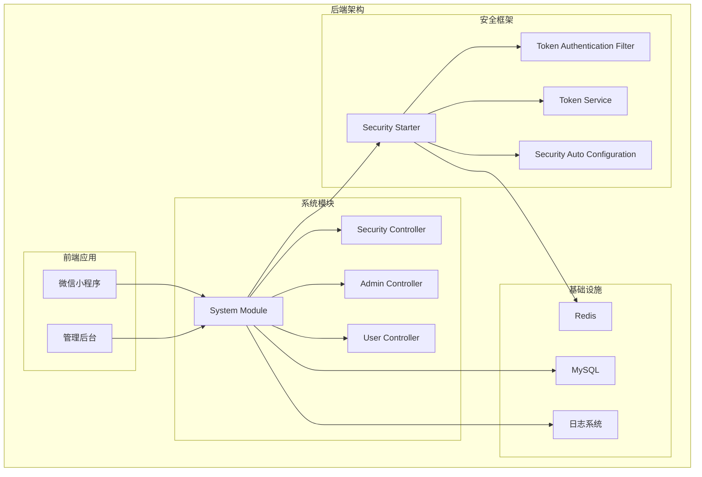
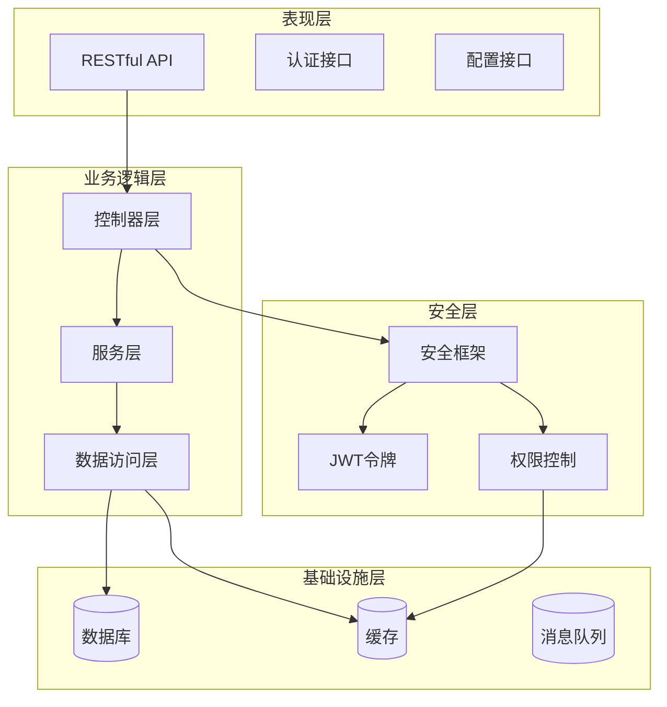
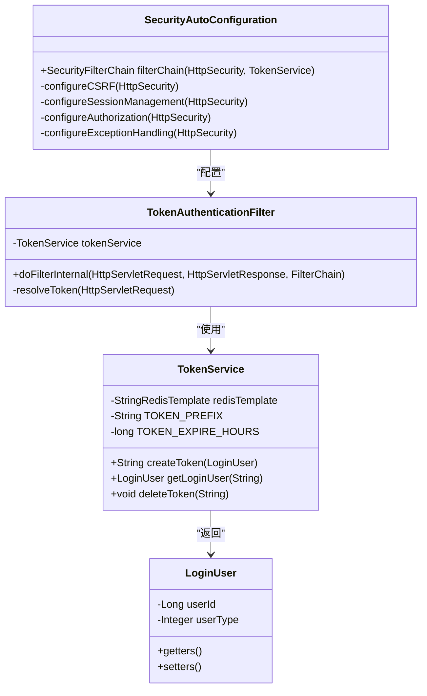
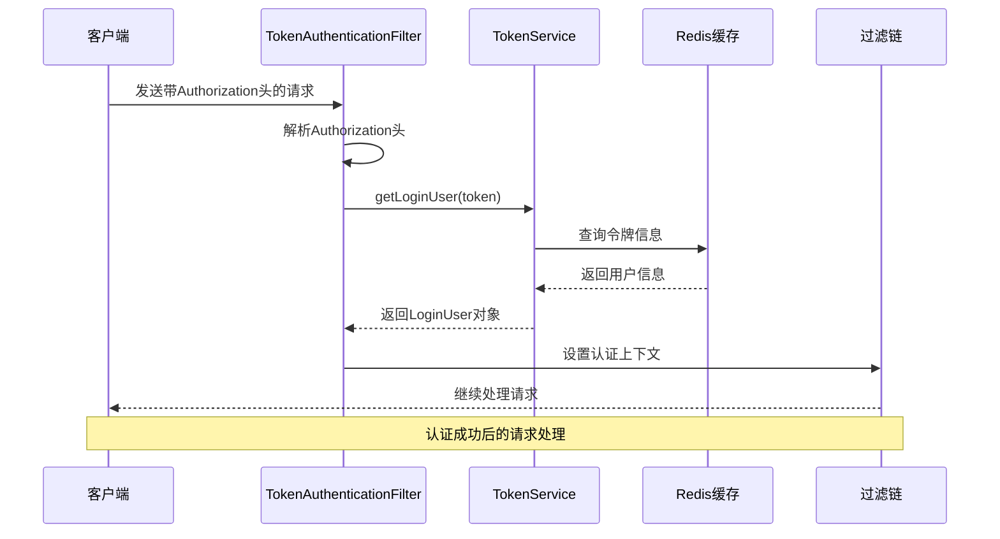
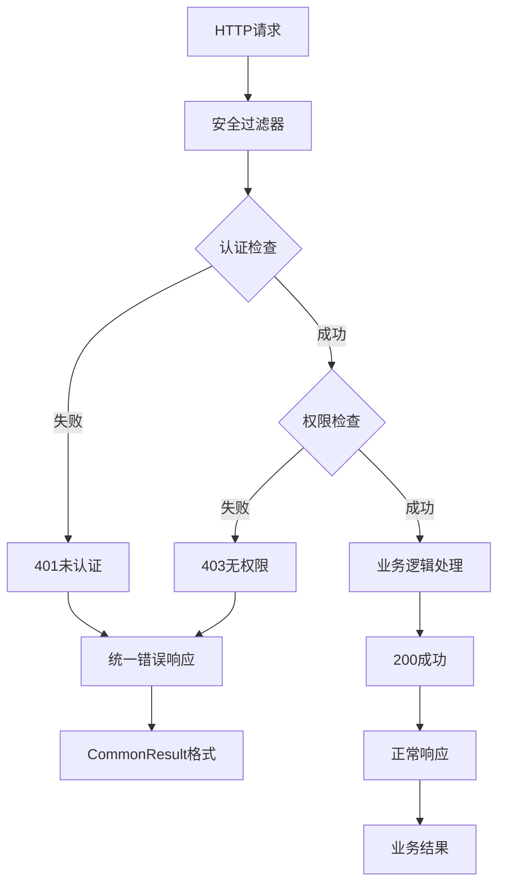
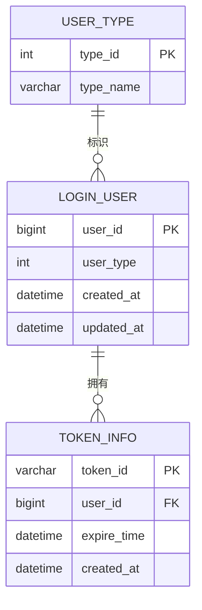
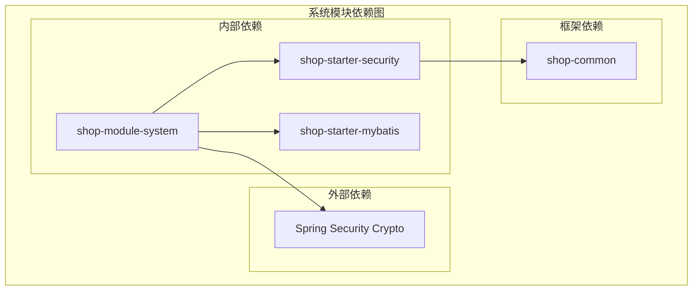

# 系统模块 (shop-module-system) 设计文档

<cite>
**本文档引用的文件**
- [pom.xml](file://shop-backend/shop-module-system/pom.xml)
- [SecurityAutoConfiguration.java](file://shop-backend/shop-framework/shop-starter-security/src/main/java/com/shop/framework/security/SecurityAutoConfiguration.java)
- [TokenAuthenticationFilter.java](file://shop-backend/shop-framework/shop-starter-security/src/main/java/com/shop/framework/security/TokenAuthenticationFilter.java)
- [TokenService.java](file://shop-backend/shop-framework/shop-starter-security/src/main/java/com/shop/framework/security/TokenService.java)
- [LoginUser.java](file://shop-backend/shop-framework/shop-starter-security/src/main/java/com/shop/framework/security/LoginUser.java)
- [CommonResult.java](file://shop-backend/shop-framework/shop-common/src/main/java/com/shop/common/pojo/CommonResult.java)
- [ErrorCode.java](file://shop-backend/shop-framework/shop-common/src/main/java/com/shop/common/exception/ErrorCode.java)
- [application.yml](file://shop-backend/shop-server/src/main/resources/application.yml)
- [application-dev.yml](file://shop-backend/shop-server/src/main/resources/application-dev.yml)
- [pom.xml](file://shop-backend/pom.xml)
</cite>

## 目录
1. [简介](#简介)
2. [项目结构](#项目结构)
3. [核心组件](#核心组件)
4. [架构概览](#架构概览)
5. [详细组件分析](#详细组件分析)
6. [依赖分析](#依赖分析)
7. [性能考虑](#性能考虑)
8. [故障排除指南](#故障排除指南)
9. [结论](#结论)
10. [附录](#附录)

## 简介

系统模块（shop-module-system）是药食同源微信小程序商城后端架构中的核心支撑模块，主要负责系统的安全管理、认证授权和基础配置管理。该模块采用微服务架构设计，通过Spring Boot框架构建，为整个商城系统提供统一的安全认证机制和权限控制能力。

系统模块的核心职责包括：
- 管理员登录认证与会话管理
- 系统级权限控制与访问授权
- 安全令牌的生成、验证与失效处理
- 统一的错误响应格式化
- 与Redis的集成实现分布式会话存储

## 项目结构

系统模块在整体项目架构中位于后端服务层，采用分层架构设计：

**图表来源**
- [pom.xml:14-27](file://shop-backend/shop-module-system/pom.xml#L14-L27)
- [pom.xml:14-20](file://shop-backend/pom.xml#L14-L20)

**章节来源**
- [pom.xml:1-29](file://shop-backend/shop-module-system/pom.xml#L1-L29)
- [pom.xml:1-103](file://shop-backend/pom.xml#L1-L103)

## 核心组件

系统模块的核心组件围绕安全认证和权限控制展开，主要包括以下关键组件：

### 安全自动配置组件
安全自动配置组件负责全局的安全策略定义，包括URL路径匹配、认证规则和异常处理机制。

### 令牌认证过滤器
令牌认证过滤器实现了基于JWT的无状态认证机制，通过拦截HTTP请求来验证用户身份。

### 令牌服务组件
令牌服务组件负责令牌的生命周期管理，包括令牌生成、验证、刷新和删除操作。

### 登录用户模型
登录用户模型封装了当前登录用户的基本信息，支持管理员和普通用户的区分。

**章节来源**
- [SecurityAutoConfiguration.java:16-46](file://shop-backend/shop-framework/shop-starter-security/src/main/java/com/shop/framework/security/SecurityAutoConfiguration.java#L16-L46)
- [TokenAuthenticationFilter.java:15-42](file://shop-backend/shop-framework/shop-starter-security/src/main/java/com/shop/framework/security/TokenAuthenticationFilter.java#L15-L42)
- [TokenService.java:10-46](file://shop-backend/shop-framework/shop-starter-security/src/main/java/com/shop/framework/security/TokenService.java#L10-L46)
- [LoginUser.java:5-9](file://shop-backend/shop-framework/shop-starter-security/src/main/java/com/shop/framework/security/LoginUser.java#L5-L9)

## 架构概览

系统模块采用分层架构设计，通过模块化的方式实现功能分离：

**图表来源**
- [SecurityAutoConfiguration.java:20-45](file://shop-backend/shop-framework/shop-starter-security/src/main/java/com/shop/framework/security/SecurityAutoConfiguration.java#L20-L45)
- [TokenService.java:19-45](file://shop-backend/shop-framework/shop-starter-security/src/main/java/com/shop/framework/security/TokenService.java#L19-L45)

系统模块在整个微服务架构中的支撑性地位体现在：

1. **统一认证中心**：为所有微服务提供统一的认证和授权服务
2. **安全策略执行者**：集中处理所有安全相关的策略和规则
3. **会话状态管理**：通过Redis实现分布式会话状态管理
4. **权限控制枢纽**：作为权限控制的统一入口点

## 详细组件分析

### 安全自动配置组件分析

安全自动配置组件是系统模块的核心配置类，负责定义全局安全策略：

**图表来源**
- [SecurityAutoConfiguration.java:16-46](file://shop-backend/shop-framework/shop-starter-security/src/main/java/com/shop/framework/security/SecurityAutoConfiguration.java#L16-L46)
- [TokenAuthenticationFilter.java:15-42](file://shop-backend/shop-framework/shop-starter-security/src/main/java/com/shop/framework/security/TokenAuthenticationFilter.java#L15-L42)
- [TokenService.java:10-46](file://shop-backend/shop-framework/shop-starter-security/src/main/java/com/shop/framework/security/TokenService.java#L10-L46)
- [LoginUser.java:5-9](file://shop-backend/shop-framework/shop-starter-security/src/main/java/com/shop/framework/security/LoginUser.java#L5-L9)

#### URL路径匹配策略

系统模块定义了明确的URL路径匹配策略：

| 路径模式 | 访问权限 | 用途描述 |
|---------|---------|---------|
| `/admin-api/system/auth/**` | 公开访问 | 管理员系统认证接口 |
| `/app-api/member/auth/**` | 公开访问 | 会员系统认证接口 |
| `/app-api/product/**` | 公开访问 | 商品相关公开接口 |
| 其他所有路径 | 需要认证 | 需要登录才能访问的接口 |

#### 认证流程序列图

**图表来源**
- [TokenAuthenticationFilter.java:20-33](file://shop-backend/shop-framework/shop-starter-security/src/main/java/com/shop/framework/security/TokenAuthenticationFilter.java#L20-L33)
- [TokenService.java:27-41](file://shop-backend/shop-framework/shop-starter-security/src/main/java/com/shop/framework/security/TokenService.java#L27-L41)

**章节来源**
- [SecurityAutoConfiguration.java:20-45](file://shop-backend/shop-framework/shop-starter-security/src/main/java/com/shop/framework/security/SecurityAutoConfiguration.java#L20-L45)
- [TokenAuthenticationFilter.java:15-42](file://shop-backend/shop-framework/shop-starter-security/src/main/java/com/shop/framework/security/TokenAuthenticationFilter.java#L15-L42)
- [TokenService.java:10-46](file://shop-backend/shop-framework/shop-starter-security/src/main/java/com/shop/framework/security/TokenService.java#L10-L46)

### 错误处理与响应格式

系统模块采用统一的错误处理机制，确保API响应的一致性：

**图表来源**
- [SecurityAutoConfiguration.java:33-41](file://shop-backend/shop-framework/shop-starter-security/src/main/java/com/shop/framework/security/SecurityAutoConfiguration.java#L33-L41)
- [CommonResult.java:8-33](file://shop-backend/shop-framework/shop-common/src/main/java/com/shop/common/pojo/CommonResult.java#L8-L33)

**章节来源**
- [CommonResult.java:8-33](file://shop-backend/shop-framework/shop-common/src/main/java/com/shop/common/pojo/CommonResult.java#L8-L33)
- [ErrorCode.java:8-25](file://shop-backend/shop-framework/shop-common/src/main/java/com/shop/common/exception/ErrorCode.java#L8-L25)

### 数据模型设计

系统模块的数据模型相对简洁，主要包含用户认证相关的实体：

**图表来源**
- [LoginUser.java:6-8](file://shop-backend/shop-framework/shop-starter-security/src/main/java/com/shop/framework/security/LoginUser.java#L6-L8)
- [TokenService.java:14-15](file://shop-backend/shop-framework/shop-starter-security/src/main/java/com/shop/framework/security/TokenService.java#L14-L15)

## 依赖分析

系统模块的依赖关系清晰明确，遵循模块化设计原则：

**图表来源**
- [pom.xml:14-27](file://shop-backend/shop-module-system/pom.xml#L14-L27)

### 依赖关系详细分析

系统模块的依赖关系体现了清晰的分层架构：

1. **shop-starter-security**：提供安全认证和授权功能
2. **shop-starter-mybatis**：提供数据持久化能力
3. **spring-security-crypto**：提供加密解密功能

这些依赖关系确保了系统模块具备完整的安全认证、数据访问和加密功能。

**章节来源**
- [pom.xml:14-27](file://shop-backend/shop-module-system/pom.xml#L14-L27)
- [pom.xml:33-88](file://shop-backend/pom.xml#L33-L88)

## 性能考虑

系统模块在设计时充分考虑了性能优化：

### 缓存策略
- 使用Redis作为分布式缓存，存储用户会话信息
- 令牌有效期设置为7天，平衡安全性与性能
- 采用异步方式处理缓存操作

### 并发处理
- 基于Spring Security的无状态认证，避免会话状态同步
- 使用线程安全的数据结构处理并发请求
- 合理的连接池配置优化数据库访问

### 监控指标
- 记录认证成功率和失败率
- 监控Redis缓存命中率
- 跟踪API响应时间分布

## 故障排除指南

### 常见问题诊断

#### 认证失败问题
1. 检查Authorization头格式是否正确
2. 验证令牌是否在Redis中存在且未过期
3. 确认用户类型和权限级别

#### 性能问题排查
1. 监控Redis连接数和内存使用情况
2. 分析数据库查询性能
3. 检查Spring Security过滤器链的执行时间

#### 配置问题解决
1. 验证application.yml配置文件
2. 检查环境变量设置
3. 确认数据库连接参数

**章节来源**
- [SecurityAutoConfiguration.java:33-41](file://shop-backend/shop-framework/shop-starter-security/src/main/java/com/shop/framework/security/SecurityAutoConfiguration.java#L33-L41)
- [TokenService.java:27-45](file://shop-backend/shop-framework/shop-starter-security/src/main/java/com/shop/framework/security/TokenService.java#L27-L45)

## 结论

系统模块作为药食同源微信小程序商城的核心支撑模块，通过精心设计的安全架构和权限控制机制，为整个微服务系统提供了可靠的认证授权服务。模块采用现代化的技术栈和最佳实践，具备良好的可扩展性和维护性。

模块的主要优势包括：
- 清晰的分层架构设计
- 完善的安全认证机制
- 高效的缓存策略
- 统一的错误处理格式
- 良好的性能表现

## 附录

### 扩展指导

#### 系统监控增强
- 集成Prometheus和Grafana进行系统监控
- 添加自定义指标收集和告警机制
- 实现分布式链路追踪

#### 日志管理优化
- 集成ELK Stack进行日志收集和分析
- 实现结构化日志输出
- 添加敏感信息脱敏功能

#### 配置中心集成
- 集成Spring Cloud Config实现动态配置
- 支持配置热更新和灰度发布
- 实现配置版本管理和回滚

#### 安全加固措施
- 实现多因素认证(MFA)
- 添加API限流和防刷机制
- 集成WAF防护系统

### 开发者使用指南

#### 环境搭建
1. 确保Java 17+环境
2. 准备MySQL和Redis服务
3. 配置application-dev.yml文件
4. 运行mvn clean install命令

#### 开发规范
- 遵循Spring Boot命名约定
- 使用Lombok简化代码
- 实现单元测试覆盖
- 编写详细的API文档

#### 部署建议
- 使用Docker容器化部署
- 配置负载均衡和高可用
- 实现蓝绿部署策略
- 建立完善的监控告警体系