# 后端架构设计

<cite>
**本文引用的文件**
- [shop-backend/pom.xml](file://shop-backend/pom.xml)
- [shop-framework/pom.xml](file://shop-backend/shop-framework/pom.xml)
- [shop-common/pom.xml](file://shop-backend/shop-framework/shop-common/pom.xml)
- [shop-starter-web/pom.xml](file://shop-backend/shop-framework/shop-starter-web/pom.xml)
- [shop-starter-mybatis/pom.xml](file://shop-backend/shop-framework/shop-starter-mybatis/pom.xml)
- [shop-starter-security/pom.xml](file://shop-backend/shop-framework/shop-starter-security/pom.xml)
- [ErrorCode.java](file://shop-backend/shop-framework/shop-common/src/main/java/com/shop/common/exception/ErrorCode.java)
- [GlobalExceptionHandler.java](file://shop-backend/shop-framework/shop-common/src/main/java/com/shop/common/exception/GlobalExceptionHandler.java)
- [ServerException.java](file://shop-backend/shop-framework/shop-common/src/main/java/com/shop/common/exception/ServerException.java)
- [CommonResult.java](file://shop-backend/shop-framework/shop-common/src/main/java/com/shop/common/pojo/CommonResult.java)
- [PageParam.java](file://shop-backend/shop-framework/shop-common/src/main/java/com/shop/common/pojo/PageParam.java)
- [PageResult.java](file://shop-backend/shop-framework/shop-common/src/main/java/com/shop/common/pojo/PageResult.java)
- [MybatisAutoConfiguration.java](file://shop-backend/shop-framework/shop-starter-mybatis/src/main/java/com/shop/framework/mybatis/MybatisAutoConfiguration.java)
- [BaseDO.java](file://shop-backend/shop-framework/shop-starter-mybatis/src/main/java/com/shop/framework/mybatis/core/BaseDO.java)
- [BaseMapperX.java](file://shop-backend/shop-framework/shop-starter-mybatis/src/main/java/com/shop/framework/mybatis/core/BaseMapperX.java)
- [SecurityAutoConfiguration.java](file://shop-backend/shop-framework/shop-starter-security/src/main/java/com/shop/framework/security/SecurityAutoConfiguration.java)
- [TokenAuthenticationFilter.java](file://shop-backend/shop-framework/shop-starter-security/src/main/java/com/shop/framework/security/TokenAuthenticationFilter.java)
- [TokenService.java](file://shop-backend/shop-framework/shop-starter-security/src/main/java/com/shop/framework/security/TokenService.java)
- [AppMockController.java](file://shop-backend/shop-module-product/src/main/java/com/shop/module/product/controller/AppMockController.java)
- [MockData.java](file://shop-backend/shop-module-product/src/main/java/com/shop/module/product/controller/MockData.java)
- [Dockerfile](file://shop-backend/Dockerfile)
- [CategoryDO.java](file://shop-backend/shop-module-product/src/main/java/com/shop/module/product/dal/dataobject/CategoryDO.java)
- [ProductSpuDO.java](file://shop-backend/shop-module-product/src/main/java/com/shop/module/product/dal/dataobject/ProductSpuDO.java)
- [CategoryMapper.java](file://shop-backend/shop-module-product/src/main/java/com/shop/module/product/dal/mysql/CategoryMapper.java)
- [ProductSpuMapper.java](file://shop-backend/shop-module-product/src/main/java/com/shop/module/product/dal/mysql/ProductSpuMapper.java)
- [CategoryService.java](file://shop-backend/shop-module-product/src/main/java/com/shop/module/product/service/CategoryService.java)
- [ProductSpuService.java](file://shop-backend/shop-module-product/src/main/java/com/shop/module/product/service/ProductSpuService.java)
- [AppProductController.java](file://shop-backend/shop-module-product/src/main/java/com/shop/module/product/controller/app/AppProductController.java)
- [AdminCategoryController.java](file://shop-backend/shop-module-product/src/main/java/com/shop/module/product/controller/admin/AdminCategoryController.java)
- [AdminProductController.java](file://shop-backend/shop-module-product/src/main/java/com/shop/module/product/controller/admin/AdminProductController.java)
</cite>

## 更新摘要
**变更内容**
- 新增完整的商品管理系统模块，包含分类管理和SPU管理功能
- 添加全面的Mock API端点系统，支持开发阶段快速联调
- 集成Docker容器化部署支持
- 增强Spring Boot 3.2.5微服务架构的完整性和实用性

## 目录
1. [引言](#引言)
2. [项目结构](#项目结构)
3. [核心组件](#核心组件)
4. [架构总览](#架构总览)
5. [详细组件分析](#详细组件分析)
6. [商品管理系统](#商品管理系统)
7. [Mock API端点系统](#mock-api端点系统)
8. [容器化部署](#容器化部署)
9. [依赖分析](#依赖分析)
10. [性能考虑](#性能考虑)
11. [故障排查指南](#故障排查指南)
12. [结论](#结论)
13. [附录](#附录)

## 引言
本设计文档面向"药食同源"微信小程序商城后端，围绕基于 Spring Boot 3.2.5 的微服务化后端架构展开，重点阐述 Maven 多模块组织与职责划分、shop-framework 基础框架层的设计理念与实现要点，并解释模块间协作关系与数据流向。文档同时涵盖新增的商品管理系统、Mock API端点系统和Docker容器化部署能力，为架构师与高级开发者提供全面的技术洞察。

## 项目结构
后端采用多模块聚合工程，顶层 POM 聚合 shop-framework（基础框架）与业务模块（product、member、system），并通过依赖管理统一版本与外部依赖坐标。shop-framework 内部进一步拆分为 shop-common（通用能力）、shop-starter-web（Web自动装配）、shop-starter-mybatis（持久层自动装配）、shop-starter-security（安全自动装配）四个子模块，形成"通用能力-自动装配-业务模块"的分层。

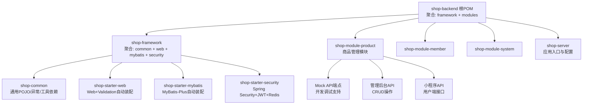

**图示来源**
- [shop-backend/pom.xml:14-20](file://shop-backend/pom.xml#L14-L20)
- [shop-framework/pom.xml:15-20](file://shop-backend/shop-framework/pom.xml#L15-L20)
- [AppMockController.java:10-11](file://shop-backend/shop-module-product/src/main/java/com/shop/module/product/controller/AppMockController.java#L10-L11)

**章节来源**
- [shop-backend/pom.xml:14-20](file://shop-backend/pom.xml#L14-L20)
- [shop-framework/pom.xml:15-20](file://shop-backend/shop-framework/pom.xml#L15-L20)

## 核心组件
本节聚焦 shop-framework 基础框架层四大模块的能力定位与技术实现：

- shop-common：提供统一响应体、分页模型、全局异常处理与业务异常类型，作为所有模块共享的基础契约。
- shop-starter-web：在引入 shop-common 与 Spring Web/Validation 的基础上，提供 Web 层自动装配能力。
- shop-starter-mybatis：在引入 shop-common 与 MyBatis-Plus 的基础上，提供分页拦截器、公共字段填充、通用 Mapper 接口等自动装配。
- shop-starter-security：在引入 shop-common 与 Spring Security/Redis/JWT 的基础上，提供无状态鉴权链路、Token 解析与校验过滤器。

**章节来源**
- [shop-common/pom.xml:14-31](file://shop-backend/shop-framework/shop-common/pom.xml#L14-31)
- [shop-starter-web/pom.xml:14-27](file://shop-backend/shop-framework/shop-starter-web/pom.xml#L14-27)
- [shop-starter-mybatis/pom.xml:14-27](file://shop-backend/shop-framework/shop-starter-mybatis/pom.xml#L14-27)
- [shop-starter-security/pom.xml:14-41](file://shop-backend/shop-framework/shop-starter-security/pom.xml#L14-41)

## 架构总览
整体采用"基础框架层 + 业务模块层 + 应用入口层"的三层结构。基础框架层通过 starter 模块向业务模块提供可插拔的自动装配；业务模块通过 shop-server 组合运行。安全层通过无状态会话策略与 Redis 存储 Token 实现跨域与高并发下的统一鉴权；持久层通过 MyBatis-Plus 提供分页与通用 CRUD 能力。新增的商品管理系统提供了完整的分类和SPU管理能力，Mock API端点系统支持开发阶段的快速联调。

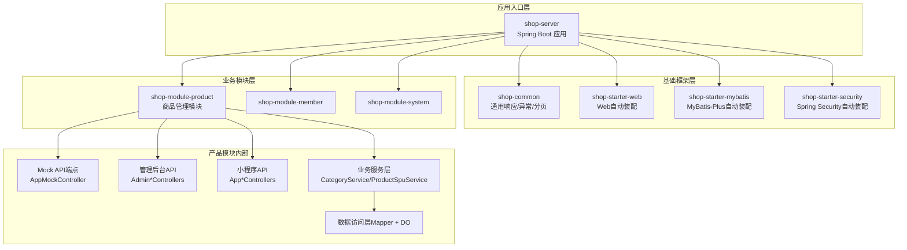

**图示来源**
- [shop-backend/pom.xml:14-20](file://shop-backend/pom.xml#L14-L20)
- [shop-framework/pom.xml:15-20](file://shop-backend/shop-framework/pom.xml#L15-L20)
- [AppMockController.java:10-11](file://shop-backend/shop-module-product/src/main/java/com/shop/module/product/controller/AppMockController.java#L10-L11)
- [CategoryService.java:12-15](file://shop-backend/shop-module-product/src/main/java/com/shop/module/product/service/CategoryService.java#L12-15)

## 详细组件分析

### shop-common 通用模块
- 统一响应体与分页模型：提供标准返回结构与分页入参/出参，确保接口一致性。
- 全局异常处理：集中捕获业务异常与系统异常，输出统一格式。
- 业务异常类型：以枚举形式定义错误码与消息，便于前端统一处理。

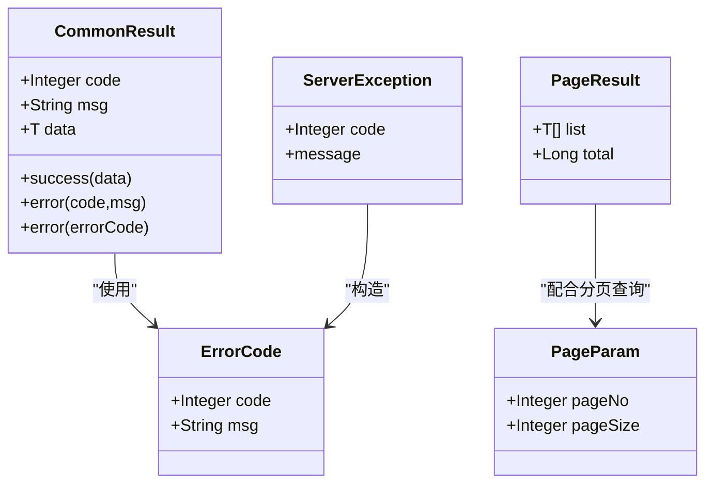

**图示来源**
- [CommonResult.java:8-33](file://shop-backend/shop-framework/shop-common/src/main/java/com/shop/common/pojo/CommonResult.java#L8-L33)
- [PageParam.java:7-11](file://shop-backend/shop-framework/shop-common/src/main/java/com/shop/common/pojo/PageParam.java#L7-L11)
- [PageResult.java:8-17](file://shop-backend/shop-framework/shop-common/src/main/java/com/shop/common/pojo/PageResult.java#L8-L17)
- [ErrorCode.java:8-25](file://shop-backend/shop-framework/shop-common/src/main/java/com/shop/common/exception/ErrorCode.java#L8-L25)
- [ServerException.java:6-19](file://shop-backend/shop-framework/shop-common/src/main/java/com/shop/common/exception/ServerException.java#L6-L19)

**章节来源**
- [CommonResult.java:8-33](file://shop-backend/shop-framework/shop-common/src/main/java/com/shop/common/pojo/CommonResult.java#L8-L33)
- [PageParam.java:7-11](file://shop-backend/shop-framework/shop-common/src/main/java/com/shop/common/pojo/PageParam.java#L7-L11)
- [PageResult.java:8-17](file://shop-backend/shop-framework/shop-common/src/main/java/com/shop/common/pojo/PageResult.java#L8-L17)
- [ErrorCode.java:8-25](file://shop-backend/shop-framework/shop-common/src/main/java/com/shop/common/exception/ErrorCode.java#L8-L25)
- [GlobalExceptionHandler.java:10-23](file://shop-backend/shop-framework/shop-common/src/main/java/com/shop/common/exception/GlobalExceptionHandler.java#L10-L23)
- [ServerException.java:6-19](file://shop-backend/shop-framework/shop-common/src/main/java/com/shop/common/exception/ServerException.java#L6-L19)

### shop-starter-web 自动装配
- 依赖关系：依赖 shop-common 与 Spring Web/Validation，提供 Web 层自动装配。
- 设计目标：屏蔽重复配置，统一 Web 行为（如参数校验、响应体封装等）。

**章节来源**
- [shop-starter-web/pom.xml:14-27](file://shop-backend/shop-framework/shop-starter-web/pom.xml#L14-27)

### shop-starter-mybatis 自动装配
- 分页拦截器：内置 MySQL 分页插件，统一分页行为。
- 公共字段填充：自动写入创建/更新时间，减少重复代码。
- 通用 Mapper 接口：提供分页查询便捷方法，降低 DAO 层样板代码。

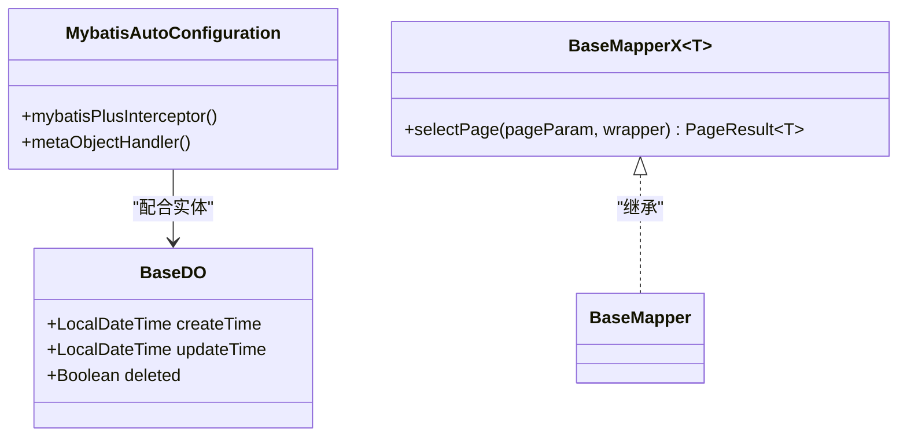

**图示来源**
- [MybatisAutoConfiguration.java:13-38](file://shop-backend/shop-framework/shop-starter-mybatis/src/main/java/com/shop/framework/mybatis/MybatisAutoConfiguration.java#L13-L38)
- [BaseDO.java:12-22](file://shop-backend/shop-framework/shop-starter-mybatis/src/main/java/com/shop/framework/mybatis/core/BaseDO.java#L12-L22)
- [BaseMapperX.java:9-15](file://shop-backend/shop-framework/shop-starter-mybatis/src/main/java/com/shop/framework/mybatis/core/BaseMapperX.java#L9-L15)

**章节来源**
- [MybatisAutoConfiguration.java:13-38](file://shop-backend/shop-framework/shop-starter-mybatis/src/main/java/com/shop/framework/mybatis/MybatisAutoConfiguration.java#L13-L38)
- [BaseDO.java:12-22](file://shop-backend/shop-framework/shop-starter-mybatis/src/main/java/com/shop/framework/mybatis/core/BaseDO.java#L12-L22)
- [BaseMapperX.java:9-15](file://shop-backend/shop-framework/shop-starter-mybatis/src/main/java/com/shop/framework/mybatis/core/BaseMapperX.java#L9-L15)

### shop-starter-security 自动装配
- 安全过滤链：禁用 CSRF，启用无状态会话，开放公开端点，其余均需认证。
- 认证过滤器：从请求头解析 Bearer Token，解析失败则放行至后续过滤器链。
- Token 管理：基于 Redis 存储 Token，支持创建、读取与删除，设置过期时间。

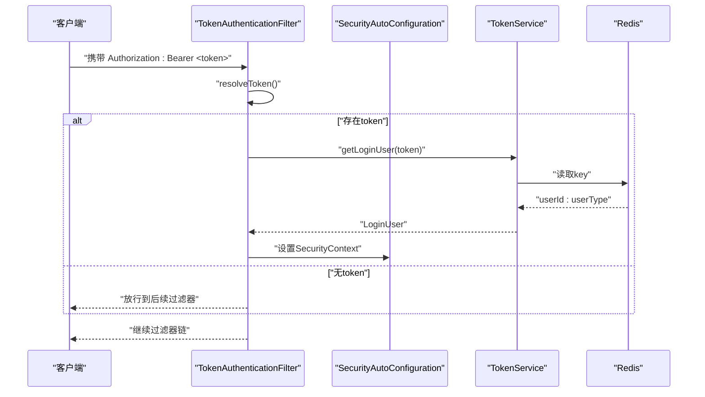

**图示来源**
- [SecurityAutoConfiguration.java:20-45](file://shop-backend/shop-framework/shop-starter-security/src/main/java/com/shop/framework/security/SecurityAutoConfiguration.java#L20-L45)
- [TokenAuthenticationFilter.java:16-42](file://shop-backend/shop-framework/shop-starter-security/src/main/java/com/shop/framework/security/TokenAuthenticationFilter.java#L16-L42)
- [TokenService.java:12-46](file://shop-backend/shop-framework/shop-starter-security/src/main/java/com/shop/framework/security/TokenService.java#L12-L46)

**章节来源**
- [SecurityAutoConfiguration.java:16-46](file://shop-backend/shop-framework/shop-starter-security/src/main/java/com/shop/framework/security/SecurityAutoConfiguration.java#L16-46)
- [TokenAuthenticationFilter.java:16-42](file://shop-backend/shop-framework/shop-starter-security/src/main/java/com/shop/framework/security/TokenAuthenticationFilter.java#L16-42)
- [TokenService.java:12-46](file://shop-backend/shop-framework/shop-starter-security/src/main/java/com/shop/framework/security/TokenService.java#L12-46)

### 数据流与控制流
- 控制流：客户端请求进入 Web 层，经由安全过滤链进行鉴权，随后进入控制器处理；业务异常通过全局异常处理器统一返回。
- 数据流：控制器调用服务层，服务层通过 DAO 使用通用 Mapper 进行数据库操作；MyBatis-Plus 自动完成分页与字段填充。

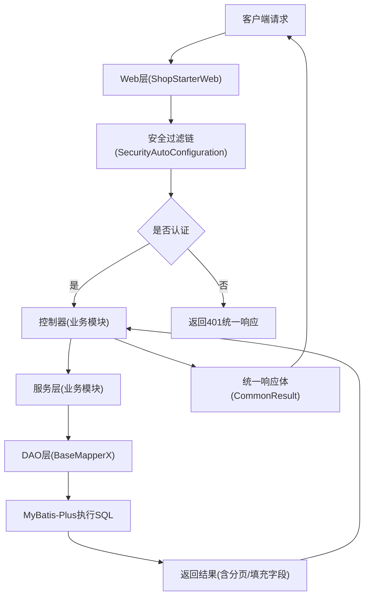

**图示来源**
- [shop-starter-web/pom.xml:14-27](file://shop-backend/shop-framework/shop-starter-web/pom.xml#L14-27)
- [SecurityAutoConfiguration.java:20-45](file://shop-backend/shop-framework/shop-starter-security/src/main/java/com/shop/framework/security/SecurityAutoConfiguration.java#L20-L45)
- [BaseMapperX.java:9-15](file://shop-backend/shop-framework/shop-starter-mybatis/src/main/java/com/shop/framework/mybatis/core/BaseMapperX.java#L9-L15)
- [CommonResult.java:8-33](file://shop-backend/shop-framework/shop-common/src/main/java/com/shop/common/pojo/CommonResult.java#L8-L33)

## 商品管理系统

### 系统概述
商品管理系统是电商核心模块，提供完整的商品分类管理和SPU（Standard Product Unit）管理能力。系统采用分层架构设计，包含控制器层、服务层和数据访问层，支持小程序端和管理后台两种不同的API风格。

### 数据模型设计
系统定义了核心数据实体，包括商品分类和SPU信息，均继承自基础实体类以获得统一的审计字段支持。

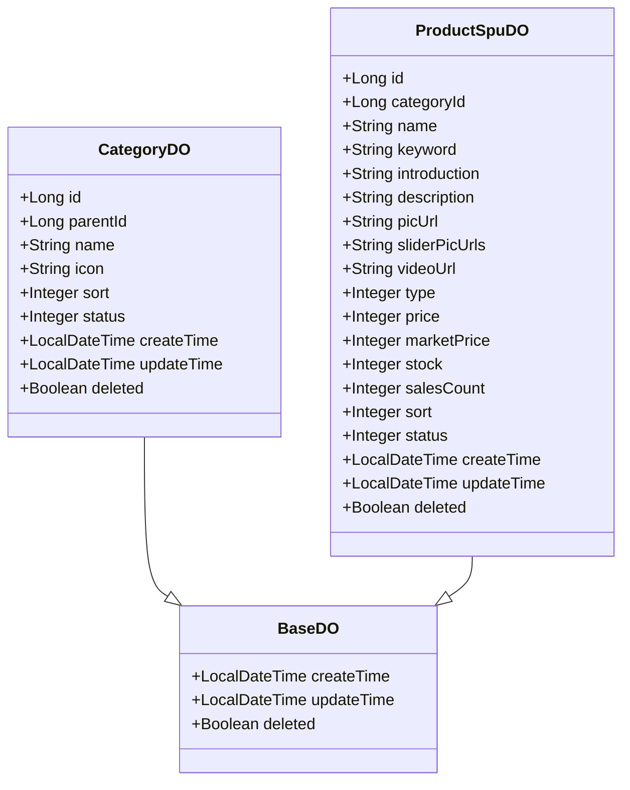

**图示来源**
- [CategoryDO.java:12-25](file://shop-backend/shop-module-product/src/main/java/com/shop/module/product/dal/dataobject/CategoryDO.java#L12-L25)
- [ProductSpuDO.java:12-35](file://shop-backend/shop-module-product/src/main/java/com/shop/module/product/dal/dataobject/ProductSpuDO.java#L12-L35)
- [BaseDO.java:12-22](file://shop-backend/shop-framework/shop-starter-mybatis/src/main/java/com/shop/framework/mybatis/core/BaseDO.java#L12-L22)

### 服务层设计
服务层提供业务逻辑封装，包括分类管理和SPU管理的完整CRUD操作，支持分页查询、条件筛选和业务验证。

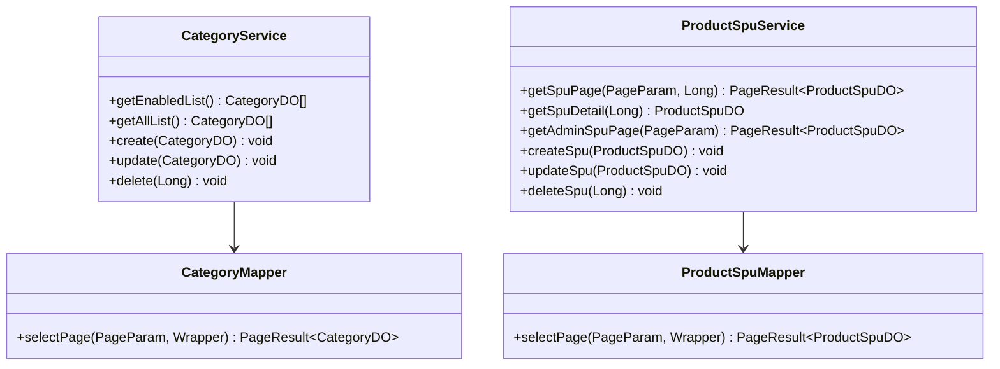

**图示来源**
- [CategoryService.java:12-55](file://shop-backend/shop-module-product/src/main/java/com/shop/module/product/service/CategoryService.java#L12-L55)
- [ProductSpuService.java:12-111](file://shop-backend/shop-module-product/src/main/java/com/shop/module/product/service/ProductSpuService.java#L12-L111)
- [CategoryMapper.java:12-15](file://shop-backend/shop-module-product/src/main/java/com/shop/module/product/dal/mysql/CategoryMapper.java#L12-L15)
- [ProductSpuMapper.java:12-15](file://shop-backend/shop-module-product/src/main/java/com/shop/module/product/dal/mysql/ProductSpuMapper.java#L12-L15)

### API接口设计
系统提供两套API接口：小程序端API用于用户浏览商品，管理后台API用于商品管理操作。

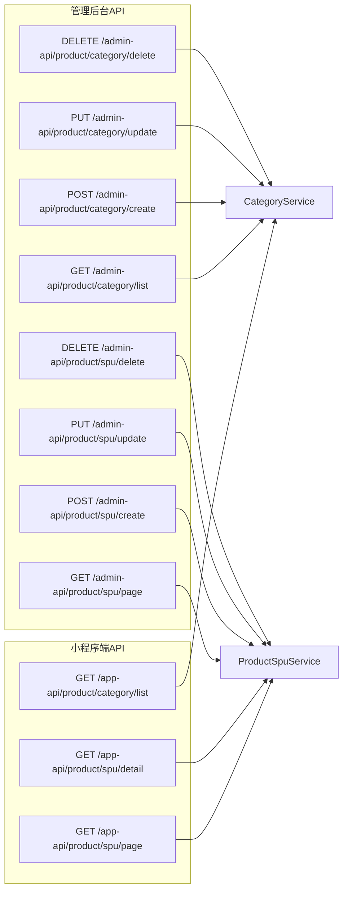

**图示来源**
- [AppProductController.java:12-56](file://shop-backend/shop-module-product/src/main/java/com/shop/module/product/controller/app/AppProductController.java#L12-L56)
- [AdminCategoryController.java:12-101](file://shop-backend/shop-module-product/src/main/java/com/shop/module/product/controller/admin/AdminCategoryController.java#L12-L101)
- [AdminProductController.java:12-146](file://shop-backend/shop-module-product/src/main/java/com/shop/module/product/controller/admin/AdminProductController.java#L12-L146)

**章节来源**
- [CategoryDO.java:12-25](file://shop-backend/shop-module-product/src/main/java/com/shop/module/product/dal/dataobject/CategoryDO.java#L12-L25)
- [ProductSpuDO.java:12-35](file://shop-backend/shop-module-product/src/main/java/com/shop/module/product/dal/dataobject/ProductSpuDO.java#L12-L35)
- [CategoryService.java:12-55](file://shop-backend/shop-module-product/src/main/java/com/shop/module/product/service/CategoryService.java#L12-L55)
- [ProductSpuService.java:12-111](file://shop-backend/shop-module-product/src/main/java/com/shop/module/product/service/ProductSpuService.java#L12-L111)
- [AppProductController.java:12-56](file://shop-backend/shop-module-product/src/main/java/com/shop/module/product/controller/app/AppProductController.java#L12-L56)
- [AdminCategoryController.java:12-101](file://shop-backend/shop-module-product/src/main/java/com/shop/module/product/controller/admin/AdminCategoryController.java#L12-L101)
- [AdminProductController.java:12-146](file://shop-backend/shop-module-product/src/main/java/com/shop/module/product/controller/admin/AdminProductController.java#L12-L146)

## Mock API端点系统

### 系统概述
Mock API端点系统为开发阶段提供完整的模拟数据支持，覆盖商品分类、商品详情、购物车、订单、支付、搜索、优惠券、品牌、专题页、评论、地址、收藏、足迹、用户信息和帮助中心等核心业务场景。该系统极大提升了前后端并行开发的效率。

### 核心功能模块
系统实现了652行代码的完整Mock接口，包含以下主要功能模块：

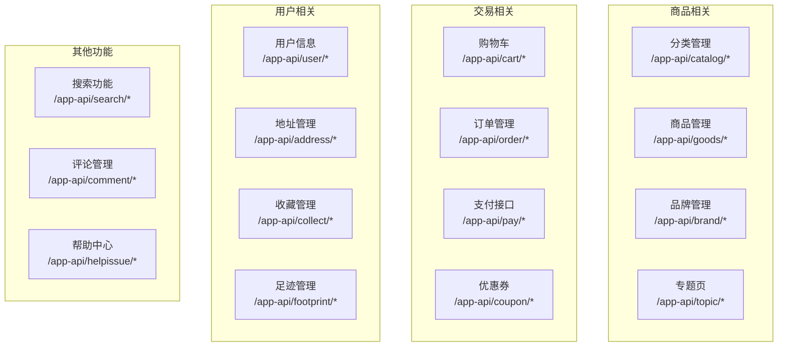

**图示来源**
- [AppMockController.java:33-616](file://shop-backend/shop-module-product/src/main/java/com/shop/module/product/controller/AppMockController.java#L33-L616)

### 数据模拟机制
系统使用静态内存数据结构模拟真实业务数据，包含丰富的药食同源商品数据和完整的业务流程模拟。

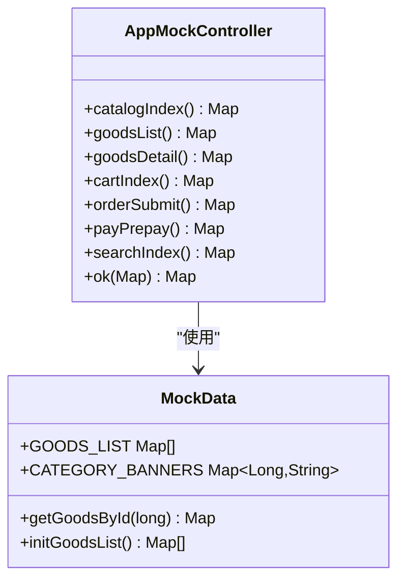

**图示来源**
- [AppMockController.java:10-17](file://shop-backend/shop-module-product/src/main/java/com/shop/module/product/controller/AppMockController.java#L10-L17)
- [MockData.java:5-78](file://shop-backend/shop-module-product/src/main/java/com/shop/module/product/controller/MockData.java#L5-L78)

### 开发优势
- **快速联调**：无需等待后端真实接口实现，前端可立即开始开发
- **完整覆盖**：涵盖电商核心业务流程的所有关键接口
- **数据丰富**：提供真实的药食同源商品数据和业务场景
- **易于维护**：集中管理Mock数据，便于更新和维护

**章节来源**
- [AppMockController.java:10-652](file://shop-backend/shop-module-product/src/main/java/com/shop/module/product/controller/AppMockController.java#L10-L652)
- [MockData.java:5-78](file://shop-backend/shop-module-product/src/main/java/com/shop/module/product/controller/MockData.java#L5-L78)

## 容器化部署

### Docker镜像构建
系统提供完整的Docker容器化支持，采用多阶段构建优化镜像大小和构建效率。

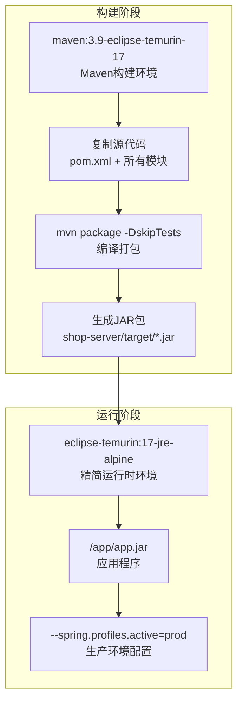

**图示来源**
- [Dockerfile:1-16](file://shop-backend/Dockerfile#L1-16)

### 构建流程优化
- **多阶段构建**：分离构建环境和运行环境，减小最终镜像体积
- **依赖缓存**：利用Docker层缓存机制加速构建过程
- **资源限制**：配置合理的JVM内存参数，适应容器环境
- **生产优化**：默认激活生产环境配置，确保部署安全性

### 部署配置
- **端口暴露**：默认暴露80端口，便于负载均衡和反向代理
- **内存配置**：初始堆内存256MB，最大堆内存512MB，适合微服务部署
- **环境隔离**：通过Spring Profile实现不同环境的配置隔离
- **健康检查**：结合Kubernetes或Docker Swarm实现服务健康监控

**章节来源**
- [Dockerfile:1-16](file://shop-backend/Dockerfile#L1-16)

## 依赖分析
- 版本与依赖管理：根 POM 通过 dependencyManagement 集中管理 Spring Boot 3.2.5、MyBatis-Plus、Hutool、JWT 等版本，避免冲突。
- 模块内依赖：starter 模块均依赖 shop-common，确保统一的通用能力；security 依赖 Redis 与 JWT，web 依赖 Validation。
- 外部依赖：MySQL Connector 仅在 mybatis starter 中声明，避免其他模块引入。
- 产品模块依赖：商品管理模块依赖 shop-starter-web 和 shop-starter-mybatis，获得Web能力和持久层支持。

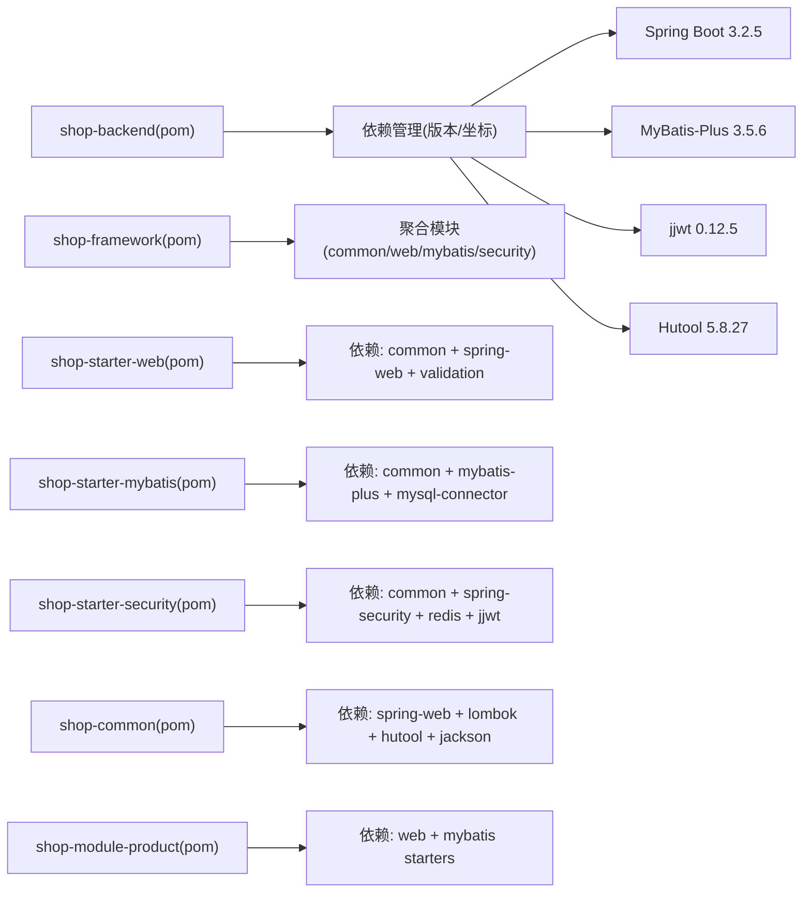

**图示来源**
- [shop-backend/pom.xml:33-88](file://shop-backend/pom.xml#L33-L88)
- [shop-starter-web/pom.xml:14-27](file://shop-backend/shop-framework/shop-starter-web/pom.xml#L14-27)
- [shop-starter-mybatis/pom.xml:14-27](file://shop-backend/shop-framework/shop-starter-mybatis/pom.xml#L14-27)
- [shop-starter-security/pom.xml:14-41](file://shop-backend/shop-framework/shop-starter-security/pom.xml#L14-41)
- [shop-common/pom.xml:14-31](file://shop-backend/shop-framework/shop-common/pom.xml#L14-31)

**章节来源**
- [shop-backend/pom.xml:22-88](file://shop-backend/pom.xml#L22-L88)
- [shop-starter-web/pom.xml:14-27](file://shop-backend/shop-framework/shop-starter-web/pom.xml#L14-27)
- [shop-starter-mybatis/pom.xml:14-27](file://shop-backend/shop-framework/shop-starter-mybatis/pom.xml#L14-27)
- [shop-starter-security/pom.xml:14-41](file://shop-backend/shop-framework/shop-starter-security/pom.xml#L14-41)
- [shop-common/pom.xml:14-31](file://shop-backend/shop-framework/shop-common/pom.xml#L14-31)

## 性能考虑
- 无状态鉴权：通过 Redis 存储 Token，避免服务器端会话开销，适合高并发场景。
- 分页与字段填充：MyBatis-Plus 分页插件与 MetaObjectHandler 减少重复逻辑，提升开发效率与查询可控性。
- 统一异常处理：集中处理异常，避免异常穿透导致的额外日志与序列化开销。
- 依赖最小化：非必要依赖不进入其他模块，降低类路径扫描与启动时间。
- 容器化优化：Docker多阶段构建减小镜像体积，JVM参数优化适应容器环境。
- Mock数据缓存：静态内存数据结构提供快速响应，避免数据库查询开销。

## 故障排查指南
- 401 未授权：检查请求头 Authorization 是否为 Bearer Token，确认 Token 是否存在于 Redis 且未过期。
- 403 无权限：确认请求路径是否命中需要认证的规则，或是否缺少必要的角色/权限。
- 业务异常：查看全局异常处理器对 ServerException 的处理，核对错误码与消息映射。
- 分页异常：确认 PageParam 默认值与实际传参范围，检查 BaseMapperX 的分页包装逻辑。
- 商品管理问题：检查 CategoryService 和 ProductSpuService 的业务逻辑，确认数据库连接和表结构。
- Mock接口问题：确认MockData中的测试数据完整性，检查接口路径映射是否正确。
- 容器部署问题：检查Dockerfile构建步骤，确认JAR包生成和环境变量配置。

**章节来源**
- [SecurityAutoConfiguration.java:20-45](file://shop-backend/shop-framework/shop-starter-security/src/main/java/com/shop/framework/security/SecurityAutoConfiguration.java#L20-L45)
- [TokenService.java:12-46](file://shop-backend/shop-framework/shop-starter-security/src/main/java/com/shop/framework/security/TokenService.java#L12-L46)
- [GlobalExceptionHandler.java:10-23](file://shop-backend/shop-framework/shop-common/src/main/java/com/shop/common/exception/GlobalExceptionHandler.java#L10-L23)
- [BaseMapperX.java:9-15](file://shop-backend/shop-framework/shop-starter-mybatis/src/main/java/com/shop/framework/mybatis/core/BaseMapperX.java#L9-L15)
- [CategoryService.java:12-55](file://shop-backend/shop-module-product/src/main/java/com/shop/module/product/service/CategoryService.java#L12-L55)
- [ProductSpuService.java:12-111](file://shop-backend/shop-module-product/src/main/java/com/shop/module/product/service/ProductSpuService.java#L12-L111)
- [AppMockController.java:10-652](file://shop-backend/shop-module-product/src/main/java/com/shop/module/product/controller/AppMockController.java#L10-L652)
- [Dockerfile:1-16](file://shop-backend/Dockerfile#L1-16)

## 结论
该架构以 shop-framework 为核心，通过模块化的 starter 设计实现了"可插拔"的通用能力复用；结合 Spring Boot 3.2.5 的自动装配机制，有效降低了业务模块的样板代码与配置成本。新增的商品管理系统提供了完整的电商核心功能，Mock API端点系统大幅提升了开发效率，Docker容器化部署确保了应用的标准化交付。在安全与持久层方面，采用无状态鉴权与 MyBatis-Plus 自动装配，兼顾了易用性与性能。建议在后续扩展中保持模块边界清晰，遵循"通用能力下沉、业务逻辑上浮"的原则，持续完善监控与可观测性。

## 附录
- 系统边界：shop-server 作为应用入口，聚合基础框架与业务模块；对外暴露 REST API，内部通过模块间依赖协作。
- 集成模式：模块间通过 Maven 依赖与 Spring Auto Configuration 机制集成；对外通过 HTTP 协议与小程序前端交互。
- 最佳实践：优先使用 shop-common 的统一响应与异常模型；在 DAO 层统一使用 BaseMapperX；在安全层统一使用 TokenService 与过滤器链。
- 开发建议：充分利用Mock API进行前后端并行开发；合理使用商品管理系统的CRUD接口；遵循容器化部署规范。
- 运维指导：关注Docker镜像构建优化；监控商品管理模块的性能指标；定期清理Mock数据中的过期信息。