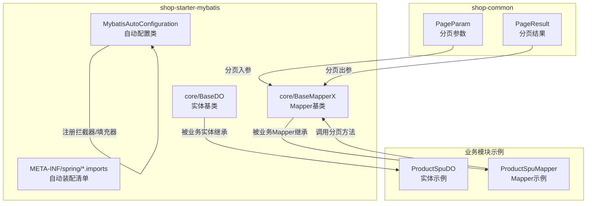
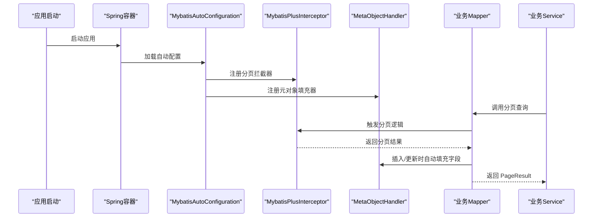
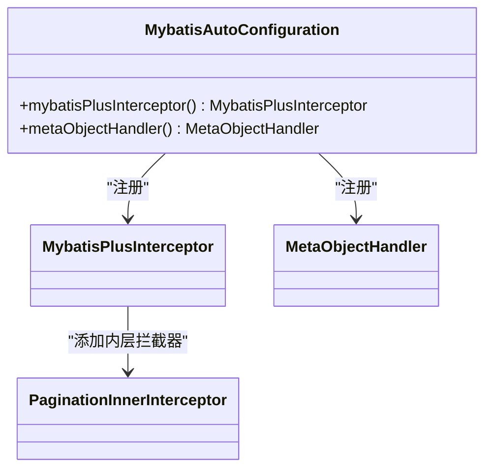
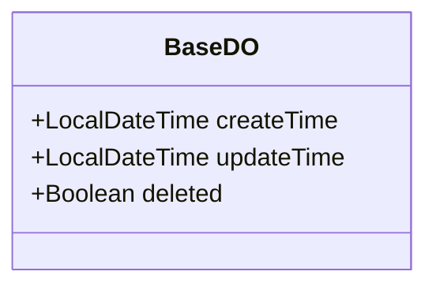
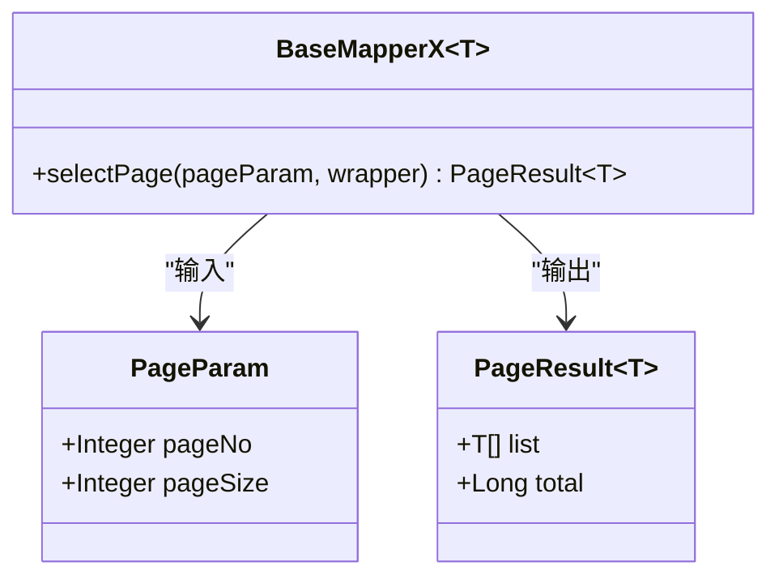
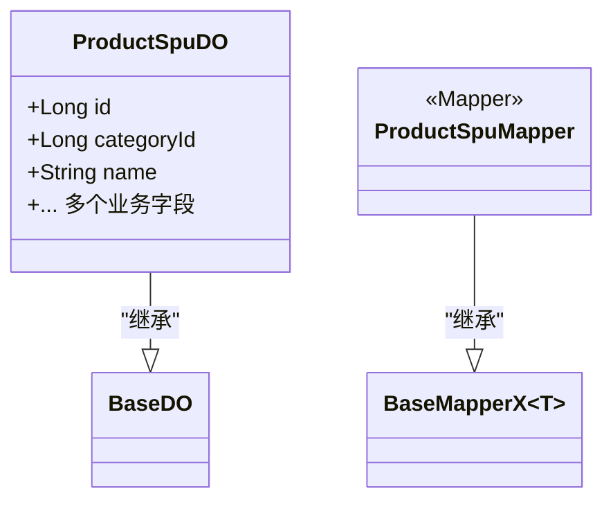
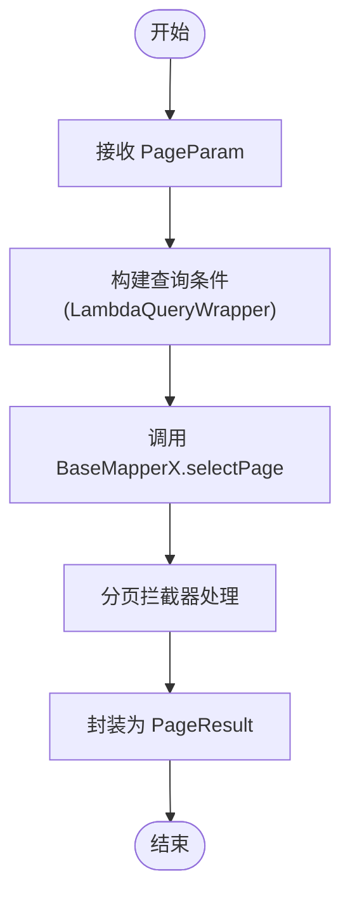
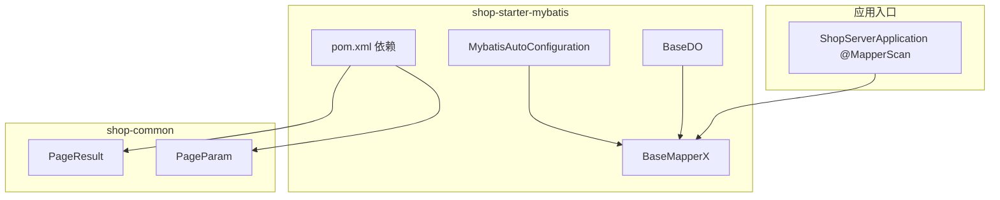

# MyBatis集成模块（shop-starter-mybatis）

<cite>
**本文档引用的文件**
- [MybatisAutoConfiguration.java](file://shop-backend/shop-framework/shop-starter-mybatis/src/main/java/com/shop/framework/mybatis/MybatisAutoConfiguration.java)
- [BaseDO.java](file://shop-backend/shop-framework/shop-starter-mybatis/src/main/java/com/shop/framework/mybatis/core/BaseDO.java)
- [BaseMapperX.java](file://shop-backend/shop-framework/shop-starter-mybatis/src/main/java/com/shop/framework/mybatis/core/BaseMapperX.java)
- [org.springframework.boot.autoconfigure.AutoConfiguration.imports](file://shop-backend/shop-framework/shop-starter-mybatis/src/main/resources/META-INF/spring/org.springframework.boot.autoconfigure.AutoConfiguration.imports)
- [pom.xml](file://shop-backend/shop-framework/shop-starter-mybatis/pom.xml)
- [PageParam.java](file://shop-backend/shop-framework/shop-common/src/main/java/com/shop/common/pojo/PageParam.java)
- [PageResult.java](file://shop-backend/shop-framework/shop-common/src/main/java/com/shop/common/pojo/PageResult.java)
- [ProductSpuDO.java](file://shop-backend/shop-module-product/src/main/java/com/shop/module/product/dal/dataobject/ProductSpuDO.java)
- [ProductSpuMapper.java](file://shop-backend/shop-module-product/src/main/java/com/shop/module/product/dal/mysql/ProductSpuMapper.java)
- [CategoryDO.java](file://shop-backend/shop-module-product/src/main/java/com/shop/module/product/dal/dataobject/CategoryDO.java)
- [ShopServerApplication.java](file://shop-backend/shop-server/src/main/java/com/shop/server/ShopServerApplication.java)
- [shop-common/pom.xml](file://shop-backend/shop-framework/shop-common/pom.xml)
</cite>

## 目录
1. [简介](#简介)
2. [项目结构](#项目结构)
3. [核心组件](#核心组件)
4. [架构总览](#架构总览)
5. [详细组件分析](#详细组件分析)
6. [依赖分析](#依赖分析)
7. [性能考虑](#性能考虑)
8. [故障排查指南](#故障排查指南)
9. [结论](#结论)
10. [附录](#附录)

## 简介
本文件面向“药食同源”微信小程序商城后端的 MyBatis 集成模块（shop-starter-mybatis），系统性阐述其自动配置机制与基础架构设计。重点包括：
- 自动配置类 MybatisAutoConfiguration 的配置原理与作用范围
- 基类 BaseDO 的设计理念与字段约定
- 数据访问基类 BaseMapperX 的功能扩展与分页封装
- 如何通过该模块实现快速数据持久化开发（实体类继承、Mapper 接口规范、分页查询）
- 配置参数说明、性能优化建议与常见问题解决方案

## 项目结构
shop-starter-mybatis 模块位于 shop-backend/shop-framework/shop-starter-mybatis 下，采用“starter + 核心基类 + 自动配置”的分层组织方式：
- 自动配置：MybatisAutoConfiguration 提供 MyBatis-Plus 分页拦截器与元对象填充器
- 核心基类：BaseDO 定义统一的审计字段与逻辑删除；BaseMapperX 扩展分页查询能力
- 资源：Spring Boot 自动装配导入清单，声明自动配置类
- 依赖：整合 MyBatis-Plus Starter、MySQL Connector、shop-common 公共模块

图表来源
- [MybatisAutoConfiguration.java:1-39](file://shop-backend/shop-framework/shop-starter-mybatis/src/main/java/com/shop/framework/mybatis/MybatisAutoConfiguration.java#L1-L39)
- [BaseDO.java:1-23](file://shop-backend/shop-framework/shop-starter-mybatis/src/main/java/com/shop/framework/mybatis/core/BaseDO.java#L1-L23)
- [BaseMapperX.java:1-16](file://shop-backend/shop-framework/shop-starter-mybatis/src/main/java/com/shop/framework/mybatis/core/BaseMapperX.java#L1-L16)
- [org.springframework.boot.autoconfigure.AutoConfiguration.imports:1-2](file://shop-backend/shop-framework/shop-starter-mybatis/src/main/resources/META-INF/spring/org.springframework.boot.autoconfigure.AutoConfiguration.imports#L1-L2)
- [PageParam.java:1-12](file://shop-backend/shop-framework/shop-common/src/main/java/com/shop/common/pojo/PageParam.java#L1-L12)
- [PageResult.java:1-18](file://shop-backend/shop-framework/shop-common/src/main/java/com/shop/common/pojo/PageResult.java#L1-L18)
- [ProductSpuDO.java:1-33](file://shop-backend/shop-module-product/src/main/java/com/shop/module/product/dal/dataobject/ProductSpuDO.java#L1-L33)
- [ProductSpuMapper.java:1-10](file://shop-backend/shop-module-product/src/main/java/com/shop/module/product/dal/mysql/ProductSpuMapper.java#L1-L10)

章节来源
- [MybatisAutoConfiguration.java:1-39](file://shop-backend/shop-framework/shop-starter-mybatis/src/main/java/com/shop/framework/mybatis/MybatisAutoConfiguration.java#L1-L39)
- [BaseDO.java:1-23](file://shop-backend/shop-framework/shop-starter-mybatis/src/main/java/com/shop/framework/mybatis/core/BaseDO.java#L1-L23)
- [BaseMapperX.java:1-16](file://shop-backend/shop-framework/shop-starter-mybatis/src/main/java/com/shop/framework/mybatis/core/BaseMapperX.java#L1-L16)
- [org.springframework.boot.autoconfigure.AutoConfiguration.imports:1-2](file://shop-backend/shop-framework/shop-starter-mybatis/src/main/resources/META-INF/spring/org.springframework.boot.autoconfigure.AutoConfiguration.imports#L1-L2)
- [pom.xml:1-29](file://shop-backend/shop-framework/shop-starter-mybatis/pom.xml#L1-L29)

## 核心组件
- 自动配置类 MybatisAutoConfiguration
  - 注册 MyBatis-Plus 分页拦截器（针对 MySQL）
  - 注册 MetaObjectHandler 实现通用字段自动填充（创建时间、更新时间）
- 实体基类 BaseDO
  - 统一审计字段：创建时间、更新时间
  - 统一逻辑删除字段：deleted
  - 使用注解驱动字段填充策略
- Mapper 基类 BaseMapperX
  - 在 MyBatis-Plus 原有接口基础上扩展分页查询
  - 将 PageParam 转换为 IPage 并返回 PageResult 结构

章节来源
- [MybatisAutoConfiguration.java:16-37](file://shop-backend/shop-framework/shop-starter-mybatis/src/main/java/com/shop/framework/mybatis/MybatisAutoConfiguration.java#L16-L37)
- [BaseDO.java:12-22](file://shop-backend/shop-framework/shop-starter-mybatis/src/main/java/com/shop/framework/mybatis/core/BaseDO.java#L12-L22)
- [BaseMapperX.java:9-15](file://shop-backend/shop-framework/shop-starter-mybatis/src/main/java/com/shop/framework/mybatis/core/BaseMapperX.java#L9-L15)

## 架构总览
从应用启动到数据访问的整体链路如下：

图表来源
- [MybatisAutoConfiguration.java:16-37](file://shop-backend/shop-framework/shop-starter-mybatis/src/main/java/com/shop/framework/mybatis/MybatisAutoConfiguration.java#L16-L37)
- [BaseMapperX.java:11-14](file://shop-backend/shop-framework/shop-starter-mybatis/src/main/java/com/shop/framework/mybatis/core/BaseMapperX.java#L11-L14)
- [PageParam.java:8-11](file://shop-backend/shop-framework/shop-common/src/main/java/com/shop/common/pojo/PageParam.java#L8-L11)
- [PageResult.java:9-17](file://shop-backend/shop-framework/shop-common/src/main/java/com/shop/common/pojo/PageResult.java#L9-L17)

## 详细组件分析

### 自动配置类 MybatisAutoConfiguration
- 分页拦截器注册
  - 通过 MybatisPlusInterceptor 添加 PaginationInnerInterceptor，并指定数据库类型为 MySQL
  - 使所有分页查询自动转换为带 LIMIT 的 SQL，并处理总记录数
- 元对象填充器注册
  - insertFill：自动填充创建时间与更新时间为当前时间
  - updateFill：自动更新更新时间为当前时间
- 适用范围
  - 对所有标注了 @Mapper 的接口生效
  - 与业务实体的字段注解配合，实现统一审计与软删除

图表来源
- [MybatisAutoConfiguration.java:16-37](file://shop-backend/shop-framework/shop-starter-mybatis/src/main/java/com/shop/framework/mybatis/MybatisAutoConfiguration.java#L16-L37)

章节来源
- [MybatisAutoConfiguration.java:16-37](file://shop-backend/shop-framework/shop-starter-mybatis/src/main/java/com/shop/framework/mybatis/MybatisAutoConfiguration.java#L16-L37)

### 实体基类 BaseDO
- 字段设计
  - createTime：插入时自动填充
  - updateTime：插入/更新时自动填充
  - deleted：逻辑删除标记，配合 MyBatis-Plus 的逻辑删除注解
- 设计理念
  - 统一审计字段，减少重复代码
  - 与自动配置的 MetaObjectHandler 协作，实现零样板代码的审计
  - 逻辑删除避免误删重要数据，便于恢复与审计

图表来源
- [BaseDO.java:12-22](file://shop-backend/shop-framework/shop-starter-mybatis/src/main/java/com/shop/framework/mybatis/core/BaseDO.java#L12-L22)

章节来源
- [BaseDO.java:12-22](file://shop-backend/shop-framework/shop-starter-mybatis/src/main/java/com/shop/framework/mybatis/core/BaseDO.java#L12-L22)

### Mapper 基类 BaseMapperX
- 功能扩展
  - 在原有 BaseMapper 的基础上新增 selectPage 方法
  - 输入 PageParam，输出 PageResult，屏蔽 MyBatis-Plus 内部分页细节
- 使用场景
  - 列表查询、分页查询的标准实现
  - 与业务控制器配合，快速返回标准分页响应

图表来源
- [BaseMapperX.java:9-15](file://shop-backend/shop-framework/shop-starter-mybatis/src/main/java/com/shop/framework/mybatis/core/BaseMapperX.java#L9-L15)
- [PageParam.java:8-11](file://shop-backend/shop-framework/shop-common/src/main/java/com/shop/common/pojo/PageParam.java#L8-L11)
- [PageResult.java:9-17](file://shop-backend/shop-framework/shop-common/src/main/java/com/shop/common/pojo/PageResult.java#L9-L17)

章节来源
- [BaseMapperX.java:9-15](file://shop-backend/shop-framework/shop-starter-mybatis/src/main/java/com/shop/framework/mybatis/core/BaseMapperX.java#L9-L15)
- [PageParam.java:8-11](file://shop-backend/shop-framework/shop-common/src/main/java/com/shop/common/pojo/PageParam.java#L8-L11)
- [PageResult.java:9-17](file://shop-backend/shop-framework/shop-common/src/main/java/com/shop/common/pojo/PageResult.java#L9-L17)

### 业务实体与 Mapper 示例
- ProductSpuDO
  - 继承 BaseDO，获得统一审计与逻辑删除字段
  - 使用 @TableName 指定表名，使用 @TableId 指定主键策略
- ProductSpuMapper
  - 继承 BaseMapperX<ProductSpuDO>，天然具备分页查询能力
  - 使用 @Mapper 标注，交由 Spring 管理

图表来源
- [ProductSpuDO.java:13](file://shop-backend/shop-module-product/src/main/java/com/shop/module/product/dal/dataobject/ProductSpuDO.java#L13)
- [ProductSpuMapper.java:8](file://shop-backend/shop-module-product/src/main/java/com/shop/module/product/dal/mysql/ProductSpuMapper.java#L8)
- [BaseDO.java:12](file://shop-backend/shop-framework/shop-starter-mybatis/src/main/java/com/shop/framework/mybatis/core/BaseDO.java#L12)
- [BaseMapperX.java:9](file://shop-backend/shop-framework/shop-starter-mybatis/src/main/java/com/shop/framework/mybatis/core/BaseMapperX.java#L9)

章节来源
- [ProductSpuDO.java:1-33](file://shop-backend/shop-module-product/src/main/java/com/shop/module/product/dal/dataobject/ProductSpuDO.java#L1-L33)
- [ProductSpuMapper.java:1-10](file://shop-backend/shop-module-product/src/main/java/com/shop/module/product/dal/mysql/ProductSpuMapper.java#L1-L10)

### 分页查询流程
- 控制器/服务层传入 PageParam（页码、每页大小）
- Mapper 层调用 BaseMapperX.selectPage，内部转换为 IPage 并执行分页
- 返回 PageResult（列表、总数），供上层使用

图表来源
- [BaseMapperX.java:11-14](file://shop-backend/shop-framework/shop-starter-mybatis/src/main/java/com/shop/framework/mybatis/core/BaseMapperX.java#L11-L14)
- [PageParam.java:8-11](file://shop-backend/shop-framework/shop-common/src/main/java/com/shop/common/pojo/PageParam.java#L8-L11)
- [PageResult.java:9-17](file://shop-backend/shop-framework/shop-common/src/main/java/com/shop/common/pojo/PageResult.java#L9-L17)

章节来源
- [BaseMapperX.java:11-14](file://shop-backend/shop-framework/shop-starter-mybatis/src/main/java/com/shop/framework/mybatis/core/BaseMapperX.java#L11-L14)
- [PageParam.java:8-11](file://shop-backend/shop-framework/shop-common/src/main/java/com/shop/common/pojo/PageParam.java#L8-L11)
- [PageResult.java:9-17](file://shop-backend/shop-framework/shop-common/src/main/java/com/shop/common/pojo/PageResult.java#L9-L17)

## 依赖分析
- 模块依赖
  - 依赖 shop-common（提供 PageParam/PageResult 等通用分页模型）
  - 依赖 MyBatis-Plus Spring Boot Starter（提供自动配置、分页、逻辑删除等能力）
  - 依赖 MySQL Connector（数据库驱动）
- 应用扫描
  - 应用入口通过 @MapperScan 指定 Mapper 接口扫描路径，确保 BaseMapperX 及业务 Mapper 被正确识别

图表来源
- [pom.xml:14-26](file://shop-backend/shop-framework/shop-starter-mybatis/pom.xml#L14-L26)
- [MybatisAutoConfiguration.java:16-37](file://shop-backend/shop-framework/shop-starter-mybatis/src/main/java/com/shop/framework/mybatis/MybatisAutoConfiguration.java#L16-L37)
- [BaseDO.java:12-22](file://shop-backend/shop-framework/shop-starter-mybatis/src/main/java/com/shop/framework/mybatis/core/BaseDO.java#L12-L22)
- [BaseMapperX.java:9-15](file://shop-backend/shop-framework/shop-starter-mybatis/src/main/java/com/shop/framework/mybatis/core/BaseMapperX.java#L9-L15)
- [ShopServerApplication.java:10](file://shop-backend/shop-server/src/main/java/com/shop/server/ShopServerApplication.java#L10)

章节来源
- [pom.xml:14-26](file://shop-backend/shop-framework/shop-starter-mybatis/pom.xml#L14-L26)
- [shop-common/pom.xml:14-31](file://shop-backend/shop-framework/shop-common/pom.xml#L14-L31)
- [ShopServerApplication.java:10](file://shop-backend/shop-server/src/main/java/com/shop/server/ShopServerApplication.java#L10)

## 性能考虑
- 分页性能
  - 合理设置每页大小，避免过大导致内存压力与网络传输开销
  - 使用覆盖索引或必要时在查询条件上建立索引，减少全表扫描
- 审计字段
  - 自动填充字段仅在插入/更新时生效，避免在复杂批量操作中产生额外开销
- 逻辑删除
  - 查询默认过滤 deleted=false，注意在统计类查询中显式控制逻辑删除字段
- 连接池与驱动
  - 使用连接池管理数据库连接，结合 MySQL Connector/J 的合理配置提升吞吐量

## 故障排查指南
- 分页不生效
  - 检查是否正确继承 BaseMapperX 并调用 selectPage
  - 确认应用入口已启用 @MapperScan，扫描到业务 Mapper
- 审计字段为空
  - 确保实体字段使用 MyBatis-Plus 注解并配合 MetaObjectHandler
  - 检查是否在插入/更新时触发了自动填充逻辑
- 逻辑删除未生效
  - 确认实体字段使用逻辑删除注解且数据库表结构一致
  - 检查查询是否正确过滤 deleted 字段
- 自动配置未加载
  - 确认 shop-starter-mybatis 已打包进应用并被 Spring Boot 发现
  - 检查自动装配导入清单是否存在

章节来源
- [org.springframework.boot.autoconfigure.AutoConfiguration.imports:1](file://shop-backend/shop-framework/shop-starter-mybatis/src/main/resources/META-INF/spring/org.springframework.boot.autoconfigure.AutoConfiguration.imports#L1)
- [ShopServerApplication.java:10](file://shop-backend/shop-server/src/main/java/com/shop/server/ShopServerApplication.java#L10)

## 结论
shop-starter-mybatis 通过简洁的自动配置与统一的基类设计，显著降低了数据持久化的开发成本：
- 自动注入分页拦截器与元对象填充器，保证分页与审计的一致性
- BaseDO 与 BaseMapperX 提供标准化的实体与数据访问基类
- 业务实体与 Mapper 仅需少量样板代码即可完成 CRUD 与分页查询
- 结合 shop-common 的分页模型，形成前后端一致的分页交互协议

## 附录

### 快速上手指南（步骤说明）
- 创建实体类
  - 继承 BaseDO，定义业务字段，使用表映射注解
  - 参考路径：[ProductSpuDO.java:1-33](file://shop-backend/shop-module-product/src/main/java/com/shop/module/product/dal/dataobject/ProductSpuDO.java#L1-L33)
- 编写 Mapper 接口
  - 继承 BaseMapperX<实体类>，无需额外实现
  - 参考路径：[ProductSpuMapper.java:1-10](file://shop-backend/shop-module-product/src/main/java/com/shop/module/product/dal/mysql/ProductSpuMapper.java#L1-L10)
- 实现分页查询
  - 在服务层传入 PageParam，调用 Mapper 的 selectPage
  - 参考路径：[BaseMapperX.java:11-14](file://shop-backend/shop-framework/shop-starter-mybatis/src/main/java/com/shop/framework/mybatis/core/BaseMapperX.java#L11-L14)，[PageParam.java:8-11](file://shop-backend/shop-framework/shop-common/src/main/java/com/shop/common/pojo/PageParam.java#L8-L11)，[PageResult.java:9-17](file://shop-backend/shop-framework/shop-common/src/main/java/com/shop/common/pojo/PageResult.java#L9-L17)
- 启动应用
  - 确保 @MapperScan 能扫描到业务 Mapper
  - 参考路径：[ShopServerApplication.java](file://shop-backend/shop-server/src/main/java/com/shop/server/ShopServerApplication.java#L10)

### 配置参数说明
- 分页拦截器
  - 数据库类型：MySQL（由自动配置指定）
  - 行为：自动为分页查询添加 LIMIT 子句并计算总数
- 元对象填充器
  - 插入填充：createTime、updateTime 设置为当前时间
  - 更新填充：updateTime 设置为当前时间
- 逻辑删除
  - deleted 字段用于软删除，默认查询忽略 deleted=true 的记录

章节来源
- [MybatisAutoConfiguration.java:17-36](file://shop-backend/shop-framework/shop-starter-mybatis/src/main/java/com/shop/framework/mybatis/MybatisAutoConfiguration.java#L17-L36)
- [BaseDO.java:14-21](file://shop-backend/shop-framework/shop-starter-mybatis/src/main/java/com/shop/framework/mybatis/core/BaseDO.java#L14-L21)