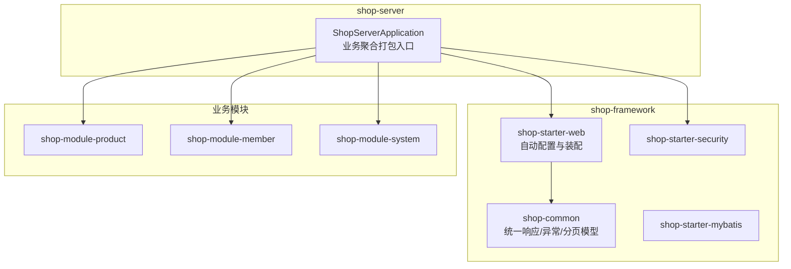
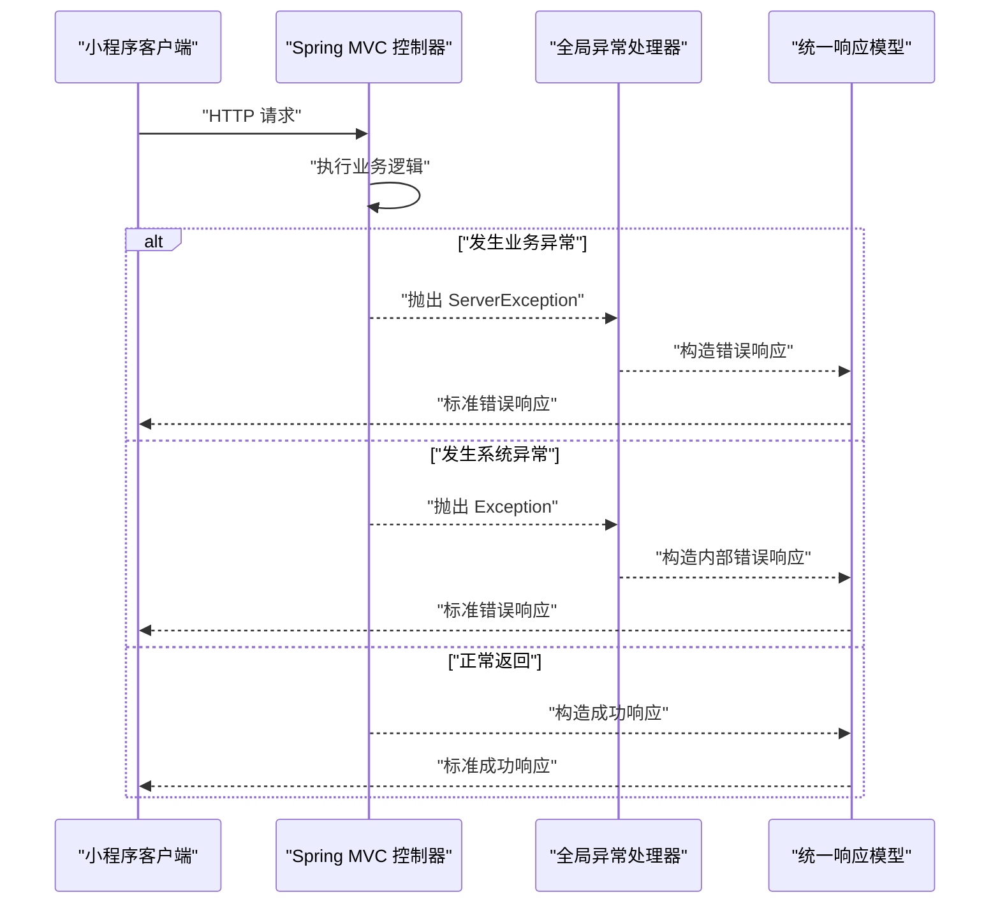
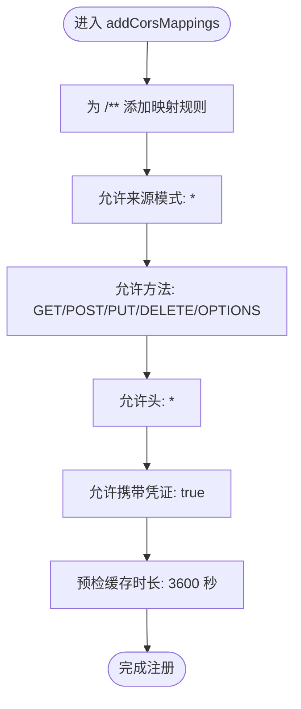
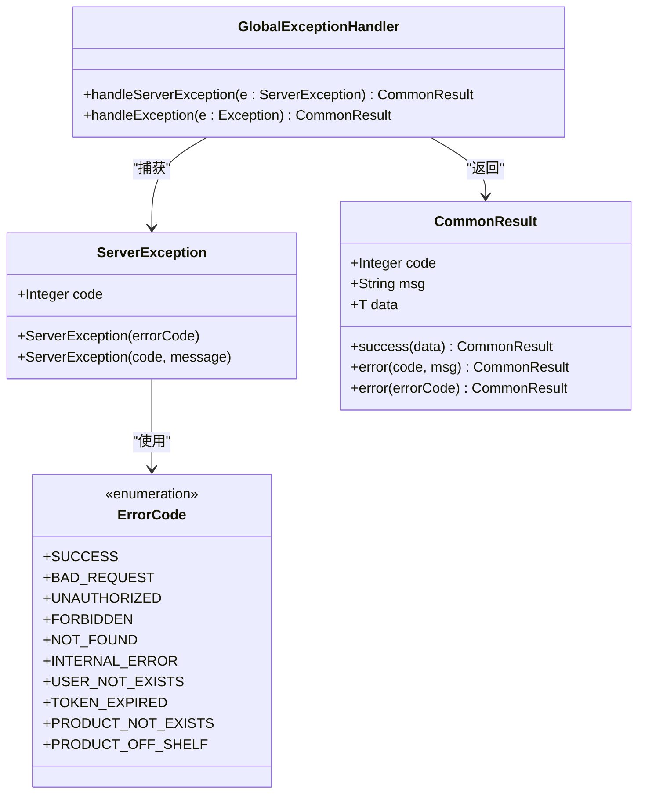
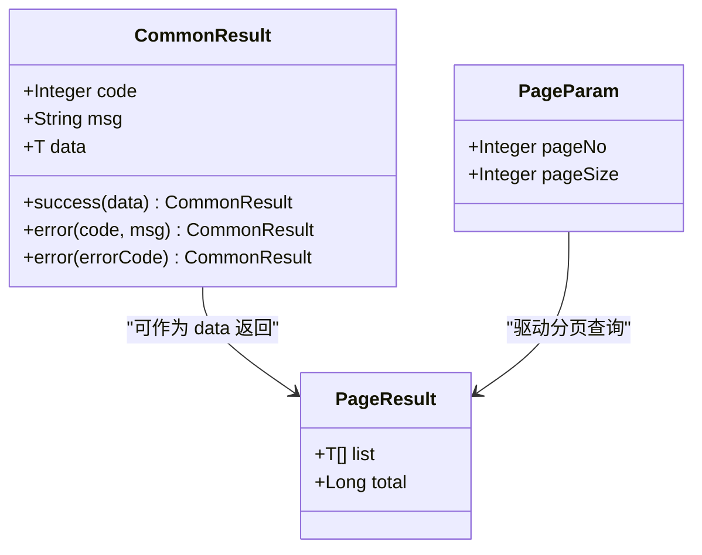
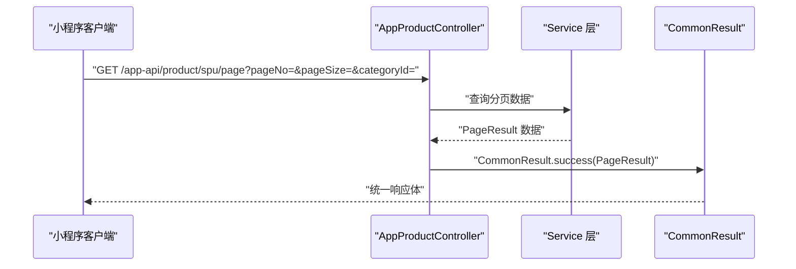
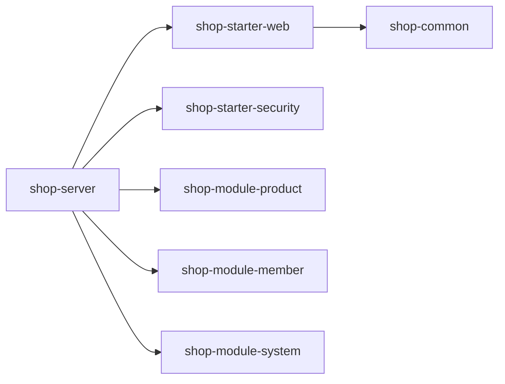

# Web配置模块（shop-starter-web）

<cite>
**本文档引用的文件**
- [WebAutoConfiguration.java](file://shop-backend/shop-framework/shop-starter-web/src/main/java/com/shop/framework/web/WebAutoConfiguration.java)
- [CommonResult.java](file://shop-backend/shop-framework/shop-common/src/main/java/com/shop/common/pojo/CommonResult.java)
- [GlobalExceptionHandler.java](file://shop-backend/shop-framework/shop-common/src/main/java/com/shop/common/exception/GlobalExceptionHandler.java)
- [ErrorCode.java](file://shop-backend/shop-framework/shop-common/src/main/java/com/shop/common/exception/ErrorCode.java)
- [ServerException.java](file://shop-backend/shop-framework/shop-common/src/main/java/com/shop/common/exception/ServerException.java)
- [PageParam.java](file://shop-backend/shop-framework/shop-common/src/main/java/com/shop/common/pojo/PageParam.java)
- [PageResult.java](file://shop-backend/shop-framework/shop-common/src/main/java/com/shop/common/pojo/PageResult.java)
- [AdminProductController.java](file://shop-backend/shop-module-product/src/main/java/com/shop/module/product/controller/admin/AdminProductController.java)
- [AppProductController.java](file://shop-backend/shop-module-product/src/main/java/com/shop/module/product/controller/app/AppProductController.java)
- [application.yml](file://shop-backend/shop-server/src/main/resources/application.yml)
- [application-dev.yml](file://shop-backend/shop-server/src/main/resources/application-dev.yml)
- [shop-starter-web/pom.xml](file://shop-backend/shop-framework/shop-starter-web/pom.xml)
- [shop-framework/pom.xml](file://shop-backend/shop-framework/pom.xml)
- [shop-server/pom.xml](file://shop-backend/shop-server/pom.xml)
- [AutoConfiguration.imports](file://shop-backend/shop-framework/shop-starter-web/src/main/resources/META-INF/spring/org.springframework.boot.autoconfigure.AutoConfiguration.imports)
</cite>

## 目录
1. [简介](#简介)
2. [项目结构](#项目结构)
3. [核心组件](#核心组件)
4. [架构总览](#架构总览)
5. [详细组件分析](#详细组件分析)
6. [依赖分析](#依赖分析)
7. [性能考虑](#性能考虑)
8. [故障排除指南](#故障排除指南)
9. [结论](#结论)
10. [附录](#附录)

## 简介
本文件面向“药食同源”微信小程序商城后端的Web配置模块（shop-starter-web），系统性阐述其自动配置实现与工程化实践。该模块通过Spring Boot自动装配机制，为业务应用提供统一的跨域配置、全局异常处理与统一响应格式能力，确保前后端（尤其是小程序端）能够以一致、简洁的方式进行交互。

模块的关键价值在于：
- CORS跨域：默认开放全量来源、方法与头部，并允许凭证，满足小程序与服务端联调与生产部署的灵活性需求。
- 全局异常处理：集中捕获业务异常与系统异常，统一返回标准化响应体，降低前端适配成本。
- 统一响应格式：提供通用响应载体，配合分页模型，便于构建RESTful API。

## 项目结构
shop-starter-web位于shop-framework子模块中，作为可复用的Web启动器，向上游业务模块（如product、member、system）提供基础能力。其核心文件组织如下：
- 自动配置类：WebAutoConfiguration（实现CORS）
- Spring自动装配注册：META-INF/spring/org.springframework.boot.autoconfigure.AutoConfiguration.imports
- 通用依赖：shop-starter-web依赖spring-boot-starter-web与spring-boot-starter-validation，并聚合shop-common中的统一响应与异常体系

图表来源
- [shop-framework/pom.xml:15-20](file://shop-backend/shop-framework/pom.xml#L15-L20)
- [shop-server/pom.xml:14-37](file://shop-backend/shop-server/pom.xml#L14-L37)
- [AutoConfiguration.imports:1-2](file://shop-backend/shop-framework/shop-starter-web/src/main/resources/META-INF/spring/org.springframework.boot.autoconfigure.AutoConfiguration.imports#L1-L2)

章节来源
- [shop-framework/pom.xml:15-20](file://shop-backend/shop-framework/pom.xml#L15-L20)
- [shop-server/pom.xml:14-37](file://shop-backend/shop-server/pom.xml#L14-L37)
- [AutoConfiguration.imports:1-2](file://shop-backend/shop-framework/shop-starter-web/src/main/resources/META-INF/spring/org.springframework.boot.autoconfigure.AutoConfiguration.imports#L1-L2)

## 核心组件
本模块的核心由三部分组成：
- Web自动配置：负责跨域规则的全局设置
- 全局异常处理器：统一拦截业务与系统异常，输出标准响应
- 统一响应模型：封装code/msg/data的标准结构，配合分页模型

章节来源
- [WebAutoConfiguration.java:1-20](file://shop-backend/shop-framework/shop-starter-web/src/main/java/com/shop/framework/web/WebAutoConfiguration.java#L1-L20)
- [GlobalExceptionHandler.java:1-24](file://shop-backend/shop-framework/shop-common/src/main/java/com/shop/common/exception/GlobalExceptionHandler.java#L1-L24)
- [CommonResult.java:1-34](file://shop-backend/shop-framework/shop-common/src/main/java/com/shop/common/pojo/CommonResult.java#L1-L34)

## 架构总览
下图展示了从客户端到控制器、再到统一响应与异常处理的整体流程，体现模块在系统中的定位与职责边界。

图表来源
- [GlobalExceptionHandler.java:12-22](file://shop-backend/shop-framework/shop-common/src/main/java/com/shop/common/exception/GlobalExceptionHandler.java#L12-L22)
- [CommonResult.java:15-32](file://shop-backend/shop-framework/shop-common/src/main/java/com/shop/common/pojo/CommonResult.java#L15-L32)

## 详细组件分析

### Web自动配置（CORS）
- 配置原理：实现WebMvcConfigurer接口，在addCorsMappings中对所有路径启用跨域规则，允许任意来源、方法、头部，并支持携带凭证，同时设置合理的预检缓存时长。
- 关键注解：@Configuration使类成为配置类；实现WebMvcConfigurer接口提供扩展点。
- 适用场景：小程序与后端联调阶段，或生产环境需要跨域访问时，无需在各控制器重复声明。
- 可定制性：若需更严格的跨域策略，可在业务应用中覆盖此配置或新增独立的WebMvcConfigurer Bean。

图表来源
- [WebAutoConfiguration.java:11-17](file://shop-backend/shop-framework/shop-starter-web/src/main/java/com/shop/framework/web/WebAutoConfiguration.java#L11-L17)

章节来源
- [WebAutoConfiguration.java:1-20](file://shop-backend/shop-framework/shop-starter-web/src/main/java/com/shop/framework/web/WebAutoConfiguration.java#L1-L20)

### 全局异常处理
- 职责边界：集中处理两类异常
  - 业务异常：ServerException，用于表达明确的业务错误码与消息
  - 系统异常：Exception，兜底返回内部错误
- 响应格式：统一使用CommonResult，确保前后端契约稳定
- 日志记录：对业务异常进行warn级别日志，对系统异常进行error级别日志

图表来源
- [GlobalExceptionHandler.java:12-22](file://shop-backend/shop-framework/shop-common/src/main/java/com/shop/common/exception/GlobalExceptionHandler.java#L12-L22)
- [ServerException.java:6-18](file://shop-backend/shop-framework/shop-common/src/main/java/com/shop/common/exception/ServerException.java#L6-L18)
- [CommonResult.java:9-32](file://shop-backend/shop-framework/shop-common/src/main/java/com/shop/common/pojo/CommonResult.java#L9-L32)
- [ErrorCode.java:8-21](file://shop-backend/shop-framework/shop-common/src/main/java/com/shop/common/exception/ErrorCode.java#L8-L21)

章节来源
- [GlobalExceptionHandler.java:1-24](file://shop-backend/shop-framework/shop-common/src/main/java/com/shop/common/exception/GlobalExceptionHandler.java#L1-L24)
- [ServerException.java:1-20](file://shop-backend/shop-framework/shop-common/src/main/java/com/shop/common/exception/ServerException.java#L1-L20)
- [ErrorCode.java:1-26](file://shop-backend/shop-framework/shop-common/src/main/java/com/shop/common/exception/ErrorCode.java#L1-L26)

### 统一响应模型与分页
- 统一响应：CommonResult提供success与error两个工厂方法，分别用于成功与失败场景的快速封装
- 分页模型：PageParam提供默认页码与每页大小；PageResult承载列表与总数
- 使用方式：控制器直接返回CommonResult包装的数据，全局异常处理器负责将异常转换为统一错误响应

图表来源
- [CommonResult.java:9-32](file://shop-backend/shop-framework/shop-common/src/main/java/com/shop/common/pojo/CommonResult.java#L9-L32)
- [PageParam.java:8-11](file://shop-backend/shop-framework/shop-common/src/main/java/com/shop/common/pojo/PageParam.java#L8-L11)
- [PageResult.java:9-16](file://shop-backend/shop-framework/shop-common/src/main/java/com/shop/common/pojo/PageResult.java#L9-L16)

章节来源
- [CommonResult.java:1-34](file://shop-backend/shop-framework/shop-common/src/main/java/com/shop/common/pojo/CommonResult.java#L1-L34)
- [PageParam.java:1-12](file://shop-backend/shop-framework/shop-common/src/main/java/com/shop/common/pojo/PageParam.java#L1-L12)
- [PageResult.java:1-18](file://shop-backend/shop-framework/shop-common/src/main/java/com/shop/common/pojo/PageResult.java#L1-L18)

### 控制器示例与最佳实践
- 控制器风格：采用@RestController与@RequestMapping，结合CommonResult返回统一响应
- 分页用法：在控制器方法签名中直接接收PageParam，返回CommonResult包裹PageResult
- CRUD示例：AdminProductController与AppProductController展示了典型增删改查与分页查询的写法

图表来源
- [AppProductController.java:28-32](file://shop-backend/shop-module-product/src/main/java/com/shop/module/product/controller/app/AppProductController.java#L28-L32)
- [CommonResult.java:15-21](file://shop-backend/shop-framework/shop-common/src/main/java/com/shop/common/pojo/CommonResult.java#L15-L21)
- [PageParam.java:8-11](file://shop-backend/shop-framework/shop-common/src/main/java/com/shop/common/pojo/PageParam.java#L8-L11)
- [PageResult.java:9-16](file://shop-backend/shop-framework/shop-common/src/main/java/com/shop/common/pojo/PageResult.java#L9-L16)

章节来源
- [AdminProductController.java:1-41](file://shop-backend/shop-module-product/src/main/java/com/shop/module/product/controller/admin/AdminProductController.java#L1-L41)
- [AppProductController.java:1-39](file://shop-backend/shop-module-product/src/main/java/com/shop/module/product/controller/app/AppProductController.java#L1-L39)

## 依赖分析
- 模块依赖
  - shop-starter-web依赖spring-boot-starter-web与spring-boot-starter-validation，并聚合shop-common
  - shop-server聚合多个业务模块与starter，形成最终可运行的应用
- 自动装配
  - 通过META-INF/spring/org.springframework.boot.autoconfigure.AutoConfiguration.imports声明自动配置类，实现零样板代码接入

图表来源
- [shop-server/pom.xml:14-37](file://shop-backend/shop-server/pom.xml#L14-L37)
- [shop-starter-web/pom.xml:14-26](file://shop-backend/shop-framework/shop-starter-web/pom.xml#L14-L26)
- [AutoConfiguration.imports:1-2](file://shop-backend/shop-framework/shop-starter-web/src/main/resources/META-INF/spring/org.springframework.boot.autoconfigure.AutoConfiguration.imports#L1-L2)

章节来源
- [shop-server/pom.xml:14-37](file://shop-backend/shop-server/pom.xml#L14-L37)
- [shop-starter-web/pom.xml:1-29](file://shop-backend/shop-framework/shop-starter-web/pom.xml#L1-L29)
- [AutoConfiguration.imports:1-2](file://shop-backend/shop-framework/shop-starter-web/src/main/resources/META-INF/spring/org.springframework.boot.autoconfigure.AutoConfiguration.imports#L1-L2)

## 性能考虑
- CORS预检缓存：模块设置maxAge为3600秒，减少重复预检请求，提升小程序频繁请求的性能体验
- 异常处理开销：全局异常处理器仅在异常发生时介入，正常路径不引入额外分支
- 响应序列化：统一响应模型结构简单，序列化开销低，适合高频接口

## 故障排除指南
- 小程序跨域失败
  - 确认CORS配置是否生效（默认允许*，如需限制请在业务应用中覆盖）
  - 检查请求方法与头部是否在allowedMethods与allowedHeaders范围内
- 统一错误响应不符合预期
  - 业务异常请抛出ServerException并传入对应的ErrorCode，确保code/msg正确
  - 系统异常会统一返回内部错误，建议在网关或中间件层做进一步降级
- 分页结果异常
  - 确保控制器方法签名中包含PageParam，且Service层正确处理分页逻辑

章节来源
- [WebAutoConfiguration.java:11-17](file://shop-backend/shop-framework/shop-starter-web/src/main/java/com/shop/framework/web/WebAutoConfiguration.java#L11-L17)
- [GlobalExceptionHandler.java:12-22](file://shop-backend/shop-framework/shop-common/src/main/java/com/shop/common/exception/GlobalExceptionHandler.java#L12-L22)
- [ErrorCode.java:8-21](file://shop-backend/shop-framework/shop-common/src/main/java/com/shop/common/exception/ErrorCode.java#L8-L21)

## 结论
shop-starter-web通过最小化的自动配置与完善的异常处理机制，为“药食同源”小程序商城提供了即插即用的Web基础设施。开发者只需关注业务逻辑与控制器编写，即可获得一致的跨域策略、统一的响应格式与健壮的异常兜底，显著降低前后端协作成本并提升开发效率。

## 附录

### 配置参数说明（基于当前实现）
- CORS相关
  - 映射路径：/**（全部路径）
  - 允许来源：*（可通过业务应用覆盖）
  - 允许方法：GET、POST、PUT、DELETE、OPTIONS
  - 允许头：*（可通过业务应用覆盖）
  - 允许携带凭证：true
  - 预检缓存时长：3600秒
- 服务器端口
  - 默认端口：80（可通过application.yml调整）

章节来源
- [WebAutoConfiguration.java:11-17](file://shop-backend/shop-framework/shop-starter-web/src/main/java/com/shop/framework/web/WebAutoConfiguration.java#L11-L17)
- [application.yml:5-6](file://shop-backend/shop-server/src/main/resources/application.yml#L5-L6)

### 自定义扩展方法
- 覆盖CORS策略
  - 在业务应用中新增WebMvcConfigurer Bean，重写addCorsMappings方法，实现更严格的跨域控制
- 扩展异常类型
  - 定义新的业务异常类型，继承RuntimeException并携带业务码，交由全局异常处理器统一处理
- 自定义响应体字段
  - 如需扩展统一响应体字段，可在CommonResult基础上增加字段或通过响应包装器进行二次封装

### 不同环境下的配置策略
- 开发环境（dev）
  - 数据源与Redis连接指向本地，MyBatis日志开启，便于调试
  - CORS保持宽松策略，便于小程序联调
- 生产环境
  - 严格限制allowedOriginPatterns为可信域名
  - 合理设置allowedMethods与allowedHeaders，关闭allowCredentials或精细化控制
  - 根据业务需要调整maxAge，平衡性能与安全性

章节来源
- [application-dev.yml:1-26](file://shop-backend/shop-server/src/main/resources/application-dev.yml#L1-L26)