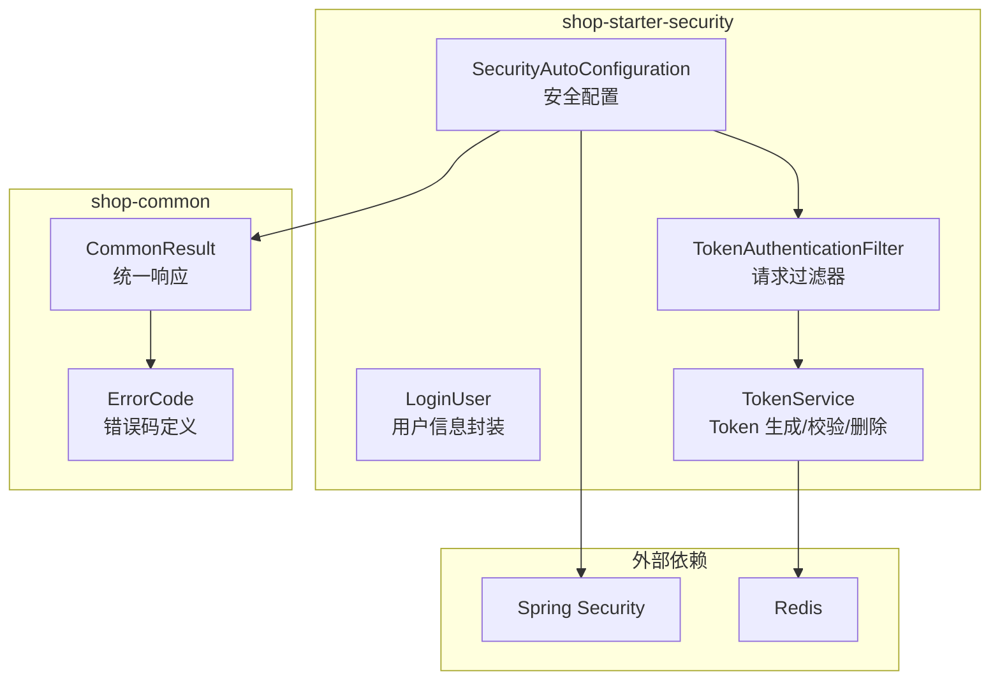
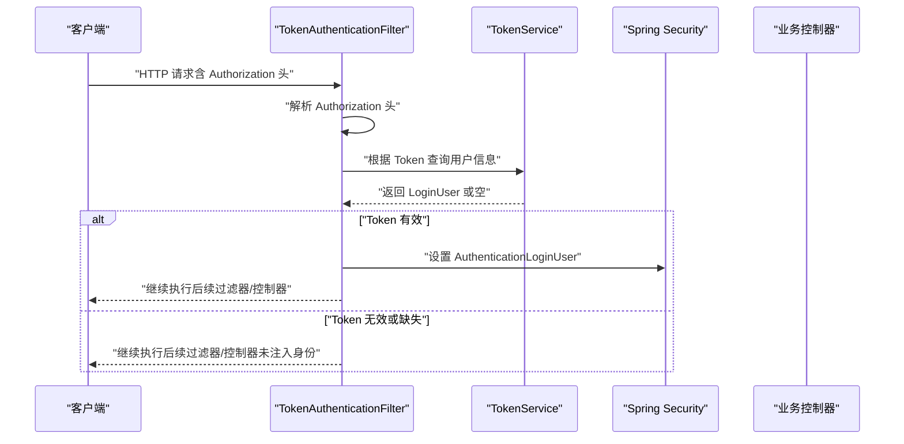
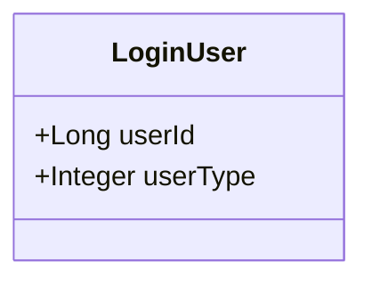
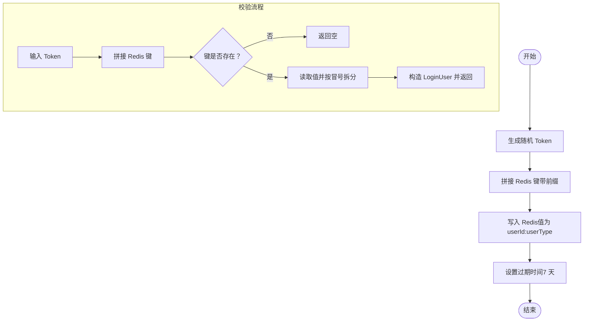
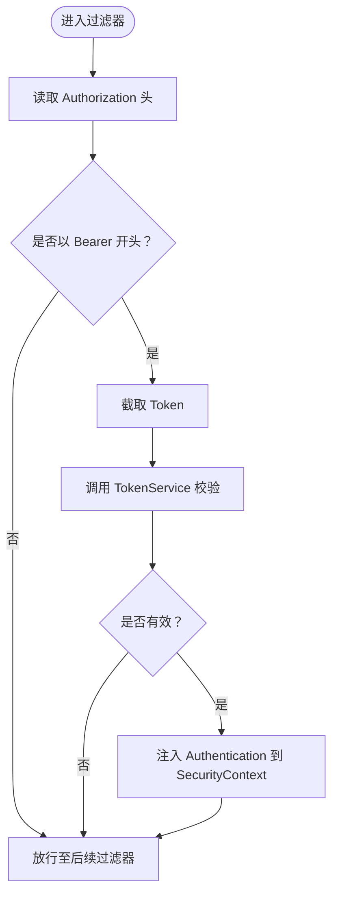
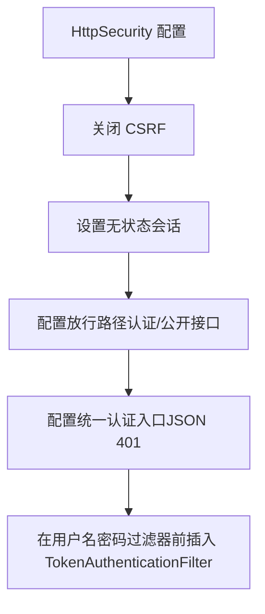
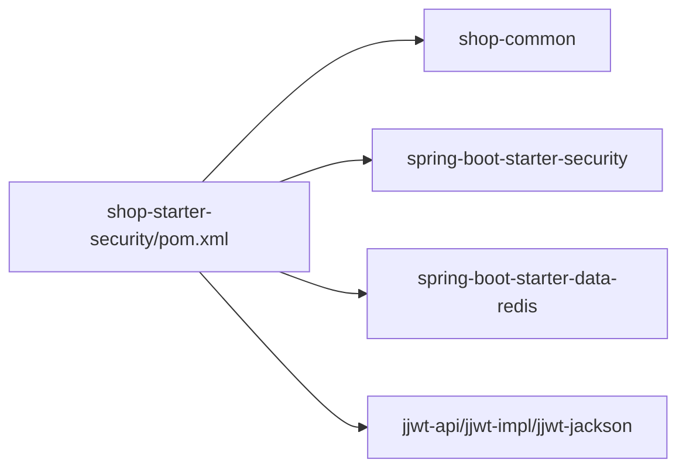

# 安全认证模块（shop-starter-security）

<cite>
**本文引用的文件**
- [LoginUser.java](file://shop-backend/shop-framework/shop-starter-security/src/main/java/com/shop/framework/security/LoginUser.java)
- [TokenService.java](file://shop-backend/shop-framework/shop-starter-security/src/main/java/com/shop/framework/security/TokenService.java)
- [TokenAuthenticationFilter.java](file://shop-backend/shop-framework/shop-starter-security/src/main/java/com/shop/framework/security/TokenAuthenticationFilter.java)
- [SecurityAutoConfiguration.java](file://shop-backend/shop-framework/shop-starter-security/src/main/java/com/shop/framework/security/SecurityAutoConfiguration.java)
- [pom.xml](file://shop-backend/shop-framework/shop-starter-security/pom.xml)
- [CommonResult.java](file://shop-backend/shop-framework/shop-common/src/main/java/com/shop/common/pojo/CommonResult.java)
- [ErrorCode.java](file://shop-backend/shop-framework/shop-common/src/main/java/com/shop/common/exception/ErrorCode.java)
</cite>

## 目录
1. [简介](#简介)
2. [项目结构](#项目结构)
3. [核心组件](#核心组件)
4. [架构总览](#架构总览)
5. [详细组件分析](#详细组件分析)
6. [依赖分析](#依赖分析)
7. [性能考虑](#性能考虑)
8. [故障排查指南](#故障排查指南)
9. [结论](#结论)
10. [附录](#附录)

## 简介
本技术文档聚焦于“药食同源”微信小程序商城后端框架中的安全认证模块（shop-starter-security），系统性解析其基于 Spring Security 的无状态认证与授权机制。该模块采用自定义 Token 体系与 Redis 存储，结合全局过滤器完成请求级的身份注入；通过自动配置类统一声明式地设置拦截规则、异常处理与过滤器链顺序。本文将深入剖析以下关键点：
- JWT 认证机制与安全架构设计
- TokenService 的 Token 生成、校验与生命周期管理
- TokenAuthenticationFilter 的过滤器实现与请求解析
- LoginUser 的用户信息封装
- SecurityAutoConfiguration 的安全配置与拦截规则
- 权限验证机制的实现原理
- 集成方式、使用示例与最佳实践

## 项目结构
shop-starter-security 模块位于 shop-backend/shop-framework/shop-starter-security 下，主要由四个核心 Java 类组成，并通过 Spring Boot 自动装配机制对外暴露安全能力。

图表来源
- [SecurityAutoConfiguration.java:1-47](file://shop-backend/shop-framework/shop-starter-security/src/main/java/com/shop/framework/security/SecurityAutoConfiguration.java#L1-L47)
- [TokenAuthenticationFilter.java:1-43](file://shop-backend/shop-framework/shop-starter-security/src/main/java/com/shop/framework/security/TokenAuthenticationFilter.java#L1-L43)
- [TokenService.java:1-47](file://shop-backend/shop-framework/shop-starter-security/src/main/java/com/shop/framework/security/TokenService.java#L1-L47)
- [LoginUser.java:1-10](file://shop-backend/shop-framework/shop-starter-security/src/main/java/com/shop/framework/security/LoginUser.java#L1-L10)
- [CommonResult.java:1-34](file://shop-backend/shop-framework/shop-common/src/main/java/com/shop/common/pojo/CommonResult.java#L1-L34)
- [ErrorCode.java:1-26](file://shop-backend/shop-framework/shop-common/src/main/java/com/shop/common/exception/ErrorCode.java#L1-L26)

章节来源
- [pom.xml:1-43](file://shop-backend/shop-framework/shop-starter-security/pom.xml#L1-L43)

## 核心组件
- LoginUser：封装当前登录用户的标识与类型，作为认证上下文中的主体对象。
- TokenService：负责 Token 的生成、读取与删除，使用 Redis 存储 Token 到用户信息的映射。
- TokenAuthenticationFilter：从请求头提取 Token，调用 TokenService 校验并注入到 Spring Security 上下文中。
- SecurityAutoConfiguration：声明式配置 CSRF 关闭、无状态会话、公共接口放行、统一认证入口与过滤器链顺序。

章节来源
- [LoginUser.java:1-10](file://shop-backend/shop-framework/shop-starter-security/src/main/java/com/shop/framework/security/LoginUser.java#L1-L10)
- [TokenService.java:1-47](file://shop-backend/shop-framework/shop-starter-security/src/main/java/com/shop/framework/security/TokenService.java#L1-L47)
- [TokenAuthenticationFilter.java:1-43](file://shop-backend/shop-framework/shop-starter-security/src/main/java/com/shop/framework/security/TokenAuthenticationFilter.java#L1-L43)
- [SecurityAutoConfiguration.java:1-47](file://shop-backend/shop-framework/shop-starter-security/src/main/java/com/shop/framework/security/SecurityAutoConfiguration.java#L1-L47)

## 架构总览
整体认证流程采用“无状态 Token + 过滤器注入”的模式：客户端携带 Authorization: Bearer <token> 请求，过滤器解析并校验 Token，成功则将 LoginUser 注入到 SecurityContext 中，后续业务可直接获取当前用户信息。

图表来源
- [TokenAuthenticationFilter.java:20-33](file://shop-backend/shop-framework/shop-starter-security/src/main/java/com/shop/framework/security/TokenAuthenticationFilter.java#L20-L33)
- [TokenService.java:27-41](file://shop-backend/shop-framework/shop-starter-security/src/main/java/com/shop/framework/security/TokenService.java#L27-L41)

## 详细组件分析

### LoginUser 用户信息封装
- 职责：承载当前登录用户的唯一标识与用户类型（如会员/管理员），作为认证主体传递给后续流程。
- 字段：userId、userType（1=会员，2=管理员）。
- 使用场景：被过滤器注入到 SecurityContext，供业务层按需获取当前用户。

图表来源
- [LoginUser.java:6-9](file://shop-backend/shop-framework/shop-starter-security/src/main/java/com/shop/framework/security/LoginUser.java#L6-L9)

章节来源
- [LoginUser.java:1-10](file://shop-backend/shop-framework/shop-starter-security/src/main/java/com/shop/framework/security/LoginUser.java#L1-L10)

### TokenService Token 生成与验证
- Token 生成：随机 UUID 去横线后作为 Token，键前缀为固定前缀，值为“userId:userType”，写入 Redis 并设置过期时间（默认 7 天）。
- Token 校验：根据键前缀拼接 Token 从 Redis 读取值，若存在则拆分出 userId 与 userType，构造 LoginUser 返回；否则返回空。
- Token 删除：按键前缀删除对应记录，用于登出或撤销。
- 生命周期：以 Redis TTL 控制，到期自动失效；支持在业务层扩展刷新策略（见“性能考虑”与“附录”）。

图表来源
- [TokenService.java:19-25](file://shop-backend/shop-framework/shop-starter-security/src/main/java/com/shop/framework/security/TokenService.java#L19-L25)
- [TokenService.java:27-41](file://shop-backend/shop-framework/shop-starter-security/src/main/java/com/shop/framework/security/TokenService.java#L27-L41)

章节来源
- [TokenService.java:1-47](file://shop-backend/shop-framework/shop-starter-security/src/main/java/com/shop/framework/security/TokenService.java#L1-L47)

### TokenAuthenticationFilter 过滤器实现
- 请求头解析：从 Authorization 头提取 Bearer Token。
- 身份注入：若 Token 存在且能解析到 LoginUser，则创建 UsernamePasswordAuthenticationToken 并放入 SecurityContext。
- 执行链路：始终放行至后续过滤器/控制器，未匹配到身份时不会阻断请求。

图表来源
- [TokenAuthenticationFilter.java:20-33](file://shop-backend/shop-framework/shop-starter-security/src/main/java/com/shop/framework/security/TokenAuthenticationFilter.java#L20-L33)
- [TokenAuthenticationFilter.java:35-41](file://shop-backend/shop-framework/shop-starter-security/src/main/java/com/shop/framework/security/TokenAuthenticationFilter.java#L35-L41)

章节来源
- [TokenAuthenticationFilter.java:1-43](file://shop-backend/shop-framework/shop-starter-security/src/main/java/com/shop/framework/security/TokenAuthenticationFilter.java#L1-L43)

### SecurityAutoConfiguration 安全配置
- 无状态会话：禁用 Session，确保前后端分离场景下的可伸缩性。
- 公共接口放行：对移动端与管理端的认证相关接口与公开商品接口免登录。
- 统一认证入口：当未满足放行条件时，统一返回 JSON 错误响应（401 未登录）。
- 过滤器链顺序：在用户名密码过滤器之前插入自定义 TokenAuthenticationFilter，保证身份在认证阶段即被注入。

图表来源
- [SecurityAutoConfiguration.java:20-45](file://shop-backend/shop-framework/shop-starter-security/src/main/java/com/shop/framework/security/SecurityAutoConfiguration.java#L20-L45)

章节来源
- [SecurityAutoConfiguration.java:1-47](file://shop-backend/shop-framework/shop-starter-security/src/main/java/com/shop/framework/security/SecurityAutoConfiguration.java#L1-L47)
- [CommonResult.java:15-32](file://shop-backend/shop-framework/shop-common/src/main/java/com/shop/common/pojo/CommonResult.java#L15-L32)
- [ErrorCode.java:12](file://shop-backend/shop-framework/shop-common/src/main/java/com/shop/common/exception/ErrorCode.java#L12)

## 依赖分析
- 模块依赖：shop-starter-security 依赖 shop-common 提供统一响应与错误码；同时引入 Spring Security 与 Spring Data Redis。
- 外部库：使用 Redis 存储 Token 映射；使用 Jackson 输出统一 JSON 响应；使用 Lombok 简化数据模型。

图表来源
- [pom.xml:14-40](file://shop-backend/shop-framework/shop-starter-security/pom.xml#L14-L40)

章节来源
- [pom.xml:1-43](file://shop-backend/shop-framework/shop-starter-security/pom.xml#L1-L43)

## 性能考虑
- Token 存储与访问：Token 以字符串形式存储在 Redis，键空间前缀统一，便于清理与运维；TTL 控制过期，避免内存膨胀。
- 过滤器开销：每次请求均进行一次 Redis 读取，建议在高并发场景下：
  - 合理设置 Redis 连接池与超时参数
  - 对热点接口可考虑本地缓存短期命中（需注意多实例一致性）
  - 优化放行路径，减少不必要的过滤器链遍历
- Token 刷新策略（建议方案）：
  - 双 Token 模式：Access Token（短周期，如 15 分钟）、Refresh Token（长周期，如 7 天）。Access Token 过期时提示前端刷新，刷新成功后下发新的 Access Token。
  - 服务端校验 Refresh Token 有效性，仅在有效期内签发新 Access Token，并可撤销旧 Access Token。
  - 以上为通用实践建议，具体实现需结合业务与安全策略评估。

## 故障排查指南
- 401 未登录统一响应：当请求未携带有效 Token 且未命中放行规则时，将返回 JSON 错误体（参考错误码与统一响应）。
- 常见问题定位：
  - 请求头格式不正确：确认 Authorization 头为“Bearer <token>”格式
  - Token 已过期或被删除：检查 Redis 中是否存在对应键
  - 放行规则误配：核对 SecurityAutoConfiguration 中的放行路径
  - 异常处理未生效：确认未被其他全局异常处理器覆盖

章节来源
- [SecurityAutoConfiguration.java:33-40](file://shop-backend/shop-framework/shop-starter-security/src/main/java/com/shop/framework/security/SecurityAutoConfiguration.java#L33-L40)
- [CommonResult.java:15-32](file://shop-backend/shop-framework/shop-common/src/main/java/com/shop/common/pojo/CommonResult.java#L15-L32)
- [ErrorCode.java:12](file://shop-backend/shop-framework/shop-common/src/main/java/com/shop/common/exception/ErrorCode.java#L12)

## 结论
本模块通过“无状态 Token + 过滤器注入”的方式实现了轻量、可扩展的认证与授权基础能力。LoginUser 作为认证主体贯穿整个流程，TokenService 提供了可靠的 Token 生命周期管理，SecurityAutoConfiguration 则以声明式方式统一了拦截策略与异常处理。建议在生产环境中配合 Redis 高可用、双 Token 刷新策略与完善的日志审计，进一步提升安全性与稳定性。

## 附录

### 集成与使用示例（步骤说明）
- 在控制器中获取当前用户信息（思路）：
  - 由于当前仓库未提供 @LoginUser 注解的具体实现，可在业务层通过 SecurityContext 获取已注入的 LoginUser，或自行实现参数解析器以支持 @LoginUser 注解。
  - 获取方式参考：从 SecurityContextHolder 获取 Authentication，其 Principal 即为 LoginUser。
- 配置权限拦截规则（思路）：
  - 在 SecurityAutoConfiguration 中的 authorizeHttpRequests 内新增或调整 requestMatchers，即可控制哪些接口需要登录、哪些接口完全公开。
- Token 刷新策略（思路）：
  - 建议引入 Refresh Token 机制，服务端在登录时发放 Access Token 与 Refresh Token；Access Token 过期时，使用 Refresh Token 换取新的 Access Token，并可撤销旧 Token。

### 安全配置参数说明（来自现有配置）
- 会话策略：STATELESS（无状态）
- CSRF：禁用（适用于前后端分离）
- 放行路径：
  - 移动端认证接口：/app-api/member/auth/**
  - 管理端认证接口：/admin-api/system/auth/**
  - 商品公开接口：/app-api/product/**
- 统一认证入口：未登录时返回 JSON 401（UNAUTHORIZED）

章节来源
- [SecurityAutoConfiguration.java:24-31](file://shop-backend/shop-framework/shop-starter-security/src/main/java/com/shop/framework/security/SecurityAutoConfiguration.java#L24-L31)
- [SecurityAutoConfiguration.java:33-40](file://shop-backend/shop-framework/shop-starter-security/src/main/java/com/shop/framework/security/SecurityAutoConfiguration.java#L33-L40)