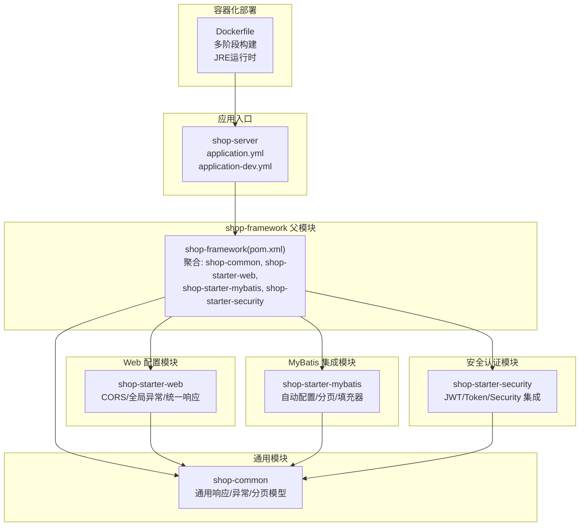
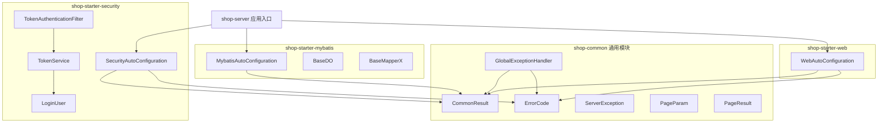
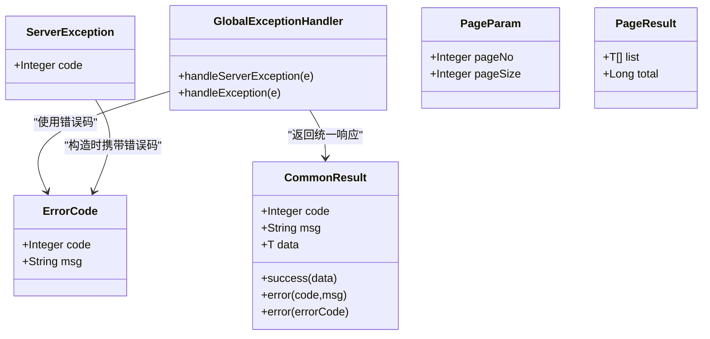
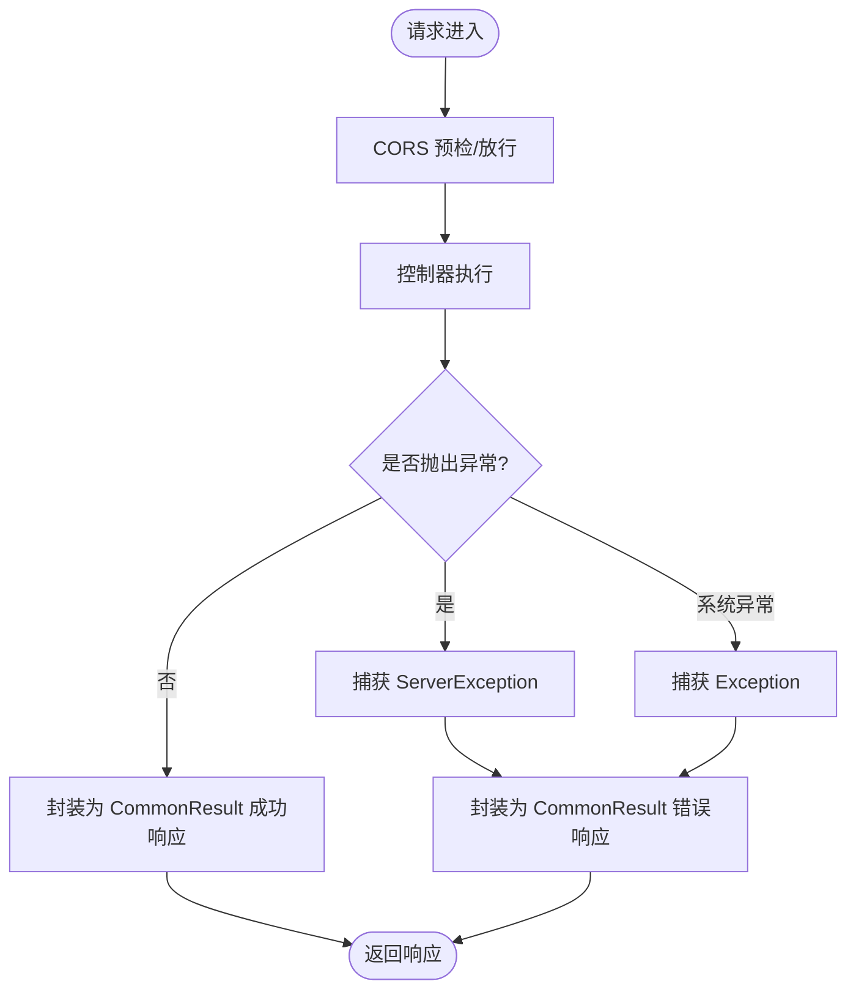
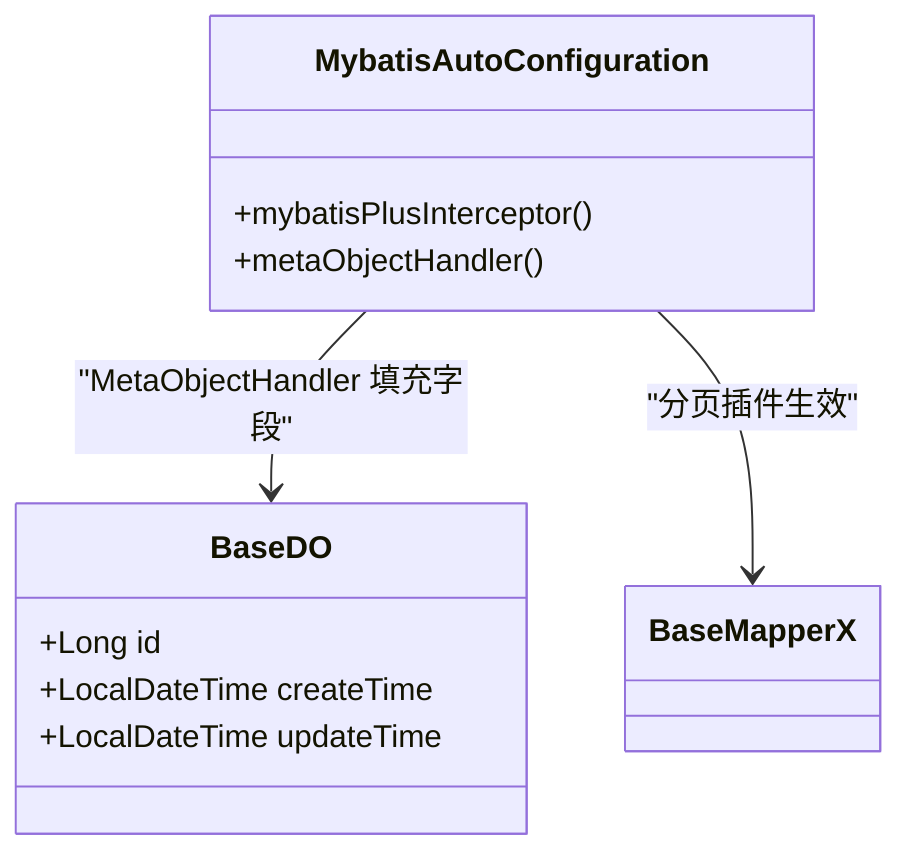
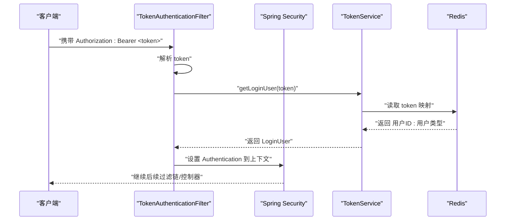
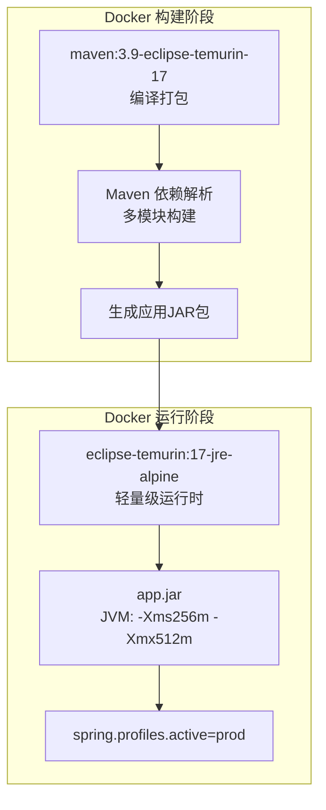
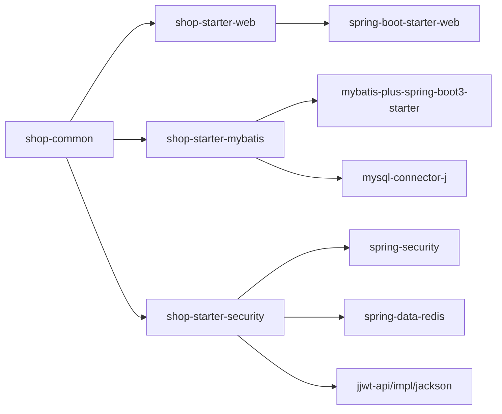

# 框架模块设计

<cite>
**本文引用的文件**
- [Dockerfile](file://shop-backend/Dockerfile)
- [application.yml](file://shop-backend/shop-server/src/main/resources/application.yml)
- [application-dev.yml](file://shop-backend/shop-server/src/main/resources/application-dev.yml)
- [pom.xml](file://shop-backend/shop-framework/pom.xml)
- [shop-common/pom.xml](file://shop-backend/shop-framework/shop-common/pom.xml)
- [shop-starter-web/pom.xml](file://shop-backend/shop-framework/shop-starter-web/pom.xml)
- [shop-starter-mybatis/pom.xml](file://shop-backend/shop-framework/shop-starter-mybatis/pom.xml)
- [shop-starter-security/pom.xml](file://shop-backend/shop-framework/shop-starter-security/pom.xml)
</cite>

## 更新摘要
**所做更改**
- 新增容器化部署支持，包含多阶段Docker构建配置
- 增强应用配置文件结构，支持开发环境特定配置
- 优化starter模块依赖管理，提升模块化程度
- 完善生产环境部署策略和资源限制配置

## 目录
1. [引言](#引言)
2. [项目结构](#项目结构)
3. [核心组件](#核心组件)
4. [架构总览](#架构总览)
5. [详细组件分析](#详细组件分析)
6. [容器化与部署](#容器化与部署)
7. [依赖分析](#依赖分析)
8. [性能考虑](#性能考虑)
9. [故障排查指南](#故障排查指南)
10. [结论](#结论)
11. [附录](#附录)

## 引言
本设计文档面向"药食同源"微信小程序商城后端框架层，聚焦于 shop-framework 基础框架的四大模块：shop-common 通用模块、shop-starter-web Web 配置模块、shop-starter-mybatis MyBatis-Plus 集成模块、shop-starter-security 安全认证模块。文档从职责边界、技术实现原理、配置参数与使用方式入手，系统阐述模块间依赖关系与协作模式，并提供可操作的最佳实践与排障建议，帮助开发者快速理解并正确使用该框架。

## 项目结构
shop-framework 采用多模块聚合工程组织，父 POM 聚合四个子模块，分别承担通用能力、Web 层配置、持久层增强与安全控制。shop-server 作为应用入口，通过引入各 starter 模块完成装配。新增的 Dockerfile 支持容器化部署，提供多阶段构建优化。

**图表来源**
- [pom.xml:15-20](file://shop-backend/shop-framework/pom.xml#L15-L20)
- [application.yml:1-7](file://shop-backend/shop-server/src/main/resources/application.yml#L1-L7)
- [Dockerfile:1-16](file://shop-backend/Dockerfile#L1-L16)

**章节来源**
- [pom.xml:15-20](file://shop-backend/shop-framework/pom.xml#L15-L20)
- [application.yml:1-7](file://shop-backend/shop-server/src/main/resources/application.yml#L1-L7)
- [Dockerfile:1-16](file://shop-backend/Dockerfile#L1-L16)

## 核心组件
本节对四大模块的核心职责与关键类进行概览式说明，后续章节将深入到具体实现与交互流程。

- shop-common 通用模块
  - 统一响应封装：提供通用响应体与成功/错误工厂方法
  - 异常体系：定义业务异常类型与全局异常处理器
  - 分页模型：提供分页入参与分页结果封装
- shop-starter-web Web 配置模块
  - CORS 全局开放策略
  - 全局异常处理，统一返回统一响应体
- shop-starter-mybatis MyBatis-Plus 集成模块
  - 自动配置 MyBatis-Plus 分页插件
  - 实体与 Mapper 基类，统一字段填充
- shop-starter-security 安全认证模块
  - Spring Security 无状态配置
  - Token 签发、解析、失效处理
  - 过滤器链中注入认证上下文

## 架构总览
下图展示模块间依赖与协作关系：应用通过引入各 starter 完成装配；Web 层依赖通用模块以获得统一响应与异常处理；MyBatis 层依赖通用模块以复用统一响应；安全层同样依赖通用模块以统一返回未授权等错误。

**图表来源**
- [shop-starter-web/pom.xml:14-27](file://shop-backend/shop-framework/shop-starter-web/pom.xml#L14-L27)
- [shop-starter-mybatis/pom.xml:14-27](file://shop-backend/shop-framework/shop-starter-mybatis/pom.xml#L14-L27)
- [shop-starter-security/pom.xml:14-41](file://shop-backend/shop-framework/shop-starter-security/pom.xml#L14-L41)
- [shop-common/pom.xml:14-31](file://shop-backend/shop-framework/shop-common/pom.xml#L14-L31)

## 详细组件分析

### shop-common 通用模块
- 统一响应封装
  - CommonResult 提供成功与错误两类工厂方法，便于在控制器中直接返回统一格式
  - 错误码枚举 ErrorCode 定义标准错误码与消息，支持业务扩展
- 异常处理机制
  - ServerException 封装业务异常码与消息
  - GlobalExceptionHandler 对业务异常与系统异常进行统一拦截，返回统一响应体
- 分页模型设计
  - PageParam 默认页码与每页条数
  - PageResult 封装列表与总数，便于前端分页渲染

**章节来源**
- [shop-common/pom.xml:14-31](file://shop-backend/shop-framework/shop-common/pom.xml#L14-L31)

### shop-starter-web Web 配置模块
- CORS 配置
  - 在 WebMvcConfigurer 中开启跨域，允许所有来源、方法、头，并支持凭据与缓存预检请求
- 全局异常处理
  - 结合 shop-common 的统一响应与异常处理器，确保异常输出格式一致
- 统一响应格式
  - 与 shop-common 协作，保证接口返回体风格统一

**章节来源**
- [shop-starter-web/pom.xml:14-27](file://shop-backend/shop-framework/shop-starter-web/pom.xml#L14-L27)

### shop-starter-mybatis MyBatis-Plus 集成模块
- 自动配置
  - 注册 MyBatis-Plus 分页插件，适配 MySQL
- 基础实体与 Mapper
  - BaseDO 统一字段填充（创建时间、更新时间）
  - BaseMapperX 作为通用 Mapper 基类，便于业务扩展
- 与通用模块的协作
  - 通过统一响应体在服务层包装查询结果

**章节来源**
- [shop-starter-mybatis/pom.xml:14-27](file://shop-backend/shop-framework/shop-starter-mybatis/pom.xml#L14-L27)

### shop-starter-security 安全认证模块
- Spring Security 集成
  - 禁用 CSRF，会话策略为无状态
  - 白名单路径（如登录、公开接口）放行，其余均需认证
  - 认证失败时返回统一未授权响应
- JWT 认证机制
  - TokenAuthenticationFilter 从 Authorization 头解析 Bearer Token
  - TokenService 负责签发、查询与删除 Token，基于 Redis 存储
  - LoginUser 承载当前登录用户标识（用户ID与用户类型）

**章节来源**
- [shop-starter-security/pom.xml:14-41](file://shop-backend/shop-framework/shop-starter-security/pom.xml#L14-L41)

## 容器化与部署

### Docker 多阶段构建
框架支持现代化的容器化部署，采用多阶段构建策略优化镜像大小和安全性：

- **构建阶段**：使用 Maven 3.9 + Eclipse Temurin JDK 17 进行编译打包
- **运行阶段**：使用轻量级 Alpine Linux + JRE 17 运行环境
- **资源优化**：配置 JVM 内存限制（最小256MB，最大512MB）
- **端口暴露**：默认暴露80端口，支持反向代理部署

### 环境配置管理
应用采用分层配置策略，支持不同环境的差异化配置：

- **主配置文件** (application.yml)：定义激活的环境配置
- **开发环境配置** (application-dev.yml)：本地开发数据库、Redis、日志级别等配置
- **生产环境配置**：通过环境变量或外部配置文件覆盖默认值

**图表来源**
- [Dockerfile:1-16](file://shop-backend/Dockerfile#L1-L16)
- [application.yml:1-7](file://shop-backend/shop-server/src/main/resources/application.yml#L1-L7)
- [application-dev.yml:1-26](file://shop-backend/shop-server/src/main/resources/application-dev.yml#L1-L26)

**章节来源**
- [Dockerfile:1-16](file://shop-backend/Dockerfile#L1-L16)
- [application.yml:1-7](file://shop-backend/shop-server/src/main/resources/application.yml#L1-L7)
- [application-dev.yml:1-26](file://shop-backend/shop-server/src/main/resources/application-dev.yml#L1-L26)

## 依赖分析
- 模块内聚与耦合
  - shop-common 为纯工具模块，不依赖其他框架模块，高内聚低耦合
  - shop-starter-web 依赖 shop-common，提供 Web 层装配
  - shop-starter-mybatis 依赖 shop-common，提供持久层装配
  - shop-starter-security 依赖 shop-common，提供安全层装配
- 外部依赖
  - shop-starter-web：spring-boot-starter-web、validation
  - shop-starter-mybatis：mybatis-plus-spring-boot3-starter、mysql-connector-j
  - shop-starter-security：spring-security、spring-data-redis、jjwt-api/impl/jackson
- 自动装配导入
  - 各模块通过 spring.factories 或 spring imports 文件声明自动配置类，由 Spring Boot 自动发现并加载

**图表来源**
- [shop-common/pom.xml:14-31](file://shop-backend/shop-framework/shop-common/pom.xml#L14-L31)
- [shop-starter-web/pom.xml:14-27](file://shop-backend/shop-framework/shop-starter-web/pom.xml#L14-L27)
- [shop-starter-mybatis/pom.xml:14-27](file://shop-backend/shop-framework/shop-starter-mybatis/pom.xml#L14-L27)
- [shop-starter-security/pom.xml:14-41](file://shop-backend/shop-framework/shop-starter-security/pom.xml#L14-L41)

**章节来源**
- [shop-common/pom.xml:14-31](file://shop-backend/shop-framework/shop-common/pom.xml#L14-L31)
- [shop-starter-web/pom.xml:14-27](file://shop-backend/shop-framework/shop-starter-web/pom.xml#L14-L27)
- [shop-starter-mybatis/pom.xml:14-27](file://shop-backend/shop-framework/shop-starter-mybatis/pom.xml#L14-L27)
- [shop-starter-security/pom.xml:14-41](file://shop-backend/shop-framework/shop-starter-security/pom.xml#L14-L41)

## 性能考虑
- 分页与数据库访问
  - 使用 MyBatis-Plus 分页插件，避免一次性加载大表数据，降低内存与网络压力
- Redis 缓存 Token
  - Token 存储于 Redis，具备过期时间与原子性操作，适合高并发场景
- 无状态认证
  - Spring Security 无状态策略减少服务器端会话开销，利于横向扩展
- 统一异常处理
  - 避免异常栈泄露，减少日志噪音，提升可观测性与稳定性
- 容器化资源限制
  - 通过 JVM 参数限制内存使用，防止容器OOM
  - 多阶段构建减小镜像体积，提升部署效率

## 故障排查指南
- 接口返回非预期格式
  - 确认是否正确引入 shop-starter-web 与 shop-common，检查全局异常处理器是否生效
- 跨域问题
  - 检查 Web 配置中的 CORS 规则是否覆盖目标域名与方法
- 分页无效或字段缺失
  - 确认业务 Mapper 是否继承 BaseMapperX，以及 BaseDO 是否包含统一字段
- 认证失败或未生效
  - 检查请求头 Authorization 是否为 Bearer Token，确认 TokenService 与 Redis 配置
  - 查看未授权返回是否为统一响应体，定位白名单路径配置
- 容器化部署问题
  - 检查 Dockerfile 构建阶段是否正确复制所有模块
  - 验证 JRE 版本与编译版本兼容性
  - 确认端口映射和环境变量配置

**章节来源**
- [Dockerfile:1-16](file://shop-backend/Dockerfile#L1-L16)
- [application-dev.yml:1-26](file://shop-backend/shop-server/src/main/resources/application-dev.yml#L1-L26)

## 结论
shop-framework 四大模块以 shop-common 为核心，分别在 Web、持久层与安全层提供开箱即用的能力：统一响应与异常、CORS 放行、MyBatis-Plus 分页与字段填充、基于 Redis 的 Token 认证与 Spring Security 集成。新增的容器化支持提供了现代化的部署方案，通过多阶段构建优化镜像大小，配合分层配置管理满足不同环境需求。模块间通过清晰的依赖关系与自动装配机制协同工作，既保证了开发效率，也兼顾了可维护性与扩展性。建议在新业务模块中优先引入对应 starter，遵循统一响应与异常规范，确保整体一致性。

## 附录
- 使用建议
  - 控制器返回值一律使用统一响应封装，避免直接返回原始对象
  - 业务异常统一抛出 ServerException 并指定业务错误码
  - 分页查询使用 PageParam 与 PageResult，保持前后端分页契约一致
  - 安全相关接口按白名单配置，非公开接口必须鉴权
- 最佳实践
  - 在 shop-server 中仅引入所需 starter，避免冗余依赖
  - 将公共配置集中于 shop-common，业务模块只关注领域逻辑
  - 对 Redis 与数据库连接参数进行环境化配置，确保生产可用
  - 使用 Docker 多阶段构建优化镜像大小，配置合理的 JVM 内存参数
  - 通过环境变量管理敏感配置，避免硬编码在生产环境中