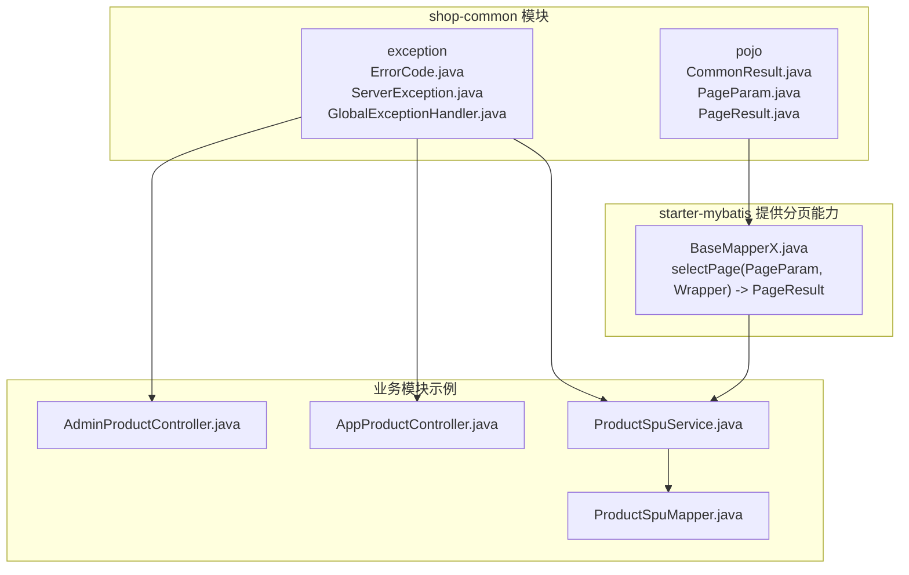
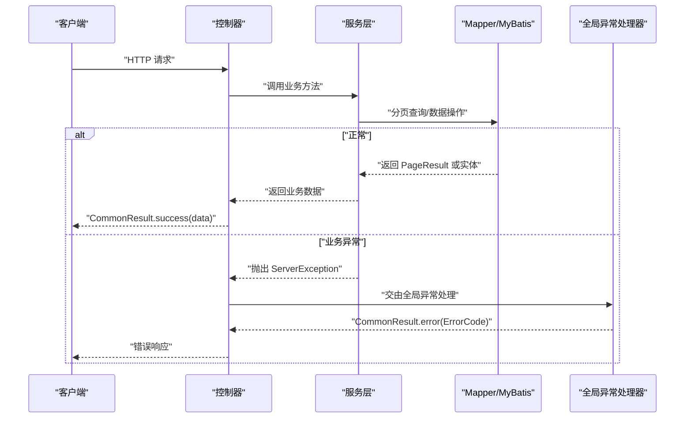
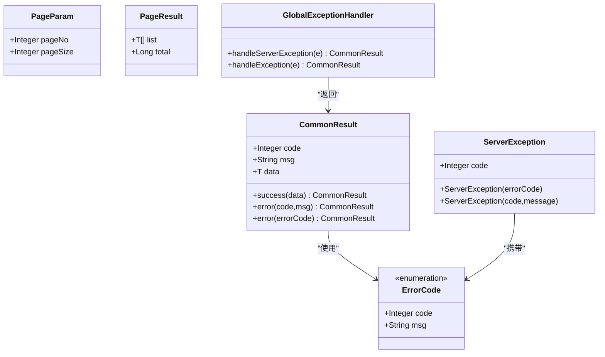
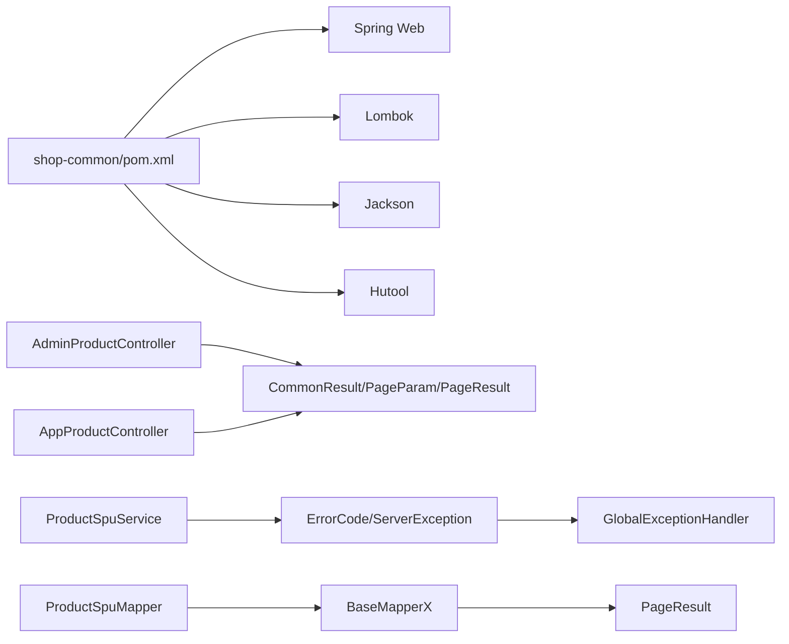

# 通用模块 (shop-common)

<cite>
**本文引用的文件列表**
- [CommonResult.java](file://shop-backend/shop-framework/shop-common/src/main/java/com/shop/common/pojo/CommonResult.java)
- [PageResult.java](file://shop-backend/shop-framework/shop-common/src/main/java/com/shop/common/pojo/PageResult.java)
- [PageParam.java](file://shop-backend/shop-framework/shop-common/src/main/java/com/shop/common/pojo/PageParam.java)
- [ErrorCode.java](file://shop-backend/shop-framework/shop-common/src/main/java/com/shop/common/exception/ErrorCode.java)
- [ServerException.java](file://shop-backend/shop-framework/shop-common/src/main/java/com/shop/common/exception/ServerException.java)
- [GlobalExceptionHandler.java](file://shop-backend/shop-framework/shop-common/src/main/java/com/shop/common/exception/GlobalExceptionHandler.java)
- [pom.xml](file://shop-backend/shop-framework/shop-common/pom.xml)
- [AdminProductController.java](file://shop-backend/shop-module-product/src/main/java/com/shop/module/product/controller/admin/AdminProductController.java)
- [AppProductController.java](file://shop-backend/shop-module-product/src/main/java/com/shop/module/product/controller/app/AppProductController.java)
- [ProductSpuService.java](file://shop-backend/shop-module-product/src/main/java/com/shop/module/product/service/ProductSpuService.java)
- [ProductSpuMapper.java](file://shop-backend/shop-module-product/src/main/java/com/shop/module/product/dal/mysql/ProductSpuMapper.java)
- [BaseMapperX.java](file://shop-backend/shop-framework/shop-starter-mybatis/src/main/java/com/shop/framework/mybatis/core/BaseMapperX.java)
</cite>

## 目录
1. [简介](#简介)
2. [项目结构](#项目结构)
3. [核心组件](#核心组件)
4. [架构总览](#架构总览)
5. [组件详细分析](#组件详细分析)
6. [依赖关系分析](#依赖关系分析)
7. [性能与扩展性考虑](#性能与扩展性考虑)
8. [故障排查指南](#故障排查指南)
9. [结论](#结论)
10. [附录：使用示例与最佳实践](#附录使用示例与最佳实践)

## 简介
本文件面向“药食同源”微信小程序商城后端的通用模块（shop-common），系统化梳理其设计理念与实现细节，重点覆盖以下方面：
- 统一响应封装（CommonResult）
- 分页模型（PageParam、PageResult）
- 异常体系（ErrorCode、ServerException）
- 全局异常处理（GlobalExceptionHandler）
- 在业务模块中的典型用法与最佳实践

该模块通过标准化的响应格式、分页约定与异常处理策略，降低各业务模块重复编码成本，提升接口一致性与可维护性。

## 项目结构
shop-common 模块位于 shop-backend/shop-framework/shop-common 下，采用“pojo + exception”的分层组织方式，并通过 Spring Boot Starter 集成 Web 能力与 Lombok、Jackson 等常用工具库。

图表来源
- [CommonResult.java:1-34](file://shop-backend/shop-framework/shop-common/src/main/java/com/shop/common/pojo/CommonResult.java#L1-L34)
- [PageParam.java:1-12](file://shop-backend/shop-framework/shop-common/src/main/java/com/shop/common/pojo/PageParam.java#L1-L12)
- [PageResult.java:1-18](file://shop-backend/shop-framework/shop-common/src/main/java/com/shop/common/pojo/PageResult.java#L1-L18)
- [ErrorCode.java:1-26](file://shop-backend/shop-framework/shop-common/src/main/java/com/shop/common/exception/ErrorCode.java#L1-L26)
- [ServerException.java:1-20](file://shop-backend/shop-framework/shop-common/src/main/java/com/shop/common/exception/ServerException.java#L1-L20)
- [GlobalExceptionHandler.java:1-24](file://shop-backend/shop-framework/shop-common/src/main/java/com/shop/common/exception/GlobalExceptionHandler.java#L1-L24)
- [BaseMapperX.java:1-15](file://shop-backend/shop-framework/shop-starter-mybatis/src/main/java/com/shop/framework/mybatis/core/BaseMapperX.java#L1-L15)
- [AdminProductController.java:1-41](file://shop-backend/shop-module-product/src/main/java/com/shop/module/product/controller/admin/AdminProductController.java#L1-L41)
- [AppProductController.java:1-39](file://shop-backend/shop-module-product/src/main/java/com/shop/module/product/controller/app/AppProductController.java#L1-L39)
- [ProductSpuService.java:1-53](file://shop-backend/shop-module-product/src/main/java/com/shop/module/product/service/ProductSpuService.java#L1-L53)
- [ProductSpuMapper.java:1-10](file://shop-backend/shop-module-product/src/main/java/com/shop/module/product/dal/mysql/ProductSpuMapper.java#L1-L10)

章节来源
- [pom.xml:1-33](file://shop-backend/shop-framework/shop-common/pom.xml#L1-L33)

## 核心组件
- 统一响应封装（CommonResult<T>）
  - 职责：统一输出接口响应结构，包含状态码、消息与数据体，支持泛型承载任意业务数据。
  - 关键方法：success(data)、error(code,msg)、error(ErrorCode)。
  - 使用场景：控制器返回值统一包装；前端稳定解析。
- 分页模型（PageParam、PageResult）
  - PageParam：默认页码与每页条数，作为分页入参。
  - PageResult：封装分页结果集与总数，作为分页出参。
  - 使用场景：列表查询、后台管理、商品分页等。
- 异常体系（ErrorCode、ServerException）
  - ErrorCode：定义标准错误码与消息，涵盖通用错误与业务错误。
  - ServerException：继承 RuntimeException，携带业务错误码，用于抛出受检业务异常。
- 全局异常处理（GlobalExceptionHandler）
  - 职责：拦截业务异常与系统异常，统一转换为 CommonResult 错误响应，记录日志。

章节来源
- [CommonResult.java:1-34](file://shop-backend/shop-framework/shop-common/src/main/java/com/shop/common/pojo/CommonResult.java#L1-L34)
- [PageParam.java:1-12](file://shop-backend/shop-framework/shop-common/src/main/java/com/shop/common/pojo/PageParam.java#L1-L12)
- [PageResult.java:1-18](file://shop-backend/shop-framework/shop-common/src/main/java/com/shop/common/pojo/PageResult.java#L1-L18)
- [ErrorCode.java:1-26](file://shop-backend/shop-framework/shop-common/src/main/java/com/shop/common/exception/ErrorCode.java#L1-L26)
- [ServerException.java:1-20](file://shop-backend/shop-framework/shop-common/src/main/java/com/shop/common/exception/ServerException.java#L1-L20)
- [GlobalExceptionHandler.java:1-24](file://shop-backend/shop-framework/shop-common/src/main/java/com/shop/common/exception/GlobalExceptionHandler.java#L1-L24)

## 架构总览
通用模块与业务模块的交互路径如下：
- 控制器接收请求，调用服务层；
- 服务层执行业务逻辑，必要时抛出 ServerException；
- MyBatis 扩展 BaseMapperX 提供 selectPage，返回 PageResult；
- GlobalExceptionHandler 捕获异常，统一返回 CommonResult 错误响应；
- 控制器最终返回 CommonResult 成功响应。

图表来源
- [AdminProductController.java:1-41](file://shop-backend/shop-module-product/src/main/java/com/shop/module/product/controller/admin/AdminProductController.java#L1-L41)
- [AppProductController.java:1-39](file://shop-backend/shop-module-product/src/main/java/com/shop/module/product/controller/app/AppProductController.java#L1-L39)
- [ProductSpuService.java:1-53](file://shop-backend/shop-module-product/src/main/java/com/shop/module/product/service/ProductSpuService.java#L1-L53)
- [ProductSpuMapper.java:1-10](file://shop-backend/shop-module-product/src/main/java/com/shop/module/product/dal/mysql/ProductSpuMapper.java#L1-L10)
- [BaseMapperX.java:1-15](file://shop-backend/shop-framework/shop-starter-mybatis/src/main/java/com/shop/framework/mybatis/core/BaseMapperX.java#L1-L15)
- [GlobalExceptionHandler.java:1-24](file://shop-backend/shop-framework/shop-common/src/main/java/com/shop/common/exception/GlobalExceptionHandler.java#L1-L24)

## 组件详细分析

### 统一响应封装（CommonResult）
- 设计要点
  - 固定三段式结构：code、msg、data，便于前端统一处理。
  - 泛型承载任意数据类型，减少额外包装。
  - 提供静态工厂方法，简化成功与错误响应构造。
- 方法与行为
  - success(data)：返回 code=0、msg="success" 的成功响应。
  - error(code,msg)：返回指定错误码与消息。
  - error(ErrorCode)：基于枚举快速生成标准错误响应。
- 使用建议
  - 控制器层统一使用 CommonResult.success 包装返回值。
  - 对于需要自定义错误码的场景，优先使用 ErrorCode 枚举保证一致性。

章节来源
- [CommonResult.java:1-34](file://shop-backend/shop-framework/shop-common/src/main/java/com/shop/common/pojo/CommonResult.java#L1-L34)

### 分页模型（PageParam、PageResult）
- PageParam
  - 默认页码与默认每页大小，满足大多数列表查询需求。
  - 可通过控制器参数绑定直接接收。
- PageResult
  - list：当前页数据集合。
  - total：总记录数。
- 分页实现链路
  - 控制器接收 PageParam，调用服务层。
  - 服务层构建查询条件，委托 Mapper.selectPage。
  - BaseMapperX 将 MyBatis Plus 的 IPage 转换为通用 PageResult。
- 复杂度与性能
  - 查询复杂度取决于具体 SQL 与索引设计；PageParam 的合理取值能有效控制单页数据量。
  - 建议对高频分页字段建立索引，避免全表扫描。

章节来源
- [PageParam.java:1-12](file://shop-backend/shop-framework/shop-common/src/main/java/com/shop/common/pojo/PageParam.java#L1-L12)
- [PageResult.java:1-18](file://shop-backend/shop-framework/shop-common/src/main/java/com/shop/common/pojo/PageResult.java#L1-L18)
- [BaseMapperX.java:1-15](file://shop-backend/shop-framework/shop-starter-mybatis/src/main/java/com/shop/framework/mybatis/core/BaseMapperX.java#L1-L15)

### 异常体系（ErrorCode、ServerException）
- ErrorCode
  - 通用错误：SUCCESS、BAD_REQUEST、UNAUTHORIZED、FORBIDDEN、NOT_FOUND、INTERNAL_ERROR。
  - 业务错误：以 1001+ 开头，如用户不存在、Token 过期、商品不存在、商品已下架等。
  - 作用：统一前后端错误语义，便于前端提示与埋点统计。
- ServerException
  - 支持两种构造：基于 ErrorCode 与基于自定义错误码。
  - 继承 RuntimeException，适合在业务流程中抛出受检异常。
- 最佳实践
  - 业务校验失败时优先抛出 ServerException(ErrorCode.XXX)。
  - 自定义错误码仅在特殊场景使用，避免枚举膨胀。

章节来源
- [ErrorCode.java:1-26](file://shop-backend/shop-framework/shop-common/src/main/java/com/shop/common/exception/ErrorCode.java#L1-L26)
- [ServerException.java:1-20](file://shop-backend/shop-framework/shop-common/src/main/java/com/shop/common/exception/ServerException.java#L1-L20)

### 全局异常处理（GlobalExceptionHandler）
- 处理策略
  - 拦截 ServerException：记录告警日志，返回对应错误码与消息。
  - 拦截 Exception：记录错误日志，返回系统内部错误。
- 与统一响应的衔接
  - 返回 CommonResult.error(...)，确保前后端一致的错误结构。
- 日志与可观测性
  - 使用 SLF4J 记录关键信息，便于问题定位与审计。

章节来源
- [GlobalExceptionHandler.java:1-24](file://shop-backend/shop-framework/shop-common/src/main/java/com/shop/common/exception/GlobalExceptionHandler.java#L1-L24)

### 类关系图（代码级）

图表来源
- [CommonResult.java:1-34](file://shop-backend/shop-framework/shop-common/src/main/java/com/shop/common/pojo/CommonResult.java#L1-L34)
- [PageParam.java:1-12](file://shop-backend/shop-framework/shop-common/src/main/java/com/shop/common/pojo/PageParam.java#L1-L12)
- [PageResult.java:1-18](file://shop-backend/shop-framework/shop-common/src/main/java/com/shop/common/pojo/PageResult.java#L1-L18)
- [ErrorCode.java:1-26](file://shop-backend/shop-framework/shop-common/src/main/java/com/shop/common/exception/ErrorCode.java#L1-L26)
- [ServerException.java:1-20](file://shop-backend/shop-framework/shop-common/src/main/java/com/shop/common/exception/ServerException.java#L1-L20)
- [GlobalExceptionHandler.java:1-24](file://shop-backend/shop-framework/shop-common/src/main/java/com/shop/common/exception/GlobalExceptionHandler.java#L1-L24)

## 依赖关系分析
- 模块依赖
  - shop-common 依赖 Spring Web、Lombok、Jackson、Hutool 等基础库。
  - 业务模块通过控制器直接使用 shop-common 的 POJO 与异常类型。
- 与 MyBatis 扩展的关系
  - BaseMapperX 提供 selectPage(PageParam, Wrapper) -> PageResult 的适配，使分页查询标准化。
- 耦合与内聚
  - 通用模块低耦合、高内聚，仅暴露 POJO 与异常类型，不引入业务逻辑。
  - 业务模块仅依赖通用模块的契约，便于替换与扩展。

图表来源
- [pom.xml:1-33](file://shop-backend/shop-framework/shop-common/pom.xml#L1-L33)
- [AdminProductController.java:1-41](file://shop-backend/shop-module-product/src/main/java/com/shop/module/product/controller/admin/AdminProductController.java#L1-L41)
- [AppProductController.java:1-39](file://shop-backend/shop-module-product/src/main/java/com/shop/module/product/controller/app/AppProductController.java#L1-L39)
- [ProductSpuService.java:1-53](file://shop-backend/shop-module-product/src/main/java/com/shop/module/product/service/ProductSpuService.java#L1-L53)
- [ProductSpuMapper.java:1-10](file://shop-backend/shop-module-product/src/main/java/com/shop/module/product/dal/mysql/ProductSpuMapper.java#L1-L10)
- [BaseMapperX.java:1-15](file://shop-backend/shop-framework/shop-starter-mybatis/src/main/java/com/shop/framework/mybatis/core/BaseMapperX.java#L1-L15)

章节来源
- [pom.xml:1-33](file://shop-backend/shop-framework/shop-common/pom.xml#L1-L33)

## 性能与扩展性考虑
- 分页性能
  - 合理设置 pageSize，避免过大导致内存压力与网络传输开销。
  - 对分页字段建立合适索引，减少排序与过滤成本。
- 异常处理
  - 业务异常应尽量在上层聚合，避免频繁抛出与捕获。
  - 对高频异常进行限流或熔断，防止雪崩效应。
- 响应体积
  - 列表接口可按需裁剪字段，减少 JSON 序列化与传输时间。
- 可观测性
  - 在全局异常处理器中增加 traceId、用户标识等上下文信息，便于追踪。

## 故障排查指南
- 常见问题与定位
  - 接口返回错误但前端未显示：检查 GlobalExceptionHandler 是否正确拦截并返回 CommonResult.error。
  - 分页查询结果为空：确认 PageParam 默认值是否合理，SQL 条件是否正确。
  - 业务异常未被捕获：确认服务层是否抛出 ServerException，且未被更上层 catch。
- 日志与监控
  - 业务异常：查看 warn 日志，核对 code 与 msg。
  - 系统异常：查看 error 日志，定位堆栈与异常根因。
- 快速修复建议
  - 若为参数错误，使用 ErrorCode.BAD_REQUEST 并在控制器层校验参数。
  - 若为资源不存在，使用相应业务错误码（如商品不存在）。

章节来源
- [GlobalExceptionHandler.java:1-24](file://shop-backend/shop-framework/shop-common/src/main/java/com/shop/common/exception/GlobalExceptionHandler.java#L1-L24)
- [ProductSpuService.java:1-53](file://shop-backend/shop-module-product/src/main/java/com/shop/module/product/service/ProductSpuService.java#L1-L53)

## 结论
shop-common 通过统一响应、标准分页与异常体系，显著提升了系统的规范性与可维护性。配合 MyBatis 扩展与全局异常处理，实现了从“输入参数 -> 业务处理 -> 统一输出”的闭环。建议在后续迭代中：
- 持续完善 ErrorCode 枚举，覆盖更多业务场景；
- 在控制器层增加参数校验与前置拦截，减少无效请求；
- 对高频接口引入缓存与限流策略，提升整体吞吐。

## 附录：使用示例与最佳实践

### 在控制器中使用统一响应与分页
- 示例路径
  - [AdminProductController.java:18-21](file://shop-backend/shop-module-product/src/main/java/com/shop/module/product/controller/admin/AdminProductController.java#L18-L21)
  - [AppProductController.java:28-32](file://shop-backend/shop-module-product/src/main/java/com/shop/module/product/controller/app/AppProductController.java#L28-L32)
- 关键点
  - 使用 PageParam 作为分页入参，直接注入到控制器方法参数中。
  - 使用 CommonResult.success 包装返回值，确保响应结构一致。
  - 对于非分页列表，直接返回 List 即可，由 CommonResult.success 统一封装。

章节来源
- [AdminProductController.java:1-41](file://shop-backend/shop-module-product/src/main/java/com/shop/module/product/controller/admin/AdminProductController.java#L1-L41)
- [AppProductController.java:1-39](file://shop-backend/shop-module-product/src/main/java/com/shop/module/product/controller/app/AppProductController.java#L1-L39)

### 在服务层抛出业务异常
- 示例路径
  - [ProductSpuService.java:27-33](file://shop-backend/shop-module-product/src/main/java/com/shop/module/product/service/ProductSpuService.java#L27-L33)
- 关键点
  - 当业务对象不存在时，抛出 ServerException(ErrorCode.PRODUCT_NOT_EXISTS)，由全局异常处理器统一拦截并返回错误响应。
  - 对于其他业务校验失败，选择合适的 ErrorCode 枚举，保持错误语义清晰。

章节来源
- [ProductSpuService.java:1-53](file://shop-backend/shop-module-product/src/main/java/com/shop/module/product/service/ProductSpuService.java#L1-L53)

### 分页查询的标准实现
- 示例路径
  - [ProductSpuService.java:19-25](file://shop-backend/shop-module-product/src/main/java/com/shop/module/product/service/ProductSpuService.java#L19-L25)
  - [ProductSpuMapper.java:1-10](file://shop-backend/shop-module-product/src/main/java/com/shop/module/product/dal/mysql/ProductSpuMapper.java#L1-L10)
  - [BaseMapperX.java:11-14](file://shop-backend/shop-framework/shop-starter-mybatis/src/main/java/com/shop/framework/mybatis/core/BaseMapperX.java#L11-L14)
- 关键点
  - 服务层构建查询条件（如状态、分类 ID 等），调用 selectPage(PageParam, Wrapper)。
  - BaseMapperX 将 MyBatis Plus 的 IPage 转换为通用 PageResult，自动填充 list 与 total。
  - 控制器直接返回 CommonResult.success(PageResult)。

章节来源
- [ProductSpuService.java:1-53](file://shop-backend/shop-module-product/src/main/java/com/shop/module/product/service/ProductSpuService.java#L1-L53)
- [ProductSpuMapper.java:1-10](file://shop-backend/shop-module-product/src/main/java/com/shop/module/product/dal/mysql/ProductSpuMapper.java#L1-L10)
- [BaseMapperX.java:1-15](file://shop-backend/shop-framework/shop-starter-mybatis/src/main/java/com/shop/framework/mybatis/core/BaseMapperX.java#L1-L15)

### 全局异常处理的统一策略
- 示例路径
  - [GlobalExceptionHandler.java:12-22](file://shop-backend/shop-framework/shop-common/src/main/java/com/shop/common/exception/GlobalExceptionHandler.java#L12-L22)
- 关键点
  - 拦截 ServerException：记录告警日志，返回 CommonResult.error(code,msg)。
  - 拦截 Exception：记录错误日志，返回 ErrorCode.INTERNAL_ERROR。
  - 保证前后端错误结构一致，便于前端统一处理。

章节来源
- [GlobalExceptionHandler.java:1-24](file://shop-backend/shop-framework/shop-common/src/main/java/com/shop/common/exception/GlobalExceptionHandler.java#L1-L24)