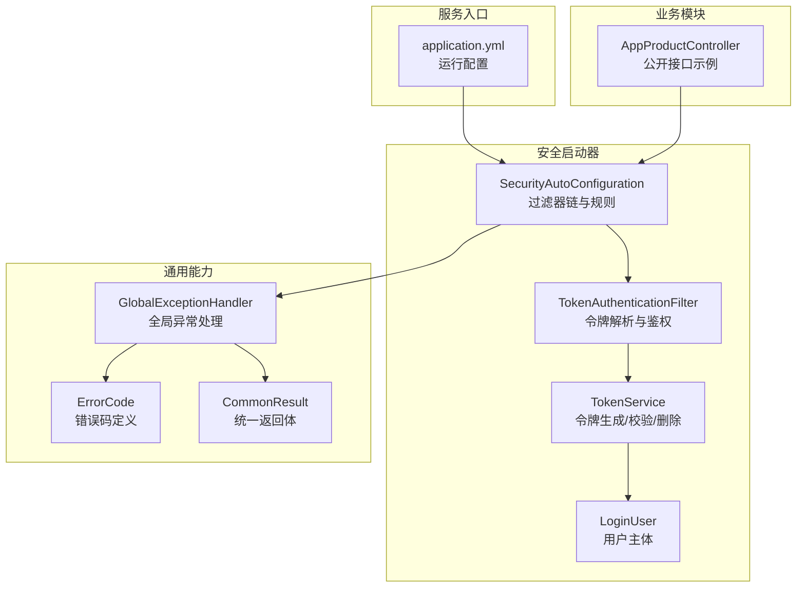
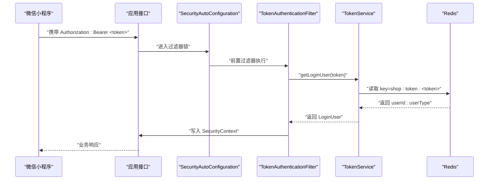
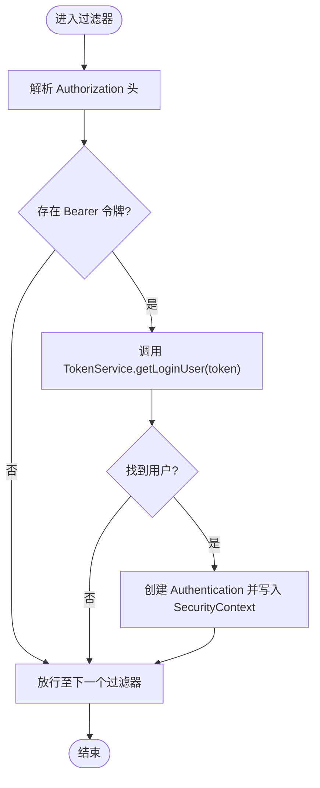
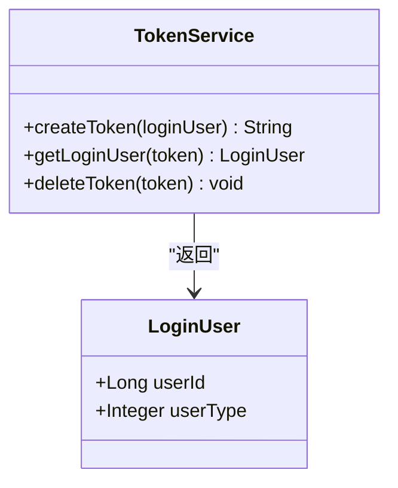
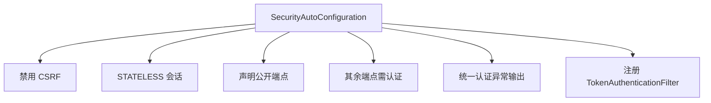
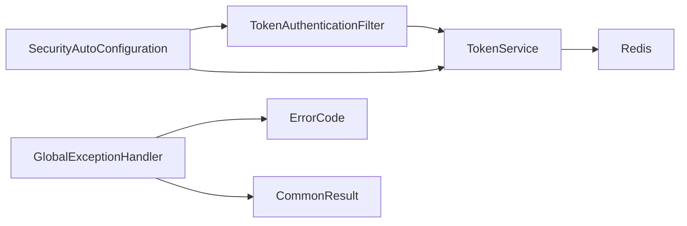

# 安全设计

<cite>
**本文引用的文件**
- [TokenAuthenticationFilter.java](file://shop-backend/shop-framework/shop-starter-security/src/main/java/com/shop/framework/security/TokenAuthenticationFilter.java)
- [TokenService.java](file://shop-backend/shop-framework/shop-starter-security/src/main/java/com/shop/framework/security/TokenService.java)
- [LoginUser.java](file://shop-backend/shop-framework/shop-starter-security/src/main/java/com/shop/framework/security/LoginUser.java)
- [SecurityAutoConfiguration.java](file://shop-backend/shop-framework/shop-starter-security/src/main/java/com/shop/framework/security/SecurityAutoConfiguration.java)
- [GlobalExceptionHandler.java](file://shop-backend/shop-framework/shop-common/src/main/java/com/shop/common/exception/GlobalExceptionHandler.java)
- [ErrorCode.java](file://shop-backend/shop-framework/shop-common/src/main/java/com/shop/common/exception/ErrorCode.java)
- [CommonResult.java](file://shop-backend/shop-framework/shop-common/src/main/java/com/shop/common/pojo/CommonResult.java)
- [application.yml](file://shop-backend/shop-server/src/main/resources/application.yml)
- [init.sql](file://sql/init.sql)
- [AppProductController.java](file://shop-backend/shop-module-product/src/main/java/com/shop/module/product/controller/app/AppProductController.java)
- [MybatisAutoConfiguration.java](file://shop-backend/shop-framework/shop-starter-mybatis/src/main/java/com/shop/framework/mybatis/MybatisAutoConfiguration.java)
</cite>

## 目录
1. [引言](#引言)
2. [项目结构](#项目结构)
3. [核心组件](#核心组件)
4. [架构总览](#架构总览)
5. [详细组件分析](#详细组件分析)
6. [依赖分析](#依赖分析)
7. [性能考虑](#性能考虑)
8. [故障排查指南](#故障排查指南)
9. [结论](#结论)
10. [附录](#附录)

## 引言
本安全设计文档面向“药食同源”微信小程序商城后端，围绕基于 JWT 的身份认证与授权、Spring Security 集成、Redis 会话存储、异常与错误码体系、以及常见 Web 安全威胁（如 SQL 注入、XSS、CSRF）的缓解策略进行系统化梳理。文档同时给出安全配置最佳实践、漏洞扫描建议与安全事件响应流程，帮助安全工程师与开发人员构建可审计、可扩展、可维护的安全保障方案。

## 项目结构
后端采用多模块分层组织：通用能力（shop-common）、安全启动器（shop-starter-security）、Web 启动器（shop-starter-web）、MyBatis 扩展（shop-starter-mybatis）、业务模块（member、product、system）、服务入口（shop-server）。安全相关的关键组件集中在 shop-starter-security 模块中，通过自动装配与过滤器链接入 Spring Security；通用异常与返回体在 shop-common 中统一管理；数据库初始化脚本位于 sql/init.sql。

**图表来源**
- [SecurityAutoConfiguration.java:1-47](file://shop-backend/shop-framework/shop-starter-security/src/main/java/com/shop/framework/security/SecurityAutoConfiguration.java#L1-L47)
- [TokenAuthenticationFilter.java:1-43](file://shop-backend/shop-framework/shop-starter-security/src/main/java/com/shop/framework/security/TokenAuthenticationFilter.java#L1-L43)
- [TokenService.java:1-47](file://shop-backend/shop-framework/shop-starter-security/src/main/java/com/shop/framework/security/TokenService.java#L1-L47)
- [LoginUser.java:1-10](file://shop-backend/shop-framework/shop-starter-security/src/main/java/com/shop/framework/security/LoginUser.java#L1-L10)
- [GlobalExceptionHandler.java:1-24](file://shop-backend/shop-framework/shop-common/src/main/java/com/shop/common/exception/GlobalExceptionHandler.java#L1-L24)
- [ErrorCode.java:1-26](file://shop-backend/shop-framework/shop-common/src/main/java/com/shop/common/exception/ErrorCode.java#L1-L26)
- [CommonResult.java:1-34](file://shop-backend/shop-framework/shop-common/src/main/java/com/shop/common/pojo/CommonResult.java#L1-L34)
- [application.yml:1-7](file://shop-backend/shop-server/src/main/resources/application.yml#L1-L7)
- [AppProductController.java:1-39](file://shop-backend/shop-module-product/src/main/java/com/shop/module/product/controller/app/AppProductController.java#L1-L39)

**章节来源**
- [application.yml:1-7](file://shop-backend/shop-server/src/main/resources/application.yml#L1-L7)
- [SecurityAutoConfiguration.java:1-47](file://shop-backend/shop-framework/shop-starter-security/src/main/java/com/shop/framework/security/SecurityAutoConfiguration.java#L1-L47)

## 核心组件
- 认证过滤器：从请求头提取 Bearer 令牌，调用 TokenService 解析用户主体并写入 SecurityContext，使后续业务逻辑可获取当前登录用户信息。
- 令牌服务：负责令牌生成（UUID 去连字符）、Redis 存储（带过期时间）、读取与删除。
- 登录用户模型：承载用户标识与用户类型（消费者/管理员），供认证上下文使用。
- 安全配置：禁用 CSRF、设置无状态会话、声明公开与受保护路径、注册自定义认证过滤器、统一认证异常输出。
- 全局异常与错误码：统一返回体与错误码，便于前端一致处理未授权/无权限等场景。
- 数据库与持久化：MyBatis Plus 自动填充与分页插件；数据库初始化脚本包含管理员账户与演示数据。

**章节来源**
- [TokenAuthenticationFilter.java:1-43](file://shop-backend/shop-framework/shop-starter-security/src/main/java/com/shop/framework/security/TokenAuthenticationFilter.java#L1-L43)
- [TokenService.java:1-47](file://shop-backend/shop-framework/shop-starter-security/src/main/java/com/shop/framework/security/TokenService.java#L1-L47)
- [LoginUser.java:1-10](file://shop-backend/shop-framework/shop-starter-security/src/main/java/com/shop/framework/security/LoginUser.java#L1-L10)
- [SecurityAutoConfiguration.java:1-47](file://shop-backend/shop-framework/shop-starter-security/src/main/java/com/shop/framework/security/SecurityAutoConfiguration.java#L1-L47)
- [GlobalExceptionHandler.java:1-24](file://shop-backend/shop-framework/shop-common/src/main/java/com/shop/common/exception/GlobalExceptionHandler.java#L1-L24)
- [ErrorCode.java:1-26](file://shop-backend/shop-framework/shop-common/src/main/java/com/shop/common/exception/ErrorCode.java#L1-L26)
- [CommonResult.java:1-34](file://shop-backend/shop-framework/shop-common/src/main/java/com/shop/common/pojo/CommonResult.java#L1-L34)
- [MybatisAutoConfiguration.java:1-39](file://shop-backend/shop-framework/shop-starter-mybatis/src/main/java/com/shop/framework/mybatis/MybatisAutoConfiguration.java#L1-L39)
- [init.sql:1-123](file://sql/init.sql#L1-L123)

## 架构总览
下图展示了从客户端到后端的认证与授权流程，以及与 Redis 的交互关系。

**图表来源**
- [TokenAuthenticationFilter.java:20-33](file://shop-backend/shop-framework/shop-starter-security/src/main/java/com/shop/framework/security/TokenAuthenticationFilter.java#L20-L33)
- [TokenService.java:27-41](file://shop-backend/shop-framework/shop-starter-security/src/main/java/com/shop/framework/security/TokenService.java#L27-L41)
- [SecurityAutoConfiguration.java:42-43](file://shop-backend/shop-framework/shop-starter-security/src/main/java/com/shop/framework/security/SecurityAutoConfiguration.java#L42-L43)

## 详细组件分析

### 认证过滤器 TokenAuthenticationFilter
- 请求头解析：从 Authorization 头提取 Bearer 令牌，若为空则放行至后续链路。
- 用户主体注入：调用 TokenService 获取 LoginUser，构造 UsernamePasswordAuthenticationToken 并写入 SecurityContextHolder，使业务层可通过 SecurityContext 获取当前用户。
- 过滤器位置：在 UsernamePasswordAuthenticationFilter 之前执行，确保无状态认证优先于表单认证。

**图表来源**
- [TokenAuthenticationFilter.java:20-33](file://shop-backend/shop-framework/shop-starter-security/src/main/java/com/shop/framework/security/TokenAuthenticationFilter.java#L20-L33)

**章节来源**
- [TokenAuthenticationFilter.java:1-43](file://shop-backend/shop-framework/shop-starter-security/src/main/java/com/shop/framework/security/TokenAuthenticationFilter.java#L1-L43)

### 令牌服务 TokenService
- 令牌生成：使用 UUID 生成随机令牌，去除连字符，作为 Redis key 的一部分。
- 存储格式：以 shop:token:<token> 为键，值为 “userId:userType”，设置固定过期时长（小时级）。
- 读取与删除：按 token 组合键读取，解析出用户标识与类型；登出或失效时删除对应键。

**图表来源**
- [TokenService.java:1-47](file://shop-backend/shop-framework/shop-starter-security/src/main/java/com/shop/framework/security/TokenService.java#L1-L47)
- [LoginUser.java:1-10](file://shop-backend/shop-framework/shop-starter-security/src/main/java/com/shop/framework/security/LoginUser.java#L1-L10)

**章节来源**
- [TokenService.java:1-47](file://shop-backend/shop-framework/shop-starter-security/src/main/java/com/shop/framework/security/TokenService.java#L1-L47)
- [LoginUser.java:1-10](file://shop-backend/shop-framework/shop-starter-security/src/main/java/com/shop/framework/security/LoginUser.java#L1-L10)

### 安全配置 SecurityAutoConfiguration
- 禁用 CSRF：无状态令牌认证无需 CSRF 保护。
- 无状态会话：SessionCreationPolicy.STATELESS，避免会话滥用。
- 路由授权：声明公开端点（如 /app-api/member/auth/**、/admin-api/system/auth/**、/app-api/product/**），其余请求需认证。
- 异常处理：统一返回 JSON 错误体，使用 CommonResult 与 ErrorCode。
- 过滤器注册：在表单认证过滤器之前插入 TokenAuthenticationFilter。

**图表来源**
- [SecurityAutoConfiguration.java:20-45](file://shop-backend/shop-framework/shop-starter-security/src/main/java/com/shop/framework/security/SecurityAutoConfiguration.java#L20-L45)

**章节来源**
- [SecurityAutoConfiguration.java:1-47](file://shop-backend/shop-framework/shop-starter-security/src/main/java/com/shop/framework/security/SecurityAutoConfiguration.java#L1-L47)

### 全局异常与错误码
- 全局异常处理器：捕获业务异常与系统异常，统一返回 CommonResult。
- 错误码枚举：包含未登录、无权限、内部错误、Token 已过期等常用错误码。
- 统一返回体：提供 success/error 工厂方法，保证前后端契约一致。

**章节来源**
- [GlobalExceptionHandler.java:1-24](file://shop-backend/shop-framework/shop-common/src/main/java/com/shop/common/exception/GlobalExceptionHandler.java#L1-L24)
- [ErrorCode.java:1-26](file://shop-backend/shop-framework/shop-common/src/main/java/com/shop/common/exception/ErrorCode.java#L1-L26)
- [CommonResult.java:1-34](file://shop-backend/shop-framework/shop-common/src/main/java/com/shop/common/pojo/CommonResult.java#L1-L34)

### 数据库与持久化
- MyBatis Plus：启用分页内核与自动填充（创建/更新时间），降低 SQL 编写与注入风险。
- 初始化脚本：包含管理员账户（BCrypt 密码字段）、演示分类与内容表，便于本地联调与测试。

**章节来源**
- [MybatisAutoConfiguration.java:1-39](file://shop-backend/shop-framework/shop-starter-mybatis/src/main/java/com/shop/framework/mybatis/MybatisAutoConfiguration.java#L1-L39)
- [init.sql:1-123](file://sql/init.sql#L1-L123)

## 依赖分析
- 组件耦合：TokenAuthenticationFilter 仅依赖 TokenService；TokenService 依赖 RedisTemplate；SecurityAutoConfiguration 依赖上述组件并暴露 SecurityFilterChain Bean。
- 外部依赖：Redis 用于令牌存储；Spring Security 提供过滤器链与认证上下文；MyBatis Plus 提供 ORM 与自动填充。
- 可能的循环依赖：当前模块结构清晰，未见循环依赖迹象。

**图表来源**
- [TokenAuthenticationFilter.java:1-43](file://shop-backend/shop-framework/shop-starter-security/src/main/java/com/shop/framework/security/TokenAuthenticationFilter.java#L1-L43)
- [TokenService.java:1-47](file://shop-backend/shop-framework/shop-starter-security/src/main/java/com/shop/framework/security/TokenService.java#L1-L47)
- [SecurityAutoConfiguration.java:1-47](file://shop-backend/shop-framework/shop-starter-security/src/main/java/com/shop/framework/security/SecurityAutoConfiguration.java#L1-L47)
- [GlobalExceptionHandler.java:1-24](file://shop-backend/shop-framework/shop-common/src/main/java/com/shop/common/exception/GlobalExceptionHandler.java#L1-L24)
- [ErrorCode.java:1-26](file://shop-backend/shop-framework/shop-common/src/main/java/com/shop/common/exception/ErrorCode.java#L1-L26)
- [CommonResult.java:1-34](file://shop-backend/shop-framework/shop-common/src/main/java/com/shop/common/pojo/CommonResult.java#L1-L34)

**章节来源**
- [TokenAuthenticationFilter.java:1-43](file://shop-backend/shop-framework/shop-starter-security/src/main/java/com/shop/framework/security/TokenAuthenticationFilter.java#L1-L43)
- [TokenService.java:1-47](file://shop-backend/shop-framework/shop-starter-security/src/main/java/com/shop/framework/security/TokenService.java#L1-L47)
- [SecurityAutoConfiguration.java:1-47](file://shop-backend/shop-framework/shop-starter-security/src/main/java/com/shop/framework/security/SecurityAutoConfiguration.java#L1-L47)
- [GlobalExceptionHandler.java:1-24](file://shop-backend/shop-framework/shop-common/src/main/java/com/shop/common/exception/GlobalExceptionHandler.java#L1-L24)
- [ErrorCode.java:1-26](file://shop-backend/shop-framework/shop-common/src/main/java/com/shop/common/exception/ErrorCode.java#L1-L26)
- [CommonResult.java:1-34](file://shop-backend/shop-framework/shop-common/src/main/java/com/shop/common/pojo/CommonResult.java#L1-L34)

## 性能考虑
- 令牌存储：Redis 单线程读写，建议对高并发场景增加缓存命中率（如热点令牌预热）、合理设置过期时间与内存淘汰策略。
- 过滤器链：无状态认证开销低，但需避免重复解析头部；可考虑在网关层做一次轻量校验。
- 分页与填充：MyBatis Plus 分页与自动填充为常规操作，注意慢查询与索引优化。
- 会话策略：STATELESS 减少服务器端状态，提升横向扩展能力。

## 故障排查指南
- 未登录/401：
  - 确认请求头是否包含正确的 Authorization: Bearer <token>。
  - 检查 Redis 中是否存在 shop:token:<token> 键且未过期。
  - 查看统一异常输出是否返回未登录错误码。
- 无权限/403：
  - 当前实现未体现细粒度权限控制（如角色/资源），请结合业务补充基于注解或表达式的权限控制。
- 业务异常：
  - 使用全局异常处理器返回统一错误码与消息，便于定位问题。
- 数据库问题：
  - 检查初始化脚本是否正确执行，确认管理员账户与演示数据存在。

**章节来源**
- [TokenAuthenticationFilter.java:35-41](file://shop-backend/shop-framework/shop-starter-security/src/main/java/com/shop/framework/security/TokenAuthenticationFilter.java#L35-L41)
- [TokenService.java:27-45](file://shop-backend/shop-framework/shop-starter-security/src/main/java/com/shop/framework/security/TokenService.java#L27-L45)
- [GlobalExceptionHandler.java:12-22](file://shop-backend/shop-framework/shop-common/src/main/java/com/shop/common/exception/GlobalExceptionHandler.java#L12-L22)
- [ErrorCode.java:12-15](file://shop-backend/shop-framework/shop-common/src/main/java/com/shop/common/exception/ErrorCode.java#L12-L15)
- [init.sql:98-107](file://sql/init.sql#L98-L107)

## 结论
本项目通过无状态 JWT 认证与 Spring Security 集成，实现了轻量、可扩展的认证与授权基础。配合 Redis 令牌存储、统一异常与错误码体系，能够满足微信小程序商城的典型安全需求。建议后续补充细粒度权限控制、CSRF 防护（如网关层）、输入校验与输出编码（XSS）、SQL 注入防护（参数化与白名单）、日志审计与告警联动，以形成闭环的安全保障方案。

## 附录

### 安全配置最佳实践
- 令牌策略
  - 使用强随机令牌（UUID）并去除连字符，缩短泄露面。
  - 设置合理的过期时间（当前为小时级），支持刷新令牌机制。
  - 登出时主动删除 Redis 中的令牌键。
- Spring Security
  - 明确区分公开与受保护端点，避免误放。
  - 在网关层统一拦截与限流，减少无效请求进入业务层。
- Redis
  - 开启持久化与备份，设置内存上限与淘汰策略。
  - 对敏感键名使用命名空间与访问控制。
- 数据库
  - 使用参数化查询与 ORM 自动生成 SQL，避免拼接。
  - 为高频查询字段建立合适索引，定期分析慢查询。
- 输入与输出
  - 对富文本与用户输入进行白名单与长度限制。
  - 输出时进行 HTML 转义，防止 XSS。
- 日志与监控
  - 记录认证失败、令牌过期、越权访问等关键事件。
  - 建立告警阈值与自动化处置流程。

### 漏洞扫描建议
- 静态分析：检查 SQL 注入、XSS、硬编码密钥、敏感信息泄露。
- 动态测试：OWASP ZAP/Postman 集成测试认证绕过、越权、CSRF（如适用）。
- 渗透测试：模拟真实攻击路径，覆盖认证、授权、会话管理与数据层。

### 安全事件响应流程
- 发现与分级：根据日志与告警快速识别事件级别。
- 隔离与遏制：临时封禁可疑 IP、撤销受影响令牌、回滚变更。
- 调查与取证：收集日志、数据库审计、用户行为轨迹。
- 修复与加固：修复漏洞、更新策略、加强监控。
- 复盘与改进：完善流程、培训与演练。