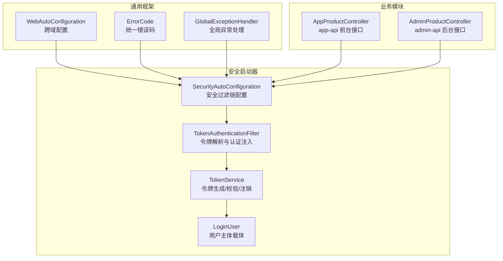
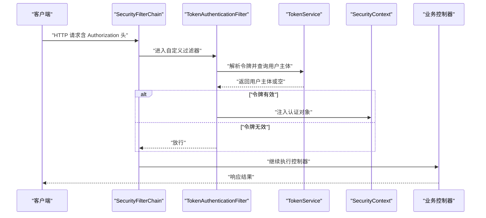
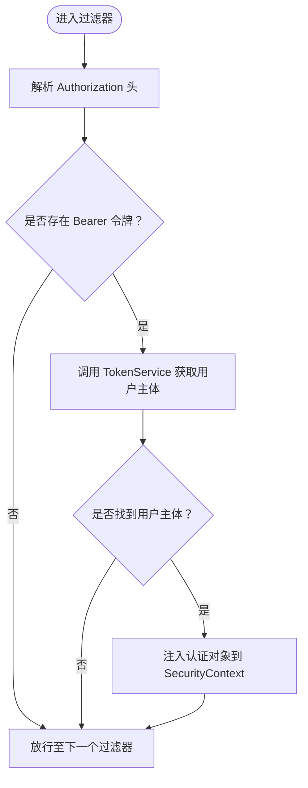
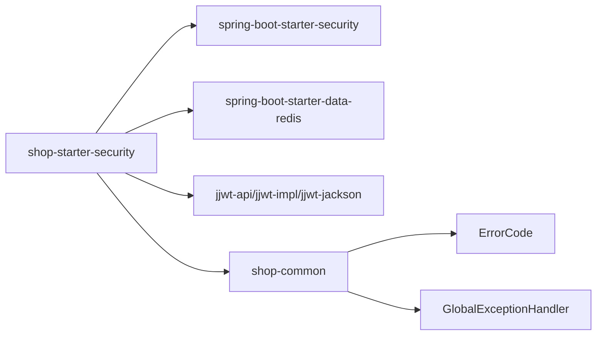

# 权限控制

<cite>
**本文引用的文件**
- [SecurityAutoConfiguration.java](file://shop-backend/shop-framework/shop-starter-security/src/main/java/com/shop/framework/security/SecurityAutoConfiguration.java)
- [TokenAuthenticationFilter.java](file://shop-backend/shop-framework/shop-starter-security/src/main/java/com/shop/framework/security/TokenAuthenticationFilter.java)
- [TokenService.java](file://shop-backend/shop-framework/shop-starter-security/src/main/java/com/shop/framework/security/TokenService.java)
- [LoginUser.java](file://shop-backend/shop-framework/shop-starter-security/src/main/java/com/shop/framework/security/LoginUser.java)
- [ErrorCode.java](file://shop-backend/shop-framework/shop-common/src/main/java/com/shop/common/exception/ErrorCode.java)
- [GlobalExceptionHandler.java](file://shop-backend/shop-framework/shop-common/src/main/java/com/shop/common/exception/GlobalExceptionHandler.java)
- [WebAutoConfiguration.java](file://shop-backend/shop-framework/shop-starter-web/src/main/java/com/shop/framework/web/WebAutoConfiguration.java)
- [AppProductController.java](file://shop-backend/shop-module-product/src/main/java/com/shop/module/product/controller/app/AppProductController.java)
- [AdminProductController.java](file://shop-backend/shop-module-product/src/main/java/com/shop/module/product/controller/admin/AdminProductController.java)
- [pom.xml（shop-starter-security）](file://shop-backend/shop-framework/shop-starter-security/pom.xml)
</cite>

## 目录
1. [引言](#引言)
2. [项目结构](#项目结构)
3. [核心组件](#核心组件)
4. [架构总览](#架构总览)
5. [详细组件分析](#详细组件分析)
6. [依赖分析](#依赖分析)
7. [性能考虑](#性能考虑)
8. [故障排查指南](#故障排查指南)
9. [结论](#结论)
10. [附录](#附录)

## 引言
本文件面向安全工程师与后端开发者，系统化梳理“药食同源”微信小程序商城的权限控制体系。文档围绕基于角色的访问控制（RBAC）模型展开，明确消费者、商家、管理员三类用户的角色边界与访问范围；深入解析 Spring Security 集成、自定义过滤器链、Token 认证流程与资源保护策略；并给出权限注解使用建议、URL 路径匹配规则、动态权限分配与继承机制的设计思路，以及权限配置最佳实践、漏洞检测方法与审计日志建议。

## 项目结构
本项目的权限控制能力主要由“安全启动器”模块提供，配合通用异常处理与跨域配置，形成从网关到控制器的统一安全基线。产品模块通过命名空间区分前端与后台接口，天然地为权限划分提供路径级隔离。

图表来源
- [SecurityAutoConfiguration.java:1-47](file://shop-backend/shop-framework/shop-starter-security/src/main/java/com/shop/framework/security/SecurityAutoConfiguration.java#L1-L47)
- [TokenAuthenticationFilter.java:1-43](file://shop-backend/shop-framework/shop-starter-security/src/main/java/com/shop/framework/security/TokenAuthenticationFilter.java#L1-L43)
- [TokenService.java:1-47](file://shop-backend/shop-framework/shop-starter-security/src/main/java/com/shop/framework/security/TokenService.java#L1-L47)
- [LoginUser.java:1-10](file://shop-backend/shop-framework/shop-starter-security/src/main/java/com/shop/framework/security/LoginUser.java#L1-L10)
- [WebAutoConfiguration.java:1-20](file://shop-backend/shop-framework/shop-starter-web/src/main/java/com/shop/framework/web/WebAutoConfiguration.java#L1-L20)
- [ErrorCode.java:1-26](file://shop-backend/shop-framework/shop-common/src/main/java/com/shop/common/exception/ErrorCode.java#L1-L26)
- [GlobalExceptionHandler.java:1-24](file://shop-backend/shop-framework/shop-common/src/main/java/com/shop/common/exception/GlobalExceptionHandler.java#L1-L24)
- [AppProductController.java:1-39](file://shop-backend/shop-module-product/src/main/java/com/shop/module/product/controller/app/AppProductController.java#L1-L39)
- [AdminProductController.java:1-41](file://shop-backend/shop-module-product/src/main/java/com/shop/module/product/controller/admin/AdminProductController.java#L1-L41)

章节来源
- [SecurityAutoConfiguration.java:1-47](file://shop-backend/shop-framework/shop-starter-security/src/main/java/com/shop/framework/security/SecurityAutoConfiguration.java#L1-L47)
- [WebAutoConfiguration.java:1-20](file://shop-backend/shop-framework/shop-starter-web/src/main/java/com/shop/framework/web/WebAutoConfiguration.java#L1-L20)
- [AppProductController.java:1-39](file://shop-backend/shop-module-product/src/main/java/com/shop/module/product/controller/app/AppProductController.java#L1-L39)
- [AdminProductController.java:1-41](file://shop-backend/shop-module-product/src/main/java/com/shop/module/product/controller/admin/AdminProductController.java#L1-L41)

## 核心组件
- 安全过滤链与路径匹配：通过安全自动配置定义 CSRF 关闭、无状态会话、公开端点白名单与其余端点需认证的策略，并在过滤链中插入自定义令牌过滤器。
- 自定义令牌过滤器：从请求头提取 Bearer 令牌，调用 TokenService 解析用户身份，成功则向 SecurityContext 注入认证对象，失败则放行进入后续链路。
- TokenService：基于 Redis 的令牌存储与读取，保存用户标识与用户类型，支持令牌创建、读取与删除。
- 用户主体 LoginUser：承载 userId 与 userType（消费者/管理员），作为认证上下文的核心数据载体。
- 统一异常与错误码：未授权场景返回统一错误码，便于前端识别与提示。
- 跨域配置：允许任意来源、方法与头部，满足小程序开发调试阶段的跨域需求。

章节来源
- [SecurityAutoConfiguration.java:20-45](file://shop-backend/shop-framework/shop-starter-security/src/main/java/com/shop/framework/security/SecurityAutoConfiguration.java#L20-L45)
- [TokenAuthenticationFilter.java:16-42](file://shop-backend/shop-framework/shop-starter-security/src/main/java/com/shop/framework/security/TokenAuthenticationFilter.java#L16-L42)
- [TokenService.java:12-46](file://shop-backend/shop-framework/shop-starter-security/src/main/java/com/shop/framework/security/TokenService.java#L12-L46)
- [LoginUser.java:6-9](file://shop-backend/shop-framework/shop-starter-security/src/main/java/com/shop/framework/security/LoginUser.java#L6-L9)
- [ErrorCode.java:8-21](file://shop-backend/shop-framework/shop-common/src/main/java/com/shop/common/exception/ErrorCode.java#L8-L21)
- [WebAutoConfiguration.java:8-19](file://shop-backend/shop-framework/shop-starter-web/src/main/java/com/shop/framework/web/WebAutoConfiguration.java#L8-L19)

## 架构总览
下图展示从客户端到控制器的典型请求流，重点体现令牌解析、认证注入与资源保护：

图表来源
- [SecurityAutoConfiguration.java:20-45](file://shop-backend/shop-framework/shop-starter-security/src/main/java/com/shop/framework/security/SecurityAutoConfiguration.java#L20-L45)
- [TokenAuthenticationFilter.java:20-33](file://shop-backend/shop-framework/shop-starter-security/src/main/java/com/shop/framework/security/TokenAuthenticationFilter.java#L20-L33)
- [TokenService.java:27-41](file://shop-backend/shop-framework/shop-starter-security/src/main/java/com/shop/framework/security/TokenService.java#L27-L41)

## 详细组件分析

### RBAC 模型与角色边界
- 角色定义
  - 消费者：具备前台浏览与购买相关接口的访问权，如商品分类列表、SPU 分页与详情等。
  - 商家/管理员：具备后台管理接口的访问权，如 SPU 列表分页、创建、更新、删除等。
- 角色边界
  - 路径前缀即角色边界：前台接口位于 app-api 命名空间，后台接口位于 admin-api 命名空间。
  - 当前实现采用“路径白名单 + 全局认证”的策略：公开端点仅限于认证相关接口，其余接口均需认证。

章节来源
- [AppProductController.java:16-38](file://shop-backend/shop-module-product/src/main/java/com/shop/module/product/controller/app/AppProductController.java#L16-L38)
- [AdminProductController.java:12-40](file://shop-backend/shop-module-product/src/main/java/com/shop/module/product/controller/admin/AdminProductController.java#L12-L40)
- [SecurityAutoConfiguration.java:25-32](file://shop-backend/shop-framework/shop-starter-security/src/main/java/com/shop/framework/security/SecurityAutoConfiguration.java#L25-L32)

### SecurityAutoConfiguration 安全配置机制
- 无状态会话：禁用会话，降低服务端状态维护成本。
- CSRF 禁用：REST 接口通常不依赖会话，禁用 CSRF 符合当前设计。
- 路径匹配与认证策略
  - 公开端点：app-api/member/auth 与 admin-api/system/auth 下的认证相关接口可匿名访问。
  - 商品前台接口：app-api/product/** 可匿名访问（用于公开浏览）。
  - 其余所有请求必须认证。
- 异常处理：未授权时统一返回 JSON 错误体，错误码为未登录。
- 过滤器链：在默认用户名密码过滤器之前插入自定义令牌过滤器，确保在进入控制器前完成认证注入。

章节来源
- [SecurityAutoConfiguration.java:20-45](file://shop-backend/shop-framework/shop-starter-security/src/main/java/com/shop/framework/security/SecurityAutoConfiguration.java#L20-L45)
- [ErrorCode.java:12-12](file://shop-backend/shop-framework/shop-common/src/main/java/com/shop/common/exception/ErrorCode.java#L12-L12)

### TokenAuthenticationFilter 权限验证逻辑
- 令牌解析：从 Authorization 头提取 Bearer 令牌。
- 用户主体注入：若令牌存在且有效，构造认证对象并写入 SecurityContext，供后续授权决策使用。
- 放行策略：若令牌无效或缺失，继续放行至后续过滤器，但不会注入认证主体。

图表来源
- [TokenAuthenticationFilter.java:20-33](file://shop-backend/shop-framework/shop-starter-security/src/main/java/com/shop/framework/security/TokenAuthenticationFilter.java#L20-L33)
- [TokenService.java:27-41](file://shop-backend/shop-framework/shop-starter-security/src/main/java/com/shop/framework/security/TokenService.java#L27-L41)

章节来源
- [TokenAuthenticationFilter.java:16-42](file://shop-backend/shop-framework/shop-starter-security/src/main/java/com/shop/framework/security/TokenAuthenticationFilter.java#L16-L42)

### TokenService 令牌服务
- 令牌生成：UUID 去横杠拼接作为令牌值，键前缀 + 令牌值作为 Redis Key，值为“用户ID:用户类型”，设置过期时间。
- 令牌读取：根据令牌键读取值，拆分出用户ID与用户类型，封装为 LoginUser。
- 令牌注销：删除对应 Redis 键，使令牌失效。
- 存储介质：Redis，适合分布式部署与高并发场景。

章节来源
- [TokenService.java:12-46](file://shop-backend/shop-framework/shop-starter-security/src/main/java/com/shop/framework/security/TokenService.java#L12-L46)
- [LoginUser.java:6-9](file://shop-backend/shop-framework/shop-starter-security/src/main/java/com/shop/framework/security/LoginUser.java#L6-L9)

### 控制器与资源保护策略
- 前台控制器（app-api）：面向消费者，提供商品浏览与查询接口，当前策略为“公开访问”，无需认证。
- 后台控制器（admin-api）：面向管理员，提供商品管理接口，当前策略为“需认证访问”。

章节来源
- [AppProductController.java:16-38](file://shop-backend/shop-module-product/src/main/java/com/shop/module/product/controller/app/AppProductController.java#L16-L38)
- [AdminProductController.java:12-40](file://shop-backend/shop-module-product/src/main/java/com/shop/module/product/controller/admin/AdminProductController.java#L12-L40)
- [SecurityAutoConfiguration.java:25-32](file://shop-backend/shop-framework/shop-starter-security/src/main/java/com/shop/framework/security/SecurityAutoConfiguration.java#L25-L32)

### 权限注解与动态权限分配
- 当前实现未使用 Spring Security 的方法级权限注解（如 @PreAuthorize）。鉴权主要通过路径匹配与过滤器完成。
- 动态权限分配建议
  - 在 LoginUser 中扩展角色集合或权限字符串字段，结合 TokenService 返回更丰富的角色/权限信息。
  - 在控制器层引入 @PreAuthorize 或 @PostAuthorize，按角色/权限细化控制。
  - 结合数据库角色-权限映射表，运行时动态加载用户权限集合并注入到认证上下文。
- 权限继承机制建议
  - 消费者具备基础浏览权限；管理员在消费者权限基础上叠加管理操作权限。
  - 通过角色层级与权限集合的交并补运算，实现权限继承与组合。

[本节为概念性设计说明，不直接分析具体文件，故不附“章节来源”]

### URL 路径匹配规则
- 公开端点
  - app-api/member/auth/**
  - admin-api/system/auth/**
  - app-api/product/**
- 其他所有请求均需认证。

章节来源
- [SecurityAutoConfiguration.java:25-32](file://shop-backend/shop-framework/shop-starter-security/src/main/java/com/shop/framework/security/SecurityAutoConfiguration.java#L25-L32)

### 资源保护策略
- 无状态：基于令牌的认证，避免服务端会话状态。
- 统一异常：未授权返回统一错误码，便于前端一致处理。
- 跨域：开发阶段允许任意来源，生产环境建议限制为小程序域名。

章节来源
- [SecurityAutoConfiguration.java:33-41](file://shop-backend/shop-framework/shop-starter-security/src/main/java/com/shop/framework/security/SecurityAutoConfiguration.java#L33-L41)
- [WebAutoConfiguration.java:11-18](file://shop-backend/shop-framework/shop-starter-web/src/main/java/com/shop/framework/web/WebAutoConfiguration.java#L11-L18)

## 依赖分析
- 安全启动器依赖
  - Spring Security：提供 Web 安全与过滤器链能力。
  - Spring Boot Starter Data Redis：提供 Redis 操作能力。
  - JWT 相关依赖：用于令牌生成与解析（在当前实现中由 TokenService 自行管理键值对）。
- 通用模块依赖
  - 统一异常与错误码：为安全异常提供一致的返回格式。
- 业务模块依赖
  - 控制器通过命名空间实现天然的权限隔离，无需额外注解即可达到路径级权限控制。

图表来源
- [pom.xml（shop-starter-security）:14-41](file://shop-backend/shop-framework/shop-starter-security/pom.xml#L14-L41)
- [ErrorCode.java:1-26](file://shop-backend/shop-framework/shop-common/src/main/java/com/shop/common/exception/ErrorCode.java#L1-L26)
- [GlobalExceptionHandler.java:1-24](file://shop-backend/shop-framework/shop-common/src/main/java/com/shop/common/exception/GlobalExceptionHandler.java#L1-L24)

章节来源
- [pom.xml（shop-starter-security）:14-41](file://shop-backend/shop-framework/shop-starter-security/pom.xml#L14-L41)

## 性能考虑
- 令牌存储：Redis 读写开销低，建议合理设置过期时间与内存淘汰策略。
- 过滤器链：自定义过滤器为一次性请求过滤，避免重复认证计算。
- 会话策略：无状态设计减少服务端内存占用，利于水平扩展。
- 跨域：生产环境应限制来源与方法，减少不必要的预检请求。

[本节提供一般性指导，不直接分析具体文件，故不附“章节来源”]

## 故障排查指南
- 未登录/未认证
  - 现象：返回统一未登录错误码。
  - 排查：确认 Authorization 头是否携带 Bearer 令牌；检查令牌是否过期或被删除；核对 TokenService 是否正确写入 Redis。
- 跨域问题
  - 现象：CORS 相关错误。
  - 排查：确认 WebAutoConfiguration 的跨域配置是否生效；生产环境应限制允许来源。
- 控制器访问异常
  - 现象：后台接口返回未认证。
  - 排查：确认请求路径是否属于 admin-api 命名空间；确认安全配置是否将该路径纳入需认证范围。

章节来源
- [ErrorCode.java:12-12](file://shop-backend/shop-framework/shop-common/src/main/java/com/shop/common/exception/ErrorCode.java#L12-L12)
- [TokenService.java:27-41](file://shop-backend/shop-framework/shop-starter-security/src/main/java/com/shop/framework/security/TokenService.java#L27-L41)
- [WebAutoConfiguration.java:11-18](file://shop-backend/shop-framework/shop-starter-web/src/main/java/com/shop/framework/web/WebAutoConfiguration.java#L11-L18)
- [SecurityAutoConfiguration.java:25-32](file://shop-backend/shop-framework/shop-starter-security/src/main/java/com/shop/framework/security/SecurityAutoConfiguration.java#L25-L32)

## 结论
本项目通过“路径白名单 + 全局认证 + 自定义令牌过滤器”的方式实现了简洁高效的权限控制基线。前台与后台接口通过命名空间自然分离，满足基本的访问隔离需求。为进一步完善权限体系，建议引入角色/权限模型与方法级权限注解，结合动态权限分配与审计日志，构建可演进的 RBAC 能力。

[本节为总结性内容，不直接分析具体文件，故不附“章节来源”]

## 附录

### 权限配置最佳实践
- 明确角色与权限：消费者、管理员角色清晰划分；权限以细粒度操作为准绳。
- 最小权限原则：仅授予完成任务所需的最小权限集合。
- 动态权限：基于用户角色与业务上下文动态加载权限，避免硬编码。
- 审计与追踪：记录关键操作的用户、时间、IP、权限与结果，便于审计与回溯。

[本节为一般性建议，不直接分析具体文件，故不附“章节来源”]

### 权限漏洞检测方法
- 路径扫描：检查是否存在未受保护的敏感接口。
- 权限绕过：验证是否可通过修改请求头或参数绕过认证。
- 会话固定：确认无状态策略下不存在会话劫持风险。
- 跨域滥用：限制跨域来源与凭证，防止 CSRF 与越权。

[本节为一般性建议，不直接分析具体文件，故不附“章节来源”]