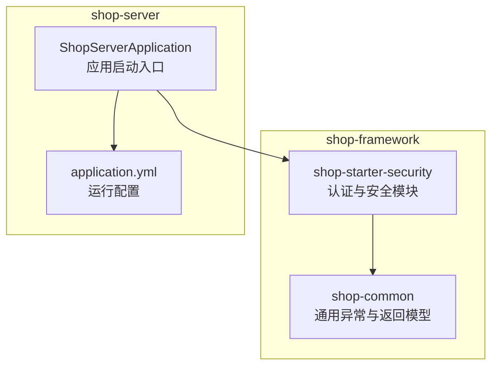
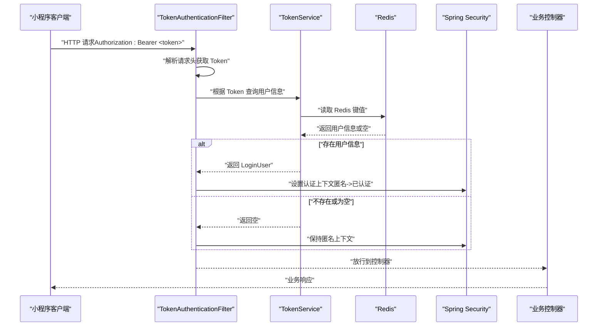
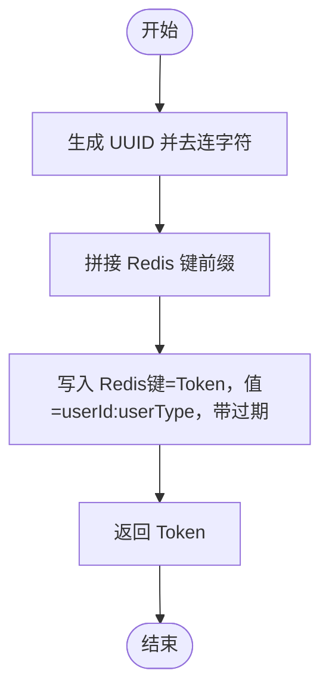
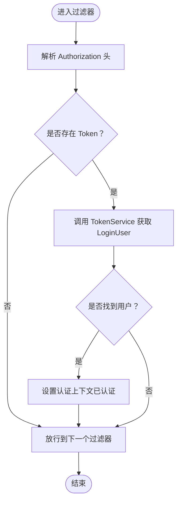
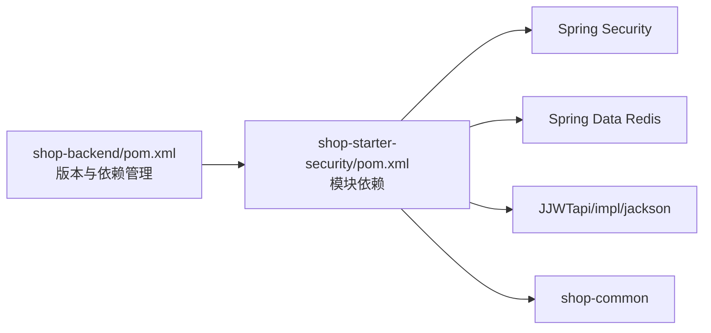

# 认证机制

<cite>
**本文引用的文件**
- [LoginUser.java](file://shop-backend/shop-framework/shop-starter-security/src/main/java/com/shop/framework/security/LoginUser.java)
- [TokenService.java](file://shop-backend/shop-framework/shop-starter-security/src/main/java/com/shop/framework/security/TokenService.java)
- [TokenAuthenticationFilter.java](file://shop-backend/shop-framework/shop-starter-security/src/main/java/com/shop/framework/security/TokenAuthenticationFilter.java)
- [SecurityAutoConfiguration.java](file://shop-backend/shop-framework/shop-starter-security/src/main/java/com/shop/framework/security/SecurityAutoConfiguration.java)
- [ErrorCode.java](file://shop-backend/shop-framework/shop-common/src/main/java/com/shop/common/exception/ErrorCode.java)
- [CommonResult.java](file://shop-backend/shop-framework/shop-common/src/main/java/com/shop/common/pojo/CommonResult.java)
- [pom.xml（安全模块）](file://shop-backend/shop-framework/shop-starter-security/pom.xml)
- [pom.xml（框架聚合）](file://shop-backend/shop-framework/pom.xml)
- [pom.xml（后端聚合）](file://shop-backend/pom.xml)
- [application.yml（服务端）](file://shop-backend/shop-server/src/main/resources/application.yml)
</cite>

## 目录
1. [引言](#引言)
2. [项目结构](#项目结构)
3. [核心组件](#核心组件)
4. [架构总览](#架构总览)
5. [组件详解](#组件详解)
6. [依赖分析](#依赖分析)
7. [性能考量](#性能考量)
8. [故障排查指南](#故障排查指南)
9. [结论](#结论)
10. [附录](#附录)

## 引言
本文件面向开发者，系统性阐述“药食同源”微信小程序商城后端的认证机制与实现。该系统采用基于 JWT 的 Token 认证方案，结合 Redis 存储与 Spring Security 过滤器链，完成从 Token 创建、校验到上下文注入的完整闭环。文档覆盖以下关键主题：
- 基于 Redis 的 Token 策略与生命周期管理
- 用户信息封装 LoginUser 及用户类型区分（消费者、管理员）
- TokenService 的实现原理与 Redis 存储键空间设计
- TokenAuthenticationFilter 的过滤器链工作原理与请求拦截机制
- 安全上下文构建与认证状态传递
- Token 生命周期与过期处理策略
- 安全注销流程
- 配置示例、常见问题排查与性能优化建议

## 项目结构
围绕认证功能的相关代码集中在 shop-starter-security 模块中，并通过自动装配导入到应用中；公共异常与返回模型位于 shop-common 模块；后端启动入口在 shop-server 中。

图表来源
- [SecurityAutoConfiguration.java:1-47](file://shop-backend/shop-framework/shop-starter-security/src/main/java/com/shop/framework/security/SecurityAutoConfiguration.java#L1-L47)
- [application.yml（服务端）:1-7](file://shop-backend/shop-server/src/main/resources/application.yml#L1-L7)

章节来源
- [pom.xml（框架聚合）:14-20](file://shop-backend/shop-framework/pom.xml#L14-L20)
- [pom.xml（后端聚合）:14-20](file://shop-backend/pom.xml#L14-L20)

## 核心组件
- LoginUser：封装当前登录用户的标识与类型，作为认证上下文中的主体对象。
- TokenService：负责 Token 的生成、读取与删除，使用 Redis 存储 Token 到用户信息的映射。
- TokenAuthenticationFilter：Spring Security 过滤器，从请求头提取 Token 并注入认证上下文。
- SecurityAutoConfiguration：定义安全过滤链、会话策略、公开接口与异常处理响应格式。
- ErrorCode / CommonResult：统一错误码与响应体，用于未授权等场景的标准化输出。

章节来源
- [LoginUser.java:1-10](file://shop-backend/shop-framework/shop-starter-security/src/main/java/com/shop/framework/security/LoginUser.java#L1-L10)
- [TokenService.java:1-47](file://shop-backend/shop-framework/shop-starter-security/src/main/java/com/shop/framework/security/TokenService.java#L1-L47)
- [TokenAuthenticationFilter.java:1-43](file://shop-backend/shop-framework/shop-starter-security/src/main/java/com/shop/framework/security/TokenAuthenticationFilter.java#L1-L43)
- [SecurityAutoConfiguration.java:1-47](file://shop-backend/shop-framework/shop-starter-security/src/main/java/com/shop/framework/security/SecurityAutoConfiguration.java#L1-L47)
- [ErrorCode.java:1-26](file://shop-backend/shop-framework/shop-common/src/main/java/com/shop/common/exception/ErrorCode.java#L1-L26)
- [CommonResult.java:1-34](file://shop-backend/shop-framework/shop-common/src/main/java/com/shop/common/pojo/CommonResult.java#L1-L34)

## 架构总览
整体认证流程由“请求进入 -> 过滤器解析 Token -> 读取 Redis -> 注入认证上下文 -> 放行至控制器”构成。非公开接口均需认证，未登录时统一返回标准错误响应。

图表来源
- [TokenAuthenticationFilter.java:20-33](file://shop-backend/shop-framework/shop-starter-security/src/main/java/com/shop/framework/security/TokenAuthenticationFilter.java#L20-L33)
- [TokenService.java:27-41](file://shop-backend/shop-framework/shop-starter-security/src/main/java/com/shop/framework/security/TokenService.java#L27-L41)
- [SecurityAutoConfiguration.java:20-45](file://shop-backend/shop-framework/shop-starter-security/src/main/java/com/shop/framework/security/SecurityAutoConfiguration.java#L20-L45)

## 组件详解

### LoginUser 用户信息封装
- 字段含义
  - userId：用户唯一标识
  - userType：用户类型，1=会员，2=管理员
- 使用场景
  - 作为认证主体对象存入 Spring Security 上下文
  - 由 TokenService 写入/读取 Redis 时携带

章节来源
- [LoginUser.java:6-9](file://shop-backend/shop-framework/shop-starter-security/src/main/java/com/shop/framework/security/LoginUser.java#L6-L9)

### TokenService 实现原理与 Redis 存储
- Token 生成
  - 使用 UUID 生成随机字符串并移除连字符，作为 Token 值
  - 将 Token 作为 Redis 键，值为 “userId:userType”
  - 设置过期时间（小时级），默认 7 天
- Token 读取
  - 以 “shop:token:<token>” 为键前缀查询
  - 解析值为 “userId:userType”，构造 LoginUser 返回
- Token 删除
  - 提供删除方法，用于安全注销或强制失效

图表来源
- [TokenService.java:19-25](file://shop-backend/shop-framework/shop-starter-security/src/main/java/com/shop/framework/security/TokenService.java#L19-L25)

章节来源
- [TokenService.java:14-15](file://shop-backend/shop-framework/shop-starter-security/src/main/java/com/shop/framework/security/TokenService.java#L14-L15)
- [TokenService.java:19-25](file://shop-backend/shop-framework/shop-starter-security/src/main/java/com/shop/framework/security/TokenService.java#L19-L25)
- [TokenService.java:27-41](file://shop-backend/shop-framework/shop-starter-security/src/main/java/com/shop/framework/security/TokenService.java#L27-L41)
- [TokenService.java:43-45](file://shop-backend/shop-framework/shop-starter-security/src/main/java/com/shop/framework/security/TokenService.java#L43-L45)

### TokenAuthenticationFilter 过滤器链与请求拦截
- 请求拦截
  - 从请求头 Authorization 中提取 Bearer Token
  - 若存在且以 “Bearer ” 开头，则截取实际 Token
- 认证上下文构建
  - 调用 TokenService 读取 LoginUser
  - 若存在则创建 UsernamePasswordAuthenticationToken，并注入 SecurityContextHolder
- 放行
  - 不管是否认证成功，均继续执行后续过滤器链

图表来源
- [TokenAuthenticationFilter.java:20-33](file://shop-backend/shop-framework/shop-starter-security/src/main/java/com/shop/framework/security/TokenAuthenticationFilter.java#L20-L33)
- [TokenAuthenticationFilter.java:35-41](file://shop-backend/shop-framework/shop-starter-security/src/main/java/com/shop/framework/security/TokenAuthenticationFilter.java#L35-L41)

章节来源
- [TokenAuthenticationFilter.java:16-18](file://shop-backend/shop-framework/shop-starter-security/src/main/java/com/shop/framework/security/TokenAuthenticationFilter.java#L16-L18)
- [TokenAuthenticationFilter.java:20-33](file://shop-backend/shop-framework/shop-starter-security/src/main/java/com/shop/framework/security/TokenAuthenticationFilter.java#L20-L33)
- [TokenAuthenticationFilter.java:35-41](file://shop-backend/shop-framework/shop-starter-security/src/main/java/com/shop/framework/security/TokenAuthenticationFilter.java#L35-L41)

### 安全配置与公开接口
- 会话策略
  - STATELESS：无状态会话，避免服务器端会话开销
- 公开接口
  - app-api/member/auth/**
  - admin-api/system/auth/**
  - app-api/product/**
- 未授权处理
  - 自定义认证入口点，返回 CommonResult.error(ErrorCode.UNAUTHORIZED)

章节来源
- [SecurityAutoConfiguration.java:20-45](file://shop-backend/shop-framework/shop-starter-security/src/main/java/com/shop/framework/security/SecurityAutoConfiguration.java#L20-L45)
- [ErrorCode.java](file://shop-backend/shop-framework/shop-common/src/main/java/com/shop/common/exception/ErrorCode.java#L12)
- [CommonResult.java:30-32](file://shop-backend/shop-framework/shop-common/src/main/java/com/shop/common/pojo/CommonResult.java#L30-L32)

### 用户类型区分（消费者、管理员）
- LoginUser.userType 字段用于区分用户角色
  - 1：会员（消费者）
  - 2：管理员
- 控制器层可依据 userType 或 Spring Security 的权限注解进行访问控制

章节来源
- [LoginUser.java:7-8](file://shop-backend/shop-framework/shop-starter-security/src/main/java/com/shop/framework/security/LoginUser.java#L7-L8)

### Token 生命周期与过期处理
- 过期策略
  - Token 在 Redis 中设置过期时间，默认 7 天
- 过期处理
  - 读取时若键不存在视为过期或无效
  - 业务侧可结合 ErrorCode.TOKEN_EXPIRED 进行前端提示
- 安全注销
  - 调用 TokenService.deleteToken 清除对应键，使旧 Token 失效

章节来源
- [TokenService.java:14-15](file://shop-backend/shop-framework/shop-starter-security/src/main/java/com/shop/framework/security/TokenService.java#L14-L15)
- [TokenService.java](file://shop-backend/shop-framework/shop-starter-security/src/main/java/com/shop/framework/security/TokenService.java#L23)
- [TokenService.java:43-45](file://shop-backend/shop-framework/shop-starter-security/src/main/java/com/shop/framework/security/TokenService.java#L43-L45)
- [ErrorCode.java](file://shop-backend/shop-framework/shop-common/src/main/java/com/shop/common/exception/ErrorCode.java#L19)

### 认证上下文构建与权限传递
- 过滤器将 LoginUser 作为认证主体注入 SecurityContext
- 后续控制器与方法级安全可通过认证主体获取用户信息
- 未登录时保持匿名上下文，交由授权规则判定

章节来源
- [TokenAuthenticationFilter.java:27-29](file://shop-backend/shop-framework/shop-starter-security/src/main/java/com/shop/framework/security/TokenAuthenticationFilter.java#L27-L29)

## 依赖分析
- 模块依赖
  - shop-starter-security 依赖 shop-common、Spring Security、Spring Data Redis、JJWT
- 版本与坐标
  - JWT 版本由顶层 pom 统一管理，确保一致性

图表来源
- [pom.xml（后端聚合）:52-66](file://shop-backend/pom.xml#L52-L66)
- [pom.xml（安全模块）:14-40](file://shop-backend/shop-framework/shop-starter-security/pom.xml#L14-L40)

章节来源
- [pom.xml（后端聚合）:22-66](file://shop-backend/pom.xml#L22-L66)
- [pom.xml（安全模块）:14-40](file://shop-backend/shop-framework/shop-starter-security/pom.xml#L14-L40)

## 性能考量
- Redis 本地化与连接池
  - 建议将 Redis 与应用部署在同一可用区，减少网络延迟
  - 合理配置连接池大小与超时参数，避免阻塞
- Token 存储键设计
  - 使用统一前缀与短 Token 值，降低键长度与序列化开销
- 过期策略
  - 7 天过期时间较长，建议结合业务场景评估是否需要动态刷新或滑动过期
- 过滤器链
  - 过滤器仅做一次解析与一次 Redis 读取，复杂度 O(1)，对吞吐影响小
- 会话策略
  - STATELESS 无状态模式避免服务器端会话存储，提升横向扩展能力

## 故障排查指南
- 未登录/未授权
  - 现象：返回统一错误码 401 与“未登录”
  - 排查：确认请求头 Authorization 是否为 “Bearer <token>”，Token 是否存在于 Redis
- Token 已过期
  - 现象：读取 Redis 为空或业务侧提示“Token已过期”
  - 排查：检查过期时间配置与是否提前删除
- 用户类型不正确
  - 现象：权限不足或业务逻辑判断异常
  - 排查：确认 LoginUser.userType 是否按预期设置（1=会员，2=管理员）
- 响应格式不一致
  - 现象：未登录返回 JSON 格式错误
  - 排查：确认异常处理器已生效，Content-Type 为 application/json

章节来源
- [SecurityAutoConfiguration.java:33-40](file://shop-backend/shop-framework/shop-starter-security/src/main/java/com/shop/framework/security/SecurityAutoConfiguration.java#L33-L40)
- [ErrorCode.java](file://shop-backend/shop-framework/shop-common/src/main/java/com/shop/common/exception/ErrorCode.java#L12)
- [ErrorCode.java](file://shop-backend/shop-framework/shop-common/src/main/java/com/shop/common/exception/ErrorCode.java#L19)
- [CommonResult.java:30-32](file://shop-backend/shop-framework/shop-common/src/main/java/com/shop/common/pojo/CommonResult.java#L30-L32)

## 结论
本认证体系以 Redis 为载体、以过滤器为核心，实现了轻量、可扩展、可运维的 Token 认证方案。通过 LoginUser 封装用户信息、TokenService 统一管理 Token 生命周期、SecurityAutoConfiguration 明确公开接口与异常处理，整体满足微信小程序商城的身份认证需求。建议在生产环境进一步完善 Token 刷新、滑动过期与审计日志等能力。

## 附录

### 认证配置示例（要点）
- 公开接口
  - app-api/member/auth/**
  - admin-api/system/auth/**
  - app-api/product/**
- 会话策略
  - STATELESS
- 未授权响应
  - JSON 格式，code=401，msg=“未登录”

章节来源
- [SecurityAutoConfiguration.java:25-32](file://shop-backend/shop-framework/shop-starter-security/src/main/java/com/shop/framework/security/SecurityAutoConfiguration.java#L25-L32)
- [SecurityAutoConfiguration.java](file://shop-backend/shop-framework/shop-starter-security/src/main/java/com/shop/framework/security/SecurityAutoConfiguration.java#L24)
- [SecurityAutoConfiguration.java:33-40](file://shop-backend/shop-framework/shop-starter-security/src/main/java/com/shop/framework/security/SecurityAutoConfiguration.java#L33-L40)

### 常见认证问题排查清单
- 请求头缺失或格式错误
  - 确认 Authorization 头为 “Bearer <token>”
- Redis 连接异常
  - 检查 Redis 地址、密码与网络连通性
- Token 不存在
  - 确认 Token 未被提前删除或过期
- 权限不足
  - 检查 LoginUser.userType 与控制器权限匹配

章节来源
- [TokenAuthenticationFilter.java:35-41](file://shop-backend/shop-framework/shop-starter-security/src/main/java/com/shop/framework/security/TokenAuthenticationFilter.java#L35-L41)
- [TokenService.java:31-41](file://shop-backend/shop-framework/shop-starter-security/src/main/java/com/shop/framework/security/TokenService.java#L31-L41)
- [ErrorCode.java](file://shop-backend/shop-framework/shop-common/src/main/java/com/shop/common/exception/ErrorCode.java#L12)