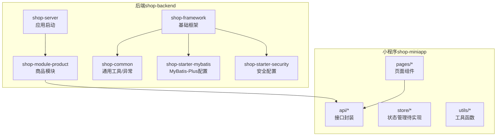
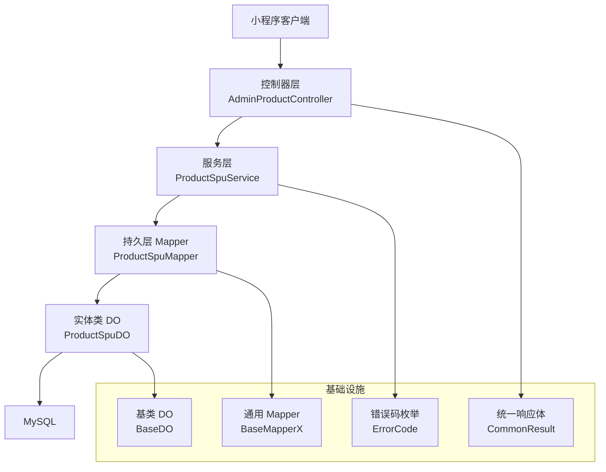
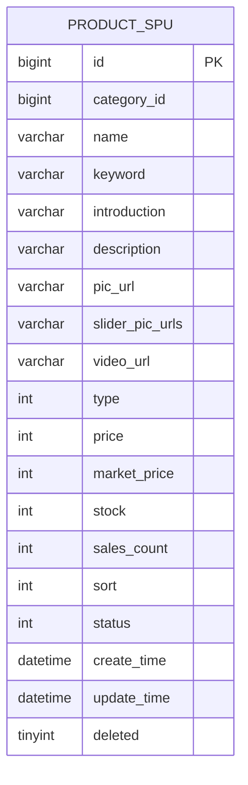
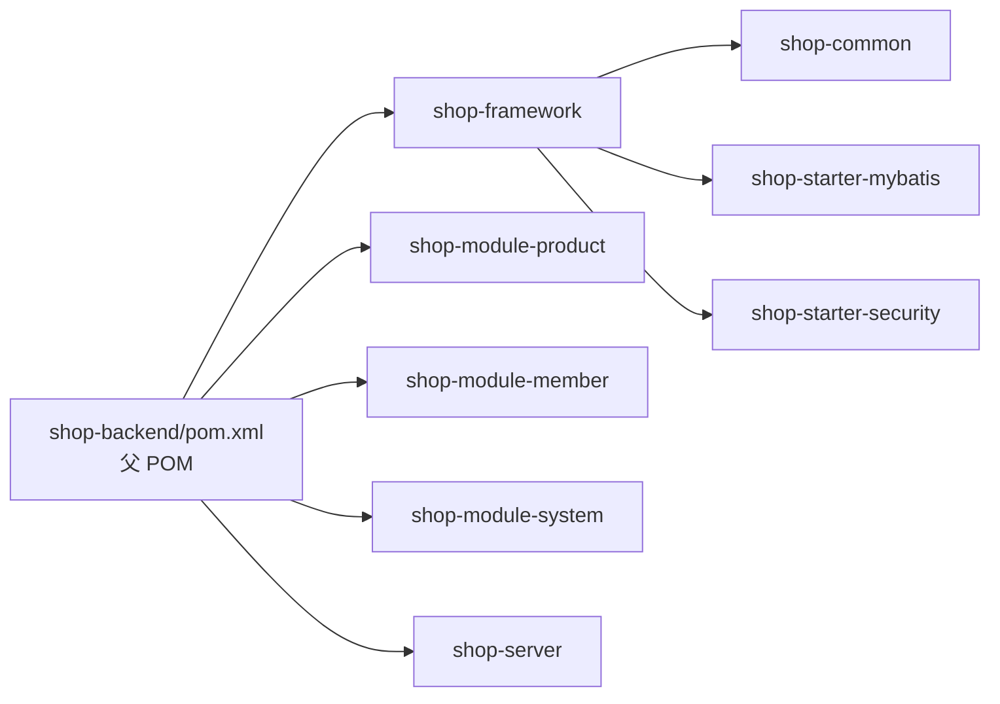

# 代码规范标准

<cite>
**本文引用的文件**
- [README.md](file://README.md)
- [shop-backend/pom.xml](file://shop-backend/pom.xml)
- [CommonResult.java](file://shop-backend/shop-framework/shop-common/src/main/java/com/shop/common/pojo/CommonResult.java)
- [ErrorCode.java](file://shop-backend/shop-framework/shop-common/src/main/java/com/shop/common/exception/ErrorCode.java)
- [BaseDO.java](file://shop-backend/shop-framework/shop-starter-mybatis/src/main/java/com/shop/framework/mybatis/core/BaseDO.java)
- [BaseMapperX.java](file://shop-backend/shop-framework/shop-starter-mybatis/src/main/java/com/shop/framework/mybatis/core/BaseMapperX.java)
- [ProductSpuDO.java](file://shop-backend/shop-module-product/src/main/java/com/shop/module/product/dal/dataobject/ProductSpuDO.java)
- [ProductSpuMapper.java](file://shop-backend/shop-module-product/src/main/java/com/shop/module/product/dal/mysql/ProductSpuMapper.java)
- [ProductSpuService.java](file://shop-backend/shop-module-product/src/main/java/com/shop/module/product/service/ProductSpuService.java)
- [AdminProductController.java](file://shop-backend/shop-module-product/src/main/java/com/shop/module/product/controller/admin/AdminProductController.java)
- [request.ts](file://shop-miniapp/src/api/request.ts)
- [product.ts](file://shop-miniapp/src/api/product.ts)
- [index.vue](file://shop-miniapp/src/pages/index/index.vue)
- [main.ts](file://shop-miniapp/src/main.ts)
- [package.json](file://shop-miniapp/package.json)
</cite>

## 目录
1. 引言
2. 项目结构
3. 核心组件
4. 架构总览
5. 详细组件分析
6. 依赖分析
7. 性能考虑
8. 故障排查指南
9. 结论
10. 附录

## 引言
本规范旨在为“药食同源”微信小程序商城提供统一、可执行的代码规范标准，覆盖后端（Java/Spring Boot）、前端（uni-app/Vue3/TypeScript/Pinia）以及跨端接口与数据模型约定。规范以现有代码为依据，结合最佳实践，形成从命名到架构、从接口到状态管理的完整标准，确保团队协作一致性与长期演进能力。

## 项目结构
项目采用前后端分离与多模块聚合的工程化组织方式：
- 后端：基于 Maven 的多模块结构，按框架层、业务模块与服务入口划分；统一版本与依赖管理，便于扩展与维护。
- 小程序：基于 uni-app 的 Vue3 + TypeScript + Pinia 架构，页面、接口封装、状态管理与工具函数清晰分层。

图表来源
- [README.md:12-41](file://README.md#L12-L41)
- [shop-backend/pom.xml:14-20](file://shop-backend/pom.xml#L14-L20)

章节来源
- [README.md:12-41](file://README.md#L12-L41)
- [shop-backend/pom.xml:14-20](file://shop-backend/pom.xml#L14-L20)

## 核心组件
本节梳理后端与前端的关键构件及其职责边界，作为后续规范制定的基础。

- 后端通用返回体与错误码
  - 统一响应体用于前后端一致的数据契约，错误码枚举集中管理业务与系统级错误。
- 持久层基类与通用 Mapper
  - 基类 DO 提供通用字段（时间、逻辑删除），通用 Mapper 提供分页查询封装。
- 业务实体与映射
  - 商品实体定义字段与表映射关系，Mapper 接口继承通用接口。
- 服务层逻辑
  - 服务层负责业务条件组装与调用 Mapper，保证事务与校验边界清晰。
- 控制器层
  - 控制器负责路由与入参绑定，返回统一响应体。
- 小程序接口封装与页面
  - 接口封装统一请求与鉴权头处理，页面组件负责视图与交互。

章节来源
- [CommonResult.java:1-34](file://shop-backend/shop-framework/shop-common/src/main/java/com/shop/common/pojo/CommonResult.java#L1-L34)
- [ErrorCode.java:1-26](file://shop-backend/shop-framework/shop-common/src/main/java/com/shop/common/exception/ErrorCode.java#L1-L26)
- [BaseDO.java:1-23](file://shop-backend/shop-framework/shop-starter-mybatis/src/main/java/com/shop/framework/mybatis/core/BaseDO.java#L1-L23)
- [BaseMapperX.java:1-16](file://shop-backend/shop-framework/shop-starter-mybatis/src/main/java/com/shop/framework/mybatis/core/BaseMapperX.java#L1-L16)
- [ProductSpuDO.java:1-33](file://shop-backend/shop-module-product/src/main/java/com/shop/module/product/dal/dataobject/ProductSpuDO.java#L1-L33)
- [ProductSpuMapper.java:1-10](file://shop-backend/shop-module-product/src/main/java/com/shop/module/product/dal/mysql/ProductSpuMapper.java#L1-L10)
- [ProductSpuService.java:1-53](file://shop-backend/shop-module-product/src/main/java/com/shop/module/product/service/ProductSpuService.java#L1-L53)
- [AdminProductController.java:1-41](file://shop-backend/shop-module-product/src/main/java/com/shop/module/product/controller/admin/AdminProductController.java#L1-L41)
- [request.ts:1-48](file://shop-miniapp/src/api/request.ts#L1-L48)
- [product.ts:1-42](file://shop-miniapp/src/api/product.ts#L1-L42)
- [index.vue:1-122](file://shop-miniapp/src/pages/index/index.vue#L1-L122)

## 架构总览
后端采用分层架构：控制器层、服务层、持久层与基础设施层；前端采用页面组件 + 接口封装 + 状态管理的模式。统一的响应体与错误码贯穿前后端，确保交互一致性。

图表来源
- [AdminProductController.java:11-14](file://shop-backend/shop-module-product/src/main/java/com/shop/module/product/controller/admin/AdminProductController.java#L11-L14)
- [ProductSpuService.java:13-17](file://shop-backend/shop-module-product/src/main/java/com/shop/module/product/service/ProductSpuService.java#L13-L17)
- [ProductSpuMapper.java:7-9](file://shop-backend/shop-module-product/src/main/java/com/shop/module/product/dal/mysql/ProductSpuMapper.java#L7-L9)
- [ProductSpuDO.java:10-13](file://shop-backend/shop-module-product/src/main/java/com/shop/module/product/dal/dataobject/ProductSpuDO.java#L10-L13)
- [CommonResult.java:8-13](file://shop-backend/shop-framework/shop-common/src/main/java/com/shop/common/pojo/CommonResult.java#L8-L13)
- [ErrorCode.java:8-25](file://shop-backend/shop-framework/shop-common/src/main/java/com/shop/common/exception/ErrorCode.java#L8-L25)
- [BaseDO.java:12-22](file://shop-backend/shop-framework/shop-starter-mybatis/src/main/java/com/shop/framework/mybatis/core/BaseDO.java#L12-L22)
- [BaseMapperX.java:9-15](file://shop-backend/shop-framework/shop-starter-mybatis/src/main/java/com/shop/framework/mybatis/core/BaseMapperX.java#L9-L15)

## 详细组件分析

### Java 后端代码规范

- 包与模块命名
  - 使用 com.shop.{layer}.{module} 的层级命名，如 controller、service、dal、dataobject、mysql。
  - 模块名采用小写与中划线风格，如 shop-module-product。
- 类命名
  - 控制器类以 Controller 结尾，如 AdminProductController。
  - 服务类以 Service 结尾，如 ProductSpuService。
  - Mapper 接口以 Mapper 结尾，如 ProductSpuMapper。
  - 实体类以 DO 结尾，如 ProductSpuDO。
  - 基类以 DO 或 X 结尾，如 BaseDO、BaseMapperX。
- 方法命名
  - 控制器方法遵循 REST 风格，使用语义化动词与路径参数。
  - 服务方法以动宾结构命名，如 getSpuPage、createSpu、updateSpu。
  - Mapper 方法沿用 MyBatis-Plus 命名约定。
- 字段命名
  - 实体字段与数据库列一致，使用驼峰命名，避免缩写。
  - 通用字段（创建时间、更新时间、逻辑删除）在 BaseDO 中统一定义。
- 注释规范
  - 公开接口与复杂逻辑需添加方法级注释，说明入参与返回值含义。
  - 枚举与常量需标注用途与取值范围。
- 统一响应与错误码
  - 所有接口返回统一响应体，错误码集中定义，便于前端统一处理。
- 分页与查询
  - 使用 BaseMapperX 的 selectPage 封装分页查询，避免重复代码。
- 实体与表映射
  - 使用注解标注主键、表名与字段填充策略，确保 ORM 一致性。

章节来源
- [AdminProductController.java:11-40](file://shop-backend/shop-module-product/src/main/java/com/shop/module/product/controller/admin/AdminProductController.java#L11-L40)
- [ProductSpuService.java:19-51](file://shop-backend/shop-module-product/src/main/java/com/shop/module/product/service/ProductSpuService.java#L19-L51)
- [ProductSpuMapper.java:7-9](file://shop-backend/shop-module-product/src/main/java/com/shop/module/product/dal/mysql/ProductSpuMapper.java#L7-L9)
- [ProductSpuDO.java:10-32](file://shop-backend/shop-module-product/src/main/java/com/shop/module/product/dal/dataobject/ProductSpuDO.java#L10-L32)
- [BaseDO.java:12-22](file://shop-backend/shop-framework/shop-starter-mybatis/src/main/java/com/shop/framework/mybatis/core/BaseDO.java#L12-L22)
- [BaseMapperX.java:11-14](file://shop-backend/shop-framework/shop-starter-mybatis/src/main/java/com/shop/framework/mybatis/core/BaseMapperX.java#L11-L14)
- [CommonResult.java:15-32](file://shop-backend/shop-framework/shop-common/src/main/java/com/shop/common/pojo/CommonResult.java#L15-L32)
- [ErrorCode.java:8-25](file://shop-backend/shop-framework/shop-common/src/main/java/com/shop/common/exception/ErrorCode.java#L8-L25)

### Spring Boot 最佳实践

- 控制器层
  - 使用@RestController，统一前缀区分管理端与应用端。
  - 参数校验通过 PageParam 与 DTO 绑定，避免在控制器内做复杂逻辑。
- 服务层
  - 业务条件组装与异常抛出集中在服务层，保证事务与一致性。
  - 对空值场景抛出业务异常，使用统一错误码。
- Mapper 接口
  - 统一继承 BaseMapperX，复用分页封装。
  - 查询条件使用 LambdaQueryWrapper，避免硬编码字符串。
- 实体类
  - 继承 BaseDO，自动填充时间与逻辑删除字段。
  - 表名与字段注解明确，避免 ORM 映射歧义。

章节来源
- [AdminProductController.java:18-39](file://shop-backend/shop-module-product/src/main/java/com/shop/module/product/controller/admin/AdminProductController.java#L18-L39)
- [ProductSpuService.java:19-39](file://shop-backend/shop-module/product/src/main/java/com/shop/module/product/service/ProductSpuService.java#L19-L39)
- [ProductSpuMapper.java:7-9](file://shop-backend/shop-module-product/src/main/java/com/shop/module/product/dal/mysql/ProductSpuMapper.java#L7-L9)
- [ProductSpuDO.java:10-32](file://shop-backend/shop-module-product/src/main/java/com/shop/module/product/dal/dataobject/ProductSpuDO.java#L10-L32)
- [BaseMapperX.java:11-14](file://shop-backend/shop-framework/shop-starter-mybatis/src/main/java/com/shop/framework/mybatis/core/BaseMapperX.java#L11-L14)
- [BaseDO.java:12-22](file://shop-backend/shop-framework/shop-starter-mybatis/src/main/java/com/shop/framework/mybatis/core/BaseDO.java#L12-L22)

### TypeScript 代码规范

- 接口定义
  - 使用 TypeScript 接口描述请求与响应结构，如 Category、ProductSpu、PageResult。
  - 请求参数与返回值显式声明泛型，提升类型安全。
- 函数命名
  - 接口函数以动宾结构命名，如 getCategoryList、getProductPage、getProductDetail。
  - 统一导出，便于页面组件按需引入。
- 模块组织
  - api 目录按领域拆分接口模块，避免单文件过大。
- 错误处理
  - 在请求封装中根据 code 判断成功与失败，401 清理本地 token 并提示登录。
- 依赖声明
  - 在 package.json 中声明依赖与脚本命令，确保构建与运行一致性。

章节来源
- [product.ts:3-26](file://shop-miniapp/src/api/product.ts#L3-L26)
- [product.ts:28-41](file://shop-miniapp/src/api/product.ts#L28-L41)
- [request.ts:16-47](file://shop-miniapp/src/api/request.ts#L16-L47)
- [package.json:4-7](file://shop-miniapp/package.json#L4-L7)

### uni-app/Vue3 + Pinia 组件开发规范

- 组件组织
  - 页面组件放置于 pages 目录，按功能拆分子目录。
  - 使用 <script setup> 语法糖，简化组合式 API 写法。
- 状态管理
  - 在 main.ts 中注册 Pinia，页面组件按需使用。
  - 状态管理模块待实现，建议按领域拆分 store，遵循单一职责。
- 视图与交互
  - 使用 scoped 样式隔离样式作用域，组件内样式集中管理。
  - 事件绑定与数据驱动渲染，避免直接操作 DOM。

章节来源
- [index.vue:33-63](file://shop-miniapp/src/pages/index/index.vue#L33-L63)
- [main.ts:5-10](file://shop-miniapp/src/main.ts#L5-L10)

### 数据模型与接口契约

图表来源
- [ProductSpuDO.java:15-31](file://shop-backend/shop-module-product/src/main/java/com/shop/module/product/dal/dataobject/ProductSpuDO.java#L15-L31)
- [BaseDO.java:14-21](file://shop-backend/shop-framework/shop-starter-mybatis/src/main/java/com/shop/framework/mybatis/core/BaseDO.java#L14-L21)

## 依赖分析
后端采用 Maven 多模块管理，统一版本与依赖，模块间通过内部坐标传递依赖，降低版本冲突风险。

图表来源
- [shop-backend/pom.xml:14-20](file://shop-backend/pom.xml#L14-L20)
- [shop-backend/pom.xml:33-88](file://shop-backend/pom.xml#L33-L88)

章节来源
- [shop-backend/pom.xml:14-20](file://shop-backend/pom.xml#L14-L20)
- [shop-backend/pom.xml:33-88](file://shop-backend/pom.xml#L33-L88)

## 性能考虑
- 后端
  - 使用分页查询避免一次性加载大量数据，合理设置分页大小。
  - 在服务层进行必要的缓存与批量操作规划，减少数据库压力。
  - 控制器仅做参数绑定与路由转发，避免在控制器层做重逻辑。
- 前端
  - 页面组件按需加载数据，避免重复请求。
  - 使用骨架屏与占位符优化首屏体验，减少白屏时间。
  - 图片资源按需裁剪与懒加载，降低带宽占用。

## 故障排查指南
- 统一错误码与响应体
  - 前端根据 code 判断业务错误与系统错误，401 清理 token 并引导登录。
- 日志与异常
  - 服务层对空值与非法参数抛出业务异常，使用统一错误码，便于定位问题。
- 接口联调
  - 建议在本地联调时打印请求与响应体，核对字段与类型是否一致。

章节来源
- [request.ts:30-39](file://shop-miniapp/src/api/request.ts#L30-L39)
- [ErrorCode.java:8-25](file://shop-backend/shop-framework/shop-common/src/main/java/com/shop/common/exception/ErrorCode.java#L8-L25)
- [ProductSpuService.java:29-32](file://shop-backend/shop-module-product/src/main/java/com/shop/module/product/service/ProductSpuService.java#L29-L32)

## 结论
本规范以现有代码为基础，明确了 Java 后端与 TypeScript 前端的命名、结构、接口与状态管理规范，并提供了统一响应与错误码约定。建议在后续迭代中持续完善状态管理模块与单元测试体系，确保代码质量与可维护性。

## 附录

### 代码格式化与 IDE 设置建议
- Java
  - 使用 Maven 插件统一编译版本与编码，确保团队一致。
  - IDE 推荐启用 Lombok 注解处理与 Google Java Format 插件。
- TypeScript
  - 使用 TypeScript 编译器严格模式，开启 noImplicitAny 与 strictNullChecks。
  - IDE 推荐启用 ESLint 与 Prettier，统一格式化规则。
- uni-app
  - 使用 Vite 构建，配合 TypeScript 与 Vue Language Features 插件。

章节来源
- [shop-backend/pom.xml:22-27](file://shop-backend/pom.xml#L22-L27)
- [package.json:17-25](file://shop-miniapp/package.json#L17-L25)

### 自动化代码检查工具使用指南
- 后端
  - 使用 SpotBugs/JaCoCo 进行静态分析与覆盖率检查，集成到 CI。
- 前端
  - 使用 ESLint + Prettier + TypeScript Compiler 进行静态检查与格式化，提交前执行。
- 提交规范
  - 建议采用 Conventional Commits，便于生成变更日志与版本发布。

### 注释规范与文档编写标准
- 方法注释
  - 说明入参、返回值、异常与业务约束，复杂算法补充伪代码或流程图。
- 类注释
  - 说明职责边界、依赖关系与使用示例。
- 文档编写
  - 采用 Markdown，保持标题层级清晰，配合 Mermaid 绘制架构与流程图。

### 代码重构指导原则
- 优先保证行为不变，再进行结构优化。
- 逐步替换旧实现，保留兼容接口，避免长链路阻塞。
- 重构后进行回归测试，确保接口契约与数据一致性。