# 开发指南

<cite>
**本文引用的文件**
- [README.md](file://README.md)
- [shop-miniapp/README.md](file://shop-miniapp/README.md)
- [status.md](file://docs/superpowers/status.md)
- [2026-06-22-shop-miniprogram-design.md](file://docs/superpowers/specs/2026-06-22-shop-miniprogram-design.md)
- [project.config.json](file://shop-miniapp/project.config.json)
- [manifest.json](file://shop-miniapp/manifest.json)
- [pages.json](file://shop-miniapp/pages.json)
</cite>

## 更新摘要
**变更内容**
- 新增微信开发者工具集成配置说明
- 添加 HBuilderX 开发环境搭建指南
- 补充 ES6 支持和 postCSS 处理配置
- 增加热重载功能使用说明
- 更新前端开发基础设施文档

## 目录
1. [引言](#引言)
2. [项目结构](#项目结构)
3. [核心组件](#核心组件)
4. [架构总览](#架构总览)
5. [详细组件分析](#详细组件分析)
6. [依赖分析](#依赖分析)
7. [性能考虑](#性能考虑)
8. [故障排查指南](#故障排查指南)
9. [结论](#结论)
10. [附录](#附录)

## 引言
本开发指南面向"药食同源"微信小程序商城项目，围绕 Spec-Driven Development（规格驱动开发）提供从需求到落地的完整工作流，覆盖后端 Java 与前端 uni-app 的代码规范、新功能开发流程、代码审查、测试策略、调试技巧、性能优化与团队协作最佳实践。项目采用 Spring Boot 3 + MyBatis-Plus + MySQL + Redis 的后端技术栈，前端基于 uni-app (Vue2) + HBuilderX 开发工具链。

## 项目结构
项目采用前后端分离与多模块后端架构，文档与计划以 Spec-Driven 方式组织，确保开发过程可追踪、可回溯、可协作。

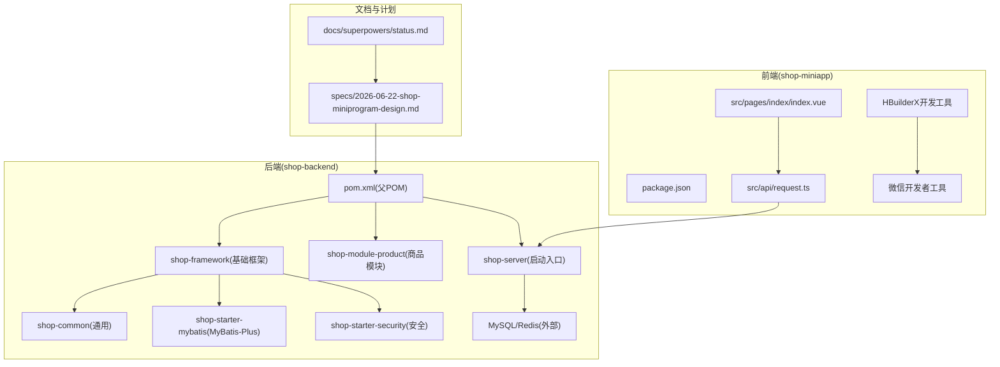

**图表来源**
- [status.md](file://docs/superpowers/status.md)
- [2026-06-22-shop-miniprogram-design.md](file://docs/superpowers/specs/2026-06-22-shop-miniprogram-design.md)
- [project.config.json](file://shop-miniapp/project.config.json)
- [manifest.json](file://shop-miniapp/manifest.json)
- [pages.json](file://shop-miniapp/pages.json)

**章节来源**
- [README.md](file://README.md)
- [shop-miniapp/README.md](file://shop-miniapp/README.md)
- [status.md](file://docs/superpowers/status.md)
- [2026-06-22-shop-miniprogram-design.md](file://docs/superpowers/specs/2026-06-22-shop-miniprogram-design.md)

## 核心组件
- 后端统一异常处理：集中处理业务异常与系统异常，返回统一响应结构。
- 安全与鉴权：基于 Redis 的 Token 管理，支持登录态校验与失效处理。
- 商品模块控制器：提供分类列表、商品分页、详情查询等接口。
- 基础 DO：统一时间戳与逻辑删除字段，减少重复代码。
- 前端请求封装：统一请求头、错误提示与鉴权头注入。
- 启动入口与配置：Spring Boot 启动类扫描包与 Mapper 扫描范围，服务器端口配置。
- **新增** 微信开发者工具集成：支持自动打开模拟器与热重载功能。
- **新增** HBuilderX 开发环境：uni-app 编译与小程序预览一体化开发体验。

**章节来源**
- [project.config.json](file://shop-miniapp/project.config.json)
- [manifest.json](file://shop-miniapp/manifest.json)
- [pages.json](file://shop-miniapp/pages.json)
- [README.md](file://README.md)
- [shop-miniapp/README.md](file://shop-miniapp/README.md)

## 架构总览
后端采用多模块分层：框架层提供通用能力（Web、MyBatis、Security），业务模块承载具体领域（商品、会员、系统等），通过统一异常与响应结构对外提供服务；前端通过 uni-app 框架和 HBuilderX 开发工具链进行开发，编译为微信小程序原生代码，在微信开发者工具中预览和调试。

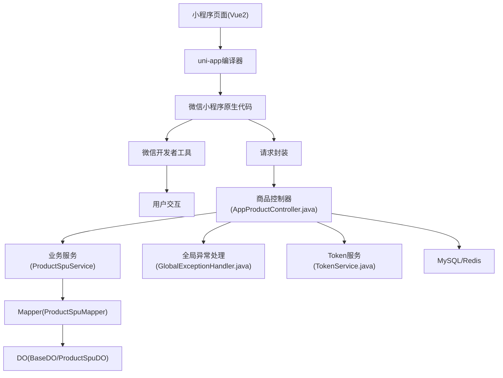

**图表来源**
- [project.config.json](file://shop-miniapp/project.config.json)
- [manifest.json](file://shop-miniapp/manifest.json)
- [pages.json](file://shop-miniapp/pages.json)

## 详细组件分析

### 微信开发者工具集成配置
- 功能：配置小程序项目参数，启用 ES6 语法支持和 postCSS 处理，支持热重载开发体验。
- 关键点：`es6: true` 启用现代 JavaScript 语法，`postcss: true` 启用样式预处理，`compileHotReLoad: false` 控制热重载行为。

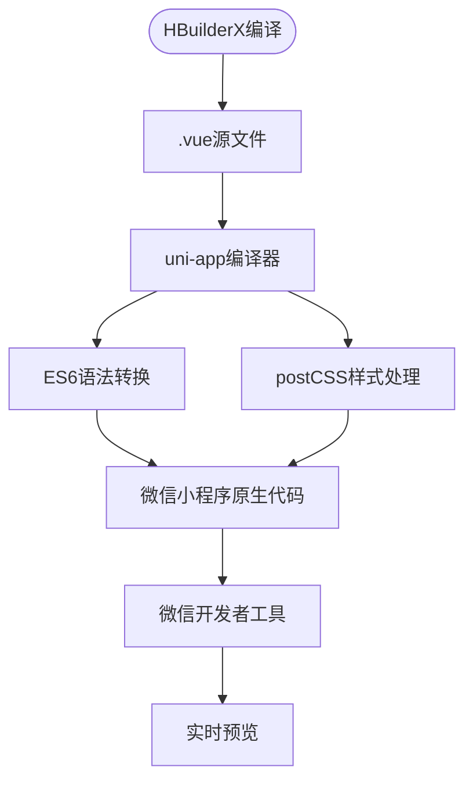

**图表来源**
- [project.config.json](file://shop-miniapp/project.config.json)

**章节来源**
- [project.config.json](file://shop-miniapp/project.config.json)

### HBuilderX 开发环境配置
- 功能：提供 uni-app 项目的完整开发环境，包括编译器、调试器和微信开发者工具集成。
- 关键点：App开发版内置 uni-app 编译器，支持自动打开微信开发者工具和热重载。

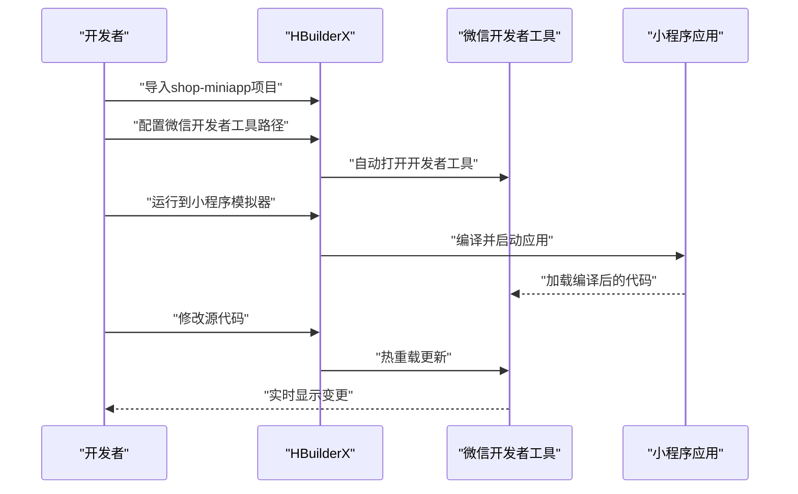

**图表来源**
- [shop-miniapp/README.md](file://shop-miniapp/README.md)
- [README.md](file://README.md)

**章节来源**
- [shop-miniapp/README.md](file://shop-miniapp/README.md)
- [README.md](file://README.md)

### 小程序应用配置
- 功能：定义应用基本信息、平台特定配置、权限设置和构建选项。
- 关键点：多平台支持（微信小程序、支付宝小程序、H5等），模块化权限配置。

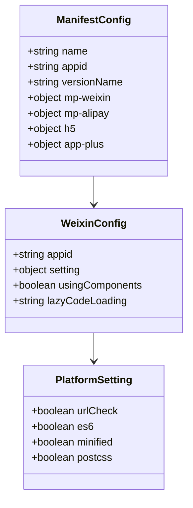

**图表来源**
- [manifest.json](file://shop-miniapp/manifest.json)

**章节来源**
- [manifest.json](file://shop-miniapp/manifest.json)

### 页面路由与导航配置
- 功能：定义小程序所有页面路径、导航栏样式、下拉刷新和底部标签栏。
- 关键点：自定义导航栏样式、页面级配置、全局样式和 TabBar 图标管理。

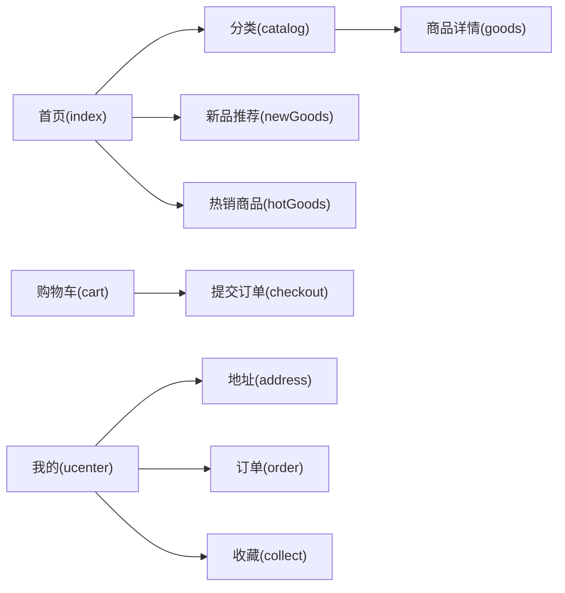

**图表来源**
- [pages.json](file://shop-miniapp/pages.json)

**章节来源**
- [pages.json](file://shop-miniapp/pages.json)

### 后端统一异常处理
- 功能：捕获业务异常与系统异常，输出统一响应结构，便于前端一致化处理。
- 关键点：业务异常按错误码与消息返回；系统异常统一返回内部错误码。

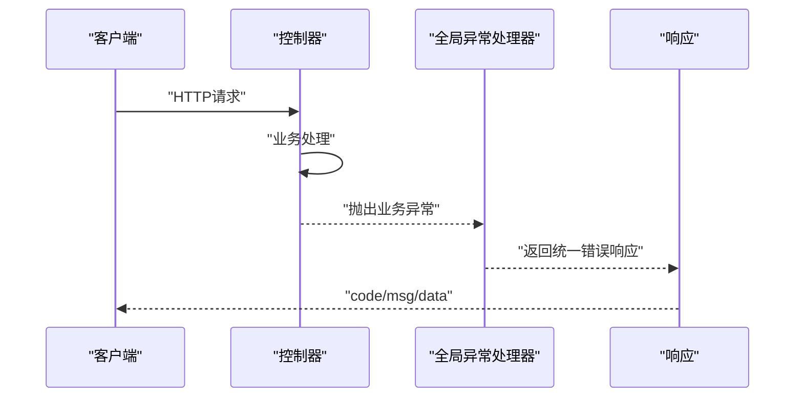

**图表来源**
- [GlobalExceptionHandler.java](file://shop-backend/shop-framework/shop-common/src/main/java/com/shop/common/exception/GlobalExceptionHandler.java)

**章节来源**
- [GlobalExceptionHandler.java](file://shop-backend/shop-framework/shop-common/src/main/java/com/shop/common/exception/GlobalExceptionHandler.java)

### 安全与鉴权（Token 服务）
- 功能：生成、读取、删除 Token，并持久化至 Redis，支持过期与踢出。
- 关键点：Token 前缀与过期时间配置；解析用户标识与类型。

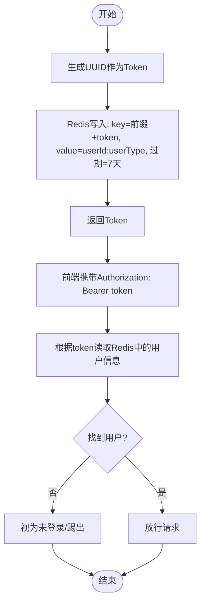

**图表来源**
- [TokenService.java](file://shop-backend/shop-framework/shop-starter-security/src/main/java/com/shop/framework/security/TokenService.java)

**章节来源**
- [TokenService.java](file://shop-backend/shop-framework/shop-starter-security/src/main/java/com/shop/framework/security/TokenService.java)

### 商品模块控制器（App 端）
- 功能：提供分类列表、商品分页、详情查询接口，统一返回结构。
- 关键点：路径前缀与分页参数传递；调用服务层获取数据。

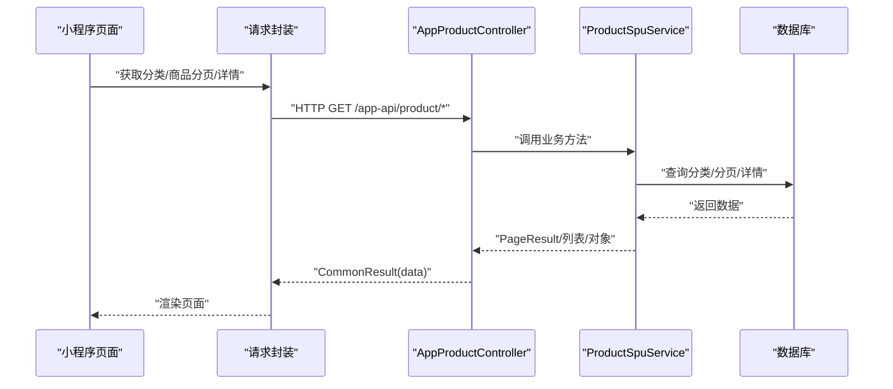

**图表来源**
- [AppProductController.java](file://shop-backend/shop-module-product/src/main/java/com/shop/module/product/controller/app/AppProductController.java)
- [request.ts](file://shop-miniapp/src/api/request.ts)
- [index.vue](file://shop-miniapp/src/pages/index/index.vue)

**章节来源**
- [AppProductController.java](file://shop-backend/shop-module-product/src/main/java/com/shop/module/product/controller/app/AppProductController.java)

### 基础 DO 与实体映射
- 功能：统一创建/更新时间与逻辑删除字段，减少重复样板代码。
- 关键点：MyBatis-Plus 注解自动填充与逻辑删除。

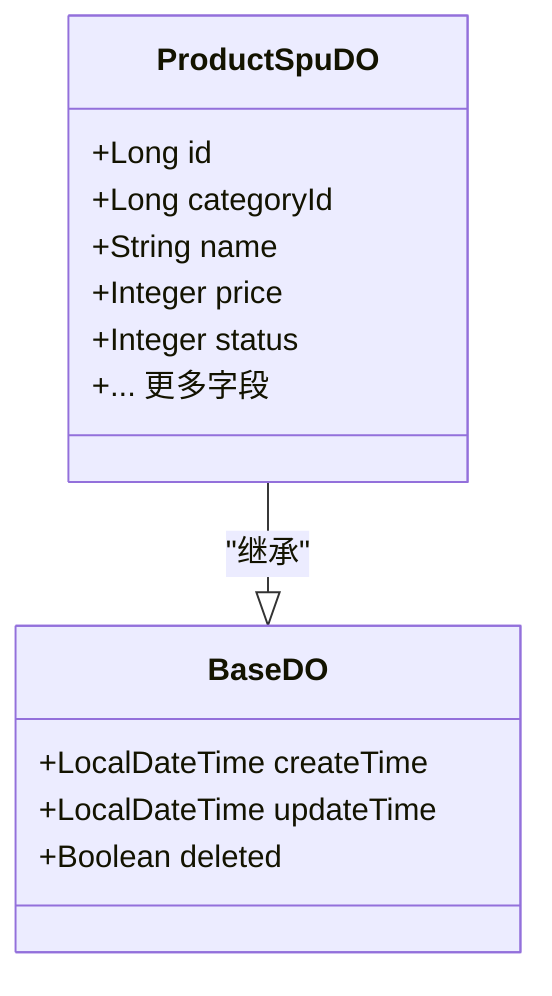

**图表来源**
- [BaseDO.java](file://shop-backend/shop-framework/shop-starter-mybatis/src/main/java/com/shop/framework/mybatis/core/BaseDO.java)
- [ProductSpuDO.java](file://shop-backend/shop-module-product/src/main/java/com/shop/module/product/dal/dataobject/ProductSpuDO.java)

**章节来源**
- [BaseDO.java](file://shop-backend/shop-framework/shop-starter-mybatis/src/main/java/com/shop/framework/mybatis/core/BaseDO.java)
- [ProductSpuDO.java](file://shop-backend/shop-module-product/src/main/java/com/shop/module/product/dal/dataobject/ProductSpuDO.java)

### 前端请求封装与页面
- 功能：统一请求头、鉴权头注入、错误提示与 401 处理；页面负责分类与商品列表渲染。
- 关键点：BASE_URL 配置、Token 读取与 Authorization 头拼装。

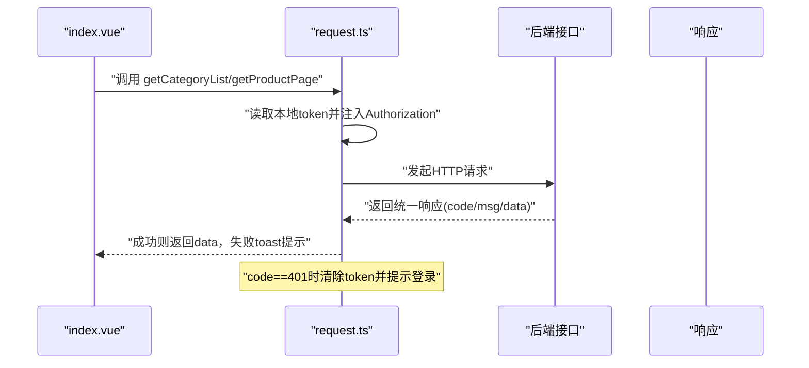

**图表来源**
- [request.ts](file://shop-miniapp/src/api/request.ts)
- [index.vue](file://shop-miniapp/src/pages/index/index.vue)

**章节来源**
- [request.ts](file://shop-miniapp/src/api/request.ts)
- [index.vue](file://shop-miniapp/src/pages/index/index.vue)

## 依赖分析
- 后端多模块：父 POM 管理模块与依赖版本，框架层提供 Web、MyBatis、Security 能力，业务模块按需引入。
- 启动类：组件扫描与 Mapper 扫描范围明确，避免遗漏。
- 前端：依赖 uni-app、Vue2、Vuex，通过 HBuilderX 编译为微信小程序原生代码。
- **新增** 开发工具链：HBuilderX App开发版内置 uni-app 编译器，微信开发者工具用于预览调试。

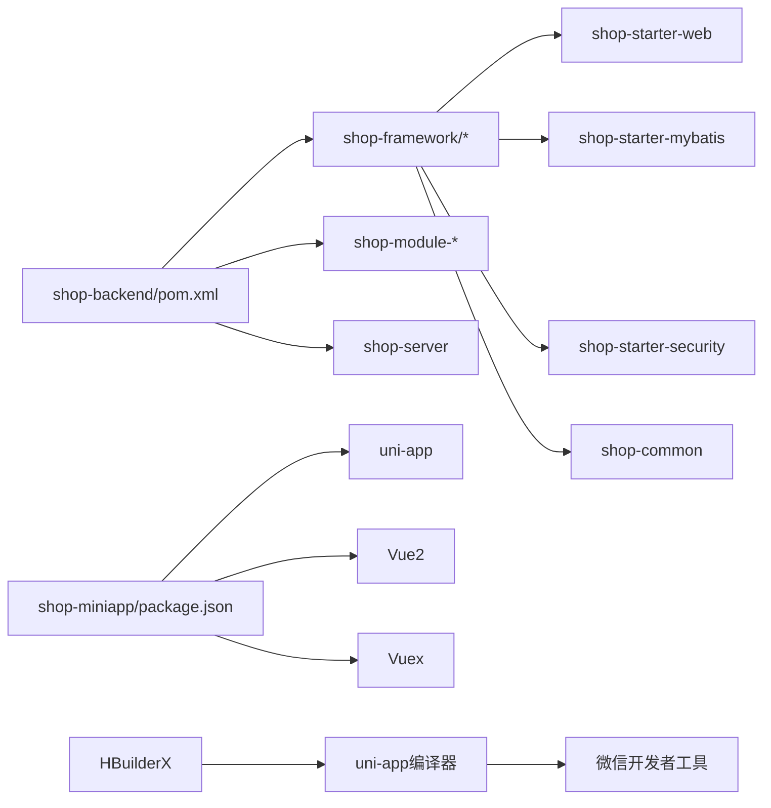

**图表来源**
- [pom.xml](file://shop-backend/pom.xml)
- [project.config.json](file://shop-miniapp/project.config.json)
- [manifest.json](file://shop-miniapp/manifest.json)

**章节来源**
- [pom.xml](file://shop-backend/pom.xml)
- [project.config.json](file://shop-miniapp/project.config.json)
- [manifest.json](file://shop-miniapp/manifest.json)

## 性能考虑
- 后端
  - 使用 MyBatis-Plus 分页与索引优化，避免全表扫描。
  - Redis 缓存热点数据与 Token，降低数据库压力。
  - 控制接口返回字段大小，避免传输冗余数据。
- 前端
  - 图片与视频资源 CDN 化，合理懒加载与分页加载。
  - 避免频繁触发网络请求，合并与节流策略。
  - **新增** 启用 ES6 语法提升代码执行效率。
  - **新增** postCSS 处理优化样式性能。
- 数据库
  - 初始化脚本包含常用索引与分区建议，结合实际业务持续优化。

[本节为通用建议，无需列出具体文件来源]

## 故障排查指南
- 启动与连接
  - 后端端口与配置：检查 server.port 与 profile 是否正确。
  - 数据库初始化：确认 init.sql 已执行，连接凭据正确。
- 接口问题
  - 统一响应：关注 code 与 msg 字段，定位业务异常或系统异常。
  - 鉴权失败：确认 Authorization 头是否携带，Token 是否过期或被踢出。
- 前端调试
  - **新增** HBuilderX 编译错误：检查 uni-app 语法和配置文件。
  - **新增** 微信开发者工具连接问题：确认服务端口已开启。
  - **新增** ES6 语法错误：检查 project.config.json 中 es6 配置。
  - 使用微信开发者工具真机调试，查看网络面板与控制台日志。
  - 检查请求封装中的 BASE_URL 与 token 注入逻辑。
- 数据库调试
  - 使用 MySQL 客户端连接验证表结构与数据，结合索引与慢查询日志分析。

**章节来源**
- [application.yml](file://shop-backend/shop-server/src/main/resources/application.yml)
- [init.sql](file://sql/init.sql)
- [project.config.json](file://shop-miniapp/project.config.json)
- [shop-miniapp/README.md](file://shop-miniapp/README.md)
- [GlobalExceptionHandler.java](file://shop-backend/shop-framework/shop-common/src/main/java/com/shop/common/exception/GlobalExceptionHandler.java)
- [TokenService.java](file://shop-backend/shop-framework/shop-starter-security/src/main/java/com/shop/framework/security/TokenService.java)
- [request.ts](file://shop-miniapp/src/api/request.ts)

## 结论
本指南基于 Spec-Driven 方法，提供了从需求到交付的全流程规范与实操建议。通过统一的异常与响应、安全与鉴权、基础 DO 与请求封装，以及清晰的模块边界与依赖关系，团队可以高效推进迭代，保障质量与一致性。**新增的开发基础设施**包括微信开发者工具集成、HBuilderX 开发环境和现代前端特性支持，进一步提升了开发效率和代码质量。

[本节为总结性内容，无需列出具体文件来源]

## 附录

### 规格驱动开发（Spec-Driven Development）工作流
- 以 status.md 为唯一真相来源，记录当前阶段、计划与决策。
- 新功能先写 spec，再拆解为 plan，最后编码实现。
- AI 协作时读取/更新 specs 以保持上下文同步。

**章节来源**
- [status.md](file://docs/superpowers/status.md)
- [2026-06-22-shop-miniprogram-design.md](file://docs/superpowers/specs/2026-06-22-shop-miniprogram-design.md)

### 代码规范与命名约定
- Java 后端
  - 类与接口命名采用帕斯卡命名法；包名全小写；常量全大写下划线。
  - 控制器使用 RestController，方法命名语义化，参数与返回值统一。
  - 异常处理集中化，错误码与消息清晰。
- TypeScript 前端
  - 文件命名采用 kebab-case；组件文件夹采用 PascalCase。
  - 接口与类型使用明确语义，避免 any；API 请求统一封装。
- 注释规范
  - 类与方法添加必要注释，说明职责与关键逻辑。
  - 接口文档遵循统一响应格式，明确 code/msg/data 含义。

[本节为通用规范建议，无需列出具体文件来源]

### 新功能开发流程（从需求到测试验证）
- 需求分析：阅读并确认 spec，明确边界与验收。
- 设计与计划：拆解为可执行的 plan，分配任务与里程碑。
- 编码执行：遵循模块边界与统一规范，提交最小可行变更。
- 测试验证：本地启动 MySQL/Redis，编译后端与小程序，按测试清单逐项验证。
- 文档更新：更新 status.md 与相关文档，沉淀经验。

**章节来源**
- [README.md](file://README.md)
- [status.md](file://docs/superpowers/status.md)

### 代码审查与测试策略
- 代码审查
  - 关注模块边界与依赖，避免循环依赖。
  - 统一异常与响应处理，确保错误信息一致。
  - Token 与鉴权逻辑安全合规，避免硬编码。
- 单元测试
  - 对核心业务方法进行输入/输出断言，覆盖正常与异常分支。
- 集成测试
  - 覆盖端到端流程：商品列表、分类筛选、登录态、支付回调（Mock）。

[本节为通用建议，无需列出具体文件来源]

### 调试技巧
- 后端
  - 使用日志定位异常，结合全局异常处理器快速定位业务错误。
  - Redis 读写验证 Token 生命周期与用户信息。
- 前端
  - **新增** HBuilderX 控制台查看编译错误和运行时日志。
  - **新增** 微信开发者工具 Network 面板观察请求与响应。
  - **新增** 热重载功能实时预览代码变更效果。
  - 使用微信开发者工具真机调试，查看网络面板与控制台日志。
  - 检查请求封装中的 BASE_URL 与 token 注入逻辑。
- 数据库
  - 使用 SQL 验证表结构与数据一致性，结合索引与执行计划优化。

**章节来源**
- [GlobalExceptionHandler.java](file://shop-backend/shop-framework/shop-common/src/main/java/com/shop/common/exception/GlobalExceptionHandler.java)
- [TokenService.java](file://shop-backend/shop-framework/shop-starter-security/src/main/java/com/shop/framework/security/TokenService.java)
- [project.config.json](file://shop-miniapp/project.config.json)
- [shop-miniapp/README.md](file://shop-miniapp/README.md)
- [request.ts](file://shop-miniapp/src/api/request.ts)

### 部署与运行
- 后端
  - 使用 Docker 容器部署，端口 80；数据库与缓存通过云托管提供。
- 前端
  - **新增** 通过 HBuilderX 编译为小程序产物，自动打开微信开发者工具预览。
  - **新增** 支持热重载开发模式，修改代码后自动更新。
  - 通过 uni-app 构建为小程序产物，在微信开发者工具中导入与预览。

**章节来源**
- [README.md](file://README.md)
- [shop-miniapp/README.md](file://shop-miniapp/README.md)
- [project.config.json](file://shop-miniapp/project.config.json)
- [manifest.json](file://shop-miniapp/manifest.json)

### 开发环境配置指南
- **新增** HBuilderX 安装与配置
  - 下载 App开发版，内置 uni-app 编译器
  - 配置微信开发者工具路径和服务端口
  - 导入 shop-miniapp 项目目录
- **新增** 微信开发者工具集成
  - 开启服务端口允许 HBuilderX 自动打开
  - 配置不校验合法域名用于本地开发
  - 使用测试号进行开发和调试
- **新增** ES6 和 postCSS 支持
  - project.config.json 中启用 es6: true
  - 启用 postcss: true 支持现代 CSS 特性
  - 利用 babel 进行语法转译

**章节来源**
- [shop-miniapp/README.md](file://shop-miniapp/README.md)
- [project.config.json](file://shop-miniapp/project.config.json)
- [manifest.json](file://shop-miniapp/manifest.json)