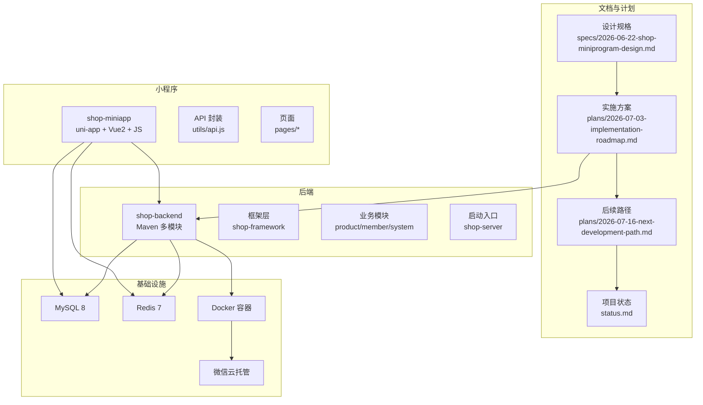
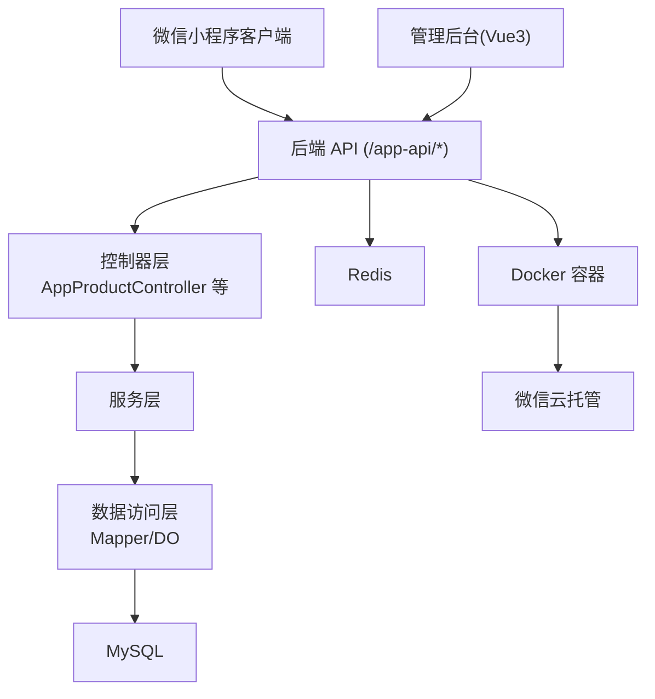
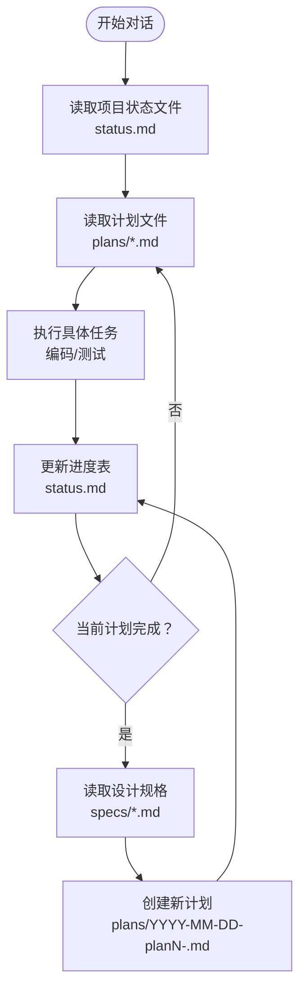
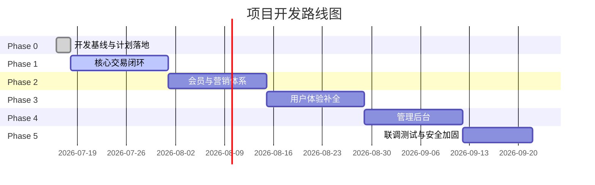
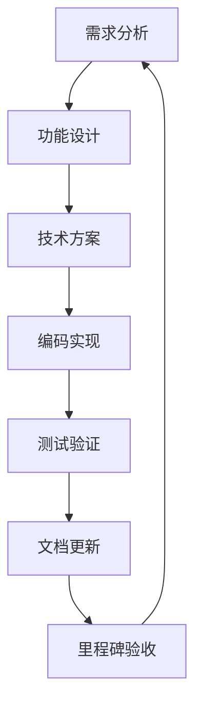
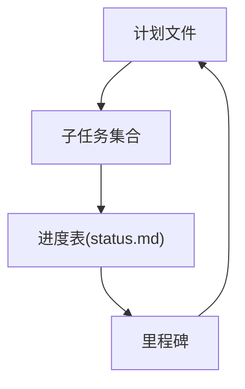
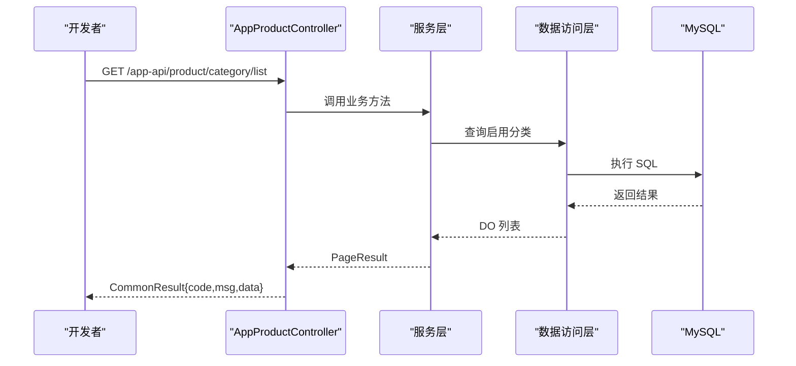
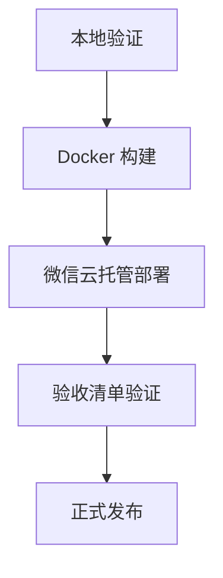
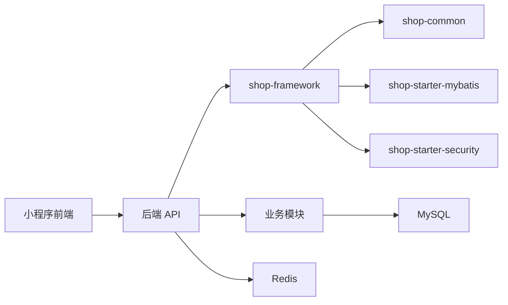

# 开发流程规范

<cite>
**本文引用的文件**
- [README.md](file://README.md)
- [AGENTS.md](file://AGENTS.md)
- [docs/superpowers/status.md](file://docs/superpowers/status.md)
- [docs/superpowers/specs/2026-06-22-shop-miniprogram-design.md](file://docs/superpowers/specs/2026-06-22-shop-miniprogram-design.md)
- [docs/superpowers/plans/2026-06-22-plan1-demo-foundation.md](file://docs/superpowers/plans/2026-06-22-plan1-demo-foundation.md)
- [docs/superpowers/plans/2026-07-03-implementation-roadmap.md](file://docs/superpowers/plans/2026-07-03-implementation-roadmap.md)
- [docs/superpowers/plans/2026-07-16-next-development-path.md](file://docs/superpowers/plans/2026-07-16-next-development-path.md)
- [shop-backend/shop-framework/shop-common/src/main/java/com/shop/common/pojo/CommonResult.java](file://shop-backend/shop-framework/shop-common/src/main/java/com/shop/common/pojo/CommonResult.java)
- [shop-backend/shop-framework/shop-starter-mybatis/src/main/java/com/shop/framework/mybatis/core/BaseDO.java](file://shop-backend/shop-framework/shop-starter-mybatis/src/main/java/com/shop/framework/mybatis/core/BaseDO.java)
- [shop-backend/shop-framework/shop-starter-security/src/main/java/com/shop/framework/security/TokenService.java](file://shop-backend/shop-framework/shop-starter-security/src/main/java/com/shop/framework/security/TokenService.java)
- [shop-backend/shop-module-product/src/main/java/com/shop/module/product/controller/app/AppProductController.java](file://shop-backend/shop-module-product/src/main/java/com/shop/module/product/controller/app/AppProductController.java)
- [shop-miniapp/utils/api.js](file://shop-miniapp/utils/api.js)
- [shop-miniapp/src/pages/index/index.vue](file://shop-miniapp/src/pages/index/index.vue)
- [sql/init.sql](file://sql/init.sql)
</cite>

## 更新摘要
**变更内容**
- 新增完整五阶段开发路线图（Phase 0-5）的详细规划
- 更新AI工作流指南以反映新的阶段推进机制
- 增强新功能开发标准流程，包含具体的里程碑和验收标准
- 完善任务分解方法和进度跟踪机制
- 更新发布流程以支持云托管部署

## 目录
1. [引言](#引言)
2. [项目结构](#项目结构)
3. [核心组件](#核心组件)
4. [架构总览](#架构总览)
5. [详细组件分析](#详细组件分析)
6. [依赖分析](#依赖分析)
7. [性能考虑](#性能考虑)
8. [故障排查指南](#故障排查指南)
9. [结论](#结论)
10. [附录](#附录)

## 引言
本规范以"规格驱动开发"（Spec-Driven Development）为核心理念，围绕药食同源微信小程序商城项目，提供从需求规格制定到代码实现的完整开发流程。文档覆盖以下要点：
- AI 工作流指南：读取项目状态文件 → 了解当前阶段 → 阅读对应计划文件 → 执行具体任务 → 更新进度表 → 规划下一阶段
- 五阶段开发路线图：Phase 0（规划落地）、Phase 1（核心交易闭环）、Phase 2（会员营销体系）、Phase 3（用户体验补全）、Phase 4（管理后台）、Phase 5（联调上线）
- 新功能开发标准流程：需求分析、功能设计、技术方案制定、编码实现、测试验证、文档更新
- 任务分解方法、里程碑设定与进度跟踪机制
- 代码审查流程、质量检查标准与发布流程
- 团队协作机制与规范化工作流程

## 项目结构
项目采用前后端分离与多模块聚合架构：
- 文档与计划：docs/superpowers 下包含设计规格与实施计划，status.md 为项目状态仪表盘
- 后端：shop-backend 为 Maven 多模块工程，包含框架层与业务模块
- 小程序：shop-miniapp 基于 uni-app + Vue2 + JavaScript
- 数据库：sql/init.sql 提供初始化表结构



**图表来源**
- [docs/superpowers/specs/2026-06-22-shop-miniprogram-design.md:1-200](file://docs/superpowers/specs/2026-06-22-shop-miniprogram-design.md#L1-L200)
- [docs/superpowers/plans/2026-07-03-implementation-roadmap.md:1-100](file://docs/superpowers/plans/2026-07-03-implementation-roadmap.md#L1-L100)
- [docs/superpowers/plans/2026-07-16-next-development-path.md:1-100](file://docs/superpowers/plans/2026-07-16-next-development-path.md#L1-L100)
- [docs/superpowers/status.md:1-50](file://docs/superpowers/status.md#L1-L50)

**章节来源**
- [README.md:1-167](file://README.md#L1-L167)
- [docs/superpowers/status.md:1-77](file://docs/superpowers/status.md#L1-L77)

## 核心组件
- 统一响应与异常处理：shop-common 提供 CommonResult 统一返回结构与全局异常处理
- MyBatis-Plus 基础设施：shop-starter-mybatis 提供分页、自动填充与基础 DO
- 安全与认证：shop-starter-security 提供 Token 服务与登录用户信息
- 商品接口：AppProductController 提供分类与商品分页查询
- 小程序 API 封装：api.js 统一管理所有接口地址
- 页面与数据绑定：index.vue 展示分类与商品列表

**章节来源**
- [shop-backend/shop-framework/shop-common/src/main/java/com/shop/common/pojo/CommonResult.java:1-34](file://shop-backend/shop-framework/shop-common/src/main/java/com/shop/common/pojo/CommonResult.java#L1-L34)
- [shop-backend/shop-framework/shop-starter-mybatis/src/main/java/com/shop/framework/mybatis/core/BaseDO.java:1-23](file://shop-backend/shop-framework/shop-starter-mybatis/src/main/java/com/shop/framework/mybatis/core/BaseDO.java#L1-L23)
- [shop-backend/shop-framework/shop-starter-security/src/main/java/com/shop/framework/security/TokenService.java:1-47](file://shop-backend/shop-framework/shop-starter-security/src/main/java/com/shop/framework/security/TokenService.java#L1-L47)
- [shop-backend/shop-module-product/src/main/java/com/shop/module/product/controller/app/AppProductController.java:1-39](file://shop-backend/shop-module-product/src/main/java/com/shop/module/product/controller/app/AppProductController.java#L1-L39)
- [shop-miniapp/utils/api.js:1-81](file://shop-miniapp/utils/api.js#L1-L81)
- [shop-miniapp/src/pages/index/index.vue:1-122](file://shop-miniapp/src/pages/index/index.vue#L1-L122)

## 架构总览
系统采用"小程序前端 + Spring Boot 后端 + MySQL + Redis"的云托管架构，遵循"规格驱动 + 计划执行 + 状态追踪"的开发范式。



**图表来源**
- [docs/superpowers/specs/2026-06-22-shop-miniprogram-design.md:365-424](file://docs/superpowers/specs/2026-06-22-shop-miniprogram-design.md#L365-L424)
- [shop-backend/shop-module-product/src/main/java/com/shop/module/product/controller/app/AppProductController.java:1-39](file://shop-backend/shop-module-product/src/main/java/com/shop/module/product/controller/app/AppProductController.java#L1-L39)

## 详细组件分析

### AI 工作流指南
AI 协作遵循以下步骤，确保上下文同步与进度可追溯：
- 读取项目状态文件：了解当前阶段、计划文件与设计规格
- 阅读对应计划文件：明确具体任务与步骤
- 执行任务：编写代码、单元测试与集成测试
- 更新进度表：标记任务完成状态
- 规划下一阶段：若当前计划完成，则读取设计规格并创建新计划



**图表来源**
- [docs/superpowers/status.md:135-150](file://docs/superpowers/status.md#L135-L150)

**章节来源**
- [docs/superpowers/status.md:135-150](file://docs/superpowers/status.md#L135-L150)

### 五阶段开发路线图

**新增** 基于最新的项目规划，项目采用六阶段开发策略（Phase 0-5），每个阶段都有明确的验收标准和里程碑。

#### Phase 0：开发基线与计划落地
**目标**：建立后续阶段的开发路线入口，确保按 spec 和 plan 执行
- 建立 `next-development-path.md` 作为 Plan1 之后的开发路线入口
- 更新 `status.md` 指向当前规划文件
- 确认 GitHub push 通道可用

#### Phase 1：核心交易闭环（2周）
**目标**：用户能完成「浏览商品 → 加入购物车 → 下单 → 微信支付 → 商家发货 → 确认收货」全流程
- 用户登录与会话管理
- 商品真实接口替换 Mock
- 购物车真实接口实现
- 订单模块完整实现
- 支付适配（保留 Mock 用于本地联调）

#### Phase 2：会员与营销体系（2周）
**目标**：付费会员能享受权益，营销工具能驱动转化
- 付费会员系统（月卡/年卡）
- 优惠券系统（满减券/折扣券/无门槛券）
- 满减活动与会员专属价
- 分享奖励与一级分销

#### Phase 3：用户体验补全（2周）
**目标**：售后、评价、消息推送、社交分享等全部用户侧 P0 功能就绪
- 售后退款流程
- 订单评价系统
- 社交分享功能
- 消息通知中心

#### Phase 4：管理后台（2周）
**目标**：运营人员能通过 PC Web 后台管理商品/订单/用户/营销/财务
- 技术选型：Vue 3 + TypeScript + Vite + Element Plus
- 完整的管理功能模块
- RBAC 权限控制

#### Phase 5：联调测试 + 安全加固（1.5周）
**目标**：完成真机联调、微信支付、云托管部署、安全加固和提审准备
- 功能联调与兼容性测试
- 安全加固措施
- 性能优化
- 部署上线流程



**图表来源**
- [docs/superpowers/plans/2026-07-03-implementation-roadmap.md:33-42](file://docs/superpowers/plans/2026-07-03-implementation-roadmap.md#L33-L42)
- [docs/superpowers/plans/2026-07-16-next-development-path.md:41-197](file://docs/superpowers/plans/2026-07-16-next-development-path.md#L41-L197)

### 新功能开发标准流程
- 需求分析：基于设计规格与业务背景，明确功能边界与约束
- 功能设计：输出接口设计、数据模型与交互流程
- 技术方案：确定后端模块、数据库变更与前端页面/组件
- 编码实现：遵循统一响应、异常处理与安全认证规范
- 测试验证：单元测试 + 接口测试 + 端到端联调
- 文档更新：更新设计规格、计划与状态文件



### 任务分解方法、里程碑与进度跟踪
- 任务分解：将计划拆分为可执行的子任务，使用复选框标记进度
- 里程碑：按阶段设定关键验收节点（如框架跑通、商品流程通、交易闭环、前端完整、提交审核）
- 进度跟踪：通过 status.md 的进度表记录每个任务的状态与说明



**图表来源**
- [docs/superpowers/plans/2026-06-22-plan1-demo-foundation.md:1-800](file://docs/superpowers/plans/2026-06-22-plan1-demo-foundation.md#L1-L800)
- [docs/superpowers/specs/2026-06-22-shop-miniprogram-design.md:489-499](file://docs/superpowers/specs/2026-06-22-shop-miniprogram-design.md#L489-L499)
- [docs/superpowers/status.md:13-31](file://docs/superpowers/status.md#L13-L31)

**章节来源**
- [docs/superpowers/plans/2026-07-03-implementation-roadmap.md:533-543](file://docs/superpowers/plans/2026-07-03-implementation-roadmap.md#L533-L543)
- [docs/superpowers/plans/2026-07-16-next-development-path.md:89-197](file://docs/superpowers/plans/2026-07-16-next-development-path.md#L89-L197)

### 代码审查流程与质量检查标准
- 统一响应与异常：后端接口必须返回 CommonResult 结构；业务异常使用统一错误码
- 安全与认证：遵循 TokenService 的生成、校验与失效机制
- 数据访问：使用 MyBatis-Plus 基础能力，确保自动填充与分页正确
- 前端请求：api.js 统一管理接口地址，确保一致性
- 质量检查：本地测试清单、接口验证与小程序预览



**图表来源**
- [shop-backend/shop-module-product/src/main/java/com/shop/module/product/controller/app/AppProductController.java:1-39](file://shop-backend/shop-module-product/src/main/java/com/shop/module/product/controller/app/AppProductController.java#L1-L39)
- [shop-backend/shop-framework/shop-common/src/main/java/com/shop/common/pojo/CommonResult.java:1-34](file://shop-backend/shop-framework/shop-common/src/main/java/com/shop/common/pojo/CommonResult.java#L1-L34)

**章节来源**
- [shop-backend/shop-framework/shop-common/src/main/java/com/shop/common/pojo/CommonResult.java:1-34](file://shop-backend/shop-framework/shop-common/src/main/java/com/shop/common/pojo/CommonResult.java#L1-L34)
- [shop-backend/shop-framework/shop-starter-security/src/main/java/com/shop/framework/security/TokenService.java:1-47](file://shop-backend/shop-framework/shop-starter-security/src/main/java/com/shop/framework/security/TokenService.java#L1-L47)
- [shop-backend/shop-framework/shop-starter-mybatis/src/main/java/com/shop/framework/mybatis/core/BaseDO.java:1-23](file://shop-backend/shop-framework/shop-starter-mybatis/src/main/java/com/shop/framework/mybatis/core/BaseDO.java#L1-L23)
- [shop-miniapp/utils/api.js:1-81](file://shop-miniapp/utils/api.js#L1-L81)

### 发布流程
- 本地验证：数据库初始化、后端启动、小程序编译与微信开发者工具预览
- 云托管：Docker 容器化部署，微信云托管自动构建与滚动部署
- 验收清单：后端日志、接口返回、小程序页面渲染与交互



**图表来源**
- [README.md:50-129](file://README.md#L50-L129)
- [docs/superpowers/specs/2026-06-22-shop-miniprogram-design.md:419-424](file://docs/superpowers/specs/2026-06-22-shop-miniprogram-design.md#L419-L424)

**章节来源**
- [README.md:50-129](file://README.md#L50-L129)
- [docs/superpowers/specs/2026-06-22-shop-miniprogram-design.md:419-424](file://docs/superpowers/specs/2026-06-22-shop-miniprogram-design.md#L419-L424)

## 依赖分析
- 模块依赖：后端通过 shop-framework 提供公共能力，业务模块依赖框架层
- 前后端依赖：小程序通过统一 API 路径访问后端服务
- 数据依赖：MySQL 提供持久化，Redis 提供缓存与 Token 存储



**图表来源**
- [docs/superpowers/specs/2026-06-22-shop-miniprogram-design.md:79-119](file://docs/superpowers/specs/2026-06-22-shop-miniprogram-design.md#L79-L119)
- [shop-miniapp/utils/api.js:1-81](file://shop-miniapp/utils/api.js#L1-L81)

**章节来源**
- [docs/superpowers/specs/2026-06-22-shop-miniprogram-design.md:79-119](file://docs/superpowers/specs/2026-06-22-shop-miniprogram-design.md#L79-L119)

## 性能考虑
- 数据库：合理索引（如分类、商品状态、管理员用户名），分页查询避免一次性加载大量数据
- 缓存：Redis 缓存热点数据与 Token，降低数据库压力
- 接口：统一分页参数与排序，避免 N+1 查询
- 前端：图片与视频资源 CDN 加速，分包加载与懒加载策略

## 故障排查指南
- 后端启动失败：检查 application.yml 配置、数据库连接与端口占用
- 接口 401：检查小程序端 token 是否存在与有效，后端 TokenService 是否正确解析
- 数据为空：确认数据库初始化 SQL 是否执行，表结构与数据是否存在
- 小程序页面空白：检查 API 地址、跨域与网络请求错误提示

**章节来源**
- [README.md:50-129](file://README.md#L50-L129)
- [shop-miniapp/utils/api.js:1-81](file://shop-miniapp/utils/api.js#L1-L81)
- [sql/init.sql:1-123](file://sql/init.sql#L1-L123)

## 结论
通过"规格驱动 + 计划执行 + 状态追踪"的开发范式，结合统一响应、安全认证与基础设施配置，团队可以高效推进药食同源微信小程序商城的迭代开发。新增的五阶段开发路线图提供了清晰的里程碑和验收标准，确保项目能够按时高质量交付。建议持续完善设计规格与计划文件，严格执行测试与审查流程，并以里程碑为导向进行进度跟踪与风险控制。

## 附录

### 本地开发与测试清单
- 环境要求：JDK 17+、Maven 3.8+、MySQL 8.0、Redis 7.x、Node.js 18+、微信开发者工具
- 启动顺序：MySQL/Redis → 初始化数据库 → 启动后端 → 编译小程序并预览
- 接口验证：分类列表、商品创建、商品分页、首页渲染

**章节来源**
- [README.md:50-129](file://README.md#L50-L129)

### 项目指令与语言规范
- 工作流：每次对话先读取状态文件，遵守开发规范，任务完成后更新状态
- 语言：文档与注释使用中文，代码标识符使用英文

**章节来源**
- [AGENTS.md:1-13](file://AGENTS.md#L1-L13)

### 阶段提交规则
**新增** 每个阶段完成后必须执行规范的 Git 操作流程：

```bash
git status --short --branch
git add <本阶段变更文件>
git commit -m "feat: 完成XX功能"
git push origin main
```

**章节来源**
- [docs/superpowers/plans/2026-07-16-next-development-path.md:13-37](file://docs/superpowers/plans/2026-07-16-next-development-path.md#L13-L37)

### 风险管理与应对策略
**新增** 基于最新实施方案的风险评估：

| 风险 | 概率 | 影响 | 应对 |
|------|------|------|------|
| 微信支付审核慢 | 中 | 阻塞Phase1 | 提前申请商户号，开发期用沙箱 |
| 微信小程序审核被拒 | 低 | 延迟上线 | 遵循审核指南，预留5天审核周期 |
| 商品数据录入慢 | 高 | 影响测试 | 提供 Excel 批量导入 + 模板 |
| 需求变更 | 中 | 延期 | P1/P2 功能放入下一版本 |
| 性能瓶颈 | 低 | 体验差 | 初期 DAU<100，预留扩容方案 |

**章节来源**
- [docs/superpowers/plans/2026-07-03-implementation-roadmap.md:546-555](file://docs/superpowers/plans/2026-07-03-implementation-roadmap.md#L546-L555)