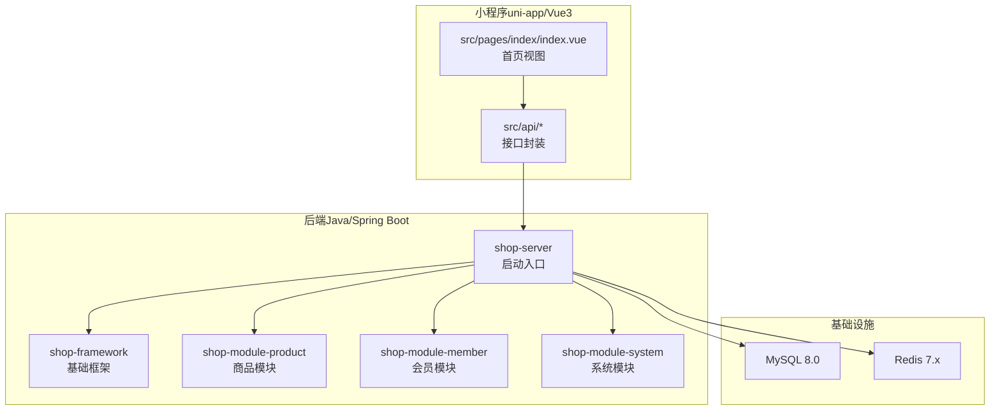
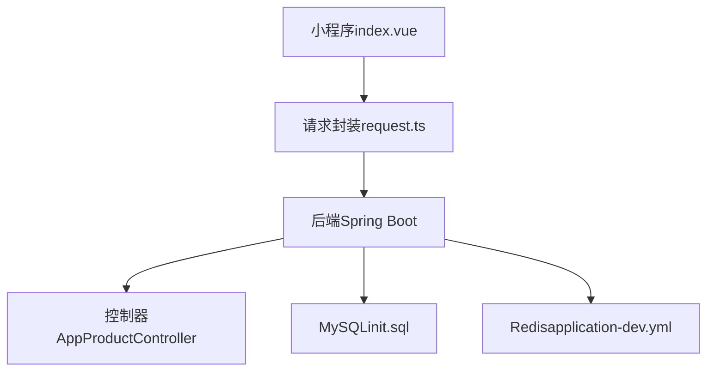
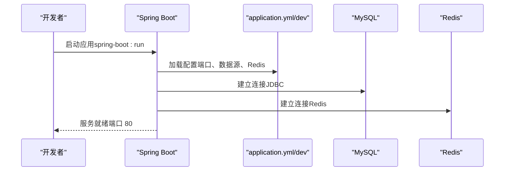
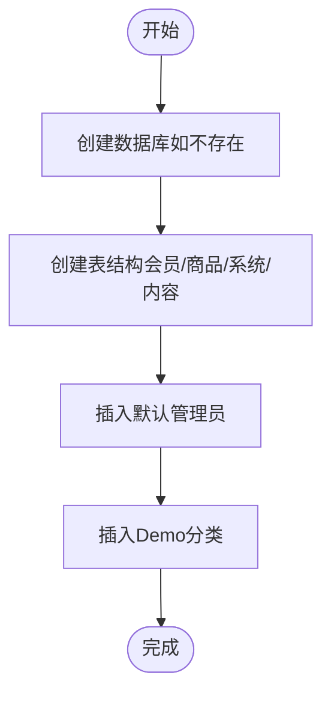
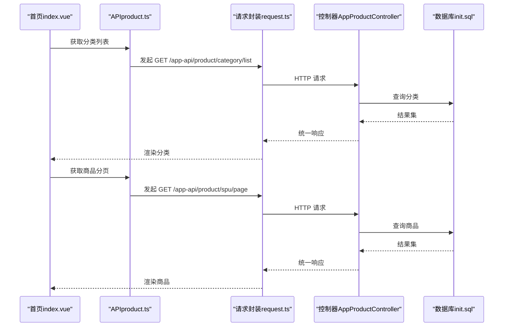
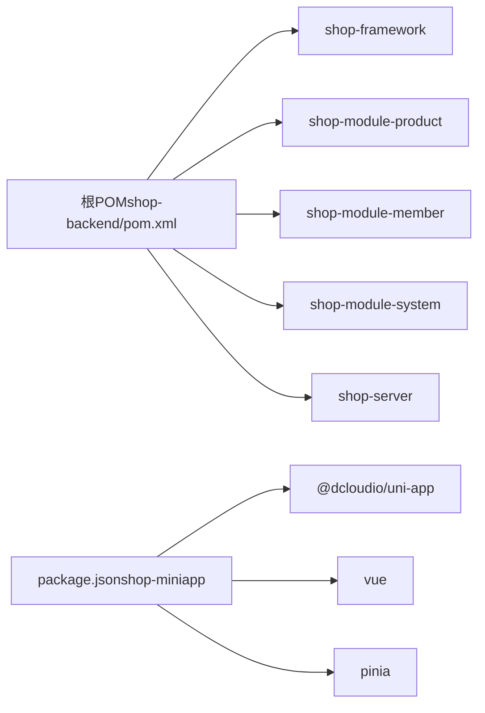

# 快速开始

<cite>
**本文引用的文件**
- [README.md](file://README.md)
- [init.sql](file://sql/init.sql)
- [Dockerfile](file://shop-backend/Dockerfile)
- [application.yml](file://shop-backend/shop-server/src/main/resources/application.yml)
- [application-dev.yml](file://shop-backend/shop-server/src/main/resources/application-dev.yml)
- [pom.xml](file://shop-backend/pom.xml)
- [ShopServerApplication.java](file://shop-backend/shop-server/src/main/java/com/shop/server/ShopServerApplication.java)
- [AppProductController.java](file://shop-backend/shop-module-product/src/main/java/com/shop/module/product/controller/app/AppProductController.java)
- [AdminProductController.java](file://shop-backend/shop-module-product/src/main/java/com/shop/module/product/controller/admin/AdminProductController.java)
- [AdminCategoryController.java](file://shop-backend/shop-module-product/src/main/java/com/shop/module/product/controller/admin/AdminCategoryController.java)
- [package.json](file://shop-miniapp/package.json)
- [vite.config.ts](file://shop-miniapp/vite.config.ts)
- [request.ts](file://shop-miniapp/src/api/request.ts)
- [product.ts](file://shop-miniapp/src/api/product.ts)
- [index.vue](file://shop-miniapp/src/pages/index/index.vue)
</cite>

## 目录
1. [简介](#简介)
2. [项目结构](#项目结构)
3. [核心组件](#核心组件)
4. [架构概览](#架构概览)
5. [详细组件分析](#详细组件分析)
6. [依赖分析](#依赖分析)
7. [性能考虑](#性能考虑)
8. [故障排除指南](#故障排除指南)
9. [结论](#结论)
10. [附录](#附录)

## 简介
本指南面向首次接触“药食同源”微信小程序商城项目的开发者，目标是在最短时间内完成环境准备、服务启动、数据初始化、后端与小程序联调，并通过本地验证确认核心功能可用。项目技术栈为：后端 Java 17 + Spring Boot 3.2 + MyBatis-Plus + MySQL 8 + Redis 7；前端 uni-app（Vue3 + TypeScript + Pinia）；部署采用微信云托管（Docker 容器）。

## 项目结构
项目采用前后端分离与多模块后端架构：
- 后端（shop-backend）：Maven 多模块，包含基础框架层（shop-framework）与业务模块（shop-module-*），以及启动入口（shop-server）
- 小程序（shop-miniapp）：基于 uni-app 的微信小程序工程
- 数据库初始化脚本（sql/init.sql）

**图表来源**
- [ShopServerApplication.java:1-17](file://shop-backend/shop-server/src/main/java/com/shop/server/ShopServerApplication.java#L1-L17)
- [pom.xml:14-20](file://shop-backend/pom.xml#L14-L20)
- [package.json:1-27](file://shop-miniapp/package.json#L1-L27)

**章节来源**
- [README.md:12-41](file://README.md#L12-L41)
- [pom.xml:14-20](file://shop-backend/pom.xml#L14-L20)
- [package.json:1-27](file://shop-miniapp/package.json#L1-L27)

## 核心组件
- 后端启动类：负责扫描组件与 Mapper，加载配置，启动应用
- 应用配置：默认激活 dev 环境，监听 80 端口，连接本地 MySQL 与 Redis
- 数据库初始化：提供完整建表与 Demo 数据（管理员、分类等）
- 小程序接口：统一请求封装，自动注入 Authorization 头，处理鉴权与错误提示
- 核心 API 控制器：提供移动端分类列表、商品分页、详情，以及管理端商品与分类 CRUD

**章节来源**
- [ShopServerApplication.java:8-16](file://shop-backend/shop-server/src/main/java/com/shop/server/ShopServerApplication.java#L8-L16)
- [application.yml:1-7](file://shop-backend/shop-server/src/main/resources/application.yml#L1-L7)
- [application-dev.yml:1-26](file://shop-backend/shop-server/src/main/resources/application-dev.yml#L1-L26)
- [init.sql:1-123](file://sql/init.sql#L1-L123)
- [request.ts:14-48](file://shop-miniapp/src/api/request.ts#L14-L48)
- [AppProductController.java:23-37](file://shop-backend/shop-module-product/src/main/java/com/shop/module/product/controller/app/AppProductController.java#L23-L37)
- [AdminProductController.java:23-39](file://shop-backend/shop-module-product/src/main/java/com/shop/module/product/controller/admin/AdminProductController.java#L23-L39)
- [AdminCategoryController.java:23-39](file://shop-backend/shop-module-product/src/main/java/com/shop/module/product/controller/admin/AdminCategoryController.java#L23-L39)

## 架构概览
后端以 Spring Boot 自动装配为基础，通过 MyBatis-Plus 访问 MySQL，使用 Redis 存储缓存与会话信息；小程序通过 HTTP 请求访问后端 API，首页同时展示分类与商品列表。

**图表来源**
- [index.vue:33-62](file://shop-miniapp/src/pages/index/index.vue#L33-L62)
- [request.ts:16-47](file://shop-miniapp/src/api/request.ts#L16-L47)
- [AppProductController.java:15-38](file://shop-backend/shop-module-product/src/main/java/com/shop/module/product/controller/app/AppProductController.java#L15-L38)
- [application-dev.yml:8-12](file://shop-backend/shop-server/src/main/resources/application-dev.yml#L8-L12)
- [init.sql:5-123](file://sql/init.sql#L5-L123)

## 详细组件分析

### 后端启动与配置
- 启动类启用组件扫描与 Mapper 扫描，确保模块内服务与数据访问层被正确注册
- 默认激活 dev 环境，端口 80，连接本地 MySQL 与 Redis
- 生产镜像构建使用 Maven + Eclipse Temurin 17，最终 JRE 运行

**图表来源**
- [ShopServerApplication.java:13-15](file://shop-backend/shop-server/src/main/java/com/shop/server/ShopServerApplication.java#L13-L15)
- [application.yml:5-7](file://shop-backend/shop-server/src/main/resources/application.yml#L5-L7)
- [application-dev.yml:1-26](file://shop-backend/shop-server/src/main/resources/application-dev.yml#L1-L26)

**章节来源**
- [ShopServerApplication.java:8-16](file://shop-backend/shop-server/src/main/java/com/shop/server/ShopServerApplication.java#L8-L16)
- [application.yml:1-7](file://shop-backend/shop-server/src/main/resources/application.yml#L1-L7)
- [application-dev.yml:1-26](file://shop-backend/shop-server/src/main/resources/application-dev.yml#L1-L26)
- [Dockerfile:1-16](file://shop-backend/Dockerfile#L1-L16)

### 数据库初始化与表结构
- 初始化脚本创建数据库与核心表：会员、商品分类、商品 SPU/SKU、系统管理员、内容轮播等
- 提供默认管理员账号（密码见脚本注释），以及 Demo 分类数据
- 建议在本地 MySQL 8.0 中执行该脚本完成表结构与初始数据

**图表来源**
- [init.sql:5-123](file://sql/init.sql#L5-L123)

**章节来源**
- [init.sql:1-123](file://sql/init.sql#L1-L123)

### 小程序接口与页面联动
- 请求封装统一处理响应码、鉴权失败清理 token、网络异常提示
- 首页组件加载分类与商品列表，支持点击分类筛选
- API 映射到后端控制器路径，实现移动端数据拉取

**图表来源**
- [index.vue:33-62](file://shop-miniapp/src/pages/index/index.vue#L33-L62)
- [product.ts:28-41](file://shop-miniapp/src/api/product.ts#L28-L41)
- [request.ts:16-47](file://shop-miniapp/src/api/request.ts#L16-L47)
- [AppProductController.java:23-37](file://shop-backend/shop-module-product/src/main/java/com/shop/module/product/controller/app/AppProductController.java#L23-L37)
- [init.sql:28-81](file://sql/init.sql#L28-L81)

**章节来源**
- [request.ts:14-48](file://shop-miniapp/src/api/request.ts#L14-L48)
- [product.ts:28-41](file://shop-miniapp/src/api/product.ts#L28-L41)
- [index.vue:33-62](file://shop-miniapp/src/pages/index/index.vue#L33-L62)

### 核心 API 列表与验证
- 移动端接口
  - GET /app-api/product/category/list：获取启用的分类列表
  - GET /app-api/product/spu/page：分页查询商品（可选分类筛选）
  - GET /app-api/product/spu/detail：获取商品详情
- 管理端接口
  - GET /admin-api/product/spu/page：分页查询商品
  - POST /admin-api/product/spu/create：创建商品
  - PUT /admin-api/product/spu/update：更新商品
  - DELETE /admin-api/product/spu/delete：删除商品
  - GET /admin-api/product/category/list：获取全部分类
  - POST /admin-api/product/category/create：创建分类
  - PUT /admin-api/product/category/update：更新分类
  - DELETE /admin-api/product/category/delete：删除分类

**章节来源**
- [AppProductController.java:23-37](file://shop-backend/shop-module-product/src/main/java/com/shop/module/product/controller/app/AppProductController.java#L23-L37)
- [AdminProductController.java:18-39](file://shop-backend/shop-module-product/src/main/java/com/shop/module/product/controller/admin/AdminProductController.java#L18-L39)
- [AdminCategoryController.java:18-39](file://shop-backend/shop-module-product/src/main/java/com/shop/module/product/controller/admin/AdminCategoryController.java#L18-L39)

## 依赖分析
- 后端依赖管理：集中定义 Java 版本、Spring Boot 3.2、MyBatis-Plus 3.5.6、JWT 等版本
- 模块划分：framework（通用能力）、module-*（业务域）、server（启动入口）
- 小程序依赖：uni-app、Vue3、Pinia、TypeScript、Vite 插件等

**图表来源**
- [pom.xml:14-20](file://shop-backend/pom.xml#L14-L20)
- [pom.xml:22-31](file://shop-backend/pom.xml#L22-L31)
- [package.json:8-25](file://shop-miniapp/package.json#L8-L25)

**章节来源**
- [pom.xml:1-103](file://shop-backend/pom.xml#L1-L103)
- [package.json:1-27](file://shop-miniapp/package.json#L1-L27)

## 性能考虑
- 启动参数：生产镜像使用固定堆大小参数，建议根据并发与数据规模调整
- 数据库连接：确保 MySQL 与 Redis 连接池参数合理，避免慢查询
- 前端渲染：首页商品列表采用网格布局，注意图片懒加载与尺寸优化
- 缓存策略：结合 Redis 缓存热点数据，降低数据库压力

**章节来源**
- [Dockerfile:11-16](file://shop-backend/Dockerfile#L11-L16)
- [application-dev.yml:8-12](file://shop-backend/shop-server/src/main/resources/application-dev.yml#L8-L12)

## 故障排除指南
- 端口占用
  - 现象：后端启动失败，提示端口 80 被占用
  - 处理：释放 80 端口或修改 application.yml 中 server.port
- 数据库连接失败
  - 现象：启动日志出现数据库连接异常
  - 处理：检查 application-dev.yml 中 MySQL 地址、账号、密码是否正确；确认 MySQL 8.0 已启动且 init.sql 已执行
- Redis 连接失败
  - 现象：启动日志出现 Redis 连接异常
  - 处理：确认 Redis 7.x 已启动，application-dev.yml 中 host/port 正确
- 小程序无法请求后端
  - 现象：控制台提示跨域或网络异常
  - 处理：确认后端已启动并监听 80 端口；检查 request.ts 中 BASE_URL 是否指向正确地址
- 鉴权失败
  - 现象：返回 401 并提示请先登录
  - 处理：小程序侧会自动清除 token 并提示登录；后端需正确配置安全与 Token 机制（参考框架模块）
- Docker 镜像构建失败
  - 现象：构建阶段下载依赖超时或失败
  - 处理：检查网络与 Maven 仓库配置；必要时更换镜像源

**章节来源**
- [application.yml:5-7](file://shop-backend/shop-server/src/main/resources/application.yml#L5-L7)
- [application-dev.yml:1-26](file://shop-backend/shop-server/src/main/resources/application-dev.yml#L1-L26)
- [request.ts:32-35](file://shop-miniapp/src/api/request.ts#L32-L35)
- [Dockerfile:1-16](file://shop-backend/Dockerfile#L1-L16)

## 结论
按照本指南完成环境准备、基础服务启动、数据库初始化、后端与小程序联调，即可在本地看到“药食同源”小程序商城的首页效果：分类栏与商品列表正常渲染，并支持分类筛选。后续可继续扩展管理后台与更多业务模块。

## 附录

### 环境要求
- JDK 17+
- Maven 3.8+
- MySQL 8.0
- Redis 7.x
- Node.js 18+
- 微信开发者工具

**章节来源**
- [README.md:52-59](file://README.md#L52-L59)

### 分步骤安装与启动
- 启动基础服务（Docker）
  - MySQL：docker run -d --name shop-mysql -e MYSQL_ROOT_PASSWORD=root -p 3306:3306 mysql:8.0
  - Redis：docker run -d --name shop-redis -p 6379:6379 redis:7-alpine
- 初始化数据库
  - mysql -h 127.0.0.1 -u root -proot < sql/init.sql
- 启动后端服务
  - cd shop-backend && mvn clean compile -DskipTests
  - mvn spring-boot:run -pl shop-server
- 启动小程序
  - cd shop-miniapp && npm install
  - npm run dev:mp-weixin
- 在微信开发者工具中导入
  - 项目目录选择 shop-miniapp/dist/dev/mp-weixin
  - AppID 使用测试号或自填
  - 编译预览

**章节来源**
- [README.md:61-116](file://README.md#L61-L116)

### 本地测试与验证清单
- 后端启动（端口 80）：日志无报错
- GET /app-api/product/category/list：返回 4 个分类
- POST /admin-api/product/spu/create：创建商品成功
- GET /app-api/product/spu/page：返回商品列表
- 小程序首页分类栏：正常渲染分类标签
- 小程序首页商品列表：正常渲染商品卡片
- 点击分类筛选：商品列表更新

**章节来源**
- [README.md:117-129](file://README.md#L117-L129)

### curl 命令示例（验证核心接口）
- 获取商品分类列表：curl http://localhost/app-api/product/category/list
- 创建测试商品：curl -X POST http://localhost/admin-api/product/spu/create -H "Content-Type: application/json" -d '{"categoryId":1,"name":"宁夏枸杞 500g","introduction":"头茬大果粒","picUrl":"https://via.placeholder.com/400","price":5900,"marketPrice":9900,"stock":100,"status":1}'
- 获取商品分页列表：curl http://localhost/app-api/product/spu/page?pageNo=1&pageSize=10

**章节来源**
- [README.md:87-100](file://README.md#L87-L100)