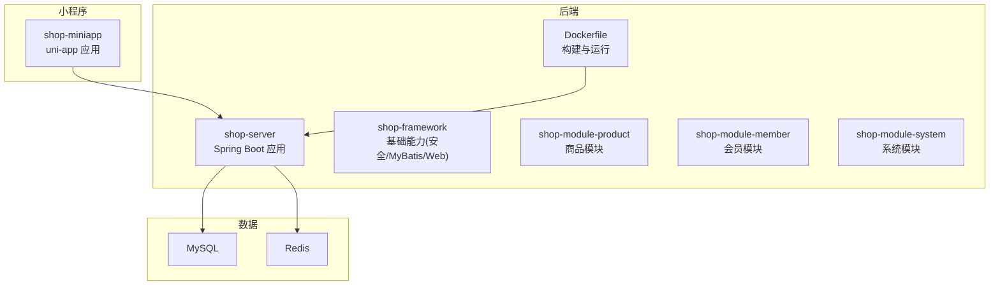
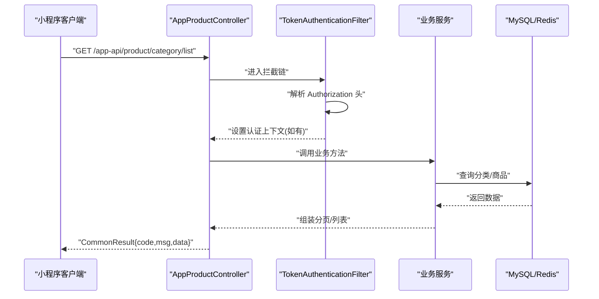
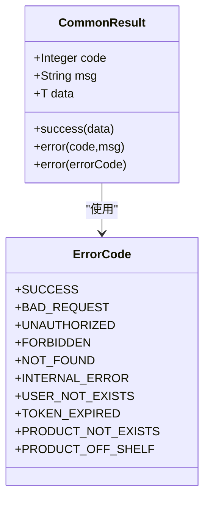
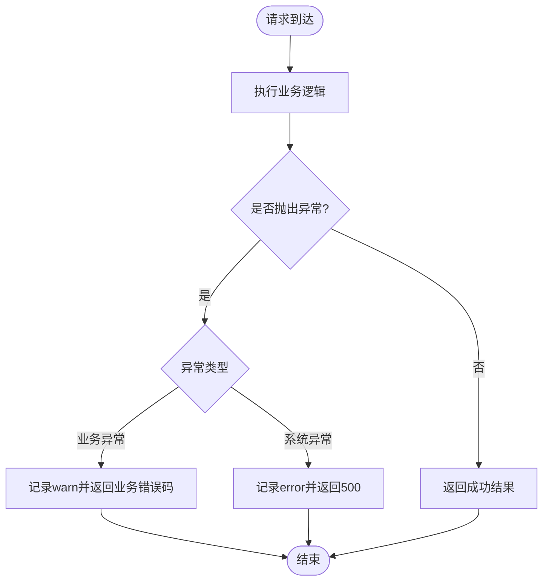
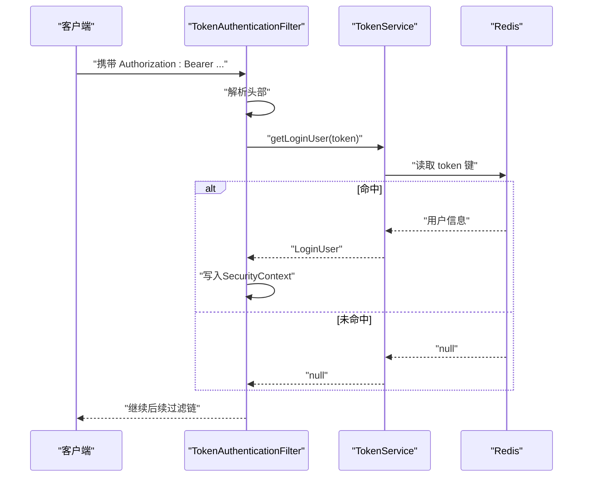
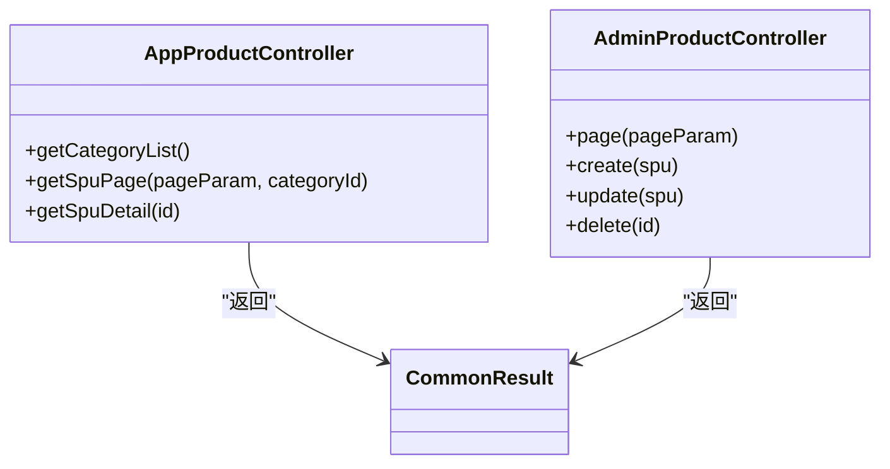
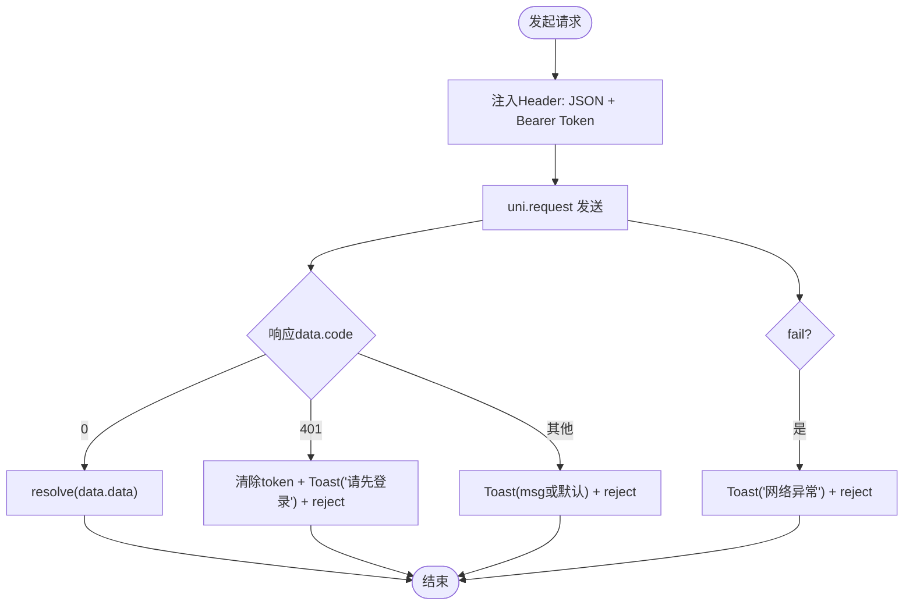
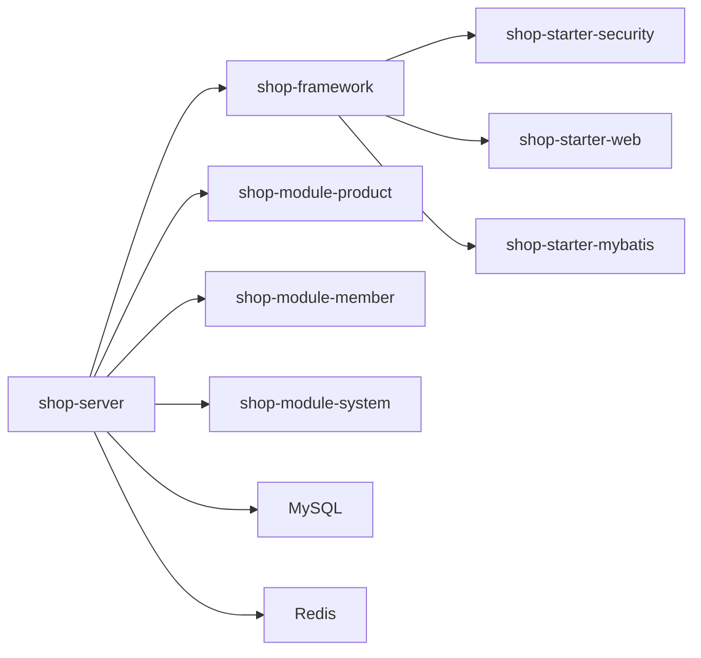

# 故障排除

<cite>
**本文引用的文件**
- [README.md](file://README.md)
- [Dockerfile](file://shop-backend/Dockerfile)
- [application.yml](file://shop-backend/shop-server/src/main/resources/application.yml)
- [application-dev.yml](file://shop-backend/shop-server/src/main/resources/application-dev.yml)
- [ErrorCode.java](file://shop-backend/shop-framework/shop-common/src/main/java/com/shop/common/exception/ErrorCode.java)
- [GlobalExceptionHandler.java](file://shop-backend/shop-framework/shop-common/src/main/java/com/shop/common/exception/GlobalExceptionHandler.java)
- [ServerException.java](file://shop-backend/shop-framework/shop-common/src/main/java/com/shop/common/exception/ServerException.java)
- [CommonResult.java](file://shop-backend/shop-framework/shop-common/src/main/java/com/shop/common/pojo/CommonResult.java)
- [TokenAuthenticationFilter.java](file://shop-backend/shop-framework/shop-starter-security/src/main/java/com/shop/framework/security/TokenAuthenticationFilter.java)
- [TokenService.java](file://shop-backend/shop-framework/shop-starter-security/src/main/java/com/shop/framework/security/TokenService.java)
- [AppProductController.java](file://shop-backend/shop-module-product/src/main/java/com/shop/module/product/controller/app/AppProductController.java)
- [AdminProductController.java](file://shop-backend/shop-module-product/src/main/java/com/shop/module/product/controller/admin/AdminProductController.java)
- [request.ts](file://shop-miniapp/src/api/request.ts)
- [init.sql](file://sql/init.sql)
- [package.json](file://shop-miniapp/package.json)
- [vite.config.ts](file://shop-miniapp/vite.config.ts)
</cite>

## 目录
1. [引言](#引言)
2. [项目结构](#项目结构)
3. [核心组件](#核心组件)
4. [架构总览](#架构总览)
5. [详细组件分析](#详细组件分析)
6. [依赖分析](#依赖分析)
7. [性能考虑](#性能考虑)
8. [故障排除指南](#故障排除指南)
9. [结论](#结论)
10. [附录](#附录)

## 引言
本指南面向技术支持与运维工程师，围绕“药食同源”微信小程序商城的后端与小程序侧，提供系统化、可操作的故障排除流程与最佳实践。内容覆盖后端服务启动失败、数据库连接异常、API 接口错误、小程序编译与运行问题、日志分析与错误码解读、性能诊断、监控与告警、应急响应以及开发与生产环境差异要点。

## 项目结构
项目采用前后端分离架构：
- 后端：多模块 Maven 工程，包含基础框架、业务模块与启动入口；通过 Dockerfile 构建镜像并以容器方式部署。
- 小程序：基于 uni-app/Vue3/TypeScript/Pinia 的跨端应用，目标平台为微信小程序。

**图表来源**
- [Dockerfile:1-16](file://shop-backend/Dockerfile#L1-L16)
- [application.yml:1-7](file://shop-backend/shop-server/src/main/resources/application.yml#L1-L7)
- [application-dev.yml:1-26](file://shop-backend/shop-server/src/main/resources/application-dev.yml#L1-L26)

**章节来源**
- [README.md:12-41](file://README.md#L12-L41)
- [README.md:50-116](file://README.md#L50-L116)

## 核心组件
- 统一返回体与错误码：统一响应结构与错误码枚举，便于前后端一致处理。
- 全局异常处理：集中捕获业务异常与系统异常，输出标准化错误。
- 安全与鉴权：基于 JWT 的 Token 过滤器与 TokenService，结合 Redis 存储。
- API 控制器：提供小程序端与管理端的商品相关接口。
- 小程序请求封装：统一请求头注入、错误提示与 401 自动登出逻辑。
- 数据初始化：提供完整的数据库建表与演示数据。

**章节来源**
- [CommonResult.java:1-34](file://shop-backend/shop-framework/shop-common/src/main/java/com/shop/common/pojo/CommonResult.java#L1-L34)
- [ErrorCode.java:1-26](file://shop-backend/shop-framework/shop-common/src/main/java/com/shop/common/exception/ErrorCode.java#L1-L26)
- [GlobalExceptionHandler.java:1-24](file://shop-backend/shop-framework/shop-common/src/main/java/com/shop/common/exception/GlobalExceptionHandler.java#L1-L24)
- [TokenAuthenticationFilter.java:1-43](file://shop-backend/shop-framework/shop-starter-security/src/main/java/com/shop/framework/security/TokenAuthenticationFilter.java#L1-L43)
- [TokenService.java:1-47](file://shop-backend/shop-framework/shop-starter-security/src/main/java/com/shop/framework/security/TokenService.java#L1-L47)
- [AppProductController.java:1-39](file://shop-backend/shop-module-product/src/main/java/com/shop/module/product/controller/app/AppProductController.java#L1-L39)
- [AdminProductController.java:1-41](file://shop-backend/shop-module-product/src/main/java/com/shop/module/product/controller/admin/AdminProductController.java#L1-L41)
- [request.ts:1-48](file://shop-miniapp/src/api/request.ts#L1-L48)
- [init.sql:1-123](file://sql/init.sql#L1-L123)

## 架构总览
后端通过 Spring Boot 提供 REST API，小程序通过 HTTP 请求访问。认证采用 Bearer Token，鉴权由过滤器解析并写入安全上下文，业务异常通过全局异常处理器统一返回。

**图表来源**
- [AppProductController.java:23-26](file://shop-backend/shop-module-product/src/main/java/com/shop/module/product/controller/app/AppProductController.java#L23-L26)
- [TokenAuthenticationFilter.java:20-33](file://shop-backend/shop-framework/shop-starter-security/src/main/java/com/shop/framework/security/TokenAuthenticationFilter.java#L20-L33)
- [CommonResult.java:15-32](file://shop-backend/shop-framework/shop-common/src/main/java/com/shop/common/pojo/CommonResult.java#L15-L32)

## 详细组件分析

### 统一错误码与返回体
- 错误码覆盖通用 HTTP 状态与业务错误，便于前端按 code 分支处理。
- 返回体包含 code/msg/data，便于调试与监控。

**图表来源**
- [CommonResult.java:8-34](file://shop-backend/shop-framework/shop-common/src/main/java/com/shop/common/pojo/CommonResult.java#L8-L34)
- [ErrorCode.java:8-25](file://shop-backend/shop-framework/shop-common/src/main/java/com/shop/common/exception/ErrorCode.java#L8-L25)

**章节来源**
- [CommonResult.java:1-34](file://shop-backend/shop-framework/shop-common/src/main/java/com/shop/common/pojo/CommonResult.java#L1-L34)
- [ErrorCode.java:1-26](file://shop-backend/shop-framework/shop-common/src/main/java/com/shop/common/exception/ErrorCode.java#L1-L26)

### 全局异常处理
- 捕获业务异常与系统异常，分别返回对应错误码与系统异常码，并记录日志。

**图表来源**
- [GlobalExceptionHandler.java:12-22](file://shop-backend/shop-framework/shop-common/src/main/java/com/shop/common/exception/GlobalExceptionHandler.java#L12-L22)

**章节来源**
- [GlobalExceptionHandler.java:1-24](file://shop-backend/shop-framework/shop-common/src/main/java/com/shop/common/exception/GlobalExceptionHandler.java#L1-L24)

### 安全与鉴权
- Token 解析：从 Authorization 头中提取 Bearer Token 并交由 TokenService 校验。
- Token 存储：使用 Redis 存储 token -> 用户信息键值对，带过期时间。
- 登录态失效：当 Redis 中无该 token 或为空时，放行但不设置认证上下文。

**图表来源**
- [TokenAuthenticationFilter.java:20-41](file://shop-backend/shop-framework/shop-starter-security/src/main/java/com/shop/framework/security/TokenAuthenticationFilter.java#L20-L41)
- [TokenService.java:27-41](file://shop-backend/shop-framework/shop-starter-security/src/main/java/com/shop/framework/security/TokenService.java#L27-L41)

**章节来源**
- [TokenAuthenticationFilter.java:1-43](file://shop-backend/shop-framework/shop-starter-security/src/main/java/com/shop/framework/security/TokenAuthenticationFilter.java#L1-L43)
- [TokenService.java:1-47](file://shop-backend/shop-framework/shop-starter-security/src/main/java/com/shop/framework/security/TokenService.java#L1-L47)

### API 控制器
- 小程序端控制器提供分类列表、商品分页、详情等接口。
- 管理端控制器提供商品分页、创建、更新、删除等接口。

**图表来源**
- [AppProductController.java:15-38](file://shop-backend/shop-module-product/src/main/java/com/shop/module/product/controller/app/AppProductController.java#L15-L38)
- [AdminProductController.java:11-40](file://shop-backend/shop-module-product/src/main/java/com/shop/module/product/controller/admin/AdminProductController.java#L11-L40)

**章节来源**
- [AppProductController.java:1-39](file://shop-backend/shop-module-product/src/main/java/com/shop/module/product/controller/app/AppProductController.java#L1-L39)
- [AdminProductController.java:1-41](file://shop-backend/shop-module-product/src/main/java/com/shop/module/product/controller/admin/AdminProductController.java#L1-L41)

### 小程序请求封装
- 统一注入 Content-Type 与 Authorization 头。
- 根据返回 code 分支处理：0 成功、401 清除 token 并提示登录、其他提示 msg。
- 网络失败统一提示“网络异常”。

**图表来源**
- [request.ts:16-47](file://shop-miniapp/src/api/request.ts#L16-L47)

**章节来源**
- [request.ts:1-48](file://shop-miniapp/src/api/request.ts#L1-L48)

## 依赖分析
- 后端依赖关系：shop-server 依赖各模块与基础框架；基础框架提供安全、Web、MyBatis 配置。
- 数据依赖：MySQL 提供业务数据，Redis 提供 Token 存储。
- 小程序依赖：通过 uni-app 生态与微信小程序平台对接。

**图表来源**
- [Dockerfile:1-16](file://shop-backend/Dockerfile#L1-L16)
- [application-dev.yml:1-26](file://shop-backend/shop-server/src/main/resources/application-dev.yml#L1-L26)

**章节来源**
- [README.md:20-30](file://README.md#L20-L30)

## 性能考虑
- 数据库查询优化
  - 使用索引：分类与商品表存在常用查询索引，确保查询走索引。
  - 分页参数校验：避免超大页号/页大小导致慢查询。
  - 逻辑删除字段：减少全表扫描，提升查询效率。
- 缓存策略
  - Redis 存储 Token，注意过期时间与键空间设计，避免热 key。
  - 对热点数据可引入二级缓存（需在业务层扩展）。
- 前端性能
  - 图片懒加载与压缩，合理使用骨架屏。
  - 减少不必要的页面重渲染，利用 Pinia 精准更新。
- 容器与 JVM
  - 容器内存限制与 JVM 参数已设定，避免 OOM。
  - 生产环境建议启用 GC 日志与 APM 监控。

[本节为通用指导，无需列出章节来源]

## 故障排除指南

### 一、后端服务启动失败
- 症状
  - 无法访问端口 80，进程退出或卡住。
- 排查步骤
  1) 环境检查：确认 JDK、Maven、MySQL、Redis 是否就绪。
  2) 配置检查：确认激活 profile 与端口配置。
  3) 依赖检查：确认数据库与 Redis 地址、账号密码正确。
  4) 日志检查：查看 debug 级别日志，定位启动异常。
  5) 构建检查：使用 Maven 打包验证无编译错误。
  6) 容器检查：若使用云托管，确认镜像构建与容器运行参数。
- 关联文件
  - [application.yml:1-7](file://shop-backend/shop-server/src/main/resources/application.yml#L1-L7)
  - [application-dev.yml:1-26](file://shop-backend/shop-server/src/main/resources/application-dev.yml#L1-L26)
  - [Dockerfile:1-16](file://shop-backend/Dockerfile#L1-L16)

**章节来源**
- [README.md:50-85](file://README.md#L50-L85)
- [application.yml:1-7](file://shop-backend/shop-server/src/main/resources/application.yml#L1-L7)
- [application-dev.yml:1-26](file://shop-backend/shop-server/src/main/resources/application-dev.yml#L1-L26)
- [Dockerfile:1-16](file://shop-backend/Dockerfile#L1-L16)

### 二、数据库连接异常
- 症状
  - 启动时报连接失败、SQL 执行异常。
- 排查步骤
  1) 确认 MySQL 服务已启动且端口开放。
  2) 校验 application-dev.yml 中的 JDBC URL、用户名、密码。
  3) 使用 init.sql 初始化数据库与表结构。
  4) 检查字符集与时区配置。
  5) 查看 MyBatis 日志输出定位 SQL 问题。
- 关联文件
  - [application-dev.yml:2-6](file://shop-backend/shop-server/src/main/resources/application-dev.yml#L2-L6)
  - [init.sql:1-123](file://sql/init.sql#L1-L123)

**章节来源**
- [application-dev.yml:1-26](file://shop-backend/shop-server/src/main/resources/application-dev.yml#L1-L26)
- [init.sql:1-123](file://sql/init.sql#L1-L123)

### 三、API 接口错误
- 常见错误与定位
  - 400 参数错误：检查请求参数与分页参数。
  - 401 未登录：检查 Authorization 头是否携带 Bearer Token。
  - 403 无权限：检查用户角色与业务权限。
  - 404 资源不存在：检查路径与资源是否存在。
  - 500 系统异常：查看全局异常日志。
- 排查步骤
  1) 使用 curl/Postman 直接调用接口，观察返回码与消息。
  2) 核对控制器路径与方法签名。
  3) 若涉及鉴权，检查 Token 是否有效与 Redis 是否可用。
  4) 查看后端日志中的 warn/error。
- 关联文件
  - [AppProductController.java:23-38](file://shop-backend/shop-module-product/src/main/java/com/shop/module/product/controller/app/AppProductController.java#L23-L38)
  - [AdminProductController.java:18-40](file://shop-backend/shop-module-product/src/main/java/com/shop/module/product/controller/admin/AdminProductController.java#L18-L40)
  - [TokenAuthenticationFilter.java:20-33](file://shop-backend/shop-framework/shop-starter-security/src/main/java/com/shop/framework/security/TokenAuthenticationFilter.java#L20-L33)
  - [GlobalExceptionHandler.java:12-22](file://shop-backend/shop-framework/shop-common/src/main/java/com/shop/common/exception/GlobalExceptionHandler.java#L12-L22)

**章节来源**
- [AppProductController.java:1-39](file://shop-backend/shop-module-product/src/main/java/com/shop/module/product/controller/app/AppProductController.java#L1-L39)
- [AdminProductController.java:1-41](file://shop-backend/shop-module-product/src/main/java/com/shop/module/product/controller/admin/AdminProductController.java#L1-L41)
- [TokenAuthenticationFilter.java:1-43](file://shop-backend/shop-framework/shop-starter-security/src/main/java/com/shop/framework/security/TokenAuthenticationFilter.java#L1-L43)
- [GlobalExceptionHandler.java:1-24](file://shop-backend/shop-framework/shop-common/src/main/java/com/shop/common/exception/GlobalExceptionHandler.java#L1-L24)

### 四、小程序编译与运行问题
- 症状
  - npm install 失败、dev:mp-weixin 编译报错、微信开发者工具无法预览。
- 排查步骤
  1) 确认 Node.js 版本满足要求。
  2) 安装依赖后执行 dev:mp-weixin。
  3) 在微信开发者工具中导入 dist/dev/mp-weixin 目录。
  4) 检查 Vite 插件配置与 uni-app 版本兼容性。
- 关联文件
  - [package.json:4-7](file://shop-miniapp/package.json#L4-L7)
  - [vite.config.ts:1-7](file://shop-miniapp/vite.config.ts#L1-L7)

**章节来源**
- [README.md:102-116](file://README.md#L102-L116)
- [package.json:1-27](file://shop-miniapp/package.json#L1-L27)
- [vite.config.ts:1-7](file://shop-miniapp/vite.config.ts#L1-L7)

### 五、日志分析与错误码解读
- 日志级别
  - debug：用于开发环境定位 SQL 与业务流程。
  - warn/error：业务异常与系统异常的关键线索。
- 错误码对照
  - 0：成功
  - 400：请求参数错误
  - 401：未登录
  - 403：无权限
  - 404：资源不存在
  - 500：系统异常
  - 1001：用户不存在
  - 1002：Token 已过期
  - 1101：商品不存在
  - 1102：商品已下架
- 建议
  - 前端根据 code 做分支处理，401 触发重新登录。
  - 后端对业务异常统一抛出 ServerException，便于全局捕获。

**章节来源**
- [application-dev.yml:23-25](file://shop-backend/shop-server/src/main/resources/application-dev.yml#L23-L25)
- [ErrorCode.java:8-25](file://shop-backend/shop-framework/shop-common/src/main/java/com/shop/common/exception/ErrorCode.java#L8-L25)
- [GlobalExceptionHandler.java:12-22](file://shop-backend/shop-framework/shop-common/src/main/java/com/shop/common/exception/GlobalExceptionHandler.java#L12-L22)
- [request.ts:30-39](file://shop-miniapp/src/api/request.ts#L30-L39)

### 六、性能问题诊断
- 数据库
  - 慢查询：开启慢日志与 EXPLAIN 分析；优化索引与 SQL。
  - 逻辑删除：确认 deleted 字段生效，避免全表扫描。
- 缓存
  - Token 过期与键分布：避免集中过期与热点 key。
  - 可引入热点商品详情缓存（需扩展）。
- 前端
  - 骨架屏、懒加载、分页加载，减少首屏压力。
- 容器与 JVM
  - 容器内存上限与 JVM 参数已设定，生产建议增加监控与 GC 日志。

**章节来源**
- [application-dev.yml:17-21](file://shop-backend/shop-server/src/main/resources/application-dev.yml#L17-L21)
- [Dockerfile:14-16](file://shop-backend/Dockerfile#L14-L16)

### 七、监控指标与告警
- 指标建议
  - QPS/响应时间/错误率、数据库慢查询数、Redis 命中率、容器 CPU/内存使用。
- 告警策略
  - 错误率突增、响应时间超阈、数据库慢查询数上升、Redis 连接池耗尽。
- 应急响应
  - 快速降级非核心接口、临时扩容、回滚变更、切换备用数据库/缓存节点。

[本节为通用指导，无需列出章节来源]

### 八、开发与生产环境差异
- 开发环境
  - 端口 80、本地 MySQL/Redis、MyBatis 输出 SQL、debug 日志。
- 生产环境
  - Docker 镜像构建、JVM 内存参数、profile 切换 prod、日志级别调整。
- 工具使用
  - 开发：curl/Postman、IDE 日志面板。
  - 生产：容器日志、APM、数据库慢查询日志、Redis 监控。

**章节来源**
- [application.yml:2-3](file://shop-backend/shop-server/src/main/resources/application.yml#L2-L3)
- [application-dev.yml:13-25](file://shop-backend/shop-server/src/main/resources/application-dev.yml#L13-L25)
- [Dockerfile:14-16](file://shop-backend/Dockerfile#L14-L16)

## 结论
本指南提供了从环境准备、启动验证、接口测试到日志分析、性能优化与监控告警的全流程排障方法。建议团队在开发与生产环境中分别建立标准化的巡检清单与应急预案，持续迭代排障流程与工具链，保障系统稳定运行。

## 附录

### A. 常用验证清单
- 后端
  - 端口 80 可访问
  - GET /app-api/product/category/list 返回分类
  - POST /admin-api/product/spu/create 创建商品
  - GET /app-api/product/spu/page 返回商品列表
- 小程序
  - 首页分类栏渲染
  - 首页商品列表渲染
  - 点击分类筛选列表更新

**章节来源**
- [README.md:117-129](file://README.md#L117-L129)

### B. 关键文件路径速查
- 后端配置与启动
  - [application.yml](file://shop-backend/shop-server/src/main/resources/application.yml)
  - [application-dev.yml](file://shop-backend/shop-server/src/main/resources/application-dev.yml)
  - [Dockerfile](file://shop-backend/Dockerfile)
- 异常与返回体
  - [ErrorCode.java](file://shop-backend/shop-framework/shop-common/src/main/java/com/shop/common/exception/ErrorCode.java)
  - [GlobalExceptionHandler.java](file://shop-backend/shop-framework/shop-common/src/main/java/com/shop/common/exception/GlobalExceptionHandler.java)
  - [CommonResult.java](file://shop-backend/shop-framework/shop-common/src/main/java/com/shop/common/pojo/CommonResult.java)
- 安全与鉴权
  - [TokenAuthenticationFilter.java](file://shop-backend/shop-framework/shop-starter-security/src/main/java/com/shop/framework/security/TokenAuthenticationFilter.java)
  - [TokenService.java](file://shop-backend/shop-framework/shop-starter-security/src/main/java/com/shop/framework/security/TokenService.java)
- API 控制器
  - [AppProductController.java](file://shop-backend/shop-module-product/src/main/java/com/shop/module/product/controller/app/AppProductController.java)
  - [AdminProductController.java](file://shop-backend/shop-module-product/src/main/java/com/shop/module/product/controller/admin/AdminProductController.java)
- 小程序
  - [request.ts](file://shop-miniapp/src/api/request.ts)
  - [package.json](file://shop-miniapp/package.json)
  - [vite.config.ts](file://shop-miniapp/vite.config.ts)
- 数据初始化
  - [init.sql](file://sql/init.sql)