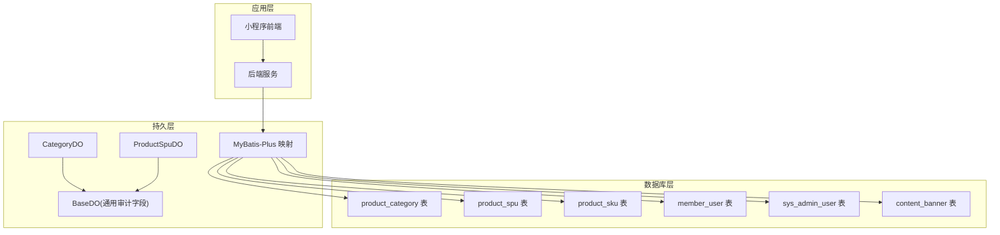
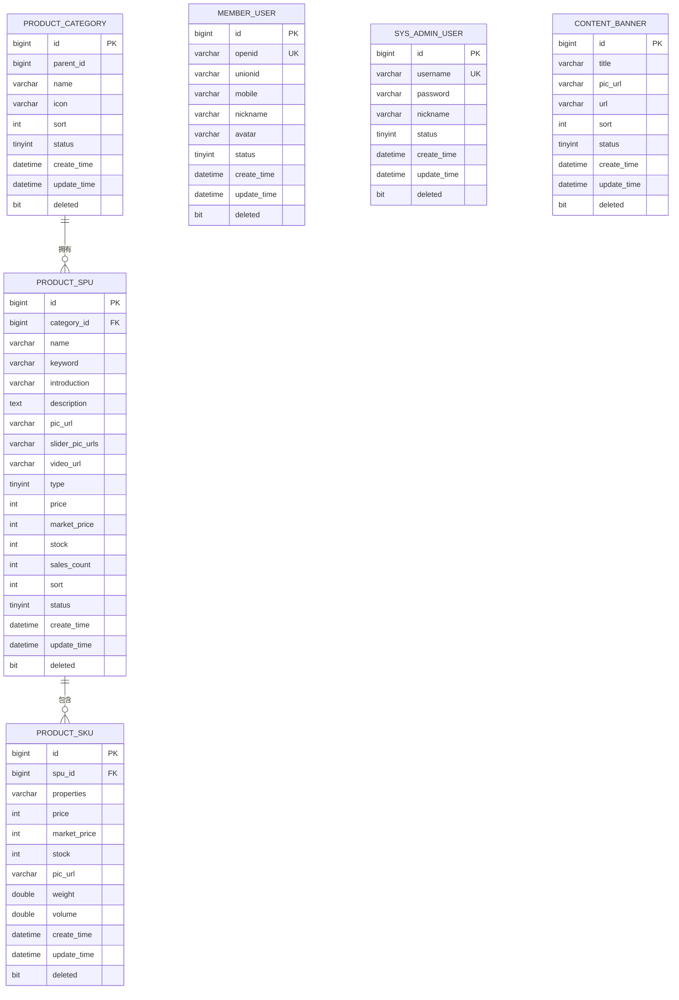
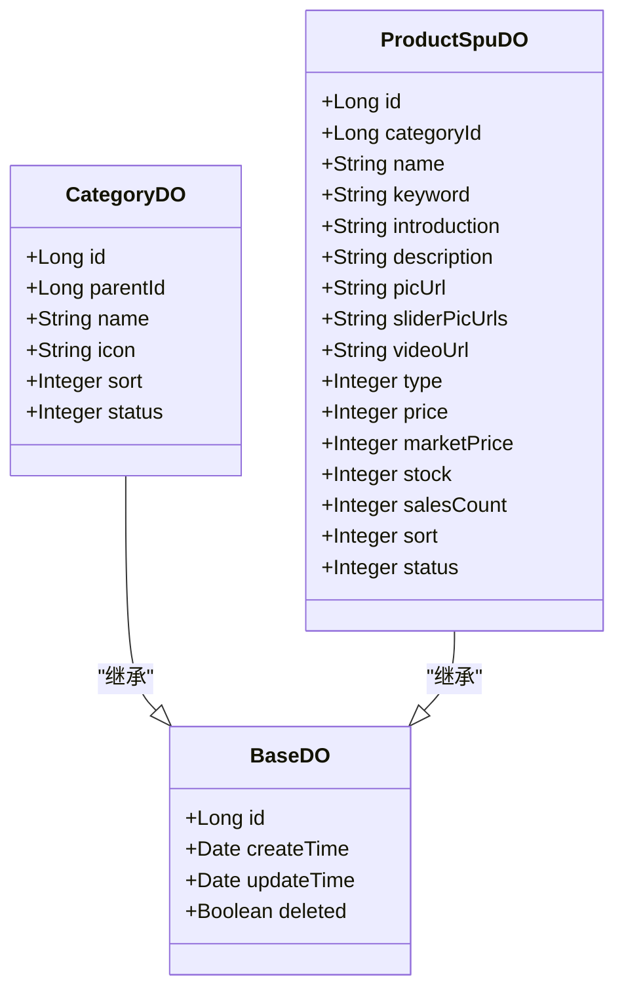
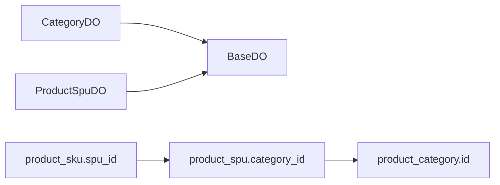

# 数据库设计

<cite>
**本文引用的文件**
- [init.sql](file://sql/init.sql)
- [CategoryDO.java](file://shop-backend/shop-module-product/src/main/java/com/shop/module/product/dal/dataobject/CategoryDO.java)
- [ProductSpuDO.java](file://shop-backend/shop-module-product/src/main/java/com/shop/module/product/dal/dataobject/ProductSpuDO.java)
- [BaseDO.java](file://shop-backend/shop-framework/shop-starter-mybatis/src/main/java/com/shop/framework/mybatis/core/BaseDO.java)
</cite>

## 目录
1. [引言](#引言)
2. [项目结构](#项目结构)
3. [核心组件](#核心组件)
4. [架构总览](#架构总览)
5. [详细组件分析](#详细组件分析)
6. [依赖分析](#依赖分析)
7. [性能考虑](#性能考虑)
8. [故障排查指南](#故障排查指南)
9. [结论](#结论)
10. [附录](#附录)

## 引言
本文件面向“药食同源”微信小程序商城的数据库设计与实现，聚焦于核心业务表结构与数据模型，覆盖商品分类、商品SPU、商品SKU、会员用户、管理员用户、轮播图等关键实体。文档从表结构、字段定义、索引策略、查询优化、数据访问模式、业务约束与生命周期管理等方面进行系统化说明，并给出迁移、版本管理与备份恢复建议，为数据库管理员与后端开发者提供完整技术参考。

## 项目结构
数据库初始化脚本位于 sql/init.sql，定义了完整的业务表结构及初始数据；后端采用 MyBatis-Plus 框架，通过 DO（Data Object）类映射数据库表，统一基类 BaseDO 提供通用审计字段（创建/更新时间、软删除标记等）。产品模块的数据对象位于 shop-module-product 的 dal.dataobject 包中，分别对应 product_category、product_spu、product_sku 等表。

**图表来源**
- [init.sql:1-123](file://sql/init.sql#L1-L123)
- [CategoryDO.java:1-23](file://shop-backend/shop-module-product/src/main/java/com/shop/module/product/dal/dataobject/CategoryDO.java#L1-L23)
- [ProductSpuDO.java:1-33](file://shop-backend/shop-module-product/src/main/java/com/shop/module/product/dal/dataobject/ProductSpuDO.java#L1-L33)
- [BaseDO.java](file://shop-backend/shop-framework/shop-starter-mybatis/src/main/java/com/shop/framework/mybatis/core/BaseDO.java)

**章节来源**
- [init.sql:1-123](file://sql/init.sql#L1-L123)

## 核心组件
本节对核心业务表进行逐项解析，包括表名、字段含义、数据类型、约束与索引策略，并结合后端 DO 类映射关系说明。

- 会员用户表 member_user
  - 字段要点：唯一标识 openid、unionid；手机号 mobile；基础资料 nickname、avatar；状态 status；软删除 deleted；时间戳 create_time、update_time。
  - 约束与索引：主键 id；唯一索引 uk_openid；普通索引 idx_mobile；统一继承 BaseDO 的审计字段。
  - 用途：绑定微信身份信息，记录会员基本信息与状态。

- 商品分类表 product_category
  - 字段要点：层级 parent_id（0 表示一级）；名称 name；图标 icon；排序 sort；状态 status；软删除 deleted；时间戳 create_time、update_time。
  - 约束与索引：主键 id；无额外索引；支持树形结构与排序展示。
  - 用途：支撑商品的多级分类体系。

- 商品SPU表 product_spu
  - 字段要点：分类 category_id；名称 name、关键词 keyword、简介 introduction；详情 description；主图 pic_url、轮播图 slider_pic_urls、视频 video_url；类型 type（实物/虚拟）；价格 price、市场价 market_price；库存 stock、销量 sales_count；排序 sort；状态 status（上下架）；软删除 deleted；时间戳 create_time、update_time。
  - 约引与索引：主键 id；索引 idx_category（按分类检索）、idx_status（按状态检索）。
  - 用途：抽象商品维度，聚合 SKU 差异，承载商品主信息与营销属性。

- 商品SKU表 product_sku
  - 字段要点：SPU 关联 spu_id；属性 properties（JSON 数组，存储属性键值对）；价格 price、市场价 market_price；库存 stock；SKU 图片 pic_url；重量 weight、体积 volume；软删除 deleted；时间戳 create_time、update_time。
  - 约束与索引：主键 id；索引 idx_spu_id（按 SPU 聚合）。
  - 用途：具体规格与价格库存，支持多属性组合。

- 管理员用户表 sys_admin_user
  - 字段要点：用户名 username（唯一）、密码 password（BCrypt）、昵称 nickname、状态 status；软删除 deleted；时间戳 create_time、update_time。
  - 约束与索引：主键 id；唯一索引 uk_username。
  - 用途：后台管理系统认证与授权主体。

- 轮播图表 content_banner
  - 字段要点：标题 title、图片 pic_url、跳转 url；排序 sort；状态 status；软删除 deleted；时间戳 create_time、update_time。
  - 约束与索引：主键 id。
  - 用途：首页轮播图内容管理。

**章节来源**
- [init.sql:10-24](file://sql/init.sql#L10-L24)
- [init.sql:28-39](file://sql/init.sql#L28-L39)
- [init.sql:41-64](file://sql/init.sql#L41-L64)
- [init.sql:66-81](file://sql/init.sql#L66-L81)
- [init.sql:85-96](file://sql/init.sql#L85-L96)
- [init.sql:111-122](file://sql/init.sql#L111-L122)
- [CategoryDO.java:13-22](file://shop-backend/shop-module-product/src/main/java/com/shop/module/product/dal/dataobject/CategoryDO.java#L13-L22)
- [ProductSpuDO.java:12-32](file://shop-backend/shop-module-product/src/main/java/com/shop/module/product/dal/dataobject/ProductSpuDO.java#L12-L32)
- [BaseDO.java](file://shop-backend/shop-framework/shop-starter-mybatis/src/main/java/com/shop/framework/mybatis/core/BaseDO.java)

## 架构总览
下图展示了数据库表之间的关系与典型查询路径，体现“分类-SPU-SKU”的商品模型以及“会员/管理员/内容”三类支撑表。

**图表来源**
- [init.sql:28-81](file://sql/init.sql#L28-L81)
- [init.sql:111-122](file://sql/init.sql#L111-L122)

## 详细组件分析

### 商品分类表（product_category）
- 设计要点
  - 支持树形结构：parent_id=0 表示一级分类，便于递归查询与层级展示。
  - 排序字段 sort 控制前台展示顺序。
  - 状态 status 控制是否启用。
- 查询模式
  - 获取启用的一级分类列表：按 parent_id=0 且 status=1 过滤，再按 sort 倒序。
  - 获取某分类下的子分类：按 parent_id 精确匹配。
- 索引策略
  - 当前未显式建立索引；若 parent_id 查询频繁，可考虑在 parent_id 上建立二级索引以加速层级遍历。
- 业务约束
  - 分类名称需唯一性校验（可在应用层或数据库层补充唯一约束）。
  - 删除时应检查是否存在关联 SPU，避免破坏外键完整性。

**章节来源**
- [init.sql:28-39](file://sql/init.sql#L28-L39)
- [CategoryDO.java:13-22](file://shop-backend/shop-module-product/src/main/java/com/shop/module/product/dal/dataobject/CategoryDO.java#L13-L22)

### 商品SPU表（product_spu）
- 设计要点
  - 关联分类 category_id，支持按分类检索。
  - 多媒体字段：主图、轮播图（JSON 数组）、视频 URL。
  - 价格以“分”为单位，避免浮点误差。
  - 销量 sales_count 用于运营统计。
- 查询模式
  - 首页/分类页：按 status=1 且 category_id 精确过滤，按 sort 或销售排序。
  - 搜索：按 keyword 模糊匹配（需配合全文索引或 LIKE 索引策略）。
- 索引策略
  - 已有 idx_category 与 idx_status，建议在 name/keyword 上增加联合索引以提升搜索效率。
- 业务约束
  - 上下架状态与库存联动：库存为 0 时建议自动下架或由运营策略控制。
  - 最低价格 price 应不小于各 SKU 的最低价格。

**章节来源**
- [init.sql:41-64](file://sql/init.sql#L41-L64)
- [ProductSpuDO.java:12-32](file://shop-backend/shop-module-product/src/main/java/com/shop/module/product/dal/dataobject/ProductSpuDO.java#L12-L32)

### 商品SKU表（product_sku）
- 设计要点
  - 属性 properties 以 JSON 存储，支持灵活的多属性组合。
  - 价格与库存独立维护，便于精细化运营。
- 查询模式
  - 按 spu_id 聚合所有 SKU，用于商品详情页展示。
  - 按属性组合定位具体 SKU（应用层解析 JSON 后进行条件拼接）。
- 索引策略
  - 已有 idx_spu_id；如属性查询频繁，可考虑在 properties 中提取常用键并建立函数索引或物化列。
- 业务约束
  - SKU 价格不得低于成本；库存不得为负；属性组合需唯一。

**章节来源**
- [init.sql:66-81](file://sql/init.sql#L66-L81)
- [ProductSpuDO.java:23-24](file://shop-backend/shop-module-product/src/main/java/com/shop/module/product/dal/dataobject/ProductSpuDO.java#L23-L24)

### 会员用户表（member_user）
- 设计要点
  - 微信 openid/unionid 唯一绑定用户身份；手机号可选，便于营销与找回。
  - 统一状态与软删除机制。
- 查询模式
  - 登录/注册：按 openid 唯一查询；手机号单独索引加速登录。
  - 用户画像：按状态与创建时间区间统计活跃用户。
- 索引策略
  - 已有 uk_openid 与 idx_mobile；建议在 nickname/avatar 等字段上按需建立辅助索引。
- 业务约束
  - 实名与风控：结合手机号与实名信息进行风控校验。
  - 数据安全：敏感字段加密存储，日志脱敏。

**章节来源**
- [init.sql:10-24](file://sql/init.sql#L10-L24)

### 管理员用户表（sys_admin_user）
- 设计要点
  - 用户名唯一；密码使用 BCrypt 加密存储。
  - 统一状态与软删除机制。
- 查询模式
  - 登录认证：按 username 查找用户并校验密码。
  - 权限控制：结合角色与菜单表进行权限判定（当前表仅含基础认证字段）。
- 索引策略
  - 已有 uk_username；建议在 nickname 上建立辅助索引。
- 业务约束
  - 登录失败次数限制与账户锁定策略。
  - 审计日志：记录登录与操作行为。

**章节来源**
- [init.sql:85-96](file://sql/init.sql#L85-L96)

### 轮播图表（content_banner）
- 设计要点
  - 标题、图片、跳转链接、排序与状态控制。
- 查询模式
  - 首页轮播：按 status=1 且排序倒序取前 N 张。
- 索引策略
  - 可在 status 与 sort 上建立联合索引以优化首页加载。
- 业务约束
  - 链接有效性校验与图片可用性检查。

**章节来源**
- [init.sql:111-122](file://sql/init.sql#L111-L122)

### 数据访问模式与实体映射
- DO 类与表映射
  - CategoryDO 对应 product_category，继承 BaseDO，具备统一审计字段。
  - ProductSpuDO 对应 product_spu，继承 BaseDO，具备统一审计字段。
- 基类 BaseDO
  - 提供 create_time、update_time、deleted 等通用字段，简化实体定义与审计逻辑。

**图表来源**
- [CategoryDO.java:10-22](file://shop-backend/shop-module-product/src/main/java/com/shop/module/product/dal/dataobject/CategoryDO.java#L10-L22)
- [ProductSpuDO.java:10-32](file://shop-backend/shop-module-product/src/main/java/com/shop/module/product/dal/dataobject/ProductSpuDO.java#L10-L32)
- [BaseDO.java](file://shop-backend/shop-framework/shop-starter-mybatis/src/main/java/com/shop/framework/mybatis/core/BaseDO.java)

## 依赖分析
- 表间依赖
  - product_spu.category_id → product_category.id
  - product_sku.spu_id → product_spu.id
- 应用层依赖
  - CategoryDO 与 ProductSpuDO 均继承 BaseDO，确保审计字段一致性。
  - MyBatis-Plus 将 DO 与表进行 ORM 映射，DAO 层通过 Mapper 接口执行 CRUD。

**图表来源**
- [CategoryDO.java:10-22](file://shop-backend/shop-module-product/src/main/java/com/shop/module/product/dal/dataobject/CategoryDO.java#L10-L22)
- [ProductSpuDO.java:10-32](file://shop-backend/shop-module-product/src/main/java/com/shop/module/product/dal/dataobject/ProductSpuDO.java#L10-L32)
- [init.sql:41-81](file://sql/init.sql#L41-L81)

**章节来源**
- [CategoryDO.java:10-22](file://shop-backend/shop-module-product/src/main/java/com/shop/module/product/dal/dataobject/CategoryDO.java#L10-L22)
- [ProductSpuDO.java:10-32](file://shop-backend/shop-module-product/src/main/java/com/shop/module/product/dal/dataobject/ProductSpuDO.java#L10-L32)
- [init.sql:41-81](file://sql/init.sql#L41-L81)

## 性能考虑
- 索引优化
  - 在 product_spu.name 与 keyword 上建立联合索引，提升搜索性能。
  - 在 product_spu.status 与 product_category.parent_id 上建立复合索引，优化分类与状态筛选。
  - 在 member_user.mobile 上建立索引，提升手机号登录效率。
- 查询优化
  - 使用覆盖索引减少回表：如首页列表仅返回必要字段。
  - 分页查询使用基于索引的游标分页或延迟关联，避免大偏移量导致的性能问题。
- 缓存策略
  - 商品分类树与热门商品详情可引入 Redis 缓存，降低数据库压力。
- 写入优化
  - 批量插入与事务合并，减少锁竞争。
  - 对高频更新字段（如 sales_count）采用异步写入或队列化处理。

## 故障排查指南
- 常见问题
  - 登录失败：检查 sys_admin_user.username 是否存在，密码是否正确加密。
  - 商品无法显示：确认 product_spu.status=1 且库存大于 0；检查分类索引是否生效。
  - 会员信息异常：核对 member_user.openid 唯一性与 idx_mobile 索引。
- 审计与追踪
  - 利用 BaseDO 的 create_time/update_time 定位异常数据变更时间点。
  - 对关键操作（上下架、价格调整、库存修改）增加审计日志。
- 数据修复
  - 软删除数据恢复：将 deleted 重置为 false 并更新 update_time。
  - 主键冲突：检查自增种子与并发插入情况，必要时调整批量步长。

**章节来源**
- [init.sql:85-96](file://sql/init.sql#L85-L96)
- [init.sql:41-64](file://sql/init.sql#L41-L64)
- [init.sql:10-24](file://sql/init.sql#L10-L24)
- [BaseDO.java](file://shop-backend/shop-framework/shop-starter-mybatis/src/main/java/com/shop/framework/mybatis/core/BaseDO.java)

## 结论
该数据库设计围绕“分类-SPU-SKU”的商品模型展开，辅以会员、管理员与内容轮播等支撑表，满足微信小程序商城的核心业务需求。通过统一的审计字段与合理的索引策略，兼顾了查询效率与维护成本。后续可在搜索、缓存与异步处理方面进一步优化，并完善权限与审计体系以满足生产环境要求。

## 附录

### 数据库迁移路径与版本管理
- 版本命名规范
  - 采用日期+序号格式（如 2026-06-22_01），每次变更生成新脚本。
- 迁移流程
  - 开发分支编写变更脚本 → 验证测试环境 → 合并到主分支 → 生产灰度发布 → 全量上线。
- 回滚策略
  - 保留逆向脚本（如删除索引、回滚字段），并进行全量数据校验。
- 自动化
  - 使用 Flyway/Liquibase 管理迁移历史与版本号，避免重复执行。

### 备份与恢复策略
- 备份周期
  - 全量备份：每日一次；增量备份：每小时一次。
- 存储与加密
  - 备份文件异地存储并加密，定期校验恢复演练。
- 恢复流程
  - RTO/RPO 目标明确；最小化停机窗口；恢复后进行数据一致性校验。

### 数据验证与业务规则
- 字段校验
  - 价格单位统一为“分”，库存非负，状态枚举合法。
- 业务规则
  - SPU 与 SKU 的价格与库存一致性校验。
  - 分类树的 parent_id 闭环校验，防止循环引用。
  - 轮播图链接与图片可用性校验。