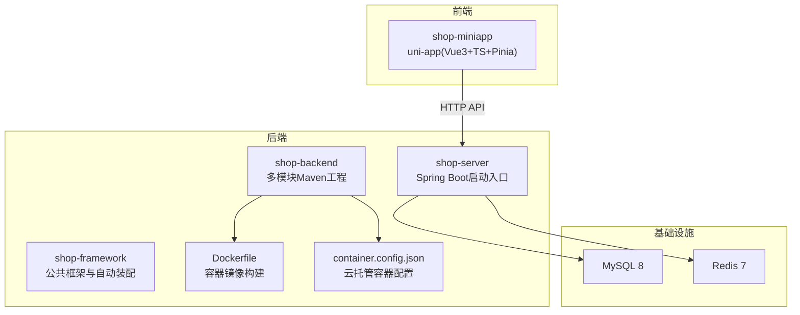
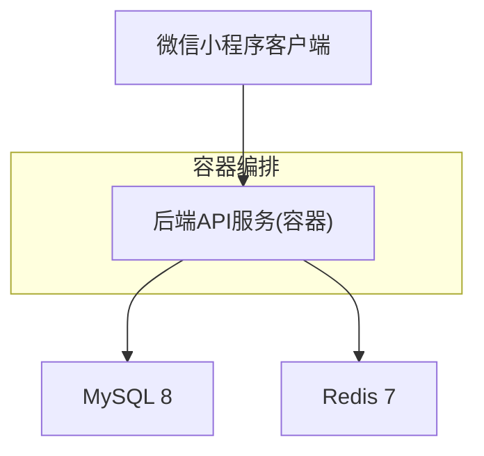
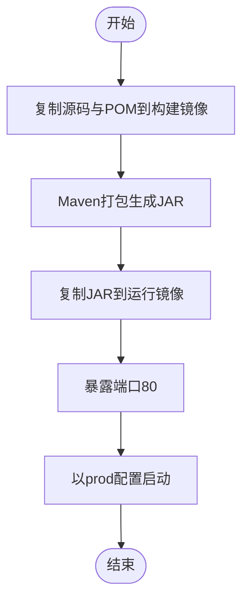
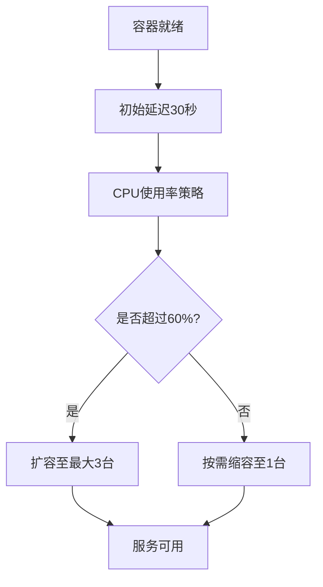
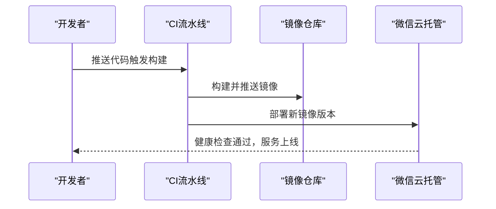
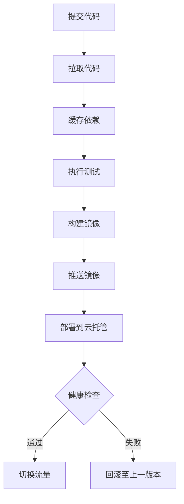
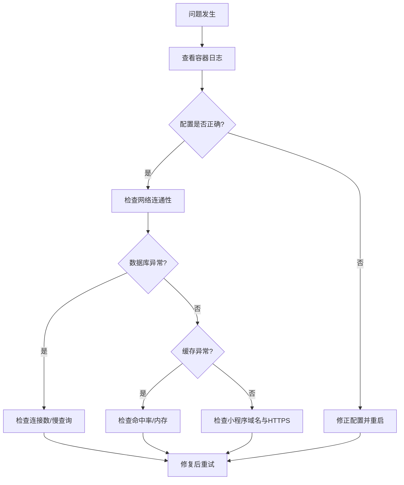
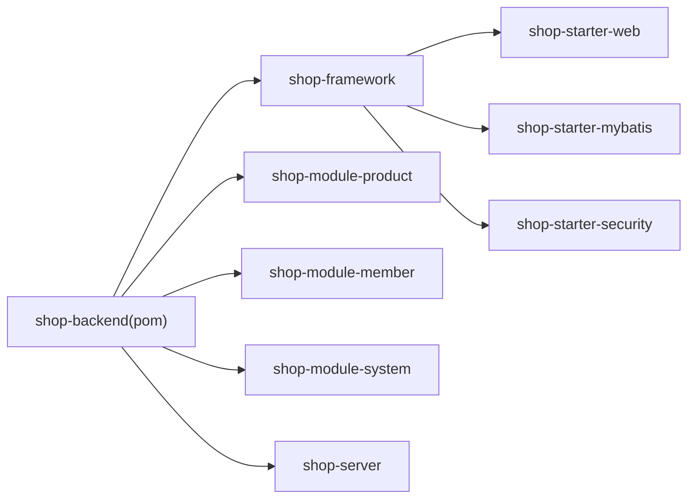

# 部署与运维

<cite>
**本文引用的文件**
- [README.md](file://README.md)
- [Dockerfile](file://shop-backend/Dockerfile)
- [container.config.json](file://shop-backend/container.config.json)
- [application.yml](file://shop-backend/shop-server/src/main/resources/application.yml)
- [application-dev.yml](file://shop-backend/shop-server/src/main/resources/application-dev.yml)
- [pom.xml](file://shop-backend/pom.xml)
- [ShopServerApplication.java](file://shop-backend/shop-server/src/main/java/com/shop/server/ShopServerApplication.java)
- [init.sql](file://sql/init.sql)
- [package.json](file://shop-miniapp/package.json)
- [status.md](file://docs/superpowers/status.md)
</cite>

## 更新摘要
**变更内容**
- 新增基于 Docker 的完整容器化部署支持
- 添加容器镜像构建配置和微信云托管编排配置
- 完善多环境配置管理和生产环境启动参数
- 增强容器编排策略和扩缩容机制

## 目录
1. [引言](#引言)
2. [项目结构](#项目结构)
3. [核心组件](#核心组件)
4. [架构总览](#架构总览)
5. [详细组件分析](#详细组件分析)
6. [依赖分析](#依赖分析)
7. [性能考虑](#性能考虑)
8. [故障排查指南](#故障排查指南)
9. [结论](#结论)
10. [附录](#附录)

## 引言
本文件面向 DevOps 工程师与系统管理员，围绕"药食同源"微信小程序商城提供一套完整的部署与运维指导。内容覆盖基于 Docker 的容器化部署、微信云托管的部署流程与环境配置、容器编排策略、CI/CD 设计与自动化测试、监控告警与日志分析、性能指标与容量规划、扩展与灾备策略，以及运维工具与脚本建议。目标是在保证稳定性与可扩展性的前提下，实现快速迭代与高效运维。

## 项目结构
项目采用前后端分离架构：
- 后端：Java 17 + Spring Boot 3.2 + MyBatis-Plus，多模块 Maven 结构，提供 REST API。
- 小程序：uni-app（Vue3 + TypeScript + Pinia），用于微信小程序端展示与交互。
- 部署：后端通过 Docker 容器化，运行于微信云托管；小程序通过 uni-app 构建产物接入微信开发者工具与云托管。

**图表来源**
- [Dockerfile:1-16](file://shop-backend/Dockerfile#L1-L16)
- [container.config.json:1-13](file://shop-backend/container.config.json#L1-L13)
- [ShopServerApplication.java:1-17](file://shop-backend/shop-server/src/main/java/com/shop/server/ShopServerApplication.java#L1-L17)
- [pom.xml:1-103](file://shop-backend/pom.xml#L1-L103)

**章节来源**
- [README.md:1-167](file://README.md#L1-L167)
- [status.md:1-77](file://docs/superpowers/status.md#L1-L77)

## 核心组件
- 容器镜像与运行时
  - 使用双阶段构建：构建阶段使用 Maven + Eclipse Temurin 17，运行阶段使用 Alpine JRE，最终暴露端口 80 并以 prod 配置启动。
  - 容器配置文件定义了最小/最大副本数、CPU/内存配额、扩缩容策略阈值与健康检查延迟。
- 应用配置
  - 默认激活 dev 环境，生产环境需通过环境变量或云托管配置切换至 prod。
  - 数据源与 Redis 地址在不同环境分别指向本地或云托管内网地址。
- 安全与鉴权
  - 基于 Redis 的 Token 机制，Token 存储带过期时间，支持创建、读取与删除。
- 数据库与初始化
  - 提供初始化 SQL，包含会员、商品、系统与内容相关的核心表，并内置演示数据。

**章节来源**
- [Dockerfile:1-16](file://shop-backend/Dockerfile#L1-L16)
- [container.config.json:1-13](file://shop-backend/container.config.json#L1-L13)
- [application.yml:1-7](file://shop-backend/shop-server/src/main/resources/application.yml#L1-L7)
- [application-dev.yml:1-26](file://shop-backend/shop-server/src/main/resources/application-dev.yml#L1-L26)
- [init.sql:1-123](file://sql/init.sql#L1-L123)

## 架构总览
后端服务通过 Docker 容器化，运行于微信云托管平台。小程序通过 uni-app 构建为微信小程序产物，接入微信开发者工具进行调试与预览。后端服务依赖 MySQL 与 Redis，二者可由云托管提供或自管。

**图表来源**
- [README.md:10-10](file://README.md#L10-L10)
- [Dockerfile:11-16](file://shop-backend/Dockerfile#L11-L16)
- [application-dev.yml:2-11](file://shop-backend/shop-server/src/main/resources/application-dev.yml#L2-L11)

## 详细组件分析

### 容器镜像与构建流程
- 构建阶段
  - 基于 Maven + Eclipse Temurin 17 的镜像，复制多模块源码并执行打包，生成可执行 JAR。
- 运行阶段
  - 基于 Eclipse Temurin 17 JRE Alpine 镜像，复制 JAR 至 /app/app.jar，设置 JVM 内存参数与启动参数，暴露端口 80。
- 启动命令
  - 以 prod 配置文件启动，确保生产环境参数生效。

**图表来源**
- [Dockerfile:1-16](file://shop-backend/Dockerfile#L1-L16)

**章节来源**
- [Dockerfile:1-16](file://shop-backend/Dockerfile#L1-L16)

### 容器编排与扩缩容策略
- 最小/最大实例数：1/3
- CPU/内存配额：0.5 CPU、1 核心内存
- 扩缩容策略：基于 CPU 使用率阈值 60%
- 健康检查：容器启动后 30 秒延迟

**图表来源**
- [container.config.json:5-12](file://shop-backend/container.config.json#L5-L12)

**章节来源**
- [container.config.json:1-13](file://shop-backend/container.config.json#L1-L13)

### 微信云托管部署流程与环境配置
- 镜像与端口
  - Dockerfile 指定容器端口 80，需与云托管容器端口一致。
- 配置文件
  - container.config.json 控制副本数、资源配额与扩缩容策略。
- 环境变量与配置
  - 生产环境需切换至 prod 配置文件；数据库与 Redis 地址应指向云托管内网或独立实例。
- 域名绑定
  - 在云托管控制台绑定自定义域名并配置 HTTPS 证书；确保 API 域名与小程序合法域名一致。

**图表来源**
- [Dockerfile:13-16](file://shop-backend/Dockerfile#L13-L16)
- [container.config.json:1-13](file://shop-backend/container.config.json#L1-L13)

**章节来源**
- [Dockerfile:1-16](file://shop-backend/Dockerfile#L1-L16)
- [container.config.json:1-13](file://shop-backend/container.config.json#L1-L13)

### CI/CD 流水线设计与自动化测试
- 触发条件
  - push 到主分支或合并请求（MR）触发流水线。
- 阶段划分
  - 代码检出 -> 依赖缓存 -> 单元测试（可选）-> 集成测试（可选）-> 静态扫描 -> 构建 Docker 镜像 -> 推送镜像 -> 发布到云托管 -> 健康检查。
- 自动化测试
  - 后端可在流水线中执行单元测试与接口测试；小程序可执行构建与基础校验。
- 发布策略
  - 蓝绿/金丝雀发布：先部署新版本少量实例，健康检查通过后再切流量。
  - 回滚策略：保留最近 N 个镜像版本，失败时一键回滚至上一个稳定版本。

**图表来源**
- [pom.xml:91-101](file://shop-backend/pom.xml#L91-L101)
- [package.json:4-6](file://shop-miniapp/package.json#L4-6)

**章节来源**
- [pom.xml:1-103](file://shop-backend/pom.xml#L1-L103)
- [package.json:1-27](file://shop-miniapp/package.json#L1-L27)

### 监控告警与日志分析
- 指标采集
  - CPU/内存使用率、容器重启次数、请求延迟与错误率、数据库连接数、Redis 命中率。
- 告警规则
  - CPU 使用率连续 5 分钟 > 80%；错误率 > 5%；健康检查失败；数据库/Redis 连接池耗尽。
- 日志
  - 后端输出结构化日志，结合云托管日志服务聚合分析；按天切割与归档。
- 告警通道
  - 邮件/企业微信/钉钉机器人，区分严重、警告、通知级别。

**章节来源**
- [container.config.json:7-12](file://shop-backend/container.config.json#L7-L12)

### 性能监控指标
- 应用层
  - QPS、P95/P99 延迟、错误率、GC 次数与停顿时间。
- 数据库层
  - 连接数、慢查询、锁等待、缓冲池命中率。
- 缓存层
  - 命中率、淘汰率、内存使用率、过期键比例。
- 容器层
  - CPU/内存配额使用、重启次数、网络 I/O、磁盘 I/O。

**章节来源**
- [application-dev.yml:14-26](file://shop-backend/shop-server/src/main/resources/application-dev.yml#L14-L26)

### 故障排查流程
- 启动失败
  - 检查容器日志与健康检查；确认端口 80 是否被占用；核对 prod 配置是否正确加载。
- 数据库连接异常
  - 校验 JDBC URL、账号密码、网络连通性；查看慢查询与连接池状态。
- Redis 连接异常
  - 校验主机/端口/密码；查看连接数与内存使用；确认 Token 前缀与过期策略。
- 小程序无法访问
  - 校验域名白名单与 HTTPS 证书；确认 API 域名与路径；检查跨域配置。

**图表来源**
- [application-dev.yml:2-11](file://shop-backend/shop-server/src/main/resources/application-dev.yml#L2-L11)

**章节来源**
- [application-dev.yml:1-26](file://shop-backend/shop-server/src/main/resources/application-dev.yml#L1-L26)

### 容量规划与扩展性设计
- 规模估算
  - 基于峰值 QPS 与响应时间，计算所需 CPU/内存与实例数量；结合数据库与 Redis 的吞吐能力评估。
- 扩展策略
  - 垂直扩展：提升单实例 CPU/内存；水平扩展：增加副本数并启用负载均衡。
  - 读写分离：数据库主从复制；缓存多级：本地缓存 + Redis 集群。
- 灾难恢复
  - 数据库备份与恢复演练；Redis 持久化策略；镜像版本回滚与蓝绿发布。
  - 多可用区部署与异地容灾，确保单点故障不影响整体服务。

**章节来源**
- [container.config.json:5-12](file://shop-backend/container.config.json#L5-L12)
- [init.sql:1-123](file://sql/init.sql#L1-L123)

### 运维工具与脚本示例
- 运维工具
  - 容器与集群：Docker、Kubernetes（如需自管）、微信云托管控制台。
  - 监控与日志：Prometheus/Grafana、云托管日志服务、APM（如需）。
  - 配置管理：环境变量、密钥管理服务。
- 运维脚本示例
  - 镜像构建与推送：在 CI 中执行 Maven 打包与 docker buildx 推送。
  - 健康检查：curl 或探针检查 /health 或根路径。
  - 回滚脚本：调用云托管 API 回滚至上一个版本。
  - 数据库初始化：在首次部署时执行 init.sql。

**章节来源**
- [Dockerfile:1-16](file://shop-backend/Dockerfile#L1-L16)
- [init.sql:1-123](file://sql/init.sql#L1-L123)

### 运维最佳实践
- 配置分离：开发/测试/生产使用不同配置文件与环境变量。
- 安全加固：最小权限原则、只读文件系统、非 root 用户运行、TLS 传输加密。
- 版本管理：语义化版本与镜像标签策略；变更记录与发布说明。
- 变更治理：灰度发布、回滚预案、变更窗口与审批流程。
- 文档与培训：运维手册、故障演练、团队知识库。

## 依赖分析
后端采用 Maven 多模块结构，核心依赖集中在 shop-server，框架模块提供 Web、MyBatis-Plus 与安全自动装配。模块间通过依赖管理统一版本，避免冲突。

**图表来源**
- [pom.xml:14-20](file://shop-backend/pom.xml#L14-L20)
- [pom.xml:33-88](file://shop-backend/pom.xml#L33-L88)

**章节来源**
- [pom.xml:1-103](file://shop-backend/pom.xml#L1-L103)

## 性能考虑
- JVM 参数
  - 初始堆与最大堆已设置，建议根据实例规格与 GC 行为进一步优化。
- 数据库与缓存
  - 合理设置连接池大小、慢查询阈值与索引；Redis 使用合适过期策略与淘汰策略。
- 端口与网络
  - 服务监听 80 端口，确保与容器与云托管配置一致；避免端口冲突。
- 静态资源
  - 小程序静态资源建议走 CDN，减少后端压力。

**章节来源**
- [Dockerfile:14-16](file://shop-backend/Dockerfile#L14-L16)
- [application.yml:5-6](file://shop-backend/shop-server/src/main/resources/application.yml#L5-L6)

## 故障排查指南
- 常见问题定位
  - 启动失败：查看容器日志与健康检查；核对配置文件加载顺序。
  - 数据库异常：检查 JDBC URL、账号密码、网络连通性与慢查询。
  - 缓存异常：检查 Redis 连接数、内存使用与过期策略。
  - 小程序访问异常：检查域名白名单、HTTPS 证书与 API 路径。
- 快速恢复
  - 回滚至上一个稳定版本；临时关闭高负载接口；扩大副本数缓解瞬时高峰。

**章节来源**
- [application-dev.yml:1-26](file://shop-backend/shop-server/src/main/resources/application-dev.yml#L1-L26)

## 结论
通过 Docker 容器化与微信云托管，结合完善的 CI/CD、监控告警与容量规划，可实现"药食同源"微信小程序商城的稳定交付与高效运维。建议在生产环境中严格遵循配置分离、安全加固与变更治理的最佳实践，并持续完善自动化与可观测性能力。

## 附录
- 数据库初始化脚本位置与用途
  - 用于首次部署时创建数据库与核心表，并插入演示数据。
- 小程序构建脚本
  - uni-app 提供微信小程序构建脚本，便于在 CI 中执行构建与校验。

**章节来源**
- [init.sql:1-123](file://sql/init.sql#L1-L123)
- [package.json:4-6](file://shop-miniapp/package.json#L4-L6)