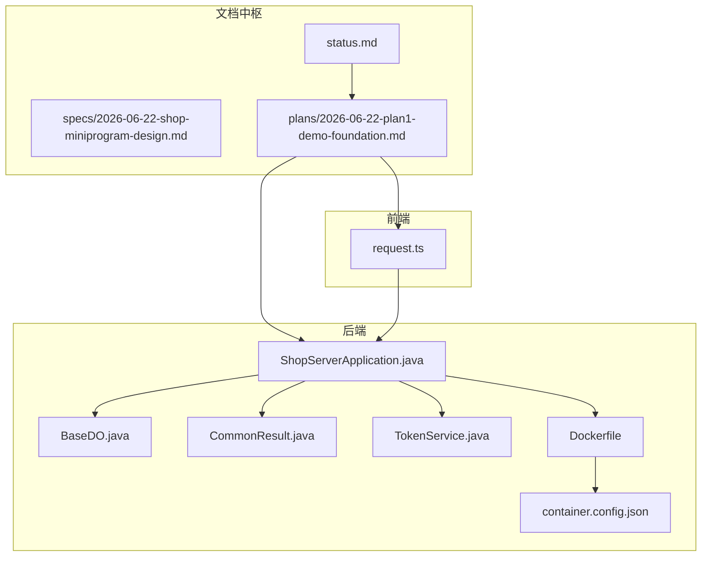
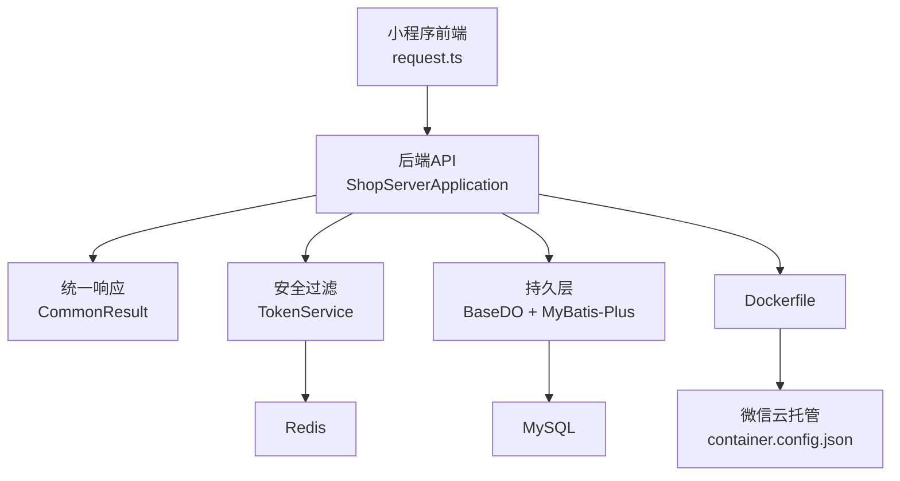
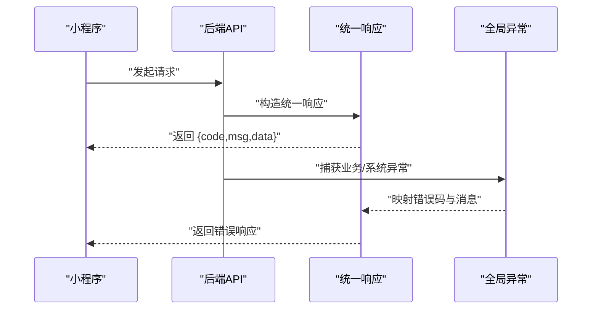
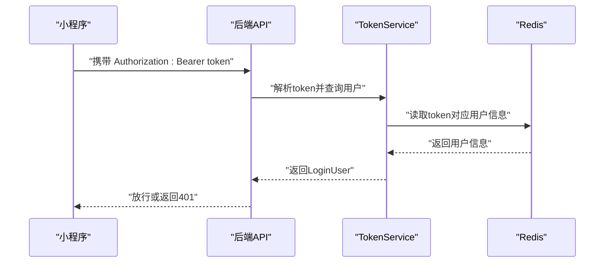
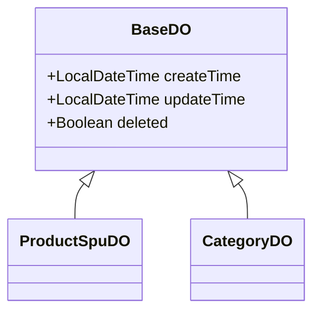
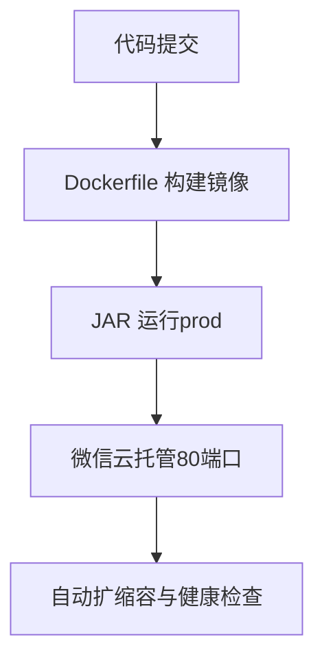
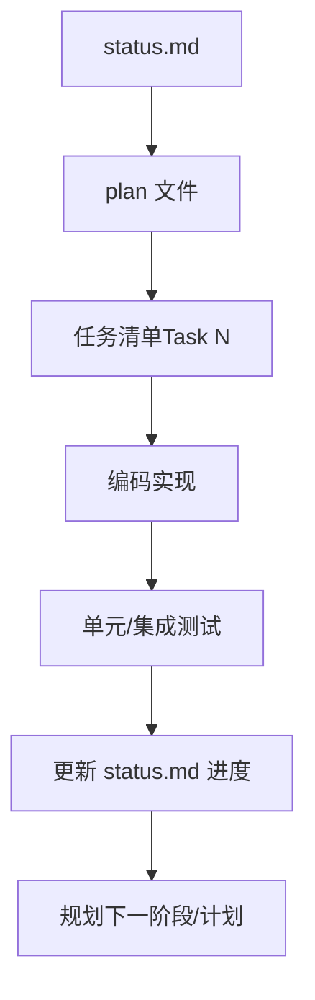
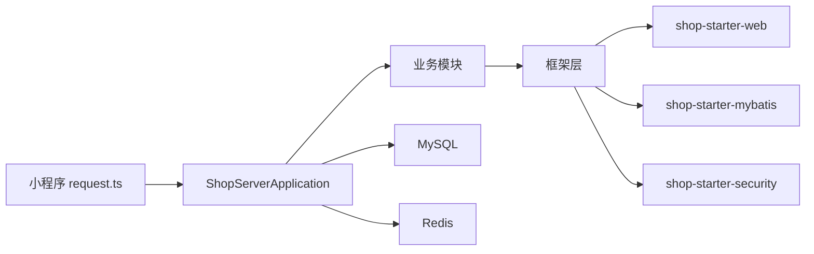

# 开发流程

<cite>
**本文引用的文件**
- [README.md](file://README.md)
- [status.md](file://docs/superpowers/status.md)
- [2026-06-22-shop-miniprogram-design.md](file://docs/superpowers/specs/2026-06-22-shop-miniprogram-design.md)
- [2026-06-22-plan1-demo-foundation.md](file://docs/superpowers/plans/2026-06-22-plan1-demo-foundation.md)
- [conventions.md](file://docs/conventions.md)
- [AGENTS.md](file://AGENTS.md)
- [CommonResult.java](file://shop-backend/shop-framework/shop-common/src/main/java/com/shop/common/pojo/CommonResult.java)
- [BaseDO.java](file://shop-backend/shop-framework/shop-starter-mybatis/src/main/java/com/shop/framework/mybatis/core/BaseDO.java)
- [TokenService.java](file://shop-backend/shop-framework/shop-starter-security/src/main/java/com/shop/framework/security/TokenService.java)
- [ShopServerApplication.java](file://shop-backend/shop-server/src/main/java/com/shop/server/ShopServerApplication.java)
- [Dockerfile](file://shop-backend/Dockerfile)
- [container.config.json](file://shop-backend/container.config.json)
- [request.ts](file://shop-miniapp/src/api/request.ts)
</cite>

## 目录
1. [引言](#引言)
2. [项目结构](#项目结构)
3. [核心组件](#核心组件)
4. [架构总览](#架构总览)
5. [详细组件分析](#详细组件分析)
6. [依赖分析](#依赖分析)
7. [性能考虑](#性能考虑)
8. [故障排查指南](#故障排查指南)
9. [结论](#结论)
10. [附录](#附录)

## 引言
本项目采用“规格驱动开发”（Spec-Driven Development）模式，围绕“从 spec 到 plan 再到编码”的完整闭环展开。其中：
- status.md 是项目状态的唯一真相来源，用于追踪阶段、任务、阻塞项与下一步行动；
- specs 用于定义“要做什么”，plans 用于规划“如何做”，二者共同决定开发范围与节奏；
- 在 AI 协作场景中，AI 通过读取 status.md 和对应 plan 来同步上下文，并在完成后回写状态，确保知识与进度一致。

本开发流程文档旨在为团队提供从需求分析、设计评审、开发实现到测试验证的标准化流程，以及开发规范、代码审查、版本管理的最佳实践，帮助高质量交付。

## 项目结构
项目采用前后端分离与多模块聚合的组织方式：
- 后端（shop-backend）：Maven 多模块，包含框架层（common、web、mybatis、security）、业务模块（product、member、system）与启动入口（server），并通过 Dockerfile 与 container.config.json 配置云托管；
- 前端（shop-miniapp）：基于 uni-app + Vue3 + TypeScript + Pinia 的微信小程序工程；
- 文档（docs/superpowers）：specs、plans、status.md 三件套构成 Spec-Driven 的知识与进度中枢。

**图表来源**
- [status.md:1-77](file://docs/superpowers/status.md#L1-L77)
- [2026-06-22-plan1-demo-foundation.md:1-2346](file://docs/superpowers/plans/2026-06-22-plan1-demo-foundation.md#L1-L2346)
- [2026-06-22-shop-miniprogram-design.md:1-511](file://docs/superpowers/specs/2026-06-22-shop-miniprogram-design.md#L1-L511)
- [ShopServerApplication.java:1-17](file://shop-backend/shop-server/src/main/java/com/shop/server/ShopServerApplication.java#L1-L17)
- [BaseDO.java:1-23](file://shop-backend/shop-framework/shop-starter-mybatis/src/main/java/com/shop/framework/mybatis/core/BaseDO.java#L1-L23)
- [CommonResult.java:1-34](file://shop-backend/shop-framework/shop-common/src/main/java/com/shop/common/pojo/CommonResult.java#L1-L34)
- [TokenService.java:1-47](file://shop-backend/shop-framework/shop-starter-security/src/main/java/com/shop/framework/security/TokenService.java#L1-L47)
- [Dockerfile:1-16](file://shop-backend/Dockerfile#L1-L16)
- [container.config.json:1-13](file://shop-backend/container.config.json#L1-L13)
- [request.ts:1-48](file://shop-miniapp/src/api/request.ts#L1-L48)

**章节来源**
- [README.md:12-41](file://README.md#L12-L41)
- [status.md:7-11](file://docs/superpowers/status.md#L7-L11)
- [2026-06-22-plan1-demo-foundation.md:13-125](file://docs/superpowers/plans/2026-06-22-plan1-demo-foundation.md#L13-L125)

## 核心组件
- 统一响应与异常：通过 CommonResult 统一返回结构，配合全局异常处理器，保证前后端契约一致；
- 数据持久化基座：BaseDO 提供统一的创建/更新时间与逻辑删除字段，简化实体基类；
- 认证与授权：基于 Redis 的 TokenService 与 Spring Security 过滤链，实现无状态鉴权；
- 启动与打包：ShopServerApplication 负责扫描组件与 Mapper；Dockerfile 与 container.config.json 保障云托管部署；
- 前端请求封装：request.ts 统一封装请求、鉴权头注入与错误提示，便于小程序端调用后端 API。

**章节来源**
- [CommonResult.java:8-33](file://shop-backend/shop-framework/shop-common/src/main/java/com/shop/common/pojo/CommonResult.java#L8-L33)
- [BaseDO.java:11-22](file://shop-backend/shop-framework/shop-starter-mybatis/src/main/java/com/shop/framework/mybatis/core/BaseDO.java#L11-L22)
- [TokenService.java:10-46](file://shop-backend/shop-framework/shop-starter-security/src/main/java/com/shop/framework/security/TokenService.java#L10-L46)
- [ShopServerApplication.java:8-16](file://shop-backend/shop-server/src/main/java/com/shop/server/ShopServerApplication.java#L8-L16)
- [Dockerfile:1-16](file://shop-backend/Dockerfile#L1-L16)
- [container.config.json:1-13](file://shop-backend/container.config.json#L1-L13)
- [request.ts:14-47](file://shop-miniapp/src/api/request.ts#L14-L47)

## 架构总览
整体采用“小程序前端 + Spring Boot 后端 + MySQL + Redis + 云托管”的架构。小程序通过 request.ts 发起请求，后端通过统一响应与安全过滤链处理，数据持久化由 MyBatis-Plus 与基础 DO 统一管理，最终通过 Docker 部署至微信云托管。

**图表来源**
- [request.ts:14-47](file://shop-miniapp/src/api/request.ts#L14-L47)
- [ShopServerApplication.java:8-16](file://shop-backend/shop-server/src/main/java/com/shop/server/ShopServerApplication.java#L8-L16)
- [CommonResult.java:8-33](file://shop-backend/shop-framework/shop-common/src/main/java/com/shop/common/pojo/CommonResult.java#L8-L33)
- [TokenService.java:10-46](file://shop-backend/shop-framework/shop-starter-security/src/main/java/com/shop/framework/security/TokenService.java#L10-L46)
- [BaseDO.java:11-22](file://shop-backend/shop-framework/shop-starter-mybatis/src/main/java/com/shop/framework/mybatis/core/BaseDO.java#L11-L22)
- [Dockerfile:1-16](file://shop-backend/Dockerfile#L1-16)
- [container.config.json:1-13](file://shop-backend/container.config.json#L1-13)

## 详细组件分析

### 统一响应与异常处理
- 统一响应：所有接口返回统一结构，前端据此进行成功/失败判断与提示；
- 全局异常：业务异常与系统异常分别映射到不同 code，便于前端与监控侧识别；
- 与前端约定：小程序端根据 code=0 成功，401 时触发登录态清理与提示。

**图表来源**
- [CommonResult.java:8-33](file://shop-backend/shop-framework/shop-common/src/main/java/com/shop/common/pojo/CommonResult.java#L8-L33)
- [request.ts:16-47](file://shop-miniapp/src/api/request.ts#L16-L47)

**章节来源**
- [CommonResult.java:8-33](file://shop-backend/shop-framework/shop-common/src/main/java/com/shop/common/pojo/CommonResult.java#L8-L33)
- [request.ts:16-47](file://shop-miniapp/src/api/request.ts#L16-L47)

### 认证与授权（JWT + Redis）
- Token 生成：随机 UUID 作为 token，存入 Redis 并设置过期时间；
- 过滤链：从 Authorization 头解析 Bearer Token，解析用户身份并注入安全上下文；
- 与前端约定：小程序在请求头携带 Authorization: Bearer token。

**图表来源**
- [TokenService.java:10-46](file://shop-backend/shop-framework/shop-starter-security/src/main/java/com/shop/framework/security/TokenService.java#L10-L46)
- [request.ts:18-26](file://shop-miniapp/src/api/request.ts#L18-L26)

**章节来源**
- [TokenService.java:10-46](file://shop-backend/shop-framework/shop-starter-security/src/main/java/com/shop/framework/security/TokenService.java#L10-L46)
- [request.ts:18-26](file://shop-miniapp/src/api/request.ts#L18-L26)

### 数据持久化基座（MyBatis-Plus + BaseDO）
- 基类字段：统一 createTime/updateTime/deleted，减少重复代码；
- 分页与填充：自动分页拦截器与 MetaObjectHandler 自动填充时间；
- 业务实体继承 BaseDO，遵循统一生命周期字段管理。

**图表来源**
- [BaseDO.java:11-22](file://shop-backend/shop-framework/shop-starter-mybatis/src/main/java/com/shop/framework/mybatis/core/BaseDO.java#L11-L22)
- [2026-06-22-plan1-demo-foundation.md:1217-1279](file://docs/superpowers/plans/2026-06-22-plan1-demo-foundation.md#L1217-L1279)

**章节来源**
- [BaseDO.java:11-22](file://shop-backend/shop-framework/shop-starter-mybatis/src/main/java/com/shop/framework/mybatis/core/BaseDO.java#L11-L22)
- [2026-06-22-plan1-demo-foundation.md:1217-1279](file://docs/superpowers/plans/2026-06-22-plan1-demo-foundation.md#L1217-L1279)

### 启动与部署（Spring Boot + Docker + 云托管）
- 启动类：组件扫描 com.shop，Mapper 扫描 com.shop.module.*.dal.mysql；
- 构建：Maven 多模块打包，JRE 镜像运行；
- 云托管：container.config.json 定义实例数量、CPU/内存与扩缩容策略。

**图表来源**
- [ShopServerApplication.java:8-16](file://shop-backend/shop-server/src/main/java/com/shop/server/ShopServerApplication.java#L8-L16)
- [Dockerfile:1-16](file://shop-backend/Dockerfile#L1-L16)
- [container.config.json:1-13](file://shop-backend/container.config.json#L1-L13)

**章节来源**
- [ShopServerApplication.java:8-16](file://shop-backend/shop-server/src/main/java/com/shop/server/ShopServerApplication.java#L8-L16)
- [Dockerfile:1-16](file://shop-backend/Dockerfile#L1-L16)
- [container.config.json:1-13](file://shop-backend/container.config.json#L1-L13)

### 规格驱动开发流程（Spec → Plan → 编码）
- 读取 status.md：确认当前阶段、计划文件与下一步；
- 读取对应 plan：按任务清单逐步落地；
- 编码与测试：按模块与控制器职责分工，确保统一响应与安全过滤；
- 回写 status.md：每完成一项任务立即更新进度与决策记录。

**图表来源**
- [status.md:52-76](file://docs/superpowers/status.md#L52-L76)
- [2026-06-22-plan1-demo-foundation.md:129-283](file://docs/superpowers/plans/2026-06-22-plan1-demo-foundation.md#L129-L283)

**章节来源**
- [status.md:52-76](file://docs/superpowers/status.md#L52-L76)
- [2026-06-22-plan1-demo-foundation.md:129-283](file://docs/superpowers/plans/2026-06-22-plan1-demo-foundation.md#L129-L283)

## 依赖分析
- 后端模块间依赖：业务模块依赖框架层（web、mybatis、security），启动模块聚合各子模块；
- 前后端依赖：小程序通过 request.ts 与后端 API 约定交互；
- 外部依赖：MySQL、Redis、微信云托管，Dockerfile 与 container.config.json 明确运行时配置。

**图表来源**
- [2026-06-22-plan1-demo-foundation.md:1184-1213](file://docs/superpowers/plans/2026-06-22-plan1-demo-foundation.md#L1184-L1213)
- [ShopServerApplication.java:8-16](file://shop-backend/shop-server/src/main/java/com/shop/server/ShopServerApplication.java#L8-L16)
- [request.ts:14-47](file://shop-miniapp/src/api/request.ts#L14-L47)

**章节来源**
- [2026-06-22-plan1-demo-foundation.md:1184-1213](file://docs/superpowers/plans/2026-06-22-plan1-demo-foundation.md#L1184-L1213)
- [ShopServerApplication.java:8-16](file://shop-backend/shop-server/src/main/java/com/shop/server/ShopServerApplication.java#L8-L16)
- [request.ts:14-47](file://shop-miniapp/src/api/request.ts#L14-L47)

## 性能考虑
- 云托管资源配置：最小实例、最大实例、CPU/内存与扩缩容阈值需结合流量峰值评估；
- 数据访问：合理使用分页与索引，避免 N+1 查询；
- 缓存策略：利用 Redis 缓存热点数据与 Token，降低数据库压力；
- 部署优化：JVM 参数与镜像大小控制，缩短启动与扩容时间。

## 故障排查指南
- 启动失败：检查 Dockerfile 构建日志与 container.config.json 资源配额；
- 认证失败：确认 Authorization 头格式与 Token 是否过期；
- 统一响应异常：核对 code/msg/data 结构与前端提示逻辑；
- 数据库连接：确认 MySQL 与 Redis 可达性及连接参数。

**章节来源**
- [Dockerfile:1-16](file://shop-backend/Dockerfile#L1-L16)
- [container.config.json:1-13](file://shop-backend/container.config.json#L1-L13)
- [request.ts:16-47](file://shop-miniapp/src/api/request.ts#L16-L47)

## 结论
通过“specs → plans → status.md → 编码”的闭环，项目实现了需求与实现的强约束与高透明度。配合统一响应、安全过滤、数据基座与云托管部署，形成可演进、可验证、可运维的开发体系。建议持续以 status.md 为唯一真相来源，确保团队协同的一致性与效率。

## 附录

### AI 协作开发规范（基于 AGENTS.md 与 conventions.md）
- 每次对话先读取 status.md，再读取对应 plan，执行任务并回写 status.md；
- 语言：文档与注释使用中文，代码标识符使用英文；
- 规范：严格遵循 conventions.md 的命名、目录与流程规范。

**章节来源**
- [AGENTS.md:1-13](file://AGENTS.md#L1-L13)
- [conventions.md:1-157](file://docs/conventions.md#L1-L157)