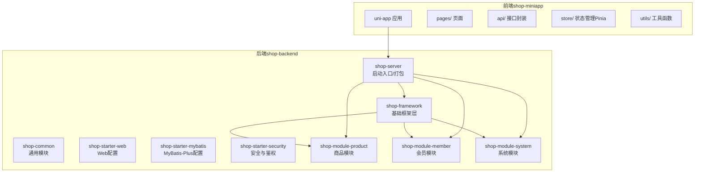
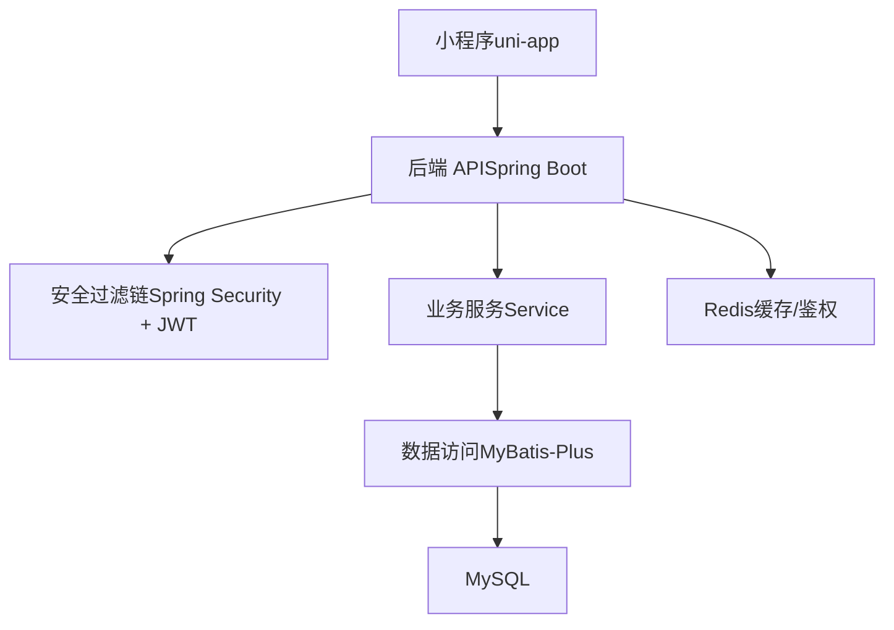
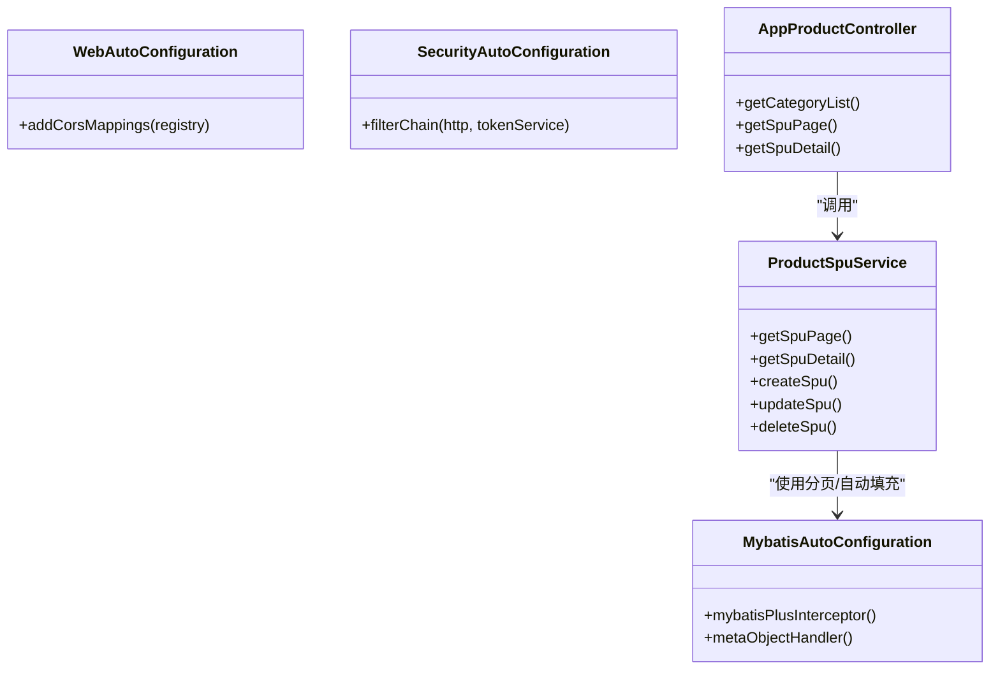
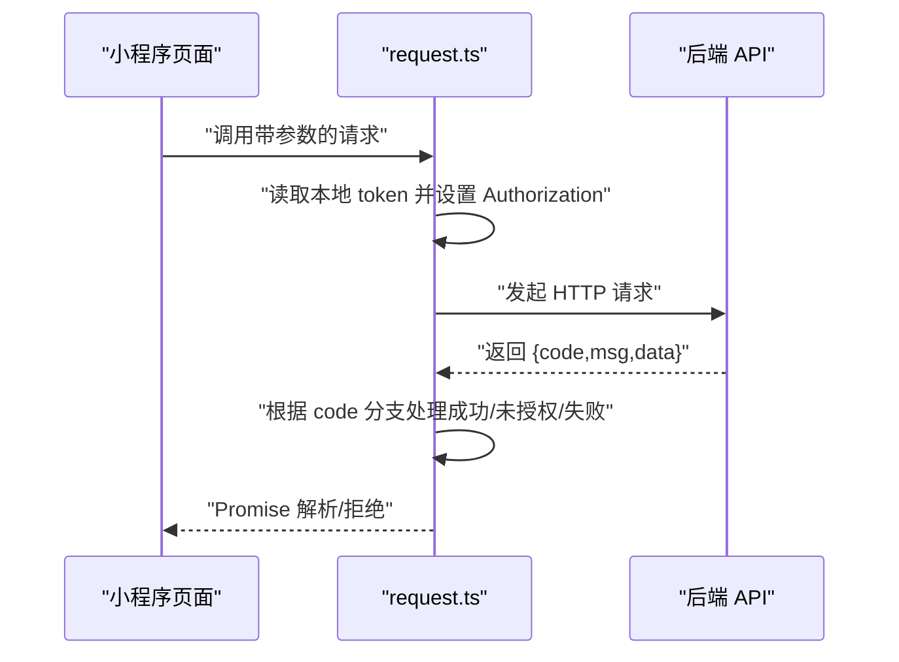
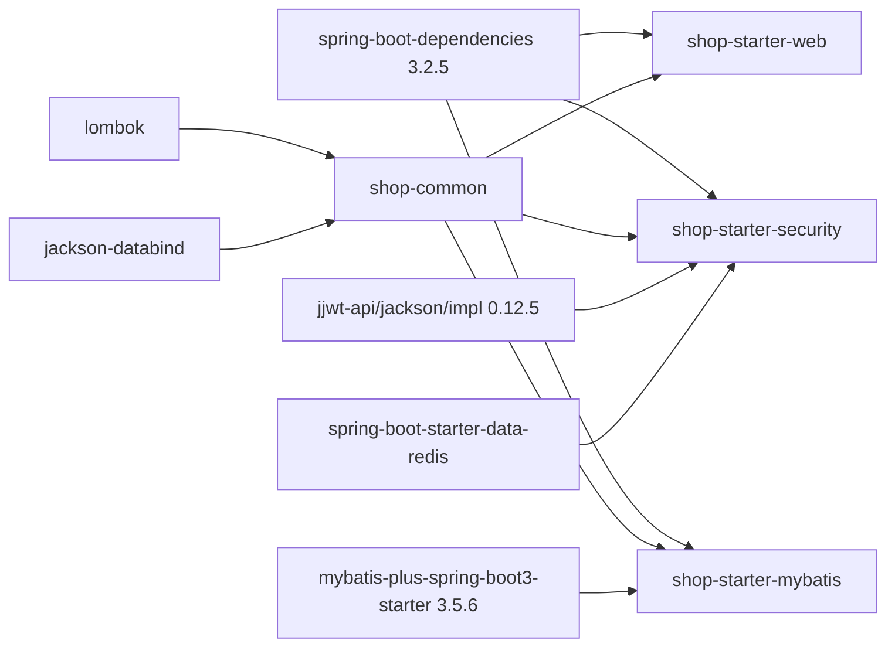

# 技术栈

<cite>
**本文引用的文件**
- [README.md](file://README.md)
- [pom.xml](file://shop-backend/pom.xml)
- [shop-server/pom.xml](file://shop-backend/shop-server/pom.xml)
- [shop-common/pom.xml](file://shop-backend/shop-framework/shop-common/pom.xml)
- [shop-starter-web/pom.xml](file://shop-backend/shop-framework/shop-starter-web/pom.xml)
- [shop-starter-mybatis/pom.xml](file://shop-backend/shop-framework/shop-starter-mybatis/pom.xml)
- [shop-starter-security/pom.xml](file://shop-backend/shop-framework/shop-starter-security/pom.xml)
- [MybatisAutoConfiguration.java](file://shop-backend/shop-framework/shop-starter-mybatis/src/main/java/com/shop/framework/mybatis/MybatisAutoConfiguration.java)
- [SecurityAutoConfiguration.java](file://shop-backend/shop-framework/shop-starter-security/src/main/java/com/shop/framework/security/SecurityAutoConfiguration.java)
- [WebAutoConfiguration.java](file://shop-backend/shop-framework/shop-starter-web/src/main/java/com/shop/framework/web/WebAutoConfiguration.java)
- [application.yml](file://shop-backend/shop-server/src/main/resources/application.yml)
- [AppProductController.java](file://shop-backend/shop-module-product/src/main/java/com/shop/module/product/controller/app/AppProductController.java)
- [ProductSpuService.java](file://shop-backend/shop-module-product/src/main/java/com/shop/module/product/service/ProductSpuService.java)
- [package.json](file://shop-miniapp/package.json)
- [tsconfig.json](file://shop-miniapp/tsconfig.json)
- [vite.config.ts](file://shop-miniapp/vite.config.ts)
- [request.ts](file://shop-miniapp/src/api/request.ts)
</cite>

## 目录
1. [引言](#引言)
2. [项目结构](#项目结构)
3. [核心组件](#核心组件)
4. [架构总览](#架构总览)
5. [详细组件分析](#详细组件分析)
6. [依赖分析](#依赖分析)
7. [性能考虑](#性能考虑)
8. [故障排查指南](#故障排查指南)
9. [结论](#结论)
10. [附录](#附录)

## 引言
本项目为“药食同源微信小程序商城”，采用前后端分离架构：后端基于 Java 17 + Spring Boot 3.2 + MyBatis-Plus + MySQL 8 + Redis 7 的企业级技术栈；前端采用 uni-app + Vue3 + TypeScript + Pinia 的跨平台开发方案；管理后台采用 Vue3 + Element Plus（规划中）。本文档系统梳理技术选型、版本兼容性、性能考量、演进路径与替代方案，并提供学习路径与决策依据。

## 项目结构
项目采用多模块 Maven 结构组织后端，按“框架层 + 模块层 + 服务层”分层设计，前端以 uni-app 统一构建多端产物。

图表来源
- [pom.xml:14-20](file://shop-backend/pom.xml#L14-L20)
- [shop-server/pom.xml:14-37](file://shop-backend/shop-server/pom.xml#L14-L37)
- [README.md:12-41](file://README.md#L12-L41)

章节来源
- [README.md:12-41](file://README.md#L12-L41)
- [pom.xml:14-20](file://shop-backend/pom.xml#L14-L20)

## 核心组件
- 后端核心：Spring Boot 3.2（统一依赖管理）、MyBatis-Plus 3.5.6（增强 ORM 与分页）、MySQL 8（持久化）、Redis 7（缓存与会话）。
- 前端核心：uni-app 3、Vue 3、TypeScript、Vite、Pinia。
- 安全与跨域：Spring Security + JWT + 自定义 Token 过滤器；全局 CORS 配置。
- 架构特性：RESTful API、分层清晰、模块化扩展、容器化部署。

章节来源
- [pom.xml:22-31](file://shop-backend/pom.xml#L22-L31)
- [shop-starter-web/pom.xml:14-27](file://shop-backend/shop-framework/shop-starter-web/pom.xml#L14-L27)
- [shop-starter-mybatis/pom.xml:14-27](file://shop-backend/shop-framework/shop-starter-mybatis/pom.xml#L14-L27)
- [shop-starter-security/pom.xml:14-41](file://shop-backend/shop-framework/shop-starter-security/pom.xml#L14-L41)
- [package.json:8-25](file://shop-miniapp/package.json#L8-L25)

## 架构总览
整体架构由“前端 uni-app → 后端 Spring Boot（Web + Security + MyBatis-Plus）→ MySQL/Redis”构成，服务通过 REST 接口交互，小程序通过统一的请求封装访问后端。

图表来源
- [SecurityAutoConfiguration.java:20-45](file://shop-backend/shop-framework/shop-starter-security/src/main/java/com/shop/framework/security/SecurityAutoConfiguration.java#L20-L45)
- [MybatisAutoConfiguration.java:16-21](file://shop-backend/shop-framework/shop-starter-mybatis/src/main/java/com/shop/framework/mybatis/MybatisAutoConfiguration.java#L16-L21)
- [AppProductController.java:15-38](file://shop-backend/shop-module-product/src/main/java/com/shop/module/product/controller/app/AppProductController.java#L15-L38)
- [request.ts:14-47](file://shop-miniapp/src/api/request.ts#L14-L47)

## 详细组件分析

### 后端技术栈与配置
- 版本与依赖管理
  - Java 17、Spring Boot 3.2.5、MyBatis-Plus 3.5.6、Hutool 5.8.27、JWT 0.12.5。
  - 使用 dependencyManagement 统一版本，确保模块间一致性。
- 模块职责
  - shop-common：通用 Web、Jackson、Lombok、Hutool。
  - shop-starter-web：Web 启动器 + 参数校验 + 全局 CORS。
  - shop-starter-mybatis：MyBatis-Plus 分页拦截器 + 自动填充（创建/更新时间）。
  - shop-starter-security：Spring Security + Redis + JWT + Token 过滤器。
  - shop-server：聚合模块，引入 web/security/starter 与各业务模块。
- 关键配置
  - application.yml：激活 dev 环境、端口 80。
  - Web 层 CORS：允许任意来源、方法、头，支持凭证与预检缓存。
  - MyBatis-Plus：MySQL 分页内核、自动字段填充。
  - Security：禁用 CSRF、无状态 Session、公开端点、统一认证异常返回。

图表来源
- [WebAutoConfiguration.java:7-19](file://shop-backend/shop-framework/shop-starter-web/src/main/java/com/shop/framework/web/WebAutoConfiguration.java#L7-L19)
- [MybatisAutoConfiguration.java:13-38](file://shop-backend/shop-framework/shop-starter-mybatis/src/main/java/com/shop/framework/mybatis/MybatisAutoConfiguration.java#L13-L38)
- [SecurityAutoConfiguration.java:16-46](file://shop-backend/shop-framework/shop-starter-security/src/main/java/com/shop/framework/security/SecurityAutoConfiguration.java#L16-L46)
- [AppProductController.java:15-38](file://shop-backend/shop-module-product/src/main/java/com/shop/module/product/controller/app/AppProductController.java#L15-L38)
- [ProductSpuService.java:13-52](file://shop-backend/shop-module-product/src/main/java/com/shop/module/product/service/ProductSpuService.java#L13-L52)

章节来源
- [pom.xml:22-88](file://shop-backend/pom.xml#L22-L88)
- [shop-common/pom.xml:14-31](file://shop-backend/shop-framework/shop-common/pom.xml#L14-L31)
- [shop-starter-web/pom.xml:14-27](file://shop-backend/shop-framework/shop-starter-web/pom.xml#L14-L27)
- [shop-starter-mybatis/pom.xml:14-27](file://shop-backend/shop-framework/shop-starter-mybatis/pom.xml#L14-L27)
- [shop-starter-security/pom.xml:14-41](file://shop-backend/shop-framework/shop-starter-security/pom.xml#L14-L41)
- [application.yml:1-7](file://shop-backend/shop-server/src/main/resources/application.yml#L1-L7)
- [WebAutoConfiguration.java:7-19](file://shop-backend/shop-framework/shop-starter-web/src/main/java/com/shop/framework/web/WebAutoConfiguration.java#L7-L19)
- [MybatisAutoConfiguration.java:13-38](file://shop-backend/shop-framework/shop-starter-mybatis/src/main/java/com/shop/framework/mybatis/MybatisAutoConfiguration.java#L13-L38)
- [SecurityAutoConfiguration.java:16-46](file://shop-backend/shop-framework/shop-starter-security/src/main/java/com/shop/framework/security/SecurityAutoConfiguration.java#L16-L46)
- [AppProductController.java:15-38](file://shop-backend/shop-module-product/src/main/java/com/shop/module/product/controller/app/AppProductController.java#L15-L38)
- [ProductSpuService.java:13-52](file://shop-backend/shop-module-product/src/main/java/com/shop/module/product/service/ProductSpuService.java#L13-L52)

### 前端技术栈与配置
- uni-app 3 + Vue 3 + TypeScript + Vite + Pinia
- 构建目标：微信小程序（mp-weixin），同时支持 H5/APP 等多端。
- TypeScript 配置：严格模式、ESNext 目标、类型声明、路径别名等。
- 请求封装：统一的 request 函数，内置 Authorization 头注入、错误码处理与 Toast 提示。
- 状态管理：Pinia（已声明依赖，具体实现位于 store 目录）。

图表来源
- [request.ts:14-47](file://shop-miniapp/src/api/request.ts#L14-L47)
- [AppProductController.java:23-37](file://shop-backend/shop-module-product/src/main/java/com/shop/module/product/controller/app/AppProductController.java#L23-L37)

章节来源
- [package.json:4-25](file://shop-miniapp/package.json#L4-L25)
- [tsconfig.json:1-20](file://shop-miniapp/tsconfig.json#L1-L20)
- [vite.config.ts:1-7](file://shop-miniapp/vite.config.ts#L1-L7)
- [request.ts:1-48](file://shop-miniapp/src/api/request.ts#L1-L48)

### 管理后台（规划中）
- 技术选型：Vue3 + Element Plus（用于快速搭建管理界面与表单、表格、权限等）。
- 当前仓库未包含管理后台代码，属于后续迭代范围。

章节来源
- [README.md](file://README.md#L9)

## 依赖分析
后端采用集中式依赖管理，核心组件关系如下：

图表来源
- [pom.xml:33-88](file://shop-backend/pom.xml#L33-L88)
- [shop-common/pom.xml:14-31](file://shop-backend/shop-framework/shop-common/pom.xml#L14-L31)
- [shop-starter-web/pom.xml:14-27](file://shop-backend/shop-framework/shop-starter-web/pom.xml#L14-L27)
- [shop-starter-mybatis/pom.xml:14-27](file://shop-backend/shop-framework/shop-starter-mybatis/pom.xml#L14-L27)
- [shop-starter-security/pom.xml:14-41](file://shop-backend/shop-framework/shop-starter-security/pom.xml#L14-L41)

章节来源
- [pom.xml:33-88](file://shop-backend/pom.xml#L33-L88)
- [shop-server/pom.xml:14-37](file://shop-backend/shop-server/pom.xml#L14-L37)

## 性能考虑
- 后端
  - MyBatis-Plus 分页拦截器针对 MySQL，避免一次性加载大量数据。
  - 自动填充减少重复字段维护成本，降低出错概率。
  - 无状态鉴权（JWT + Redis）适合高并发场景，结合容器水平扩展。
- 前端
  - uni-app 3 基于 Vite，开发体验与构建效率良好；按需引入组件、懒加载页面可优化首屏。
- 数据库
  - MySQL 8 支持 JSON、全文索引、窗口函数等能力；建议对高频查询字段建立合适索引。
- 缓存
  - Redis 7 提供高性能读写与会话存储，建议结合热点数据与会话令牌缓存策略。

## 故障排查指南
- 启动与端口
  - 后端默认监听 80 端口，若被占用需调整或释放端口。
- 跨域问题
  - 确认 shop-starter-web 的 CORS 配置是否生效；生产环境建议限制来源。
- 鉴权失败
  - 检查 Authorization 头是否携带 Bearer Token；确认 Security 过滤链规则与未授权返回格式。
- 数据访问
  - MyBatis-Plus 分页与自动填充依赖是否正确装配；Mapper 是否存在且命名规范。
- 前端请求
  - request.ts 中的 BASE_URL 与后端域名一致；Token 存储与过期处理逻辑是否完善。

章节来源
- [application.yml:5-7](file://shop-backend/shop-server/src/main/resources/application.yml#L5-L7)
- [WebAutoConfiguration.java:10-18](file://shop-backend/shop-framework/shop-starter-web/src/main/java/com/shop/framework/web/WebAutoConfiguration.java#L10-L18)
- [SecurityAutoConfiguration.java:20-45](file://shop-backend/shop-framework/shop-starter-security/src/main/java/com/shop/framework/security/SecurityAutoConfiguration.java#L20-L45)
- [MybatisAutoConfiguration.java:16-37](file://shop-backend/shop-framework/shop-starter-mybatis/src/main/java/com/shop/framework/mybatis/MybatisAutoConfiguration.java#L16-L37)
- [request.ts:14-47](file://shop-miniapp/src/api/request.ts#L14-L47)

## 结论
该技术栈在“后端稳定性 + 前端跨平台能力 + 易扩展模块化”方面具备良好平衡。Spring Boot 3.2 与 MyBatis-Plus 3.5.6 组合成熟可靠，配合 Redis 与 JWT 实现高可用鉴权；uni-app 3 与 TypeScript 提升了开发效率与类型安全。建议在后续迭代中完善管理后台、接入更完善的监控与日志体系，并持续关注版本升级路径与安全加固。

## 附录

### 技术选型与版本兼容性
- Java 17 + Spring Boot 3.2：长期支持版本，生态成熟，与 MyBatis-Plus 3.5.6 兼容良好。
- MyBatis-Plus 3.5.6：提供分页、自动填充、代码生成等能力，适配 MySQL 8。
- MySQL 8：支持 JSON、窗口函数、更强的安全策略；注意字符集与外键约束配置。
- Redis 7：高性能内存数据库，建议开启持久化与合理淘汰策略。
- uni-app 3 + Vue 3 + TypeScript + Vite + Pinia：跨平台首选方案，生态活跃，升级路径明确。

章节来源
- [pom.xml:22-31](file://shop-backend/pom.xml#L22-L31)
- [package.json:8-25](file://shop-miniapp/package.json#L8-L25)

### 升级路径与替代方案
- 升级路径
  - 后端：Spring Boot 3.2 → 3.3+（逐步升级 MyBatis-Plus、MySQL Connector、Redis 客户端）。
  - 前端：uni-app/Vue3/TypeScript/Vite/Pinia 按官方 LTS 与社区反馈平滑升级。
- 替代方案
  - ORM：MyBatis-Plus 可替换为原生 MyBatis 或 JPA/Hibernate（取决于团队熟悉度与需求）。
  - 缓存：Redis 可替换为 Memcached 或本地缓存（需评估一致性与共享性）。
  - 鉴权：JWT 可替换为 OAuth2/Spring Security OAuth2（适用于复杂授权场景）。
  - 前端：React + Taro 或原生小程序框架（取决于团队技术栈与跨端需求）。

### 决策依据与学习路径
- 决策依据
  - 后端：追求稳定、易维护、生态完善；Spring 生态与 MyBatis-Plus 在中小规模电商场景表现稳健。
  - 前端：跨平台优先，uni-app 3 覆盖微信小程序、H5、APP，开发成本低。
  - 管理后台：Vue3 + Element Plus 快速搭建管理界面，建议在产品成熟后再推进。
- 学习路径
  - 后端：Spring Boot 入门 → MyBatis-Plus 实战 → 安全与鉴权 → 分布式与缓存。
  - 前端：uni-app/Vue3/TypeScript 基础 → Vite/Pinia 实战 → 跨端调试与发布。
  - 运维：Docker 与微信云托管实践 → 监控与日志 → 安全加固。