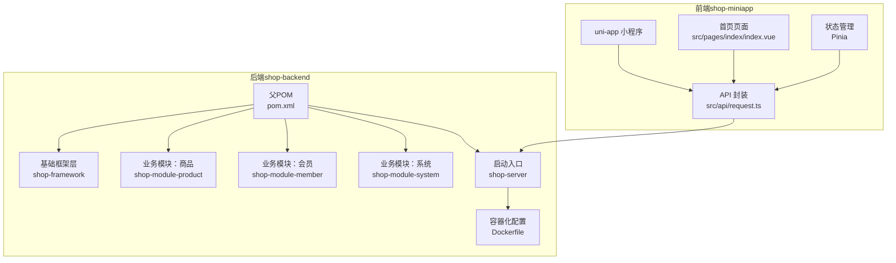
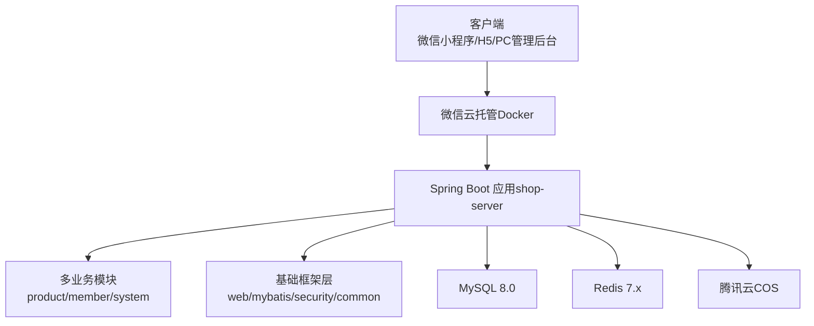
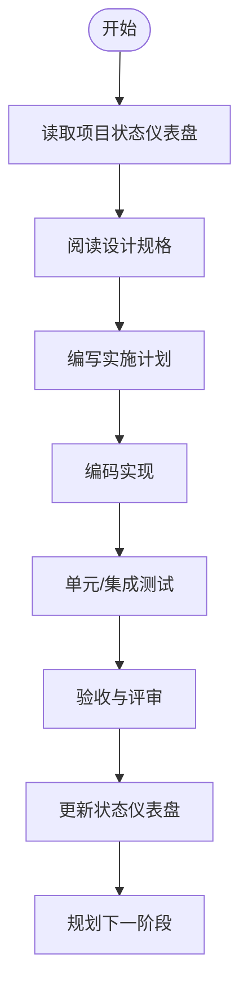
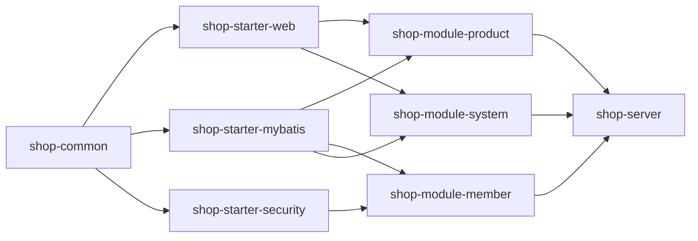
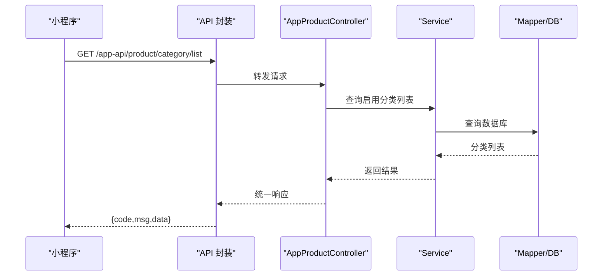
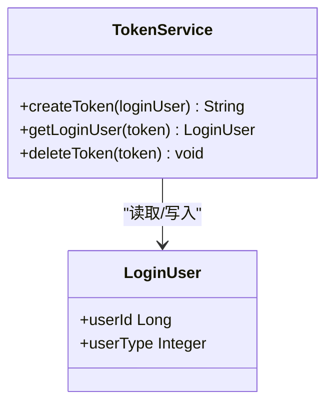
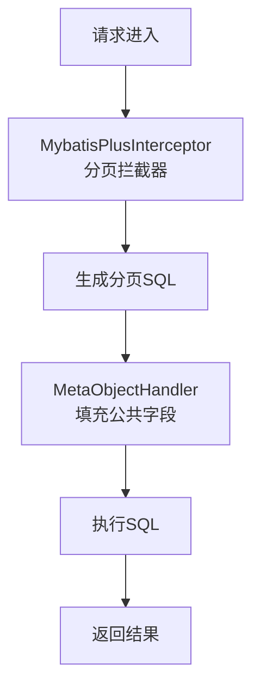
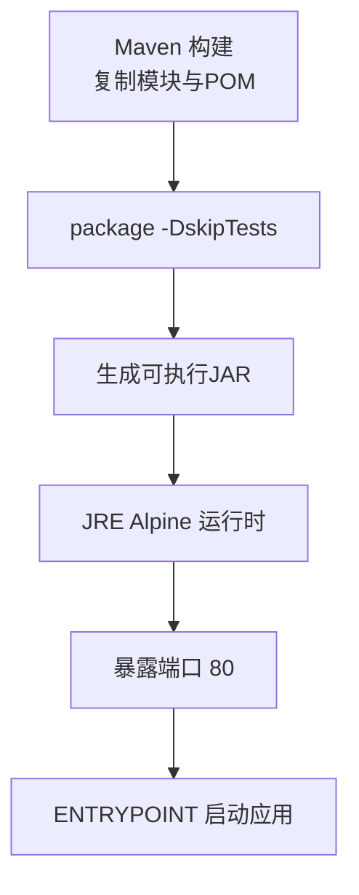
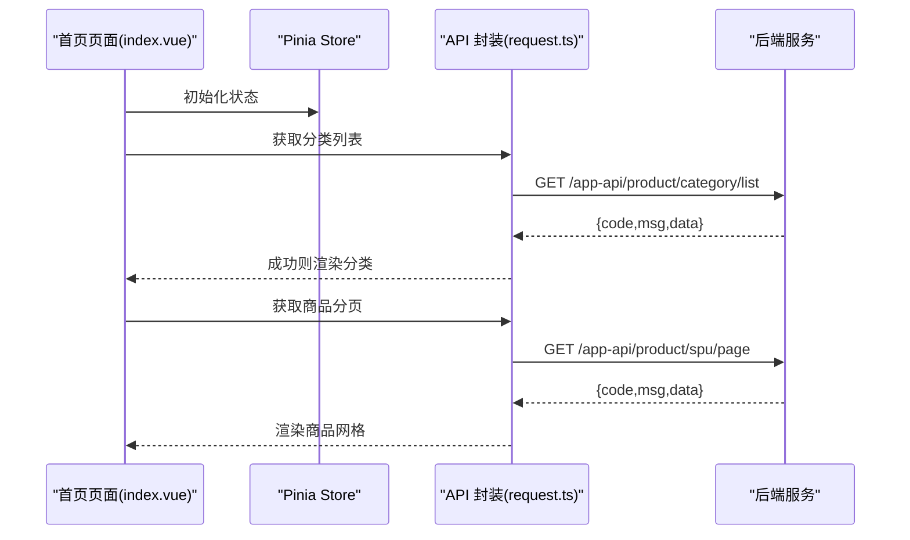
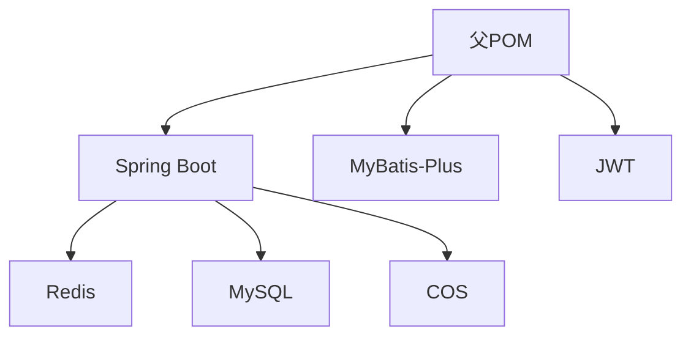

# 架构理念

<cite>
**本文引用的文件**
- [README.md](file://README.md)
- [2026-06-22-shop-miniprogram-design.md](file://docs/superpowers/specs/2026-06-22-shop-miniprogram-design.md)
- [status.md](file://docs/superpowers/status.md)
- [ShopServerApplication.java](file://shop-backend/shop-server/src/main/java/com/shop/server/ShopServerApplication.java)
- [pom.xml（后端父工程）](file://shop-backend/pom.xml)
- [pom.xml（商品模块）](file://shop-backend/shop-module-product/pom.xml)
- [pom.xml（会员模块）](file://shop-backend/shop-module-member/pom.xml)
- [Dockerfile](file://shop-backend/Dockerfile)
- [WebAutoConfiguration.java](file://shop-backend/shop-framework/shop-starter-web/src/main/java/com/shop/framework/web/WebAutoConfiguration.java)
- [MybatisAutoConfiguration.java](file://shop-backend/shop-framework/shop-starter-mybatis/src/main/java/com/shop/framework/mybatis/MybatisAutoConfiguration.java)
- [TokenService.java](file://shop-backend/shop-framework/shop-starter-security/src/main/java/com/shop/framework/security/TokenService.java)
- [ErrorCode.java](file://shop-backend/shop-framework/shop-common/src/main/java/com/shop/common/exception/ErrorCode.java)
- [AppProductController.java](file://shop-backend/shop-module-product/src/main/java/com/shop/module/product/controller/app/AppProductController.java)
- [AdminProductController.java](file://shop-backend/shop-module-product/src/main/java/com/shop/module/product/controller/admin/AdminProductController.java)
- [request.ts](file://shop-miniapp/src/api/request.ts)
- [index.vue](file://shop-miniapp/src/pages/index/index.vue)
- [package.json（小程序）](file://shop-miniapp/package.json)
</cite>

## 目录
1. [引言](#引言)
2. [项目结构](#项目结构)
3. [核心组件](#核心组件)
4. [架构总览](#架构总览)
5. [详细组件分析](#详细组件分析)
6. [依赖分析](#依赖分析)
7. [性能考虑](#性能考虑)
8. [故障排查指南](#故障排查指南)
9. [结论](#结论)
10. [附录](#附录)

## 引言
本项目围绕“药食同源”主题，打造一个微信小程序商城，覆盖实物商品（农副产品+保健品）与虚拟商品（课程研学）。项目采用 Spec-Driven Development（规格驱动开发）范式，以设计规格为唯一真相来源，确保需求、计划与实现的一致性；后端基于 Maven 多模块架构，结合 Spring Boot 3.2 + Java 17 + MyBatis-Plus，实现统一框架、标准化开发与自动化测试保障；前端采用 uni-app（Vue3 + TypeScript + Pinia），实现跨平台小程序与 H5 商城；部署采用微信云托管（Docker 容器），具备弹性伸缩与高可用特性。

## 项目结构
项目采用前后端分离与多模块聚合的组织方式：
- 后端（shop-backend）：Maven 多模块，包含基础框架层（shop-framework）与业务模块（shop-module-*），以及启动入口（shop-server）与容器化配置（Dockerfile）。
- 前端（shop-miniapp）：uni-app 小程序工程，包含页面、API 封装、Pinia 状态管理与工具函数。
- 文档（docs/superpowers）：包含设计规格、实施计划与项目状态仪表盘，支撑 Spec-Driven 开发。

图表来源
- [pom.xml（后端父工程）:14-20](file://shop-backend/pom.xml#L14-L20)
- [ShopServerApplication.java:8-16](file://shop-backend/shop-server/src/main/java/com/shop/server/ShopServerApplication.java#L8-L16)
- [Dockerfile:1-16](file://shop-backend/Dockerfile#L1-L16)
- [request.ts:14-47](file://shop-miniapp/src/api/request.ts#L14-L47)
- [index.vue:33-62](file://shop-miniapp/src/pages/index/index.vue#L33-L62)

章节来源
- [README.md: 12-41:12-41](file://README.md#L12-L41)
- [2026-06-22-shop-miniprogram-design.md: 81-119:81-119](file://docs/superpowers/specs/2026-06-22-shop-miniprogram-design.md#L81-L119)

## 核心组件
- 统一响应与异常：通过 shop-common 提供统一响应结构与错误码枚举，确保前后端契约一致。
- Web 统一配置：shop-starter-web 提供 CORS 配置，便于跨域访问与调试。
- MyBatis-Plus 自动配置：shop-starter-mybatis 提供分页插件与公共字段填充，降低重复代码。
- 安全与认证：shop-starter-security 提供基于 Redis 的 Token 管理与登录用户上下文。
- 控制器与 API：商品模块提供 app-api 与 admin-api 两套接口，分别面向用户端与管理端。
- 前端请求封装：小程序通过 request.ts 统一封装请求、鉴权头注入与错误提示。

章节来源
- [ErrorCode.java: 8-25:8-25](file://shop-backend/shop-framework/shop-common/src/main/java/com/shop/common/exception/ErrorCode.java#L8-L25)
- [WebAutoConfiguration.java: 10-18:10-18](file://shop-backend/shop-framework/shop-starter-web/src/main/java/com/shop/framework/web/WebAutoConfiguration.java#L10-L18)
- [MybatisAutoConfiguration.java: 16-37:16-37](file://shop-backend/shop-framework/shop-starter-mybatis/src/main/java/com/shop/framework/mybatis/MybatisAutoConfiguration.java#L16-L37)
- [TokenService.java: 19-45:19-45](file://shop-backend/shop-framework/shop-starter-security/src/main/java/com/shop/framework/security/TokenService.java#L19-L45)
- [AppProductController.java: 23-37:23-37](file://shop-backend/shop-module-product/src/main/java/com/shop/module/product/controller/app/AppProductController.java#L23-L37)
- [AdminProductController.java: 23-38:23-38](file://shop-backend/shop-module-product/src/main/java/com/shop/module/product/controller/admin/AdminProductController.java#L23-L38)
- [request.ts: 16-47:16-47](file://shop-miniapp/src/api/request.ts#L16-L47)

## 架构总览
整体架构采用“前端 uni-app + 后端 Spring Boot 单体应用 + 微信云托管”的模式，后端通过 Maven 多模块解耦业务边界，前端通过统一请求封装与 Pinia 状态管理提升开发效率与一致性。

图表来源
- [2026-06-22-shop-miniprogram-design.md: 47-77:47-77](file://docs/superpowers/specs/2026-06-22-shop-miniprogram-design.md#L47-L77)
- [Dockerfile: 1-L16:1-16](file://shop-backend/Dockerfile#L1-L16)

## 详细组件分析

### 规格驱动开发（Spec-Driven Development）
- 唯一真相来源：项目状态仪表盘（status.md）与设计规格（specs）共同构成决策依据。
- 开发流程：先写 spec，再写 plan，最后编码；AI 协作时读取/更新 specs 以保持上下文同步。
- 价值体现：减少需求漂移、提高协作效率、便于阶段性验收与风险控制。

图表来源
- [status.md: 62-76:62-76](file://docs/superpowers/status.md#L62-L76)
- [2026-06-22-shop-miniprogram-design.md: 45-48:45-48](file://docs/superpowers/specs/2026-06-22-shop-miniprogram-design.md#L45-L48)

章节来源
- [status.md: 7-11:7-11](file://docs/superpowers/status.md#L7-L11)
- [README.md: 45-48:45-48](file://README.md#L45-L48)

### Maven 多模块架构与模块划分策略
- 设计原则：高内聚、低耦合；基础能力沉淀为 starter，业务能力按领域拆分为模块。
- 模块划分：
  - shop-framework：统一 web、mybatis、security、common 能力。
  - shop-module-product：商品领域（SPU/SKU/分类）。
  - shop-module-member：会员领域（登录、地址、钱包等）。
  - shop-module-system：系统管理（管理员、角色、配置等）。
  - shop-server：启动入口与运行装配。
- 依赖关系：各业务模块仅依赖 shop-starter-* 与 shop-common，避免环依赖。

图表来源
- [pom.xml（后端父工程）:14-20](file://shop-backend/pom.xml#L14-L20)
- [pom.xml（商品模块）:14-23](file://shop-backend/shop-module-product/pom.xml#L14-L23)
- [pom.xml（会员模块）:14-23](file://shop-backend/shop-module-member/pom.xml#L14-L23)

章节来源
- [pom.xml（后端父工程）: 14-20:14-20](file://shop-backend/pom.xml#L14-L20)
- [pom.xml（商品模块）: 14-23:14-23](file://shop-backend/shop-module-product/pom.xml#L14-L23)
- [pom.xml（会员模块）: 14-23:14-23](file://shop-backend/shop-module-member/pom.xml#L14-L23)

### 前后端分离与 API 设计
- 前端：uni-app（Vue3 + TypeScript + Pinia），页面通过 API 封装与后端交互。
- 后端：RESTful API，按端区分路径前缀（app-api 与 admin-api），统一响应与错误码。
- 认证：用户端通过微信登录获取 openid，服务端签发 JWT，请求头携带 Authorization。

图表来源
- [request.ts: 16-47:16-47](file://shop-miniapp/src/api/request.ts#L16-L47)
- [AppProductController.java: 23-26:23-26](file://shop-backend/shop-module-product/src/main/java/com/shop/module/product/controller/app/AppProductController.java#L23-L26)

章节来源
- [AppProductController.java: 15-37:15-37](file://shop-backend/shop-module-product/src/main/java/com/shop/module/product/controller/app/AppProductController.java#L15-L37)
- [AdminProductController.java: 11-38:11-38](file://shop-backend/shop-module-product/src/main/java/com/shop/module/product/controller/admin/AdminProductController.java#L11-L38)
- [request.ts: 14-L47:14-47](file://shop-miniapp/src/api/request.ts#L14-L47)

### 安全与认证（JWT + Redis）
- Token 生成与存储：基于 UUID 生成 token，存入 Redis 并设置过期时间。
- 登录态解析：根据 token 从 Redis 读取用户标识，构造 LoginUser。
- 踢出与续期：支持删除 token 与续期策略，配合 Redis 实现安全控制。

图表来源
- [TokenService.java: 19-45:19-45](file://shop-backend/shop-framework/shop-starter-security/src/main/java/com/shop/framework/security/TokenService.java#L19-L45)

章节来源
- [TokenService.java: 10-46:10-46](file://shop-backend/shop-framework/shop-starter-security/src/main/java/com/shop/framework/security/TokenService.java#L10-L46)

### 数据持久化与分页（MyBatis-Plus）
- 分页插件：自动注入分页拦截器，适配 MySQL。
- 公共字段填充：插入/更新时自动填充 createTime/updateTime，减少样板代码。

图表来源
- [MybatisAutoConfiguration.java: 16-37:16-37](file://shop-backend/shop-framework/shop-starter-mybatis/src/main/java/com/shop/framework/mybatis/MybatisAutoConfiguration.java#L16-L37)

章节来源
- [MybatisAutoConfiguration.java: 13-38:13-38](file://shop-backend/shop-framework/shop-starter-mybatis/src/main/java/com/shop/framework/mybatis/MybatisAutoConfiguration.java#L13-L38)

### 容器化与部署（微信云托管）
- 构建阶段：Maven 多阶段构建，打包 jar。
- 运行阶段：基于 Eclipse Temurin 17 JRE 镜像，暴露端口 80，生产环境激活。
- 云托管：最小实例 1、最大实例 3、CPU 1核、内存 2G，JVM 参数按需配置。

图表来源
- [Dockerfile: 1-L16:1-16](file://shop-backend/Dockerfile#L1-L16)

章节来源
- [Dockerfile: 1-L16:1-16](file://shop-backend/Dockerfile#L1-L16)
- [2026-06-22-shop-miniprogram-design.md: 404-L423:404-423](file://docs/superpowers/specs/2026-06-22-shop-miniprogram-design.md#L404-L423)

### 前端页面与状态管理
- 页面：首页 index.vue 展示分类与商品列表，支持分类筛选与空态展示。
- 状态：Pinia 管理用户、购物车、应用全局状态，与 API 封装协同。
- 请求：request.ts 统一处理鉴权头、错误提示与响应解析。

图表来源
- [index.vue: 33-L62:33-62](file://shop-miniapp/src/pages/index/index.vue#L33-L62)
- [request.ts: 16-L47:16-47](file://shop-miniapp/src/api/request.ts#L16-L47)

章节来源
- [index.vue: 33-L122:33-122](file://shop-miniapp/src/pages/index/index.vue#L33-L122)
- [request.ts: 1-L48:1-48](file://shop-miniapp/src/api/request.ts#L1-L48)
- [package.json（小程序）: 4-L7:4-7](file://shop-miniapp/package.json#L4-L7)

## 依赖分析
- 组件耦合：业务模块仅依赖 starter 与 common，避免跨模块直接耦合。
- 外部依赖：Spring Boot、MyBatis-Plus、JWT、Redis、MySQL、腾讯云 COS。
- 配置管理：通过父 POM 的 dependencyManagement 与 pluginManagement 统一版本与插件。

图表来源
- [pom.xml（后端父工程）: 33-L88:33-88](file://shop-backend/pom.xml#L33-L88)

章节来源
- [pom.xml（后端父工程）: 22-L88:22-88](file://shop-backend/pom.xml#L22-L88)

## 性能考虑
- 启动与运行：JRE 镜像体积小，最小实例 1 降低冷启动成本；JVM 参数按需配置，兼顾内存占用与吞吐。
- 数据访问：分页插件与公共字段填充减少 IO 与样板代码；Redis 缓存 Token 与热点数据。
- 前端体验：首页分页加载、空态提示与分类筛选，降低首屏压力。
- 部署弹性：云托管支持自动扩缩容，峰值流量下保障稳定性。

## 故障排查指南
- 统一错误码：通过 ErrorCode 枚举与统一响应，快速定位业务错误类型。
- 前端错误处理：request.ts 对 401 未登录进行清理与提示，其他错误统一 toast 提示。
- 后端异常：GlobalExceptionHandler（位于 shop-common）负责捕获与转换异常，避免敏感信息泄露。
- 部署问题：检查 Dockerfile 构建日志、JAR 是否生成、端口 80 是否暴露、云托管实例状态与日志。

章节来源
- [ErrorCode.java: 8-25:8-25](file://shop-backend/shop-framework/shop-common/src/main/java/com/shop/common/exception/ErrorCode.java#L8-L25)
- [request.ts: 32-L39:32-39](file://shop-miniapp/src/api/request.ts#L32-L39)
- [README.md: 85-L100:85-100](file://README.md#L85-L100)

## 结论
本项目以“规格驱动 + 多模块 + 前后端分离 + 容器化”为核心理念，通过统一框架与标准化开发，实现高质量、可演进的小程序电商系统。Spec-Driven Development 确保需求与实现一致，Maven 多模块提升可维护性，微信云托管提供弹性与可靠性。建议持续完善测试体系与监控告警，逐步引入可观测性与灰度发布，以支撑业务长期增长。

## 附录
- 技术栈与版本：Java 17、Spring Boot 3.2、MyBatis-Plus、MySQL 8、Redis 7、uni-app/Vue3、微信云托管。
- 开发流程：status.md 为唯一真相来源，先 spec 再 plan 后编码，AI 协作时读取/更新 specs。
- 本地测试：MySQL 与 Redis 容器化启动，后端端口 80，小程序在微信开发者工具中预览。

章节来源
- [README.md: 5-L11:5-11](file://README.md#L5-L11)
- [README.md: 45-L48:45-48](file://README.md#L45-L48)
- [2026-06-22-shop-miniprogram-design.md: 20-L34:20-34](file://docs/superpowers/specs/2026-06-22-shop-miniprogram-design.md#L20-L34)