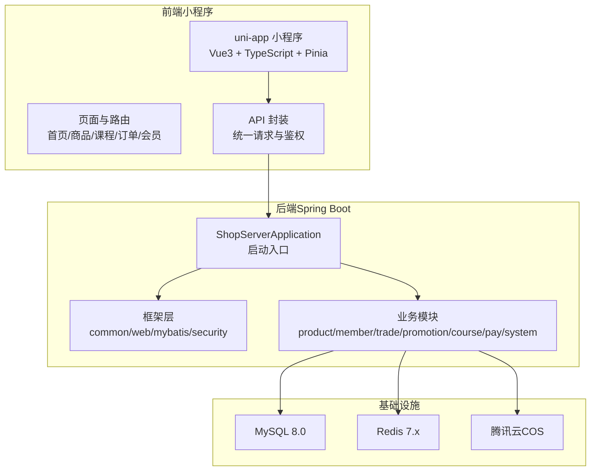
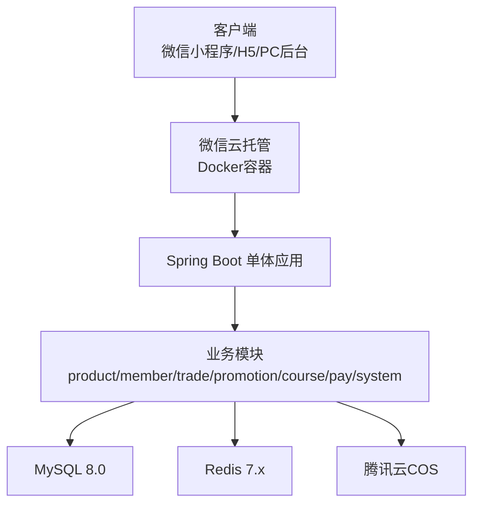
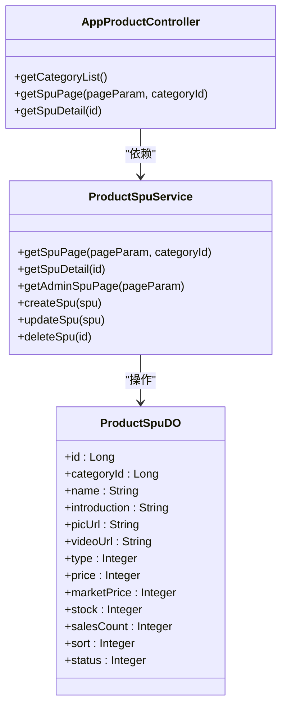
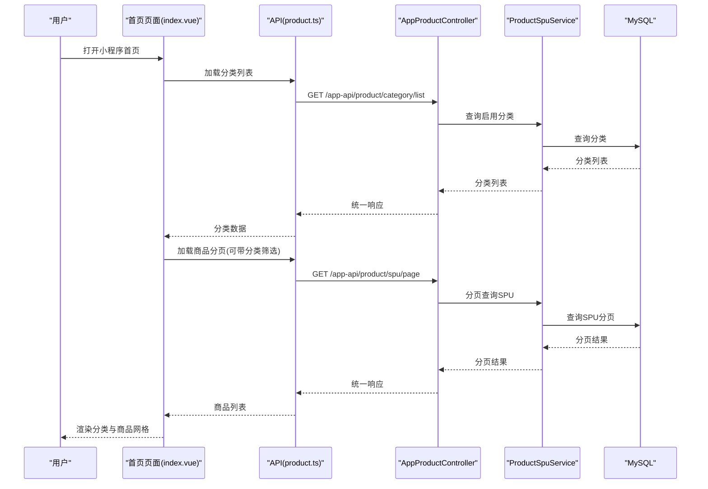
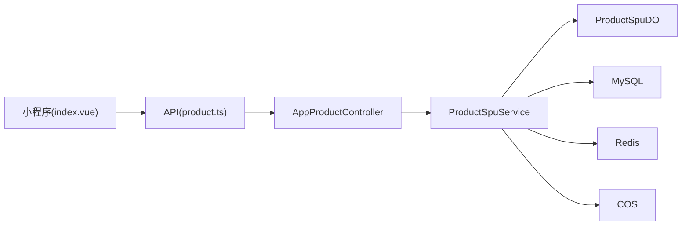

# 项目介绍

<cite>
**本文引用的文件**
- [README.md](file://README.md)
- [2026-06-22-shop-miniprogram-design.md](file://docs/superpowers/specs/2026-06-22-shop-miniprogram-design.md)
- [status.md](file://docs/superpowers/status.md)
- [init.sql](file://sql/init.sql)
- [AppProductController.java](file://shop-backend/shop-module-product/src/main/java/com/shop/module/product/controller/app/AppProductController.java)
- [ProductSpuService.java](file://shop-backend/shop-module-product/src/main/java/com/shop/module/product/service/ProductSpuService.java)
- [index.vue](file://shop-miniapp/src/pages/index/index.vue)
- [product.ts](file://shop-miniapp/src/api/product.ts)
</cite>

## 目录
1. [引言](#引言)
2. [项目结构](#项目结构)
3. [核心组件](#核心组件)
4. [架构总览](#架构总览)
5. [详细组件分析](#详细组件分析)
6. [依赖分析](#依赖分析)
7. [性能考虑](#性能考虑)
8. [故障排查指南](#故障排查指南)
9. [结论](#结论)
10. [附录](#附录)

## 引言
本项目是一个面向“药食同源”主题的微信小程序电商系统，聚焦农副产品、保健品与虚拟商品（课程研学）三大类商品模式，提供从商品浏览、下单支付到课程学习与会员权益的完整闭环。项目采用 Spec-Driven Development（规格驱动开发）方法论，以“最小可用系统”为目标，快速搭建基础骨架，并在此基础上逐步扩展营销、会员与内容能力，最终完成微信小程序上线与运营准备。

项目的核心价值主张在于：
- 以微信生态为核心，降低获客与交易门槛；
- 通过“药食同源”定位，满足健康消费场景下的高频购买与知识付费需求；
- 以“实物+虚拟+会员”的复合商业模式，提升用户生命周期价值与复购粘性；
- 以“轻量化架构+模块化设计”，在保证扩展性的前提下控制开发成本与维护复杂度。

## 项目结构
项目采用前后端分离与多模块后端架构，配合微信云托管进行部署，整体结构如下：

图表来源
- [2026-06-22-shop-miniprogram-design.md: 43-119:43-119](file://docs/superpowers/specs/2026-06-22-shop-miniprogram-design.md#L43-L119)
- [README.md: 12-41:12-41](file://README.md#L12-L41)

章节来源
- [README.md: 12-41:12-41](file://README.md#L12-L41)
- [2026-06-22-shop-miniprogram-design.md: 43-119:43-119](file://docs/superpowers/specs/2026-06-22-shop-miniprogram-design.md#L43-L119)

## 核心组件
- 商品模块（商品分类、SPU/SKU、分页查询、详情）
- 会员模块（微信登录、地址、钱包、会员订阅）
- 交易模块（购物车、订单、售后、物流、支付）
- 营销模块（优惠券、满减、活动）
- 课程模块（课程/章节/购买记录/学习进度）
- 支付模块（微信支付对接）
- 系统模块（管理员、角色、权限、配置）

章节来源
- [2026-06-22-shop-miniprogram-design.md: 79-119:79-119](file://docs/superpowers/specs/2026-06-22-shop-miniprogram-design.md#L79-L119)

## 架构总览
系统采用“单体后端 + 多模块划分”的架构，前端通过 uni-app 构建小程序，后端基于 Spring Boot 3.2 + MyBatis-Plus，统一响应、安全与数据访问层由框架层提供；部署在微信云托管，使用 Docker 容器化运行。

图表来源
- [2026-06-22-shop-miniprogram-design.md: 47-77:47-77](file://docs/superpowers/specs/2026-06-22-shop-miniprogram-design.md#L47-L77)
- [2026-06-22-shop-miniprogram-design.md: 402-424:402-424](file://docs/superpowers/specs/2026-06-22-shop-miniprogram-design.md#L402-L424)

## 详细组件分析

### 商品模块（支持三大商品模式）
- 商品类型字段用于区分“实物（农副产品/保健品）”与“虚拟（课程研学）”，便于前端与后端在展示与交易流程上差异化处理。
- 分类采用二级树形结构，支持首页分类导航与筛选。
- 提供分页查询与详情接口，支撑小程序首页与商品列表页的渲染。

图表来源
- [ProductSpuDO.java: 13-32:13-32](file://shop-backend/shop-module-product/src/main/java/com/shop/module/product/dal/dataobject/ProductSpuDO.java#L13-L32)
- [AppProductController.java: 15-38:15-38](file://shop-backend/shop-module-product/src/main/java/com/shop/module/product/controller/app/AppProductController.java#L15-L38)
- [ProductSpuService.java: 13-52:13-52](file://shop-backend/shop-module-product/src/main/java/com/shop/module/product/service/ProductSpuService.java#L13-L52)

章节来源
- [ProductSpuDO.java: 13-32:13-32](file://shop-backend/shop-module-product/src/main/java/com/shop/module/product/dal/dataobject/ProductSpuDO.java#L13-L32)
- [AppProductController.java: 15-38:15-38](file://shop-backend/shop-module-product/src/main/java/com/shop/module/product/controller/app/AppProductController.java#L15-L38)
- [ProductSpuService.java: 13-52:13-52](file://shop-backend/shop-module-product/src/main/java/com/shop/module/product/service/ProductSpuService.java#L13-L52)

### 小程序前端（首页与商品列表）
- 首页包含分类横向滚动条与商品网格布局，支持分类筛选与分页加载。
- 通过 API 封装调用后端接口，实现分类列表与商品分页数据的获取与渲染。

图表来源
- [index.vue: 33-62:33-62](file://shop-miniapp/src/pages/index/index.vue#L33-L62)
- [product.ts: 28-41:28-41](file://shop-miniapp/src/api/product.ts#L28-L41)
- [AppProductController.java: 23-37:23-37](file://shop-backend/shop-module-product/src/main/java/com/shop/module/product/controller/app/AppProductController.java#L23-L37)
- [ProductSpuService.java: 19-33:19-33](file://shop-backend/shop-module-product/src/main/java/com/shop/module/product/service/ProductSpuService.java#L19-L33)

章节来源
- [index.vue: 33-62:33-62](file://shop-miniapp/src/pages/index/index.vue#L33-L62)
- [product.ts: 28-41:28-41](file://shop-miniapp/src/api/product.ts#L28-L41)

### 三大商品模式与核心业务场景
- 实物商品（农副产品/保健品）
  - 场景：浏览/筛选/加入购物车/下单/支付/发货/收货/售后
  - 关键点：SPU/SKU模型、价格计算链、物流对接、售后流程
- 虚拟商品（课程研学）
  - 场景：课程详情/试看/购买/支付回调自动解锁/学习进度记录/断点续播
  - 关键点：课程/章节/购买记录/学习进度表结构与业务流程
- 付费会员
  - 场景：会员中心/套餐选择/支付/订阅记录/权益生效/到期提醒
  - 关键点：会员套餐定义、订阅记录、权益映射

章节来源
- [2026-06-22-shop-miniprogram-design.md: 13-18:13-18](file://docs/superpowers/specs/2026-06-22-shop-miniprogram-design.md#L13-L18)
- [2026-06-22-shop-miniprogram-design.md: 314-341:314-341](file://docs/superpowers/specs/2026-06-22-shop-miniprogram-design.md#L314-L341)

### 数据库设计要点（首期30张表）
- 会员相关：用户、地址、会员套餐、订阅、钱包、流水
- 商品相关：分类、SPU、SKU、属性、收藏
- 课程相关：课程、章节、购买记录、学习进度
- 交易相关：购物车、订单、订单明细、物流、售后、支付单、退款
- 营销相关：优惠券模板与实例、满减活动
- 分享奖励：分享记录、配置
- 内容+系统：Banner、公告、管理员、角色、系统配置、运费模板

章节来源
- [2026-06-22-shop-miniprogram-design.md: 232-309:232-309](file://docs/superpowers/specs/2026-06-22-shop-miniprogram-design.md#L232-L309)
- [init.sql: 10-122:10-122](file://sql/init.sql#L10-L122)

## 依赖分析
- 前后端通信：小程序通过统一请求封装调用后端 API，后端控制器返回统一响应格式。
- 模块间耦合：商品模块与交易模块存在强关联（订单包含商品明细），课程模块与交易模块解耦但与支付模块耦合。
- 外部依赖：微信登录/支付 SDK、MySQL、Redis、腾讯云 COS。

图表来源
- [index.vue: 33-62:33-62](file://shop-miniapp/src/pages/index/index.vue#L33-L62)
- [product.ts: 28-41:28-41](file://shop-miniapp/src/api/product.ts#L28-L41)
- [AppProductController.java: 15-38:15-38](file://shop-backend/shop-module-product/src/main/java/com/shop/module/product/controller/app/AppProductController.java#L15-L38)
- [ProductSpuService.java: 13-52:13-52](file://shop-backend/shop-module-product/src/main/java/com/shop/module/product/service/ProductSpuService.java#L13-L52)

章节来源
- [index.vue: 33-62:33-62](file://shop-miniapp/src/pages/index/index.vue#L33-L62)
- [product.ts: 28-41:28-41](file://shop-miniapp/src/api/product.ts#L28-L41)
- [AppProductController.java: 15-38:15-38](file://shop-backend/shop-module-product/src/main/java/com/shop/module/product/controller/app/AppProductController.java#L15-L38)
- [ProductSpuService.java: 13-52:13-52](file://shop-backend/shop-module-product/src/main/java/com/shop/module/product/service/ProductSpuService.java#L13-L52)

## 性能考虑
- 前端：图片与视频资源建议使用 CDN 与对象存储，减少首屏加载时间；合理分页与懒加载，避免一次性渲染过多商品卡片。
- 后端：数据库索引覆盖常见查询（分类、状态、排序），Redis 缓存热点数据（分类、热门商品），MyBatis-Plus 分页查询避免全表扫描。
- 部署：微信云托管按需扩缩容，JVM 参数与实例数量根据流量峰值调整，确保支付高峰期稳定性。

## 故障排查指南
- 后端启动失败
  - 检查数据库连接与初始化脚本是否执行成功
  - 确认端口占用与环境变量配置
- 小程序无法获取数据
  - 校验后端 API 是否正确返回统一响应
  - 检查跨域与鉴权配置
- 支付回调异常
  - 核对微信支付商户号与回调签名
  - 检查支付单与订单状态一致性

章节来源
- [README.md: 50-108:50-108](file://README.md#L50-L108)

## 结论
本项目以“药食同源”为核心定位，围绕农副产品、保健品与课程研学三大商品模式，构建了从商品到交易、从会员到内容的完整闭环。通过 Spec-Driven 的开发方法与模块化架构，项目在保证可扩展性的同时，降低了初期开发与维护成本。未来可在第一阶段完成商品与课程能力的基础上，逐步引入会员权益、分享奖励、营销活动与管理后台，最终完成小程序上线与商业化运营。

## 附录
- 开发与部署流程
  - 环境准备：JDK 17、Maven、MySQL 8、Redis 7、Node.js 18、微信开发者工具
  - 启动顺序：MySQL/Redis → 初始化数据库 → 启动后端 → 启动小程序 → 验证接口与页面
- 项目状态与下一步
  - 当前处于 Demo Foundation 阶段，已完成基础骨架与商品模块 CRUD
  - 下一步规划会员认证与管理后台骨架

章节来源
- [README.md: 50-116:50-116](file://README.md#L50-L116)
- [status.md: 7-58:7-58](file://docs/superpowers/status.md#L7-L58)