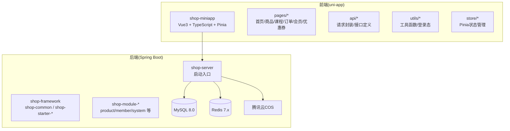
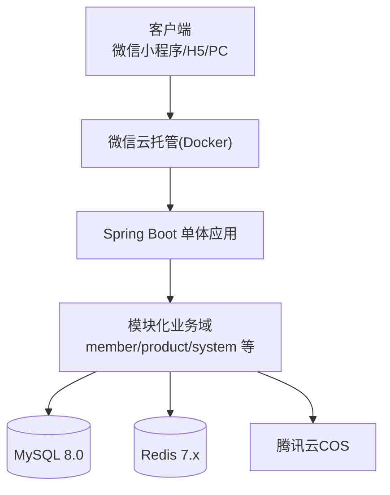
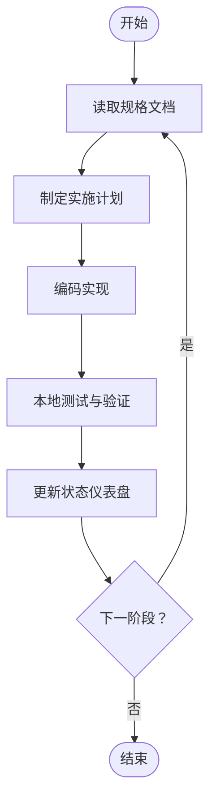
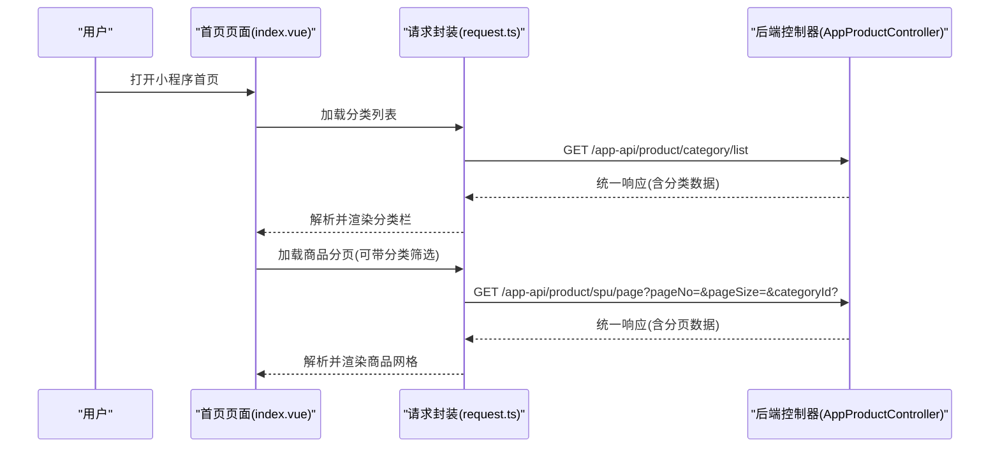
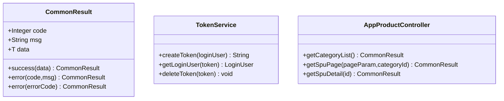
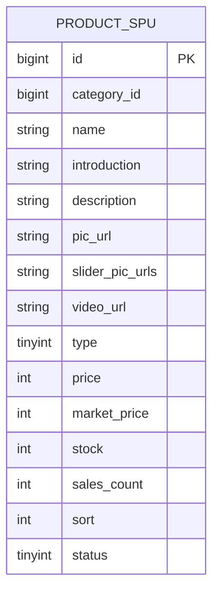
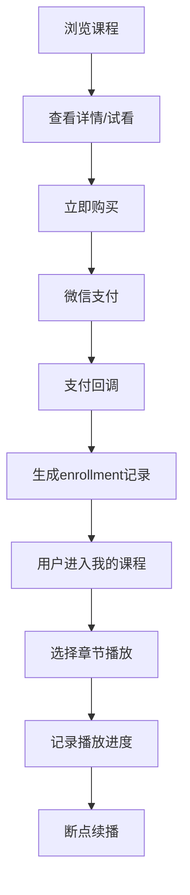
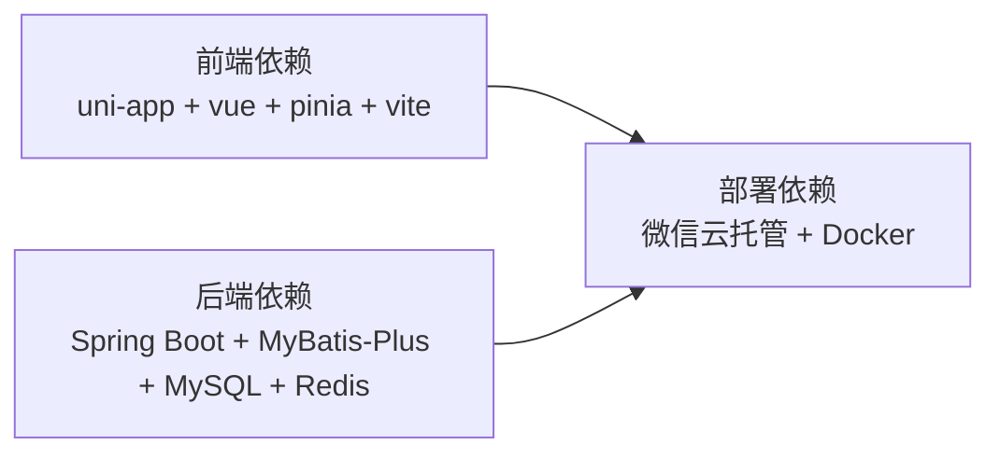

# 项目概述

<cite>
**本文引用的文件**
- [README.md](file://README.md)
- [2026-06-22-shop-miniprogram-design.md](file://docs/superpowers/specs/2026-06-22-shop-miniprogram-design.md)
- [status.md](file://docs/superpowers/status.md)
- [init.sql](file://sql/init.sql)
- [application.yml](file://shop-backend/shop-server/src/main/resources/application.yml)
- [request.ts](file://shop-miniapp/src/api/request.ts)
- [index.vue](file://shop-miniapp/src/pages/index/index.vue)
- [CommonResult.java](file://shop-backend/shop-framework/shop-common/src/main/java/com/shop/common/pojo/CommonResult.java)
- [AppProductController.java](file://shop-backend/shop-module-product/src/main/java/com/shop/module/product/controller/app/AppProductController.java)
- [ProductSpuDO.java](file://shop-backend/shop-module-product/src/main/java/com/shop/module/product/dal/dataobject/ProductSpuDO.java)
- [TokenService.java](file://shop-backend/shop-framework/shop-starter-security/src/main/java/com/shop/framework/security/TokenService.java)
- [package.json](file://shop-miniapp/package.json)
</cite>

## 目录
1. [引言](#引言)
2. [项目结构](#项目结构)
3. [核心组件](#核心组件)
4. [架构总览](#架构总览)
5. [详细组件分析](#详细组件分析)
6. [依赖分析](#依赖分析)
7. [性能考虑](#性能考虑)
8. [故障排查指南](#故障排查指南)
9. [结论](#结论)
10. [附录](#附录)

## 引言
“药食同源”微信小程序商城是一个面向药食同源、农副产品与保健品销售的微信小程序电商系统，同时支持线上课程研学内容的销售。项目以Spec-Driven Development（规格驱动开发）为核心方法论，强调“先写规格、再写计划、最后编码”，并通过统一的状态仪表盘（status.md）确保AI协作与团队对齐。系统采用前后端分离架构：后端基于Spring Boot 3.2 + Java 17 + MyBatis-Plus，前端基于uni-app（Vue3 + TypeScript + Pinia），部署于微信云托管（Docker容器）。项目具备清晰的模块化设计与可扩展性，既适合初学者建立完整的电商认知框架，也为经验丰富的开发者提供技术决策背景与落地路径。

## 项目结构
项目采用多模块分层组织，后端以Maven多模块划分，前端以uni-app工程组织，配合统一的规格文档与状态仪表盘，形成“文档驱动 + 代码实现”的闭环。

**图表来源**
- [README.md:12-41](file://README.md#L12-L41)
- [2026-06-22-shop-miniprogram-design.md:82-119](file://docs/superpowers/specs/2026-06-22-shop-miniprogram-design.md#L82-L119)
- [package.json:1-27](file://shop-miniapp/package.json#L1-L27)

**章节来源**
- [README.md:12-41](file://README.md#L12-L41)
- [2026-06-22-shop-miniprogram-design.md:82-119](file://docs/superpowers/specs/2026-06-22-shop-miniprogram-design.md#L82-L119)
- [package.json:1-27](file://shop-miniapp/package.json#L1-L27)

## 核心组件
- 统一响应与异常处理：后端通过shop-common提供统一响应结构与全局异常处理，保证接口一致性与错误可追踪性。
- 认证与安全：基于Spring Security + JWT + Redis Token，支持用户端与管理端双通道认证，Token持久化于Redis并支持续期与踢出。
- 商品模块：提供商品分类、SPU/SKU模型、分页查询与详情接口，支撑实物与虚拟商品两类业务。
- 前端请求封装：小程序端通过request.ts封装统一请求、鉴权头注入与错误提示，适配后端统一响应格式。
- 数据库与初始化：提供核心表结构（会员、商品、系统、内容等）与演示数据，便于快速启动与联调。

**章节来源**
- [CommonResult.java:8-34](file://shop-backend/shop-framework/shop-common/src/main/java/com/shop/common/pojo/CommonResult.java#L8-L34)
- [TokenService.java:10-47](file://shop-backend/shop-framework/shop-starter-security/src/main/java/com/shop/framework/security/TokenService.java#L10-L47)
- [AppProductController.java:15-39](file://shop-backend/shop-module-product/src/main/java/com/shop/module/product/controller/app/AppProductController.java#L15-L39)
- [request.ts:14-48](file://shop-miniapp/src/api/request.ts#L14-L48)
- [init.sql:5-123](file://sql/init.sql#L5-L123)

## 架构总览
系统采用“客户端（小程序/H5/PC）—云托管（Docker）—后端（Spring Boot）—数据库/缓存/对象存储”的整体架构。后端以模块化方式拆分业务域，前端通过统一请求封装与Pinia状态管理实现页面交互与数据流控制。

**图表来源**
- [2026-06-22-shop-miniprogram-design.md:47-77](file://docs/superpowers/specs/2026-06-22-shop-miniprogram-design.md#L47-L77)
- [application.yml:1-7](file://shop-backend/shop-server/src/main/resources/application.yml#L1-L7)

**章节来源**
- [2026-06-22-shop-miniprogram-design.md:43-77](file://docs/superpowers/specs/2026-06-22-shop-miniprogram-design.md#L43-L77)
- [application.yml:1-7](file://shop-backend/shop-server/src/main/resources/application.yml#L1-L7)

## 详细组件分析

### 业务定位与价值主张
- 商业模式：支持实物商品（农副产品+保健品）与虚拟商品（课程研学）两类销售；引入付费会员体系与分享奖励机制，提升用户粘性与传播效率。
- 用户价值：为用户提供便捷的一站式购买体验，涵盖从浏览、下单、支付到售后的完整闭环；虚拟课程支持在线学习与进度记录。
- 技术价值：通过Spec-Driven Development与统一状态仪表盘，降低沟通成本、提高交付质量与可维护性。

**章节来源**
- [2026-06-22-shop-miniprogram-design.md:9-19](file://docs/superpowers/specs/2026-06-22-shop-miniprogram-design.md#L9-L19)

### Spec-Driven Development 实施方式
- 规格先行：所有功能变更与新需求均以规格文档为准，确保设计一致性与可追溯性。
- 计划落地：依据规格制定阶段性计划（Plan），明确任务分解与里程碑。
- 状态驱动：通过status.md记录当前阶段、任务进度与阻塞项，AI协作时读取该文件以保持上下文同步。
- 文档与代码对齐：所有改动需更新规格与计划，形成“文档—计划—代码—状态”的闭环。

**图表来源**
- [status.md:62-77](file://docs/superpowers/status.md#L62-L77)
- [2026-06-22-shop-miniprogram-design.md:427-487](file://docs/superpowers/specs/2026-06-22-shop-miniprogram-design.md#L427-L487)

**章节来源**
- [status.md:1-77](file://docs/superpowers/status.md#L1-L77)
- [2026-06-22-shop-miniprogram-design.md:427-487](file://docs/superpowers/specs/2026-06-22-shop-miniprogram-design.md#L427-L487)

### 前端组件：请求封装与页面交互
- 请求封装：request.ts统一处理BASE_URL、鉴权头（Authorization）、统一响应校验与错误提示，屏蔽网络细节。
- 页面交互：首页index.vue展示分类栏与商品网格，支持分类筛选与分页加载，结合API层获取数据。
- 技术栈：uni-app + Vue3 + TypeScript + Pinia，页面路由与静态资源管理清晰。

**图表来源**
- [index.vue:33-63](file://shop-miniapp/src/pages/index/index.vue#L33-L63)
- [request.ts:14-48](file://shop-miniapp/src/api/request.ts#L14-L48)
- [AppProductController.java:23-32](file://shop-backend/shop-module-product/src/main/java/com/shop/module/product/controller/app/AppProductController.java#L23-L32)

**章节来源**
- [request.ts:14-48](file://shop-miniapp/src/api/request.ts#L14-L48)
- [index.vue:33-63](file://shop-miniapp/src/pages/index/index.vue#L33-L63)
- [AppProductController.java:23-32](file://shop-backend/shop-module-product/src/main/java/com/shop/module/product/controller/app/AppProductController.java#L23-L32)

### 后端组件：统一响应与认证安全
- 统一响应：CommonResult提供success/error静态工厂方法，统一返回结构，便于前端解析与错误处理。
- 认证安全：TokenService负责Token生成、读取与删除，Token存储于Redis并设置过期时间，支持续期与踢出。
- 控制器示例：AppProductController提供分类列表、商品分页与详情接口，遵循统一响应与路径规范。

**图表来源**
- [CommonResult.java:8-34](file://shop-backend/shop-framework/shop-common/src/main/java/com/shop/common/pojo/CommonResult.java#L8-L34)
- [TokenService.java:10-47](file://shop-backend/shop-framework/shop-starter-security/src/main/java/com/shop/framework/security/TokenService.java#L10-L47)
- [AppProductController.java:15-39](file://shop-backend/shop-module-product/src/main/java/com/shop/module/product/controller/app/AppProductController.java#L15-L39)

**章节来源**
- [CommonResult.java:8-34](file://shop-backend/shop-framework/shop-common/src/main/java/com/shop/common/pojo/CommonResult.java#L8-L34)
- [TokenService.java:10-47](file://shop-backend/shop-framework/shop-starter-security/src/main/java/com/shop/framework/security/TokenService.java#L10-L47)
- [AppProductController.java:15-39](file://shop-backend/shop-module-product/src/main/java/com/shop/module/product/controller/app/AppProductController.java#L15-L39)

### 数据模型：商品SPU与类型区分
- SPU模型：ProductSpuDO承载商品主信息（名称、介绍、图片、价格、库存、状态等），通过type字段区分实物（1）与虚拟（2）两类商品。
- 业务意义：同一SPU可对应多个SKU（规格/价格/库存），虚拟商品（课程）通过type与课程模块联动，实现“购买即解锁”的业务闭环。

**图表来源**
- [ProductSpuDO.java:10-33](file://shop-backend/shop-module-product/src/main/java/com/shop/module/product/dal/dataobject/ProductSpuDO.java#L10-L33)

**章节来源**
- [ProductSpuDO.java:10-33](file://shop-backend/shop-module-product/src/main/java/com/shop/module/product/dal/dataobject/ProductSpuDO.java#L10-L33)

### 核心业务流程（示例：课程购买）
- 用户浏览课程 → 查看详情/试看 → 立即购买
- 微信支付 → 支付回调 → 自动“发货”（生成enrollment记录）
- 用户进入“我的课程” → 选择章节播放 → 记录播放进度 → 支持断点续播

**图表来源**
- [2026-06-22-shop-miniprogram-design.md:324-331](file://docs/superpowers/specs/2026-06-22-shop-miniprogram-design.md#L324-L331)

**章节来源**
- [2026-06-22-shop-miniprogram-design.md:324-331](file://docs/superpowers/specs/2026-06-22-shop-miniprogram-design.md#L324-L331)

## 依赖分析
- 前端依赖：uni-app生态（@dcloudio/uni-app、@dcloudio/uni-mp-weixin、vue、pinia）与开发工具（typescript、vite）。
- 后端依赖：Spring Boot 3.2、MyBatis-Plus、MySQL 8.0、Redis 7.x、微信SDK（WxJava）等。
- 部署依赖：微信云托管（Docker容器化部署），数据库与缓存由云托管提供。

**图表来源**
- [package.json:8-25](file://shop-miniapp/package.json#L8-L25)
- [2026-06-22-shop-miniprogram-design.md:20-34](file://docs/superpowers/specs/2026-06-22-shop-miniprogram-design.md#L20-L34)

**章节来源**
- [package.json:8-25](file://shop-miniapp/package.json#L8-L25)
- [2026-06-22-shop-miniprogram-design.md:20-34](file://docs/superpowers/specs/2026-06-22-shop-miniprogram-design.md#L20-L34)

## 性能考虑
- 云托管配置：后端服务最小实例1、最大实例3、CPU 1核、内存2G，JVM堆大小建议与实例内存匹配，避免频繁GC。
- 缓存策略：Redis用于Token存储与会话管理，建议结合热点数据（商品列表、分类）进行缓存预热与失效策略。
- 数据库优化：合理索引（如商品分类、状态、手机号等）与分页查询，避免全表扫描；对高频接口进行压测与限流。
- 前端优化：图片与视频资源使用CDN与压缩，分包加载与懒加载减少首屏压力；Pinia状态管理避免不必要的响应式更新。

## 故障排查指南
- 启动与连通性
  - 后端端口：确认server.port为80，容器内可达。
  - 前端请求：检查BASE_URL与后端域名映射，确保跨域与代理配置正确。
- 认证与授权
  - Token缺失或过期：前端需在请求头注入Authorization，后端需校验Token有效性与Redis状态。
  - 登录态异常：检查TokenService的Redis键空间与过期时间，必要时清理无效Token。
- 接口与数据
  - 统一响应：若code非0，前端应根据msg提示用户；后端需确保CommonResult返回结构一致。
  - 数据初始化：确认init.sql已执行，核心表存在且演示数据已插入。
- 常见问题定位
  - 401未授权：检查前端是否携带Token，后端是否正确解析与校验。
  - 404接口不存在：核对API路径前缀（/app-api、/admin-api）与控制器映射。
  - 网络异常：检查本地网络、Docker容器网络与微信云托管访问策略。

**章节来源**
- [application.yml:5-7](file://shop-backend/shop-server/src/main/resources/application.yml#L5-L7)
- [request.ts:14-48](file://shop-miniapp/src/api/request.ts#L14-L48)
- [TokenService.java:19-45](file://shop-backend/shop-framework/shop-starter-security/src/main/java/com/shop/framework/security/TokenService.java#L19-L45)
- [CommonResult.java:15-32](file://shop-backend/shop-framework/shop-common/src/main/java/com/shop/common/pojo/CommonResult.java#L15-L32)
- [init.sql:5-123](file://sql/init.sql#L5-L123)

## 结论
“药食同源”微信小程序商城以Spec-Driven Development为方法论，结合清晰的模块化架构与统一响应/认证体系，构建了覆盖实物与虚拟商品的电商解决方案。项目在技术选型上兼顾稳定性与可扩展性，既能满足初学者的学习需求，也能为资深开发者提供可落地的技术决策背景。通过持续迭代与规范化的开发流程，项目有望在微信生态中稳定运营并逐步扩展营销与会员能力。

## 附录
- 本地测试流程与验证清单详见README中的“本地测试流程”与“测试验证清单”。
- 开发流程与Spec-Driven实践详见status.md与specs目录下的设计文档。

**章节来源**
- [README.md:50-129](file://README.md#L50-L129)
- [status.md:1-77](file://docs/superpowers/status.md#L1-L77)