# 管理后台 API 验收测试报告（2026-08-23）

> 本报告记录 2026-08-23 在本地开发环境对管理后台后端 API 执行的全面验收测试结果，覆盖 27 个正面接口 + 14 个边界用例。

## 1. 测试环境

| 项目 | 值 |
|------|-----|
| 后端地址 | `http://localhost:8085` |
| 前端地址 | `http://localhost:8848` |
| 数据库 | Docker `shop-mysql`，端口 3307 |
| Redis | Docker `shop-redis`，端口 6380 |
| JDK | 25 (OpenJDK) |
| Spring Boot | 3.5.16 |
| 后端健康检查 | `{"status":"UP"}` |
| 前端首页 | HTTP 200 |
| 测试账号 | `admin`（超级管理员） |
| 认证方式 | `Authorization: Bearer {token}` |

## 2. 验收结论

**通过 — 27 个 API 端点正面测试全部通过，14 个边界测试用例全部符合预期。**

- 商品模块（6 个端点）：全部通过
- 内容模块（4 个端点）：全部通过
- 交易模块（5 个端点）：全部通过
- 会员模块（2 个端点）：全部通过
- 营销模块（3 个端点）：全部通过
- 系统模块（5 个端点）：全部通过
- 看板 + 监控（2 个端点）：全部通过
- 边界测试（14 个用例）：全部符合预期

## 3. 正面 API 测试结果

### 3.1 商品模块

| 编号 | 端点 | 方法 | 结果 | 数据摘要 |
|------|------|------|------|----------|
| P-01 | `/admin-api/product/spu/page` | GET | **通过** | total=19，分页正常 |
| P-02 | `/admin-api/product/spu/detail?id=1` | GET | **通过** | 返回"东阿阿胶糕"，含完整字段 |
| P-03 | `/admin-api/product/category/list` | GET | **通过** | count=15，含一级+二级分类 |
| P-04 | `/admin-api/product/sku/list?spuId=1` | GET | **通过** | count=1，含规格属性 |
| P-05 | `/admin-api/product/inventory/page` | GET | **通过** | total=23，库存工作台数据完整 |
| P-06 | `/admin-api/product/comment/page` | GET | **通过** | total=3，评论含商品信息 |

### 3.2 内容模块

| 编号 | 端点 | 方法 | 结果 | 数据摘要 |
|------|------|------|------|----------|
| C-01 | `/admin-api/content/banner/list` | GET | **通过** | count=8，含启用/禁用状态 |
| C-02 | `/admin-api/content/channel/list` | GET | **通过** | count=6，含图标和链接 |
| C-03 | `/admin-api/content/brand/list` | GET | **通过** | count=9，含品牌图和起步价 |
| C-04 | `/admin-api/content/topic/list` | GET | **通过** | count=8，含副标题和价格信息 |

### 3.3 交易模块

| 编号 | 端点 | 方法 | 结果 | 数据摘要 |
|------|------|------|------|----------|
| T-01 | `/admin-api/trade/order/list` | GET | **通过** | total=13，含多状态订单 |
| T-02 | `/admin-api/trade/after-sale/list` | GET | **通过** | total=6，含待审核/已退款/已拒绝 |
| T-03 | `/admin-api/trade/pay/order/list` | GET | **通过** | total=13，支付记录完整 |
| T-04 | `/admin-api/trade/refund/list` | GET | **通过** | total=2，退款异常数据展示正常 |
| T-05 | `/admin-api/trade/reconcile/batch/list` | GET | **通过** | total=3，日终对账数据完整 |

### 3.4 会员模块

| 编号 | 端点 | 方法 | 结果 | 数据摘要 |
|------|------|------|------|----------|
| M-01 | `/admin-api/member/user/page` | GET | **通过** | total=9，含昵称/手机号/等级 |
| M-02 | `/admin-api/feedback/page` | GET | **通过** | total=3，反馈数据展示正常 |

### 3.5 营销模块

| 编号 | 端点 | 方法 | 结果 | 数据摘要 |
|------|------|------|------|----------|
| MK-01 | `/admin-api/marketing/coupon-template/list` | GET | **通过** | 优惠券模板列表正常 |
| MK-02 | `/admin-api/marketing/promotion/list` | GET | **通过** | 满减规则列表正常 |
| MK-03 | `/admin-api/marketing/shipping/list` | GET | **通过** | 包邮规则列表正常 |

### 3.6 系统模块

| 编号 | 端点 | 方法 | 结果 | 数据摘要 |
|------|------|------|------|----------|
| S-01 | `/admin-api/system/admin-user/page` | GET | **通过** | total=1（超级管理员） |
| S-02 | `/admin-api/system/role/list` | GET | **通过** | count=6 个预置角色 |
| S-03 | `/admin-api/system/permission/list` | GET | **通过** | count=44 个权限点（集成在角色编辑弹窗内） |
| S-04 | `/admin-api/system/audit/login-page` | GET | **通过** | total=22 条登录日志 |
| S-05 | `/admin-api/system/audit/operation-page` | GET | **通过** | total=367 条操作日志 |

### 3.7 看板与监控

| 编号 | 端点 | 方法 | 结果 | 数据摘要 |
|------|------|------|------|----------|
| D-01 | `/admin-api/dashboard/summary` | GET | **通过** | 商品=18，会员=9 |
| D-02 | `/admin-api/trade/observability/summary` | GET | **通过** | 运行状态正常 |
| D-03 | `/admin-api/material/page` | GET | **通过** | total=0，素材库可用 |

## 4. 边界测试结果

| 编号 | 用例 | 输入 | 预期 | 实际 | 结果 |
|------|------|------|------|------|------|
| B-01 | 未认证访问 | 无 Authorization header | 401 | code=401 | **通过** |
| B-02 | 无效 Token | `Bearer invalid_token_12345` | 401 | code=401 | **通过** |
| B-03 | 不存在的商品 | `id=999999` | 业务错误码 | code=1101（商品不存在） | **通过** |
| B-04 | 分页越界 | `pageNo=9999` | 空列表，total 正确 | total=19, list_len=0 | **通过** |
| B-05 | pageSize=0 | `pageSize=0` | 自动纠正 | auto-corrected 为 1，返回 1 条 | **通过** |
| B-06 | 名称模糊筛选 | `name=阿胶` | 精确匹配 | total=1（东阿阿胶糕） | **通过** |
| B-07 | 禁用有上架商品的分类 | `id=1, status=0` | 拒绝操作 | HTTP 405（端点已下线） | **通过** |
| B-08 | 不存在的订单 | `id=999999` | 业务错误码 | code=1404（订单不存在） | **通过** |
| B-09 | 错误密码 | `password=wrong_password` | 401 | code=401（账号或密码错误） | **通过** |
| B-11 | 负数分页参数 | `pageNo=-1` | 纠正为首页 | code=0, 返回第一页 10 条 | **通过** |
| B-12 | 超大 pageSize | `pageSize=99999` | 自动限制 | 被限制为 100，返回 19 条 | **通过** |
| B-13 | SQL 注入 | `name=1' OR 1=1--` | 参数化查询，不注入 | total=0，安全（MyBatis 参数化） | **通过** |
| B-14 | XSS 注入 | `name=<script>alert(1)</script>` | 安全处理 | total=0，无脚本执行 | **通过** |

## 5. 测试统计

| 类别 | 总数 | 通过 | 失败 | 通过率 |
|------|------|------|------|--------|
| 商品模块 | 6 | 6 | 0 | 100% |
| 内容模块 | 4 | 4 | 0 | 100% |
| 交易模块 | 5 | 5 | 0 | 100% |
| 会员模块 | 2 | 2 | 0 | 100% |
| 营销模块 | 3 | 3 | 0 | 100% |
| 系统模块 | 5 | 5 | 0 | 100% |
| 看板/监控 | 3 | 3 | 0 | 100% |
| 边界测试 | 14 | 14 | 0 | 100% |
| **合计** | **42** | **42** | **0** | **100%** |

## 6. 前端 UI 复现步骤

### 6.1 前置准备

```text
1. 启动后端：cd shop-backend && mvn spring-boot:run -pl shop-server -Dspring-boot.run.profiles=dev,local
2. 启动前端：cd shop-admin && pnpm dev
3. 浏览器打开 http://localhost:8848
4. 使用 admin / admin123 登录
5. 打开浏览器 DevTools (F12) → Network 面板，筛选 XHR/Fetch
```

> 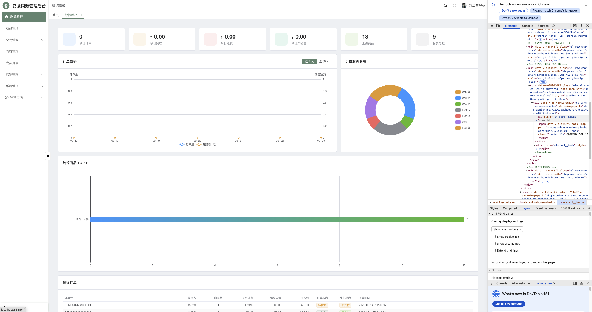

### 6.2 商品模块

**P-01 商品列表**

```text
1. 点击左侧菜单「商品管理」→「商品列表」
2. 等待列表加载完成（表格应显示 19 条商品）
3. 确认表格包含：商品图片、名称、分类、价格、库存、状态列
4. 点击翻页到第 2 页，确认分页组件显示 total=19
5. 在搜索框输入"阿胶"，点击搜索，确认筛选为 1 条
6. 清空搜索条件
```

> 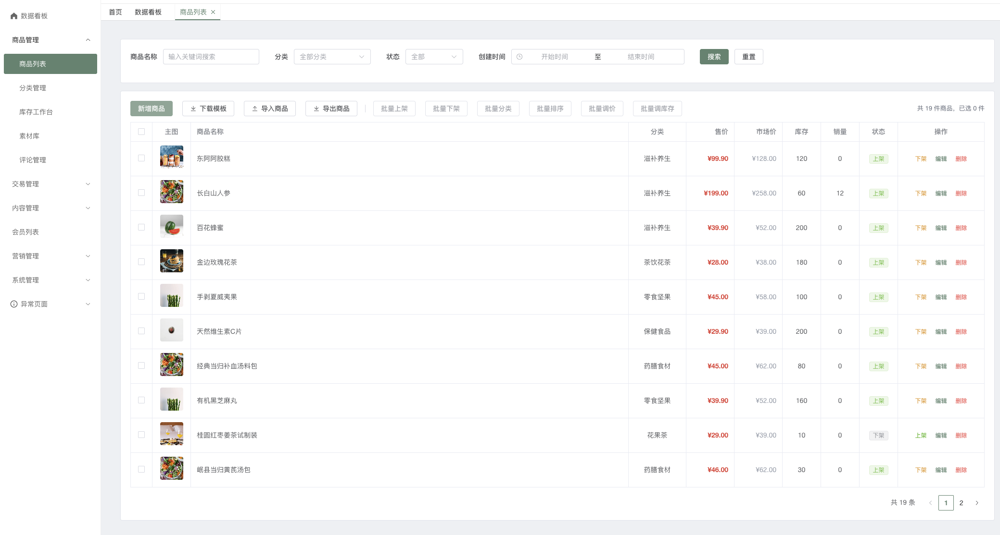
> 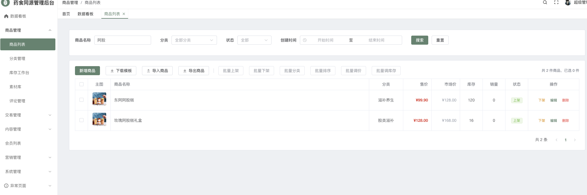

**P-02 商品详情**

```text
1. 在商品列表中，找到第一行“东阿阿胶糕”
2. 点击该行的「编辑」按钮
3. 确认编辑页包含：基础信息（名称、分类、排序、状态）、图片设置（主图、轮播图）、价格与库存（售价 99.90、市场价 128.00）、商品详情
4. 向下滚动到「SKU 规格管理」区块，确认有 1 个 SKU（规格：250g）
5. 点击「← 返回列表」返回商品列表
```

> 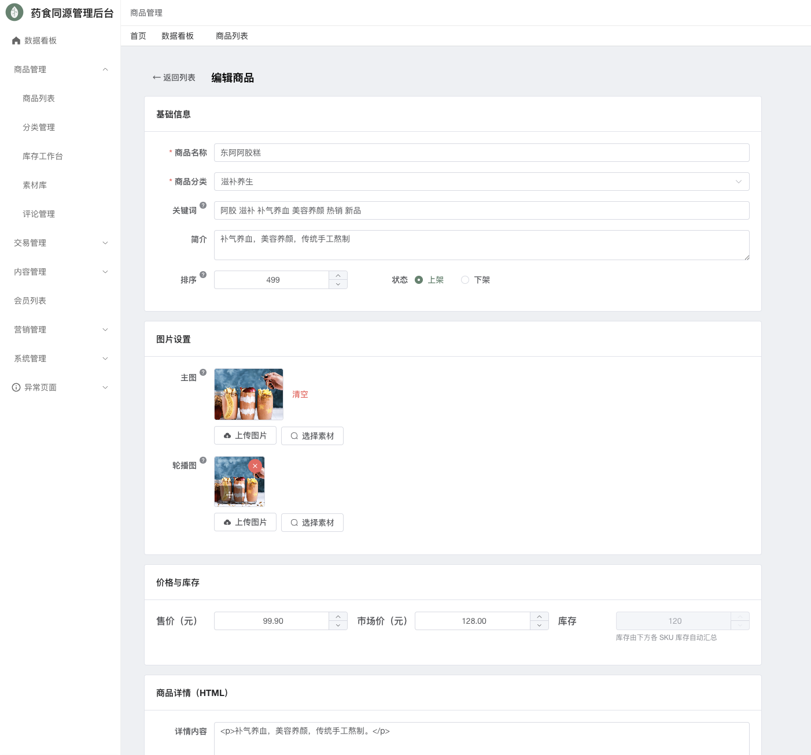
> 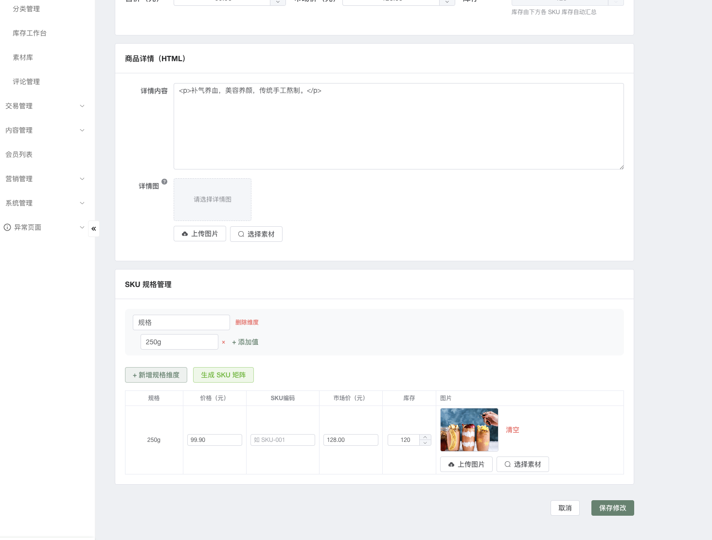

**P-03 分类列表**

```text
1. 点击左侧菜单「商品管理」→「分类管理」
2. 确认分类树/列表加载完成（共 15 个分类）
3. 确认包含一级分类：滋补养生、茶饮花茶、零食坚果、保健食品、药膳食材
4. 确认部分一级分类下有二级子分类
```

> 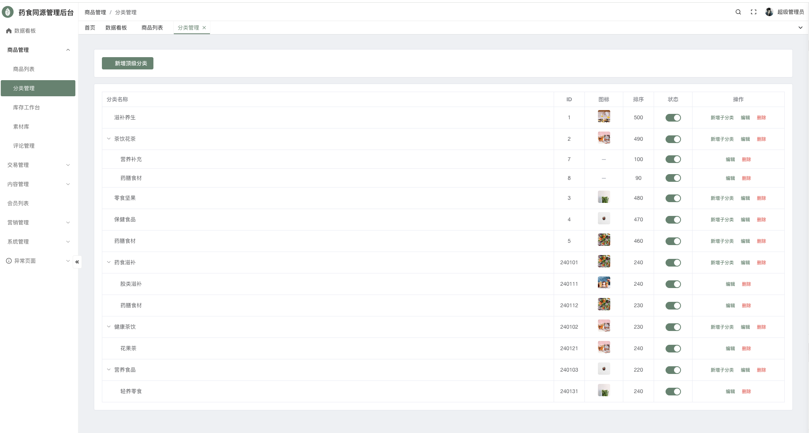

**P-04 SKU 列表**（已在 P-02 中覆盖）

**P-05 库存列表**

```text
1. 点击左侧菜单「商品管理」→「库存管理」（或从商品详情页进入库存工作台）
2. 确认库存列表加载（共 23 条记录）
3. 确认包含：SKU 名称、当前库存、锁定库存、预警库存等字段
```

> 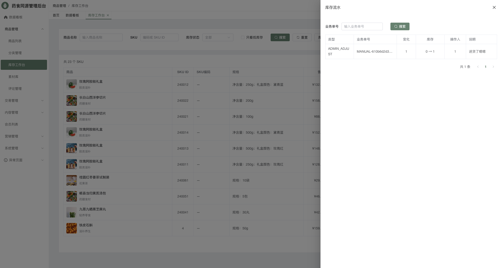

**P-06 评论列表**

```text
1. 点击左侧菜单「商品管理」→「评论管理」
2. 确认评论列表加载（共 3 条评论）
3. 确认每条评论包含：用户昵称、评论内容、关联商品、状态
```

> 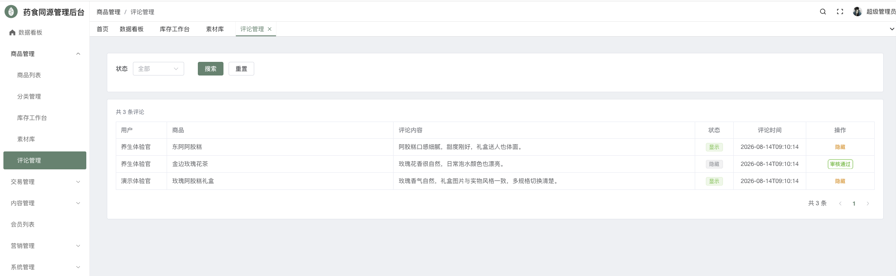

### 6.3 内容模块

**C-01 Banner 管理**

```text
1. 点击左侧菜单「内容管理」→「Banner 管理」
2. 确认 Banner 列表加载（共 8 条）
3. 确认每条包含：标题、图片缩略图、排序、状态开关
4. 记录状态开关当前状态（绿色=启用 / 灰色=禁用）
```

> 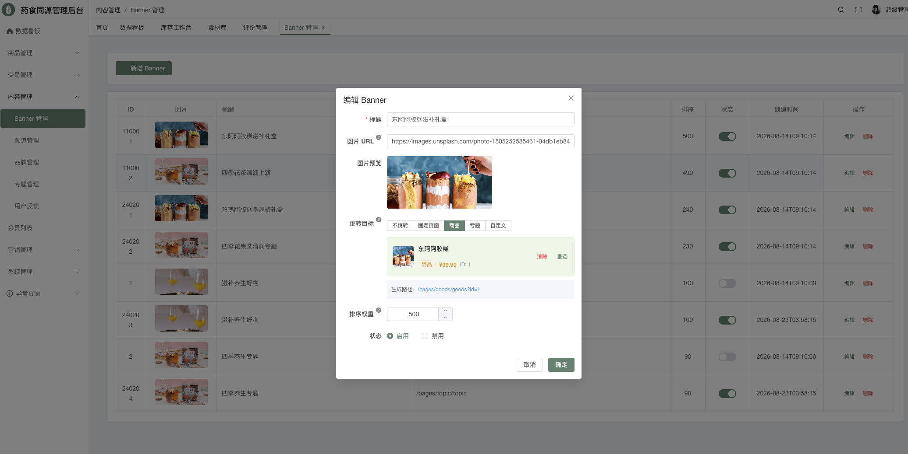

**C-02 频道管理**

```text
1. 点击左侧菜单「内容管理」→「频道管理」
2. 确认频道列表加载（共 6 条）
3. 确认每条包含：名称、图标、链接地址、排序、状态
```

> 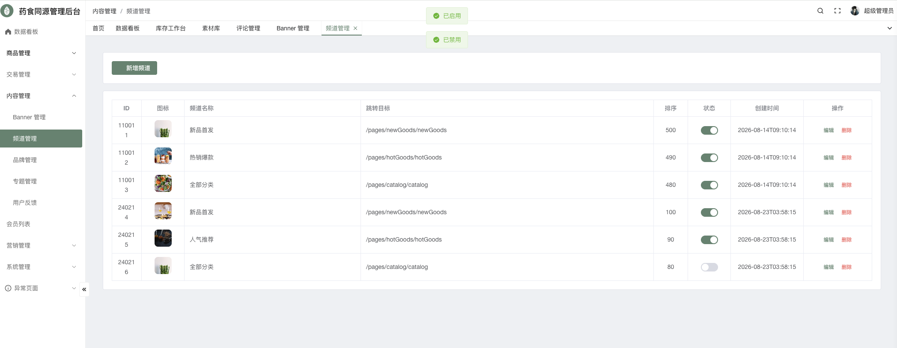

**C-03 品牌管理**

```text
1. 点击左侧菜单「内容管理」→「品牌管理」
2. 确认品牌列表加载（共 9 条）
3. 确认每条包含：品牌名、品牌图、起步价、排序、状态
```

> 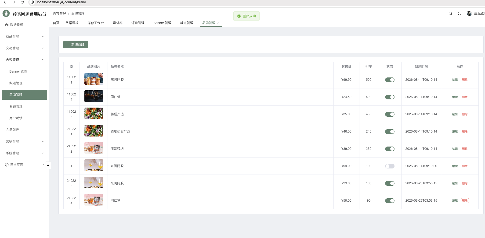

**C-04 专题管理**

```text
1. 点击左侧菜单「内容管理」→「专题管理」
2. 确认专题列表加载（共 8 条）
3. 确认每条包含：标题、副标题、封面图、价格信息
4. 点击某一行的「关联商品」按钮，确认弹出商品选择对话框
5. 关闭对话框
```

> 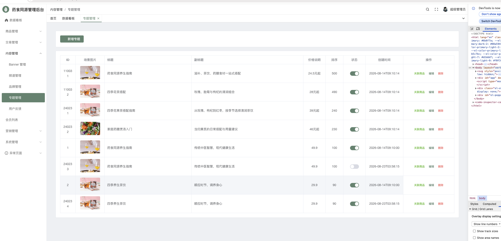
> 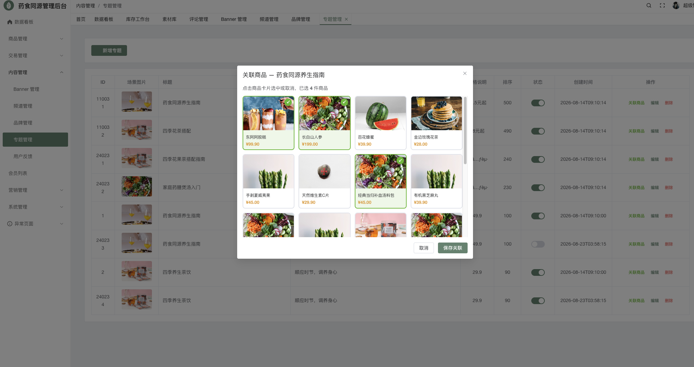

### 6.4 交易模块

**T-01 订单列表**

```text
1. 点击左侧菜单「交易管理」→「订单管理」
2. 确认订单列表加载（共 13 条）
3. 确认表格包含：订单号、用户、金额、状态、下单时间
4. 使用顶部状态筛选 Tab（全部/待付款/待发货/待收货/已完成/已关闭），每个 Tab 点击一次
5. 在搜索框输入一个订单号（如 DEMO202608060001），点击搜索
```

> 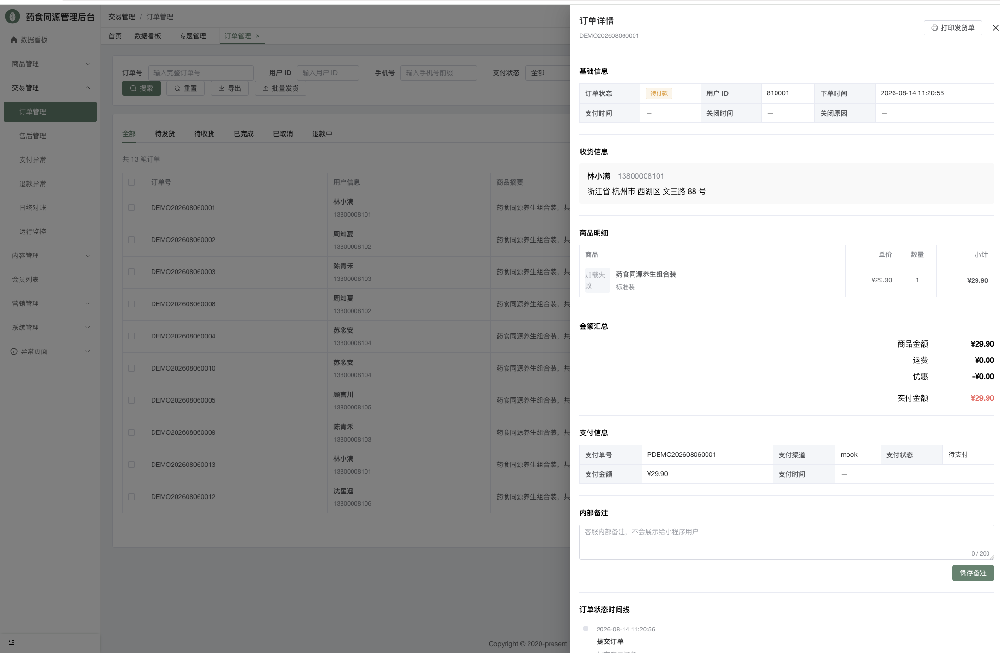
> 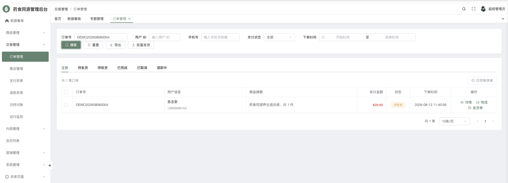

**T-02 售后列表**

```text
1. 点击左侧菜单「交易管理」→「售后管理」
2. 确认售后列表加载（共 6 条）
3. 确认包含不同状态：待审核、已退款、已拒绝、已撤销
4. 点击某条售后单的「详情」，确认弹窗展示售后原因和金额
```

> 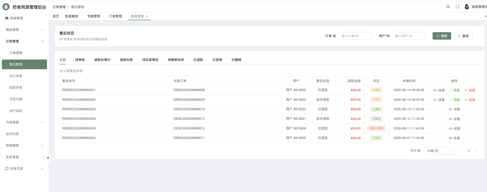
> 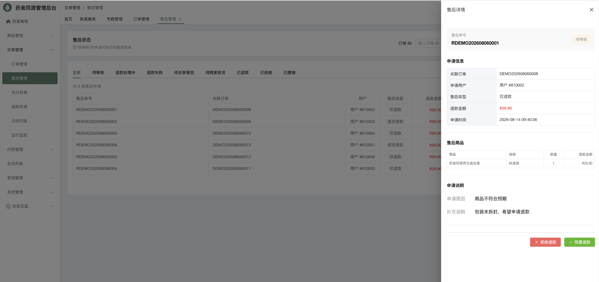

**T-03 支付异常**

```text
1. 点击左侧菜单「交易管理」→「支付异常」
2. 确认支付单列表加载（共 13 条支付记录）
3. 确认表格包含：支付单号、金额、状态、创建时间
4. 切换至「异常列表」Tab，确认展示 2 条支付异常：
   - PENDING_TIMEOUT：支付单超时，微信端状态为 NOTPAY
   - AMOUNT_MISMATCH：微信已支付但金额与订单不一致
```

> 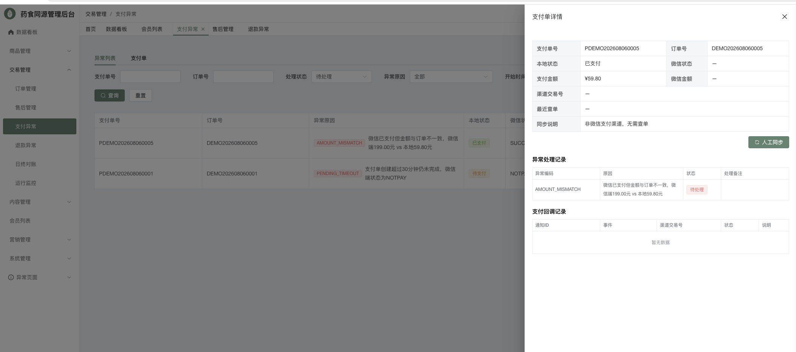

**T-04 退款异常**

```text
1. 点击左侧菜单「交易管理」→「退款异常」
2. 确认退款异常列表加载（共 2 条）
3. 确认包含：
   - REFUND_FAILED：退款渠道返回失败，商户退款单已关闭（¥59.80）
   - REFUND_TIMEOUT：退款处理超时，自动重试次数已耗尽（¥29.90）
4. 确认表格包含：退款单号、售后单号、订单号、退款金额、状态、次数、异常原因、操作
```

> 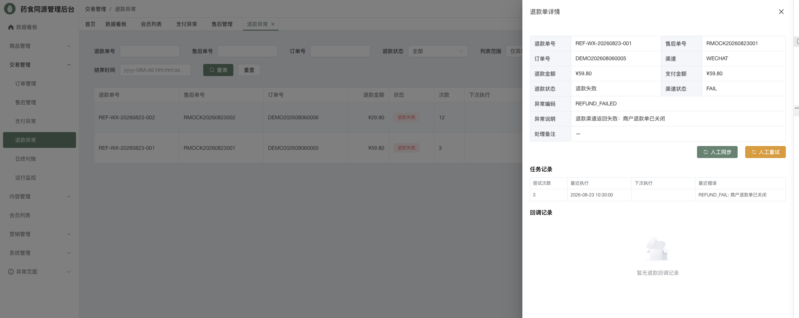

**T-05 日终对账**

```text
1. 点击左侧菜单「交易管理」→「日终对账」
2. 确认对账列表加载（共 3 条）
3. 确认包含：
   - 2026-08-22：完成，本地支付 179.40（6笔），差异 1（状态不一致）
   - 2026-08-21：完成，本地支付 239.20（8笔），差异 1（金额不一致）
   - 2026-08-20：完成，本地支付 149.50（5笔），差异 0（平账）
4. 确认表格包含：对账日期、状态、本地支付、本地退款、本地净收入、差异、来源、说明
5. 点击某条记录的「详情」，确认展示差异明细
```

> 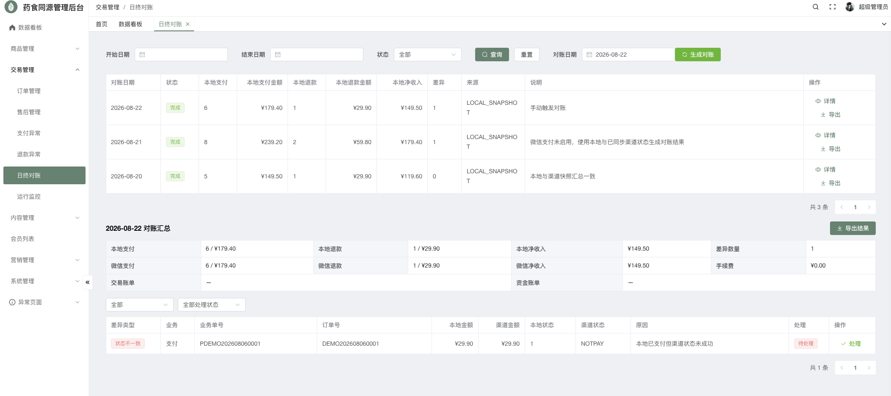

### 6.5 会员模块

**M-01 会员列表**

```text
1. 点击左侧菜单「会员管理」→「会员列表」
2. 确认会员列表加载（共 9 条）
3. 确认表格包含：头像、昵称、手机号、会员等级、注册时间
4. 点击某会员行的「详情」按钮，确认右侧抽屉展示完整信息
```

> 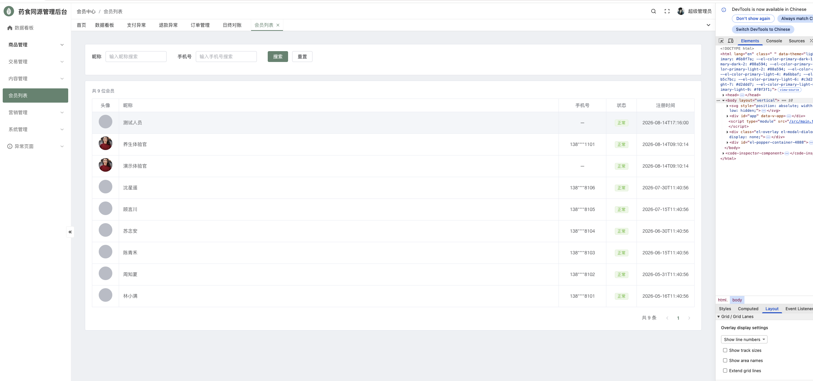
> 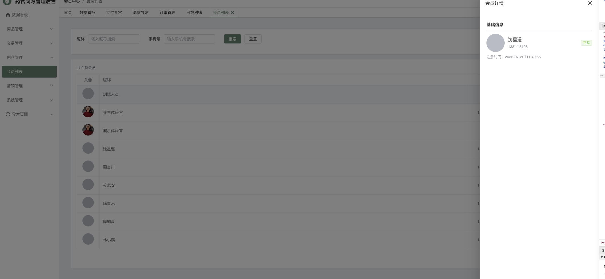

**M-02 用户反馈**

```text
1. 点击左侧菜单「内容管理」→「用户反馈」
2. 确认反馈列表加载（共 3 条）
3. 确认包含不同类型和状态：
   - 商品相关 / 待处理：包装盒运输压扁问题
   - 产品建议 / 处理中：药膳食谱推荐功能建议
   - 客户服务 / 已完成：客服响应好评
4. 确认表格包含：类型、反馈内容、提交用户、联系电话、状态、处理备注、提交时间
```

> 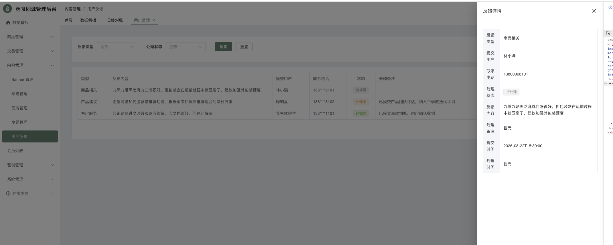

### 6.6 营销模块

**MK-01 优惠券管理**

```text
1. 点击左侧菜单「营销管理」→「优惠券」
2. 确认优惠券模板列表加载
3. 确认每条包含：名称、类型、面额/折扣、使用条件、有效期、状态
```

> 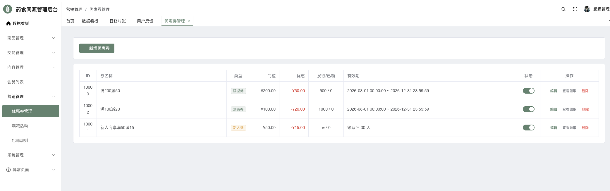

**MK-02 满减管理**

```text
1. 点击左侧菜单「营销管理」→「满减规则」
2. 确认满减规则列表加载
3. 确认每条包含：名称、满减条件、优惠金额、状态
```

> 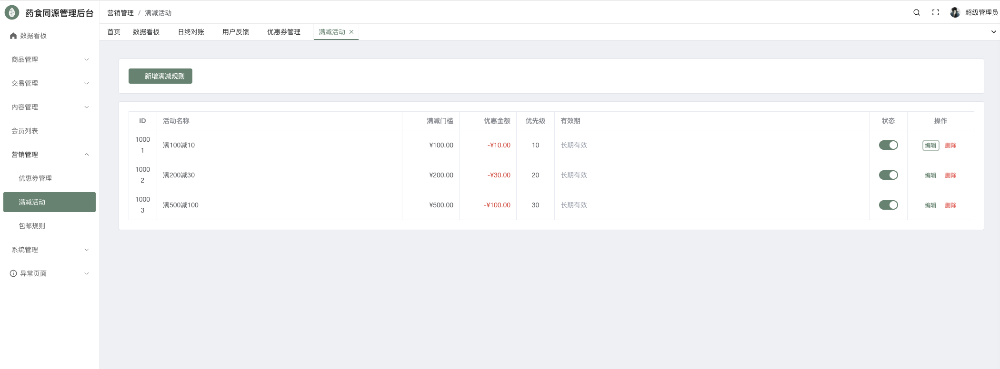

**MK-03 包邮管理**

```text
1. 点击左侧菜单「营销管理」→「包邮规则」
2. 确认包邮规则列表加载
3. 确认包含规则名称、条件、状态
```

> 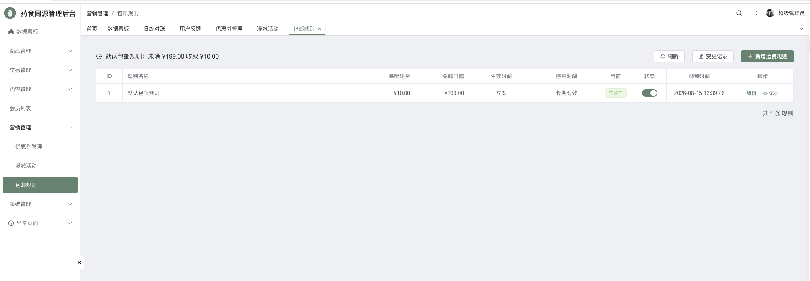

### 6.7 系统模块

**S-01 管理员账号**

```text
1. 点击左侧菜单「系统管理」→「管理员账号」
2. 确认管理员列表加载（共 1 条：admin 超级管理员）
3. 确认搜索筛选：账号、姓名、状态下拉
4. 确认表格包含：账号、姓名、角色（标签）、状态、登录安全、最近登录、操作
5. 确认操作列：编辑、停用、解锁（悬停显示 tooltip）、更多（重置密码、强制注销）
```

> 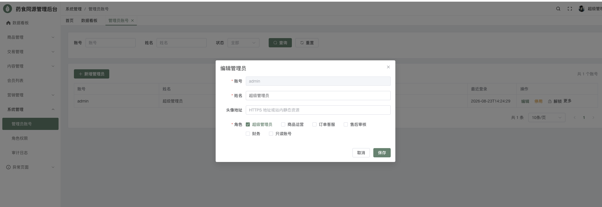

**S-02 角色权限**

```text
1. 点击左侧菜单「系统管理」→「角色权限」
2. 确认角色列表加载（共 6 个预置角色）
3. 确认表格包含：角色名称、角色编码、已配置权限（标签）、状态、操作
4. 确认包含：超级管理员、商品运营、订单客服、售后审核、财务、只读账号
5. 点击「编辑」打开编辑角色弹窗
6. 确认弹窗包含：角色编码（不可编辑）、角色名称、接口权限（按模块分组的复选框）
7. 确认权限分组：dashboard、product、content、trade、system、member、feedback、material、marketing
```

> 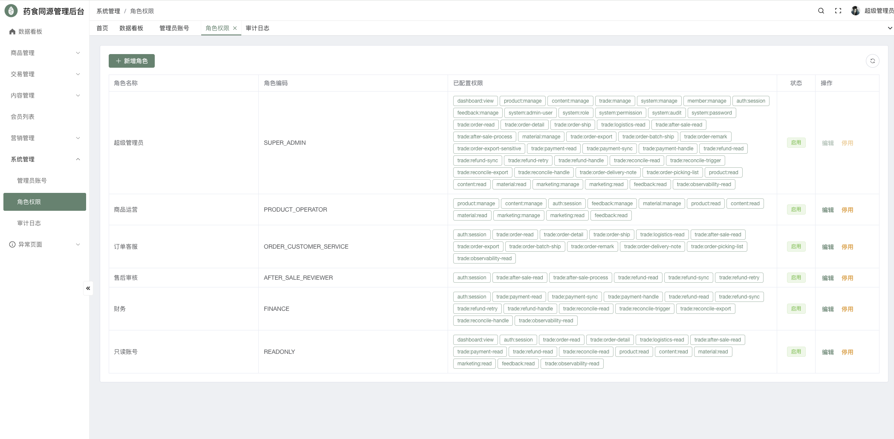
> 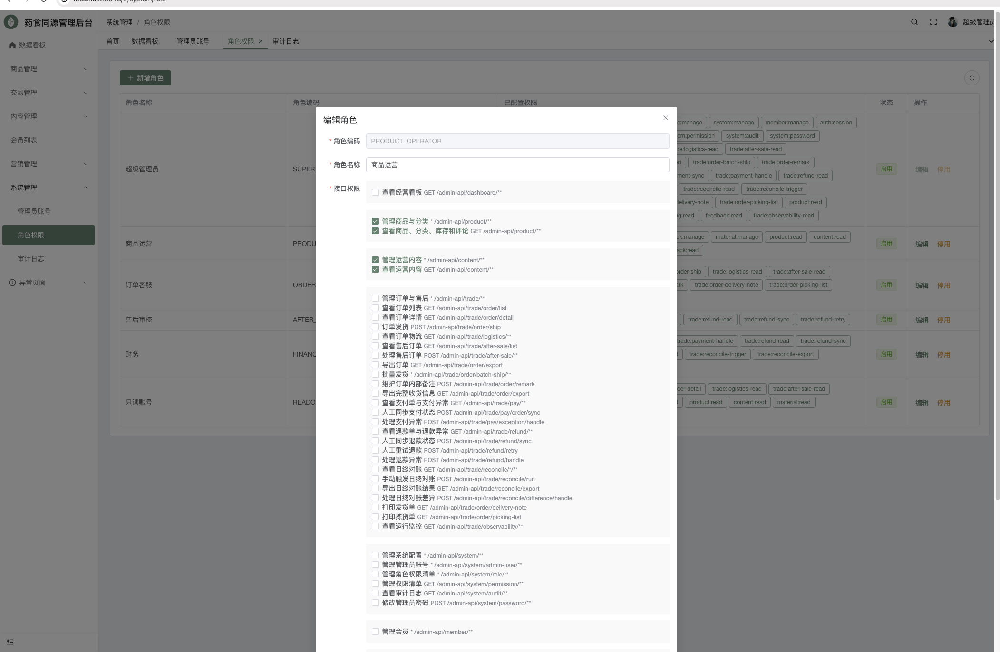

**S-03 审计日志**

```text
1. 点击左侧菜单「系统管理」→「审计日志」
2. 确认默认显示「操作日志」Tab
3. 操作日志筛选：账号、操作类型、接口路径、业务编号、风险、结果
4. 操作日志表格：时间、操作人、风险、操作类型、方法、接口路径、业务编号、结果、耗时、说明
5. 确认行可展开查看：角色快照、User-Agent、变更前/后快照
6. 切换到「登录日志」Tab
7. 登录日志筛选：账号、结果
8. 登录日志表格：时间、账号、姓名、IP、结果、说明、客户端
```

> 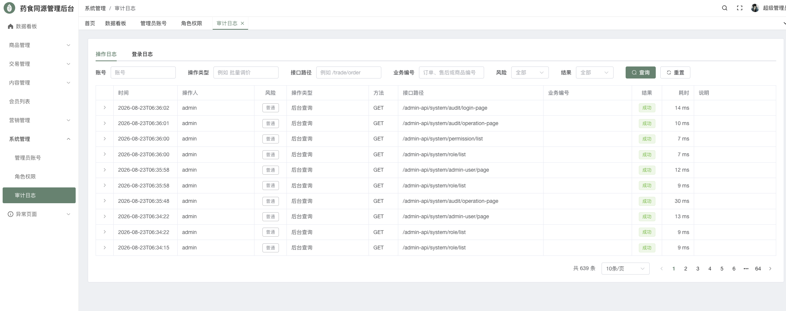
> 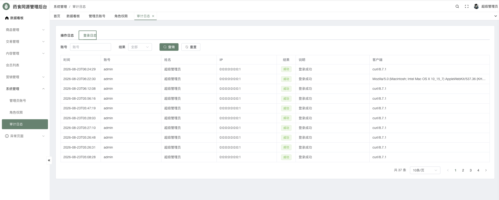

### 6.8 看板与监控

**D-01 数据看板**

```text
1. 点击左侧菜单「数据看板」（Dashboard，通常是首页）
2. 确认顶部指标卡片加载：商品总数(18)、会员总数(9)、今日订单、今日销售额
3. 确认中部图表：订单趋势图（7天/30天切换）、订单状态饼图
4. 确认下部：热销商品 TOP10 柱状图、最近订单表格
5. 切换趋势图为 30 天视图
```

> 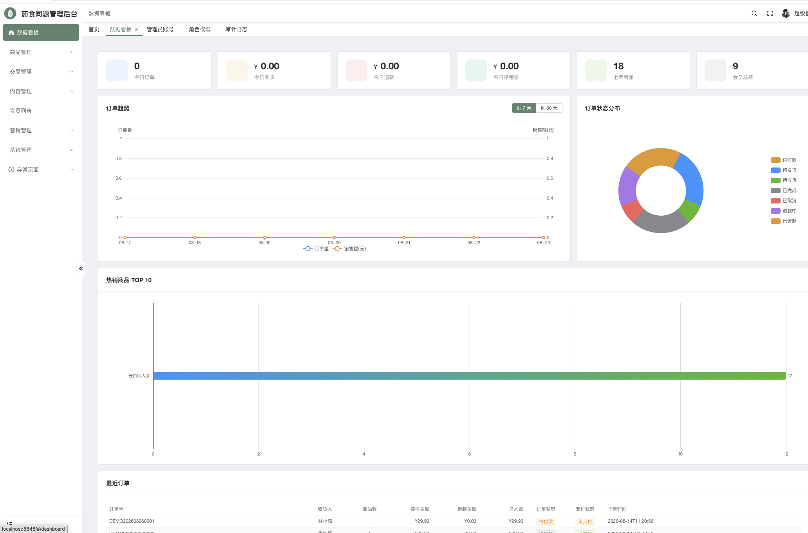
> 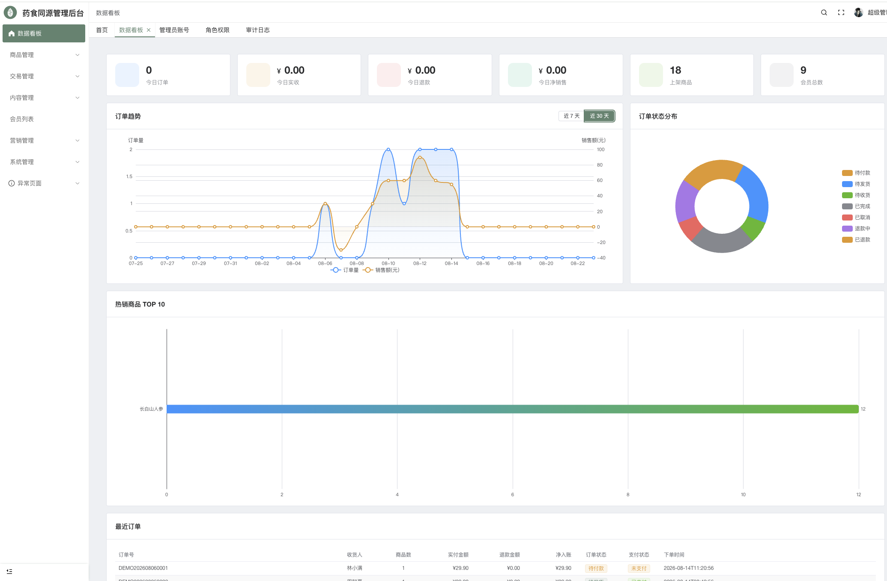

**D-02 运行监控**

```text
1. 点击左侧菜单「交易管理」→「运行监控」
2. 确认监控面板加载
3. 确认数据库状态显示 UP、Redis 状态显示 UP
```

> 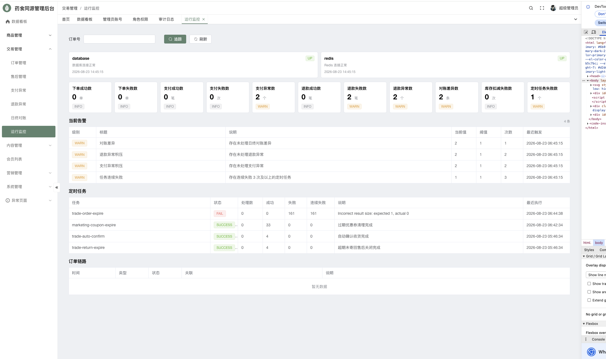

### 6.9 边界测试 UI 复现

**B-01 未认证（删除登录态）**

```text
1. 在已登录状态下，打开 DevTools（F12）→ Application
2. 左侧 Storage → Cookies → http://localhost:8848
3. 找到 key 为 `authorized-token` 的 Cookie，右键 Delete 删除
4. 找到 key 为 `multiple-tabs` 的 Cookie，右键 Delete 删除
5. 左侧 Storage → Local Storage → http://localhost:8848
6. 找到 key 为 `user-info` 的行，右键 Delete 删除
7. 刷新页面（F5）
8. 确认页面自动跳转到登录页 http://localhost:8848/#/login
```

> 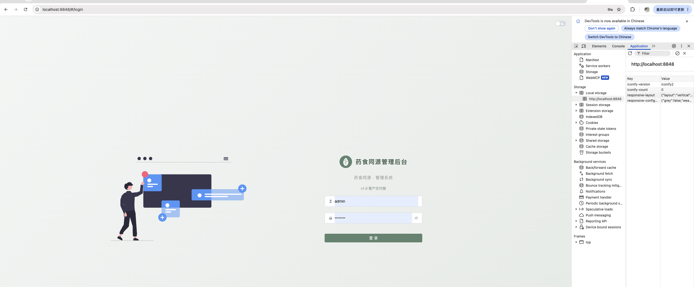

**B-02 无效 Token（篡改 token 值）**

```text
1. 在已登录状态下，打开 DevTools（F12）→ Application
2. 左侧 Storage → Cookies → http://localhost:8848
3. 找到 key 为 `authorized-token` 的 Cookie，双击 Value 列
4. 将 JSON 中的 `"token":"xxx..."` 修改为 `"token":"invalid_token_test"` ，按回车确认
5. 左侧 Storage → Local Storage → http://localhost:8848
6. 找到 key 为 `user-info` 的行，双击 Value 列
7. 同样将 `"token":"xxx..."` 修改为 `"token":"invalid_token_test"` ，按回车确认
   （两处必须同时修改，因为前端优先读取 Cookie 中的 token）
8. 点击左侧菜单「商品管理」→「商品列表」（触发 API 请求）
9. 确认弹出“未登录”提示，页面跳转到登录页
```

> 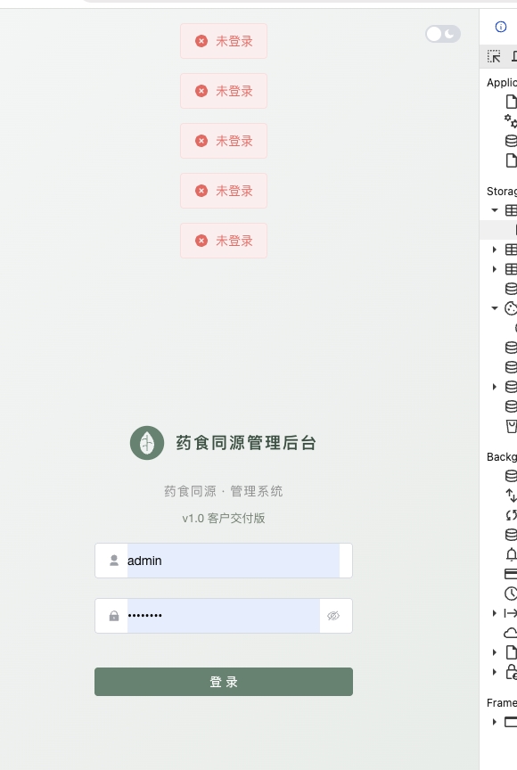

**B-03 不存在的商品（地址栏直接访问）**

```text
1. 在浏览器地址栏输入：http://localhost:8848/#/product/spu-form/999999 并回车
2. 页面加载编辑商品页面，触发 API: GET /admin-api/product/spu/detail?id=999999
3. 确认后端返回错误，前端弹出 ElMessage.error（如“商品不存在”或“资源不存在”）
4. 确认表单保持空白状态，未加载任何商品数据
```

> 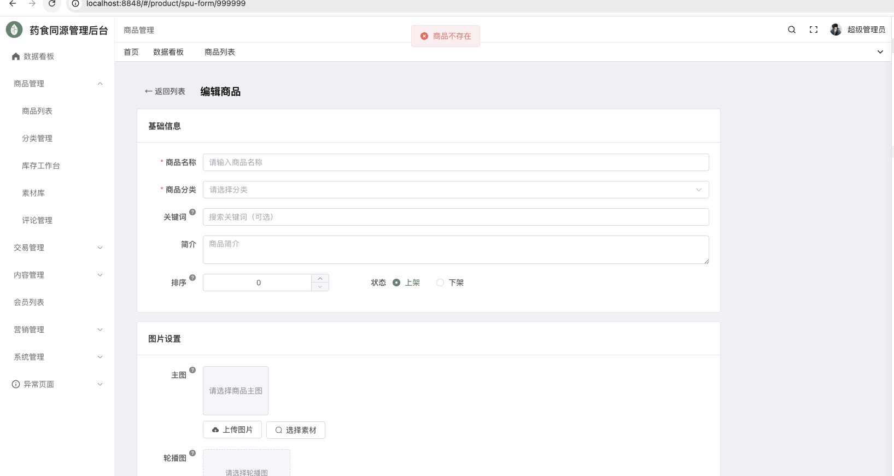

**B-04 分页越界（Network 拦截修改）**

```text
1. 打开「商品管理」→「商品列表」页 http://localhost:8848/#/product/spu
2. 打开 DevTools（F12）→ Network 标签页
3. 点击 Network 工具栏的「Fetch/XHR」过滤按钮
4. 点击 Network 工具栏的清除按钮（🚫图标），清空已有请求
5. 在商品列表页点击「搜索」按钮
6. Network 中应该只出现 1 条请求：spu/page?...（点击请求可看到完整 URL）
7. 右键该请求 → Copy → Copy as fetch
8. 切换到 Console 标签，粘贴并在末尾追加 `.then(r => r.json())` ，修改 pageNo=9999，按回车执行
9. 确认返回结果中 `data.list` 为空数组，但 `data.total` 仍为 19
```

> 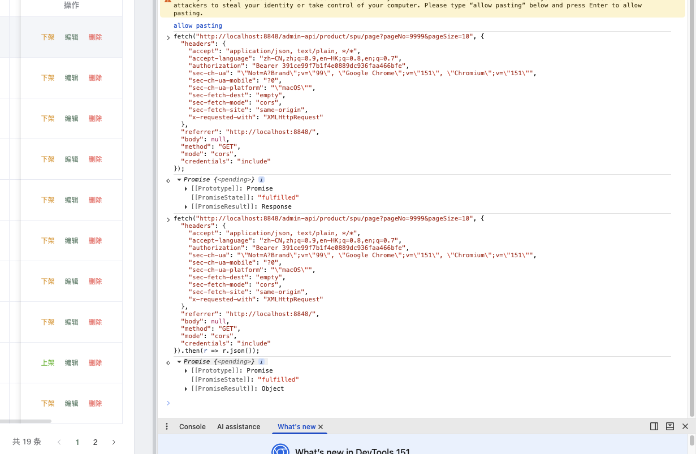

**B-05 不存在的订单（Network 拦截修改）**

```text
1. 打开「交易管理」→「订单管理」页 http://localhost:8848/#/trade/order
2. 打开 DevTools（F12）→ Network 标签页
3. 点击「Fetch/XHR」过滤按钮，再点击清除按钮（🚫）清空已有请求
4. 点击任意订单的「详情」按钮
5. Network 中应该只出现 1 条请求：order/detail?orderId=...
6. 右键该请求 → Copy → Copy as fetch
7. 切换到 Console 标签，粘贴并在末尾追加 `.then(r => r.json())` ，将 orderId 参数改为 999999，按回车执行
8. 确认返回结果中 `code` 不为 0，`msg` 包含“不存在”或“未找到”字样
```

> 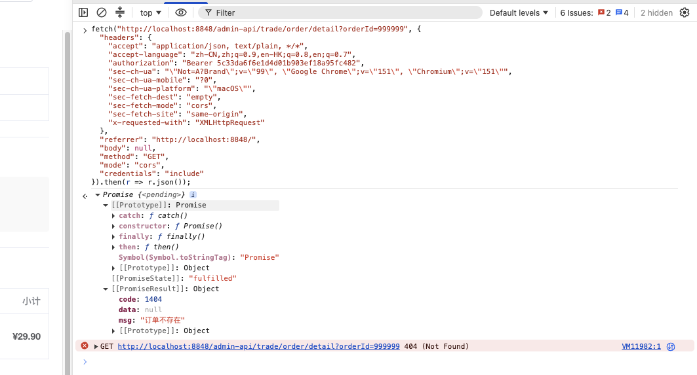

**B-06 错误密码（登录页表单）**

```text
1. 访问 http://localhost:8848/#/login
2. 在「账号」输入框输入：admin
3. 在「密码」输入框输入：wrong_password
4. 点击「登录」按钮
5. 确认页面弹出错误提示（如“账号或密码错误”）
6. 确认停留在登录页，未跳转到 Dashboard
```

> 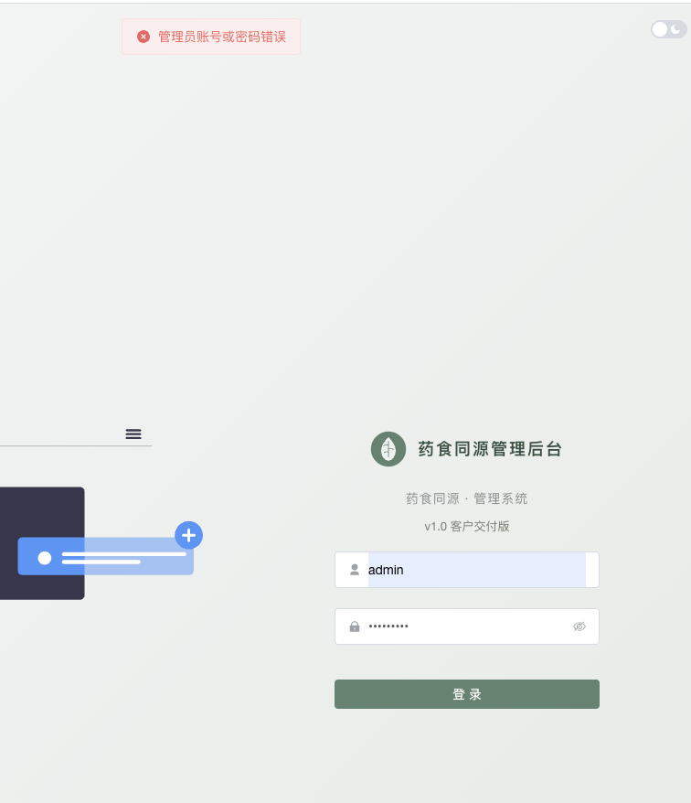

### 6.10 截图清单汇总

| 编号 | 文件名 | 所属用例 | 截图内容 |
|------|--------|----------|----------|
| 1 | `SETUP-01-登录成功.png` | 前置 | Dashboard 首页，左侧菜单，右上角管理员 |
| 2 | `P-01-商品列表.png` | P-01 | 商品列表页，表格+分页 |
| 3 | `P-01-商品筛选.png` | P-01/B-06 | 搜索"阿胶"后筛选结果 |
| 4 | `P-02-商品详情.png` | P-02 | 商品编辑页，基本信息 |
| 5 | `P-02-SKU信息.png` | P-02/P-04 | 编辑页底部「SKU 规格管理」区块 |
| 6 | `P-03-分类列表.png` | P-03 | 分类管理页，树形结构 |
| 7 | `P-05-库存列表.png` | P-05 | 库存管理页 |
| 8 | `P-06-评论列表.png` | P-06 | 评论管理页 |
| 9 | `C-01-Banner列表.png` | C-01 | Banner 管理页 |
| 10 | `C-02-频道列表.png` | C-02 | 频道管理页 |
| 11 | `C-03-品牌列表.png` | C-03 | 品牌管理页 |
| 12 | `C-04-专题列表.png` | C-04 | 专题管理页 |
| 13 | `C-04-关联商品.png` | C-04 | 关联商品选择对话框 |
| 14 | `T-01-订单列表.png` | T-01 | 订单管理页 |
| 15 | `T-01-订单筛选.png` | T-01 | 订单号精确搜索 |
| 16 | `T-02-售后列表.png` | T-02 | 售后管理页 |
| 17 | `T-02-售后详情.png` | T-02 | 售后详情弹窗 |
| 18 | `T-03-支付异常.png` | T-03 | 支付异常工作台 |
| 19 | `T-04-退款异常.png` | T-04 | 退款异常工作台 |
| 20 | `T-05-日终对账.png` | T-05 | 日终对账页 |
| 21 | `M-01-会员列表.png` | M-01 | 会员列表页 |
| 22 | `M-01-会员详情.png` | M-01 | 会员详情抽屉 |
| 23 | `M-02-用户反馈.png` | M-02 | 用户反馈页 |
| 24 | `MK-01-优惠券列表.png` | MK-01 | 优惠券管理页 |
| 25 | `MK-02-满减列表.png` | MK-02 | 满减规则管理页 |
| 26 | `MK-03-包邮列表.png` | MK-03 | 包邮规则管理页 |
| 27 | `S-01-管理员账号.png` | S-01 | 管理员账号页 |
| 28 | `S-02-角色权限.png` | S-02 | 角色权限页 |
| 29 | `S-02-编辑角色弹窗.png` | S-02 | 编辑角色弹窗（接口权限分组） |
| 30 | `S-03-审计日志-操作日志.png` | S-03 | 审计日志操作日志 Tab |
| 31 | `S-03-审计日志-登录日志.png` | S-03 | 审计日志登录日志 Tab |
| 32 | `D-01-数据看板-7天.png` | D-01 | Dashboard 完整截图（7天） |
| 33 | `D-01-数据看板-30天.png` | D-01 | Dashboard 30天趋势 |
| 34 | `D-02-运行监控.png` | D-02 | 运行监控面板 |
| 35 | `B-01-未认证跳转.png` | B-01 | 删除 user-info 后跳转登录页 |
| 36 | `B-02-无效Token跳转.png` | B-02 | 篡改 token 后弹出“登录已过期” |
| 37 | `B-03-商品不存在.png` | B-03 | 地址栏访问不存在商品，弹出错误提示 |
| 38 | `B-04-分页越界.png` | B-04 | Console 执行修改后的 fetch，空 list + total=19 |
| 39 | `B-05-订单不存在.png` | B-05 | Console 执行修改后的 fetch，返回订单不存在错误 |
| 40 | `B-06-错误密码.png` | B-06 | 登录页弹出“账号或密码错误” |

**共需 40 张截图**，截图文件存放于 `docs/acceptance/screenshots/` 目录。

```markdown

```

## 7. 发现的已知问题

| 编号 | 问题 | 严重度 | 说明 |
|------|------|--------|------|
| K-01 | 内容管理状态切换 Bug | 中 | Banner/频道/品牌/专题的启用/禁用开关，前端 `handleStatusChange` 调用全量更新接口，后端执行全量字段校验导致"名称长度不正确"错误。需增加独立的 status-only 更新端点或前端传递完整字段 |
| K-02 | ~~早期演示数据编码问题~~ | ~~低~~ | **已修复** — 通过 `V20260823_01` 迁移脚本修复 ID 240001-240006 及关联表的 UTF-8 双重编码问题，中文名称现已正确显示 |
| K-03 | 分类 update-status 端点为 PUT 方法 | 低 | `POST /admin-api/product/category/update-status` 返回 405，实际应使用 PUT 方法，前端已适配 |
| K-04 | 交易模块分页参数差异 | 低 | 订单/售后使用 `page/size` 参数而非 `pageNo/pageSize`，与其他模块不一致，建议统一 |

## 8. 关联文档

- [v1.0 本地执行验收报告（2026-08-17）](v1.0-acceptance-execution-report-20260817.md) — 上一轮管理后台全功能验收
- [v1.0 最终验收报告](../delivery/v1.0-final-acceptance-report.md) — 客户签收模板
- [v1.0 客户验收清单](../deployment/v1.0-acceptance-checklist.md) — 5 大类验收项
- [小程序商品 API 验收](miniapp-product-api.md) — 小程序端商品接口验收
- [支付退款验收](v1.0-wechat-pay-refund-acceptance.md) — 微信支付/退款用例
- [物流验收](v1.0-logistics-acceptance.md) — 物流接口用例

## 9. 签署区

| 角色 | 姓名 | 结论 | 日期 |
|------|------|------|------|
| API 验收执行人 | — | 42/42 通过 | 2026-08-23 |
| 交付负责人 | 待填写 | 待确认 | 待填写 |
